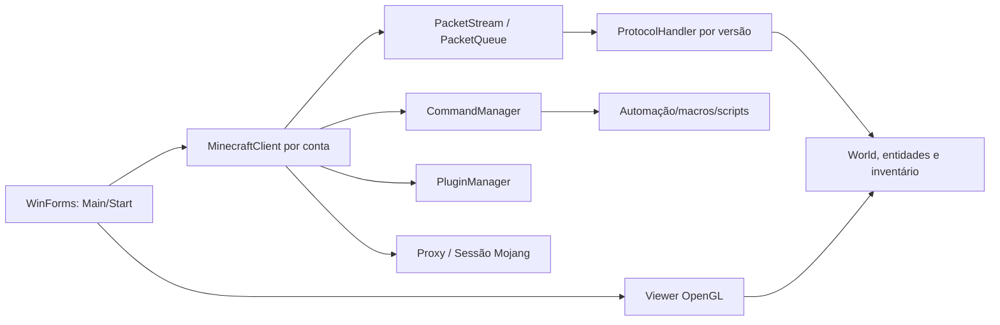

# Arquitetura geral observada

O `Program` centraliza configuração, formulário principal e plugins em estado estático. `Main` mantém a lista de clientes e inicia um loop de UI que chama `MinecraftClient.Tick()`. Cada cliente tem transporte próprio e compartilha serviços globais de interface/configuração.

## Fluxo de sessão

1. A tela `Start` interpreta servidor, contas, proxy, versão e opções.
2. Cria um `MinecraftClient`, que autentica (quando a conta tem e-mail), opcionalmente faz ping e abre TCP.
3. Enfileira handshake/login; `PacketStream` enquadra, comprime e opcionalmente cifra os bytes.
4. O login seleciona `ProtocolHandler`; o handler atualiza estado de jogo, mundo, inventário e jogadores.
5. O tick emite movimento, roda comandos/macros/plugins e recupera conexão quando habilitado.

## Problemas de fronteira a corrigir

Estado estático, UI e domínio estão misturados; exceções são frequentemente descartadas; coleções mutáveis cruzam threads; e plugins recebem referências de implementação. Na nova arquitetura, cada sessão deve ser um agregado isolado e o acesso externo deve acontecer por portas/eventos.
