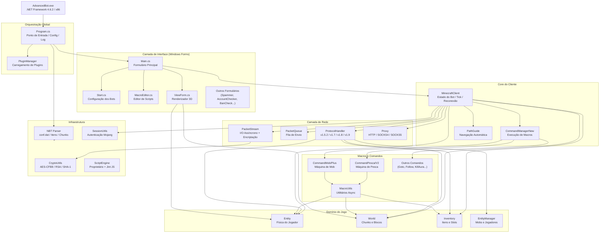
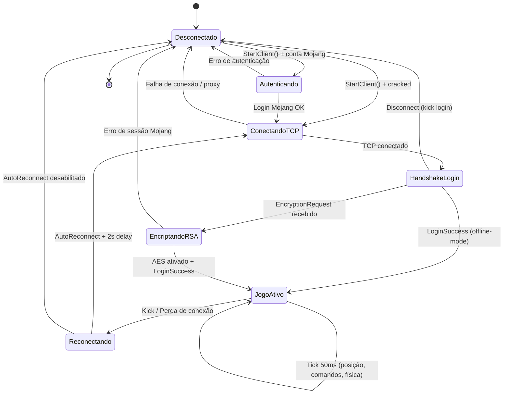
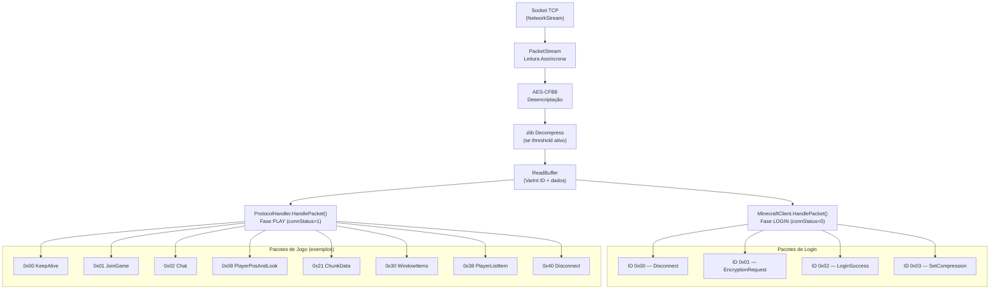
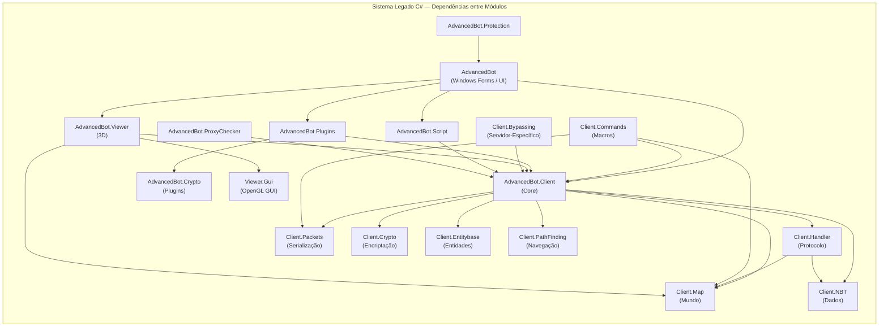
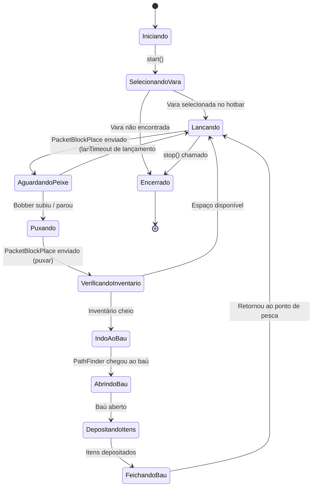
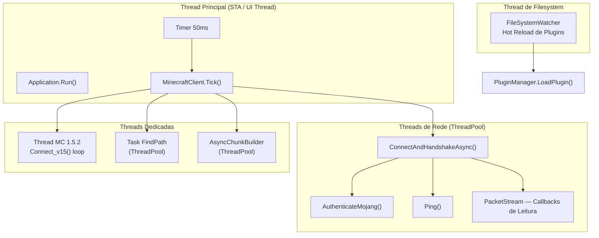
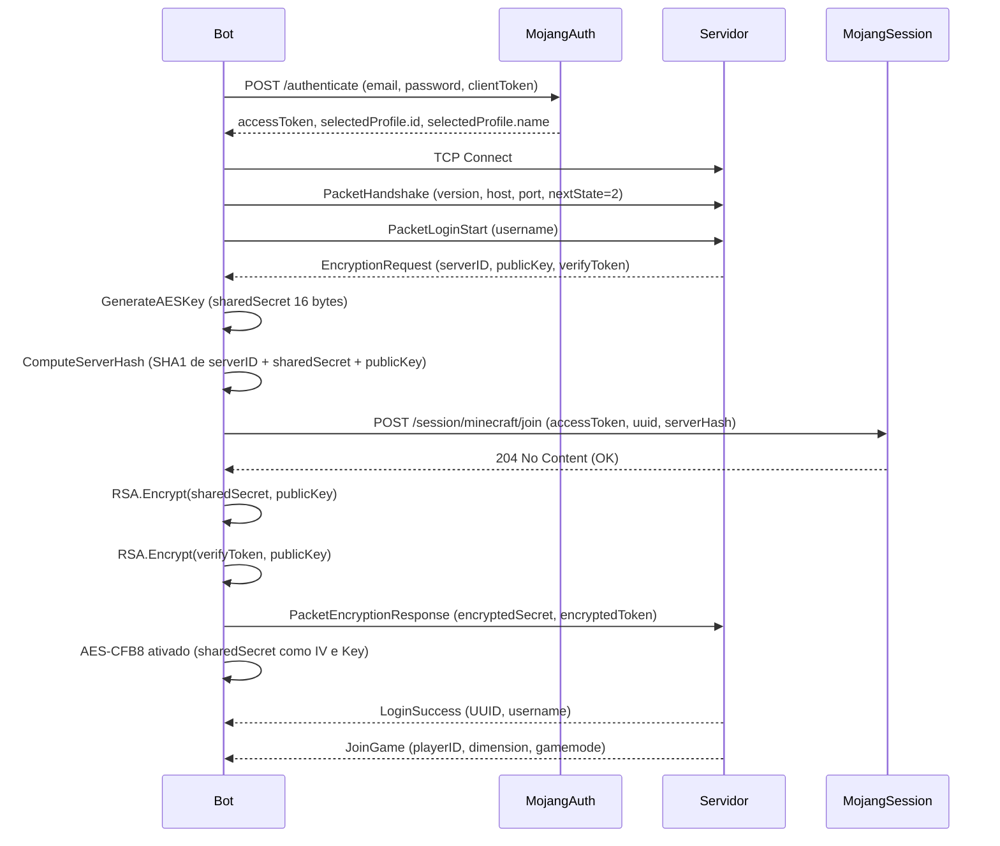
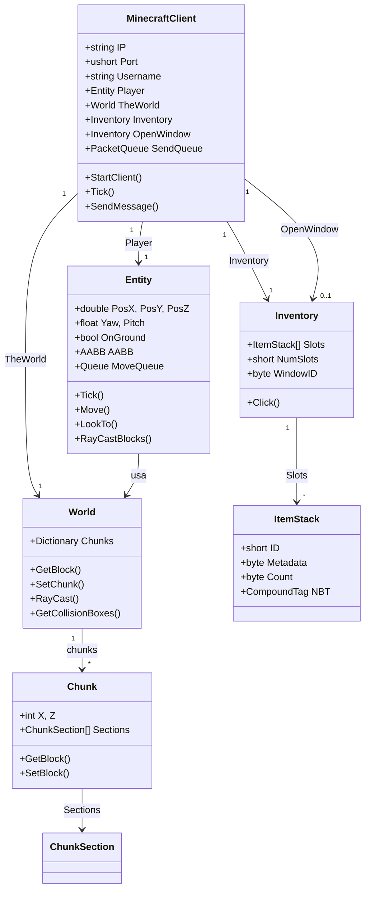

# 07 — Diagrama Arquitetural

---

| Campo              | Valor                                            |
|--------------------|--------------------------------------------------|
| **Código**         | LEG-07                                           |
| **Versão**         | 1.0.0                                            |
| **Status**         | Ativo                                            |
| **Responsável**    | Equipe de Migração AdvancedBot                   |
| **Última Atualização** | 2026-07-14                                   |
| **Tipo**           | Documento Técnico — Diagramas                    |
| **Escopo**         | Arquitetura do sistema legado C#                 |
| **Documento Pai**  | docs/01-Legado-CSharp/00-README.md               |
| **Documentos Relacionados** | LEG-01, LEG-02, LEG-04                 |

---

## Diagrama 1 — Arquitetura Geral do Sistema

---

## Diagrama 2 — Ciclo de Vida de Conexão

---

## Diagrama 3 — Fluxo de Pacotes de Entrada

---

## Diagrama 4 — Módulos e Dependências

---

## Diagrama 5 — Máquina de Estados da Macro de Pesca

---

## Diagrama 6 — Threads do Sistema

---

## Diagrama 7 — Sequência de Autenticação Mojang

---

## Diagrama 8 — Relação entre Entidades do Domínio

