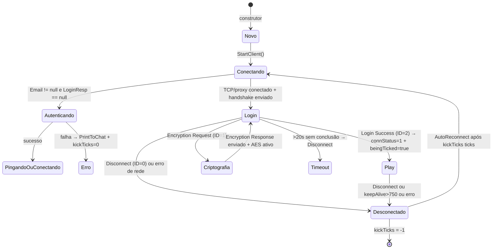
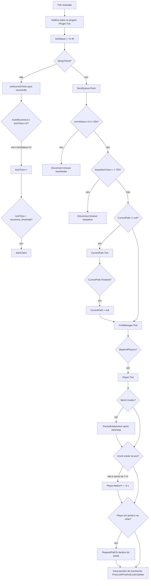

# `MinecraftClient` — orquestrador de sessão

Fonte: `AdvancedBot.Client/MinecraftClient.cs`

---

## Objetivo e papel

`MinecraftClient` é o **agregado central de uma sessão Minecraft**. Cada instância representa uma única conexão ativa e é dona de todos os subsistemas necessários para operar: transporte, protocolo, estado de mundo, jogador, inventário, comandos e automações. É o ponto de entrada para toda decisão de comportamento do bot.

---

## Estado interno completo

### Campos de sessão

| Campo | Tipo | Semântica |
|---|---|---|
| `IP`, `Port` | `string`, `ushort` | endereço do servidor Minecraft |
| `Email`, `Username`, `Password` | `string` | credenciais; `Email` não nulo indica conta premium |
| `LoginResp` | `LoginResponse` | resultado da autenticação Mojang; nulo = offline |
| `ConProxy` | `Proxy` | proxy TCP opcional; nulo = direto |
| `Version` | `ClientVersion` | versão de protocolo configurada (1.5.2, 1.7, 1.8, 1.9) |
| `instanceID` | `int` | índice na lista de sessões da UI; -1 = sem UI |
| `connStatus` | `int` | 0 = login em andamento; 1 = protocolo play ativo |
| `beingTicked` | `bool` | verdadeiro após JoinGame; a sessão está operacional |
| `canLoop` | `bool` | controla o loop do caminho legado 1.5.2 |
| `keepAliveTicks` | `int` | contador de ticks desde o último keepalive recebido |
| `handshakeStart` | `long` | timestamp do início do handshake para timeout de 20 s |
| `kickTicks` | `int` | -1 = inativo; 0+ = contagem para reconexão automática |
| `authmeCounter` | `int` | bits 0–3: tentativas de register; bits 4–7: tentativas de login |

### Campos de subsistema

| Campo | Tipo | Semântica |
|---|---|---|
| `Stream` | `PacketStream` | transporte moderno assíncrono (1.7+) |
| `SendQueue` | `PacketQueue` | fila de saída de pacotes |
| `Handler` | `ProtocolHandler` | instância do handler pela versão |
| `updateThread` | `Thread` | thread do loop síncrono 1.5.2 |
| `TheWorld` | `World` | mapa local de chunks/blocos |
| `Player` | `Entity` | entidade do jogador local com física |
| `Inventory` | `Inventory` | inventário do jogador (45 slots) |
| `OpenWindow` | `Inventory` | janela de container externa aberta |
| `CmdManager` | `CommandManagerNew` | gerenciador de comandos locais |
| `CurrentPath` | `PathGuide` | rota de pathfinding em execução |
| `Entities` | `Dictionary<int, IEntity>` | entidades conhecidas no mundo |
| `PlayersTab` | `Dictionary<string, PlayerTab>` | jogadores na tab list |
| `PlayerManager` | `PlayerManager` | mapeamento UUID → nick |

### Campos estáticos (compartilhados entre sessões)

| Campo | Semântica |
|---|---|
| `AutoReconnect` | habilita reconexão automática global |
| `reconnectType` | estratégia de reconexão |
| `Knockback` | habilita processamento de knockback |
| `MultiPing` | envia 4 pings em vez de 1 |
| `MaximumChatLines` | limite do histórico de chat por sessão |

---

## Máquina de estados da sessão



---

## API pública de método — por categoria

### Ciclo de vida

| Método | Efeito |
|---|---|
| Construtores | classificam email/nick, armazenam destino/proxy, criam `CmdManager`, `World`, `Inventory`. Não conectam. |
| `StartClient()` | ponto de reinício — para loop/stream anterior, zera flags, cria handler, inicia conexão. |
| `Dispose()` / `Dispose(bool)` | desativa loop, limpa mundo, fecha stream, junta/aborta thread. |

### Transporte e protocolo

| Método | Efeito |
|---|---|
| `SendPacket(packet)` | encaminha para `SendQueue.AddToQueue`. |
| `ResetKeepAlive()` | zera `keepAliveTicks`. |
| `GetKeepAlive()` | retorna `keepAliveTicks`. |
| `IsBeingTicked()` | retorna `beingTicked`. |
| `ParseVersion(ver)` | `"1.8"` → `ClientVersion.v1_8`. Retorna `Unknown` se inválido. |

### Estado de jogo

| Método | Chamado por | Efeito |
|---|---|---|
| `HandlePacketJoinGame(playerId, dim, gm)` | handler | seta `beingTicked=true`, envia ClientSettings + MC|Brand, hotbar=0 |
| `HandlePacketRespawn(dim, gm)` | handler | limpa mundo/manager/efeitos |
| `HandlePacketDisconnect(reason)` | handler | `beingTicked=false`, `kickTicks=0`, troca proxy se IP saturado |
| `HandlePacketChat(chat, pos)` | handler | notifica plugins, detecta VIP/login, auto-register/login, imprime no chat |
| `SetHotbarSlot(slot)` | comandos | muda `hslot` sem enviar pacote |
| `HotbarSlot` (setter) | comandos | valida 0–8, enfileira `PacketHeldItemChange` se `beingTicked` |

### Pathfinding

| Método | Efeito |
|---|---|
| `RequestPathTo(x,y,z,errorMsg)` | inicia `Task.Factory.StartNew(FindPath)` — não bloqueia |
| `FindPath(wc)` | executa `PathGuide.Create(Player, x,y,z)` no pool; escreve `CurrentPath` |

---

## `Tick()` — fluxo principal de operação



---

## Automação de autenticação de servidor (authme/CMI)

`HandlePacketChat` detecta mensagens de login automático via `authmeCounter`:

- Bits 0–3: contagem de `/register` tentados (máximo 2).
- Bits 4–7: contagem de `/login` tentados (máximo 2).
- `chat.ContainsIgnoreCase(CmdRegister.Substring(0, CmdRegister.IndexOf(' ')))` → envia `CmdRegister` substituindo `@email` por nick aleatório.
- `chat.ContainsIgnoreCase(CmdLogin.Substring(0, CmdLogin.IndexOf(' ')))` → envia `CmdLogin`.
- Detecta mensagem de login bem-sucedido (texto hardcoded de Craftlandia) → `LoggedIn=true`, envia `/vip`.

**Problema:** texto de detecção de login é hardcoded para Craftlandia — não é configurável.

---

## Reconexão automática

Quando `kickTicks >= 0` e `AutoReconnect = true`:
- A cada `tickStatus == 0` (a cada 40 ticks), incrementa `kickTicks`.
- Quando `kickTicks` ultrapassa o limiar configurado por `reconnectType`, chama `StartClient()`.
- Troca proxy automaticamente em erros de rede (`SocketException`, `IOException`) quando `ConProxy != null`.

---

## Relação com protocolo Minecraft

- **JoinGame → `beingTicked=true`**: a sessão só é operacional após Join Game. Ticks antes disso são ignorados para física/comandos.
- **Keep-alive**: contador por ticks, não por tempo real. Threshold = 750 ticks ≈ variável conforme cadência de `Tick()`.
- **Chat**: `HandlePacketChat` recebe texto já parseado pelo handler; posição 2 = action bar (descartada do histórico).
- **ClientSettings** enviado ao Join Game com view distance = 8.
- **MC|Brand** enviado com payload `"sexo"` (string literal hardcoded).

---

## Acoplamentos críticos

| Dependência | Acoplamento |
|---|---|
| `Program.pluginManager` | estático — callbacks de plugin acessados diretamente |
| `Program.FrmMain` | estático — `Proxies.NextProxy()` e `DebugConsole` |
| `Program.FrmMain.Proxies` | troca de proxy em erros |
| `NickGenerator` | geração de e-mail aleatório para register |
| `Utils.GetTickCount64()` | medição de tempo para timeout de handshake |

---

## Problemas arquiteturais

1. **Campos estáticos por instância**: `AutoReconnect`, `Knockback`, `MaximumChatLines` são compartilhados por todas as sessões — mudar para uma sessão muda para todas.
2. **`beingTicked` sem sincronização**: escrito pelo callback de rede e lido pelo tick sem `volatile` ou lock.
3. **Texto hardcoded de Craftlandia**: `HandlePacketChat` tem regras específicas de servidor que não deveriam estar no núcleo do cliente.
4. **`kickTicks` resetado a 0 em vários lugares**: lógica de reconexão distribuída entre métodos sem estado explícito.
5. **`FindPath` escreve `CurrentPath` de outra thread**: a Task escreve em `CurrentPath` enquanto o tick lê — race sem lock.
6. **Loop legado 1.5.2**: `Connect_v15` usa `Thread.Sleep(10)` como loop principal — ineficiente e sem yield cooperativo.

---

## Java

```java
public class BotSession implements Disposable {
  // Por sessão — não estático
  private boolean autoReconnect;
  private boolean knockback;
  private int maxChatLines;

  // Estado da máquina
  private volatile SessionState state = SessionState.CREATED;

  // Subsistemas por instância
  private final WorldState world;
  private final BotPlayer player;
  private final Inventory inventory;
  private final CommandDispatcher commands;
  private final SessionTransport transport;

  // Executor serial — elimina necessidade de locks internos
  private final ScheduledExecutorService tickExecutor =
    Executors.newSingleThreadScheduledExecutor();

  public void start() {
    tickExecutor.scheduleAtFixedRate(this::tick, 0, 50, TimeUnit.MILLISECONDS);
  }

  private void tick() {
    // Toda lógica de tick aqui — thread-safe por serialização
    transport.flush();
    checkTimeouts();
    currentPath.ifPresent(PathGuide::tick);
    commands.tick();
    if (physicsEnabled) player.tick(world);
    emitMovementPackets();
  }

  public enum SessionState {
    CREATED, AUTHENTICATING, CONNECTING, LOGIN, PLAY, DISCONNECTED, STOPPED
  }
}
```
