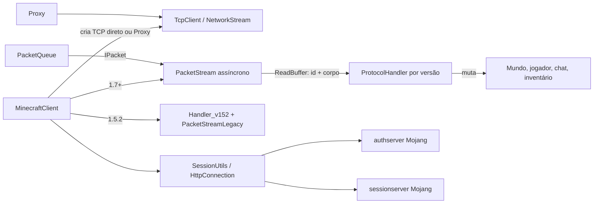
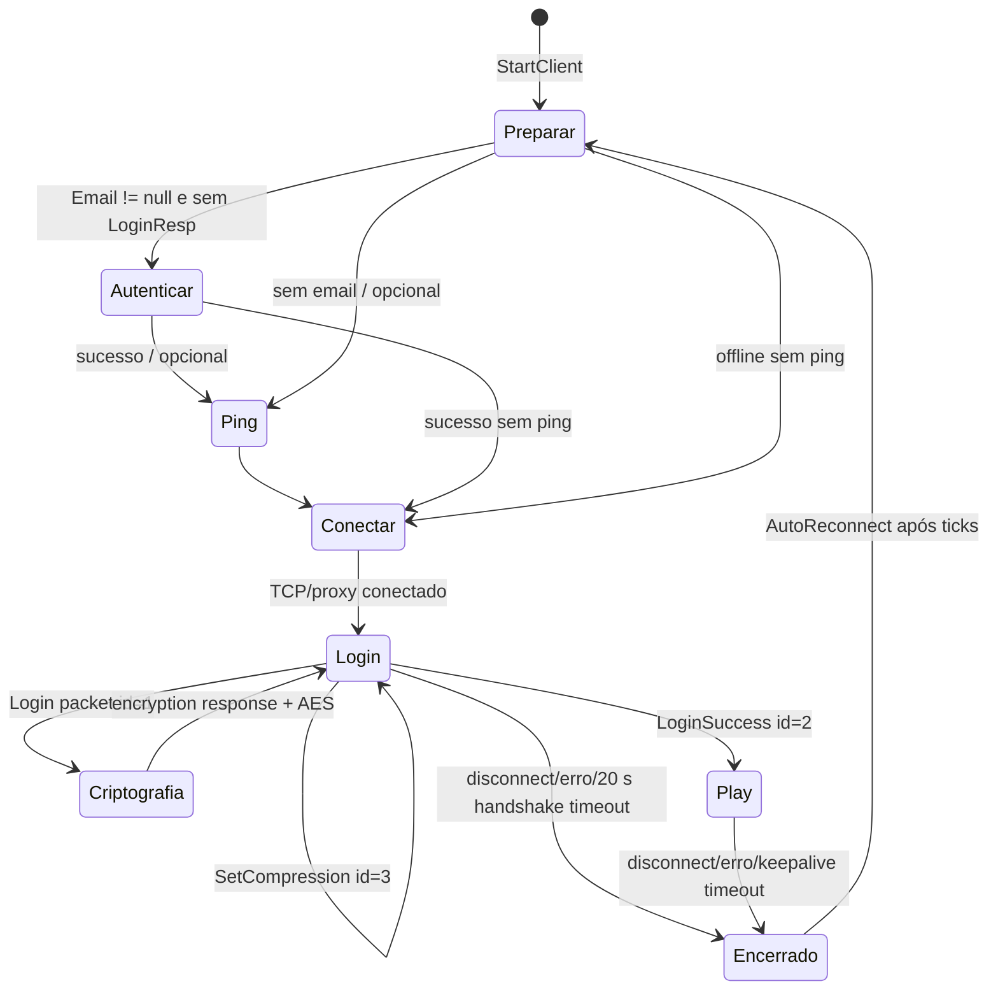

# Sistema de rede e protocolo Minecraft

Fontes primárias: `AdvancedBot.Client/{MinecraftClient,PacketStream,PacketQueue,MinecraftStream,ReadBuffer,WriteBuffer,Proxy,HttpConnection,HttpResponse,SessionUtils,LoginCache,LoginResponse}.cs`, `AdvancedBot.Client.Handler/*` e `AdvancedBot.Client.Packets/*`. O escopo é somente o caminho de rede: TCP/proxy/HTTP, autenticação, framing, serialização, handlers e os pacotes de chat, movimento e inventário.

## Visão da arquitetura observada

Há uma sessão por `MinecraftClient`; estado de plugins, métricas, autenticação em cache e configuração permanecem globais. A família do protocolo é selecionada uma única vez em `StartClient()` via `ProtocolHandler.Create(Version, this)`: 1.5.2 → `Handler_v152`; 1.7/1.7.10 → `Handler_v17`; 1.8 → `Handler_v18`; 1.9 → `Handler_v19`. Não existe handler para qualquer outra versão.

## Classes e responsabilidades

| Classe | Responsabilidade de rede | Estado relevante / dependências |
|---|---|---|
| `MinecraftClient` | Orquestrador da sessão. Autentica, abre o socket, envia handshake/login, mantém estado de login/jogo, entrega pacotes ao handler e executa timeout/reconexão. | `Stream: PacketStream`, `SendQueue`, `Handler`, `ConProxy`, `connStatus`, `keepAliveTicks`, `handshakeStart`, `beingTicked`, `canLoop`; mundo, jogador, inventário e chat são os destinos dos handlers. |
| `PacketStream` | Transporte moderno assíncrono (1.7+): reagrupa bytes de `Stream.BeginRead`, decifra, enquadra, descomprime e emite `OnPacketAvailable`; no sentido contrário enquadra/comprime/cifra. | buffer acumulador, posição, limite de compressão, transforms AES, `IsConnected`; eventos `OnPacketAvailable(ReadBuffer)` e `OnError(Exception)`. |
| `PacketQueue` | Fila FIFO concorrente da saída. É a única rota normal de `IPacket` para `PacketStream`. | `ConcurrentQueue<IPacket>`, `sending`, versão capturada no construtor, `WriteBuffer` reutilizado. Invoca plugins antes do enfileiramento. |
| `MinecraftStream` | Transporte síncrono moderno usado exclusivamente pelo ping de status. Implementa framing, compressão e AES em `NetworkStream`, sem eventos. | `TcpClient`, `NetworkStream`, `AesStream`, `Encrypted`, `CompressionThreshold`. |
| `PacketStreamLegacy` | Codec/framing de 1.5.2, usado pelo handler legado sobre `NetworkStream`. IDs são bytes e os formatos são específicos da versão. | Pertence à rota síncrona de `Handler_v152`; não participa de `PacketStream`. |
| `ReadBuffer` / `WriteBuffer` | Leitores/escritores binários de payload moderno. Não conhecem sockets; o primeiro constrói `ID` lendo o VarInt inicial. | array mutável e cursor; NBT, `ItemStack`, UUID e `Vec3i` são serializados aqui. |
| `ProtocolHandler` | Porta de compatibilidade por versão. Expõe `HandlePacket` (entrada) e `WritePacket` (remapeia/serializa saída). | referências derivadas para cliente, fila, mundo e jogador. |
| `Handler_v152` | Implementação completa legada: lê byte-ID, interpreta muitos formatos pré-1.7 e escreve os IDs/formato 1.5.2. | socket próprio, loop em thread, codec legado. |
| `Handler_v17` | Interpreta play packets 1.7/1.7.10; não sobrescreve serialização de saída, portanto os `IPacket` usam seus ramos pré-1.8. | atualiza mundo/entidades/inventário e responde keep-alive. |
| `Handler_v18` | Implementação base de 1.8 para play, mundo, entidades, inventário, chat e player list. | lê IDs VarInt; escreve padrão dos `IPacket`. |
| `Handler_v19` | Adaptador 1.9: remapeia parte dos IDs de entrada para a semântica 1.8, implementa diferenças de teleporte/chunk/entidades e remapeia IDs de saída. | herda `Handler_v18`; não é um codec completo independente. |
| `Proxy` | Estabelece túnel TCP direto por SOCKS4, SOCKS5 ou HTTP CONNECT, inclusive via APM (`BeginConnect`/`EndConnect`). | IP, porta e tipo; não há autenticação de proxy. |
| `HttpConnection` / `HttpResponse` | Cliente HTTP manual para autenticação. Abre TCP (possivelmente pelo proxy), negocia TLS para porta 443, escreve request e lê resposta/chunks/compressão. | `Uri`, cabeçalhos mutáveis e proxy; sem pool, timeout explícito ou redirecionamento. |
| `SessionUtils`, `LoginCache`, `LoginResponse` | Login Mojang, refresh de token cacheado e chamada `join` durante a criptografia online. | cache estático em `login_cache.bin`; tokens persistidos em texto/binário sem criptografia adicional. |

## Socket, proxy e HTTP

### Criação de socket

Para login/ping 1.7+, `MinecraftClient` usa `new TcpClient(IP, Port)` na rota síncrona ou `TcpClient.BeginConnect` na rota normal assíncrona. Se `ConProxy` não for nulo, substitui isso por `Proxy.Connect` ou `Proxy.BeginConnect`. Ao conectar, define `ReceiveTimeout`/`SendTimeout` como 30 s no jogo moderno; ping usa 5 s; SOCKS4/HTTP usam 5 s e SOCKS5 2 s durante a negociação. O socket do jogo não configura keep-alive TCP.

`Proxy` implementa:

- SOCKS4 CONNECT: monta `04 01 <porta big-endian> <IPv4> 00`; resolve DNS localmente para IPv4; exige código de resposta 90.
- SOCKS5 sem autenticação: oferece somente método `00`; envia CONNECT com endereço IPv4, IPv6 ou domínio ASCII; exige resposta `REP=0` e descarta endereço/porta vinculados retornados.
- HTTP CONNECT: escreve `CONNECT host:porta HTTP/1.1` e `Host`; aceita qualquer status 2xx e rejeita resposta que declare `Content-Length > 0`.

O caminho assíncrono é uma máquina de passos em `ConnectAsyncResult` (`connStep`, buffer de 64 bytes, tipo/endereço resolvido). `EndConnect` retorna o `TcpClient` ou expõe `error` em vez de relançar. Ele mistura callbacks APM com estado mutável e não expõe `WaitHandle` funcional (`AsyncWaitHandle` retorna `null`).

`HttpConnection` abre novo socket para cada request. Para HTTPS, encapsula o stream em `SslStream` e chama `AuthenticateAsClient` com host/DNS safe host, sem callback próprio de validação de certificado. Para proxy HTTP, o CONNECT é criado primeiro pelo mesmo `Proxy`. As requests são HTTP/1.1 manuais com User-Agent fixo `Java/1.8.0_66`, `Connection: keep-alive`, mas os sockets/respostas não são reutilizados. Suporta `Content-Length`, `Transfer-Encoding: chunked` e `Content-Encoding` `deflate`/`gzip`; não processa redirecionamento, códigos HTTP como erro ou corpo sem tamanho/chunked.

## Serialização binária

Todos os inteiros fixos do protocolo moderno são big-endian. `ReadBuffer` faz acesso direto ao array para byte/short/int/long; o limite é verificado apenas em `ReadByteArray(len)`, não nas leituras escalares. `WriteBuffer` começa com 16 bytes e cresce para `2*capacidade + n` quando necessário.

| Tipo | Escrita/leitura observada |
|---|---|
| VarInt | grupos de 7 bits, LSB primeiro, bit 0x80 de continuação, máximo cinco bytes; escrever converte `int` para `uint`, portanto negativos ocupam cinco bytes. Leitura acima de cinco bytes lança exceção. |
| `byte`, `sbyte`, `bool` | um octeto; booleano aceita qualquer valor diferente de zero na leitura e escreve 0/1. |
| `short`, `ushort`, `int`, `long` | big-endian. |
| `float`, `double` | bits IEEE-754 transferidos como `int`/`long` big-endian via ponteiro unsafe. |
| `string` | VarInt do número de bytes + UTF-8, sem limite próprio. |
| posição | um `long`: X 26 bits em 38..63, Y 12 em 26..37 e Z 26 em 0..25; leitura faz extensão de sinal para X/Z. |
| UUID | dois `long`: `HiBits`, `LoBits`. |
| NBT opcional | byte zero significa ausente; caso contrário o byte já lido inicia `NbtIO.Read`. |
| `ItemStack` moderno | `short id`; `-1` representa nulo; caso contrário `byte count`, `short metadata`, NBT opcional. |

Para 1.7 e anteriores, onde os pacotes chamam `Handler_v17.WriteItemStack`, o formato histórico é delegado ao handler, não ao `WriteBuffer` moderno. `Handler_v152` possui também seus próprios métodos de string, NBT, item e números; não se deve reutilizar o codec moderno para 1.5.2 na reescrita.

## Framing, compressão e criptografia (1.7+)

Payload significa `VarInt packetId + campos do IPacket`. `PacketQueue.Flush()` serializa um `IPacket` num `WriteBuffer`; se a versão não é 1.5.2 chama `PacketStream.SendPacket`.

Sem compressão (`CompressionThreshold < 0`), a moldura no fio é `VarInt(payload.length) + payload`. Com compressão habilitada:

- se `payload.length < threshold`: `VarInt(payload.length + 1) + byte 0 + payload`;
- caso contrário: `VarInt(compressed.length + tamanho-do-VarInt(uncompressed.length)) + VarInt(uncompressed.length) + zlib(payload)`;
- a compressão é zlib `BestSpeed`.

Na recepção, `PacketStream` acumula callbacks de leitura em buffer iniciado com 8192 bytes. Só processa quando o VarInt de comprimento está completo; rejeita frame declarado acima de 2 MiB. Com compressão, zero no campo `dataLength` significa conteúdo não comprimido; outro valor faz `ZlibStream.UncompressBuffer`. O resultado sempre vira `new ReadBuffer(bytes, readId: true)`, que consome o ID VarInt antes de disparar `OnPacketAvailable`.

`PacketStream.InitEncryption(key)` cria encryptor e decryptor por `CryptoUtils.GenerateAES(key)` após o encryption response. Cada bloco lido é transformado antes do parsing e cada frame pronto é transformado antes de `BeginWrite`. Como os transforms são mantidos, a posição de cifra é contínua entre pacotes, conforme o fluxo Minecraft; os buffers auxiliares crescem sob demanda. Falhas em leitura/escrita/cifra mudam `IsConnected=false` e disparam `OnError`; não há distinção tipada entre EOF, protocolo inválido e I/O.

`UnsafeDirectPacket` é exceção deliberada: `PacketQueue.Flush()` ignora `WritePacket` e envia seus bytes diretamente por `PacketStream.Write`; portanto eles já devem estar enquadrados/formatados para o ponto do stream onde são usados.

## Máquina de estados: conexão e login

`StartClient` limpa flags de login, para conexão/thread anterior, limpa UUIDs e cria o handler. Para 1.5.2 abre a thread `MC152 {Username}` executando `Connect_v15`. Nas demais versões `ConnectAndHandshakeAsync` pode encadear até três chamadas: autenticação em worker do ThreadPool, ping em worker e abertura APM do socket. Ao final do callback, cria `PacketStream`, `PacketQueue`, enfileira `PacketHandshake((int)Version, IP, Port, 2)` e `PacketLoginStart(Username)`, força `Flush`, define `connStatus=0`, zera keep-alive, registra início do handshake e assina os eventos do stream.

Enquanto `connStatus==0`, `MinecraftClient.HandlePacket` aceita apenas:

| ID login cliente-bound | Tratamento |
|---|---|
| 0 | lê JSON chat, trata desconexão e fecha stream. |
| 1 | encryption request: exige `LoginResp` (rejeita servidor offline nesse ponto), lê `serverId`, chave RSA e verify token; gera segredo AES, chama session `join`, cifra segredo/token com RSA PKCS#1 v1.5, envia `PacketEncryptionResponse`, faz flush e só então inicia AES no `PacketStream`. |
| 2 | login success: lê e descarta UUID/nome, muda `connStatus=1`. |
| 3 | set compression: atualiza `Stream.CompressionThreshold` com VarInt. |

Qualquer outro ID lança `InvalidDataException`. O handshake expira se, durante `Tick`, ainda estiver em `connStatus=0` 20 000 ms após `handshakeStart` — mas o teste só é feito quando `beingTicked` é verdadeiro, que normalmente é definido pelo Join Game.

### Autenticação Mojang e cache

`SessionUtils.Login(email,password,proxy)` primeiro pede ao `LoginCache` um token pelo e-mail/nome e tenta `POST /refresh` com `accessToken`, `clientToken`, `requestUser=true`. Cache válido é atualizado e devolvido. Sem cache ou refresh inválido, faz `POST /authenticate` com `{agent:{name:"Minecraft",version:1}, username, password, clientToken: GUID}`. A resposta sem `error` fornece `clientToken`, `accessToken`, profile UUID/nome e é persistida; qualquer exceção retorna `LoginResponse.Error=true` e conserva a exceção em `AuthError`.

`CheckSession` faz `POST /session/minecraft/join` com `accessToken`, UUID em `selectedProfile` e `serverHash`; não interpreta status/resposta. `LoginCache` grava `login_cache.bin`: `Int32 quantidade`, então para cada item `byte 1`, cinco strings .NET (`username,email,accessToken,clientToken,uuid`) e `Int64 ticks`. Em `Save`, descarta entradas mais antigas que aproximadamente um mês (de 01/02 até 01/01 do ano 1). Tokens não são criptografados. 

## Handlers de entrada

Todos retornam `false` no disconnect para que `MinecraftClient` deixe `beingTicked=false`; os demais pacotes ignorados/sem case retornam `true`. Eles não têm lista de eventos própria: efeitos são chamadas diretas a `MinecraftClient`, `World`, `Inventory` e coleções de entidades.

| Família | Entrada mapeada de interesse | Efeito |
|---|---|---|
| 1.5.2 (`Handler_v152`) | keep alive 0, login 1, chat 3, position/look 13, held item 16, chunks 51/56, janelas 100–108, plugin message 250 | Lê ID byte e formato legado; responde keep-alive, chama join/respawn/chat, sincroniza mundo e inventário. Escreve todos os client packets usando IDs byte históricos. |
| 1.7 (`Handler_v17`) | keep alive 0, join 1, chat 2, health 6, respawn 7, player pos/look 8, held item 9, open/close/set slot/window items/transaction 45–50, player list 56, disconnect 64 | Usa `ReadBuffer`; mesmos efeitos gerais da 1.8, com IDs/tipos 1.7. `WritePacket` retorna `false`, deixando cada `IPacket` executar seu ramo pré-1.8. |
| 1.8 (`Handler_v18`) | 0 keepalive; 1 join; 2 chat; 6 health; 7 respawn; 8 player pos/look; 9 held item; 12 spawn player; 18 velocity; 19 destroy entities; 21–25 movimentos de entidades; 33–39 chunks/blocos/explosão; 45–50 inventário; 56 player list; 64 disconnect; 69 plugin message | Implementação base detalhada abaixo. |
| 1.9 (`Handler_v19`) | Remapeia IDs 31→0, 35→1, 15→2, 62→6, 51→7, 55 held item, 19→open window, 18→close, 22→set slot, 20→window items, 17→transaction, 26 disconnect; trata teleporte 46 e chunks 32. | Reutiliza handler 1.8 quando a estrutura ainda serve; em teleporte lê ID e envia confirmação. |

### Efeitos 1.8/1.9 em chat, movimento e inventário

**Chat.** O ID 2 1.8 lê componente JSON string, normaliza por `ChatParser.ParseText`, lê posição e chama `HandlePacketChat`. Este chama `IPlugin.onReceiveChat`, atualiza regras específicas (VIP/login automático), descarta mensagem na posição 2 para o histórico e para as outras chama `PrintToChat`. A saída é `SendMessage`: dispara `IPlugin.onSendChat`; prefixo `$` é comando local, caso contrário `PacketChatMessage`. O construtor e o chamador truncam texto a no máximo 99 caracteres quando a entrada tem mais de 100 (logo 100 caracteres permanece 100); o formato é ID clientbound 1 no 1.8, `VarInt(byteLength)+UTF-8`.

**Keep-alive.** 1.7 lê ID como `int`; 1.8 como VarInt; 1.9 reusa o parser 1.8 após remapear. Em todos os casos entra `PacketKeepAlive` com o mesmo valor e `ResetKeepAlive()` zera o contador. No `Tick`, o contador é incrementado e maior que 750 desconecta. A unidade depende da cadência externa de ticks, não é um relógio de rede. A saída usa ID 0 no 1.8, VarInt a partir de 1.8 e `int` antes; 1.9 remapeia o ID.

**Movimento local.** A cada `Tick` com `MapAndPhysics`, depois de `Player.Tick`, compara flags `IsPositionChanged` e `IsRotationChanged`: ambos → `PacketPosAndLook`; só posição → `PacketPlayerPos`; só rotação → `PacketPlayerLook`; nenhum → `PacketUpdate`. Antes, mudança de sprint emite `PacketEntityAction`. Posição guarda `X`, `Y` e `FeetY=Y-1.62`; em 1.8+ transmite X, FeetY, Z, onGround; pré-1.8 transmite também Y. O servidor 1.8 no ID 8 aplica offsets relativos pelos bits 1/2/4/8/16, zera a componente de velocidade se absoluta, atualiza posição/rotação e responde um `PacketPosAndLook` com `onGround=false`. No 1.9 (ID 46) faz o mesmo, lê teleport ID e emite `PacketTeleportConfirm`.

**Inventário.** Em 1.8, open window 45 cria `OpenWindow` com id, tipo, título JSON normalizado, slot count e entidade opcional Horse; fecha 46 se os IDs coincidirem e zera `Inventory.ClickedItem`. Set slot 47 atualiza inventário do jogador para janela 0; em janela externa, slots após `NumSlots` são convertidos para o inventário principal com índice `slot - NumSlots + 9`. Window items 48 aplica a mesma conversão para todos os stacks. Transaction 50, se `accepted=false`, enfileira confirmação positiva com o mesmo window/action. O cliente envia `PacketClickWindow`, `PacketCloseWindow`, `PacketCreativeInvAction`, `PacketHeldItemChange` e `PacketConfirmTransaction`, usando `ItemStack` e tipos definidos acima. Não há validação local de consistência, timeout de transação nem rollback.

## Pacotes enviados pelo cliente

Os `IPacket` são DTOs mutáveis com um único método `WritePacket`. Para 1.8 eles iniciam com o ID abaixo; 1.9 delega `Handler_v19.WritePacket`, que troca IDs/diferenças antes do fallback; 1.5.2 delega completamente `Handler_v152.WritePacket`; 1.7 usa o ramo `< 1.8` de cada classe.

| Pacote | ID base 1.8 / campos e regra |
|---|---|
| `PacketHandshake` | 0: protocol version VarInt, host string, porta ushort, next state VarInt. Usado com estado 2 (login) ou 1 (status ping). |
| `PacketLoginStart` | 0 no estado login: nome string. |
| `PacketEncryptionResponse` | 1: segredo e token cifrados, cada um com comprimento `short` antes de 1.8 e VarInt em 1.8+. |
| `PacketKeepAlive` | 0: ID `int` pré-1.8, VarInt 1.8+. |
| `PacketChatMessage` | 1: string; construtor trunca somente entradas acima de 100 para 99. |
| `PacketUseEntity` | 2: entity ID/ação como VarInt 1.8+, `int`/byte antes. |
| `PacketUpdate` | 3: boolean onGround. |
| `PacketPlayerPos`, `PacketPlayerLook`, `PacketPosAndLook` | 4, 5, 6: combinações de double posição, float yaw/pitch e boolean onGround. |
| `PacketPlayerDigging`, `PacketBlockPlace`, `PacketUseItem`, `PacketSwingArm` | 7, 8, 29 (1.9+), 10: escavação, clique/uso de bloco/item e animação. `PacketUseItem` escreve literalmente `29,0`. |
| `PacketHeldItemChange`, `PacketEntityAction` | 9, 11: slot `short`; entidade/ação/jump boost. |
| `PacketCloseWindow`, `PacketClickWindow`, `PacketConfirmTransaction`, `PacketCreativeInvAction` | 13–16: IDs/slot/botão/action/mode e `ItemStack` quando aplicável. |
| `PacketClientSettings`, `PacketClientStatus`, `PacketPluginMessage` | 21–23: locale/visão/chat; ação; canal e bytes. Join Game envia settings(8) e plugin `MC|Brand` com string `sexo`. |
| `PacketTeleportConfirm` | 0 no play 1.9: teleport ID VarInt. |
| `UnsafeDirectPacket` | sem serialização: seus bytes são escritos diretamente, fora do framing padrão da fila. |

`PacketQueue.AddToQueue` chama `IPlugin.OnSendPacket(packet, client)` antes de enfileirar. `Flush` não possui `try/finally`: se serialização/escrita lançar, `sending` pode permanecer `true` e bloquear todos os flushes posteriores. `ConcurrentQueue.Count` é consultado antes do `TryDequeue`, logo apenas melhor esforço sob concorrência.

## Problemas observáveis, abstrações futuras e requisitos Java

- Preserve a separação de versões. Uma porta `MinecraftProtocolCodec` por versão/fase deve conservar IDs, larguras, ordem dos campos e peculiaridades de 1.5.2; não use uma tabela “unificada” que masque diferenças.
- Transforme a máquina implícita em estados explícitos (`DISCONNECTED`, `AUTHENTICATING`, `CONNECTING`, `LOGIN`, `PLAY`, `CLOSING`), mas mantenha as transições: Set Compression vale antes dos próximos frames, AES vale após encryption response, e play somente após Login Success.
- O callback de leitura modifica mundo/inventário/entidades diretamente, enquanto UI/tick também os acessam. Java precisa de um executor serial por sessão ou locks compatíveis; mudar a ordem de aplicação de pacotes altera comportamento.
- Reproduza limites relevantes: frame de no máximo 2 MiB, VarInt de no máximo cinco bytes, chat truncado como implementado, timeouts e resposta imediata de keep-alive/transaction.
- Não persista tokens em claro numa reescrita nova, mas crie importador de `login_cache.bin` isolado se compatibilidade for exigida. O cliente atual não fecha recursos HTTP em todos os caminhos e silencia diversas falhas; telemetria Java deve registrar a causa sem transformar erros antes ignorados em mudança funcional.
- Proxies não autenticados, HTTP manual e APM são detalhes de implementação. Modele interfaces `SocketDialer`, `ProxyTunnel`, `SessionAuthenticator`, `FrameCodec` e `PlayHandler`; os contratos de bytes e os efeitos sobre estado são a parte que deve ser reproduzida.

## API, eventos e estado interno por classe

Esta seção completa o mapa anterior com os métodos que constituem a superfície de cada classe de rede. Métodos de serialização de cada `IPacket` já estão descritos em “Pacotes enviados pelo cliente”; todos implementam `IPacket.WritePacket(WriteBuffer, MinecraftClient)` e não possuem leitura própria.

### `MinecraftClient`: orquestração de sessão

| Método | Visibilidade | Efeito de rede / transição |
|---|---|---|
| construtores | público | Classificam o identificador como e-mail por regex ou como nickname, armazenam destino/proxy e criam `CommandManagerNew`, `World` e inventário de 45 slots. Não conectam. |
| `StartClient()` | público | Ponto de reinício. Para loop/stream anterior, zera estado de conexão, limpa UUIDs, instancia handler e escolhe thread 1.5.2 ou fluxo assíncrono moderno; depois comunica plugins. |
| `Connect_v15()` | privado | Caminho bloqueante 1.5.2: autentica se necessário, abre TCP/proxy, configura fila sem `PacketStream`, faz handshake legado e executa loop de leitura até 128 pacotes disponíveis, flush e sleep 10 ms. |
| `ConnectAndHandshake()` | privado | Caminho moderno síncrono de apoio: limpa mundo/jogador, autentica/pinga, abre socket, cria transporte/fila, envia handshake/login e assina callbacks. |
| `ConnectAndHandshakeAsync(callDepth, flags)` | privado | Caminho normal 1.7+: limita recursão a 3; flags 1/2/4 marcam limpeza, autenticação e ping já realizados. Autenticação/ping ocorrem no ThreadPool, e TCP/proxy usa APM. |
| `ConnectCallback(IAsyncResult)` | privado | Consome `EndConnect`, aplica timeout 30 s, cria `PacketStream` e fila, envia handshake/login, registra callbacks e muda para `connStatus=0`. |
| `AuthenticateMojang()` | privado | Chama `SessionUtils.Login`; em sucesso grava nickname autenticado, em erro publica mensagem e encerra esta tentativa. |
| `HandlePacket(ReadBuffer)` | privado | Máquina de login quando `connStatus=0`; após `LoginSuccess`, delega o play inteiro a `Handler.HandlePacket`. |
| `SendPacket(IPacket)` | público | Encaminha o DTO para `SendQueue`; não envia de forma imediata. |
| `ResetKeepAlive()` / `GetKeepAlive()` | público | Zera ou expõe o contador de ticks desde o último keep-alive recebido. |
| `Ping()` | privado | Abre conexão independente, envia handshake status, status request e valida minimamente a resposta. Não mede nem armazena latência. |
| `Disconnect(...)` / `HandlePacketDisconnect(reason)` | privado/público | Limpam mundo/flags e, no segundo, imprimem motivo, zeram estado de player manager e podem selecionar próximo proxy para texto específico. |
| `Tick()` | público | Esvazia saída, aplica timeouts de handshake/keep-alive, executa path/comandos e gera pacotes de movimento. Se desconectado, habilita reconexão automática após a contagem configurada. |
| `PrintToChat` / `SendMessage` / `HandlePacketChat` | público | Entradas e saídas do chat: mantém lista limitada, notifica plugins e aplica automações específicas de mensagens. |
| `Dispose(bool)` / `Dispose()` | público | Desativa loop, limpa mundo, fecha stream e tenta juntar/abortar thread antiga. |

Campos que definem a máquina: `connStatus=0` significa login pendente; `connStatus=1` significa protocolo play ativo. `beingTicked` torna a sessão operacional para o loop de tick; `canLoop` controla o loop legado; `kickTicks`, `AutoReconnect` e `reconnectType` controlam a tentativa posterior. `Stream`, `SendQueue` e `Handler` só são válidos após criar o transporte da tentativa atual.

### `PacketStream`: eventos e transições de I/O

Eventos públicos:

| Evento | Emissor | Assinante no cliente | Contrato |
|---|---|---|---|
| `OnPacketAvailable(ReadBuffer)` | callback de leitura, um disparo por frame completo | `MinecraftClient.HandlePacket` | payload já foi decifrado/descomprimido e `ReadBuffer.ID` já foi retirado. |
| `OnError(Exception)` | qualquer exceção de leitura, escrita ou cifra | delegado no estabelecimento da sessão | `IsConnected` já foi definido como `false`; a exceção não é relançada por essa classe. |

Estados internos: `ativo sem cifra` → `ativo com cifra` após `InitEncryption`; opcionalmente `compressão ativa` quando o login atualiza `CompressionThreshold`; qualquer exceção ou `Close()` → `inativo`. A instância inicia leitura no construtor, portanto callbacks podem ocorrer antes de o chamador terminar de assinar seus eventos — o cliente assina somente depois de enviar login, uma janela de corrida que deve ser preservada/decidida na migração.

| Método | Comportamento adicional |
|---|---|
| construtor | guarda stream, aloca 8192 bytes e chama `BeginRead` imediatamente. |
| `ReadCallback` | chama `EndRead`; EOF é exceção; decifra bloco, extrai todos os frames completos acumulados e agenda nova leitura enquanto conectado. Desloca sobra para o início do array. |
| `SendPacket(WriteBuffer)` | seleciona formato sem/com compressão e chama `Write`. |
| `Write(byte[],len)` | conta estatística, cifra se necessário e chama `BeginWrite`; se já desconectado, retorna silenciosamente. |
| `InitEncryption(byte[])` | cria transforms Rijndael/AES e buffers auxiliares de 4096 bytes. |
| `Close()` | marca desconectado e fecha o stream subjacente; não aguarda callbacks pendentes. |

### Fila e codecs

| Classe | API pública | Estados/estruturas | Decisões relevantes |
|---|---|---|---|
| `PacketQueue` | `AddToQueue`, `Flush`, `Count` | `ConcurrentQueue<IPacket>`, flag `sending`, versão congelada no construtor, buffer reutilizado. | plugins observam cada pacote antes de entrar; `UnsafeDirectPacket` pula serialização; 1.5.2 não chama `PacketStream.SendPacket` porque o handler legado escreve o fluxo. |
| `ReadBuffer` | leitura de primitivos, VarInt, string, posição, NBT, item, UUID; `Skip`, `Reset`. | array, cursor, `Length`, `ID`, `Remaining`. | não valida limites escalares; item nulo é id `short -1`; `Reset` volta à posição logo após ID. |
| `WriteBuffer` | escrita de primitivos, VarInt, string, posição, NBT, item, UUID, `Reset`, `GetBytes`. | array expansível, cursor, capacidade. | `GetBuffer` devolve a capacidade inteira — chamado com comprimento explícito pelo compressor; `GetBytes` devolve cópia exata. |
| `MinecraftStream` | `ReadPacket`, `SendPacket`, `ReadVarInt`, `StartEncryption`, `WriteToStream`, `Dispose`. | socket/stream, `AesStream`, flag de cifra e threshold. | usado no ping; em compressão, aplica a mesma moldura lógica de `PacketStream`, mas bloqueando a thread chamadora. |
| `PacketStreamLegacy` | leitura/escrita de dados e pacotes 1.5.2 para `Handler_v152`. | stream síncrono legado. | ID é byte e não VarInt/framing moderno; é incompatível por design com os codecs modernos. |

### Proxy, HTTP e autenticação

| Classe | Métodos públicos | Estado / consequências |
|---|---|---|
| `Proxy` | construtor; `Connect`; estáticos `CreateSocks4`, `CreateSocks5`, `CreateHttp`; APM `BeginConnect`/`EndConnect`; `ToString`. | IP, porta/tipo e, no caminho APM, `ConnectAsyncResult` com etapas de negociação. Uma falha vira exceção no modo síncrono ou string de erro no `EndConnect`. |
| `HttpConnection` | construtor; `DoGet`, `DoPost`, `Download`, `Upload`. | URI, proxy e dicionário de cabeçalhos case-insensitive. Cada chamada abre socket; `Download/Upload` consomem/fecham o stream da resposta. |
| `HttpResponse` | `Read`, `GetHeaderInt`, `GetHeaderStr`. | status, texto de status, cabeçalhos, stream ainda posicionado no corpo. Parsing assume status/header bem formados e CRLF. |
| `SessionUtils` | `Login`, `CheckSession`; URLs públicas constantes. | `Login` consulta o cache, refresh ou authenticate; `CheckSession` é side effect HTTP sem valor de retorno. |
| `LoginCache` | construtor, `Save`, `Add`, `GetAndCheck`. | lista privada de `LoginResponse` e nome de arquivo. Leitura/escrita não é sincronizada; expira por idade. |
| `LoginResponse` | construtor padrão e construtor de erro. | DTO de e-mail/nome, UUID, client/access token, raw JSON, data de uso, flag/causa de erro. |

## Matriz de handlers e efeitos por área

Esta matriz explicita o que cada handler faz com as áreas solicitadas, sem confundir o ID de uma versão com o de outra. “R” significa que o handler lê/aplica, “S” que uma resposta é enfileirada.

| Handler | Login/play | Keep-alive | Chat | Movimento/teleporte | Inventário/janelas |
|---|---|---|---|---|---|
| `Handler_v152` | R join, respawn e disconnect legados; escreve saída em formato byte-ID. | R ID 0, S mesmo ID `int`. | R ID 3, entrega posição 0. | R posição/look legado e hotbar; serializa os quatro tipos de update em IDs legados distintos. | R open/close/set-slot/window-items/transaction nos IDs 100–108; usa item stack legado. |
| `Handler_v17` | R join 1, respawn 7, disconnect 64. | R 0 `int`, S resposta. | R 2, converte componente JSON para texto. | R correção 8, hotbar 9 e entidades. | R 45–50; aplica janela 0 e janela externa no inventário local. |
| `Handler_v18` | R join 1, respawn 7, disconnect 64. | R 0 VarInt, S resposta VarInt. | R 2 + posição; plugin message 69 pode virar chat. | R correção 8, resposta pos/look; entidades 12/18/19/21–25. | R 45–50 e S confirmação positiva quando o servidor rejeita transação. |
| `Handler_v19` | R join/disconnect pelos IDs remapeados, teleporte 46 com confirmação. | R 31 remapeado para semântica 1.8. | R 15 remapeado para 1.8. | R correção 46, S `TeleportConfirm`; movimentos de entidades têm IDs próprios/algumas escalas 1/4096. | R IDs 19/18/22/20/17 remapeados para open/close/set/window-items/transaction 1.8. |

## Relação completa de `IPacket` por intenção

| Intenção da sessão | Classes de pacote | Origem usual da decisão |
|---|---|---|
| iniciar protocolo | `PacketHandshake`, `PacketLoginStart`, `PacketEncryptionResponse` | ciclo de login de `MinecraftClient`. |
| manter conexão/configurar cliente | `PacketKeepAlive`, `PacketClientSettings`, `PacketClientStatus`, `PacketPluginMessage` | handler, join game e respawn. |
| conversar/extensão | `PacketChatMessage`, `PacketPluginMessage` | UI, comandos, automações, plugin. |
| posição/ação corporal | `PacketUpdate`, `PacketPlayerPos`, `PacketPlayerLook`, `PacketPosAndLook`, `PacketEntityAction`, `PacketSwingArm`, `PacketTeleportConfirm` | tick/física/pathfinding e handler de teleporte. |
| interação no mundo | `PacketUseEntity`, `PacketUseItem`, `PacketBlockPlace`, `PacketPlayerDigging` | comandos, IA e interação manual. |
| inventário | `PacketHeldItemChange`, `PacketClickWindow`, `PacketCloseWindow`, `PacketConfirmTransaction`, `PacketCreativeInvAction` | UI, macros e reação a transaction. |
| escape de codec | `UnsafeDirectPacket` | chamador que já possui bytes na forma exigida; não oferece verificação. |

## Referência de arquivos fonte

| Área | Arquivos próprios incluídos na análise |
|---|---|
| sessão e transporte | `AdvancedBot.Client/MinecraftClient.cs`, `PacketStream.cs`, `PacketQueue.cs`, `MinecraftStream.cs`, `ReadBuffer.cs`, `WriteBuffer.cs`, `IPacket.cs`, `ClientVersion.cs`. |
| autenticação e túnel | `Proxy.cs`, `ProxyType.cs`, `HttpConnection.cs`, `HttpResponse.cs`, `SessionUtils.cs`, `LoginCache.cs`, `LoginResponse.cs`; criptografia em `AdvancedBot.Client.Crypto/{CryptoUtils,AesStream}.cs`. |
| versões | `AdvancedBot.Client.Handler/{ProtocolHandler,PacketStreamLegacy,Handler_v152,Handler_v17,Handler_v18,Handler_v19}.cs`. |
| saída | todos os arquivos de `AdvancedBot.Client.Packets`, incluindo `DiggingStatus.cs`. |

Para uma cópia de trabalho que exija o nome curto solicitado, o documento canônico é este arquivo: `docs/04-Rede/README.md`. Ele deve ser alimentado em vez de criar uma segunda especificação divergente em `rede.md`.
