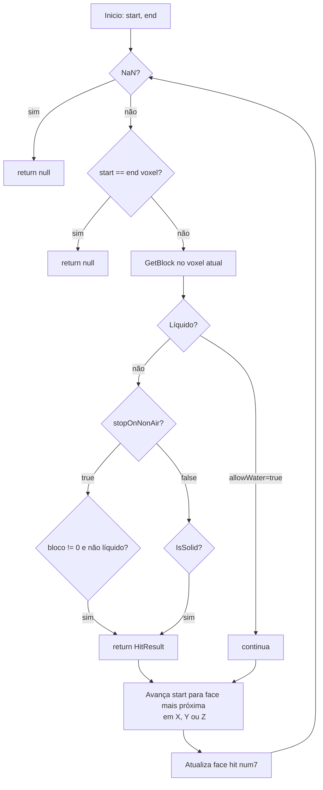

# Módulo de Mundo e Mapa — `AdvancedBot.Client.Map`

Fontes: `World.cs`, `Chunk.cs`, `ChunkSection.cs`, `BlockUtils.cs`, `HitResult.cs`, `SignTile.cs`, `AdvancedBot.Client/Blocks.cs`, `Block.cs`, `AABB.cs`.

---

## Objetivo e papel

O módulo de mapa mantém uma **representação local parcial do mundo Minecraft** recebida do servidor via pacotes de chunk e de mudança de bloco. Não é uma simulação completa — não simula tick de blocos, redstone, mobs ou iluminação. Seu papel é fornecer as operações de leitura (`GetBlock`, `GetData`, `IsSolid`, `GetCollisionBoxes`, `RayCast`) que a física da entidade, o pathfinder e os comandos de automação precisam para tomar decisões.

---

## Arquitetura de dados

```mermaid
flowchart LR
  W[World\nDictionary long→Chunk] --> CH[Chunk\n16 ChunkSection nullable]
  CH --> CS[ChunkSection\nbyte[] blocks + data]
  W --> SG[Signs\nDictionary Vec3i→string[]]
  W --> OBC[OnBlockChange\nevent BlockChange]
```

### Codificação da chave de chunk

`World.ToChunkPos(x, z)` produz:
```
long key = (x & 0xFFFFFFFF) | ((z & 0xFFFFFFFF) << 32)
```
O par de inteiros 32-bit é compactado em um `long`. Não há colisão enquanto `x` e `z` estiverem na faixa `[-30_000_000, 30_000_000)` do Minecraft.

### `Chunk`

Contém um array de 16 `ChunkSection?` (uma por seção vertical de 16 blocos, Y=0..255 → seções 0..15). A seção é alocada *lazy* na escrita: `SetBlockAndData` cria `new ChunkSection()` se a posição alvo tiver `null`.

### `ChunkSection`

Dois arrays de `byte[16×16×16]`: um para IDs de bloco e outro para metadados (data). O índice dentro da seção é `y*256 + z*16 + x` (ou equivalente em termos de bits). Não armazena luz, bioma ou skylight — apenas bloco e data.

---

## API pública de `World`

| Método | Semântica | Lado-efeito |
|---|---|---|
| `GetBlock(x,y,z)` | Retorna ID do bloco; 0 fora de bounds ou sem chunk. | nenhum |
| `GetData(x,y,z)` | Retorna metadado do bloco; 0 se ausente. | nenhum |
| `SetBlock(x,y,z,id)` | Muta bloco; dispara `OnBlockChange` se há assinante. | evento |
| `SetData(x,y,z,data)` | Muta apenas metadado. | nenhum |
| `SetBlockAndData(x,y,z,id,data)` | Muta ambos; cria seção se necessário; dispara evento. | evento |
| `SetChunk(x,z,chunk)` | Adiciona ou remove chunk do dicionário; dispara evento `isChunk=true`. | evento + lock |
| `GetChunk(x,z)` | Retorna `Chunk` ou `null`; usa lock. | lock |
| `ChunkExists(x,z)` | Testa presença sem lock (race possível). | nenhum |
| `Clear()` | Dispara evento `(-1,-1,-1,isChunk=true)`, limpa chunks e signs com lock. | evento + lock |
| `IsSolid(x,y,z)` | `Blocks.IsSolid(GetBlock(x,y,z))`. | nenhum |
| `GetCollisionBoxes(aabb)` | Retorna lista de AABBs sólidos na expansão da caixa. | nenhum |
| `IsMaterialInBB(aabb, ids...)` | `true` se qualquer ID da lista está dentro da AABB. | nenhum |
| `CreatePathTo(from,x,y,z,maxDist,...)` | Cria `PathFinder` e busca rota; retorna `null` se alvo > `maxDist+8`. | nenhum |
| `RayCast(start,end,stopOnNonAir,allowWater)` | RayCast por DDA voxel, máximo 256 passos. | nenhum |
| `GetWaterFlowVector(x,y,z)` | Calcula vetor de fluxo de água. | nenhum |

---

## Sincronização

| Operação | Tem lock? | Risco |
|---|---|---|
| `SetChunk / GetChunk` | `lock(Chunks)` | seguro |
| `Clear()` | `lock(Chunks)` + `lock(Signs)` | seguro |
| `GetBlock / SetBlock / SetBlockAndData` | sem lock | **handler de rede** (callback) pode escrever enquanto **Entity.Tick()** lê — race condition |
| `ChunkExists()` | sem lock | pode retornar stale |
| `IsMaterialInBB / GetCollisionBoxes` | sem lock | leitura inconsistente durante atualização de chunk |

A única sincronização robusta é em `SetChunk/GetChunk/Clear`. Todas as operações de leitura de bloco individual são sem lock porque foram projetadas para ser chamadas no tick (thread única), mas callbacks de rede também as escrevem, criando corrida.

---

## `GetCollisionBoxes(AABB aabb)`

Percorre todos os blocos `(x, z, y-1..maxY)` dentro da expansão do AABB e, para cada bloco sólido, chama `BlockUtils.AddAABBsToList(world, x, y, z, list)`. O resultado é a lista de AABBs de colisão usada por `Entity.Move()`.

**Nota:** o laço itera `z` como eixo externo e `y` como interno (com `k = num3-1` até `num4`), começando um bloco abaixo — garante que blocos de suporte sejam incluídos.

---

## `RayCast(start, end, stopOnNonAir, allowWater)`

Implementa DDA (Digital Differential Analyzer) para travessia de voxel. Máximo de 256 iterações.



`HitResult` contém `(x, y, z, face)` onde `face` é 0=topo, 1=base, 2=sul, 3=norte, 4=leste, 5=oeste.

---

## `BlockUtils`

Fornece:
- `AddAABBsToList(world, x, y, z, list)`: adiciona as AABBs de colisão de um bloco específico (lida com escadas, lajes, cercas etc. que têm geometria não-cúbica).
- `GetFluidHeightPercent(data)`: calcula altura visual do fluido a partir do metadado.
- `IsSolid(id)`: tabela de blocos sólidos — base para `World.IsSolid` e `PathFinder`.

**Nota:** `BlockUtils` usa uma tabela estática de IDs de bloco. Para versões diferentes do Minecraft, IDs de bloco podem mudar — o sistema não tem mapeamento por versão; assume IDs 1.8.

---

## Evento `OnBlockChange`

```csharp
public delegate void BlockChange(int x, int y, int z, bool isChunk);
public event BlockChange OnBlockChange;
```

Assinado pelo `ViewForm` (viewer OpenGL) para invalidar chunks no renderizador. O `World.Clear()` dispara com `(-1,-1,-1, isChunk=true)` como sinal de limpeza total. Não há outros assinantes no núcleo do bot — comandos e física leem diretamente, sem eventos de bloco.

---

## `Signs` — placas

`Dictionary<Vec3i, string[]>` — mapa de posição para array de 4 linhas de texto da placa. Populado pelo handler ao receber `UpdateBlockEntity` com tipo placa. Protegido por `lock(Signs)` somente no `Clear()`; leitura sem lock.

---

## Relação com protocolo Minecraft

| Pacote recebido | Handler | Efeito em World |
|---|---|---|
| Chunk Data (33 em 1.8) | `Handler_v18.HandlePacket(33)` | `World.SetChunk(x, z, chunk)` |
| Multi Block Change (34) | handler | `World.SetBlockAndData` para cada bloco |
| Block Change (35) | handler | `World.SetBlockAndData` |
| Explosion (36) | handler | `World.SetBlock(x,y,z, 0)` para cada bloco destruído |
| Unload Chunk (33 com groundUp=true, sem seções) | handler | `World.SetChunk(x,z,null)` |
| Update Block Entity (placa) | handler | `World.Signs[pos] = lines` |

---

## Relação com IA e pathfinding

- `PathFinder` usa `World.GetBlock`, `World.IsSolid` e `World.GetCollisionBoxes` para classificar nós.
- `PathGuide.Create` chama `World.CreatePathTo(player, x,y,z, 80, ...)`.
- `AutoMiner.SearchNearestBlock` varre o mundo com `World.GetBlock` em cubo `MinerRadius×MinerRadius`.
- `CommandGoto/Portal` usam `World.GetBlock` para detectar portais (ID 90).
- `CommandHerbalism` usa `Entity.RayCastBlocks` que internamente chama `World.RayCast`.

---

## Relação com inventário

Nenhuma. O mundo não conhece inventário. A interação é unidirecional: comandos de inventário (ex: `CommandMiner` selecionar ferramenta) leem `World.GetBlock` para decidir qual item usar, mas o `World` não tem referência ao inventário.

---

## Problemas arquiteturais

1. **Race condition de leitura**: física e pathfinding leem blocos sem lock enquanto handler escreve chunks.
2. **`ChunkExists()` sem lock**: pode retornar `false` negativo transitoriamente.
3. **Tabela de blocos não versionada**: `Blocks` e `BlockUtils` usam IDs fixos 1.8; versões diferentes podem falhar silenciosamente.
4. **Limite de mundo hardcoded**: `±30_000_000` — sem parâmetro por versão.
5. **`OnBlockChange` chamado com lock em `SetChunk`**: assinante (viewer) não pode re-adquirir `lock(Chunks)` durante o callback sem deadlock.
6. **Sem limite de chunks**: `LimitChunks` existe em `MinecraftClient` (const `CHUNK_LIMIT = 1024`) mas `World.SetChunk` não verifica — é verificado no handler antes da inserção.

---

## Java

```java
public class WorldState {
  // Acesso via executor serial da sessão para reads comuns;
  // SetChunk usa ReentrantReadWriteLock para writes do handler
  private final ReadWriteLock lock = new ReentrantReadWriteLock();
  private final Map<Long, Chunk> chunks = new HashMap<>();
  private final Map<BlockPos, String[]> signs = new HashMap<>();

  public static long chunkKey(int cx, int cz) {
    return ((long)(cx & 0xFFFFFFFFL)) | (((long)(cz & 0xFFFFFFFFL)) << 32);
  }

  // read lock para toda leitura de bloco feita pela física
  public byte getBlock(int x, int y, int z) { … }

  // write lock para handler de rede
  public void setChunk(int cx, int cz, Chunk chunk) { … }
}
```

Separar `WorldState` (dado) de `WorldView` (interface de leitura somente) permite expor apenas leitura para física/pathfinding e escrita apenas ao handler.
