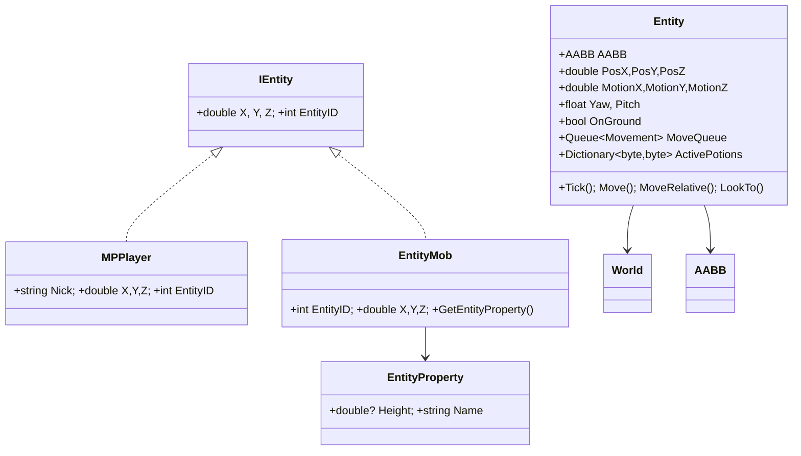
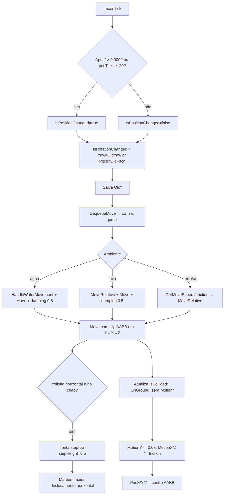

# Módulo de Entidades

Fontes: `Entity.cs`, `AABB.cs`, `Vec3d.cs`, `Vec3i.cs`, `Entitybase/{IEntity,EntityMob,EntityManager,EntityProperty}.cs`, `MPPlayer.cs`, `PlayerManager.cs`.

## Objetivo e papel

`Entity` representa o **jogador local** e implementa a física client-side do Minecraft. Não modela entidades remotas — essas são `EntityMob` (mobs) e `MPPlayer` (outros jogadores). O output de `Entity.Tick()` são as flags `IsPositionChanged`/`IsRotationChanged` que `MinecraftClient.Tick()` lê para emitir pacotes de movimento.

## Hierarquia



## Estado interno de `Entity`

| Campo | Semântica |
|---|---|
| `PosX/Y/Z` | posição atual; `PosY` = pés + 1,62 (olhos). |
| `MotionX/Y/Z` | velocidade acumulada, modificada por `Move()`. |
| `AABB` | caixa de colisão: ±0,3 X/Z, 1,8 altura, origem em pés-1,62. |
| `OldX/Y/Z`, `OldYaw/Pitch` | snapshot do tick anterior para detectar mudança. |
| `OnGround` | verdadeiro quando componente Y clipada na descida. |
| `posTicks` | contador; força `IsPositionChanged=true` a cada 20 ticks mesmo estático. |
| `MoveQueue` | fila de inputs (Forward, Back, Left, Right, Jump) consumida um por tick. |
| `LockMoveQueue` | quando `true`, `DequeueMove` usa `lock(MoveQueue)` para macros assíncronas. |
| `ActivePotions` | `byte→byte`: ID do efeito → amplificador. |
| `stepHeight` | altura máxima de step-up automático = 0,5. |

## Fluxo de física por tick



## Contratos de métodos-chave

### `Move(xa, ya, za)`
- **Pré:** `AABB` na posição anterior, `xa/ya/za` = velocidade desejada.
- **Efeito:** coleta colisões com `World.GetCollisionBoxes(AABB.Expand(...))`, clipa componentes Y→X→Z, aplica step-up se necessário.
- **Pós:** `AABB` e `Pos*` refletem nova posição; Motion* zerado onde colidiu; `OnGround` atualizado.
- **Invariante:** `PosY = AABB.MinY + 1.62` sempre.

### `MoveRelative(xa, za, speed)`
Converte inputs direcionais (relativos ao `Yaw`) em contribuições de `MotionX/Z`. Normaliza quando `√(xa²+za²) < 1`. Usa `sin/cos(Yaw)` para rotacionar para espaço global.

### `GetMoveSpeed()`
- Base: 0,1; Sprint: ×1,3; Poção 1 (velocidade, amp `v`): `×(1+0,2×(v+1))`; Poção 2 (lentidão): `×(1−0,15×(v+1))`.
- A fórmula de fricção efetiva: `speed_efetiva = GetMoveSpeed × (0.16277136 / friction³)`.
- Fricção = `slipperiness × 0.91`: gelo/neve (79,174) → 0,98; demais → 0,6.

### `LookTo(x, y, z)`
`Yaw = atan2(ΔZ,ΔX)×180/π − 90`; `Pitch = −atan2(ΔY, √(ΔX²+ΔZ²))×180/π`.

`LookToBlock(randomize=true)` adiciona ruído [0,4; 0,6] por eixo para simular clique humano.

## Detecção de ambiente

| Método | IDs verificados | AABB usada |
|---|---|---|
| `IsOnWater()` | 8 (fluente), 9 (estacionária) | `Grow(-0.1,-0.4,-0.1)` |
| `IsOnLava()` | 10, 11 | `Grow(-0.1,-0.4,-0.1)` |
| `IsOnLadder()` | 65 (escada), 106 (trepadeira) | bloco em `AABB.MinY` |
| `IsOnPortal()` | 90 | `AABB` completa |
| `IsOnWeb()` | 30 | varre todo o volume da AABB |

## Linhas de visão

`CanSeePlayer`: rayCast `PosX/Y/Z → p.X, p.Y+1.62, p.Z` com `stopOnNonAir=false, allowWater=true`. Resultado `null` = visível.

`CanSeeEntity`: testa cabeça e pés separados; retorna `true` se ao menos um rayCast retorna `null`.

## Relação com protocolo Minecraft

- Servidor 1.8 ID 8 (`PlayerPositionAndLook`): bits 0x01–0x10 indicam offsets relativos. Handler aplica e responde `PacketPosAndLook(onGround=false)`.
- Servidor 1.9 ID 46: adiciona `teleportID`; handler envia `PacketTeleportConfirm`.
- Bot emite a cada tick: `PacketPlayerPos`, `PacketPlayerLook`, `PacketPosAndLook` ou `PacketUpdate` conforme `IsPositionChanged/IsRotationChanged`.
- Sprint: diferença `IsSprinting ≠ WasSprinting` → `PacketEntityAction(PlayerID, 3=start_sprint, 4=stop_sprint, jumpBoost=0)`.

## Relação com IA

| Agente | O que lê/escreve em Entity |
|---|---|
| `PathGuide` | acumula `MotionX/Z`, força `MotionY=0.42` para salto |
| `CommandMiner/Herbalism` | `LookToBlock`, `RayCastBlocks` |
| `CommandKillAura` | `LookTo` para mira, verifica `CanSeePlayer` |
| `CommandUseBow` | `LookInterpolator` → `Yaw/Pitch` gradualmente |
| `CommandAntiAFK` | enfileira `Movement.Jump` em `MoveQueue` |
| `CommandMove` | enfileira `Forward/Back/Left/Right/Jump` |

## `AABB`

Caixa alinhada aos eixos. Métodos principais:

| Método | Semântica |
|---|---|
| `ClipXCollide(other, xa)` | delta X máximo sem intersecção |
| `ClipYCollide(other, ya)` | idem para Y |
| `ClipZCollide(other, za)` | idem para Z |
| `Intersects(other)` | intersecção 3D estrita |
| `Expand(xa,ya,za)` | expansão para range de busca |
| `Grow(x,y,z)` | expansão simétrica |
| `Move(x,y,z)` | translação in-place |
| `MoveClone / Copy` | cópias |

**Problema:** `AABB` é mutável; `Entity.Move()` o modifica in-place durante leitura do `World` — estado intermediário visível a outras threads.

## `MPPlayer` e `EntityMob`

- `MPPlayer`: DTO de jogador remoto (nick, X/Y/Z, entityID). Atualizado por pacotes de movimento de entidade no handler. Usado por `CommandFollow` e `CommandKillAura`.
- `EntityMob`: DTO de mob (entityID, X/Y/Z, tipo). `GetEntityProperty()` retorna altura/nome para cálculo de visibilidade.
- `EntityManager`: `Dictionary<int, EntityMob>`, sem sincronização interna.

## `PlayerManager`

`Dictionary<string, string> UUID2Nick`. Limpo em `StartClient`, `HandlePacketDisconnect` e `HandlePacketRespawn`. Sem lock; atualizado pelo callback de rede.

## Problemas arquiteturais

1. **Concorrência sem lock**: macros assíncronas acessam `MoveQueue` sem `LockMoveQueue=true`; EntityManager sem lock entre handler e CommandMob.
2. **Física acoplada ao mundo**: `Entity.Tick()` lê chunks sem sincronização com chegada de rede.
3. **`IsOnWeb()` é O(volume_AABB)**: ineficiente para AABB grande.
4. **Knockback ignorado**: campo `static Knockback` de `MinecraftClient` não é verificado pela `Entity`.

## Java

```java
public class BotPlayer {
  private volatile Vec3d position;   // snapshot imutável por tick
  private Vec3d motion;
  private AABB  hitbox;
  private float yaw, pitch;
  private boolean onGround;
  private final Queue<Movement> moveQueue = new ConcurrentLinkedQueue<>();
  private final Map<Byte, Byte> activePotions = new ConcurrentHashMap<>();

  // Chamar sempre no executor serial da sessão
  public void tick(WorldView world) { … }
}

// Entidades remotas: DTO imutável
public record RemotePlayer(int id, String nick, double x, double y, double z) {}
public record RemoteMob(int id, int type, double x, double y, double z) {}

// Registry — acesso exclusivo pelo executor serial
public class EntityRegistry {
  private final Map<Integer, RemotePlayer> players = new HashMap<>();
  private final Map<Integer, RemoteMob> mobs = new HashMap<>();
}
```

Coeficientes obrigatórios para equivalência: gravidade 0,08; damping Y 0,98; X/Z 0,91×slipperiness; step-up 0,5; largura 0,6; altura 1,8; olhos 1,62.
