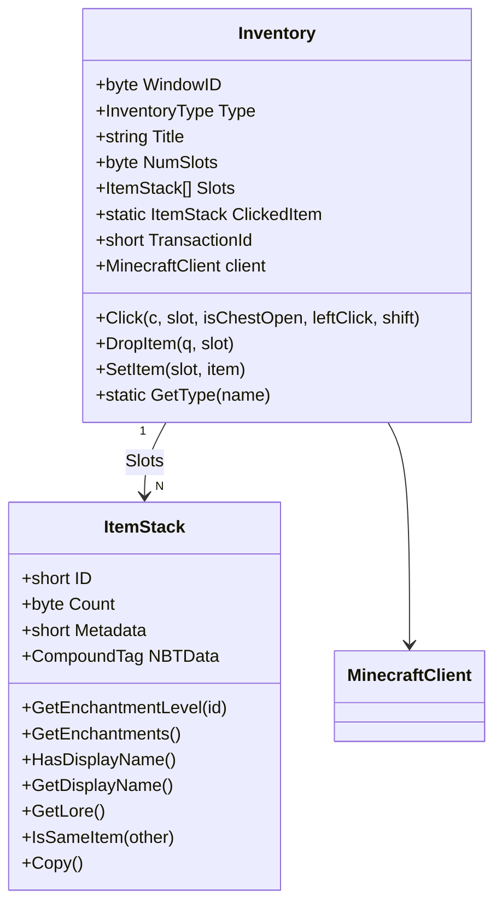
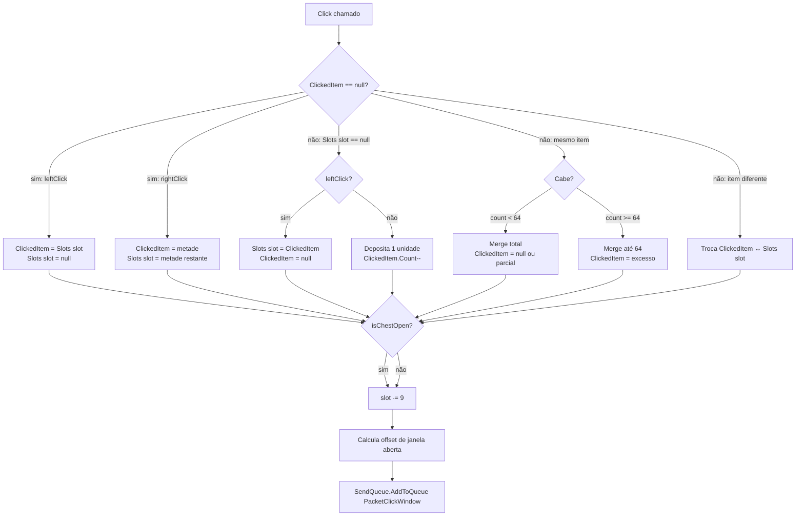

# Módulo de Inventário — `AdvancedBot.Client`

Fontes: `Inventory.cs`, `ItemStack.cs`, `Items.cs`, `Item.cs`, `InventoryType.cs`, `AdvancedBot.Client.Packets/{PacketClickWindow,PacketCloseWindow,PacketCreativeInvAction,PacketHeldItemChange,PacketConfirmTransaction}.cs`.

---

## Objetivo e papel

O módulo de inventário mantém o estado local dos itens do jogador e das janelas abertas. Ele implementa a **lógica de clique client-side** (simulação das trocas de item que o cliente calcula antes de enviar ao servidor) e produz os pacotes de inventário correspondentes.

---

## Estrutura de dados principal



---

## Invariantes do inventário do jogador

- `MinecraftClient.Inventory` é criado com 45 slots no construtor da sessão.
- Slots 0..8: crafting e armor (não expostos pela UI, mas existentes no array).
- Slots 9..35: inventário principal.
- Slots 36..44: hotbar (0..8 do hotbar = slots 36..44).
- `HotbarSlot` em `MinecraftClient` mantém o índice 0..8 do hotbar; `ItemInHand` = `Inventory.Slots[36 + HotbarSlot]`.
- `NumSlots = 45` para o inventário do jogador; janelas externas têm `NumSlots` variável conforme o tipo.

---

## Mapeamento de slots para janelas externas

Quando uma janela externa está aberta (`OpenWindow`), o handler converte slots do servidor para o inventário local:

```
slot_servidor >= NumSlots_da_janela
    → slot_inventario = slot_servidor - NumSlots_da_janela + 9
```

Isso ocorre em `Handler_v18` nos pacotes ID 47 (Set Slot) e ID 48 (Window Items). O inventário do jogador começa no índice 9 da visão da janela (os primeiros `NumSlots` pertencem ao container externo).

---

## `Inventory.Click()` — simulação client-side

O método implementa a lógica de arrastar e soltar do inventário Minecraft:



**Contrato:**
- `ClickedItem` é campo **estático** — compartilhado entre todas as instâncias de `Inventory`. Isso significa que um clique em uma janela externa afeta o cursor de qualquer outro inventário que leia o campo.
- `TransactionId` é incrementado a cada clique. O servidor pode rejeitar transações; ID 50 do handler confirma positivamente.
- Exceções dentro de `Click()` são silenciadas por `catch(Exception) {}`.

---

## `Inventory.DropItem(queue, slot)`

Enfileira `PacketClickWindow(WindowID, slot, button=1, ++TransactionId, mode=4, item=null)`. O modo 4 com `button=1` significa "drop" no protocolo. Zera `Slots[slot]` localmente sem aguardar confirmação do servidor.

---

## `InventoryType`

Enum de tipos de container mapeados pelo ID de string do servidor:

| String | Tipo |
|---|---|
| `minecraft:chest` | `Chest` |
| `minecraft:crafting_table` | `Workbench` |
| `minecraft:furnace` | `Furnace` |
| `minecraft:dispenser` | `Dispenser` |
| `minecraft:enchanting_table` | `EnchantmentTable` |
| `minecraft:brewing_stand` | `BrewingStand` |
| `minecraft:villager` | `NPCTrade` |
| `minecraft:beacon` | `Beacon` |
| `minecraft:anvil` | `Anvil` |
| `minecraft:hopper` | `Hopper` |
| `minecraft:dropper` | `Dropper` |
| `EntityHorse` | `Horse` |
| (desconhecido) | `(InventoryType)255` |

---

## `ItemStack`

### Estado

| Campo | Tipo | Semântica |
|---|---|---|
| `ID` | `short` | ID do item; -1 significa slot vazio/nulo. |
| `Count` | `byte` | quantidade (1..64). |
| `Metadata` | `short` | damage/metadado; distingue subtipos. |
| `NBTData` | `CompoundTag` | dados extras (encantamentos, nome, lore). |

### Métodos relevantes

| Método | Comportamento |
|---|---|
| `GetEnchantmentLevel(id)` | Itera lista `ench` do NBT; retorna 0 se ausente. |
| `GetEnchantments()` | Formata string de encantamentos com nomes canônicos e números romanos (I–X). |
| `HasDisplayName()` | `NBTData.display.Name` existe. |
| `GetDisplayName()` | Retorna nome do NBT se presente; fallback para `Items.GetDisplayName(ID, Metadata)`. |
| `GetLore()` | Retorna linhas da lista `Lore` do subtag `display`. |
| `IsSameItem(other)` | `ID == other.ID && Metadata == other.Metadata && (NBT equivalente)`. **Bug observado:** compara `other.NBTData.Equals(other.NBTData)` (compara consigo mesmo) em vez de `this.NBTData`. |
| `Copy()` | `new ItemStack(ID, Metadata, Count, NBTData)` — NBT não é clonado (shallow copy). |

### Encantamentos mapeados

Cobre ID 0–71 com nomes em inglês. Não há mapeamento por versão — assume tabela 1.8/1.9.

---

## Pacotes de inventário produzidos pelo cliente

| Classe | ID 1.8 | Campos | Quando enviado |
|---|---|---|---|
| `PacketClickWindow` | 13 | `windowId, slot, button, actionNumber, mode, clickedItem` | `Inventory.Click()` e `DropItem()` |
| `PacketCloseWindow` | 13 (ID 14 em 1.8) | `windowId` | handler ao fechar janela ou bot explicitamente |
| `PacketHeldItemChange` | 9 | `slot` (0–8) | setter `MinecraftClient.HotbarSlot` |
| `PacketConfirmTransaction` | 15 | `windowId, action, accepted` | handler ao receber rejeição de transação |
| `PacketCreativeInvAction` | 16 | `slot, item` | modo criativo apenas |

---

## Relação com protocolo Minecraft

- **Open Window (ID 45)**: cria `OpenWindow = new Inventory(...)` com tipo parseado por `GetType(string)`, e zera `ClickedItem`.
- **Close Window (ID 46)**: fecha `OpenWindow` se IDs coincidirem.
- **Set Slot (ID 47)**: atualiza um slot com conversão de índice para janela externa.
- **Window Items (ID 48)**: substitui todos os slots com a mesma conversão.
- **Transaction (ID 50)**: se `accepted=false`, enfileira `PacketConfirmTransaction(windowId, actionId, accepted=true)` — o cliente sempre confirma positivamente para manter sincronização.

---

## Relação com IA e macros

| Comando/Macro | Operação de inventário |
|---|---|
| `CommandMiner` / `AutoMiner` | lê hotbar para selecionar melhor ferramenta via `ToolStrengthVsBlock` |
| `CommandHotbarClick` | chama `Inventory.Click(c, slot, false)` na hotbar |
| `CommandInvClick` | clique em slot do inventário |
| `CommandDropAll` | `DropItem` em todos os slots não-protegidos |
| `CommandGive` | `PacketCreativeInvAction` para dar item em modo criativo |
| `CommandPesca` / `CommandMob` | lê e verifica slots por tipo/ID para validar equipamento |
| `CommandInvCaptcha` | resolve captcha de inventário por posição de item |
| `CommandUseBow` | verifica arco (ID 261) e flecha (ID 262) na hotbar |

---

## Problemas arquiteturais

1. **`ClickedItem` estático**: compartilhado globalmente; em cenário multi-sessão, um clique de um bot contamina o cursor de outro.
2. **`Copy()` é shallow**: `NBTData` não é clonado — mutações no NBT de um `ItemStack` afetam todos os copies.
3. **`IsSameItem()` bug**: compara `other.NBTData.Equals(other.NBTData)` — sempre `true` para NBT não-nulo, tornando a comparação incorreta quando NBTs diferem.
4. **Sem rollback de transação**: o cliente não reverte estado local quando servidor rejeita clique.
5. **Sem timeout de transação**: `TransactionId` incrementa indefinidamente sem verificar resposta.
6. **`Click()` silencia exceções**: bugs de null-pointer em `Slots` são descartados silenciosamente.

---

## Java

```java
public class Inventory {
  private final ItemStack[] slots;
  private final byte numSlots;
  private byte windowId;
  private InventoryType type;
  private short transactionId;

  // Cursor NÃO é estático — pertence à sessão
  private ItemStack cursorItem;

  public Optional<ClickResult> click(int slot, boolean leftClick, boolean shift) {
    // retorna resultado ou vazio se slot inválido
  }
}

public record ItemStack(short id, short metadata, byte count, NbtCompound nbt) {
  public static final ItemStack EMPTY = new ItemStack((short)-1, (short)0, (byte)0, null);

  public ItemStack copy() {
    // deep copy de nbt
    return new ItemStack(id, metadata, count, nbt == null ? null : nbt.deepCopy());
  }

  public boolean isSameItem(ItemStack other) {
    return id == other.id && metadata == other.metadata
      && Objects.equals(nbt, other.nbt); // comparação correta
  }
}
```

Preservar: mapeamento de slots (36..44 = hotbar), conversão de slot externo `slot - NumSlots + 9`, lógica de merge até 64, modo 4 para drop.
