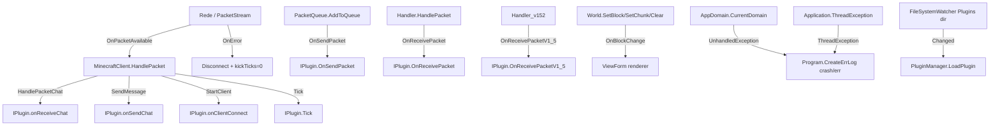
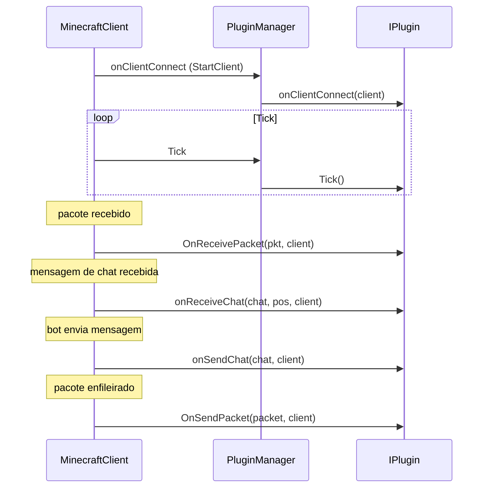
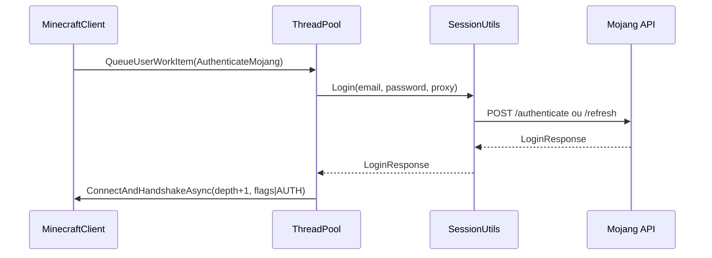

# Eventos e Callbacks — `AdvancedBot.Client` + `AdvancedBot.Client.Map`

Fontes: `PacketStream.cs`, `World.cs`, `IPlugin.cs`, `PluginManager.cs`, `MinecraftClient.cs`.

---

## Objetivo e papel

Este documento mapeia todos os **eventos, delegados e callbacks** do sistema. O AdvancedBot não usa um barramento de eventos centralizado — eventos são: delegados .NET em `PacketStream` e `World`, callbacks de plugin via `PluginManager`, e chamadas diretas de handler para `MinecraftClient`. O resultado é um grafo de chamadas distribuído sem ponto único de observação.

---

## Mapa de todos os eventos do sistema



---

## `PacketStream` — eventos de transporte

### `OnPacketAvailable`

```csharp
public event Action<ReadBuffer> OnPacketAvailable;
```

| Atributo | Valor |
|---|---|
| Produtor | `PacketStream.ReadCallback` — callback assíncrono de `BeginRead` |
| Consumidor | `MinecraftClient.HandlePacket` (assinado em `ConnectCallback`/`ConnectAndHandshake`) |
| Thread | thread do pool de I/O (IOCP) — **não é a thread do tick** |
| Frequência | um disparo por frame completo recebido |
| Pré-condição | payload já decifrado, descomprimido; `ReadBuffer.ID` já consumido |
| Pós-condição | `ReadBuffer` com cursor logo após o ID, `Remaining` = tamanho do corpo |
| Risco | Assinatura acontece **após** o primeiro `Flush` — janela de corrida onde pacotes podem chegar antes da assinatura estar registrada |

### `OnError`

```csharp
public event Action<Exception> OnError;
```

| Atributo | Valor |
|---|---|
| Produtor | qualquer falha em leitura, escrita ou cifra dentro de `PacketStream` |
| Consumidor | delegado anônimo registrado em `ConnectCallback` que chama `Disconnect(msg, ex)` e `kickTicks = 0` |
| Efeito | `IsConnected = false` já está definido antes do disparo; a exceção não é relançada |

---

## `World` — evento de mudança de bloco

### `OnBlockChange`

```csharp
public delegate void BlockChange(int x, int y, int z, bool isChunk);
public event BlockChange OnBlockChange;
```

| Parâmetro | Semântica quando `isChunk=true` | Semântica quando `isChunk=false` |
|---|---|---|
| `x, z` | coordenada do chunk | coordenada do bloco |
| `y` | 0 (convencional) ou -1 (Clear) | coordenada Y do bloco |
| `isChunk` | chunk inteiro adicionado/removido | bloco individual alterado |

Sinal especial: `(-1, -1, -1, isChunk=true)` emitido por `Clear()` — significa "mundo limpado".

**Produtor:** `SetBlock`, `SetBlockAndData`, `SetChunk`, `Clear`.  
**Consumidor atual:** `ViewForm` (viewer OpenGL) para invalidar chunks no renderizador.  
**Nota:** `SetChunk` emite o evento dentro de `lock(Chunks)`. O consumidor não pode re-adquirir esse lock sem deadlock.

---

## `PluginManager` — callbacks de plugin

Ver [Plugins](../11-Plugins/README.md) para contrato completo de cada callback.

### Sumário de sequência de callbacks por evento de sessão



---

## Eventos globais de processo

### `AppDomain.UnhandledException`

Registrado em `Program.Main`. Handler:
1. Cast direto para `Exception` (pode lançar `InvalidCastException` se o objeto não for `Exception`).
2. Tipo de log: `"crash"` se `IsTerminating=true`, senão `"err"`.
3. Chama `Program.CreateErrLog(ex, type)`.
4. Não aborta o processo — se `IsTerminating=false`, a execução continua.

### `Application.ThreadException`

Registrado em `Program.Main`. Handler:
1. Chama `Program.CreateErrLog(ex, "threadexception")`.
2. Não exibe diálogo, não encerra o processo.

### `FileSystemWatcher.Changed` (Plugins)

Produzido por mudança em `.dll` dentro de `Plugins\`. Consumidor: `PluginManager.OnChanged` — aguarda 1 s e chama `LoadPlugin`. Não tem `OnRemoved` funcional (método existe mas é vazio).

---

## Callbacks de autenticação (SessionUtils)

Não usa eventos .NET. É um fluxo síncrono/assíncrono via `ThreadPool.QueueUserWorkItem`:



---

## Ausência de barramento centralizado — implicações

O sistema não tem:
- Barramento de eventos (`EventBus`)
- Fila de mensagens por sessão
- Padrão Observer com lista de assinantes gerenciada

As consequências são:
1. Ordem de callbacks não é garantida entre múltiplos assinantes (embora na prática haja apenas um assinante por evento).
2. Concorrência entre callback de rede (`OnPacketAvailable`) e tick é responsabilidade do chamador.
3. Exceção em qualquer callback propaga para o produtor sem captura automática.

---

## Java — modelo recomendado

```java
// Barramento por sessão com tipo seguro
public class SessionEventBus {
  public <E extends BotEvent> void subscribe(Class<E> type, Consumer<E> handler) { … }
  public <E extends BotEvent> void publish(E event) { … }
}

// Eventos tipados
public sealed interface BotEvent permits
  PacketReceivedEvent, PacketSentEvent,
  ChatReceivedEvent, ChatSentEvent,
  BlockChangedEvent, ChunkLoadedEvent,
  SessionConnectedEvent, SessionDisconnectedEvent {}

// Execução no executor serial da sessão
// Todos os handlers são chamados sequencialmente no mesmo thread
// eliminando race conditions entre rede e tick
```

Preservar contratos: `onReceiveChat` é disparado antes de `PrintToChat`; `onSendChat` é disparado antes de `PacketChatMessage` entrar na fila; `onClientConnect` é disparado antes do handshake; `OnSendPacket` é disparado antes do enfileiramento.
