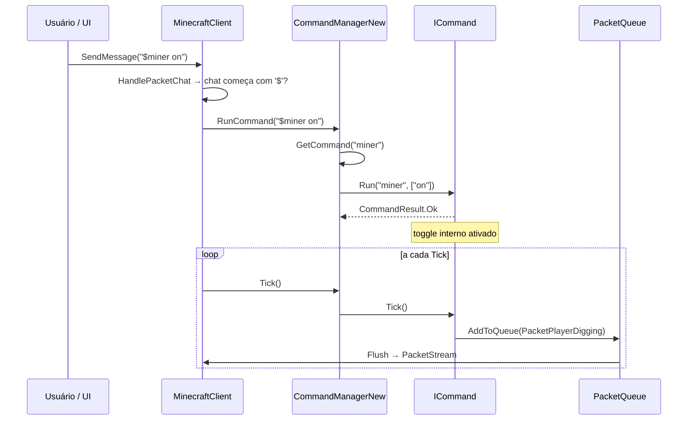

# Sistema de Comandos — `AdvancedBot.Client` + `AdvancedBot.Client.Commands`

Fontes: `CommandManagerNew.cs`, `ICommand.cs`, `CommandResult.cs`, `AdvancedBot.Client.Commands/*.cs`.

---

## Objetivo e papel

O sistema de comandos é a **camada de automação de alto nível** do bot. Ele define a interface `ICommand`, registra e despacha comandos locais (prefixados com `$`) e executa no tick todos os comportamentos togglable. É a ponte entre a entrada do operador (via chat local ou UI) e os subsistemas de pathfinding, inventário, rede e entidades.

---

## `ICommand` — contrato dos comandos

```csharp
public interface ICommand {
    string[] Aliases { get; }   // nomes alternativos que ativam este comando
    string[] HelpArgs { get; }  // argumentos esperados para $help
    string HelpText { get; }    // descrição exibida no $help

    CommandResult Run(string alias, string[] args);
    void Tick();
}
```

### `CommandResult`

Enum com três valores:

| Valor | Semântica |
|---|---|
| `Ok` | comando executado com sucesso |
| `MissingArgs` | argumentos insuficientes — UI exibe mensagem de sintaxe |
| `Error` | falha genérica — UI exibe mensagem de erro |

---

## `CommandManagerNew` — registro e dispatch

### Construção

Criado no construtor de `MinecraftClient`. Registra 30 comandos na seguinte ordem fixa:

```
Sneak → Help → Move → Portal → Retard → Reco → Follow →
KillAura → Twerk → PlayerList → Give → Goto → UseEntity →
HotbarClick → InvClick → DropAll → ClickBlock → Miner →
ClearChat → AntiAFK → PlaceBlock → InvCaptcha → Herbalism →
UseBow → Proxy → BreakBlock → Script → Pesca → Mob → MobTeleport
```

**Motivação da ordem**: os comandos são tickados na mesma sequência. Como não há arbitrador, o último comando a escrever em `Player.MotionX/Y/Z`, `Player.Yaw/Pitch` ou `CurrentPath` vence. Portanto, a ordem é implicitamente parte da especificação de prioridade.

### `RunCommand(cmdstr)`

1. Remove o prefixo `$` e divide em `alias` + `args` pelo primeiro espaço.
2. `GetCommand(alias)` percorre `Commands` linearmente e compara aliases com `EqualsIgnoreCase`.
3. Chama `command.Run(alias, args)`; captura toda exceção e retorna `CommandResult.Error`.
4. Exibe mensagem de erro ou sintaxe no chat local conforme o resultado.

### `Tick()`

Itera `Commands` e chama `command.Tick()` incondicionalmente. Cada comando decide internamente se está ativado. Sem exclusão mútua entre comandos.

---

## Catálogo de comandos

### Comandos simples (sem estado de máquina)

| Classe | Aliases | Comportamento no Tick | Ação do Run |
|---|---|---|---|
| `CommandSneak` | `sneak` | Se toggled: enfileira `PacketEntityAction(CROUCH/UNCROUCH)` | toggle |
| `CommandMove` | `move`, `w/s/a/d/jump` | Se toggled: enfileira `Movement.Forward/Back/Left/Right/Jump` | toggle ou direção única |
| `CommandRetard` | `retard` | Se toggled: move Forward continuamente | toggle |
| `CommandAntiAFK` | `antiafk` | Se toggled: a cada `delay` ms, enfileira `Jump` | toggle |
| `CommandTwerk` | `twerk` | Alterna Crouch/Uncrouch a cada tick | toggle |
| `CommandClearChat` | `clearchat` | — | limpa `ChatMessages` |
| `CommandPlayerList` | `playerlist` | — | exibe `PlayersTab` no chat |
| `CommandProxy` | `proxy` | — | `Program.FrmMain.Proxies.NextProxy()` |
| `CommandReco` | `reco` | — | chama `Client.StartClient()` |
| `CommandHelp` | `help` | — | exibe lista ou detalhes de comando |

### Comandos de interação

| Classe | Comportamento |
|---|---|
| `CommandGive` | `PacketCreativeInvAction` para dar item a si mesmo (modo criativo) |
| `CommandGoto` | Chama `Client.RequestPathTo(x, y, z)` |
| `CommandPortal` | Busca portal (ID 90) nos chunks 17×17, Y±32, ou usa coordenada explícita |
| `CommandUseEntity` | `PacketUseEntity` no entityID especificado |
| `CommandHotbarClick` | `Inventory.Click` na posição da hotbar |
| `CommandInvClick` | `Inventory.Click` no slot especificado |
| `CommandDropAll` | `Inventory.DropItem` em todos os slots com filtro |
| `CommandClickBlock` | `PacketPlayerDigging` + `PacketBlockPlace` numa posição |
| `CommandPlaceBlock` | `PacketBlockPlace` com face e posição explícitos |
| `CommandBreakBlock` | `PacketPlayerDigging` com status START, monitora progresso |

### `CommandFollow`

Togglable. Em `Tick()`:
1. Busca o `MPPlayer` com o nick configurado em `PlayersTab`.
2. Se não encontrado ou distância > 80: limpa `CurrentPath`, retorna inativo.
3. Se o alvo se moveu ≥ 2,5 blocos desde a última rota: `Client.RequestPathTo`.
4. Em todo tick com alvo: `Player.LookTo(target.X, target.Y+1.62, target.Z)`.

### `CommandKillAura`

Togglable. Em `Tick()`:
1. Incrementa `lastAttack`; só age quando `lastAttack >= speed`.
2. Sob `lock(Client.PlayersTab)`: filtra jogadores por distância ≤ 4, visibilidade (`CanSeePlayer`) e nick/wildcard.
3. Escolhe alvo mais próximo.
4. `Player.LookTo(target.X + rand*0.1, target.Y+1.62 + rand*0.1, target.Z + rand*0.1)`.
5. `SendQueue.AddToQueue(PacketUseEntity(target.EntityID, 1))` — ataque.

### `CommandMiner` / `AutoMiner`

`CommandMiner` é apenas um toggle que delega `AutoMiner.Tick()`. A lógica completa está em `AutoMiner` (ver [IA do Bot](../17-IA-do-Bot.md)).

### `CommandUseBow`

Estado: `target`, `bowTicks`, `LookInterpolator`.
- `Run("usebow")`: valida arco (ID 261) + flecha (ID 262) na hotbar; guarda alvo.
- Tick 0: `PacketUseItem`, cria interpolador mira 0,75.
- Ticks 1–31: interpola `Player.Yaw/Pitch` e recalcula trajetória.
- Tick ≥ 32: `PacketPlayerDigging(RELEASE)`, limpa estado.

### `CommandHerbalism`

Togglable. Em `Tick()`:
1. `Player.Yaw = ... olha para baixo`.
2. Raycast no bloco sob os pés.
3. Se bloco = cana (83): `PacketPlayerDigging(START/DONE)`.
4. Se posição é grama: seleciona cana-de-açúcar (338) na hotbar e coloca.
5. Se raycast nulo: desativa definitivamente (toggle off).

### `CommandScript`

Executa código em dois engines:
- **Engine próprio** (`ScriptParser`/`ScriptContext`): uma linguagem imperativa simples com variáveis, if/while, funções. Comandos mapeados para operações de bot.
- **Engine Jint** (`JsScriptContext`): JavaScript completo via biblioteca Jint. Acesso à API do bot por objeto `bot` exposto.

`Run` inicia um `Task` com o script. Sem cancelamento explícito quando o bot desconecta.

### `CommandInvCaptcha`

Lê slots do inventário para detectar padrão de captcha, clica no slot correto.

---

## Fluxo de execução de um comando local



---

## Eventos consumidos pelo sistema de comandos

| Evento/fonte | Consumidor |
|---|---|
| Chat recebido com padrão de autenticação | `MinecraftClient.HandlePacketChat` → automação authme |
| Chat de mob bugado / servidor reiniciando | `CommandMob.onReceiveChat` → transição de estado |
| Chat de falta de linha | `CommandPesca.onReceiveChat` → `COMPRAR_LINHA` |
| `IsBeingTicked()` = false | macros Solk → `StartClient()` após timeout |

---

## Problemas arquiteturais

1. **Sem arbitrador**: múltiplos comandos escrever em `Player.MoveQueue`, `Player.Yaw/Pitch` e `CurrentPath` sem coordenação.
2. **Dependência de ordem de registro**: a ordem em `CommandManagerNew` é parte implícita da especificação de comportamento.
3. **Macros Solk com `async void Tick()`**: `async void` é fire-and-forget; exceções dentro silenciosas; concorrência com `onReceiveChat`.
4. **`CommandScript` sem cancelamento**: tasks de script continuam após desconexão.
5. **`CommandKillAura` lock na coleção de players**: bloqueia a iteração de PlayersTab — se callback de rede escrever PlayersTab com outro lock, pode deadlock.

---

## Java

```java
public interface BotCommand {
  String[] aliases();
  String helpText();
  CommandResult run(BotSession session, String alias, String[] args);
  void tick(BotSession session);
}

public class CommandDispatcher {
  // Ordem preservada = parte da especificação
  private final List<BotCommand> commands = new ArrayList<>();

  public void registerAll(BotSession session) {
    commands.add(new SneakCommand(session));
    commands.add(new MoveCommand(session));
    // ... na mesma ordem do legado
  }

  // Chamado no executor serial da sessão
  public void tick() {
    commands.forEach(c -> c.tick(session));
  }

  public CommandResult dispatch(String input) {
    // parse alias + args
    // find command
    // call run()
  }
}
```

Para macros complexas (Pesca, Mob), modelar como `StateMachine<State, Event>` com executor serial e fila de eventos de chat, eliminando a race condition entre `async void Tick` e `onReceiveChat`.
