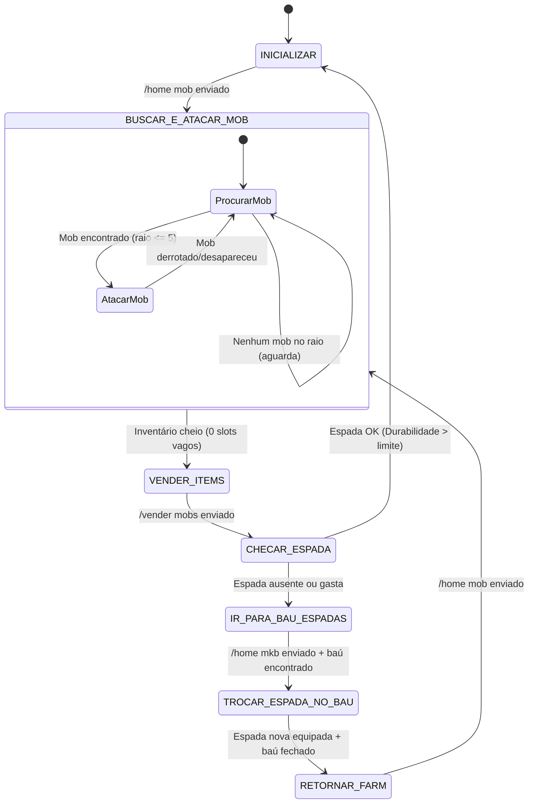

# Especificação Técnica — Macro Mob Simplificada (`MacroMobSimples`)

## 1. Visão Geral e Objetivos

O objetivo deste documento é especificar a arquitetura, máquina de estados e fluxo funcional de uma nova macro de caça/farm de mobs (**`MacroMobSimples`**).

Esta macro foi desenhada para ser uma alternativa mais enxuta, confiável e de fácil manutenção em comparação com a macro legada `Solk` (`CommandMob`), eliminando dependências desnecessárias e mantendo um ciclo de automação claro e resiliente:

1. **Teleporte inicial**: Enviar `/home mob` para ir ao local de farm.
2. **Combate ativo**: Detectar mobs próximos e atacá-los continuamente.
3. **Monitoramento de inventário**: Verificar se o inventário está cheio.
4. **Venda automática**: Quando cheio, executar `/vender mobs`.
5. **Checagem de durabilidade**: Verificar a durabilidade da espada equipada.
6. **Troca de espada**: Se necessário, ir até `/home mkb`, abrir o primeiro baú, substituir a espada gasta por uma nova e retornar para `/home mob`.
7. **Reinício contínuo**: Repetir todo o ciclo.

---

## 2. Diagrama de Estados (FSM)

---

## 3. Especificação Detalhada dos Estados

### Estado 1: `INICIALIZAR`
- **Ação**: Envia a mensagem de chat `/home mob` para o servidor.
- **Transição**:
  - Após o envio, aguarda tempo de estabilização do teleporte (ex: 20 ticks / 1 segundo).
  - Transita para `BUSCAR_E_ATACAR_MOB`.

---

### Estado 2: `BUSCAR_E_ATACAR_MOB`
- **Ação**:
  1. Consulta a coleção de entidades vivas no mundo (`EntidadesDoMundo.mobMaisProximo(x, y, z, raio=5.0)`).
  2. Se encontrar uma `EntidadeMob`:
     - Ajusta a mira do bot para a posição do mob (`olharParaEntidade`).
     - Envia pacote de interação/ataque (`UseEntityPacket` com ação de ataque).
  3. A cada ciclo de tick, checa a quantidade de slots vagos no inventário do bot (`contarSlotsVagos()`).
- **Transição**:
  - Se `contarSlotsVagos() == 0` (inventário completamente cheio): interrompe o ataque e transita para `VENDER_ITEMS`.
  - Se não houver mobs em raio de alcance: permanece buscando sem interromper o loop.

---

### Estado 3: `VENDER_ITEMS`
- **Ação**: Envia a mensagem de chat `/vender mobs`.
- **Transição**:
  - Aguarda delay configurável de processamento do comando no servidor (ex: 10 a 20 ticks / 0.5s a 1s).
  - Transita para `CHECAR_ESPADA`.

---

### Estado 4: `CHECAR_ESPADA`
- **Ação**:
  1. Inspeciona o item atualmente equipado na hotbar/mão principal do bot.
  2. Valida se é uma espada (ex: Espada de Diamante/Ferro) e checa sua durabilidade/usos restantes.
- **Regra de Decisão**:
  - **Durabilidade Suficiente** (ex: > 10% de durabilidade restante): A espada ainda pode ser usada. Transita de volta para `INICIALIZAR` (ou direto para `BUSCAR_E_ATACAR_MOB`).
  - **Durabilidade Insuficiente ou Sem Espada**: A espada está prestes a quebrar ou ausente. Transita para `IR_PARA_BAU_ESPADAS`.

---

### Estado 5: `IR_PARA_BAU_ESPADAS`
- **Ação**:
  1. Envia o comando `/home mkb`.
  2. Aguarda estabilização do teleporte (ex: 20 ticks / 1s).
  3. Localiza o primeiro baú nas proximidades imediatas (ou no bloco alvo do baú de estoque).
- **Transição**:
  - Ao confirmar a chegada e existência do baú, transita para `TROCAR_ESPADA_NO_BAU`.

---

### Estado 6: `TROCAR_ESPADA_NO_BAU`
- **Ação**:
  1. Envia clique com o botão direito no bloco do baú para abri-lo (`clicarBlocoComBotaoDireito`).
  2. Aguarda o evento de abertura de janela (`Janela` / `OpenWindow`).
  3. **Depósito**: Se houver uma espada gasta no inventário/mão do bot, move a espada gasta para um slot livre do baú.
  4. **Retirada**: Localiza a primeira espada com 100% (ou alta) durabilidade no baú e a transfere para a hotbar/mão do bot.
  5. Envia o pacote de fechar janela (`FecharJanela` / `CloseWindow`).
- **Transição**:
  - Confirmada a troca e fechamento do baú, transita para `RETORNAR_FARM`.

---

### Estado 7: `RETORNAR_FARM`
- **Ação**: Envia o comando `/home mob`.
- **Transição**:
  - Aguarda estabilização do teleporte (20 ticks).
  - Reinicia o ciclo no estado `BUSCAR_E_ATACAR_MOB`.

---

## 4. Requisitos de Resiliência e Tratamento de Exceções

| Cenário de Falha / Exceção | Comportamento Esperado |
|---|---|
| **Sem espada nova no Baú** | O bot identifica que não há espadas disponíveis no primeiro baú. Emite um aviso no console/log do operador e desativa a macro com segurança para evitar ataques com a mão desarmada ou quebra de itens raros. |
| **Baú não abre ou timeout** | Se o pacote `OpenWindow` não for recebido em até 3 segundos após clicar no baú, re-tentar clicar no baú até 3 vezes. Se persistir, reenviar `/home mkb`. |
| **Desconexão do Servidor** | Caso o bot seja desconectado durante qualquer estado, a FSM é resetada. Ao reconectar, a macro inicia automaticamente no estado `INICIALIZAR` (`/home mob`). |
| **Morte do Bot** | Caso o bot morra, o evento de respawn reseta a FSM para o estado `INICIALIZAR`. |
| **Sem Mobs no local** | O bot não fica travado; permanece em estado de espera ativa buscando mobs no raio de 5.0 blocos. |

---

## 5. Mapeamento para Arquitetura Java (`advancedbot-java`)

Esta macro é projetada para ser implementada como uma `TarefaContinua` no motor de ticks do bot Java:

- **Classe Proposta**: `domain.bot.macro.TarefaMobSimples`
- **Comando do Operador**: `interfaces.comando.ComandoMobSimples` (aliases: `/mobsimples`, `$mobsimples`)
- **Capacidades Reutilizadas do Core Java**:
  - `EntidadesDoMundo.mobMaisProximo(x, y, z, raio)` — Localização por proximidade (Milestone 36 / DEC-38).
  - `SessaoDeJogo.interagirComEntidade(...)` — Envio de pacotes de ataque.
  - `MacroUtils.contarSlotsVagos()` — Inspeção de inventário.
  - `AbridorDeBau` & `Janela` — Manipulação de containers e baús (DEC-37).
  - `MacroUtils.slotUnificadoDoInventario()` — Troca ágil de slots de item.

---

## 6. Comparativo: Macro Mob Legada vs. Macro Mob Simplificada

| Característica | Macro Mob Legada (`Solk` / `CommandMob`) | Nova Macro Mob Simplificada (`MacroMobSimples`) |
|---|---|---|
| **Complexidade de Estados** | 12 sub-estados complexos, múltiplos arquivos de configuração e verificações de poções/filtros Flame por NBT. | 7 estados lineares e diretos, focados estritamente na rota de farm, venda e manutenção de espada. |
| **Recuperação de Ferramenta** | Varreduras genéricas com retentativas complexas e movimentações adicionais. | Foco direto no primeiro baú da `/home mkb`. |
| **Manutenibilidade** | Elevada complexidade e acoplamento a regras legadas legadas da CraftLandia 1.5.2. | Código limpo, desacoplado e 100% integrado à nova API de containers Java (DEC-37). |
