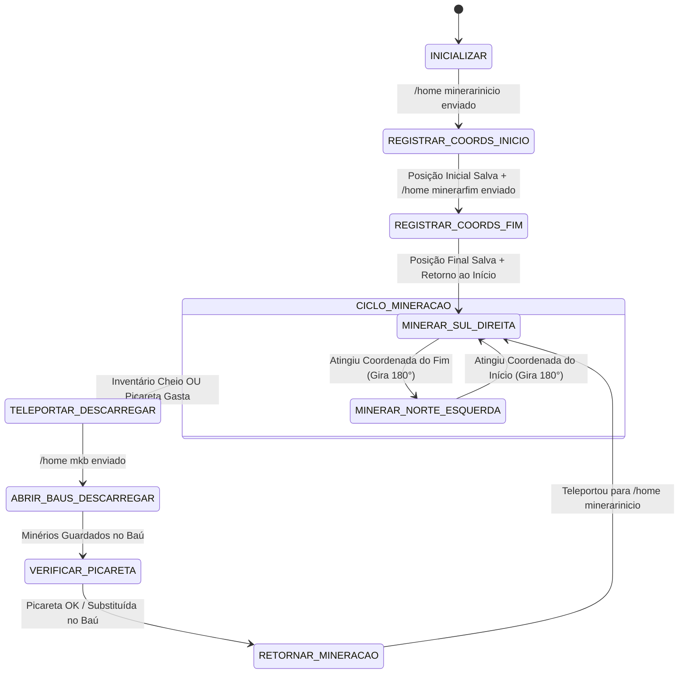

# Especificação Técnica — Macro de Mineração em Trap (`TarefaMineracaoTrap`)

## 1. Visão Geral e Objetivos

O objetivo deste documento é especificar a arquitetura, máquina de estados e fluxo funcional da **Macro de Mineração em Trap de Cobblestone** (`TarefaMineracaoTrap`).

A trap é composta por um corredor fechado de aproximadamente 50 blocos no eixo **Leste-Oeste**, alimentado por fluxos de água e lava que geram *cobblestone* continuamente nas paredes laterais (**Norte** e **Sul**). 

A macro tem os seguintes objetivos automatizados:
1. **Calibração de Coordenadas**: Registrar os pontos extremos do túnel enviando `/home minerarinicio` e `/home minerarfim`.
2. **Ciclo de Mineração Contínua**:
   - **Ida (Sentido Sul)**: Mirar para o **SUL** (Yaw = 0°) e andar para a **DIREITA** (Strafe Right / Tecla `D`), minerando as pedras geradas do lado Sul.
   - **Chegada ao Fim**: Ao atingir a coordenada do fim, virar 180° para o **NORTE** (Yaw = 180°).
   - **Volta (Sentido Norte)**: Mirar para o **NORTE** (Yaw = 180°) e andar para a **ESQUERDA** (Strafe Left / Tecla `A`), minerando as pedras geradas do lado Norte.
3. **Coleta e Inventário**: Como os minérios vão direto para o inventário (recurso do servidor), quando o inventário encher (`slotsVagos == 0`), a macro faz teleporte para `/home mkb` e descarrega os itens nos baús.
4. **Manutenção de Ferramenta (Picareta)**: Checa continuamente a durabilidade da picareta de diamante. Se gasta, troca por uma nova nos baús da `/home mkb`.
5. **Integração com Haste II**: Projetada para altíssima velocidade de quebra (instant break) garantida pelo efeito do sinalizador ativo na chunk.

---

## 2. Diagrama de Estados (FSM)

---

## 3. Especificação Detalhada dos Estados e Movimentação

### 3.1 Geometria e Vetores de Movimento
- **Orientação do Túnel**: Eixo X (Leste ↔ Oeste).
- **Olhar SUL (Yaw = 0°)**:
  - Parede de Cobblestone: Lado Sul ($Y_{olhar} = 0^\circ$).
  - Movimento: Strafe para Direita (`+X` ou `-X` dependendo da orientação). Pressiona tecla `D`.
- **Olhar NORTE (Yaw = 180°)**:
  - Parede de Cobblestone: Lado Norte ($Y_{olhar} = 180^\circ$).
  - Movimento: Strafe para Esquerda (`-X` ou `+X`). Pressiona tecla `A`.

---

### 3.2 Descrição dos Estados

#### Estado 1: `INICIALIZAR`
- **Ação**: Inicia a calibração da rota. Envia `/home minerarinicio`.
- **Transição**: Aguarda o tempo de teleporte (`delayTeleporteMs`, padrão 3500ms) e transita para `REGISTRAR_COORDS_INICIO`.

#### Estado 2: `REGISTRAR_COORDS_INICIO`
- **Ação**: Captura a posição $(X_{\text{inicio}}, Y_{\text{inicio}}, Z_{\text{inicio}})$ atual do bot enviada pela sessão do jogo. Envia o comando `/home minerarfim`.
- **Transição**: Aguarda o teleporte e transita para `REGISTRAR_COORDS_FIM`.

#### Estado 3: `REGISTRAR_COORDS_FIM`
- **Ação**: Captura a posição $(X_{\text{fim}}, Y_{\text{fim}}, Z_{\text{fim}})$ do fim do túnel. Em seguida, envia `/home minerarinicio` para se posicionar no ponto de partida da mineração.
- **Transição**: Após o teleporte de retorno, transita para `MINERAR_SUL_DIREITA`.

#### Estado 4: `MINERAR_SUL_DIREITA` (Mineração Ida)
- **Ação**:
  1. Define a mira para o **SUL** (`Yaw = 0°`, `Pitch = 10°`).
  2. Ativa o botão de ataque para quebrar continuamente os blocos de *cobblestone* à sua frente.
  3. Aplica vetor de movimento para a **DIREITA** (Strafe Right).
  4. Inspeciona a durabilidade da picareta e a contagem de slots vagos no inventário.
- **Transições**:
  - Se `contarSlotsVagos() == 0` ou `durabilidadeGasta`: transita para `TELEPORTAR_DESCARREGAR`.
  - Se a distância horizontal até $(X_{\text{fim}}, Z_{\text{fim}}) \le 1.0$ bloco: transita para `MINERAR_NORTE_ESQUERDA`.

#### Estado 5: `MINERAR_NORTE_ESQUERDA` (Mineração Volta)
- **Ação**:
  1. Gira a mira para o **NORTE** (`Yaw = 180°`, `Pitch = 10°`).
  2. Ativa o botão de ataque para quebrar continuamente os blocos de *cobblestone* à sua frente.
  3. Aplica vetor de movimento para a **ESQUERDA** (Strafe Left).
  4. Inspeciona durabilidade e inventário.
- **Transições**:
  - Se `contarSlotsVagos() == 0` ou `durabilidadeGasta`: transita para `TELEPORTAR_DESCARREGAR`.
  - Se a distância horizontal até $(X_{\text{inicio}}, Z_{\text{inicio}}) \le 1.0$ bloco: transita para `MINERAR_SUL_DIREITA`.

#### Estado 6: `TELEPORTAR_DESCARREGAR`
- **Ação**: Solta os botões de andar/quebrar e envia `/home mkb`.
- **Transição**: Aguarda estabilização do teleporte e transita para `ABRIR_BAUS_DESCARREGAR`.

#### Estado 7: `ABRIR_BAUS_DESCARREGAR`
- **Ação**:
  1. Localiza os baús mais próximos no raio de 4 blocos.
  2. Utiliza `AbridorDeBau` para abrir o container.
  3. Transfere todos os minérios/cobblestones do inventário para os slots vagos do baú.
  4. Fecha a janela do baú.
- **Transição**: Transita para `VERIFICAR_PICARETA`.

#### Estado 8: `VERIFICAR_PICARETA`
- **Ação**:
  1. Verifica a durabilidade da picareta de diamante no slot ativo (hotbar 0).
  2. Se a durabilidade for menor que o limite configurado (ex: `damage >= 1500` numa picareta de 1561 usos):
     - Localiza uma nova picareta de diamante intacta no baú.
     - Move a picareta gasta para o baú e equipa a nova picareta na hotbar 0.
- **Transição**: Transita para `RETORNAR_MINERACAO`.

#### Estado 9: `RETORNAR_MINERACAO`
- **Ação**: Envia o comando `/home minerarinicio`.
- **Transição**: Aguarda estabilização do teleporte e retorna ao ciclo de mineração no estado `MINERAR_SUL_DIREITA`.

---

## 4. Requisitos de Configuração e Parâmetros

A macro utiliza a estrutura `ConfiguracaoDeMacro` do sistema Java com os seguintes parâmetros:

| Chave | Valor Padrão | Descrição |
|---|---|---|
| `homeInicio` | `/home minerarinicio` | Teleporte do ponto inicial da trap. |
| `homeFim` | `/home minerarfim` | Teleporte do ponto final da trap. |
| `homeBau` | `/home mkb` | Teleporte da área de armazenamento e baús. |
| `delayTeleporteMs` | `3500` | Tempo de espera (ms) após enviar o comando de home. |
| `durabilidadeLimite` | `1500` | Dano máximo permitido na picareta antes de efetuar a troca. |
| `pitchMine` | `10.0` | Inclinação da visão (pitch) para mirar no bloco de pedra. |

---

## 5. Resiliência e Tratamento de Exceções

| Cenário de Falha | Tratamento Automatizado |
|---|---|
| **Lag ou Latência de Servidor no Teleporte** | A calibração e transições de teleporte utilizam monitoramento estrito do pacote `PlayerPositionAndLook` do servidor (`ultimoTeleporteRecebidoEm`). O bot aguarda confirmação real de teleporte vinda do servidor (com timeout de até 30s) e estabilização de 500ms da física local, eliminando leituras duplicadas ou falso-positivos por gravidade/queda. |
| **Ausência de Haste II** | A macro continuará minerando adaptativamente usando o tempo normal de quebra calculado pela `CalculadoraDeQuebraDeBloco`. |
| **Baú Cheio ao Descarregar** | Tenta o próximo baú adjacente. Se todos estiverem cheios, desativa a macro emitindo alerta ao operador. |
| **Sem Picareta Nova no Baú** | Se a picareta estiver quebrada e não houver substituta no baú `mkb`, a macro encerra com segurança para evitar minerar com a mão. |
| **Bloqueio Físico no Corredor** | Se o bot não se mover (posição estática) por mais de 5 segundos durante a caminhada, re-executa a home do ponto correspondente para desbugar a posição. |

---

## 6. Mapeamento para Arquitetura Java (`advancedbot-java`)

- **Classe Principal**: `com.advancedbot.domain.bot.TarefaMineracaoTrap`
- **Comando do Operador**: `com.advancedbot.interfaces.comando.ComandoMineracaoTrap` (aliases: `/minerartrap`, `$minerartrap`)
- **Componentes Reutilizados**:
  - `AbridorDeBau` e `Janela`: Abertura e descarregamento de itens em baús (DEC-37).
  - `MacroUtils.itemNaMao()` / `MacroUtils.contarSlotsVagos()`: Inspeção de inventário.
  - `SessaoDeJogo.iniciarQuebraDeBloco()` e `balancarBraco()`: Pacotes nativos de mineração protocolar.
