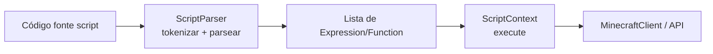
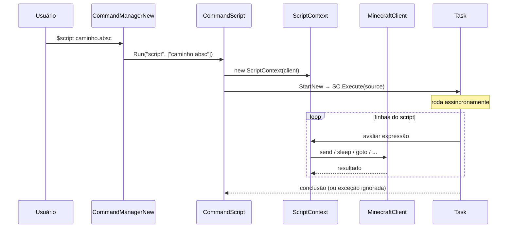

# Sistema de Scripts — `AdvancedBot.Script`

Fontes: `ScriptParser.cs`, `ScriptContext.cs`, `JsScriptContext.cs`, `Expression.cs`, `Function.cs`, `Token.cs`, `TokenType.cs`, `Variable.cs`, `ParserException.cs`, `ScriptException.cs`.

---

## Objetivo e papel

O módulo de scripts permite que o operador escreva automações em dois ambientes diferentes sem modificar o código do bot:

1. **Engine própria** (`ScriptParser` + `ScriptContext`): linguagem imperativa simples com variáveis, condicionais, laços e funções nativas mapeadas para operações do bot.
2. **Engine Jint** (`JsScriptContext`): JavaScript completo (ECMAScript 5.1) via biblioteca Jint, com objeto `bot` que expõe a API do bot.

---

## Arquitetura do engine próprio



### `ScriptParser` — lexer + parser

O parser implementa um **lexer manual** e um **parser descendente recursivo** em uma só classe.

**Fases:**
1. **Tokenização**: percorre caractere a caractere, produz `Token[]`. Tokens incluem: `Identifier`, `Number`, `String`, `Op` (operadores: `+,-,*,/,>,<,==,!=,&&,||,!`), `LParen`, `RParen`, `LBrace`, `RBrace`, `Semicolon`, `Comma`, `Assign`, `EOF`.
2. **Parsing**: constrói `Expression` recursivamente. Reconhece: declarações de variável (`var x = expr`), atribuições, chamadas de função, `if(cond){...}else{...}`, `while(cond){...}`, `return expr`.
3. **Funções**: `function nome(params){...}` são extraídas antes do script principal e registradas no `ScriptContext`.

### `Expression` e `Variable`

`Expression` é um nó genérico da AST. Pode representar: literal (número/string), referência a variável, operação binária, chamada de função, bloco. `Variable` é o contêiner de valor em runtime: `string`, `double` ou `bool`.

### `ParserException` e `ScriptException`

`ParserException`: erro de sintaxe durante parsing — inclui linha e mensagem.  
`ScriptException`: erro de runtime durante execução — inclui mensagem e estado.

---

## `ScriptContext` — runtime do engine próprio

Mantém:
- `Dictionary<string, Variable> variables`: escopo plano (sem closures, sem escopo aninhado).
- `Dictionary<string, Function> functions`: funções definidas no script.
- `MinecraftClient client`: referência ao cliente associado.

### Funções nativas disponíveis para scripts

| Função | Comportamento |
|---|---|
| `send(msg)` | `client.SendMessage(msg)` |
| `chat(msg)` | `client.PrintToChat(msg)` |
| `sleep(ms)` | `Thread.Sleep(ms)` — bloqueia a Task do script |
| `goto(x,y,z)` | `client.RequestPathTo(x,y,z)` |
| `look(x,y,z)` | `client.Player.LookTo(x,y,z)` |
| `sneaking(bool)` | toggle de sneak |
| `hotbar(slot)` | `client.HotbarSlot = slot` |
| `click(slot)` | `client.Inventory.Click(...)` |
| `break(x,y,z)` | sequência de digging packets |
| `place(x,y,z,face)` | `PacketBlockPlace` |
| `getblock(x,y,z)` | `client.TheWorld.GetBlock(...)` retorna ID |
| `getx/y/z()` | posição do jogador |
| `health()` | `client.health` |
| `getplayer(nick)` | retorna `MPPlayer` ou null |
| `wait(cond_str)` | spin-wait até condição ser verdadeira |
| `log(msg)` | `Console.WriteLine` |

**Nota de threading:** `sleep()` bloqueia a thread da `Task` do script. Não há cancelamento cooperativo — o script continua rodando até `return` ou exceção mesmo após desconexão do cliente.

---

## `JsScriptContext` — engine JavaScript

Instancia `Jint.Engine` e expõe um objeto `bot` com os mesmos métodos da tabela acima, mais acesso completo à API JavaScript (closures, callbacks, JSON, etc.). O script é executado como `engine.Execute(scriptSource)`.

Vantagens sobre o engine próprio: closures, arrays, objetos, JSON.parse, setTimeout simulado.

Desvantagem: `Jint` é uma dependência externa (`.dll` de ~320 KB) sem controle de versão explícito no csproj analisado.

---

## `CommandScript` — integração com o sistema de comandos

`CommandScript.Run("script", args)`:
1. Lê arquivo de script do caminho informado ou do argumento.
2. Escolhe engine (`.js` → `JsScriptContext`, `.absc` → engine próprio).
3. Inicia `Task.Factory.StartNew(() => context.Execute(source))`.
4. Retorna `CommandResult.Ok` imediatamente — script roda em paralelo.

Não há cancelamento quando o bot desconecta. A `Task` pode continuar indefinidamente se o script tiver `while(true)` e não verificar estado de conexão.

---

## Diagrama de execução de script



---

## Relação com protocolo, inventário e IA

- `send()`: emite `PacketChatMessage` via `client.SendMessage`.
- `goto()`: chama `RequestPathTo`, que usa A* no `World`.
- `break()`: emite sequência `PacketPlayerDigging(START, DONE)`.
- `place()`: emite `PacketBlockPlace`.
- `click()`: manipula `Inventory.Click`.
- `hotbar()`: emite `PacketHeldItemChange`.
- Scripts não têm acesso direto a `PacketStream` — todos os efeitos passam pela API pública do cliente.

---

## Problemas arquiteturais

1. **Sem cancelamento de Task**: scripts `while(true)` não terminam após desconexão.
2. **Escopo plano**: sem closures ou escopo de bloco no engine próprio — variáveis declaradas dentro de `if` vazam para o escopo global do script.
3. **`sleep()` é bloqueante**: bloqueia thread do pool sem yield cooperativo.
4. **Sem sandbox**: scripts têm acesso completo a `MinecraftClient` — podem causar disconnect, modificar inventário, etc.
5. **Jint sem versão fixada**: qualquer atualização da DLL pode quebrar scripts existentes.

---

## Java

```java
// Engine própria
public class BotScriptEngine {
  public ScriptHandle execute(String source, BotSessionApi api) {
    // compila e executa em VirtualThread (Java 21+)
    // cancela via Thread.interrupt() quando sessão desconecta
  }
}

// JavaScript via GraalJS (substitui Jint)
public class JsBotScriptEngine {
  public ScriptHandle execute(String source, BotSessionApi api) {
    Context ctx = Context.newBuilder("js")
      .option("js.ecmascript-version", "2020")
      .build();
    ctx.eval("js", buildApiWrapper(api));
    return new JsScriptHandle(ctx.eval("js", source));
  }
}

// API exposta ao script — sem referência a implementação concreta
public interface BotSessionApi {
  void send(String msg);
  void sleep(long ms) throws InterruptedException;
  void goTo(int x, int y, int z);
  byte getBlock(int x, int y, int z);
  double getX(); double getY(); double getZ();
  int getHealth();
}
```

Preservar: funções nativas listadas, semântica de `goto` como pathfinding assíncrono, bloqueio de `sleep`, retorno imediato de `CommandScript.Run`.
