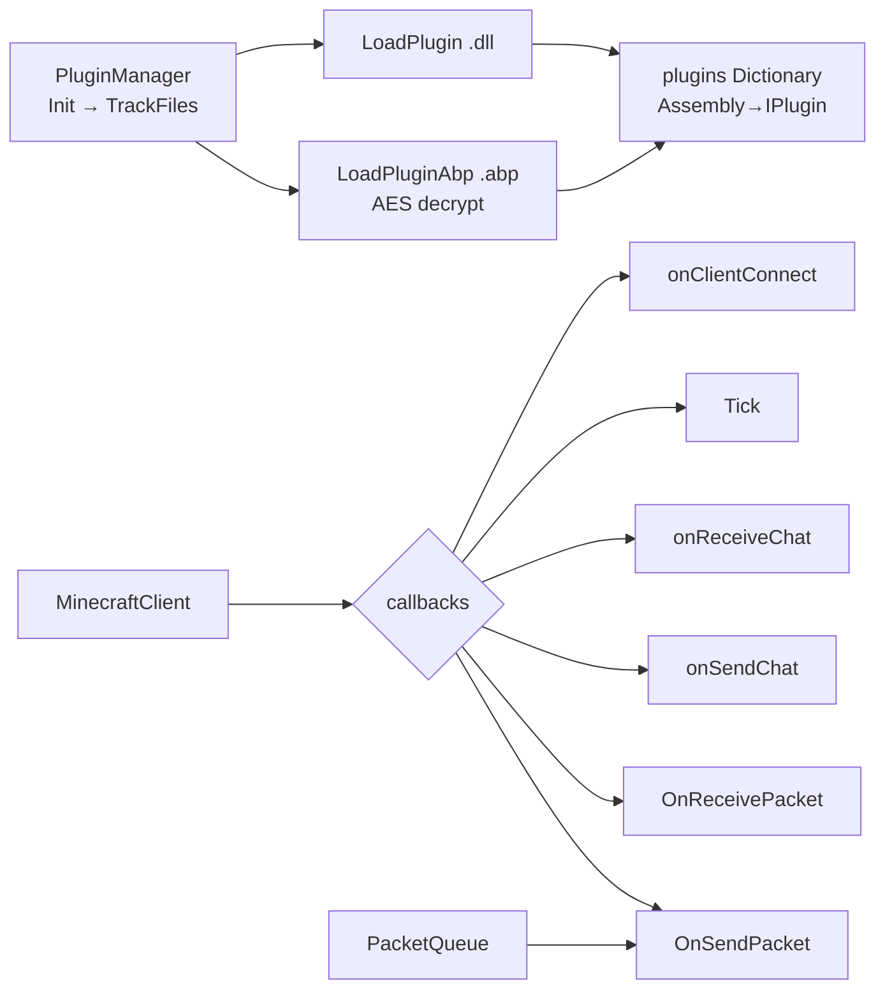
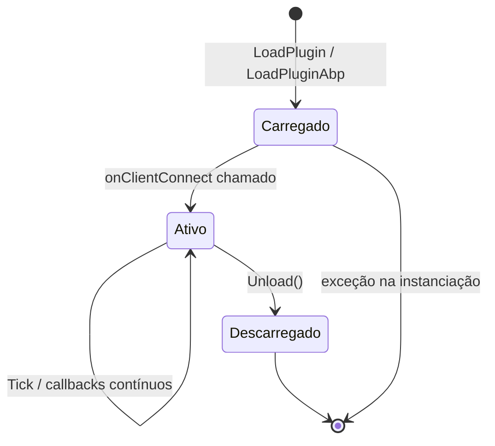

# Sistema de Plugins — `AdvancedBot.Plugins`

Fontes: `IPlugin.cs`, `PluginManager.cs`, `AdvancedBotAPI.cs`.

---

## Objetivo e papel

O sistema de plugins permite estender o bot com comportamentos externos sem modificar o núcleo. Plugins são assemblies .NET (`.dll`) ou assemblies criptografados (`.abp`) carregados em runtime que implementam a interface `IPlugin`. O `PluginManager` gerencia o ciclo de vida, a descoberta e o dispatch de callbacks para todos os plugins registrados.

---

## Arquitetura



---

## `IPlugin` — contrato do plugin

```csharp
[Obfuscation(Exclude = true)]
public interface IPlugin {
    void Unload();
    void Tick();
    void onClientConnect(MinecraftClient client);
    void OnReceivePacket(ReadBuffer pkt, MinecraftClient client);
    bool OnReceivePacketV1_5(PacketStreamLegacy psl, byte packetId, MinecraftClient client);
    void OnSendPacket(IPacket packet, MinecraftClient client);
    void onReceiveChat(string chat, byte pos, MinecraftClient client);
    void onSendChat(string chat, MinecraftClient client);
}
```

### Callbacks e ordem de chamada

| Callback | Chamado por | Momento | Pode cancelar? |
|---|---|---|---|
| `Unload()` | `PluginManager.Unload()` | encerramento do processo | não |
| `Tick()` | `MinecraftClient.Tick()` + `PluginManager.Tick()` | todo tick | não |
| `onClientConnect(client)` | `MinecraftClient.StartClient()` | antes do handshake | não |
| `OnReceivePacket(pkt, client)` | handler 1.7+, antes de processar | ao receber pacote de play | não (atual); retorno void |
| `OnReceivePacketV1_5(psl, id, client)` | `Handler_v152`, ao receber pacote | apenas 1.5.2 | sim (retorna `bool`) |
| `OnSendPacket(packet, client)` | `PacketQueue.AddToQueue` | antes de enfileirar | não (atual); retorno void |
| `onReceiveChat(chat, pos, client)` | `MinecraftClient.HandlePacketChat` | ao receber mensagem de chat | não |
| `onSendChat(chat, client)` | `MinecraftClient.SendMessage` | ao enviar mensagem | não |

**Nota crítica:** `OnReceivePacketV1_5` é o único callback que pode cancelar o processamento (retorno `bool`). Os demais são fire-and-forget. Se um plugin lançar exceção em qualquer callback, ela não é capturada pelo `PluginManager` — propaga para o chamador.

---

## `PluginManager` — ciclo de vida e descoberta

### Inicialização (`Init()`)

Chamada em `Program.Main` **antes** de `LoadConf()` e `CheckKey()`. Sequência:

1. Verifica se existe diretório `Plugins\`; se não, cria-o e retorna.
2. Carrega todos os `.dll` com `LoadPlugin(path)`.
3. Carrega todos os `.abp` com `LoadPluginAbp(path)`.
4. Erros são logados via `Program.CreateErrLog(ex, "pluginerr")` sem abortar a inicialização.
5. Chama `TrackFiles()` para monitorar o diretório.

### Carregamento de plugin

**`.dll`:** `Assembly.Load(File.ReadAllBytes(path))` — carrega em memória sem path lock. Percorre `GetTypes()` e encontra o primeiro tipo que implementa `IPlugin`. Cria instância via `Activator.CreateInstance` e registra em `plugins[assembly] = value`.

**`.abp`:** Idêntico, mas passa o conteúdo do arquivo por `AesEncryption().DecryptFileToByteArray(path, "4a32544e013f37c028cedadb2d5b7c683de3d023")` antes de carregar. A chave AES é hardcoded no binário.

### Hot-reload (`TrackFiles`, `OnChanged`)

`FileSystemWatcher` monitora `Plugins\*.dll`. Quando um arquivo muda, espera 1 segundo (`Task.Delay(1000)`) e chama `LoadPlugin` novamente. Não há descarregamento do assembly anterior — assemblies .NET não podem ser descarregados sem `AssemblyLoadContext`; o mesmo `plugins` dicionário receberá o novo valor sobre o mesmo assembly, mas o antigo permanece na memória do processo.

### `DoCommand(sender, fullCmd)`

Permite que plugins registrem comandos de chat com `RegisterCommand(name, CommandDelegate)`. Quando `MinecraftClient.SendMessage` recebe texto que começa com `$`, verifica `PluginManager.DoCommand` antes (não demonstrado no código analisado — o mecanismo existe mas a chamada pode ser feita via `CommandManagerNew.RunCommand` em conjunto).

---

## `AdvancedBotAPI` — fachada para plugins

Expõe métodos utilitários estáticos para uso dentro de plugins, sem exigir referência direta a `MinecraftClient` ou `Program`:

| Método | Semântica |
|---|---|
| `GetClients()` | Retorna lista de `MinecraftClient` ativos (lista da UI principal). |
| `GetConfig(path)` | Delega para `Program.GetConfigStr/Int/...`. |
| `Log(msg)` | Escreve no console de debug do formulário principal. |
| `RegisterCommand(name, delegate)` | Registra comando de plugin. |

---

## Máquina de estados de um plugin



Não há estado `Pausado` — um plugin ou está ativo (recebe callbacks) ou está descarregado.

---

## Sincronização

`plugins` e `paths` são acessados sob `lock(plugins)` em `LoadPlugin`, `Unload` e `Tick`. Contudo:
- `onClientConnect` é chamado de `MinecraftClient.StartClient()` sem lock.
- `OnReceivePacket` é chamado do callback de rede sem lock.
- `OnSendPacket` é chamado de `PacketQueue.AddToQueue` sem lock.

Portanto, callbacks de rede e o tick do processo podem ser concorrentes com um hot-reload.

---

## Problemas arquiteturais

1. **Assemblies não descarregados**: hot-reload vaza o assembly antigo na memória. Em execuções longas, múltiplos reloads causam crescimento de heap.
2. **Chave AES hardcoded**: `.abp` usa chave fixa no binário — qualquer usuário que descompilar o executável pode descriptografar qualquer plugin `.abp`.
3. **Callbacks sem captura de exceção**: exceção em `IPlugin.Tick()` propaga para o tick do `MinecraftClient` ou da UI.
4. **`plugins` é `Dictionary<Assembly, IPlugin>`**: se dois arquivos tiverem o mesmo `Assembly` (improvável, mas possível), um substituirá o outro silenciosamente.
5. **Referência de implementação exposta**: `IPlugin` recebe `MinecraftClient` concreto — qualquer plugin pode modificar qualquer estado da sessão.
6. **`OnReceivePacketV1_5` retorna `bool` mas os demais não**: inconsistência de design; plugins 1.5.2 podem cancelar, os modernos não.

---

## Relação com protocolo

Plugins observam pacotes de entrada (`OnReceivePacket`) e de saída (`OnSendPacket`). Para 1.5.2, podem cancelar (`OnReceivePacketV1_5 = false`). Para versões modernas, são apenas observadores.

---

## Java

```java
// Interface de plugin com capacidade de cancelar qualquer evento via resultado
public interface BotPlugin {
    void onLoad(PluginContext ctx);
    void onUnload();
    void onTick(BotSession session);
    void onConnect(BotSession session);
    EventResult onReceivePacket(Packet packet, BotSession session);
    EventResult onSendPacket(Packet packet, BotSession session);
    EventResult onChatReceived(String message, byte position, BotSession session);
    EventResult onChatSend(String message, BotSession session);
}

// EventResult = PASS (deixa passar) | CANCEL (cancela) | MODIFY (substitui)

public class PluginManager {
    private final List<BotPlugin> plugins = new CopyOnWriteArrayList<>();

    // Hot-reload com classloader isolado por plugin
    public void loadPlugin(Path path) {
        URLClassLoader cl = new URLClassLoader(new URL[]{path.toUri().toURL()},
                                               BotPlugin.class.getClassLoader());
        // instancia e registra
    }

    public void unloadPlugin(BotPlugin plugin) {
        plugins.remove(plugin);
        plugin.onUnload();
        // fecha o classloader
    }
}

// Portas expostas ao plugin — sem referência à implementação concreta
public interface PluginContext {
    List<BotSessionView> getSessions();
    void registerCommand(String name, CommandHandler handler);
    Logger getLogger();
}
```

Preservar: ordem de chamada (connect antes de tick), posibilidade de cancelar pacote, separação entre `.dll` aberto e `.abp` criptografado.
