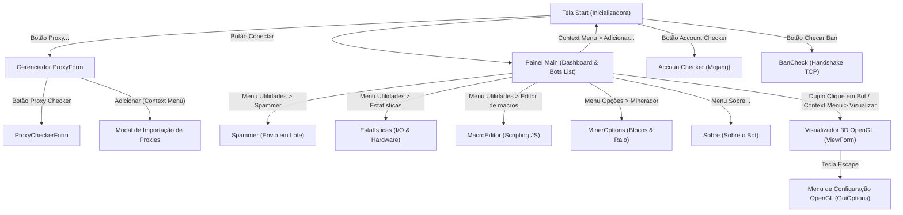

# Análise Funcional da Interface Legada

## Objetivo

Este documento apresenta uma análise funcional e estrutural completa da interface gráfica do sistema AdvancedBot.
Originalmente desenvolvido em Windows Forms (C#), este mapeamento servirá de base técnica para a futura
reconstrução da interface utilizando uma arquitetura baseada em React e Tailwind CSS para a web.

---

## Escopo

A análise contempla todas as janelas, controles customizados, menus, modais e o visualizador 3D desenvolvidos
na solução legada C#. Foca-se em descrever o comportamento, parâmetros configurados, validações, fluxos de
interação e dependências de dados. Não inclui a lógica de baixo nível do protocolo Minecraft.

---

## Sumário

1. [Etapa 1: Inventário das Telas](#etapa-1-inventário-das-telas)
2. [Etapa 2: Mapa de Navegação](#etapa-2-mapa-de-navegação)
3. [Etapa 3: Classificação das Telas](#etapa-3-classificação-das-telas)
4. [Etapa 4: Casos de Uso da Interface](#etapa-4-casos-de-uso-da-interface)
5. [Etapa 5: Estados da Interface](#etapa-5-estados-da-interface)
6. [Etapa 6: Dependências de Contexto e Ciclo de Vida](#etapa-6-dependências-de-contexto-e-ciclo-de-vida)
7. [Etapa 7: Mapeamento de Componentes Reutilizáveis](#etapa-7-mapeamento-de-componentes-reutilizáveis)

---

## Etapa 1: Inventário das Telas

### 1. Tela de Conexão Inicial (`Start`)

- **Objetivo**: Configurar os parâmetros de conexão de rede, carregar contas de bots e inicializar a sessão do servidor.
- **Localização do Código-Fonte**: [Start.cs](file:///c:/Users/Administrator/Desktop/ADVs/ProjetosBot/Projeto%20Adv%202.4.5/AdvancedBot/Start.cs)
- **Componentes e Controles Principais**:
  - Campo de Endereço do Servidor (`svTb` - TextBox).
  - Campo de Versão do Cliente (`versionCb` - ComboBox).
  - Controle de conexões simultâneas máximas (`maxConUd` - NumericUpDown).
  - Controle de delay entre logins (`delayUd` - NumericUpDown).
  - Opções adicionais (Checkboxes: Física `cbPhys`, Ignorar Ping `cbPing`, Limite de Chunks `cbChunkLimit`, Testar Ping `cbDoPing`).
  - Entrada em lote de contas (`rtbAccounts` - TextBox multilinha).
  - Botão "Conectar" (`btnConnect`).
  - Botões para ferramentas complementares ("Proxy...", "Account Checker", "Checar Ban").
- **Regras de Validação e Limitações**:
  - As credenciais de contas inseridas em lote devem seguir o formato `username:password` ou simplesmente `username`.
  - Controle de delay mínimo para logins consecutivos para prevenir bloqueio por IP (firewalls de servidores).
- **Ações do Usuário e Eventos**:
  - Menu de contexto na caixa de contas para geração de nicks (aleatórios, numéricos, ou com prefixos pré-definidos).
  - Clique em "Conectar" dispara o thread assíncrono de criação e autenticação dos clientes de Minecraft.
- **Entrada e Saída de Dados**:
  - Entrada: Credenciais de contas, parâmetros de rede e flags de física/ping.
  - Saída: Sessões de clientes instanciadas passadas ao painel principal (`Main`).

### 2. Painel Principal / Console (`Main`)

- **Objetivo**: Monitorar sessões ativas, gerenciar a lista de bots conectados, enviar comandos de chat e visualizar logs.
- **Localização do Código-Fonte**: [Main.cs](file:///c:/Users/Administrator/Desktop/ADVs/ProjetosBot/Projeto%20Adv%202.4.5/AdvancedBot/Main.cs)
- **Componentes e Controles Principais**:
  - Barra de menus superior (`menuStrip1`): "Utilidades", "Opções", "Sobre".
  - Lista de bots conectados (`lbUsers` - Custom Control `UserListBox` que estende `ListBox`).
  - Painel de mensagens do Chat (`rtbChat` - RichTextBox customizado para renderizar cores do Minecraft).
  - Caixa de digitação de chat (`textBox1` - TextBox) e botão "Enviar" (`button1`).
- **Regras de Validação e Limitações**:
  - Campo de texto de chat limitado a 100 caracteres (`textBox1.MaxLength = 100`), respeitando o limite nativo do Minecraft.
- **Ações do Usuário e Eventos**:
  - Clique na lista de bots seleciona se a exibição do chat exibe logs de "Todos" ou de um bot específico.
  - Duplo clique em um bot abre o Visualizador 3D OpenGL.
  - Menu de contexto na lista de bots (`lbOps`): Adicionar novos bots (reabre `Start`), Remover selecionado, Visualizar, Salvar estado, Conectar desconectados, Desconectar todos.
  - Menu de contexto do chat (`chatOptions`): Copiar, Mudar cor de fundo do console, Mudar fonte de texto do console.
- **Entrada e Saída de Dados**:
  - Entrada: Mensagens recebidas no chat do servidor, logs de conexão de rede.
  - Saída: Mensagens de chat enviadas, comandos do console, exportação de arquivos de estado (`.state` em formato NBT).

### 3. Validador de Contas Mojang (`AccountChecker`)

- **Objetivo**: Testar uma lista de contas contra os servidores de autenticação da Mojang em segundo plano.
- **Localização do Código-Fonte**: [AccountChecker.cs](file:///c:/Users/Administrator/Desktop/ADVs/ProjetosBot/Projeto%20Adv%202.4.5/AdvancedBot/AccountChecker.cs)
- **Componentes e Controles Principais**:
  - Campo de inserção de contas (`rtbAccs` - RichTextBox).
  - Lista de status das contas (`lvAccs` - ListView).
  - Barra de progresso percentual (`percentageProgressBar1`).
  - Botões de controle: "Iniciar", "Salvar válidas", "Proxy".
- **Regras de Validação e Limitações**:
  - Processamento multi-threaded com suporte opcional a proxies para evitar bloqueio por requisições em excesso de um mesmo IP.
- **Entrada e Saída de Dados**:
  - Entrada: Arquivo ou texto cru de contas (`username:password`).
  - Saída: Arquivo de texto filtrado contendo apenas as credenciais de contas consideradas válidas.

### 4. Checador de Banimentos (`BanCheck`)

- **Objetivo**: Validar rapidamente se um lote de contas está banido de um servidor Minecraft sem completar o login.
- **Localização do Código-Fonte**: [BanCheck.cs](file:///c:/Users/Administrator/Desktop/ADVs/ProjetosBot/Projeto%20Adv%202.4.5/AdvancedBot/BanCheck.cs)
- **Componentes e Controles Principais**:
  - Campo de endereço do servidor alvo (`tbServer` - TextBox).
  - Campo de lote de contas (`rtbAccs` - RichTextBox).
  - Lista de logs de status (`listBox1`).
  - Barra de progresso percentual (`percentageProgressBar1`).
  - Botão "Iniciar".
- **Ações do Usuário e Eventos**:
  - Clique em "Iniciar" executa a tentativa de handshake TCP simulando o protocolo Minecraft e capturando a mensagem de desconexão (kick packet).

### 5. Configuração de Auto-Login (`FrmLogin`)

- **Objetivo**: Definir os comandos de texto automáticos para autenticação de bots em servidores piratas.
- **Localização do Código-Fonte**: [FrmLogin.cs](file:///c:/Users/Administrator/Desktop/ADVs/ProjetosBot/Projeto%20Adv%202.4.5/AdvancedBot/FrmLogin.cs)
- **Componentes e Controles Principais**:
  - Campo para template de Login (`tbLogin` - TextBox). Exemplo: `/login @pass`.
  - Campo para template de Registro (`tbRegister` - TextBox). Exemplo: `/register @pass @pass`.
  - Botão "OK".

### 6. Editor de Macros (`MacroEditor`)

- **Objetivo**: Escrever, salvar e debugar scripts em JavaScript para automatizar o comportamento dos bots.
- **Localização do Código-Fonte**: [MacroEditor.cs](file:///c:/Users/Administrator/Desktop/ADVs/ProjetosBot/Projeto%20Adv%202.4.5/AdvancedBot/MacroEditor.cs)
- **Componentes e Controles Principais**:
  - Editor de texto com destaque de sintaxe e autocompletar (`fastColoredTextBox1` - FastColoredTextBox).
  - Label de status de compilação/execução (`lblStatus`).
  - Barra de ferramentas: Botões de "Abrir", "Salvar", "Compilar/Executar".

### 7. Parâmetros do Minerador (`MinerOptions`)

- **Objetivo**: Configurar prioridades de blocos e ações a serem tomadas pelo bot ao minerar de forma automatizada.
- **Localização do Código-Fonte**: [MinerOptions.cs](file:///c:/Users/Administrator/Desktop/ADVs/ProjetosBot/Projeto%20Adv%202.4.5/AdvancedBot/MinerOptions.cs)
- **Componentes e Controles Principais**:
  - Lista de blocos alvo e prioridades (`lvBlocks` - ListView).
  - Botões para ordenar a prioridade (Subir/Descer).
  - Checkbox "Minerar apenas os selecionados" (`cbOnlySelected`).
  - Checkbox "Selecionar melhor ferramenta automaticamente" (`cbAutoTool`).
  - NumericUpDown para raio máximo de escavação (`nudRadius`).
  - ComboBox de ação para inventário cheio (`cbInvFull` - Opções: Parar, Jogar blocos fora, Executar comandos customizados).
  - Caixa de texto para lista de comandos a rodar no chat se o inventário encher (`rtbCmds` - RichTextBox).

### 8. Gerenciador de Proxies (`ProxyForm`)

- **Objetivo**: Listar e editar a coleção de servidores proxy disponíveis para os bots.
- **Localização do Código-Fonte**: [ProxyForm.cs](file:///c:/Users/Administrator/Desktop/ADVs/ProjetosBot/Projeto%20Adv%202.4.5/AdvancedBot/ProxyForm.cs)
- **Componentes e Controles Principais**:
  - Tabela de proxies (`lvProxies` - Custom Control `ProxyListView`). Colunas: Endereço, Tipo, País.
  - Botão "OK" (aplica as alterações).
  - Botão "Proxy checker" (abre a tela de testes).
  - Botão "Salvar" (abre menu suspenso para exportação).
- **Ações do Usuário e Eventos**:
  - Menu de contexto na lista (`lvMenu`): Adicionar (abre modal de inserção de texto em lote), Remover, Copiar.
  - Menu de exportação (`saveMenu`): Permite salvar arquivos contendo Socks4, Socks5, HTTP ou todas as proxies em arquivos `.txt`.

### 9. Testador de Proxies (`ProxyCheckerForm`)

- **Objetivo**: Validar a latência, tipo e status operacional de uma lista de proxies informada pelo usuário.
- **Localização do Código-Fonte**: [ProxyCheckerForm.cs](file:///c:/Users/Administrator/Desktop/ADVs/ProjetosBot/Projeto%20Adv%202.4.5/AdvancedBot/ProxyCheckerForm.cs)
- **Componentes e Controles Principais**:
  - ComboBox para seleção de servidor alvo de teste (`cbServer`).
  - Caixa de inserção de proxies (`rtbProxies` - RichTextBox).
  - Tabela com resultados em tempo real (`lvProxies` - ProxyListView).
  - Radio buttons para escolha do modo de validação (`rbPing` para teste de handshake rápido ou `rbLogin` para validação de login).
  - Barra de progresso percentual (`percentageProgressBar1`).
  - Botão "Iniciar".
- **Regras de Validação e Limitações**:
  - Menu de contexto na tabela de resultados permite aplicar filtros imediatos (remover proxies com latência acima de X ms, remover inválidas, copiar filtradas).

### 10. Configuração de Prefixo (`SetPrefixForm`)

- **Objetivo**: Configurar o prefixo de nicks gerados automaticamente.
- **Localização do Código-Fonte**: [SetPrefixForm.cs](file:///c:/Users/Administrator/Desktop/ADVs/ProjetosBot/Projeto%20Adv%202.4.5/AdvancedBot/SetPrefixForm.cs)
- **Componentes e Controles Principais**:
  - Campo de texto para prefixo (`tbPrefix` - TextBox).
  - Botão OK.
- **Regras de Validação e Limitações**:
  - Limite de comprimento definido para 13 caracteres (`tbPrefix.MaxLength = 13`) para não estourar o limite de 16 caracteres do Minecraft clássico.

### 11. Visualizador 3D do Mundo (`ViewForm`)

- **Objetivo**: Apresentar a renderização visual tridimensional do mundo do jogo sob a perspectiva do bot ou em modo de câmera livre (Freecam).
- **Localização do Código-Fonte**: [ViewForm.cs](file:///c:/Users/Administrator/Desktop/ADVs/ProjetosBot/Projeto%20Adv%202.4.5/AdvancedBot.Viewer/ViewForm.cs)
- **Componentes e Controles Principais**:
  - Janela de renderização baseada em OpenGL/WGL.
  - Overlay de informações textuais de depuração (FPS médio, tempo de renderização, coordenadas X/Y/Z da câmera, blocos apontados, informações de entidade).
  - Painel de inventário sobreposto na tela (acionado ao pressionar a tecla `E`).
  - Console de Chat embutido (acionado ao pressionar a tecla `T`).
  - Barra rápida de itens (hotbar) renderizada na base.
  - Menu de opções customizado (`GuiOptions`) para configurações gráficas (Uso de texturas, raio de visão de chunks, limites de FPS, uso de VBOs e velocidade de voo).
- **Ações do Usuário e Eventos**:
  - Movimentação de câmera: Mouse livre.
  - Movimentação do boneco no modo de controle: Teclas clássicas W, A, S, D, Espaço (pular/voar para cima), Shift (agachar/voar para baixo), Control (correr).
  - Teclas de atalho específicas:
    - `F4`: Alterna overlay de dados.
    - `F5`: Recarrega o renderizador de chunks.
    - `F6`: Alterna entre Câmera Livre (Freecam) e Controle do Jogador.
    - `F7`: Alterna a exibição do chat.
    - `R`: Alterna KillAura.
    - `F`: Alterna Fly (Voo).
    - `Q`: Larga item ativo.
    - `1-9`: Seleciona slot da barra de itens.

---

## Etapa 2: Mapa de Navegação

O fluxo de alternância de foco e abertura de janelas a partir da inicialização da aplicação pode ser visualizado no seguinte diagrama de transições:



---

## Etapa 3: Classificação das Telas

| Tela | Tipo de Componente | Padrão UX Recomendado para o React |
|---|---|---|
| `Start` | Formulário de Configuração / Setup | Página de Entrada / Configuração Inicial |
| `Main` | Painel Principal (Dashboard) | Dashboard central com Grid (Sidebar + Console de Logs) |
| `ProxyForm` | Janela de Gerenciamento de Dados | Tabela Interativa de Gerenciamento com Ações Rápidas |
| `ProxyCheckerForm` | Ferramenta Utilitária / Validador | Painel de Controle de Execução e Tabela de Status |
| `AccountChecker` | Ferramenta Utilitária / Validador | Formulário de Input em lote e Tabela de Resultados |
| `BanCheck` | Ferramenta Utilitária / Validador | Formulário de Input em lote e Tabela de Resultados |
| `MinerOptions` | Diálogo de Configuração | Painel de Configuração Avançada (Abas ou Seções) |
| `MacroEditor` | Editor de Código / Scripts | Editor de Código Integrado (ex: Monaco Editor / React-Simple-Code-Editor) |
| `Spammer` | Ferramenta de Automação / Spam | Painel de Escrita e Controle de Envio com Autocompletar |
| `Statistics` | Dashboard de Monitoramento | Gráficos de Linha em tempo real e Grid de Métricas de Performance |
| `SetPrefixForm` | Modal / Diálogo Simples | Caixa de Diálogo Modal |
| `FrmLogin` | Modal / Diálogo Simples | Caixa de Diálogo Modal |
| `Changelog` | Modal de Texto Informativo | Caixa de Diálogo Modal com texto em Markdown |
| `AboutNew` | Modal / Tela Informativa | Modal com Design Visual estilizado (Dark Mode / Efeitos visuais) |
| `ViewForm` | Renderizador 3D Interativo | Canvas 3D (Web-GL via Three.js / react-three-fiber) |

---

## Etapa 4: Casos de Uso da Interface

### Caso de Uso 1: Inicialização em Massa de Bots
- **Atores**: Operador do AdvancedBot.
- **Ações na Interface**:
  1. O usuário abre a aplicação e visualiza a tela `Start`.
  2. Insere o endereço do servidor Minecraft e seleciona a versão (ex: 1.5.2).
  3. Cola um lote de 20 contas no formato `conta:senha` no RichTextBox principal.
  4. Configura o delay de conexão para 1500 ms e o limite máximo para 20.
  5. Clica no botão "Conectar".
- **Resultado Esperado**: A tela `Start` é ocultada, a tela `Main` é carregada exibindo a barra lateral com os 20 bots iniciando a conexão sequencialmente, populando o painel de chat centralizado.

### Caso de Uso 2: Auditoria de Latência de Proxies
- **Atores**: Operador do AdvancedBot.
- **Ações na Interface**:
  1. Na barra lateral da tela `Main`, o usuário clica com o botão direito na lista de bots e clica em "Adicionar...".
  2. Na tela `Start`, clica em "Proxy..." para abrir o gerenciador `ProxyForm`.
  3. No `ProxyForm`, clica em "Proxy checker" para invocar a janela `ProxyCheckerForm`.
  4. Cola uma lista de proxies IP:Porta e seleciona o servidor alvo de teste.
  5. Seleciona o modo de teste para "Ping" e clica em "Iniciar".
  6. Observa o progresso. Ao finalizar, clica com o botão direito na tabela de resultados e clica em "Remover proxies com o ping > 1000ms".
  7. Fecha a janela `ProxyCheckerForm`. As proxies válidas são atualizadas na lista principal de proxies prontas para uso.

### Caso de Uso 3: Operação Remota em Câmera Livre (Freecam)
- **Atores**: Operador do AdvancedBot.
- **Ações na Interface**:
  1. Na lista de bots conectados da tela `Main`, o usuário seleciona `Bot_01` e faz duplo clique.
  2. A janela `ViewForm` OpenGL se abre, renderizando os blocos ao redor do bot e outras entidades.
  3. Pressiona a tecla `F6` para ativar o modo Freecam.
  4. Utiliza as teclas W, A, S, D e o mouse para navegar pelo mapa de forma incorpórea (voando através de blocos) para auditar a vizinhança.
  5. Pressiona `Escape` para ajustar a distância de renderização gráfica diretamente no overlay.

### Caso de Uso 4: Automação de Mensagens Segmentadas (Spam)
- **Atores**: Operador do AdvancedBot.
- **Ações na Interface**:
  1. Na tela `Main`, acessa "Utilidades > Spammer".
  2. Na caixa de digitação, escreve a mensagem usando tokens dinâmicos: `{foreach,player,Olá %nick%! Visite a minha loja. {rand,0123456789,5}}`.
  3. Digita a barra de espaço para autocompletar sugestões de tokens exibidos na lista suspensa do editor.
  4. Configura o intervalo de envio para 3000 ms e marca "Para todas as linhas".
  5. Clica em "Iniciar".

---

## Etapa 5: Estados da Interface

O comportamento visual das telas varia de acordo com o estado interno do Bot Motor:

- **Desconectado / Aguardando Inicialização (`Start` ativo)**:
  - Campos de entrada de parâmetros de conexão habilitados para edição.
  - Botão de conexão habilitado.
  - Lista de bots ativas na tela principal vazia.
- **Em Processo de Autenticação / Conexão Parcial**:
  - Lista de bots na tela `Main` exibe os nomes dos usuários com cores de status específicas (amarelo/laranja para autenticação pendente).
  - O console de chat exibe mensagens técnicas do sistema indicando o handshake e resposta da rede.
- **Operação Ativa / Conectado**:
  - Nomes de usuários na lista de bots exibidos em cor preta (ou verde se ativos).
  - Console de chat atualiza em tempo real com mensagens do servidor.
  - Caixa de chat e envio habilitadas na tela `Main`.
  - Duplo clique em qualquer bot conectado na lista ativa o botão de Visualização 3D.
- **Processamento de Filtro de Rede (`ProxyChecker`/`AccountChecker` ativo)**:
  - Botões de início de testes bloqueados para evitar novas concorrências.
  - Caixas de texto de entrada em modo somente leitura.
  - Barra de progresso visível e atualizando o percentual concluído.

---

## Etapa 6: Dependências de Contexto e Ciclo de Vida

A arquitetura da interface legada depende fortemente de um estado compartilhado no processo global do C#:

```
              ┌─────────────────────────────────────────┐
              │           Program.FrmMain               │
              │  (Gerencia instâncias ativas de bots)   │
              └────────────────────┬────────────────────┘
                                   │
         ┌─────────────────────────┼─────────────────────────┐
         ▼                         ▼                         ▼
┌─────────────────┐       ┌─────────────────┐       ┌─────────────────┐
│    Start.cs     │       │   ProxyForm.cs  │       │   ViewForm.cs   │
│                 │       │                 │       │                 │
│ Injeta novos    │       │ Consulta e      │       │ Consome a       │
│ clientes na     │       │ atualiza lista  │       │ instância do    │
│ lista central   │       │ de proxies em   │       │ cliente ativado │
│ do FrmMain.     │       │ FrmMain.        │       │ na lista.       │
└─────────────────┘       └────────┬────────┘       └─────────────────┘
                                   │
                                   ▼
                        ┌──────────────────┐
                        │ProxyCheckerForm  │
                        │                  │
                        │ Devolve proxies  │
                        │ ordenadas e      │
                        │ testadas ao      │
                        │ ProxyForm.       │
                        └──────────────────┘
```

- **Sessão Compartilhada**: `Main` expõe a lista estática de clientes (`Program.FrmMain.Clients`). Telas como `Spammer`, `Statistics`, `ViewForm` e `MinerOptions` necessitam que pelo menos um cliente esteja conectado para funcionar corretamente.
- **Ciclo de Vida do Visualizador 3D**: `ViewForm` armazena uma referência única global estática (`ViewForm.OpenForm`). Se o usuário tentar visualizar outro bot enquanto a tela já estiver aberta, a janela apenas redireciona a referência interna para o novo cliente selecionado, evitando vazamento de recursos de contexto gráfico OpenGL.

---

## Etapa 7: Mapeamento de Componentes Reutilizáveis

Para a futura reescrita em React, os seguintes padrões de componentes visuais legados foram mapeados para reutilização sistemática:

1. **`UserListBox` (Lista Customizada de Bots)**:
   - *Comportamento original*: Renderiza o nome do bot e ícones ou cores que indicam o estado de conectividade (se está processando, conectado ou desconectado).
   - *Abstração React*: Componente `<SidebarBotList />` que consome um estado global de conexões de bots e exibe badges coloridos de status.
2. **`ProxyListView` (Grid de Dados com Medidor de Ping)**:
   - *Comportamento original*: Tabela interativa com colunas ordenáveis e indicador textual de latência em milissegundos.
   - *Abstração React*: Componente genérico `<DataTable />` contendo paginação, ordenação de colunas e tags coloridas de latência (ex: verde para < 200ms, amarelo para < 700ms, vermelho para timeouts).
3. **`FastColoredTextBox` (Editor com Highlight de Sintaxe)**:
   - *Comportamento original*: Controle de edição de código de terceiros com análise sintática de JavaScript.
   - *Abstração React*: Componente wrapper `<CodeEditor />` utilizando a biblioteca Monaco Editor configurada para validação de erros sintáticos de scripts de automação.
4. **Controle de Taxas e Números (`NumericUpDown`)**:
   - *Comportamento original*: Entrada numérica com botões incrementais e decrementais de precisão.
   - *Abstração React*: Componente `<NumberInput />` estilizado com botões de incremento/decremento integrados, suportando validações de valores mínimos e máximos.
