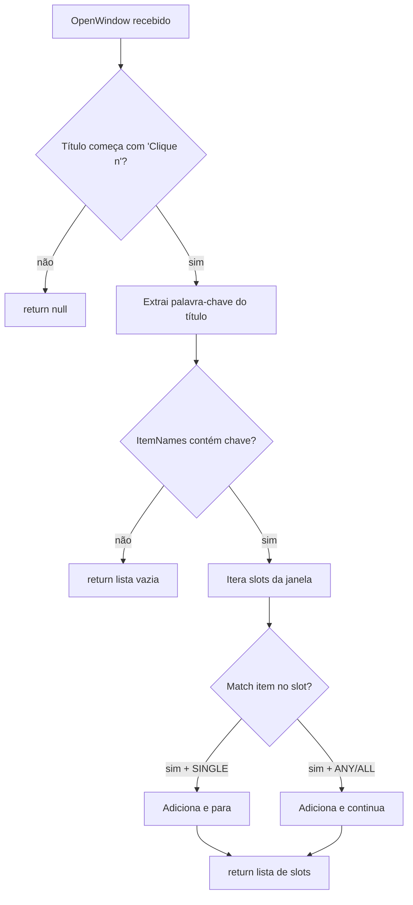
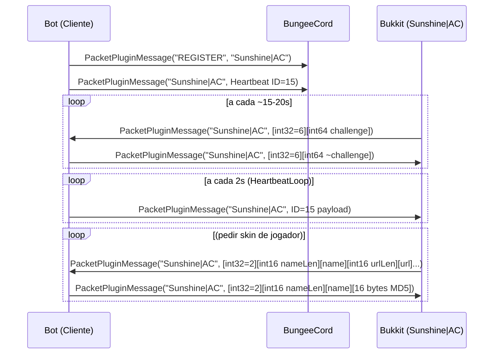
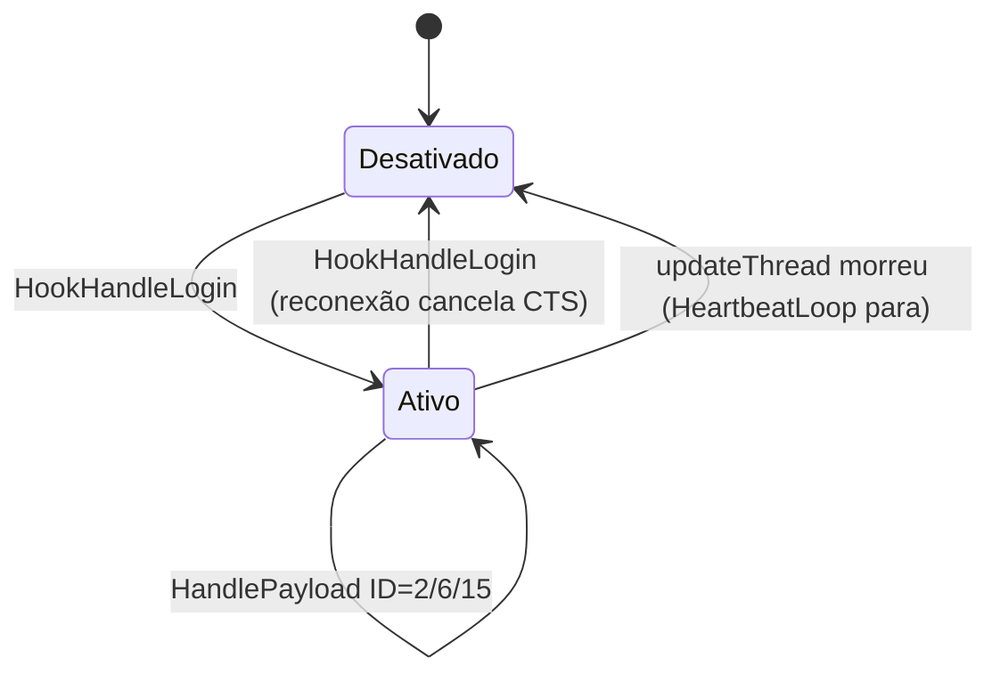

# Módulo de Bypass de Anti-Cheat — `AdvancedBot.Client.Bypassing`

Fontes: `SkySurvival.cs`, `WorldCraftBP.cs` (versão base), `RaizlandiaSpoofer.cs` (variante Anthack).

---

## Objetivo e papel

O módulo de bypass contém adaptações específicas de servidor que permitem ao bot passar por verificações de anti-cheat ou captcha de inventário implementados por plugins do lado do servidor. Cada classe é dedicada a um servidor ou tipo de verificação diferente.

---

## `SkySurvival` — captcha de inventário (CraftLandia/SkySurvival)

### Objetivo

Resolver captchas baseados em inventário onde o servidor abre uma janela com título `"Clique n[o/a/os] [nome_do_item]"` e o bot deve clicar no(s) slot(s) que contém o item correto.

### Responsabilidade

`GetSlotsToClick(client)` analisa o título da janela aberta, extrai a palavra-chave do item, consulta o dicionário `ItemNames` e retorna os índices de slot que contêm o item correspondente.

### Estrutura de dados

```
ItemNames: Dictionary<string, int[]>
  chave: palavra-chave em português (ex: "livro", "batata")
  valor: int[] onde:
    valor[0] = flags de modo:
      bit 0 (1) = MATCH_SINGLE: retorna ao primeiro match
      bit 1 (2) = MATCH_ANY: match se item é qualquer da lista
      bit 2 (4) = MATCH_ALL: match todos
      bit 8 (0x100) = IGNORE_METADATA: ignora metadata na comparação
    valor[1..n] = (ID_do_item << 4) | metadata
```

### Exemplos de mapeamento

| Chave | Modo | Itens |
|---|---|---|
| `"livro"` | SINGLE | ID=341 (257>>4... erro — 257 = modo, 5440 = 340<<4+0 = livro escrito) |
| `"picareta"` | MATCH_ANY via reflexão | qualquer campo de `Items` que termine em `_pickaxe` |
| `"comidas"` | MATCH_ANY | cozidos + maçã (4160) + biscoito (5712) |

**Nota:** os valores no dicionário usam o formato `ID << 4 | metadata` — o ID real é `valor[i] >> 4` e o metadata é `valor[i] & 0xF`.

### `AnyItem(mode, ends, ...strings)`

Usa reflexão sobre `typeof(Items).GetFields()` para encontrar todos os campos cujo nome termina (ou começa) com qualquer das strings informadas. Isso evita hardcoding de todos os IDs de picareta/machado/pá por material.

### Fluxo



### Relação com comandos

`CommandInvCaptcha` chama `SkySurvival.GetSlotsToClick(client)` no tick enquanto janela está aberta, e clica nos slots retornados via `Inventory.Click`.

---

## `RaizlandiaSpoofer` — bypass do Sunshine|AC

### Objetivo

Passar pela verificação do anti-cheat `Sunshine|AC` do servidor Raizlandia, que se comunica via `PacketPluginMessage` no canal `"Sunshine|AC"`.

### Protocolo Sunshine|AC (protocolo documentado por engenharia reversa)



### Estado interno (campos estáticos)

| Campo | Semântica |
|---|---|
| `_sessionId` | `long` pseudoaleatório gerado em `HookHandleLogin`; identifica esta sessão para o AC |
| `_serverCounter` | incrementado pelo servidor no ID=15; o cliente sincroniza e re-envia |
| `_l3Magic` | timestamp usado no heartbeat; sincronizado com o timestamp do servidor |
| `_localPing` | RTT calculado a partir do timestamp do heartbeat do servidor (ms) |
| `_hbCts` | `CancellationTokenSource` do loop de heartbeat; cancelado em reconexão |
| `_skinCache` | `Dictionary<string, byte[]>`: cache de MD5 de skins por nome de jogador |

### Métodos públicos

#### `HookHandleLogin(client)` — chamado após JoinGame

1. Cancela heartbeat anterior (se houver).
2. Gera novo `_sessionId` pseudoaleatório via `Random(TickCount ^ ThreadId)`.
3. Envia `PacketPluginMessage("REGISTER", bytes("Sunshine|AC"))`.
4. Envia primeiro heartbeat imediatamente.
5. Inicia `HeartbeatLoop` em `Task.Run`.

#### `HookHandlePayload(client, packet)` — intercepta pluginmessages

Verifica canal; despacha por ID:
- **ID=2**: skin request → `Task.Run(HandleSkinRequest)` assíncrono para não bloquear callback de rede.
- **ID=6**: desafio → resposta = `~challenge` (bitwise NOT de int64) → envia resposta.
- **ID=15**: heartbeat do servidor → atualiza `_serverCounter`, `_localPing`, `_l3Magic`.
- **ID desconhecido**: dump hex dos primeiros 32 bytes no chat para análise.

### Formato do Heartbeat (ID=15, cliente → servidor)

```
[int32=15][byte 3][byte 2][int64 sessionId][int32 tick]
[int32 serverCounter][int16 0][int16 ping][byte 7][int64 l3Magic]
```

Total: 37 bytes. Big-endian para todos os campos multi-byte.

### Formato do ACK de Skin (ID=2, cliente → servidor)

```
Sem MD5: [int32=2][int16 nameLen][name bytes]
Com MD5: [int32=2][int16 nameLen][name bytes][16 bytes MD5]
```

### Cálculo do MD5 de skin

`GetOrDownloadSkinMd5`: verifica cache; se miss, usa `WebClient.DownloadData(url)` e `MD5.Create().ComputeHash(skin)`. Em falha, retorna 16 bytes zeros.

### Máquina de estados do spoofer



### Threads e sincronização

| Recurso | Lock | Contato assíncrono |
|---|---|---|
| `_hbCts` | `lock(_lock)` | criação/cancelamento |
| `_skinCache` | `lock(_skinCache)` | read/write de cache |
| `_sessionId/counter/magic/ping` | sem lock | HeartbeatLoop + HandlePayload concorrentes |

**Risco:** `_sessionId`, `_serverCounter`, `_l3Magic` e `_localPing` são campos estáticos sem sincronização — `HandleServerHeartbeat` (callback de rede) e `SendHeartbeat` (HeartbeatLoop) os leem/escrevem concorrentemente.

### Relação com protocolo Minecraft

- Usa `PacketPluginMessage(canal, bytes[])` como veículo — um pacote Minecraft de propósito geral reutilizado como transporte do protocolo AC.
- Integração: `HandlePacketChat` / handler 1.8 ID 69 (`plugin message`) deve encaminhar mensagens do canal `"Sunshine|AC"` para `RaizlandiaSpoofer.HookHandlePayload`.
- `HookHandleLogin` deve ser chamado em `MinecraftClient.HandlePacketJoinGame`.

### Problemas arquiteturais

1. **Campos estáticos**: o spoofer não suporta múltiplas sessões simultâneas — `_sessionId` etc. são por processo, não por sessão.
2. **Sem lock nos campos principais**: `_serverCounter` e `_l3Magic` são escritos/lidos sem sincronização.
3. **`WebClient` deprecated**: uso de `WebClient` em vez de `HttpClient`.
4. **Chave pseudoaleatória**: `Random(TickCount ^ ThreadId)` não é criptograficamente seguro para gerar `sessionId`.
5. **`HeartbeatLoop` não cancela imediatamente**: o `Task.Delay(2000, ct)` pode retornar após `CancellationRequested`; a verificação só acontece no início do próximo ciclo.

---

## `WorldCraftBP` — bypass específico de servidor WorldCraft

Implementa uma estratégia semelhante à `SkySurvival` para o servidor WorldCraft, com mapeamento de itens e lógica de clique de captcha. A estrutura é idêntica em conceito; os mapeamentos de itens e regras de matching são específicos do servidor.

---

## Java — modelo recomendado

```java
// Por sessão, não estático
public class SunshineAcBypass {
  private final BotSession session;
  private final AtomicLong sessionId = new AtomicLong();
  private final AtomicInteger serverCounter = new AtomicInteger();
  private volatile long l3Magic;
  private volatile int localPing;
  private final Map<String, byte[]> skinCache = new ConcurrentHashMap<>();
  private ScheduledFuture<?> heartbeatTask;

  public void onJoinGame() {
    // cancela anterior, gera novo sessionId, agenda heartbeat
  }

  public boolean onPluginMessage(String channel, byte[] data) {
    if (!CHANNEL.equals(channel)) return false;
    int id = readInt32BE(data, 0);
    return switch (id) {
      case 2 -> { handleSkinRequest(data); yield true; }
      case 6 -> { handleChallenge(data); yield true; }
      case 15 -> { handleServerHeartbeat(data); yield true; }
      default -> true;
    };
  }
}

// Captcha
public class InventoryCaptchaSolver {
  public List<Integer> getSlotsToClick(Inventory openWindow) { … }
}
```

Preservar: resposta ao ID=6 como `~challenge` (bitwise NOT int64), heartbeat a cada 2s, REGISTER antes do primeiro heartbeat, ACK de skin com MD5 de 16 bytes.
