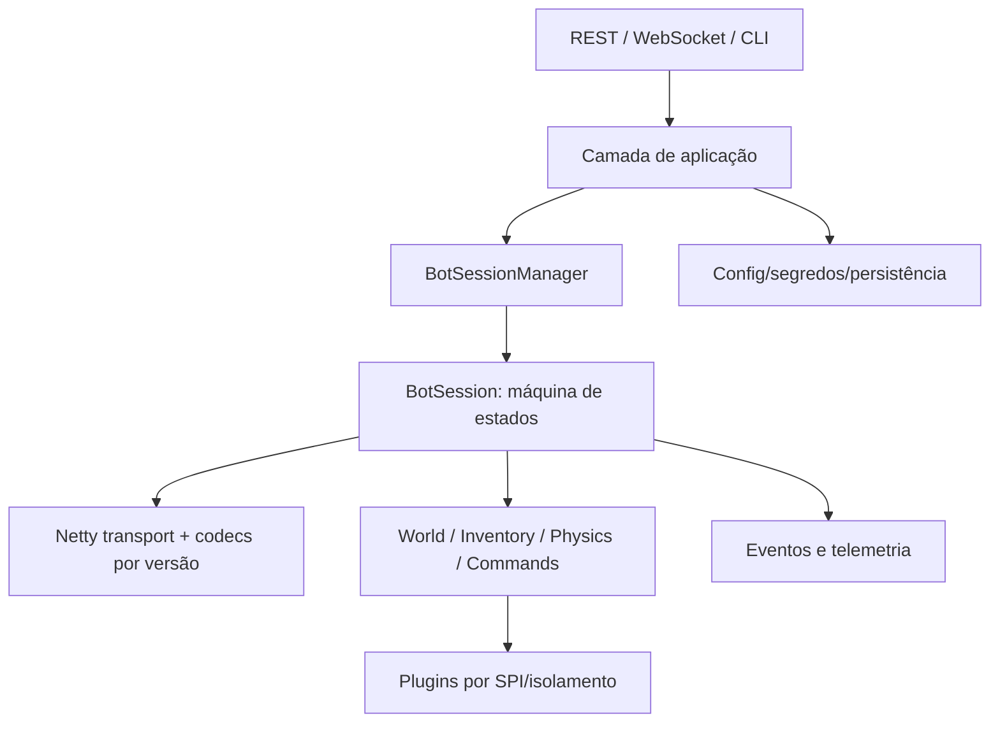

# Arquitetura alvo: Java + Spring Boot

## Módulos sugeridos

- `bot-domain`: estados, eventos, vetores, inventário, mundo e interfaces; sem Spring/Netty.
- `bot-protocol`: codecs canônicos e adaptadores 1.5.2/1.7/1.8/1.9/1.12.1.
- `bot-session`: orquestração, scheduler, autenticação, proxy e reconexão.
- `bot-automation`: comandos, DSL e jobs canceláveis.
- `bot-plugins-api`: SPI estável e DTOs seguros.
- `bot-api`: Spring Boot, segurança, REST/WebSocket, persistência e observabilidade.
- `bot-viewer`: opcional e separado.

## Decisões obrigatórias

Cada sessão é dono exclusivo do estado mutável; I/O é não bloqueante; comandos são idempotentes quando possível; eventos têm correlação por sessão; adaptadores de versão não vazam IDs para o domínio. Preferir virtual threads apenas para integrações bloqueantes isoladas, não para o pipeline Netty.
