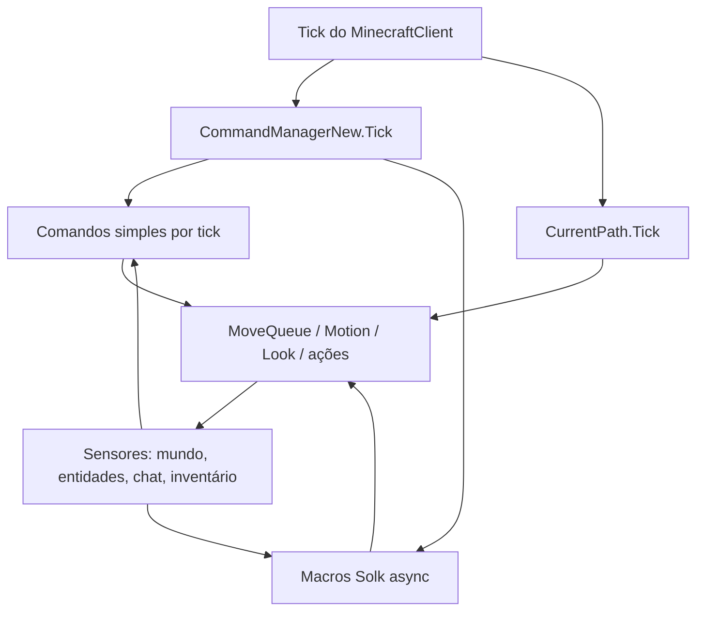
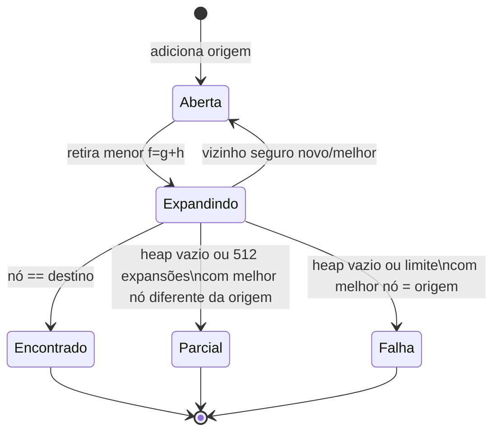
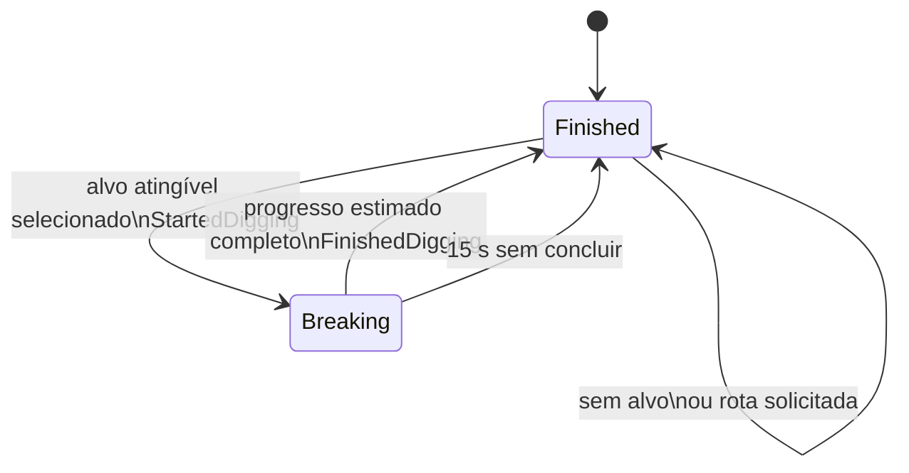
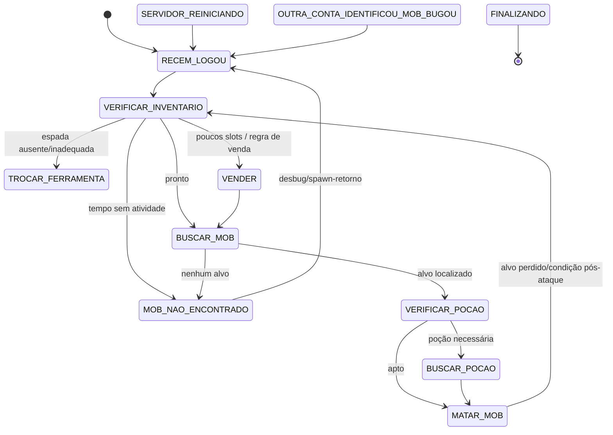

# IA do bot: decisões, prioridades e máquinas de estado

Fontes primárias restritas à autonomia: `CommandManagerNew`, `ICommand`, `AutoMiner`, `PathFinding/{Path,PathFinder,PathGuide,PathPoint}` e comandos de automação em `AdvancedBot.Client.Commands`, incluindo `Solk/{CommandPesca,CommandPescaV2,CommandMob,CommandMobPlus,CommandMobTeleport,MacroUtils,ConfigMob}`. Este documento não especifica rede, UI, protocolo ou persistência; eles aparecem somente como sensores e atuadores das decisões.

## Definição operacional de “IA” neste legado

Não há planejador global, árvore de comportamento, sistema de goals, blackboard central ou arbitrador de ações. A IA é distribuída por comandos que observam estado do cliente e, no tick, mudam diretamente intenção de movimento, orientação, alvo, caminho, slot ativo ou ações. O comportamento resultante é uma composição por efeitos colaterais.

## Ciclo de decisão e prioridades reais

`CommandManagerNew.Tick()` itera todos os objetos da lista `Commands`, na ordem de construção, e chama `Tick()` incondicionalmente. Cada comando decide internamente se está ativado. A ordem é: sneak, help, move, portal, retard, reco, follow, kill aura, twerk, player list, give, goto, use entity, hotbar click, inventory click, drop all, click block, miner, clear chat, anti-AFK, place block, captcha, herbalism, use bow, proxy, break block, script, pesca, mob e mob-teleport.

Não há exclusão mútua geral. A prioridade é, portanto, implícita e por último escritor:

| Recurso disputado | Quem pode escrever | Regra efetiva de prioridade |
|---|---|---|
| `CurrentPath` | follow, goto, portal, auto-miner | a última atribuição ocorrida vence; follow/portal desligam explicitamente `retard`, mas não desligam os demais comportamentos. |
| `Player.MotionX/Y/Z` e `MoveQueue` | path guide, comandos de movimento, anti-AFK, macros | acumula/consome conforme o tick da entidade; nenhuma arbitragem impede comandos simultâneos. |
| `Yaw/Pitch` | follow, kill aura, arco, miner, herbalism, macros | última atualização no tick/callback prevalece. |
| hotbar/item em mão | miner, herbalism, arco, macros | alteração direta de slot; não há reserva de item. |
| ação de jogo | todos os comandos | pacotes/ações entram na fila na ordem em que os ticks e continuations assíncronas os executam. |

Há dois bloqueios locais de concorrência: macros Solk usam `isProcessing` para que uma nova invocação de `async void Tick()` retorne enquanto a anterior aguarda; `KillAura` bloqueia a coleção de players enquanto escolhe alvo. Isso não impede competição entre comandos nem entre uma macro e callbacks de chat. A semântica a preservar é “composição não arbitrada”, não uma prioridade de IA intencional.

## Pathfinding e execução de rota

### `PathFinder`: decisão de caminho

`World.CreatePathTo` instancia `PathFinder` e `PathGuide.Create` pede rota até 80 blocos, com `allowWoodenDoor=true`, `movementBlockAllowed=false`, `pathInWater=true`, `canDrown=false`. O algoritmo é A* limitado a 512 expansões, com heap mínimo `Path` por `DistanceToTarget = custo acumulado + Manhattan até destino`.

Estados de nó: `Open`, `_2` (posição ocupável que requer queda), `Blocked`, `Water`, `Lava`, `Fence`, `Trapdoor`. Um nó é aberto se o volume de 1×2 do jogador permite passagem; portal (90) e trepadeira (106) são abertos; água é tratada conforme `isPathingInWater`; portas de madeira dependem da flag; fence/gate/wall e trapdoor são bloqueadores especiais; lava é recusada salvo se a entidade já está em lava. `GetSafePoint` tenta o nível atual, uma subida de um bloco quando o espaço acima permite, e queda limitada a três blocos. Só gera vizinhos nos quatro eixos cardinais: não há diagonal.

Transições do A*:

Se não alcança destino, devolve caminho até o nó com menor distância Manhattan encontrado; se nem ele difere da origem, devolve `null`. Essa rota parcial é uma decisão importante: solicitantes a seguem como se fosse caminho válido, sem distinguir sucesso completo.

### `PathGuide`: máquina de execução

`PathGuide.Create` converte `PathPoint[]` em `Vec3i[]`, fixa `pathIndex=1` (o ponto origem é deliberadamente ignorado) e devolve `null` quando o finder falha. Em cada tick:

1. se `pathIndex >= Points.Length`, está `Finished` e não atua;
2. se colisão horizontal e no chão, aplica salto (`MotionY=0.42`, mais 0.1 por nível do efeito 8);
3. escolhe o waypoint atual e aplica aceleração horizontal em direção ao centro X/Z do bloco, com atrito/velocidade dependentes de chão e tipo de bloco;
4. distância horizontal ≤ 0,8: avança um waypoint;
5. distância ≥ 2,5: recupera o índice do waypoint Euclidiano mais próximo, podendo recuar ou avançar na rota.

Estados implícitos: `sem rota` → `seguindo waypoint` → `reindexando após desvio` → `concluído`. Não recalcula a rota para mudanças de mundo; somente reindexa a rota preexistente. `RequestPathTo` calcula a rota em `Task.Factory.StartNew`, portanto o pedido pode chegar depois de outra intenção já ter substituído `CurrentPath`.

## Agentes reativos simples

| Agente | Gatilho/sensores | Decisão e transição |
|---|---|---|
| Follow | alvo `MPPlayer`, sua existência, distância, posição anterior | `Run(nick)` entra em seguindo; a cada tick olha para o alvo e, se ele se moveu ≥2,5 blocos, substitui o caminho. Se não existir ou distância >80, limpa path e volta a inativo. Sem argumento quando ativo interrompe. |
| Goto/Portal | coordenadas do comando / portal conhecido ou encontrado | decisão pontual: solicita path. Portal escolhe a posição de menor distância ao jogador (ou varre chunks 17×17, Y±32, procurando bloco 90); não mantém estado próprio após o pedido. |
| AntiAFK | clock monotônico e delay configurado | ligado: se `agora-lastJump > delay`, enfileira `Jump` e reinicia relógio. Desligado: inativo. |
| KillAura | players conhecidos, distância, visibilidade, filtro `query`, contador | ligado: só decide quando `lastAttack++ >= speed`; exclui jogadores que correspondem a uma sessão local, seleciona alvo visível mais próximo a ≤4 blocos que atende nick/*, mira com ruído aleatório ±0,1 por eixo e ataca; então zera contador. Sem candidato, também zera. |
| UseBow | alvo, arco em hotbar, flecha e `bowTicks` | `Run` valida/aloca arco e entra em carregando (`bowTicks=0`). Primeiro tick usa item e cria interpolador de mira 0,75; ticks intermediários interpolam/recalculam trajetória; em ≥32 finaliza uso, limpa alvo/interpolador e fica inativo. |
| Herbalism | bloco no raycast sob o jogador e item em mão | ligado: olha para baixo. Se o hit é o bloco sob os pés, procura/seleciona cana (338) na hotbar e coloca; se o bloco é cana (83), quebra, podendo quebrar o segundo bloco empilhado. Raycast nulo desliga definitivamente. |

Esses agentes são reativos e não possuem estado enum. Seus estados são derivados de referências/flags (`following==null`, `IsToggled`, `target==null`, `bowTicks`).

## `AutoMiner`: seleção e mineração contínua

`CommandMiner` apenas liga/desliga e encaminha ticks a `AutoMiner`. O miner possui enum privado `MiningStatus`: `Breaking` e `Finished`; inicia em `Finished`.

Quando `Breaking`, contabiliza tempo/progresso de mineração, mantém o alvo reservado em `digBlocks` e encerra por conclusão calculada ou timeout de 15 s. Quando `Finished`, primeiro tenta blocos em caixas de colisão imediatas e depois chama `SearchNearestBlock`.

`SearchNearestBlock` varre um cubo centrado no jogador: X/Z dentro de `MinerRadius` (padrão 8) e Y de `max(5, pé-1)` até `pé+5`. Só considera blocos configurados em `MinerBlocks`, exclui teia (106) e reservas `digBlocks`. A pontuação é:

`distância euclidiana + prioridade_do_bloco × 2,3`, com penalidade adicional forte para bloco abaixo do pé: `(pontuação + 1,5) × 16`.

Menor pontuação vence — logo o valor de prioridade configurado é custo, não “maior é mais prioritário”. Sem `MinerForceListBlocks`, acrescenta os IDs especiais -131071/-65533 à lista. Ao escolher, reserva alvo, olha para ele, solicita path e tenta imediatamente raycast de alcance 6; se o bloco visível passa a regra de força, inicia mineração. Antes de cavar, pode escolher na hotbar a ferramenta de maior `ToolStrengthVsBlock`, penalizando 80% se não puder colher o bloco. A cada busca também enfileira seis movimentos `Forward`, mesmo sem alvo selecionado.

## Macros Solk: estrutura comum

Pesca, mob e mob-teleport são `ICommand` togglable com estado enum. `Run` alterna o comando: ligado chama `Start`; desligado troca o estado para `FINALIZANDO` (quando existente) e grava `disconnectDelay`. Em todo tick, a macro:

1. retorna se já houver execução assíncrona (`isProcessing`);
2. se desligada, não executa estado;
3. se a sessão não estiver tickando, troca para finalização e, após 10 s desde `disconnectDelay`, chama `Client.StartClient()` novamente;
4. despacha o método correspondente ao enum;
5. libera `isProcessing` no `finally`.

O chat é um sensor assíncrono extra: mensagens de login chamam `Start`; `CommandMob` também recebe mensagens de mob bugado/reinício. Não há fila de eventos nem cancelamento: `onReceiveChat` e `Tick` podem mudar `estado` concorrentemente.

### Máquina `CommandPesca` (V1)

Estados declarados e decisões:

| Estado | Ação/decisão | Próximas transições observadas |
|---|---|---|
| `RECEM_LOGOU` | aguarda autenticação lógica, seleciona hotbar, teleporta ao pesqueiro e prepara dados. | `INICIANDO`. |
| `INICIANDO` | desativa menu de loja/esconde o bot e inicia a preparação local. | `LIMPAR_INVENTARIO`. |
| `LIMPAR_INVENTARIO` | remove itens descartáveis, preservando vara, linha, espada, pick e armadura. | `GUARDAR_ITENS` se houver itens a guardar; caso contrário `VERIFICAR_INVENTARIO`. |
| `VERIFICAR_INVENTARIO` | prioridade de suprimento: testa linha, vara/durabilidade, slots livres e itens necessários. | falta linha → `COMPRAR_LINHA`; falta vara → `BUSCAR_VARA`; vara abaixo da durabilidade 45 → `REPARAR`; inventário a limpar → `LIMPAR_INVENTARIO`; tudo pronto → `PESCAR`. |
| `BUSCAR_VARA` | vai ao home/baú de vara, localiza/move item para inventário. | reavalia em `VERIFICAR_INVENTARIO`; pode exigir `REPARAR`. |
| `COMPRAR_LINHA` | teleporta à loja de linha, compra e retorna. | `VERIFICAR_INVENTARIO`. |
| `GUARDAR_ITENS` | abre/descobre baús, aplica predicado `deveGuardarItem`, move itens e volta. | `VERIFICAR_INVENTARIO`. |
| `PESCAR` | lança/usa vara, reage a intervalos e a estoque; é a atividade de menor prioridade. | inventário cheio/itens guardáveis → `VERIFICAR_INVENTARIO`; necessidade de vara/linha → correspondente. |
| `REPARAR` | teleporta ao fluxo de reparo e troca/manipula item. | `VERIFICAR_INVENTARIO`. |
| `FINALIZANDO` | sem ação de domínio; estado terminal enquanto desligado/desconectado. | somente novo `Start()` → `RECEM_LOGOU`. |

`alterarEstado` apenas registra e atribui; não valida grafo. Helpers de timeout envolvem algumas operações: exceção ou mais de 300 000 ms transfere para o estado de recuperação informado. O sensor de chat, ao detectar texto que sinaliza falta de linha, força `COMPRAR_LINHA` exceto se já compra linha, e a mensagem de login reinicia em `RECEM_LOGOU`.

### Máquina `CommandPescaV2`

O enum declara `RECEM_LOGOU`, `INICIANDO`, `MAPEAR_PLACA_LINHA`, `MAPEAR_BLOCOS`, `MAPEAR_BAUS`, `PESCAR`, `REPARAR`, `ARMAZENAR`, `VERIFICAR_INVENTARIO`, `VERIFICAR_VARA`, `VERIFICAR_LINHA`, `FINALIZANDO`. Porém o `switch` de `Tick` despacha somente `RECEM_LOGOU`, `INICIANDO`, `VERIFICAR_INVENTARIO`, `VERIFICAR_LINHA`, `PESCAR`, `REPARAR`, `ARMAZENAR` e `FINALIZANDO`. Não há case para os três `MAPEAR_*` nem para `VERIFICAR_VARA`; se algum fluxo os atribuísse, a macro ficaria inerte naquele tick e nos seguintes até transição externa.

Fluxo efetivamente alcançável: recém-logado teleporta ao pesqueiro, pula e popula listas; `INICIANDO` mapeia blocos/baús e vai a verificar inventário; esse estado verifica vara, linha e slots vagos e só então permite `PESCAR`. Pesca direciona a reparar/armazenar quando as condições correspondentes surgem; armazenamento limpa inventário, separa peixe, disco, ferramentas/armadura e volta à verificação. A prioridade é, portanto: integridade de equipamento/linha e espaço > pesca. Chat de falta de linha força `VERIFICAR_LINHA` salvo se já estiver lá; chat de login reinicia.

### Máquina `CommandMob`

`CommandMob` é a máquina mais completa. Carrega `ConfigMob` pelo nick, mantém alvo `EntityMob`, datas de venda/poção, timers e verifica estado do servidor via chat.

Prioridades internas: primeiro interrompe por reinício/mob bugado, depois garante ferramenta, depois capacidade de inventário/venda, então tenta localizar mob, valida poção e somente por último ataca. `buscarMobProximo` seleciona o primeiro `EntityMob` da enumeração a até 3,5 blocos — não ordena por distância nem tipo. `MatarMob` aborta para verificação se estado/alvo é inválido; ao atacar altera mira/slot e usa ações repetidas configuradas. Mensagem “identifiquei que o mob bugou” força `OUTRA_CONTA_IDENTIFICOU_MOB_BUGOU`; “servidor irá reiniciar” força `SERVIDOR_REINICIANDO`. A função `alterarEstado` bloqueia transições de saída desses dois estados, exceto para `RECEM_LOGOU`; isso dá prioridade máxima a recuperação de servidor.

### `CommandMobPlus` e `CommandMobTeleport`: estados parcialmente ativos

`CommandMobPlus` declara `RECEM_LOGOU`, `VERIFICAR_INV`, `TROCAR_ESPADA`, `VENDER`, `BUSCAR_MOB`, `MOB_NAO_ENCONTRADO`, `MATAR_MOB`, `FINALIZANDO`, e contém métodos para boa parte deles. Contudo seu `Tick` só possui cases para `RECEM_LOGOU` e `FINALIZANDO`. `RECEM_LOGOU` teleporta spawn/home, pula, limpa entidades e transfere a `VERIFICAR_INV`; a partir daí, nenhum método é despachado. Portanto, na versão analisada, a macro estaciona em `VERIFICAR_INV`; o grafo declarado não é executável integralmente.

`CommandMobTeleport` tem somente `INICIANDO` e `FINALIZANDO`. Em `INICIANDO`, espera 3 s, escolhe o primeiro mob a até 20 blocos, tenta mover/aplicar o procedimento de “corner glitch”, registra resultado e espera 5 s. Não muda de estado ao concluir ou falhar, logo repete essa rotina a cada oportunidade de tick enquanto permanece ligada. `FINALIZANDO` é método vazio. Não há ataque ativo: o laço de ataque está comentado. Logo é uma máquina de um estado de operação repetitiva, não uma macro de farm completa.

## Observações para uma futura migração Java

- Preserve primeiro a semântica de concorrência: um executor serial por sessão mais uma fila de eventos de chat produz comportamento observável mais determinístico; para compatibilidade, registre onde o legado permite corrida entre `async void Tick` e chat.
- Modele cada macro como `StateMachine<S,E>` com estados acima, transições guardadas e efeitos separados. Estados enum sem dispatcher devem ser catalogados como inativos se a meta for imitar exatamente o build atual.
- Introduza um árbitro de intenções somente como camada opcional. O legado permite que múltiplos agentes concorram por path, olhar e hotbar; uma prioridade nova mudará ações e deve ser teste de contrato explícito.
- Para pathfinding, mantenha raio 80, limite 512, vizinhança cardinal, retorno parcial e limiares 0,8/2,5 se o objetivo for equivalência. Uma implementação A* “melhor” modifica seleção e tempo de chegada.
- A máquina de mineração deve preservar que o número de prioridade é custo crescente, a penalidade de bloco sob os pés e a reserva `digBlocks`; são decisões que definem o alvo escolhido.
