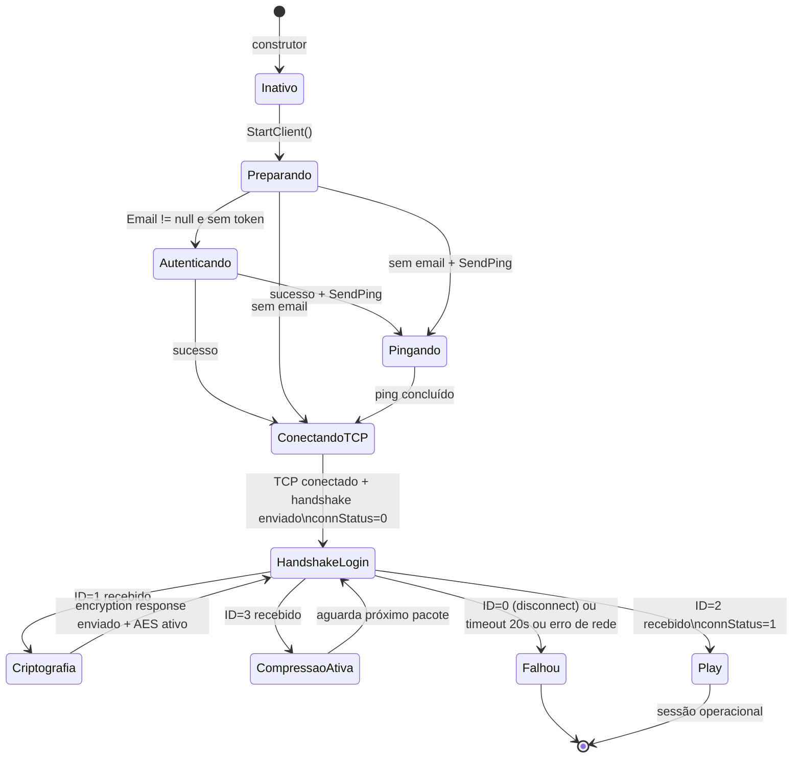
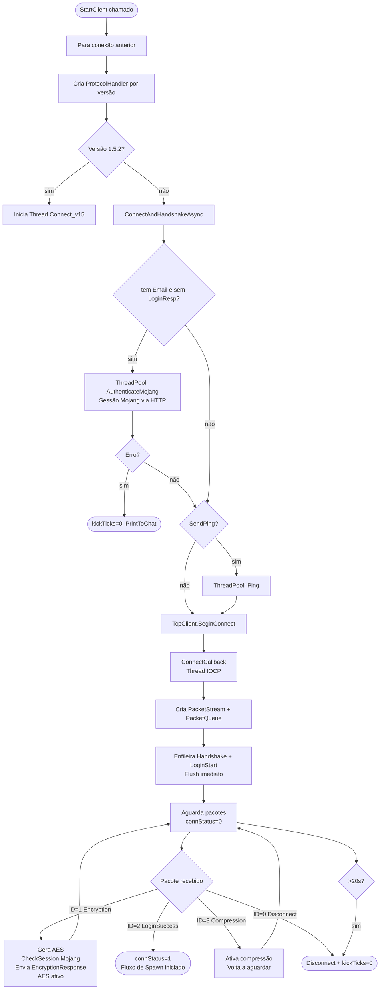
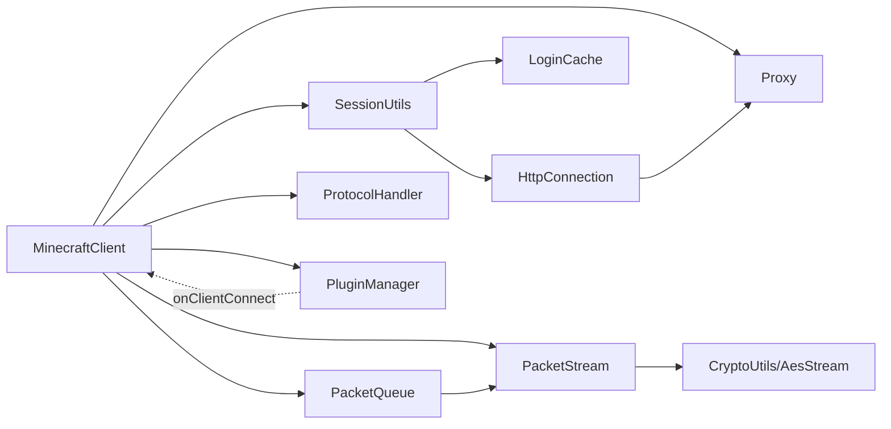

# Fluxo 01 — Login e Autenticação

## 1. Objetivo

Estabelecer uma sessão válida com um servidor Minecraft. O fluxo cobre desde a decisão de autenticar com a Mojang (conta premium) até o momento em que o protocolo de play começa. Sem este fluxo concluído com sucesso, nenhum comportamento de jogo é possível.

O motivo pelo qual autenticação e handshake são tratados como um único fluxo é que eles são **sequencialmente dependentes**: o token de sessão da Mojang deve ser obtido antes de o handshake poder completar a criptografia, e a criptografia deve ser ativada antes de o servidor aceitar o `LoginSuccess`.

---

## 2. Evento Iniciador

- **Chamada de `MinecraftClient.StartClient()`** — pelo operador via UI (`Start.cs`), por reconexão automática (`Tick()`), ou por macro.

---

## 3. Componentes Envolvidos

| Componente | Papel no fluxo |
|---|---|
| `MinecraftClient` | orquestrador; mantém o estado da sessão e decide os passos |
| `SessionUtils` | encapsula as chamadas HTTP para a Mojang API |
| `LoginCache` | armazena e valida tokens entre sessões para evitar re-autenticação |
| `LoginResponse` | DTO com access token, UUID, username e flag de erro |
| `Proxy` | quando configurado, tunel TCP por SOCKS4/5 ou HTTP CONNECT |
| `HttpConnection` | cliente HTTP manual usado por `SessionUtils` |
| `PacketStream` | transporte assíncrono; ativado após conexão TCP |
| `PacketQueue` | fila de saída de pacotes; criada com o stream |
| `ProtocolHandler` | selecionado por versão; gerencia o sub-fluxo de login |
| `CryptoUtils` / `AesStream` | geram e aplicam criptografia AES |
| `PacketHandshake`, `PacketLoginStart`, `PacketEncryptionResponse` | pacotes enviados durante o fluxo |

---

## 4. Ordem Completa de Chamadas

```
StartClient()
  ├── Cancela loop/stream anterior (se beingTicked=true)
  │     └── Stream.Close() ou Handler_v152.TcpConn.Close()
  ├── Join/Abort updateThread (timeout 1s)
  ├── beingTicked = false
  ├── canLoop = true
  ├── UUID2Nick.Clear()
  ├── authmeCounter = 0
  ├── Handler = ProtocolHandler.Create(Version, this)
  │
  ├── [se versão 1.5.2]
  │     └── updateThread = new Thread(Connect_v15) → Start()
  │
  └── [se versão 1.7+]
        └── ConnectAndHandshakeAsync(depth=0, flags=0)
              ├── TheWorld.Clear()
              ├── PlayerManager.Clear()
              ├── Player = new Entity(this)
              ├── [se Email != null e LoginResp == null e !AUTH]
              │     └── ThreadPool.QueueUserWorkItem(AuthenticateMojang)
              │           ├── SessionUtils.Login(Email, Password, ConProxy)
              │           │     ├── LoginCache.GetAndCheck(email)
              │           │     │     └── [se válido] POST /refresh → atualiza cache
              │           │     └── [se miss] POST /authenticate → LoginResponse
              │           └── se sucesso: ConnectAndHandshakeAsync(depth+1, flags|AUTH)
              │
              ├── [se SendPing e !PING]
              │     └── ThreadPool.QueueUserWorkItem(Ping + ConnectAndHandshakeAsync)
              │
              └── [se sem proxy]
                    └── TcpClient.BeginConnect(IP, Port, ConnectCallback)
                          └── ConnectCallback(IAsyncResult)
                                ├── tcpClient.EndConnect(ar)
                                ├── tcpClient.ReceiveTimeout/SendTimeout = 30s
                                ├── Stream = new PacketStream(tcpClient.GetStream())
                                ├── SendQueue = new PacketQueue(this, Stream)
                                ├── AddToQueue(PacketHandshake(version, IP, Port, 2))
                                ├── AddToQueue(PacketLoginStart(Username))
                                ├── SendQueue.Flush()
                                ├── connStatus = 0
                                ├── keepAliveTicks = 0
                                ├── handshakeStart = GetTickCount64()
                                └── Stream.OnPacketAvailable += HandlePacket
                                    Stream.OnError += Disconnect

HandlePacket(ReadBuffer) [chamado pelo callback de rede, connStatus=0]
  ├── ID=0: HandlePacketDisconnect → Stream.Close()
  ├── ID=1: Encryption Request
  │     ├── Valida LoginResp != null (rejeita modo offline)
  │     ├── Lê serverId, chave RSA pública, verify token
  │     ├── CryptoUtils.GenerateAESPrivateKey() → sharedSecret[16]
  │     ├── SessionUtils.CheckSession(UUID, AccessToken, serverHash, proxy)
  │     ├── RSA.Encrypt(sharedSecret) → encryptedSecret
  │     ├── RSA.Encrypt(verifyToken) → encryptedToken
  │     ├── AddToQueue(PacketEncryptionResponse(encryptedSecret, encryptedToken))
  │     ├── SendQueue.Flush()
  │     └── Stream.InitEncryption(sharedSecret)  ← AES ativado aqui
  ├── ID=2: Login Success
  │     ├── pkt.ReadString() [UUID — descartado]
  │     ├── pkt.ReadString() [nome — descartado]
  │     └── connStatus = 1
  └── ID=3: Set Compression
        └── Stream.CompressionThreshold = pkt.ReadVarInt()
```

---

## 5. Estados Percorridos



---

## 6. Threads Envolvidas

| Thread | O que executa | Onde criada |
|---|---|---|
| Thread STA (UI) | `StartClient()`, sincronização inicial | loop WinForms |
| ThreadPool worker | `AuthenticateMojang()`, chamadas HTTP Mojang | `QueueUserWorkItem` |
| ThreadPool worker | `Ping()` | `QueueUserWorkItem` |
| I/O Completion (IOCP) | `ConnectCallback`, callbacks de `BeginRead` do `PacketStream` | APM BeginConnect/BeginRead |
| Thread legada 1.5.2 | `Connect_v15()` — loop síncrono completo | `new Thread(Connect_v15)` |

**Invariante crítica:** `ConnectCallback` roda na thread IOCP. Tudo que ela faz (criar `PacketStream`, `PacketQueue`, enviar handshake) acontece fora da thread UI. O `PacketStream` dispara `OnPacketAvailable` também na thread IOCP. Portanto, `HandlePacket` — incluindo a ativação do AES — **não** roda na thread de tick.

---

## 7. Eventos Publicados

| Evento | Quando | Consumidor |
|---|---|---|
| `IPlugin.onClientConnect(client)` | ao final de `StartClient()` | todos os plugins |
| `PacketStream.OnPacketAvailable` | ao receber frame completo | `MinecraftClient.HandlePacket` |
| `PacketStream.OnError` | em qualquer falha de I/O | delegado que chama `Disconnect` |

---

## 8. Eventos Consumidos

| Evento | Fonte | Efeito no fluxo |
|---|---|---|
| `IAsyncResult` de `BeginConnect` | TCP/OS | dispara `ConnectCallback` |
| Pacotes ID=0,1,2,3 do servidor | `PacketStream.OnPacketAvailable` | avança estados de login |

---

## 9. Objetos Modificados

| Objeto | Campo | Momento |
|---|---|---|
| `MinecraftClient` | `LoginResp` | após autenticação Mojang |
| `MinecraftClient` | `Username` | após autenticação (nome autenticado) |
| `MinecraftClient` | `Stream` | ao criar `PacketStream` |
| `MinecraftClient` | `SendQueue` | ao criar `PacketQueue` |
| `MinecraftClient` | `Handler` | ao criar `ProtocolHandler` |
| `MinecraftClient` | `connStatus` | 0 após handshake; 1 após Login Success |
| `MinecraftClient` | `handshakeStart` | timestamp ao enviar handshake |
| `MinecraftClient` | `keepAliveTicks` | zerado ao conectar |
| `MinecraftClient` | `Player` | novo `Entity` ao iniciar conexão |
| `World` | chunks, signs | limpos ao iniciar conexão |
| `PlayerManager` | UUID2Nick | limpo ao iniciar conexão |
| `PacketStream` | transforms AES | após `InitEncryption` |
| `PacketStream` | `CompressionThreshold` | após Set Compression |
| `LoginCache` | entradas de token | atualizado após refresh/authenticate |

---

## 10. Estruturas Compartilhadas (Risco de Corrida)

| Estrutura | Compartilhada entre | Proteção |
|---|---|---|
| `LoginCache` (arquivo) | múltiplas sessões | sem lock de arquivo; corrida em multi-sessão |
| `MinecraftClient.AutoReconnect` (estático) | todas as sessões | sem lock; write não é atômico |
| `Program.pluginManager.plugins` | UI e callbacks | `lock(plugins)` apenas em `LoadPlugin` e `Unload` |

---

## 11. Possíveis Falhas

| Etapa | Falha | Comportamento observado |
|---|---|---|
| Autenticação Mojang | credenciais inválidas | `LoginResp.Error=true`, `PrintToChat(msg)`, `kickTicks=0` |
| Autenticação Mojang | rede indisponível | exceção em `SessionUtils`, `kickTicks=0`, proxy trocado |
| TCP connect | servidor inacessível | exceção em `BeginConnect/EndConnect`, `kickTicks=0` |
| Handshake timeout | servidor não responde em 20s | `Disconnect("timeout")` no próximo tick com `connStatus=0` |
| ID=1 sem `LoginResp` | servidor online, bot offline | lança `Exception("servidor não suporta modo offline")` |
| `CheckSession` falha | Mojang rejeitou a sessão | servidor desconecta com "Invalid session" |
| Proxy inacessível | handshake nunca começa | exceção em `Proxy.Connect/BeginConnect`, `kickTicks=0` |

---

## 12. Recuperação de Erro

- Qualquer falha define `kickTicks = 0` (inicia contagem para reconexão automática).
- Se `ConProxy != null` e a falha é `SocketException` ou `IOException`, chama `Program.FrmMain.Proxies.NextProxy()` — troca para o próximo proxy da lista.
- `AutoReconnect = true`: o `Tick()` incrementa `kickTicks` e, ao atingir o limiar, chama `StartClient()` novamente.
- Erros não geram log automático neste fluxo — apenas `PrintToChat`; exceções de rede **não** geram arquivo de erro.

---

## 13. Fluxograma



---

## 14. Diagrama de Sequência

```mermaid
sequenceDiagram
  participant UI as StartClient (thread UI)
  participant TP as ThreadPool worker
  participant IOCP as ConnectCallback (IOCP)
  participant PS as PacketStream
  participant MC as MinecraftClient.HandlePacket
  participant SU as SessionUtils / Mojang
  participant SRV as Servidor Minecraft

  UI->>UI: Para conexão anterior; cria Handler
  UI->>TP: QueueUserWorkItem(AuthenticateMojang)
  TP->>SU: Login(email, password, proxy)
  SU-->>TP: LoginResponse (token, UUID, username)
  TP->>IOCP: TcpClient.BeginConnect(IP, Port)

  IOCP->>IOCP: EndConnect — TCP estabelecido
  IOCP->>PS: new PacketStream(networkStream)
  Note over PS: BeginRead iniciado imediatamente
  IOCP->>SRV: Handshake + LoginStart (flush síncrono)
  IOCP->>PS: OnPacketAvailable += HandlePacket

  SRV-->>PS: Set Compression (ID=3)
  PS->>MC: HandlePacket — CompressionThreshold atualizado

  SRV-->>PS: Encryption Request (ID=1)
  PS->>MC: HandlePacket
  MC->>SU: CheckSession(UUID, token, serverHash)
  SU->>SRV: POST /session/minecraft/join
  MC->>SRV: PacketEncryptionResponse (via SendQueue+Flush)
  MC->>PS: InitEncryption(sharedSecret)
  Note over PS: AES ativo — todos os frames cifrados daqui em diante

  SRV-->>PS: Login Success (ID=2, cifrado)
  PS->>MC: HandlePacket — connStatus = 1
  Note over MC: Fluxo de Spawn inicia
```

---

## 15. Regras de Negócio

1. **Plugins são inicializados antes do login** — `PluginManager.Init()` roda em `Program.Main` antes de qualquer `StartClient()`. Se um plugin falhar na carga, o login ainda ocorre.
2. **`LoginResp` persiste entre reconexões** — se o token ainda é válido, não há nova autenticação Mojang; apenas nova conexão TCP.
3. **AES deve ser ativado após o flush do `EncryptionResponse`** — enviar a resposta em texto claro e depois ativar o AES é a sequência correta. Inverter a ordem corromperia o stream.
4. **`CheckSession` deve preceder o `EncryptionResponse`** — o servidor verifica `join` antes de processar a resposta. Se `CheckSession` falhar silenciosamente, o servidor rejeita com "Invalid session" no handshake.
5. **Set Compression pode ocorrer antes ou sem Encryption** — em servidores offline, pode não haver ID=1; o ID=3 deve ser tratado mesmo sem criptografia posterior.
6. **Timeout de handshake = 20 000 ms** — verificado no `Tick()` quando `beingTicked=false` e `connStatus=0`. A unidade é ms reais (via `GetTickCount64`), não ticks.
7. **Modo offline**: se o servidor envia ID=1 e `LoginResp == null`, o bot lança exceção — não é um comportamento de recuperação elegante, mas é o contrato.

---

## 16. Dependências entre Módulos



---

## 17. Impacto para Migração Java

| Aspecto | Comportamento C# | Recomendação Java |
|---|---|---|
| Threading | IOCP + ThreadPool + APM | `CompletableFuture` / Virtual Threads (Java 21) |
| Autenticação | `SessionUtils` bloqueante no pool | service assíncrono com retry |
| AES | ativado no callback de rede | mesmo ponto: após flush de EncryptionResponse |
| Token cache | arquivo `login_cache.bin` sem criptografia | armazenamento seguro (Keystore) |
| Compressão | zlib `BestSpeed` | `Deflater(Deflater.BEST_SPEED)` |
| Timeout handshake | verificado no tick, não em timer | `ScheduledFuture` de 20s cancelado ao atingir play |
| Ordem obrigatória | Encryption antes de Login Success | invariante de protocolo — não negociável |
| Estado `connStatus` | inteiro 0/1 | enum `LoginPhase { HANDSHAKE, LOGIN, PLAY }` |

**Invariantes que devem ser preservadas exatamente:**
- AES ativado no stream **após** o flush do `EncryptionResponse`, **antes** do próximo frame ser lido.
- `CheckSession` HTTP chamado **antes** do `EncryptionResponse` ser enviado.
- `PacketHandshake(version, host, port, 2)` sempre enviado como primeiro pacote.
- `PacketLoginStart(username)` sempre enviado imediatamente após o handshake, no mesmo flush.

---

## Classes participantes

`MinecraftClient`, `SessionUtils`, `LoginCache`, `LoginResponse`, `HttpConnection`, `HttpResponse`, `Proxy`, `PacketStream`, `PacketQueue`, `ProtocolHandler`, `CryptoUtils`, `AesStream`, `PacketHandshake`, `PacketLoginStart`, `PacketEncryptionResponse`, `ReadBuffer`, `WriteBuffer`, `Program`, `PluginManager`.
