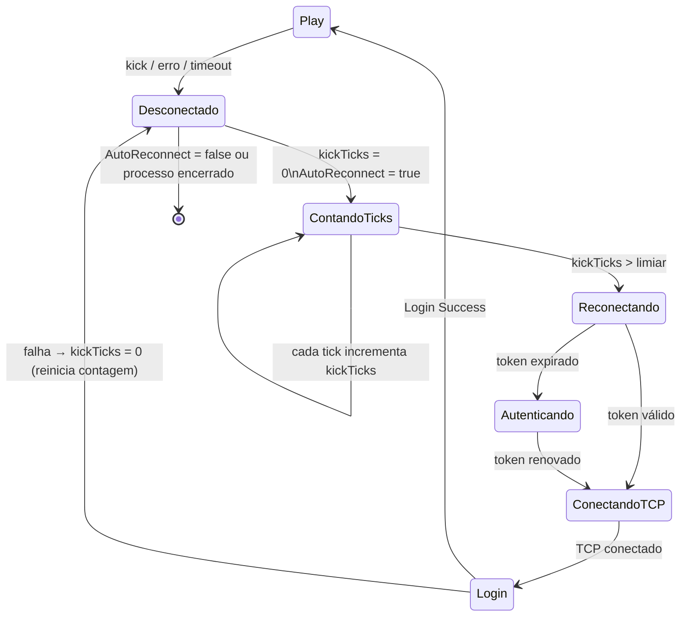
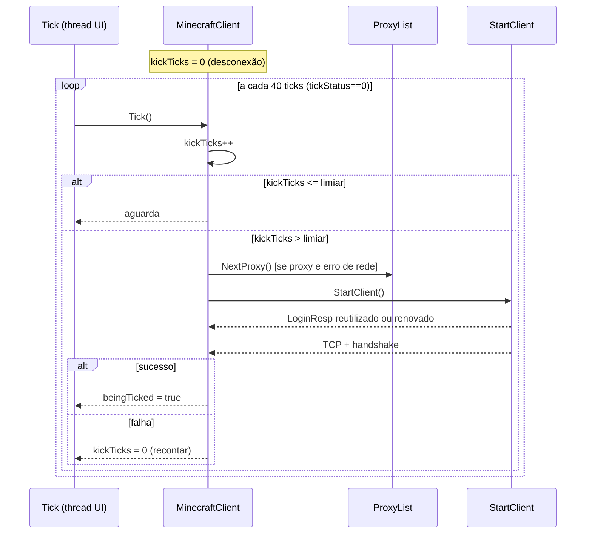
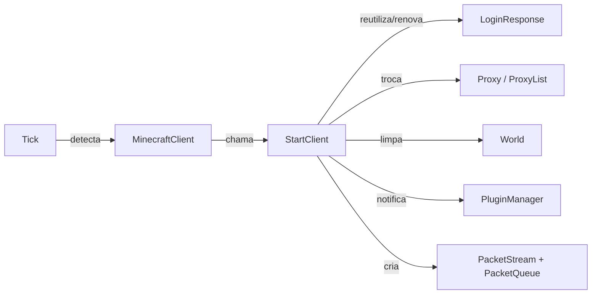

# Fluxo 02 — Reconexão Automática

## 1. Objetivo

Restabelecer a sessão automaticamente após uma desconexão inesperada, sem intervenção do operador. O fluxo existe porque servidores Minecraft expulsam clientes por timeout, restart, kick ou erro de rede, e o bot precisa retornar ao estado operacional de forma autônoma.

A reconexão não é um fluxo separado do login — ela **reutiliza `StartClient()`** como ponto de reinício. O que diferencia a reconexão do login inicial é: (a) `LoginResp` pode já existir e ser válido, evitando nova autenticação; (b) o iniciador é o `Tick()` em vez do operador; (c) pode haver troca de proxy.

---

## 2. Evento Iniciador

Qualquer condição que defina `kickTicks = 0` e com `AutoReconnect = true`:

- **Kick do servidor**: `HandlePacketDisconnect(reason)` — servidor enviou ID de disconnect.
- **Erro de rede**: `PacketStream.OnError` — I/O falhou no transporte.
- **Timeout de keep-alive**: `Tick()` detecta `keepAliveTicks > 750`.
- **Timeout de handshake**: `Tick()` detecta `connStatus=0` há mais de 20 000 ms.
- **Falha na conexão**: exceção em `StartClient()` define `kickTicks = 0`.
- **Loop 1.5.2 encerrado**: `Connect_v15()` captura exceção e define `kickTicks = 0`.

---

## 3. Componentes Envolvidos

| Componente | Papel |
|---|---|
| `MinecraftClient.Tick()` | detecta `kickTicks >= 0` e decide quando reconectar |
| `MinecraftClient.StartClient()` | executa o reinício completo da sessão |
| `Proxy` / `ProxyList` | pode ser trocado antes da reconexão |
| `LoginCache` / `SessionUtils` | reutilizam token existente se válido |
| `PacketStream` | fechada e recriada |
| `World` | limpo antes da reconexão |
| `PluginManager` | notificado via `onClientConnect` |

---

## 4. Ordem Completa de Chamadas

```
[Desconexão ocorre — qualquer causa]
  └── kickTicks = 0

Tick() [chamado pelo loop da UI a cada ciclo]
  ├── [se beingTicked = false e kickTicks >= 0 e tickStatus == 0]
  │     ├── kickTicks++
  │     └── [se kickTicks > limiar configurado por reconnectType]
  │           └── StartClient()   ← reinício completo

StartClient()
  ├── [mesma sequência do fluxo de Login — ver 01-Login.md]
  └── [diferença: LoginResp pode já existir]
        ├── se LoginResp != null: pula autenticação Mojang
        └── se LoginResp != null mas token expirou:
              └── SessionUtils.Login → refresh → novo LoginResp
```

---

## 5. Estados Percorridos



---

## 6. Threads Envolvidas

| Thread | Ação |
|---|---|
| Thread UI (tick) | detecta `kickTicks` e chama `StartClient()` |
| ThreadPool worker | autenticação Mojang se necessária |
| IOCP | `ConnectCallback`, callbacks de rede |

**Por que o tick detecta e não um timer?** O `kickTicks` é incrementado apenas quando `tickStatus == 0` — ou seja, a cada 40 ticks. Isso cria um delay variável antes da reconexão que depende da cadência de `Tick()`. Não é um delay fixo em segundos.

---

## 7. Eventos Publicados

| Evento | Quando |
|---|---|
| `IPlugin.onClientConnect(client)` | ao final de cada `StartClient()` — inclusive reconexões |

---

## 8. Eventos Consumidos

| Evento | Fonte | Efeito |
|---|---|---|
| Tick do loop UI | `Main.cs` | incrementa `kickTicks` e decide reconectar |
| `PacketStream.OnError` | falha de I/O | define `kickTicks = 0` via delegado em `ConnectCallback` |
| `HandlePacketDisconnect` | servidor | define `kickTicks = 0` |

---

## 9. Objetos Modificados

| Objeto | Campo | Momento |
|---|---|---|
| `MinecraftClient` | `kickTicks` | ao desconectar (→0) e no tick (incrementado) |
| `MinecraftClient` | `beingTicked` | false ao desconectar; true após JoinGame |
| `MinecraftClient` | `ConProxy` | trocado antes de `StartClient()` em erros de rede |
| `MinecraftClient` | `LoginResp` | reutilizado ou renovado |
| `World` | todos os chunks | limpos em `StartClient()` |
| `PlayerManager` | `UUID2Nick` | limpo em `StartClient()` e em `HandlePacketDisconnect` |

---

## 10. Estruturas Compartilhadas

| Estrutura | Acesso concorrente |
|---|---|
| `MinecraftClient.AutoReconnect` (estático) | todas as sessões leem e escrevem sem lock |
| `Program.FrmMain.Proxies` | `NextProxy()` pode ser chamado de múltiplas sessões simultaneamente |

---

## 11. Possíveis Falhas

| Situação | Consequência |
|---|---|
| `StartClient()` falha novamente | `kickTicks = 0` — a contagem recomeça do zero |
| Token Mojang expirou | nova autenticação via `/authenticate` — pode falhar se offline |
| Todos os proxies esgotados | `NextProxy()` retorna `null`; próxima tentativa sem proxy |
| Loop de reconexão infinito | se o servidor sempre rejeitar, o bot tenta indefinidamente |

---

## 12. Recuperação de Erro

- Falhas em `StartClient()` reiniciam `kickTicks = 0` — não param o loop de reconexão.
- Troca de proxy: após `SocketException`/`IOException` com proxy configurado.
- Kick por IP saturado (`"Já existem muitas contas conectadas com esse IP"`) → troca de proxy imediata.
- Não há backoff exponencial — o delay entre tentativas é constante (definido por `reconnectType`).

---

## 13. Fluxograma

```mermaid
flowchart TD
  DISC([Desconectado: kickTicks=0]) --> TICK[Tick executado]
  TICK --> CHECK{beingTicked=false\ne AutoReconnect=true\ne tickStatus==0?}
  CHECK -->|não| TICK2([próximo tick])
  CHECK -->|sim| INC[kickTicks++]
  INC --> LIMIAR{kickTicks > limiar?}
  LIMIAR -->|não| TICK2
  LIMIAR -->|sim| PROXY{Troca proxy\nnecessária?}
  PROXY -->|sim| NP[NextProxy()]
  PROXY & NP --> SC[StartClient()]
  SC --> ERR{Erro?}
  ERR -->|sim| RESET[kickTicks=0\nvolta a contar]
  ERR -->|não| PLAY([Sessão restaurada])
```

---

## 14. Diagrama de Sequência



---

## 15. Regras de Negócio

1. **Reconexão só ocorre com `AutoReconnect = true`** — configuração estática global que afeta todas as sessões.
2. **`LoginResp` persiste entre reconexões** — o token não é descartado ao desconectar; só é invalidado se o refresh falhar.
3. **Troca de proxy é automática em erros de rede** — apenas `SocketException` e `IOException` acionam `NextProxy()`; outros erros não.
4. **Kick por IP saturado provoca troca imediata** — verificação por texto de mensagem de kick, hardcoded.
5. **Delay antes de reconectar depende de `reconnectType`** — sem valor documentado no código analisado; o limiar é configurável.
6. **Não há limite de tentativas** — o bot tenta indefinidamente até sucesso ou operador desligar.
7. **Plugins são notificados em cada reconexão** — `onClientConnect` é disparado toda vez que `StartClient()` é chamado.

---

## 16. Dependências entre Módulos



---

## 17. Impacto para Migração Java

| Aspecto | Comportamento C# | Recomendação Java |
|---|---|---|
| Detecção de desconexão | `kickTicks` incrementado no tick | evento `SessionDisconnected` publicado no barramento |
| Delay para reconectar | variável — depende da cadência de tick | backoff exponencial com `ScheduledExecutorService` |
| Troca de proxy | `NextProxy()` síncrona | porta `ProxySelector` injetável |
| Token reutilizado | `LoginResp` em campo de instância | `SessionCredential` com validade e renovação automática |
| Notificação de plugins | `onClientConnect` a cada `StartClient()` | evento `SessionReconnected` separado de `SessionConnected` para que plugins possam distinguir |
| Limite de tentativas | inexistente | configurável: `maxRetries`, backoff, circuit breaker |

**Invariante crítica:** o estado do mundo (`World`, `Player`, `Inventory`) deve ser limpo antes de reconectar — o servidor enviará novos chunks/slots ao fazer join, e estado stale causaria inconsistências.

---

## Classes participantes

`MinecraftClient`, `PacketStream`, `PacketQueue`, `World`, `PlayerManager`, `Entity`, `SessionUtils`, `LoginCache`, `LoginResponse`, `Proxy`, `ProxyList` (em `Main.cs`), `PluginManager`, `ProtocolHandler`.
