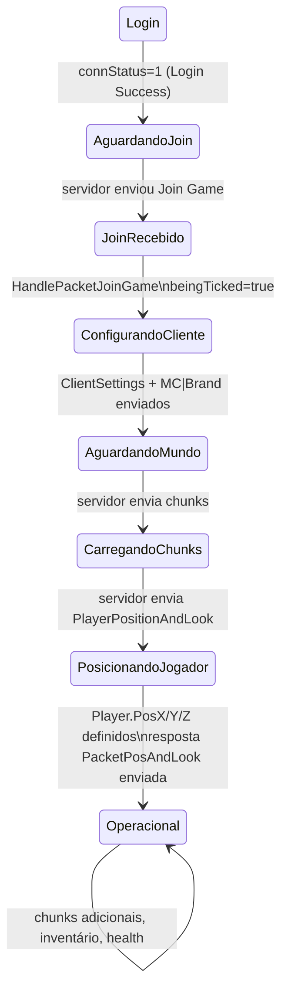
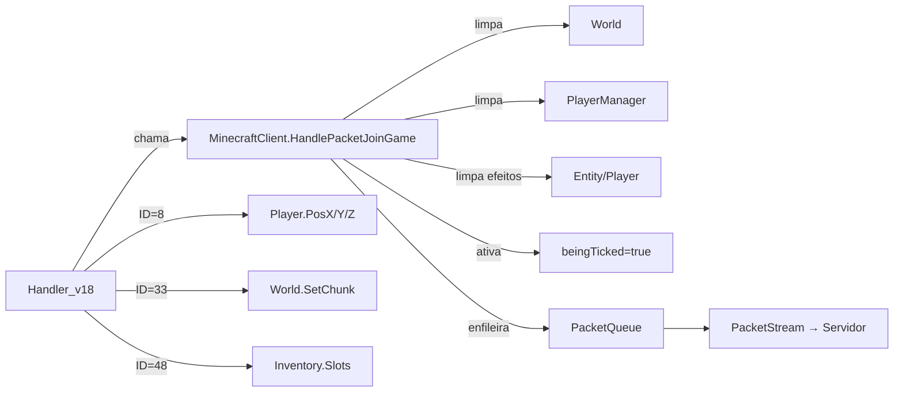

# Fluxo 03 — Spawn e Join Game

## 1. Objetivo

Inicializar o estado de jogo do bot após o servidor aceitar a sessão. O fluxo começa quando o servidor envia o pacote `Join Game` e termina quando o bot está no mundo com chunks carregados, inventário populado e física ativa. Sem este fluxo, o bot sabe que está conectado mas não sabe onde está, o que há no mundo ou o que tem no inventário.

Este fluxo é o ponto onde `beingTicked` torna-se `true` — a fronteira entre "conectado mas aguardando" e "operando no jogo".

---

## 2. Evento Iniciador

Recebimento do pacote **Join Game** do servidor:
- 1.8: ID `0x01` no estado play
- 1.9: ID remapeado pelo `Handler_v19`

---

## 3. Componentes Envolvidos

| Componente | Papel |
|---|---|
| `Handler_v18` / `Handler_v19` | interpreta o pacote Join Game e chama o cliente |
| `MinecraftClient.HandlePacketJoinGame` | ativa a sessão de jogo e envia configuração inicial |
| `PacketClientSettings` | informa ao servidor as preferências do cliente (view distance, locale) |
| `PacketPluginMessage` | anuncia o "brand" do cliente ao servidor |
| `PacketQueue` | fila de saída que entregará os pacotes de configuração |
| `Entity` (Player) | receptor das atualizações de posição vindas do servidor |
| `World` | receptor dos chunks enviados após Join Game |
| `Inventory` | receptor dos itens enviados após Join Game |
| `Handler_v18` ID 8 | aplica a posição inicial do jogador |

---

## 4. Ordem Completa de Chamadas

```
[Servidor envia Join Game]
  └── PacketStream.OnPacketAvailable → HandlePacket(pkt)
        └── connStatus == 1 → Handler.HandlePacket(pkt)
              └── Handler_v18.HandlePacket(ID=1)
                    ├── Lê: playerId (int), isHardcore (bool), gamemode (byte)
                    │         dimension (byte), difficulty (byte), maxPlayers (byte)
                    │         levelType (string)
                    │         [1.8+] reducedDebugInfo (bool)
                    └── MinecraftClient.HandlePacketJoinGame(playerId, dimension, gamemode)
                          ├── PlayerID = playerId
                          ├── Dimension = dimension
                          ├── Gamemode = gamemode
                          ├── TheWorld.Clear()
                          ├── PlayerManager.Clear()
                          ├── Player.ActivePotions.Clear()
                          ├── beingTicked = true          ← PONTO CRÍTICO
                          ├── SendQueue.AddToQueue(PacketClientSettings(viewDistance=8))
                          ├── WriteBuffer w = new WriteBuffer()
                          │     w.WriteString("sexo")
                          ├── SendQueue.AddToQueue(PacketPluginMessage("MC|Brand", w.GetBytes()))
                          └── HotbarSlot = 0
                                └── [se IsBeingTicked] AddToQueue(PacketHeldItemChange(0))

[Após Join Game — servidor inicia envio de dados de mundo e estado]
  ├── Chunks: Handler_v18 ID=33 → World.SetChunk(x, z, chunk)
  ├── Posição inicial: Handler_v18 ID=8 → aplica Player.PosX/Y/Z/Yaw/Pitch
  │                                      → SendQueue.AddToQueue(PacketPosAndLook onGround=false)
  ├── Hotbar/held item: Handler_v18 ID=9 → HotbarSlot = slot
  ├── Health: Handler_v18 ID=6 → MinecraftClient.health, foodlevel
  └── Inventário: Handler_v18 ID=48 (Window Items) → Inventory.Slots[] populados
```

---

## 5. Estados Percorridos



---

## 6. Threads Envolvidas

| Thread | O que executa |
|---|---|
| IOCP (callback de rede) | recebe Join Game, chama `HandlePacketJoinGame`, enfileira pacotes de configuração |
| IOCP (callback de rede) | recebe chunks, posição, inventário — aplica ao estado local |
| Thread UI (tick) | após `beingTicked=true`, começa a processar física e comandos |

**Ponto crítico de concorrência:** `beingTicked = true` é escrito pelo callback de rede (IOCP). O `Tick()` (thread UI) lê `beingTicked` sem sincronização. Em teoria, há uma janela onde `Tick()` pode ver `beingTicked=true` antes de `Player.PosX/Y/Z` estarem definidos pelo ID=8 subsequente.

---

## 7. Eventos Publicados

| Evento | Quando |
|---|---|
| `IPlugin.onClientConnect` | já foi publicado em `StartClient()`, antes do spawn |
| `World.OnBlockChange` (isChunk=true) | ao receber cada chunk |
| `World.OnBlockChange` (-1,-1,-1,true) | ao limpar o mundo em `HandlePacketJoinGame` |

---

## 8. Eventos Consumidos

| Pacote | ID 1.8 | Efeito |
|---|---|---|
| Join Game | 0x01 | ativa `beingTicked`, envia configuração |
| Player Position And Look | 0x08 | define posição inicial |
| Held Item Change | 0x09 | define slot ativo |
| Health Update | 0x06 | define `health` e `foodlevel` |
| Window Items | 0x30 | popula `Inventory.Slots` |
| Chunk Data | 0x21 | carrega chunks no `World` |

---

## 9. Objetos Modificados

| Objeto | Campo | Por |
|---|---|---|
| `MinecraftClient` | `PlayerID` | `HandlePacketJoinGame` |
| `MinecraftClient` | `Dimension` | `HandlePacketJoinGame` e `HandlePacketRespawn` |
| `MinecraftClient` | `Gamemode` | `HandlePacketJoinGame` |
| `MinecraftClient` | `beingTicked` | `HandlePacketJoinGame` → `true` |
| `MinecraftClient` | `health`, `foodlevel` | handler ID=6 |
| `MinecraftClient` | `hslot` | handler ID=9 |
| `Entity` (Player) | `PosX/Y/Z`, `Yaw/Pitch` | handler ID=8 |
| `Entity` | `ActivePotions` | limpo em Join Game |
| `World` | `Chunks` | limpo em Join Game; populado por chunks |
| `Inventory` | `Slots[0..44]` | handler ID=48 |

---

## 10. Estruturas Compartilhadas

| Estrutura | Risco |
|---|---|
| `World.Chunks` | escrito pelo IOCP ao receber chunks; lido pelo tick para física — sem lock nas leituras de bloco |
| `MinecraftClient.beingTicked` | escrito pelo IOCP; lido pelo tick — sem `volatile` |
| `Inventory.Slots` | escrito pelo IOCP (ID=48); lido por comandos no tick |

---

## 11. Possíveis Falhas

| Situação | Comportamento |
|---|---|
| Join Game com `playerId` inesperado | aceito sem validação; `PlayerID` sobrescrito |
| PlayerPositionAndLook não chega | bot fica em `(0,0,0)` sem posição real; física roda mas posição é inválida |
| Chunks não chegam | `ChunkExists()` retorna false; física força `MotionY = -0.1` (queda) |
| Inventário não chega antes de comandos | `Inventory.Slots` é array de nulls; `ItemInHand` retorna null |

---

## 12. Recuperação de Erro

- Não há timeout para recebimento de chunks, posição ou inventário após Join Game.
- O bot simplesmente opera com o que tem: se não recebeu posição, usa `(0,0,0)`.
- Se não recebeu chunk do pé, `Player.MotionY = -0.1` é aplicado — o bot "cai" até o chunk chegar.
- Se desconectado antes de receber tudo, o fluxo de reconexão recomeça.

---

## 13. Fluxograma

```mermaid
flowchart TD
  PKT([Join Game recebido]) --> JG[HandlePacketJoinGame\nPlayerID, Dimension, Gamemode]
  JG --> CLEAR[World.Clear\nPlayerManager.Clear\nPlayer.ActivePotions.Clear]
  CLEAR --> TICK_ON[beingTicked = true]
  TICK_ON --> CFG[Enfileira ClientSettings\n+ MC|Brand\n+ HeldItemChange slot=0]
  CFG --> FLUSH[Flush imediato — próximo tick]
  FLUSH --> WAIT[Aguarda pacotes de mundo]
  WAIT --> POS[ID=8: PlayerPositionAndLook\nDefine PosX/Y/Z/Yaw/Pitch\nResponde PacketPosAndLook]
  WAIT --> CHK[ID=33: Chunk Data\nWorld.SetChunk]
  WAIT --> INV[ID=48: Window Items\nInventory.Slots populados]
  WAIT --> HP[ID=6: Health Update]
  POS & CHK & INV & HP --> OP([Bot operacional])
```

---

## 14. Diagrama de Sequência

```mermaid
sequenceDiagram
  participant SRV as Servidor
  participant PS as PacketStream (IOCP)
  participant H18 as Handler_v18
  participant MC as MinecraftClient
  participant W as World
  participant P as Entity (Player)
  participant INV as Inventory
  participant SQ as SendQueue

  SRV->>PS: Join Game (ID=1)
  PS->>H18: HandlePacket(1)
  H18->>MC: HandlePacketJoinGame(id, dim, gm)
  MC->>W: Clear()
  MC->>P: ActivePotions.Clear()
  MC->>MC: beingTicked = true
  MC->>SQ: AddToQueue(ClientSettings)
  MC->>SQ: AddToQueue(PluginMessage MC|Brand "sexo")
  MC->>SQ: AddToQueue(HeldItemChange 0)

  SRV->>PS: Chunk Data (ID=33)
  PS->>H18: HandlePacket(33)
  H18->>W: SetChunk(x, z, chunk)
  W-->>SRV: [OnBlockChange notifica ViewForm]

  SRV->>PS: Player Position And Look (ID=8)
  PS->>H18: HandlePacket(8)
  H18->>P: PosX/Y/Z = values; Yaw/Pitch = values
  H18->>SQ: AddToQueue(PacketPosAndLook onGround=false)

  SRV->>PS: Window Items (ID=48)
  PS->>H18: HandlePacket(48)
  H18->>INV: Slots[i] = ItemStack
```

---

## 15. Regras de Negócio

1. **`beingTicked = true` é o gatekeeper do tick** — sem ele, física, pathfinding e comandos não executam. Deve ser definido apenas após Join Game, não antes.
2. **`ClientSettings` deve ser enviado imediatamente após Join Game** — sem ele, o servidor pode não enviar chunks (alguns implementam isso).
3. **`MC|Brand` com payload `"sexo"` é hardcoded** — não é parametrizado; em migração deve ser configurável.
4. **View distance enviada é 8** — não é a configuração `ViewerFpsLimit` ou equivalente; é um valor fixo.
5. **`World.Clear()` garante que dados da sessão anterior não contaminam a nova** — invariante crítica.
6. **`Player.ActivePotions` limpo** — efeitos de poção da sessão anterior não persistem após Join Game.
7. **`PlayerManager.Clear()` em Join Game** — a lista de jogadores conhecidos é resetada; a tab list é repopulada por pacotes subsequentes.
8. **Posição `(0,0,0)` até ID=8 chegar** — o `Entity` começa em `(0,0,0)` e só é corrigido quando o servidor enviar `PlayerPositionAndLook`.

---

## 16. Dependências entre Módulos



---

## 17. Impacto para Migração Java

| Aspecto | Comportamento C# | Recomendação Java |
|---|---|---|
| `beingTicked` | campo booleano sem `volatile` | `AtomicBoolean` ou estado no executor serial |
| Envio de `ClientSettings` | hardcoded view=8, locale implícita | configurável por sessão |
| `MC|Brand` payload | `"sexo"` hardcoded | `"AdvancedBot"` ou configurável |
| Posição inicial | `(0,0,0)` até ID=8 | idem — invariante de protocolo |
| `World.Clear()` no Join | síncrono no callback de rede | executado antes de habilitar física, no executor serial |
| Inventário null antes do ID=48 | não protegido | `Optional<ItemStack>` para representar slot vazio |

**Invariante crítica:** `beingTicked = true` (ou equivalente Java) deve ser definido **depois** de limpar o mundo e **antes** de enviar ClientSettings, para que o tick não processe um mundo inconsistente e os pacotes de configuração sejam enviados o mais cedo possível.

---

## Classes participantes

`Handler_v18`, `Handler_v19`, `MinecraftClient`, `Entity`, `World`, `Inventory`, `PlayerManager`, `PacketQueue`, `PacketClientSettings`, `PacketPluginMessage`, `PacketHeldItemChange`, `PacketPosAndLook`, `WriteBuffer`, `ReadBuffer`, `PluginManager`.
