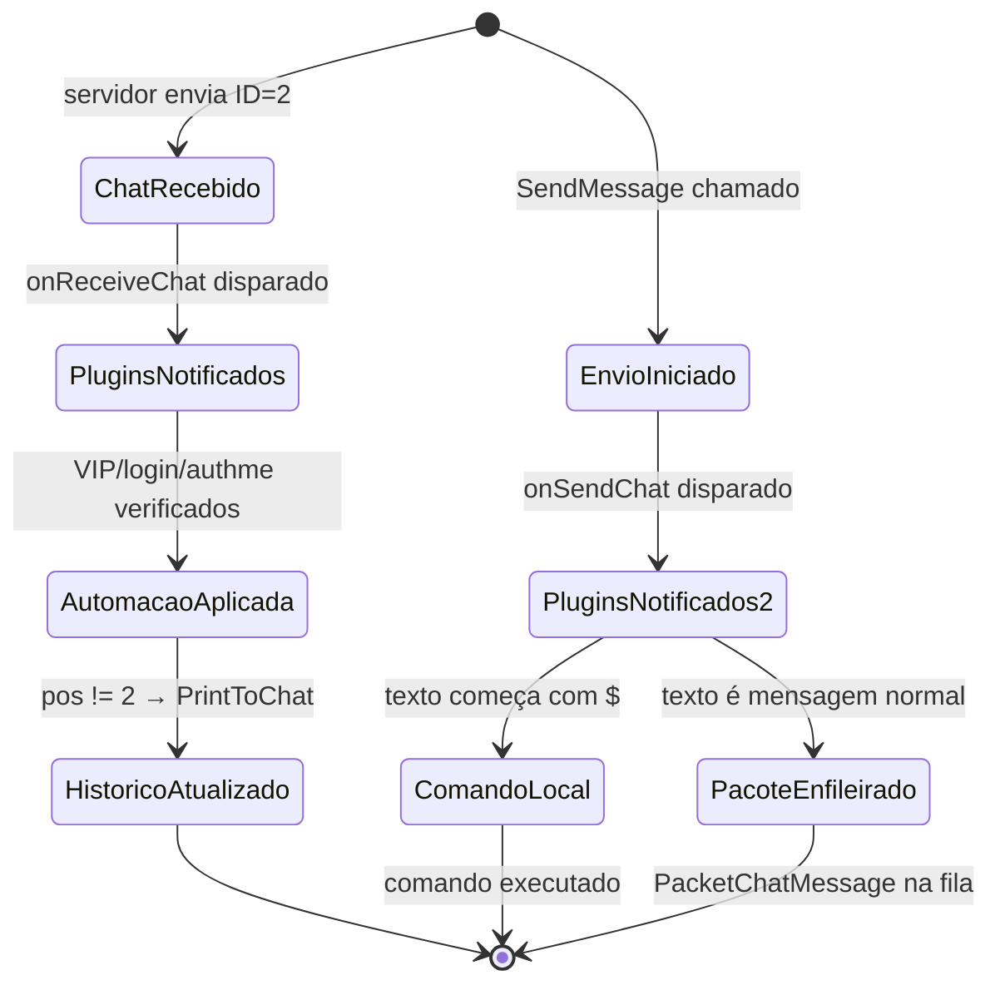
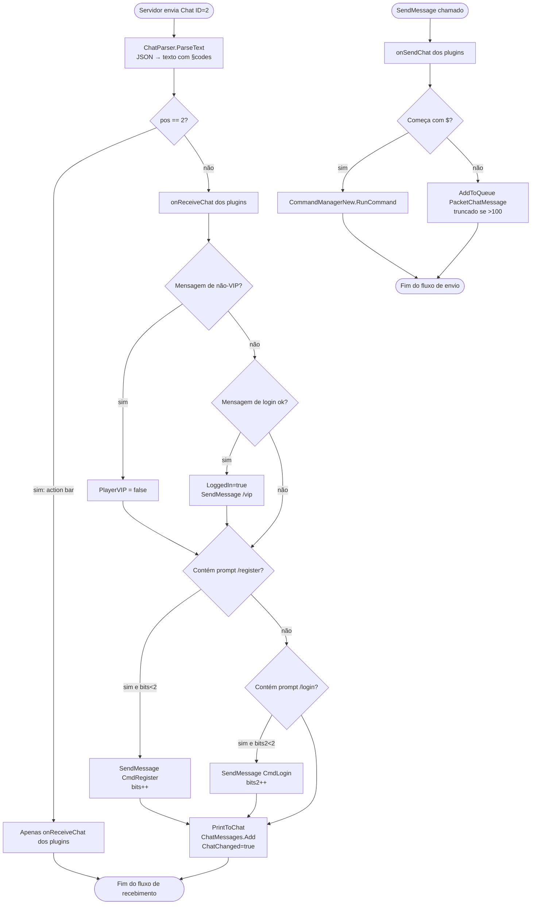
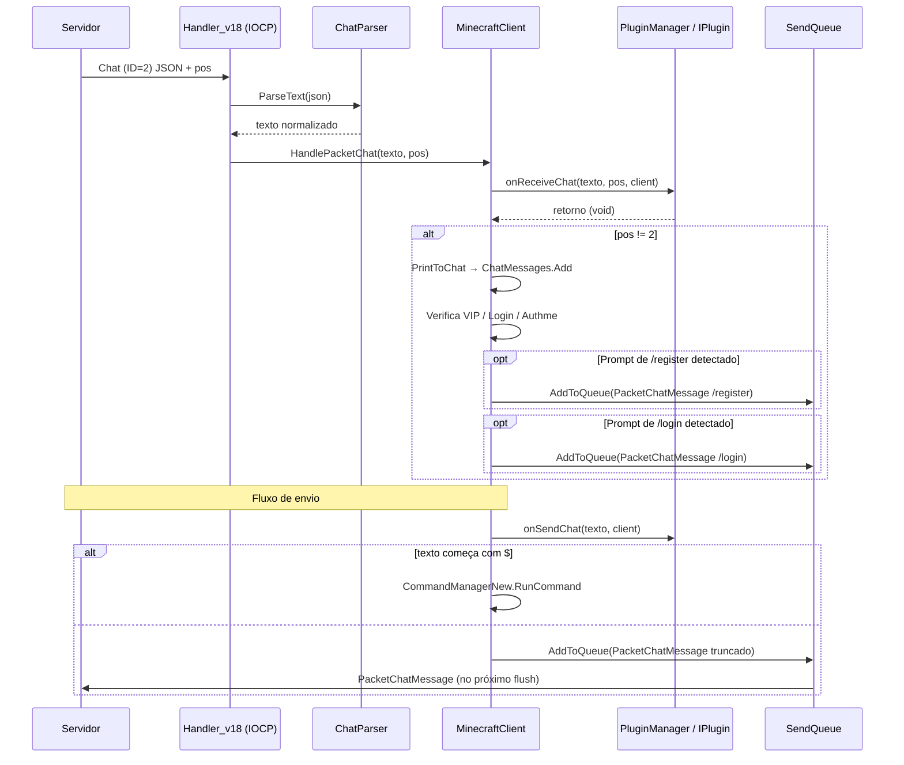
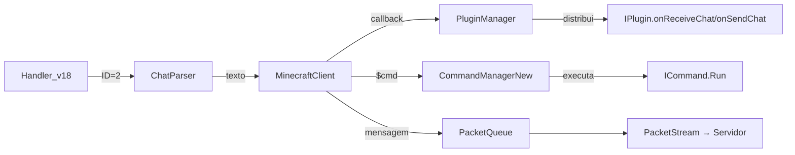

# Fluxo 04 — Recebimento e Envio de Chat

## 1. Objetivo

Processar mensagens de chat recebidas do servidor (aplicando regras de automação e notificando plugins) e enviar mensagens do bot ao servidor. O chat é o canal de comunicação principal com o mundo do jogo e o veículo de comandos para plugins de servidor (ex: `/login`, `/warp`). É também o sensor de entrada das macros: a maioria das automações (pesca, mob) usa mensagens de chat para detectar estado do servidor.

---

## 2. Evento Iniciador

**Recebimento:** pacote de chat do servidor (ID 2 em 1.8).
**Envio:** chamada de `MinecraftClient.SendMessage(text)` — por UI, comando local, macro ou script.

---

## 3. Componentes Envolvidos

| Componente | Papel |
|---|---|
| `Handler_v18` | lê o pacote de chat, normaliza o JSON e chama o cliente |
| `ChatParser` | extrai texto puro de componente de chat JSON |
| `MinecraftClient.HandlePacketChat` | aplica regras de automação, notifica plugins, imprime no histórico |
| `MinecraftClient.PrintToChat` | adiciona ao histórico de chat e notifica a UI |
| `MinecraftClient.SendMessage` | decide se é comando local ($) ou mensagem ao servidor |
| `CommandManagerNew.RunCommand` | despacha comandos locais (prefixo $) |
| `PacketChatMessage` | pacote enviado ao servidor |
| `PluginManager` | distribui callbacks de chat para todos os plugins |
| `ICommand` (macros) | reagem a padrões de chat via `onReceiveChat` indiretamente |
| `NickGenerator` | gera e-mails aleatórios para auto-register |

---

## 4. Ordem Completa de Chamadas

### Recebimento

```
[Servidor envia Chat (ID=2)]
  └── PacketStream.OnPacketAvailable → Handler.HandlePacket(pkt)
        └── Handler_v18.HandlePacket(ID=2)
              ├── chat = pkt.ReadString()           ← componente JSON bruto
              ├── chat = ChatParser.ParseText(chat)  ← texto normalizado com §codes
              ├── pos = pkt.ReadByte()               ← 0=chat, 1=system, 2=action bar
              └── MinecraftClient.HandlePacketChat(chat, pos)
                    ├── foreach plugin: IPlugin.onReceiveChat(chat, pos, this)
                    ├── [VIP check] StripColorCodes(chat).EqualsIgnoreCase("✖ Apenas VIPs...") → PlayerVIP=false
                    ├── [login detect] chat.ToLower().Contains("agora você está logado...") → LoggedIn=true + SendMessage("/vip")
                    └── [se pos != 2]
                          ├── PrintToChat(chat)
                          │     ├── ChatMessages.Add(chat)
                          │     ├── [se > MaximumChatLines] ChatMessages.RemoveAt(0)
                          │     ├── ChatChanged = true
                          │     └── [notifica UI via event/invoke — implícito]
                          ├── bits = GetBits(authmeCounter, 0, 4)
                          ├── bits2 = GetBits(authmeCounter, 4, 4)
                          ├── [se bits<2 e chat contém prefixo de /register]
                          │     ├── SendMessage(CmdRegister.Replace("@email", RandomNick@gmail))
                          │     └── SetBits(authmeCounter, bits+1, 0, 4)
                          └── [se bits2<2 e chat contém prefixo de /login]
                                ├── SendMessage(CmdLogin)
                                └── SetBits(authmeCounter, bits2+1, 4, 4)
```

### Envio

```
MinecraftClient.SendMessage(text)
  ├── foreach plugin: IPlugin.onSendChat(text, this)
  ├── [se text começa com '$']
  │     └── CmdManager.RunCommand(text)
  │           ├── GetCommand(alias)
  │           └── command.Run(alias, args) → CommandResult
  └── [senão]
        └── SendQueue.AddToQueue(new PacketChatMessage(text))
              └── [PacketChatMessage: trunca para 99 se entrada >100]
```

---

## 5. Estados Percorridos

O chat não tem uma máquina de estados própria; ele atua sobre estados externos:



---

## 6. Threads Envolvidas

| Thread | Ação |
|---|---|
| IOCP (callback de rede) | recebe pacote, chama `HandlePacketChat` |
| IOCP | `onReceiveChat` dos plugins é chamado na thread de rede |
| IOCP | `SendMessage` via authme também é chamado na thread de rede |
| Thread UI (tick) | `SendMessage` chamado por comandos/macros no tick |
| Thread de macro (async) | `SendMessage` chamado em `async void Tick` das macros Solk |

**Risco crítico:** `onReceiveChat` e o tick das macros Solk (`async void`) podem ser executados concorrentemente, acessando o estado da macro sem sincronização.

---

## 7. Eventos Publicados

| Evento | Quando | Consumidor |
|---|---|---|
| `IPlugin.onReceiveChat(chat, pos, client)` | ao receber qualquer chat | todos os plugins |
| `IPlugin.onSendChat(chat, client)` | ao enviar qualquer mensagem | todos os plugins |
| `ChatChanged = true` | ao adicionar ao histórico | UI para refrescar exibição |

---

## 8. Eventos Consumidos

| Pacote | ID 1.8 | Fonte |
|---|---|---|
| Chat Message | 0x02 | servidor |
| Plugin Message (chan=`MC\|Sign`) | 0x45 | alguns servidores usam para chat estendido |

---

## 9. Objetos Modificados

| Objeto | Campo | Quando |
|---|---|---|
| `MinecraftClient` | `ChatMessages` | ao receber chat com pos != 2 |
| `MinecraftClient` | `ChatChanged` | ao adicionar ao histórico |
| `MinecraftClient` | `PlayerVIP` | ao detectar mensagem de não-VIP |
| `MinecraftClient` | `LoggedIn` | ao detectar mensagem de login bem-sucedido |
| `MinecraftClient` | `authmeCounter` | ao responder /register ou /login |
| `PacketQueue` | fila interna | ao enfileirar `PacketChatMessage` |

---

## 10. Estruturas Compartilhadas

| Estrutura | Risco |
|---|---|
| `ChatMessages` (`List<string>`) | escrito por IOCP; lido pela UI para exibição — sem lock |
| `authmeCounter` | escrito por IOCP em `HandlePacketChat`; não há acesso concorrente adicional neste campo específico |
| `PluginManager.plugins` | iterado sem lock em `onReceiveChat` e `onSendChat` |

---

## 11. Possíveis Falhas

| Situação | Comportamento |
|---|---|
| `ChatParser.ParseText` lança exceção | exceção propaga para o handler — desconexão possível |
| Plugin lança em `onReceiveChat` | exceção propaga para o handler — desconecta a sessão |
| `SendMessage` com texto > 100 chars | truncado para 99 (não 100) |
| Servidor envia componente JSON inválido | `ChatParser` retorna string vazia ou lança |
| `authmeCounter` atinge limite | bot para de responder a prompts de register/login |

---

## 12. Recuperação de Erro

- Não há captura de exceção em `HandlePacketChat` — falha de plugin causa propagação ao handler, que pode desconectar.
- `authmeCounter` é zerado em cada `StartClient()` — reconexão reseta o contador de tentativas.
- `MaximumChatLines` limita o tamanho da lista (`ChatMessages.RemoveAt(0)` quando excede).
- Chat de posição 2 (action bar) é ignorado do histórico — não contamina o log visível.

---

## 13. Fluxograma



---

## 14. Diagrama de Sequência



---

## 15. Regras de Negócio

1. **Posição 2 (action bar) é excluída do histórico** — mensagens de barra de ação não são armazenadas em `ChatMessages` nem processadas pelas regras de automação.
2. **Plugins recebem o chat bruto (com §codes), não o texto puro** — `ChatParser.ParseText` transforma o JSON mas preserva os códigos de cor. Plugins devem usar `Utils.StripColorCodes` se precisarem de texto puro.
3. **Truncamento: entrada > 100 → saída = 99 chars** — o construtor de `PacketChatMessage` trunca para 99 quando a entrada tem mais de 100, não para 100.
4. **Auto-register máximo 2 tentativas** — `authmeCounter` bits 0–3 limitam a 2; idem para /login nos bits 4–7.
5. **Detecção de login é hardcoded para Craftlandia** — a string `"agora você está logado. nunca use a mesma senha do craftlandia..."` é literal no código.
6. **Comandos locais ($) não chegam ao servidor** — o prefixo $ redireciona para `CommandManagerNew` e nunca gera `PacketChatMessage`.
7. **Plugins podem interceptar mas não cancelar** — `onSendChat` e `onReceiveChat` são `void`; plugins não podem bloquear o chat.

---

## 16. Dependências entre Módulos



---

## 17. Impacto para Migração Java

| Aspecto | Comportamento C# | Recomendação Java |
|---|---|---|
| Callbacks de plugin | `void` — não cancela | `EventResult` com PASS/CANCEL |
| Detecção de servidor | strings hardcoded de Craftlandia | regex configurável por servidor |
| Auto-register | `authmeCounter` com bits | `AuthmeBot` como plugin separado, não no core |
| Histórico de chat | `List<string>` sem lock | `CopyOnWriteArrayList` ou evento publicado |
| Truncamento | entrada >100 → 99 chars | preservar exatamente: >100 → 99, não >99 → 99 |
| Threads | IOCP executa `onReceiveChat` | executor serial: todo `onReceiveChat` e tick na mesma thread |
| Action bar | pos=2 descartado do histórico | idem — invariante de exibição |

**Invariante crítica:** `onReceiveChat` deve ser chamado **antes** de `PrintToChat` — plugins têm direito de ver a mensagem antes de ela ser registrada no histórico.

---

## Classes participantes

`Handler_v18`, `Handler_v17`, `Handler_v152`, `ChatParser`, `MinecraftClient`, `PluginManager`, `IPlugin`, `CommandManagerNew`, `ICommand`, `PacketQueue`, `PacketChatMessage`, `NickGenerator`, `Utils`.
