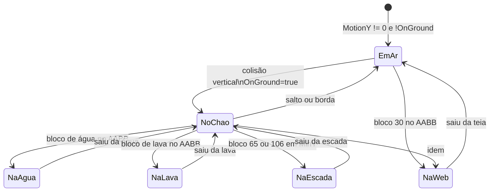
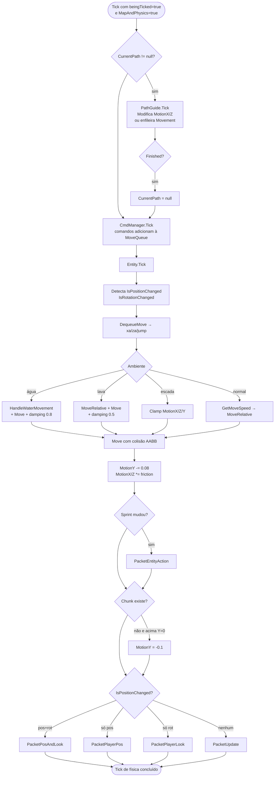
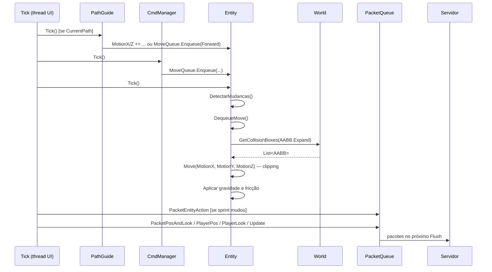
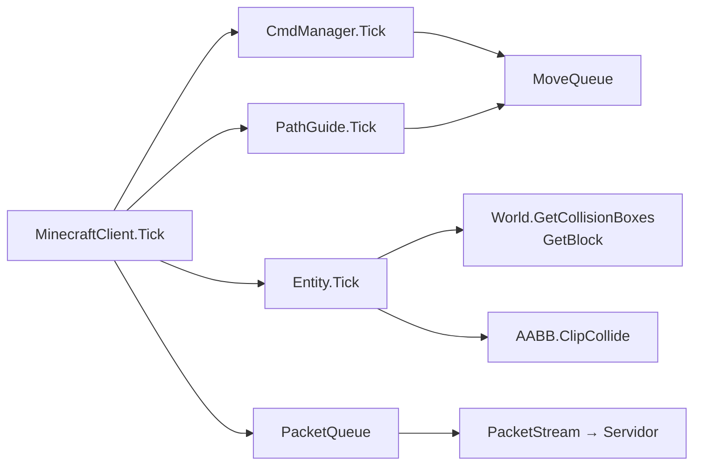

# Fluxo 05 — Movimento e Física

## 1. Objetivo

Simular o movimento do bot no mundo Minecraft: aplicar inputs de direção, calcular física (gravidade, fricção, colisão, step-up, ambientes líquidos), determinar se a posição mudou e emitir os pacotes de movimento corretos ao servidor. O fluxo existe porque o protocolo Minecraft exige que o cliente reporte sua posição a cada tick — sem isso o servidor considera o cliente inativo (keep-alive) ou o desconecta.

A física client-side replica a lógica do cliente Minecraft original. Isso é necessário para que o servidor aceite a posição sem rejeição anti-cheat. Qualquer divergência na implementação pode causar rubber-banding (servidor corrige a posição) ou kick por "moved too quickly".

---

## 2. Evento Iniciador

**`MinecraftClient.Tick()`** — chamado a cada ciclo do loop da UI com `beingTicked = true` e `MapAndPhysics = true`.

---

## 3. Componentes Envolvidos

| Componente | Papel |
|---|---|
| `MinecraftClient.Tick()` | orquestra a sequência; emite pacotes de movimento |
| `Entity.Tick()` | executa toda a simulação física |
| `Entity.MoveQueue` | fila de inputs de direção (Forward/Back/Left/Right/Jump) |
| `Entity.Move()` | aplica colisão AABB contra o mundo |
| `Entity.MoveRelative()` | converte input em velocidade relativa ao olhar |
| `World.GetCollisionBoxes()` | retorna AABBs de blocos para colisão |
| `World.GetBlock()` | detecta ambiente (água, lava, escada, teia) |
| `PathGuide.Tick()` | produz inputs de movimento para o pathfinder |
| `PacketQueue` | recebe os pacotes de posição/rotação |
| `PacketPlayerPos`, `PacketPlayerLook`, `PacketPosAndLook`, `PacketUpdate` | pacotes de movimento |
| `PacketEntityAction` | emitido ao mudar estado de sprint |

---

## 4. Ordem Completa de Chamadas

```
MinecraftClient.Tick()  [thread UI]
  ├── [se CurrentPath != null]
  │     ├── CurrentPath.Tick()          ← PathGuide adiciona à MoveQueue ou modifica MotionX/Z
  │     └── [se CurrentPath.Finished()] CurrentPath = null
  │
  ├── CmdManager.Tick()                 ← comandos podem adicionar à MoveQueue
  │
  └── [se MapAndPhysics]
        ├── Player.Tick()
        │     ├── Calcula IsPositionChanged (Δpos² > 0.0009 ou posTicks >= 20)
        │     ├── Calcula IsRotationChanged (Yaw != OldYaw ou Pitch != OldPitch)
        │     ├── Salva OldX/Y/Z, OldYaw/Pitch
        │     ├── DequeueMove() → xa, za, jump
        │     ├── [se em água] HandleWaterMovement() + MoveRelative + Move + damping 0.8
        │     ├── [se em lava] MoveRelative + Move + damping 0.5
        │     ├── [se em escada] clamp MotionX/Z/Y + colisão climb
        │     ├── [senão]
        │     │     ├── GetBlock(pé-1) → slipperiness
        │     │     ├── speed = GetMoveSpeed × (0.16277136/friction³)
        │     │     └── MoveRelative(xa, za, speed)
        │     ├── Move(MotionX, MotionY, MotionZ)
        │     │     ├── World.GetCollisionBoxes(AABB.Expand)
        │     │     ├── ClipY → ClipX → ClipZ
        │     │     ├── [colisão horizontal e no chão] tenta step-up 0.5
        │     │     └── Atualiza OnGround, IsCollided*, PosX/Y/Z, Motion*
        │     ├── MotionY -= 0.08    (gravidade)
        │     ├── MotionX/Z *= friction
        │     └── MotionY *= 0.98
        │
        ├── [Player.WasSprinting != Player.IsSprinting]
        │     ├── AddToQueue(PacketEntityAction(PlayerID, 3 ou 4, 0))
        │     └── Player.WasSprinting = Player.IsSprinting
        │
        ├── [chunk do pé não existe e MinY > 0]
        │     └── Player.MotionY = -0.1   (queda forçada sem chunk)
        │
        ├── [Player em portal e OnGround]
        │     └── RequestPathTo(destino do portal)
        │
        └── Emite pacote de movimento:
              ├── [IsPositionChanged e IsRotationChanged] → PacketPosAndLook(X,FeetY,Z,Yaw,Pitch,OnGround)
              ├── [só IsPositionChanged]                  → PacketPlayerPos(X,FeetY,Z,OnGround)
              ├── [só IsRotationChanged]                  → PacketPlayerLook(Yaw,Pitch,OnGround)
              └── [nenhum]                                → PacketUpdate(OnGround)
```

---

## 5. Estados Percorridos



---

## 6. Threads Envolvidas

| Thread | Ação |
|---|---|
| Thread UI (tick) | `Entity.Tick()`, `Move()`, emissão de pacotes |
| IOCP (callback de rede) | pode escrever `Player.PosX/Y/Z` via handler ID=8 (correção de posição) |
| Thread de Task (pathfinder) | `RequestPathTo` cria rota em Task paralela e escreve `CurrentPath` |
| Thread de macro (async) | adiciona à `MoveQueue` sem lock (a menos que `LockMoveQueue=true`) |

**Risco:** `Player.PosX/Y/Z` pode ser sobrescrito pelo handler (IOCP) enquanto o tick está calculando física. Não há sincronização.

---

## 7. Eventos Publicados

| Evento | Quando |
|---|---|
| `PacketEntityAction` (sprint start/stop) | ao detectar mudança de `IsSprinting` |
| `PacketPosAndLook` | a cada tick com posição e rotação mudadas |
| `PacketPlayerPos` | a cada tick com só posição mudada |
| `PacketPlayerLook` | a cada tick com só rotação mudada |
| `PacketUpdate` | a cada tick sem mudança (apenas `OnGround`) |
| `RequestPathTo` → rota calculada | ao entrar em portal |

---

## 8. Eventos Consumidos

| Pacote recebido | ID 1.8 | Efeito |
|---|---|---|
| Player Position And Look | 0x08 | aplica correção de posição/rotação ao `Player` |
| Velocity | 0x12 | sobrescreve `MotionX/Y/Z` (knockback) |
| Chunk Data | 0x21 | popula `World` com novos blocos para colisão |
| Entity Move | 0x15–0x17 | atualiza posição de entidades remotas |

---

## 9. Objetos Modificados

| Objeto | Campo | Por |
|---|---|---|
| `Entity` | `PosX/Y/Z` | `Entity.Move()` |
| `Entity` | `MotionX/Y/Z` | `Entity.Tick()`, `MoveRelative`, colisão |
| `Entity` | `AABB` | `Entity.Move()` in-place |
| `Entity` | `OnGround` | `Entity.Move()` |
| `Entity` | `IsPositionChanged/IsRotationChanged` | `Entity.Tick()` |
| `Entity` | `OldX/Y/Z/Yaw/Pitch` | salvo no início de cada `Tick()` |
| `Entity` | `WasSprinting` | após `PacketEntityAction` |
| `MinecraftClient` | `keepAliveTicks` | resetado por keep-alive; usado para timeout |
| `PacketQueue` | fila | packets de movimento adicionados a cada tick |

---

## 10. Estruturas Compartilhadas

| Estrutura | Acesso concorrente |
|---|---|
| `Entity.MoveQueue` | escrito por PathGuide (Task) e macros (async); lido pelo tick — sem lock a menos que `LockMoveQueue=true` |
| `Entity.PosX/Y/Z` | escrito pelo tick e pelo handler (correção) — sem sincronização |
| `World.Chunks` | lido pelo tick para colisão; escrito pelo handler para chunks — sem lock em leituras |
| `MinecraftClient.CurrentPath` | escrito pela Task do pathfinder; lido e nullado pelo tick — sem lock |

---

## 11. Possíveis Falhas

| Situação | Comportamento |
|---|---|
| Colisão infinita (stuck) | `Move()` retorna delta=0; bot para sem progredir |
| Chunk ausente | `GetBlock()` retorna 0 (ar); bot atravessa blocos ou cai |
| `MoveQueue` com entrada de outra thread sem lock | `Queue<T>` lança `InvalidOperationException` |
| Correção de posição pelo servidor | `Player.PosX/Y/Z` sobrescritos pelo IOCP entre ticks |
| Pathfinder grava `CurrentPath` após o tick ter lido null | rota perdida silenciosamente |

---

## 12. Recuperação de Erro

- Não há captura de exceção em `Entity.Tick()` ou `Move()`.
- Exceção em `Move()` propagaria para `MinecraftClient.Tick()` e poderia desconectar.
- Chunk ausente: `GetBlock()` retorna 0 (ar) — colisão não ocorre; efeito visível é bot atravessando o chão até chunk chegar.
- Correção de servidor (ID=8): o servidor pode enviar posição correta a qualquer momento, sobrescrevendo a física local.

---

## 13. Fluxograma



---

## 14. Diagrama de Sequência



---

## 15. Regras de Negócio

1. **Posição enviada é a dos pés, não dos olhos** — `FeetY = PosY - 1.62`. O servidor espera a posição dos pés.
2. **`PacketUpdate(OnGround)` é enviado mesmo sem movimento** — o servidor precisa saber se o cliente está no chão a cada tick.
3. **`IsPositionChanged` é forçado true a cada 20 ticks** — mesmo estático, o cliente deve reportar posição periodicamente.
4. **Sprint emite `PacketEntityAction` uma única vez por transição** — não a cada tick; apenas quando `IsSprinting` muda.
5. **Física de água/lava tem damping diferente** — água: 0,8; lava: 0,5 por eixo por tick. Não é negociável.
6. **Gravidade: -0,08 por tick** — aplicada a `MotionY` ao final de todo tick não-líquido.
7. **Step-up máximo 0,5 bloco** — permite subir meios blocos sem saltar.
8. **Sem chunk → `MotionY = -0.1`** — garante que o bot não flutue quando o chunk ainda não chegou.
9. **`MoveQueue` consome apenas um `Movement` por tick** — não acumula inputs; o tick seguinte processa o próximo.

---

## 16. Dependências entre Módulos



---

## 17. Impacto para Migração Java

| Aspecto | Comportamento C# | Recomendação Java |
|---|---|---|
| `FeetY = PosY - 1.62` | hardcoded | constante `EYE_HEIGHT = 1.62` configurável por versão |
| Gravidade -0.08 | constante | idem — preservar exato |
| Damping água 0.8, lava 0.5 | constantes | idem |
| Fricção 0.91 × slipperiness | gelo=0.98, outros=0.6 | tabela de blocos por ID |
| Step-up 0.5 | `stepHeight` | configurável (em 1.9+ pode ser 0.6) |
| `MoveQueue` | `Queue<Movement>` sem lock | `ConcurrentLinkedQueue` no executor serial |
| `PacketUpdate` a cada tick | enviado mesmo sem mudança | preservar — servidor conta com isso |
| Sprint via `PacketEntityAction` | por transição | idem — não reenviar a cada tick |
| `IsPositionChanged` forçado cada 20 ticks | `posTicks` interno | `ScheduledUpdate` a cada 1s (20 ticks × 50ms) |

**Coeficientes que devem ser preservados exatamente para equivalência:**
- Gravidade: -0.08/tick
- Damping Y: ×0.98/tick  
- Damping X/Z em água: ×0.8/tick
- Damping X/Z em lava: ×0.5/tick
- Fricção base no chão: 0.91 × slipperiness
- Gelo/neve (79,174): slipperiness = 0.98; outros: 0.6
- Fórmula de speed: `GetMoveSpeed × (0.16277136 / friction³)`
- Largura hitbox: ±0.3 (0.6 total)
- Altura hitbox: 1.8
- Olhos: 1.62 acima dos pés
- Step-up: 0.5

---

## Classes participantes

`MinecraftClient`, `Entity`, `AABB`, `World`, `BlockUtils`, `PathGuide`, `CommandManagerNew`, `ICommand`, `PacketQueue`, `PacketPlayerPos`, `PacketPlayerLook`, `PacketPosAndLook`, `PacketUpdate`, `PacketEntityAction`, `Vec3d`, `Handler_v18` (aplica correção ID=8).
