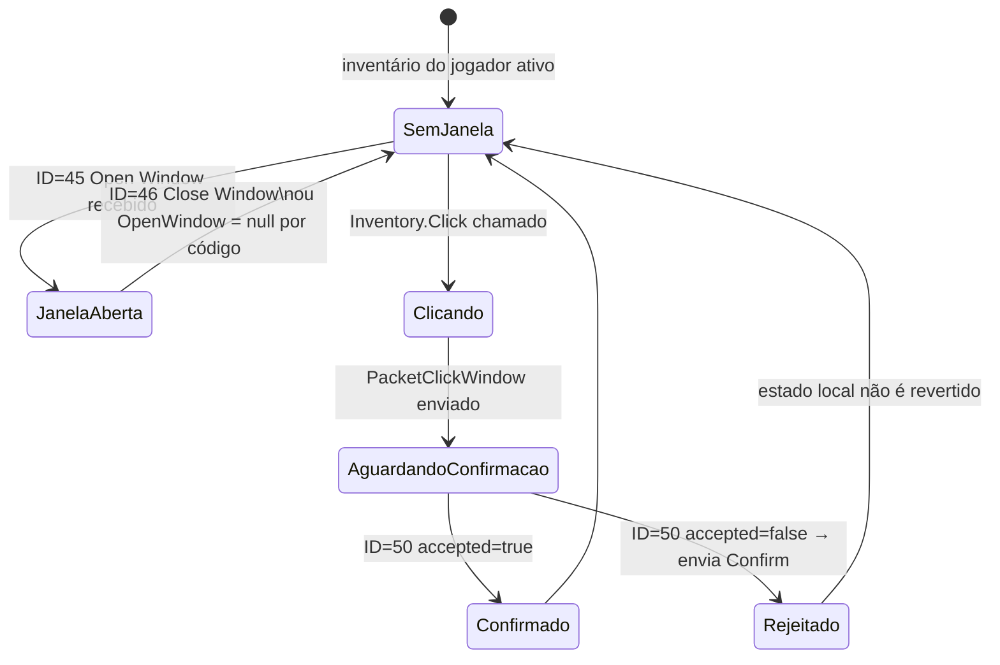
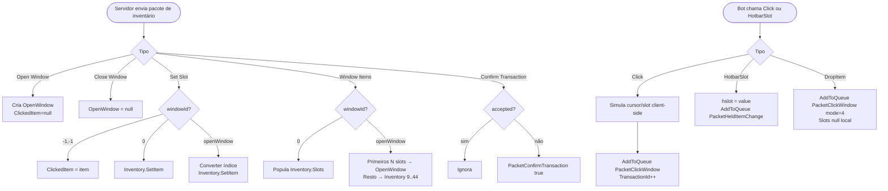
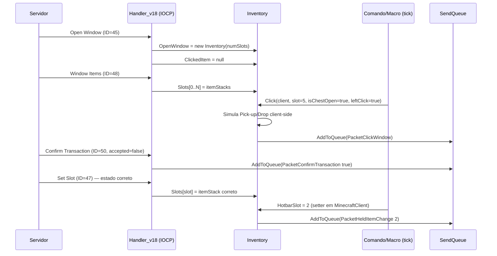
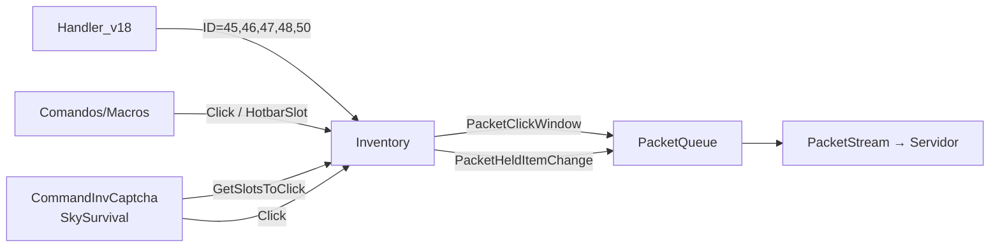

# Fluxo 06 — Inventário e Janelas

## 1. Objetivo

Manter o estado local dos itens do jogador sincronizado com o servidor, e executar operações de inventário (clicar, soltar, trocar slot ativo) que o bot precisa para automações. O inventário é o meio pelo qual o bot seleciona ferramentas, equipa itens, deposita recursos e responde a captchas. Sem o inventário correto, mineração, pesca, combate e captchas falham.

A sincronização é assimétrica: o servidor é a fonte da verdade, mas o cliente calcula o estado otimisticamente (assume que o clique terá sucesso) antes da confirmação. Isso evita latência visível, mas exige rollback ou reconfirmação quando o servidor rejeita.

---

## 2. Evento Iniciador

- **Recebimento de pacote** (servidor popula/atualiza): ID=47 (Set Slot), ID=48 (Window Items), ID=45 (Open Window), ID=46 (Close Window), ID=50 (Transaction/Confirm).
- **Ação do bot**: chamada de `Inventory.Click()`, `Inventory.DropItem()`, `MinecraftClient.HotbarSlot` (setter).

---

## 3. Componentes Envolvidos

| Componente | Papel |
|---|---|
| `Handler_v18` | interpreta todos os pacotes de inventário |
| `Inventory` | mantém o estado local dos slots; executa cliques client-side |
| `ItemStack` | representa um item com ID, count, metadata e NBT |
| `MinecraftClient.Inventory` | inventário do jogador (45 slots fixos) |
| `MinecraftClient.OpenWindow` | container externo aberto, se houver |
| `PacketClickWindow` | enviado ao clicar em slot |
| `PacketCloseWindow` | enviado ao fechar container |
| `PacketHeldItemChange` | enviado ao trocar hotbar slot |
| `PacketConfirmTransaction` | enviado ao confirmar transação rejeitada |
| `SkySurvival` / `CommandInvCaptcha` | resolve captchas de inventário automaticamente |

---

## 4. Ordem Completa de Chamadas

### Recebimento e atualização do servidor

```
Handler_v18.HandlePacket:

ID=45 (Open Window):
  ├── Lê windowId, type (string), title, numSlots
  ├── OpenWindow = new Inventory(numSlots, this)
  ├── OpenWindow.WindowID = windowId
  ├── OpenWindow.Type = Inventory.GetType(type)
  ├── OpenWindow.Title = title
  └── Inventory.ClickedItem = null   ← cursor limpo ao abrir janela

ID=46 (Close Window):
  ├── [se windowId == OpenWindow.WindowID]
  │     └── OpenWindow = null
  └── [senão: descartado]

ID=47 (Set Slot):
  ├── Lê windowId, slot, itemStack
  ├── itemStack = ReadItemStack(pkt)   ← ID, count, metadata, NBT
  └── [se windowId == -1 e slot == -1]
  │     └── Inventory.ClickedItem = itemStack   ← cursor do mouse
  └── [se windowId == 0]
  │     └── Inventory.SetItem(slot, itemStack)
  └── [se windowId == OpenWindow.WindowID]
        └── [converter índice]
              Inventory.SetItem(slot - OpenWindow.NumSlots + 9, itemStack)

ID=48 (Window Items):
  ├── Lê count, itemStack[] para cada slot
  └── [se windowId == 0]
  │     └── para cada slot: Inventory.Slots[i] = itemStack[i]
  └── [se windowId == OpenWindow.WindowID]
        └── primeiros NumSlots → OpenWindow.Slots
            restantes → Inventory.Slots[9..44]

ID=50 (Transaction / Confirm):
  ├── Lê windowId, actionNumber, accepted
  └── [se !accepted]
        └── PacketConfirmTransaction(windowId, actionNumber, accepted=true)
```

### Clique pelo bot

```
Inventory.Click(client, slot, isChestOpen, leftClick, shift):
  ├── [simula o estado do cursor e do slot — ver 07-Inventario/README.md]
  ├── [se isChestOpen] slot -= 9
  ├── numOpenSlots = [se janela aberta e Inventory próprio] OpenWindow.NumSlots else 0
  └── SendQueue.AddToQueue(PacketClickWindow(
        windowId, slot + numOpenSlots,
        button = leftClick?0:1,
        ++TransactionId, mode = shift?1:0,
        clickedItem))
```

### Troca de hotbar

```
MinecraftClient.HotbarSlot = value:
  ├── [se value < 0 ou > 8] descarta
  ├── hslot = value
  └── [se IsBeingTicked]
        └── SendQueue.AddToQueue(PacketHeldItemChange(value))
```

---

## 5. Estados Percorridos



---

## 6. Threads Envolvidas

| Thread | Ação |
|---|---|
| IOCP (callback de rede) | atualiza `Inventory.Slots`, cria/fecha `OpenWindow` |
| Thread UI (tick) | comandos leem `Inventory.Slots` e chamam `Click()` |
| Thread UI | `HotbarSlot` setter chamado por comandos |

**Risco:** `Inventory.Slots` é escrito pelo IOCP (ID=48) e lido por comandos no tick sem lock.

---

## 7. Eventos Publicados

| Evento | Quando |
|---|---|
| `PacketClickWindow` | ao clicar em slot |
| `PacketHeldItemChange` | ao trocar hotbar slot |
| `PacketConfirmTransaction` | ao receber rejeição de clique |
| `PacketCloseWindow` | ao fechar container (opcional, por código) |

---

## 8. Eventos Consumidos

| Pacote | ID 1.8 | Efeito |
|---|---|---|
| Open Window | 0x2D | cria `OpenWindow` |
| Close Window | 0x2E | fecha `OpenWindow` |
| Set Slot | 0x2F | atualiza slot individual |
| Window Items | 0x30 | substitui todos os slots |
| Confirm Transaction | 0x32 | confirma ou rejeita clique |

---

## 9. Objetos Modificados

| Objeto | Campo | Quando |
|---|---|---|
| `MinecraftClient` | `OpenWindow` | Open/Close Window |
| `Inventory` | `Slots[]` | Set Slot, Window Items |
| `Inventory` | `TransactionId` | incrementado a cada Click |
| `Inventory` | `ClickedItem` (estático) | Open Window (null) e durante Click |
| `MinecraftClient` | `hslot` | HotbarSlot setter |

---

## 10. Estruturas Compartilhadas

| Estrutura | Risco |
|---|---|
| `Inventory.ClickedItem` (estático) | compartilhado entre todas as sessões — bug crítico em multi-sessão |
| `Inventory.Slots[]` | escrito por IOCP; lido no tick — sem lock |
| `OpenWindow` | escrito por IOCP; lido por comandos — sem lock |

---

## 11. Possíveis Falhas

| Situação | Comportamento |
|---|---|
| `Slots[slot]` null ao clicar | `Click()` silencia `NullReferenceException` via `catch(Exception)` |
| Clique rejeitado (ID=50 false) | estado local não revertido; envia confirmação positiva |
| `ClickedItem` contaminado por outra sessão | cursor errado; cliques subsequentes corrompem o estado |
| Slot inválido em `SetItem` | `SetItem` verifica `slot < NumSlots`; fora do range descarta |
| Janela fechada enquanto Click pendente | `TransactionId` segue incrementando; resposta do servidor é descartada |

---

## 12. Recuperação de Erro

- **Clique rejeitado:** envia `PacketConfirmTransaction(windowId, action, true)` — aceita o que o servidor diz, mas não reverte o estado local. O servidor enviará `Set Slot` correto na sequência.
- **Estado inconsistente:** o servidor pode enviar `Window Items` a qualquer momento para forçar ressincronização.
- **`catch(Exception)`** em `Click()` silencia todas as exceções — nenhuma propagação.

---

## 13. Fluxograma



---

## 14. Diagrama de Sequência



---

## 15. Regras de Negócio

1. **Slot do jogador começa em 9** — ao combinar inventário do jogador com container externo, os primeiros `NumSlots` pertencem ao container; o inventário do jogador começa no índice 9 da visão combinada.
2. **Hotbar = slots 36–44 do inventário** — `ItemInHand = Inventory.Slots[36 + HotbarSlot]`.
3. **`ClickedItem` é cursor compartilhado estaticamente** — bug arquitetural; em multi-sessão, o cursor de uma sessão afeta a outra.
4. **Slot -1/-1 (windowId=-1, slot=-1) define o cursor** — é o mecanismo do servidor para forçar o item no cursor do cliente.
5. **`TransactionId` incrementa por clique, nunca decresce** — o servidor correlaciona resposta com ID.
6. **Estado local não é revertido em rejeição** — o cliente confia no próximo `Set Slot` do servidor para corrigir.
7. **`Click()` silencia todas as exceções** — nunca propaga para o comando chamador.
8. **Drop: `PacketClickWindow(windowId, slot, button=1, ++id, mode=4, null)`** — modo 4 + button 1 = drop single item.

---

## 16. Dependências entre Módulos



---

## 17. Impacto para Migração Java

| Aspecto | Comportamento C# | Recomendação Java |
|---|---|---|
| `ClickedItem` estático | compartilhado por todas as sessões | campo de instância em `Inventory` por sessão |
| `Click()` silencia exceção | `catch(Exception){}` | retornar `Optional<ClickResult>` |
| Rollback de rejeição | sem rollback | armazenar snapshot antes do clique; reverter se ID=50 false |
| Índice de slot combinado | `slot - OpenWindow.NumSlots + 9` | `SlotMapper` separado |
| `TransactionId` | `short` que pode transbordar | `AtomicInteger` por janela |
| `ItemStack.Copy()` | shallow copy (NBT não clonado) | deep copy obrigatório |
| `Inventory.Slots` sem lock | IOCP escreve, tick lê | executor serial elimina necessidade de lock |

**Invariante crítica:** a conversão de índice de slot `slot - NumSlots + 9` é parte do protocolo Minecraft e deve ser preservada exatamente para todas as versões que o bot suporta.

---

## Classes participantes

`Handler_v18`, `Inventory`, `ItemStack`, `InventoryType`, `MinecraftClient`, `PacketQueue`, `PacketClickWindow`, `PacketCloseWindow`, `PacketHeldItemChange`, `PacketConfirmTransaction`, `ReadBuffer`, `SkySurvival`, `CommandInvCaptcha`, `CommandMiner`, `CommandPesca`, `CommandDropAll`.
