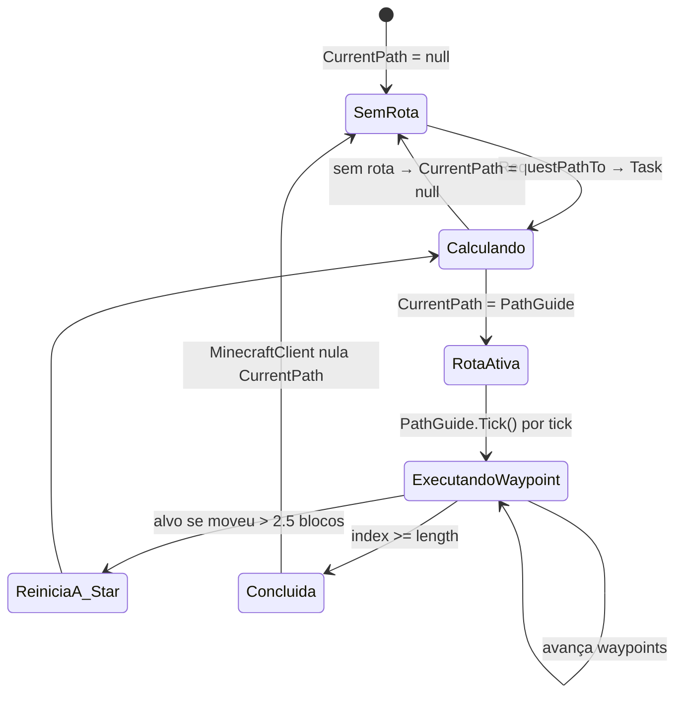
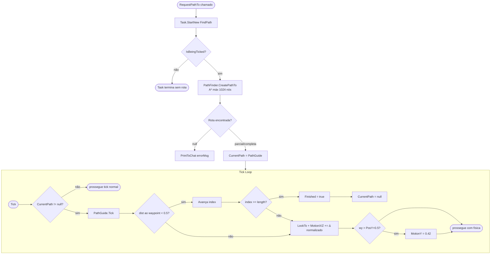
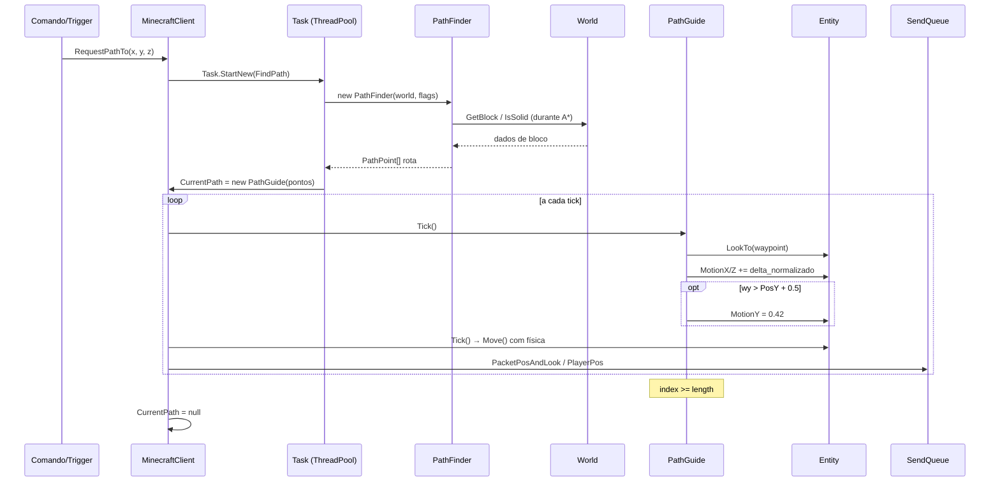
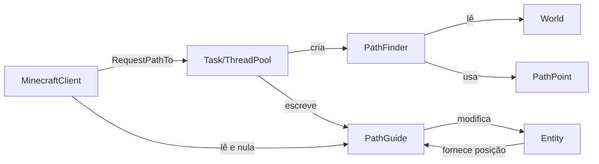

# Fluxo 07 — Pathfinding e Execução de Rota

## 1. Objetivo

Calcular um caminho navegável entre a posição atual do bot e um destino e executar esse caminho tick a tick, movendo o bot de forma autônoma pelo terreno. O pathfinding existe porque a movimentação manual (enfileirar inputs direcionais) não consegue navegar obstáculos complexos — o algoritmo A* encontra automaticamente como contornar blocos, subir escadas, pular lacunas e nadar.

O fluxo é dividido em duas fases: **cálculo** (offline, em Task separada) e **execução** (online, integrada ao tick de física).

---

## 2. Evento Iniciador

Chamada de `MinecraftClient.RequestPathTo(x, y, z, errorMsg)`:
- Por `CommandGoto`, `CommandFollow`, `CommandPortal`
- Por `MinecraftClient.Tick()` ao detectar portal (bloco 90)
- Por macros que precisam de navegação

---

## 3. Componentes Envolvidos

| Componente | Papel |
|---|---|
| `MinecraftClient.RequestPathTo` | inicia o cálculo assíncrono |
| `PathGuide` | encapsula rota e executa waypoints no tick |
| `PathFinder` | implementa A* sobre o mapa local |
| `PathPoint` | nó do grafo A* com custo e pai |
| `World` | fornece `GetBlock`, `IsSolid`, `GetCollisionBoxes` ao pathfinder |
| `Entity` (Player) | fornece posição atual e recebe inputs de movimento |
| `MinecraftClient.CurrentPath` | referência à rota ativa; escrita pela Task, lida pelo tick |
| `CommandManagerNew.Tick()` | tick dos comandos corre antes de `PathGuide.Tick()` |

---

## 4. Ordem Completa de Chamadas

### Fase 1: Cálculo (assíncrono)

```
RequestPathTo(x, y, z, errorMsg)
  └── Task.Factory.StartNew(FindPath, new WC{x,y,z,errorMsg})
        └── FindPath(object wc_obj)
              ├── wc = (WC)wc_obj
              ├── [se !IsBeingTicked()] return
              ├── path = PathGuide.Create(Player, wc.x, wc.y, wc.z)
              │     └── world.CreatePathTo(
              │           from=Player, x, y, z,
              │           maxDistance=80,
              │           allowWoodenDoor=false,
              │           movementBlockAllowed=false,
              │           pathInWater=false,
              │           canDrown=false)
              │           ├── DistTo > maxDist+8? → return null
              │           └── new PathFinder(world, ...).CreatePathTo(from, x+0.5, y+0.5, z+0.5, maxDist)
              │                 └── A* sobre PathPoints
              └── [se path == null] PrintToChat(wc.errorMsg ou mensagem padrão)
              └── [senão] CurrentPath = path    ← escrita concorrente com tick
```

### Fase 2: Execução (síncrona no tick)

```
MinecraftClient.Tick() → [se CurrentPath != null]
  └── CurrentPath.Tick()
        ├── [se Finished()] → (o MinecraftClient nulará após retorno)
        ├── Calcula waypoint atual: path[index]
        ├── Distância horizontal ao waypoint: √((PosX-wx)²+(PosZ-wz)²)
        ├── [se dist < 0.5] avança index
        ├── [se index >= path.length] Finished = true; return
        ├── LookTo(wx, wy, wz)      ← rotação do player
        ├── [se wy > PosY + 0.5]   MotionY = 0.42 (pulo)
        ├── Δx = wx - PosX; Δz = wz - PosZ
        ├── Normaliza (Δx, Δz)
        └── MotionX += Δx × speed; MotionZ += Δz × speed
              ← não usa MoveQueue; modifica diretamente MotionX/Z
```

### Algoritmo A* interno (`PathFinder.CreatePathTo`)

```
PathFinder.CreatePathTo(from, tx, ty, tz, maxDist):
  ├── openSet = PriorityQueue<PathPoint> por f = g + h
  ├── Start = PathPoint(Floor(from.X), Floor(from.AABB.MinY), Floor(from.Z))
  ├── openSet.Add(Start, h(Start, target))
  ├── loop (máximo 1024 pontos explorados):
  │     ├── current = openSet.Poll()
  │     ├── [se current == target] reconstruir caminho → return
  │     ├── para cada vizinho (6 direções + diagonais):
  │     │     ├── [se bloqueado] skip
  │     │     ├── newG = current.g + custo(current, vizinho)
  │     │     ├── [se vizinho já no open com g menor] skip
  │     │     └── openSet.Add(vizinho, newG + h(vizinho, target))
  │     └── [se openSet vazio] return null
  └── [se > maxDist do ponto atual] return caminho parcial
```

**Heurística:** distância euclidiana `√(Δx²+Δy²+Δz²)` ao alvo.

**Classificação de nós:**
- `isBlocked(x,y,z)`: bloco em (x,y) sólido OU bloco em (x,y+1) sólido → bloqueado para pedestres.
- Especiais: água, porta de madeira (allowWoodenDoor), movimento em bloco (movementBlockAllowed).
- Pulo: wy = current.y + 1 é explorado se o bloco em (x, current.y+2) não é sólido.
- Queda: wy = current.y - 1 até o chão (até 3 blocos).

---

## 5. Estados Percorridos



---

## 6. Threads Envolvidas

| Thread | Ação |
|---|---|
| Thread UI (tick) | lê `CurrentPath.Tick()`, escreve `CurrentPath = null` |
| Task (ThreadPool worker) | executa `PathFinder.A*`, escreve `CurrentPath` |
| IOCP (callback de rede) | pode atualizar `World.Chunks` enquanto A* lê |

**Risco crítico:** `CurrentPath` é escrita pela Task e lida/nullada pelo tick **sem lock nem `volatile`**. Uma Task pode sobrescrever uma rota em execução. O A* lê `World.Chunks` enquanto o handler de rede pode escrever — o mapa pode ser inconsistente durante o cálculo.

---

## 7. Eventos Publicados

| Ação | Evento gerado |
|---|---|
| `PathGuide.Tick()` modifica MotionX/Z | posição muda → `PacketPlayerPos` no tick |
| `PathGuide.Tick()` força pulo | `MotionY = 0.42` → `OnGround=false` no próximo tick |
| `PathGuide.Tick()` chama `LookTo` | `IsRotationChanged=true` → `PacketPlayerLook` |

---

## 8. Eventos Consumidos

| Fonte | Efeito no pathfinding |
|---|---|
| `World.SetChunk` | novos chunks expandem o mapa disponível para A* |
| `World.OnBlockChange` | não é consumido pelo pathfinder — ele usa snapshot do mapa |
| `Entity.PosX/Y/Z` | posição atual do bot, lida pelo `PathGuide` a cada tick |

---

## 9. Objetos Modificados

| Objeto | Campo | Quando |
|---|---|---|
| `MinecraftClient` | `CurrentPath` | Task ao concluir A*; tick ao finalizar rota |
| `Entity` | `MotionX/Z` | `PathGuide.Tick()` diretamente |
| `Entity` | `MotionY` | `PathGuide.Tick()` ao forçar pulo |
| `Entity` | `Yaw/Pitch` | `PathGuide.Tick()` → `LookTo()` |

---

## 10. Estruturas Compartilhadas

| Estrutura | Acesso concorrente |
|---|---|
| `CurrentPath` | Task escreve; tick lê e nula — sem lock |
| `World.Chunks` | Task (A*) lê; IOCP escreve — sem lock nas leituras do A* |
| `Entity.PosX/Y/Z` | lido pela Task ao iniciar; escrito pelo tick — snapshot desatualizado possível |

---

## 11. Possíveis Falhas

| Situação | Comportamento |
|---|---|
| Alvo > 88 blocos de distância | `CreatePathTo` retorna null → `PrintToChat(errorMsg)` |
| Limite de 1024 nós atingido | retorna rota parcial até o nó mais próximo do alvo |
| Mapa incompleto (chunks não carregados) | A* trata blocos ausentes como ar — pode calcular rota inválida |
| `CurrentPath` sobrescrito por nova Task | rota anterior perdida silenciosamente |
| `RequestPathTo` chamado enquanto bot está em queda | A* usa posição atual, que pode ser no ar |
| Waypoint inacessível (terreno mudou) | bot fica preso tentando alcançar waypoint; sem timeout por waypoint |

---

## 12. Recuperação de Erro

- Rota null: `PrintToChat(errorMsg)` + `CurrentPath` permanece null.
- Rota parcial: `PathGuide` chega ao fim do array parcial e marca `Finished=true` — o tick nula e o bot para.
- Sem timeout por waypoint: se o bot trava (stuck), o pathfinder não detecta — o `CommandFollow` tem sua própria lógica de re-requestPath quando o alvo se move.
- `CommandMob`/`CommandFollow` re-invocam `RequestPathTo` quando necessário.

---

## 13. Fluxograma



---

## 14. Diagrama de Sequência



---

## 15. Regras de Negócio

1. **Distância máxima de rota: 80 blocos** — `maxDistance=80` hardcoded em `World.CreatePathTo`. Alvos além de 88 blocos (80+8 de tolerância) são rejeitados.
2. **Limite de A*: 1024 nós explorados** — evita travamento do sistema por mapas complexos. Acima do limite, retorna rota parcial ao ponto mais próximo.
3. **Waypoint avançado com dist < 0.5 horizontal** — apenas as componentes X/Z são verificadas; Y é controlado pelo pulo forçado.
4. **Pulo forçado quando waypoint está 0.5 blocos acima** — `MotionY = 0.42` é a velocidade de pulo do Minecraft.
5. **MotionX/Z modificado diretamente** — PathGuide não usa `MoveQueue`; impõe velocidade diretamente, sobrescrevendo outros comandos que usem `MotionX/Z`.
6. **Sem timeout de waypoint** — bot pode travar indefinidamente num waypoint inacessível.
7. **A* usa snapshot implícito do mundo** — o mapa pode mudar durante o cálculo; a rota pode se tornar inválida antes de ser executada.
8. **`CommandFollow` re-requisita rota quando alvo se move ≥ 2.5 blocos** — evita seguir rota desatualizada.

---

## 16. Dependências entre Módulos



---

## 17. Impacto para Migração Java

| Aspecto | Comportamento C# | Recomendação Java |
|---|---|---|
| Cálculo assíncrono | `Task.Factory.StartNew` | `CompletableFuture.supplyAsync()` |
| `CurrentPath` sem lock | race Task × tick | `AtomicReference<PathGuide>` |
| Limite de nós | 1024 hardcoded | configurável por sessão |
| Distância máxima | 80 blocos hardcoded | configurável |
| Pulo MotionY | 0.42 hardcoded | constante `JUMP_VELOCITY = 0.42` |
| A* lê mundo sem lock | snapshot potencialmente stale | `WorldView` com `ReadLock` durante cálculo |
| PathGuide escreve Motion diretamente | sem coordenação com outros comandos | porta `MovementController` que resolve conflitos |
| Sem timeout de waypoint | bot trava | timeout configurável por waypoint + re-request |

**Invariantes críticas:**
- `MotionY = 0.42` para salto — não ajustar.
- Verificação de waypoint por dist horizontal < 0.5 — mantém o mesmo comportamento.
- Re-request ao concluir (Finished=true) é responsabilidade do chamador (`CommandFollow`), não do `PathGuide`.

---

## Classes participantes

`MinecraftClient`, `PathGuide`, `PathFinder`, `PathPoint`, `World`, `Entity`, `AABB`, `BlockUtils`, `Blocks`, `Vec3d`, `Vec3i`, `CommandGoto`, `CommandFollow`, `CommandPortal`, `PacketQueue`, `PacketPlayerPos`, `PacketPlayerLook`, `PacketPosAndLook`.
