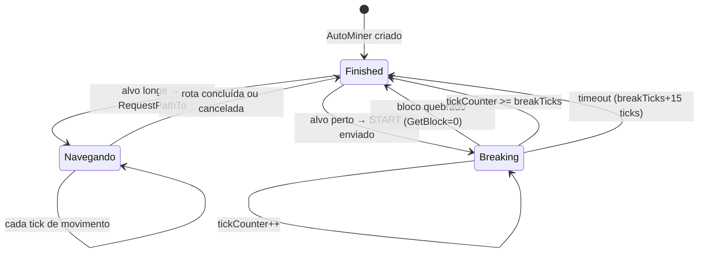
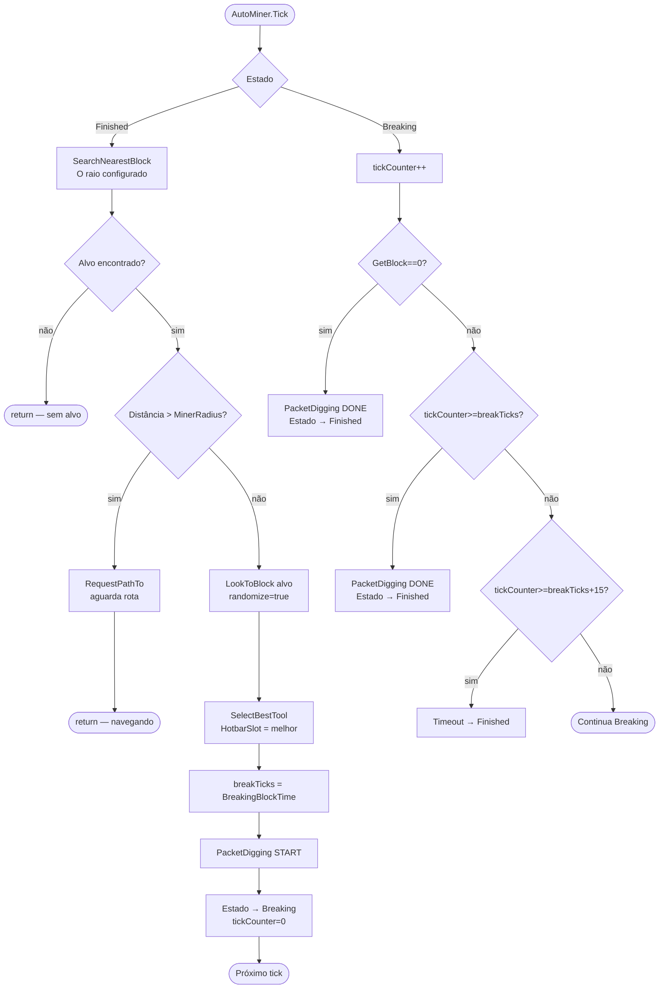
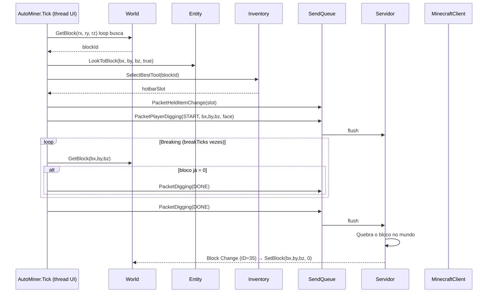
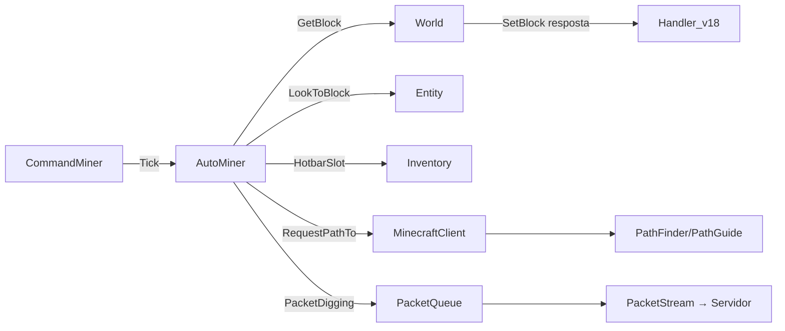

# Fluxo 08 — Mineração Automática (AutoMiner)

## 1. Objetivo

Localizar blocos de interesse no mundo local, navegar até eles, quebrá-los com a ferramenta correta e repetir o ciclo. A mineração automática é a principal forma de o bot coletar recursos sem intervenção do operador. O fluxo inclui seleção de ferramenta, temporização de quebra, gerenciamento de postura (sneaking na borda) e detecção de conclusão.

O motivo pelo qual a física de quebra de bloco é simulada client-side é que o servidor espera o `PacketPlayerDigging(DONE)` apenas quando o tempo de mineração real tiver decorrido. Enviar `DONE` muito cedo resulta em blocos que não quebram.

---

## 2. Evento Iniciador

`CommandMiner` togglado com `$miner on` (ou aliases). A cada tick, `CommandMiner.Tick()` delega para `AutoMiner.Tick()`.

---

## 3. Componentes Envolvidos

| Componente | Papel |
|---|---|
| `CommandMiner` | command wrapper; toggle on/off |
| `AutoMiner` | lógica principal de mineração; máquina de estados |
| `AutoMiner.SearchNearestBlock()` | varre o mundo em cubo MinerRadius para encontrar o bloco mais próximo |
| `World` | fornece `GetBlock`, `GetData` |
| `Entity` (Player) | fornece posição atual; recebe `LookToBlock` |
| `PathGuide` / `RequestPathTo` | navega até o bloco alvo |
| `Inventory` | seleciona a melhor ferramenta para o bloco |
| `PacketPlayerDigging` | inicia e conclui quebra de bloco |
| `PacketBlockPlace` | necessário para alguns servidores que exigem o "swing" |
| `BreakingBlockTime` | calcula o tempo de quebra em ticks com base em item e bloco |

---

## 4. Ordem Completa de Chamadas

```
CommandMiner.Tick() → [se toggled]
  └── AutoMiner.Tick()
        ├── [Estado: Finished]
        │     ├── SearchNearestBlock() → (bx, by, bz) ou null
        │     ├── [se null] return (sem alvo)
        │     ├── [se distância > MinerRadius] RequestPathTo(bx, by, bz)
        │     │     └── [enquanto navega] return (aguarda chegar)
        │     ├── LookToBlock(bx, by, bz, randomize=true)
        │     ├── SelectBestTool(GetBlock(bx,by,bz))
        │     │     └── itera hotbar 0–8, calcula ToolStrengthVsBlock
        │     │           └── considera Efficiency, Silk Touch, Fortune
        │     │           └── HotbarSlot = melhor ferramenta
        │     ├── breakTicks = BreakingBlockTime.GetTime(block, item, onGround)
        │     ├── AddToQueue(PacketPlayerDigging(START, bx, by, bz, face))
        │     ├── Estado → Breaking
        │     └── tickCounter = 0
        │
        └── [Estado: Breaking]
              ├── tickCounter++
              ├── [se GetBlock(bx,by,bz) == 0] → bloco já quebrado externamente
              │     ├── AddToQueue(PacketPlayerDigging(DONE, bx, by, bz, face))
              │     └── Estado → Finished
              ├── [se tickCounter >= breakTicks]
              │     ├── AddToQueue(PacketPlayerDigging(DONE, bx, by, bz, face))
              │     └── Estado → Finished
              └── [se tickCounter >= breakTicks + 15 ticks sem mudar]
                    └── timeout → Estado → Finished (bloco inquebrável/erro)
```

### `SearchNearestBlock()`

```
para ry in [-MinerRadius..+MinerRadius]:
  para rz in [-MinerRadius..+MinerRadius]:
    para rx in [-MinerRadius..+MinerRadius]:
      x = Floor(PosX) + rx; y = Floor(PosY) + ry; z = Floor(PosZ) + rz
      [se GetBlock(x,y,z) está na lista TargetBlocks]
      [e DistTo(x,y,z) < minDist]
        → candidato mais próximo
return candidato mais próximo ou null
```

**Complexidade:** O(MinerRadius³) por tick no estado `Finished`. Para `MinerRadius=5`, isso são 1331 chamadas de `GetBlock` por tick.

---

## 5. Estados da Máquina



---

## 6. Threads Envolvidas

| Thread | Ação |
|---|---|
| Thread UI (tick) | `AutoMiner.Tick()`, `SearchNearestBlock()`, envio de pacotes |
| Task (ThreadPool) | `RequestPathTo` → `PathFinder.A*` |
| IOCP (callback de rede) | `World.SetBlock` ao bloco ser quebrado (resposta do servidor) |

---

## 7. Eventos Publicados

| Pacote / Ação | Quando |
|---|---|
| `PacketPlayerDigging(START, x, y, z, face)` | ao iniciar quebra |
| `PacketPlayerDigging(DONE, x, y, z, face)` | ao concluir quebra |
| `PacketHeldItemChange(slot)` | ao selecionar ferramenta |
| Rotação via `LookToBlock` | IsRotationChanged=true → PacketPlayerLook |

---

## 8. Eventos Consumidos

| Evento | Fonte | Efeito |
|---|---|---|
| Bloco se torna 0 | `World.GetBlock(bx,by,bz)` | concluir Breaking cedo |
| Chunk carregado | `World.SetChunk` | expande espaço de busca |
| `CommandMiner` desabilitado | `$miner off` | AutoMiner para de tickar |

---

## 9. Objetos Modificados

| Objeto | Campo | Quando |
|---|---|---|
| `AutoMiner` | `state` | transições de estado |
| `AutoMiner` | `targetX/Y/Z` | ao encontrar alvo |
| `AutoMiner` | `tickCounter` | incrementado em Breaking |
| `AutoMiner` | `breakTicks` | calculado ao iniciar Breaking |
| `Entity` | `Yaw/Pitch` | `LookToBlock` |
| `MinecraftClient` | `HotbarSlot` | seleção de ferramenta |
| `PacketQueue` | fila | pacotes de digging |

---

## 10. Estruturas Compartilhadas

| Estrutura | Risco |
|---|---|
| `World.Chunks` | `SearchNearestBlock` lê sem lock; handler escreve durante busca |
| `Inventory.Slots` | lido para seleção de ferramenta; escrito por handler de inventário |
| `MinecraftClient.CurrentPath` | AutoMiner solicita rota; outros comandos podem sobrescrever |

---

## 11. Possíveis Falhas

| Situação | Comportamento |
|---|---|
| Bloco não quebra no tempo esperado | timeout em breakTicks+15 → volta a Finished |
| Ferramenta errada selecionada | tempo de quebra maior; server pode rejeitar |
| Bloco bloqueado por outro jogador | bloco nunca vai a 0; timeout |
| `SearchNearestBlock` retorna bloco inacessível | pathfinder não acha rota → PrintToChat → Finished |
| MinerRadius muito grande | O(MinerRadius³) causa lentidão no tick |
| `TargetBlocks` vazia | `SearchNearestBlock` retorna null; AutoMiner fica parado |

---

## 12. Recuperação de Erro

- Timeout em Breaking → estado Finished → nova busca no próximo tick.
- Sem rota encontrada → PrintToChat + Finished.
- Bloco quebrado externamente → detectado por `GetBlock=0` → conclui antecipadamente.
- Sem captura de exceção em `AutoMiner.Tick()` — exceção propaga para o tick do cliente.

---

## 13. Fluxograma



---

## 14. Diagrama de Sequência



---

## 15. Regras de Negócio

1. **Ferramenta selecionada pelo maior `ToolStrengthVsBlock`** — leva em conta Efficiency e tipo de bloco; não considera durabilidade restante.
2. **`PacketPlayerDigging(START)` antes de esperar** — o servidor inicia animação de quebra ao receber START; o cliente espera `breakTicks` antes de enviar DONE.
3. **Timeout de 15 ticks extras** — margem de latência; sem isso, latência alta causaria falha de quebra.
4. **Face do bloco hardcoded como "cima" (face=1)** — simplificação; servidores rigorosos podem rejeitar face errada.
5. **`LookToBlock(randomize=true)`** — adiciona ruído ao olhar para simular comportamento humano.
6. **Blocos na lista `TargetBlocks` são configuráveis** — o operador define quais blocos minerar via opções.
7. **`SearchNearestBlock` varre em espiral implícita por rx,ry,rz** — o primeiro encontrado na ordem é o alvo; não é necessariamente o mais próximo em distância real, mas o mais próximo em norma ∞ (raio cúbico).

---

## 16. Dependências entre Módulos



---

## 17. Impacto para Migração Java

| Aspecto | Comportamento C# | Recomendação Java |
|---|---|---|
| `SearchNearestBlock` O(R³) | loop triplicado por tick | cache de candidatos com `Set<BlockPos>` atualizado por `OnBlockChange` |
| Timeout fixo +15 ticks | sem configuração | `breakTimeoutTicks` configurável |
| Face hardcoded | sempre face=1 | calcular face a partir da direção do olhar |
| Ferramenta sem durabilidade | sem verificar durabilidade restante | verificar `ItemStack.getMaxDamage()` |
| `BreakingBlockTime` estático | tabela de blocos 1.8 | por versão + configurável |
| Estado como enum | campo `string state` implícito | `enum MinerState { FINISHED, NAVIGATING, BREAKING }` |
| Timeout sem distinção de causa | mesmo código para timeout e sucesso | eventos distintos `BlockBroken` vs `BreakTimeout` |

**Invariante crítica:** `PacketPlayerDigging(DONE)` deve ser enviado **após** o tempo de quebra correto — enviar antes faz o servidor ignorar a quebra; enviar muito depois causa dessincronização visual mas o bloco quebra.

---

## Classes participantes

`CommandMiner`, `AutoMiner`, `BreakingBlockTime`, `World`, `Entity`, `Inventory`, `ItemStack`, `MinecraftClient`, `PathFinder`, `PathGuide`, `PacketQueue`, `PacketPlayerDigging`, `PacketHeldItemChange`, `BlockUtils`, `Blocks`, `Handler_v18`.
