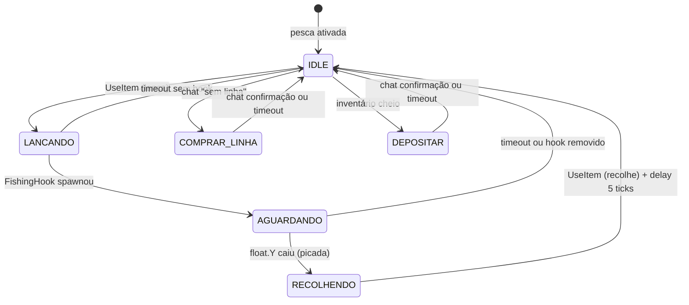
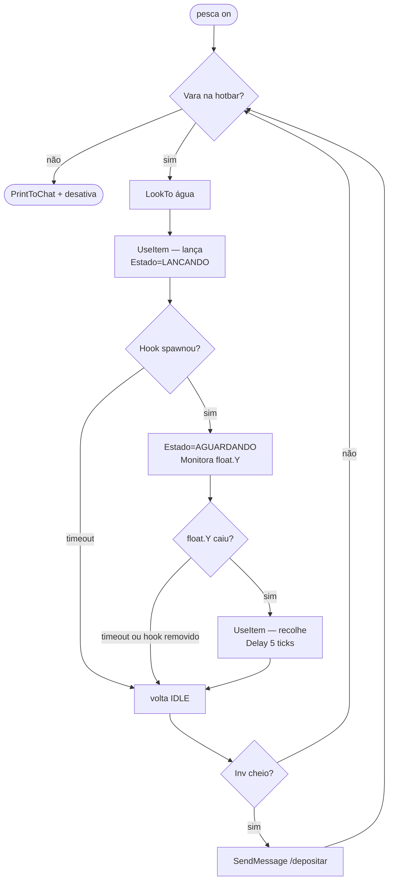
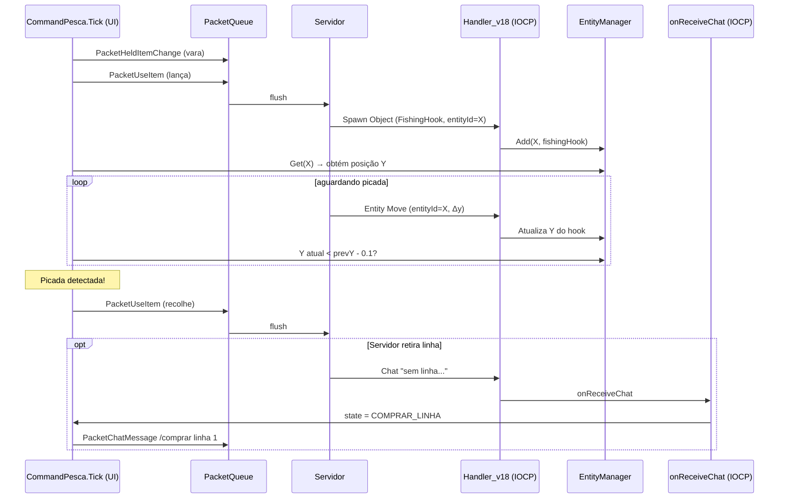
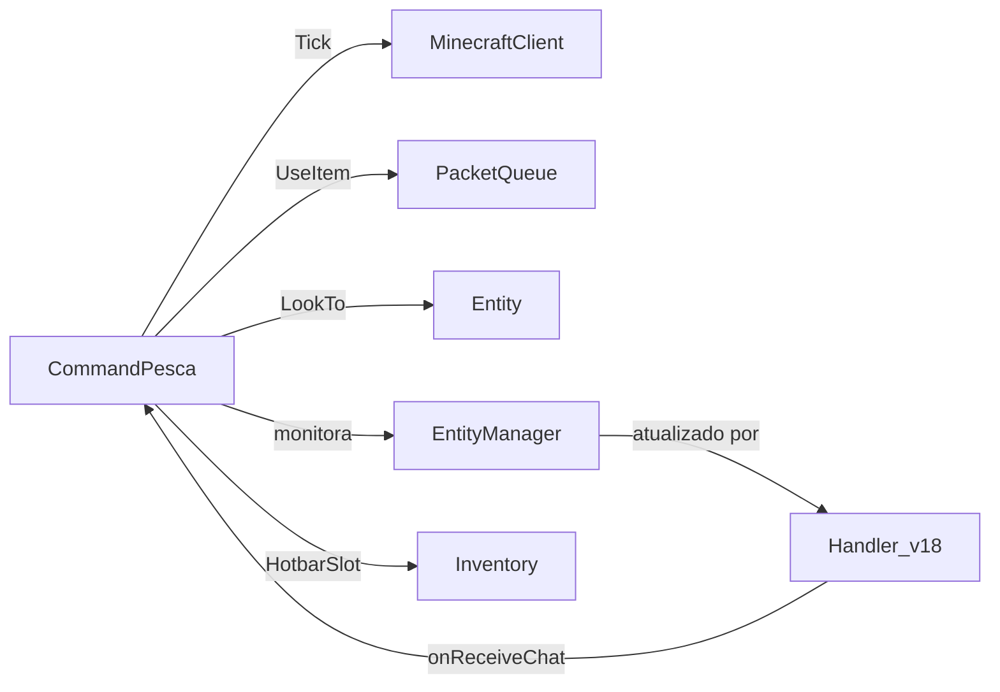

# Fluxo 09 — Pesca Automática

## 1. Objetivo

Automatizar o ciclo completo de pesca no Minecraft: lançar a vara, aguardar a picada do peixe (detectando o "float" afundando), recolher a linha e repetir. O fluxo inclui compra de linha (em servidores que exigem), recuperação de durabilidade, recolhimento de linha quando fica parado por muito tempo, e reações a mensagens de chat do servidor.

A pesca é um caso de automação orientada a eventos externos: o bot não pode simplesmente contar ticks — deve detectar uma mudança visual (float afundando) que o servidor comunica via atualização de entidade.

---

## 2. Evento Iniciador

`CommandPesca` togglado com `$pesca on`. Existem duas implementações: `CommandPesca` (original) e `CommandPescaV2` (versão revisada). Ambas seguem a mesma lógica geral mas com diferenças nos estados de recuperação.

---

## 3. Componentes Envolvidos

| Componente | Papel |
|---|---|
| `CommandPesca` / `CommandPescaV2` | máquina de estados principal; é tanto um ICommand quanto reage a chat |
| `MinecraftClient` | fornece `SendMessage`, `RequestPathTo`, `SendPacket` |
| `Inventory` | verifica presença de vara de pesca (ID=346) |
| `PacketUseItem` / `PacketBlockPlace` | lança e recolhe a vara |
| `EntityMob` / `EntityManager` | a isca (float) é uma entidade; sua posição Y é monitorada |
| `PacketPlayerDigging` | pode ser necessário em sequência de lançamento |
| `Handler_v18` | ao receber atualização de entidade, pode disparar detecção de picada |

---

## 4. Máquina de Estados e Ordem de Chamadas

```
Estados principais de CommandPesca:
  IDLE → LANCANDO → AGUARDANDO_PICADA → RECOLHENDO → IDLE
  + estados especiais: COMPRAR_LINHA, DEPOSITAR, RECUPERANDO, PARANDO

CommandPesca.Tick():
  ├── [IDLE]
  │     ├── Verifica rod (ID=346) na hotbar; se ausente → PrintToChat + Disable
  │     ├── HotbarSlot = slot da rod
  │     ├── LookTo(água configurada — yaw/pitch fixos ou detectados)
  │     ├── SendPacket(PacketUseItem)    ← lança a vara
  │     ├── floatEntityId = -1
  │     ├── waitTicks = 0
  │     └── Estado → LANCANDO
  │
  ├── [LANCANDO]
  │     ├── waitTicks++
  │     ├── [se Handler enviou entity spawn com "FishingHook"]
  │     │     └── floatEntityId = entityId; Estado → AGUARDANDO_PICADA
  │     └── [se waitTicks > 40] timeout → volta a IDLE (relança)
  │
  ├── [AGUARDANDO_PICADA]
  │     ├── waitTicks++
  │     ├── pesca.tick++
  │     ├── [se float.Y caiu abruptamente (Δy < -0.1)]
  │     │     └── Estado → RECOLHENDO
  │     ├── [se waitTicks > MaxWait (ex: 600)] timeout → IDLE
  │     └── [se entidade removida] → IDLE
  │
  └── [RECOLHENDO]
        ├── SendPacket(PacketUseItem)    ← recolhe (mesmo pacote que lança)
        ├── Aguarda 5 ticks
        └── Estado → IDLE
```

### Detecção de picada

O servidor atualiza a posição Y do float (entidade `FishingHook`) via pacote `Entity Move / Entity Look / Entity Teleport`. O handler registra a entidade em `EntityManager`. `CommandPesca` monitora:

```
float_entity = EntityManager.Get(floatEntityId)
if float_entity != null:
  if (float_entity.Y - prevY) < -0.1:    ← float afundou
    Estado → RECOLHENDO
prevY = float_entity.Y
```

### Estados especiais — `CommandPescaV2`

```
COMPRAR_LINHA:
  ├── SendMessage("/comprar linha 1")
  ├── Aguarda chat de confirmação
  └── → IDLE

DEPOSITAR:
  ├── SendMessage("/depositar peixe")
  ├── Aguarda chat ou timeout
  └── → IDLE

RECUPERANDO_VARA:
  ├── Troca para vara com mais durabilidade na hotbar/inventário
  └── → IDLE
```

---

## 5. Estados Percorridos



---

## 6. Threads Envolvidas

| Thread | Ação |
|---|---|
| Thread UI (tick) | executa `CommandPesca.Tick()` — toda a lógica |
| IOCP (callback de rede) | atualiza `EntityManager` com posição do float; dispara `onReceiveChat` |

**Risco:** `onReceiveChat` (chamado pelo IOCP) e `Tick()` (thread UI) acessam o estado da macro sem sincronização. Em `CommandPescaV2`, `onReceiveChat` modifica o estado atual; `Tick()` lê-o no mesmo instante.

---

## 7. Eventos Publicados

| Pacote | Quando |
|---|---|
| `PacketUseItem` | lança a vara (IDLE→LANCANDO) e recolhe (RECOLHENDO→IDLE) |
| `PacketHeldItemChange` | ao selecionar a hotbar com a vara |
| Rotação via `LookTo` | IsRotationChanged=true → PacketPlayerLook |

---

## 8. Eventos Consumidos

| Evento | Fonte | Efeito |
|---|---|---|
| Spawn de entidade `FishingHook` | Handler ID=15 (Spawn Object) | registra floatEntityId |
| Entity Move | Handler ID=0x15–0x18 | atualiza Y do float para detecção de picada |
| Destroy Entities | Handler ID=0x13 | float removido → volta a IDLE |
| Chat "sem linha" | `onReceiveChat` | → COMPRAR_LINHA |
| Chat "depositar" confirmação | `onReceiveChat` | → IDLE |

---

## 9. Objetos Modificados

| Objeto | Campo | Quando |
|---|---|---|
| `CommandPesca` | `state` | transições de estado |
| `CommandPesca` | `floatEntityId` | ao identificar o hook |
| `CommandPesca` | `waitTicks` / `pesca.tick` | incrementados em cada estado |
| `CommandPesca` | `prevY` | Y anterior do float |
| `EntityManager` | entidade do hook | atualizado pelo handler |
| `MinecraftClient` | `HotbarSlot` | ao selecionar vara |

---

## 10. Estruturas Compartilhadas

| Estrutura | Risco |
|---|---|
| `CommandPesca.state` | escrito por `onReceiveChat` (IOCP) e lido por `Tick()` (UI) |
| `EntityManager.mobs` | escrito por handler; lido pelo Tick da pesca |

---

## 11. Possíveis Falhas

| Situação | Comportamento |
|---|---|
| Vara sem durabilidade | lançamento falha silenciosamente; bot relança indefinidamente |
| Float não spawna | timeout em LANCANDO → IDLE → relança |
| Movimento de água impede detecção | float.Y oscila naturalmente; detecção pode ser prematura |
| Servidor destrói hook antes da picada | AGUARDANDO → IDLE → relança |
| Chat "sem linha" não detectado | pesca continua sem linha; vara gasta sem peixes |
| Inventário cheio | peixes ficam no chão (não há coleta automática) |

---

## 12. Recuperação de Erro

- Timeout em cada estado → volta a IDLE → relança.
- Chat de erro de "linha" → COMPRAR_LINHA → tenta comprar → IDLE.
- Exceção em `Tick()` não é capturada — propaga para o tick do cliente.

---

## 13. Fluxograma



---

## 14. Diagrama de Sequência



---

## 15. Regras de Negócio

1. **Mesma tecla/pacote lança e recolhe** — `PacketUseItem` com a vara na mão alterna entre lançar e recolher. Recolher enquanto há picada captura o peixe.
2. **Detecção por Δy do float** — o float do anzol afunda visivelmente quando há picada. Um Δy < -0.1 por tick é o threshold.
3. **Delay de 5 ticks entre recolher e relançar** — evita duplo lançamento acidental e dá tempo para o servidor processar a coleta.
4. **Timeout de 600 ticks (~30s) em AGUARDANDO** — tempo máximo de espera por peixe; sem peixe após isso, relança.
5. **Compra de linha via comando de chat** — específico de servidor (plugin de economia); a mensagem de ativação é detectada por texto hardcoded.
6. **Direção de olhar configurável** — o operador pode definir o ponto de lançamento; o bot olha para lá antes de lançar.

---

## 16. Dependências entre Módulos



---

## 17. Impacto para Migração Java

| Aspecto | Comportamento C# | Recomendação Java |
|---|---|---|
| Detecção de picada | Δy do float por tick | evento `EntityMoved` publicado pelo handler |
| `onReceiveChat` + `Tick` sem sync | race condition | executor serial: ambos na mesma thread |
| Estados implícitos | campo `int state` | `enum FishingState` com FSM explícita |
| Textos de chat hardcoded | strings de servidor específico | regras configuráveis por servidor |
| Timeout em ticks | variável por cadência | `Duration` em ms independente de tick |
| Delay 5 ticks entre ações | `waitTicks` contador | `ScheduledAction` cancelável |
| `PacketUseItem` lança e recolhe | mesmo pacote | idem — invariante de protocolo |

**Invariante crítica:** o mesmo pacote (`UseItem`) com a vara selecionada alterna lançamento e recolhimento. Para recolher com captura, o bot deve enviar `UseItem` **antes** que o float afunde completamente — há uma janela de tempo curta.

---

## Classes participantes

`CommandPesca`, `CommandPescaV2`, `MinecraftClient`, `EntityManager`, `EntityMob`, `Inventory`, `ItemStack`, `PacketQueue`, `PacketUseItem`, `PacketHeldItemChange`, `PacketPlayerLook`, `Handler_v18`, `Entity`.
