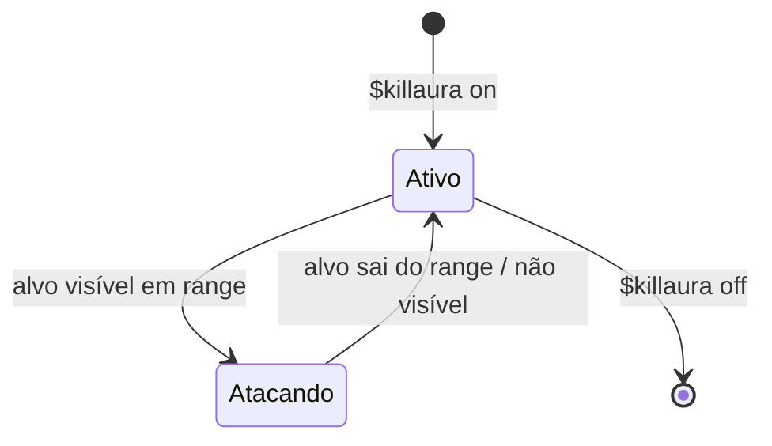
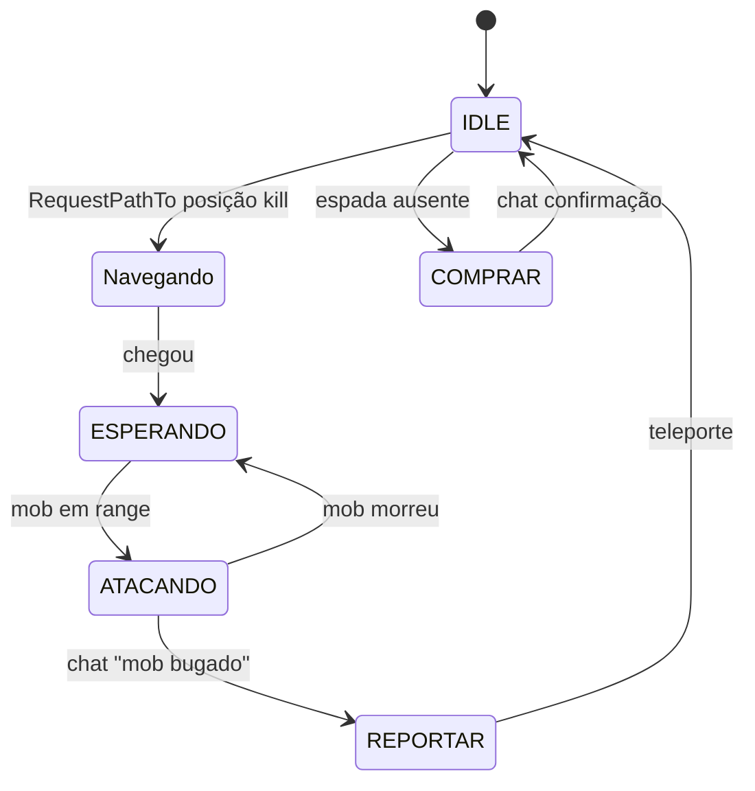
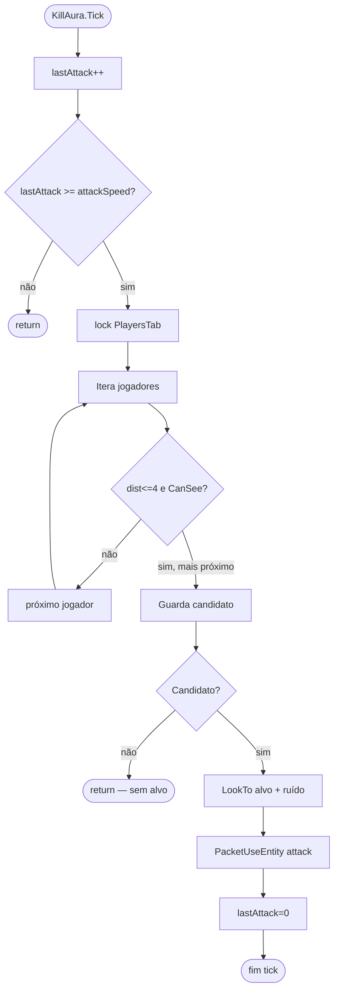
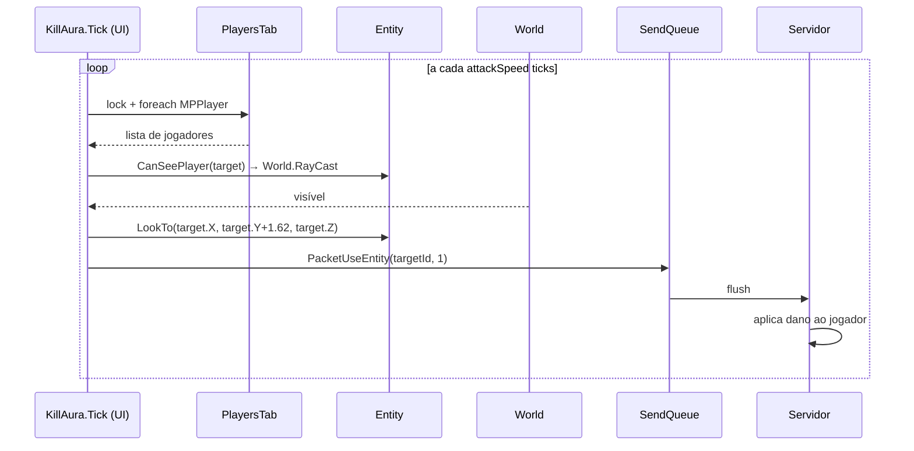
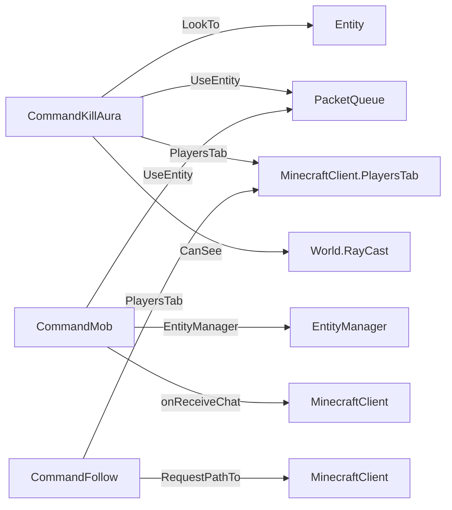

# Fluxo 10 — Combate (KillAura / Mob / Follow)

## 1. Objetivo

Atacar entidades e jogadores automaticamente no range de combate, mantendo a mira e o ritmo de ataque corretos. O fluxo também cobre o `CommandMob` (automação de mob farm) que inclui movimentação para a posição de kill, detecção por chat e teleporte.

O combate é reativo: o bot não planeja sequências, apenas seleciona o alvo mais próximo visível dentro do range e ataca a cada N ticks. O rate de ataque é configurável para simular comportamento humano.

---

## 2. Evento Iniciador

- **`CommandKillAura`**: togglado com `$killaura on` — ataca jogadores.
- **`CommandMob`**: togglado com `$mob on` — ataca mobs em mob farm.
- **`CommandFollow`**: togglado com `$follow [nick]` — segue sem atacar (mas KillAura pode atacar pelo caminho).

---

## 3. Componentes Envolvidos

| Componente | Papel |
|---|---|
| `CommandKillAura` | seleciona alvo jogador; mira; ataca |
| `CommandMob` | automação de mob farm; máquina de estados |
| `CommandFollow` | segue um jogador via pathfinding |
| `EntityManager` | fornece lista de mobs conhecidos |
| `MinecraftClient.PlayersTab` | fornece lista de jogadores conhecidos |
| `Entity` (Player) | fornece posição; recebe `LookTo` e mira |
| `PacketUseEntity` | pacote de ataque |
| `PacketEntityAction` | sprint durante combate |
| `PacketPlayerDigging` | pode ser usado para cancelar blocos |
| `World` | `RayCast` para verificar linha de visão |

---

## 4. Ordem Completa de Chamadas

### `CommandKillAura.Tick()`

```
lastAttack++
[se lastAttack < attackSpeed] return

lock(Client.PlayersTab):
  foreach MPPlayer p in PlayersTab:
    ├── [se p.Nick == próprio nick] skip
    ├── [se whitelist configurada e p.Nick não está] skip
    ├── dist = DistTo(Player.PosX, Player.PosY, Player.PosZ, p.X, p.Y, p.Z)
    ├── [se dist > 4.0] skip
    └── [se Player.CanSeePlayer(p)]
          → candidato; guarda o mais próximo

[se candidato encontrado]
  ├── Rand ruído r = [0..0.1]
  ├── Player.LookTo(p.X + r, p.Y + 1.62 + r, p.Z + r)
  ├── SendQueue.AddToQueue(PacketUseEntity(p.EntityID, 1))   ← attack
  └── lastAttack = 0
```

### `CommandMob.Tick()` — estados

```
IDLE:
  ├── Verifica espada na hotbar
  ├── Vai para posição de kill configurada (RequestPathTo)
  └── Estado → ESPERANDO_MOB

ESPERANDO_MOB:
  ├── waitTicks++
  ├── [se mob em range] → Estado → ATACANDO
  └── [se waitTicks > MaxWait] → timeout → IDLE

ATACANDO:
  ├── lastAttack++
  ├── [se lastAttack >= attackSpeed]
  │     ├── Seleciona mob mais próximo em EntityManager
  │     ├── Player.LookTo(mob.X, mob.Y, mob.Z)
  │     └── SendQueue.AddToQueue(PacketUseEntity(mob.EntityID, 1))
  ├── [se mob morreu (entity removed)] → IDLE ou ESPERANDO_MOB
  └── [se chat "mob bugado"] → REPORTAR_BUG → teleporte

REPORTAR_BUG:
  ├── SendMessage("/tp posicao")
  └── Estado → IDLE

COMPRAR_ESPADA:
  ├── SendMessage("/comprar espada")
  └── Estado → IDLE (aguarda restock)
```

### `CommandFollow.Tick()`

```
lastAttack++
[se alvo não encontrado em PlayersTab] → CurrentPath = null; return
dist = DistTo(Player, alvo)
[se dist > 80] → CurrentPath = null; return
[se alvo se moveu >= 2.5 blocos desde última rota]
  → RequestPathTo(alvo.X, alvo.Y, alvo.Z)
Player.LookTo(alvo.X, alvo.Y+1.62, alvo.Z)
```

---

## 5. Estados Percorridos

### KillAura



### CommandMob



---

## 6. Threads Envolvidas

| Thread | Ação |
|---|---|
| Thread UI (tick) | toda a lógica de combate |
| IOCP (callback de rede) | atualiza `EntityManager`, `PlayersTab`; dispara `onReceiveChat` |

**Risco:** `lock(Client.PlayersTab)` em `CommandKillAura.Tick()` — se o handler de rede tentar escrever em `PlayersTab` com outro lock, pode causar deadlock. `EntityManager` em `CommandMob` não tem lock — race com handler.

---

## 7. Eventos Publicados

| Pacote | Quando |
|---|---|
| `PacketUseEntity(entityId, 1)` | cada ataque |
| `PacketPlayerLook` | ao mirar no alvo via `LookTo` |
| `PacketEntityAction` (sprint) | se sprint ativado durante combate |

---

## 8. Eventos Consumidos

| Evento | Fonte | Efeito |
|---|---|---|
| Spawn/Destroy Entity | Handler | atualiza EntityManager |
| Player List Item | Handler | atualiza PlayersTab |
| Chat "mob bugado" | `onReceiveChat` | CommandMob → REPORTAR |
| Entity Move | Handler | atualiza posição de mobs e jogadores |

---

## 9. Objetos Modificados

| Objeto | Campo | Quando |
|---|---|---|
| `CommandKillAura` | `lastAttack` | incrementado/zerado no tick |
| `CommandMob` | `state` | transições |
| `CommandMob` | `waitTicks`, `lastAttack` | contadores |
| `Entity` | `Yaw/Pitch` | `LookTo` em cada ataque |
| `PacketQueue` | fila | `PacketUseEntity` |

---

## 10. Estruturas Compartilhadas

| Estrutura | Risco |
|---|---|
| `PlayersTab` | lock em KillAura; sem lock no handler → assimetria |
| `EntityManager.mobs` | sem lock; handler escreve, CommandMob lê |

---

## 11. Possíveis Falhas

| Situação | Comportamento |
|---|---|
| Alvo invulnerável (modo criativo) | ataque enviado mas sem efeito no servidor |
| `CanSeePlayer` bloqueado por bloco temporário | pula o alvo neste tick; tenta no próximo |
| Deadlock em `PlayersTab` | congelamento do tick — sem timeout no lock |
| EntityManager stale | mob já morto mas ainda no map → ataque a ID inválido |
| KillAura + Follow simultaneos | ambos chamam `LookTo` → última chamada vence |

---

## 12. Recuperação de Erro

- Sem alvo: KillAura não ataca neste tick; CommandMob volta a ESPERANDO.
- Mob removido: `EntityManager.Get()` retorna null → CommandMob passa para IDLE.
- Chat "mob bugado" → REPORTAR → `/tp` → IDLE.

---

## 13. Fluxograma — KillAura



---

## 14. Diagrama de Sequência — KillAura



---

## 15. Regras de Negócio

1. **Range de ataque: 4 blocos** — distância euclidiana 3D. Hardcoded; servidores com anti-cheat podem rejeitar ataques além de ~3 blocos.
2. **Verificação de linha de visão obrigatória** — `CanSeePlayer` usa `RayCast`; bloqueia ataque através de paredes.
3. **Ruído na mira** — `[0..0.1]` aleatório por componente para simular jogador humano.
4. **Rate de ataque configurável** — `attackSpeed` em ticks; padrão suficiente para não ser limitado pelo servidor (1 ataque/tick causa rate limiting em servidores com anti-cheat).
5. **KillAura ataca apenas jogadores** — não ataca mobs; isso é responsabilidade do `CommandMob`.
6. **CommandMob reage a chat** — strings de "mob bugado" são hardcoded para servidores específicos.
7. **CommandFollow não ataca** — apenas navega; ataques são responsabilidade de KillAura rodando simultaneamente.

---

## 16. Dependências entre Módulos



---

## 17. Impacto para Migração Java

| Aspecto | Comportamento C# | Recomendação Java |
|---|---|---|
| Lock em PlayersTab | `lock(PlayersTab)` no tick | executor serial elimina necessidade |
| EntityManager sem lock | race condition | `ConcurrentHashMap` ou executor serial |
| Range hardcoded 4 blocos | constante no código | configurável por sessão |
| Ruído de mira | `Random.NextDouble() × 0.1` | `ThreadLocalRandom` |
| Rate de ataque em ticks | tick-dependente | `Duration` independente de tick |
| Textos de chat hardcoded em CommandMob | strings específicas de servidor | regras configuráveis |
| KillAura e Follow simultâneos | última chamada de LookTo vence | `MovementController` com prioridades |

**Invariante crítica:** `PacketUseEntity(entityId, 1)` com `type=1` = ataque. `type=0` = interação. `type=2` = ataque com mão auxiliar (1.9+). Não trocar.

---

## Classes participantes

`CommandKillAura`, `CommandMob`, `CommandMobTeleport`, `CommandMobPlus`, `CommandFollow`, `MinecraftClient`, `Entity`, `EntityManager`, `EntityMob`, `MPPlayer`, `World`, `PacketQueue`, `PacketUseEntity`, `PacketPlayerLook`, `PacketEntityAction`, `Handler_v18`.
