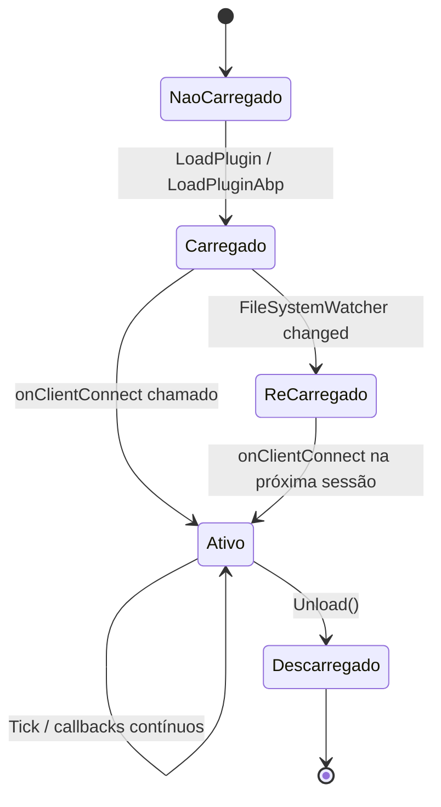
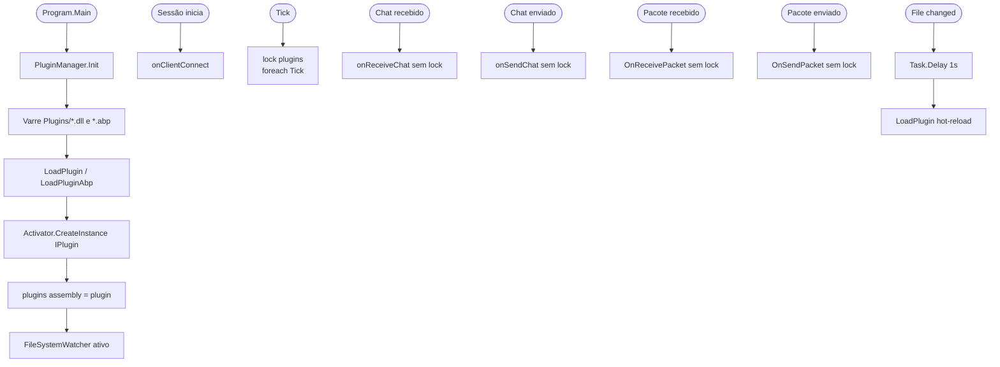
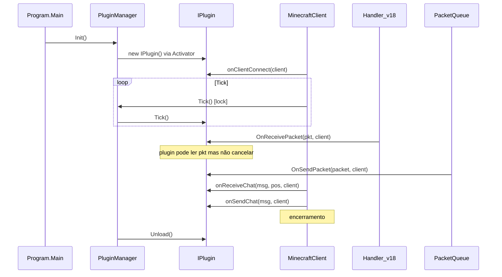
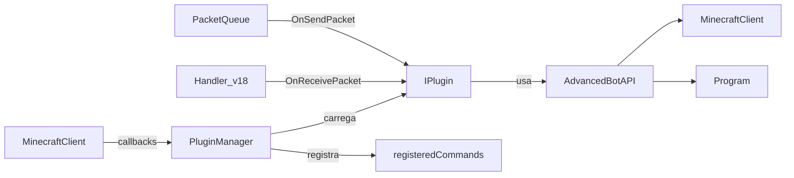

# Fluxo 11 — Plugins e Extensibilidade

## 1. Objetivo

Permitir que código externo estenda o comportamento do bot sem modificar o núcleo. Plugins observam eventos do ciclo de vida da sessão (conexão, tick, chat, pacotes) e podem registrar comandos novos. O fluxo inclui descoberta, carregamento, despacho de callbacks e hot-reload.

O sistema de plugins existe para que comportamentos específicos de servidor possam ser encapsulados externamente, separando a lógica genérica do core das adaptações de cada servidor.

---

## 2. Evento Iniciador

- **Carga inicial**: `Program.Main` chama `PluginManager.Init()` antes de qualquer sessão.
- **Hot-reload**: `FileSystemWatcher` detecta mudança em `Plugins\*.dll`.
- **Callback de runtime**: eventos do ciclo de vida da sessão disparam despacho para plugins.

---

## 3. Componentes Envolvidos

| Componente | Papel |
|---|---|
| `PluginManager` | singleton; carrega, armazena e despacha para plugins |
| `IPlugin` | contrato de plugin; define todos os callbacks |
| `AesEncryption` | desencripta arquivos `.abp` |
| `FileSystemWatcher` | monitora `Plugins\` para hot-reload |
| `MinecraftClient` | chama callbacks em momentos específicos |
| `PacketQueue` | despacha `OnSendPacket` antes de enfileirar |
| `Handler_v18` | despacha `OnReceivePacket` ao receber pacotes de play |
| `AdvancedBotAPI` | fachada de utilidade para plugins |

---

## 4. Ordem Completa de Chamadas

### Inicialização (em `Program.Main`)

```
PluginManager.Instance.Init()
  ├── [se Plugins\ não existe] → Directory.CreateDirectory → return
  ├── foreach *.dll in Plugins\
  │     └── LoadPlugin(path)
  │           ├── Assembly.Load(File.ReadAllBytes(path))
  │           ├── Percorre GetTypes()
  │           ├── [tipo implementa IPlugin]
  │           │     ├── Activator.CreateInstance(type)
  │           │     └── lock(plugins): plugins[assembly] = plugin; paths[path] = plugin
  │           └── catch: CreateErrLog + PrintToChat
  ├── foreach *.abp in Plugins\
  │     └── LoadPluginAbp(path)
  │           ├── AesEncryption.DecryptFileToByteArray(path, KEY_HARDCODED)
  │           ├── Assembly.Load(bytes)
  │           └── [mesma lógica acima]
  └── TrackFiles()
        └── new FileSystemWatcher("Plugins\", "*.dll")
              fileSystemWatcher.Changed += OnChanged
```

### Despacho de callbacks em runtime

```
MinecraftClient.StartClient():
  └── foreach plugin: plugin.onClientConnect(this)   ← sem lock

MinecraftClient.Tick():
  └── PluginManager.Instance.Tick()
        └── lock(plugins): foreach plugin: plugin.Tick()

MinecraftClient.HandlePacketChat(chat, pos):
  └── foreach plugin: plugin.onReceiveChat(chat, pos, this)   ← sem lock

MinecraftClient.SendMessage(text):
  └── foreach plugin: plugin.onSendChat(text, this)   ← sem lock

Handler_v18.HandlePacket(pkt):
  └── [antes de processar o pacote]
        foreach plugin: plugin.OnReceivePacket(pkt_copy, this)   ← sem lock

PacketQueue.AddToQueue(packet):
  └── foreach plugin: plugin.OnSendPacket(packet, this)   ← sem lock

Handler_v152.HandlePacket(id):
  └── [antes de processar]
        foreach plugin: [se plugin.OnReceivePacketV1_5(psl, id, this) == false] return
```

### Hot-reload

```
FileSystemWatcher.OnChanged(file)
  └── await Task.Delay(1000)
        └── LoadPlugin(path_base + "\Plugins\" + file.Name)
              └── [mesmo processo acima; sobrescreve plugins[assembly]]
```

### Comandos de plugin

```
PluginManager.RegisterCommand(name, delegate)
  └── registeredCommands[name] = delegate

PluginManager.DoCommand(sender, fullCmd)
  ├── Extrai alias e args
  └── [se registeredCommands.TryGetValue(alias)]
        └── value(sender, args) → bool
```

---

## 5. Estados Percorridos



---

## 6. Threads Envolvidas

| Thread | Ação |
|---|---|
| Thread UI (Main) | `Init()`, `Tick()` via `lock(plugins)` |
| IOCP (callback de rede) | `OnReceivePacket`, `onReceiveChat`, `onSendChat` — sem lock |
| ThreadPool (FileSystemWatcher) | `OnChanged` → `LoadPlugin` |
| Thread UI (tick) | `Tick()` com `lock(plugins)` |

**Risco de deadlock:** `LoadPlugin` em `OnChanged` tenta `lock(plugins)`. Se o tick estiver dentro do `lock(plugins)` e um plugin no Tick tentar interagir com o FileSystemWatcher, pode ocorrer deadlock indireto.

**Risco de race em callbacks:** `OnReceivePacket` e `onReceiveChat` são chamados sem `lock(plugins)`. Um hot-reload concorrente pode mudar `plugins` durante a iteração (invalidação de iterador).

---

## 7. Eventos Publicados

Não gera eventos; apenas despacha para plugins.

---

## 8. Eventos Consumidos

| Momento | Quem chama | Callback |
|---|---|---|
| Sessão iniciada | `StartClient` | `onClientConnect` |
| Tick | `Tick()` | `Tick()` com lock |
| Chat recebido | `HandlePacketChat` | `onReceiveChat` |
| Chat enviado | `SendMessage` | `onSendChat` |
| Pacote recebido (1.7+) | `Handler_v18/19` | `OnReceivePacket` |
| Pacote recebido (1.5.2) | `Handler_v152` | `OnReceivePacketV1_5` |
| Pacote enviado | `PacketQueue.AddToQueue` | `OnSendPacket` |
| Encerramento | `PluginManager.Unload` | `Unload()` |

---

## 9. Objetos Modificados

| Objeto | Campo | Quando |
|---|---|---|
| `PluginManager` | `plugins` | `LoadPlugin`, `Unload` |
| `PluginManager` | `paths` | `LoadPlugin` |
| `PluginManager` | `registeredCommands` | `RegisterCommand` |

---

## 10. Estruturas Compartilhadas

| Estrutura | Risco |
|---|---|
| `PluginManager.plugins` | escrito por `LoadPlugin` (FileSystemWatcher thread); lido por callbacks (sem lock) |
| `PluginManager.registeredCommands` | adicionado durante carga; lido em `DoCommand` — sem lock nas leituras |

---

## 11. Possíveis Falhas

| Situação | Comportamento |
|---|---|
| Plugin lança em qualquer callback | exceção propaga para o chamador — pode desconectar a sessão |
| Assembly corrompido | `Assembly.Load` lança → logged → ignorado |
| Chave AES errada em `.abp` | `DecryptFileToByteArray` lança → logged |
| Hot-reload enquanto tick itera plugins | `InvalidOperationException` ao iterar `Dictionary` enquanto é modificado |
| Dois plugins com mesmo `Assembly` | o segundo sobrescreve o primeiro no dicionário |

---

## 12. Recuperação de Erro

- Falha de carga: `catch(Exception)` em `LoadPlugin/LoadPluginAbp` → `CreateErrLog("pluginerr")` → continua.
- Falha em callback: sem captura no dispatcher → propaga para o chamador.
- Assemblies não são descarregados — hot-reload não libera memória do assembly anterior.

---

## 13. Fluxograma



---

## 14. Diagrama de Sequência



---

## 15. Regras de Negócio

1. **Plugins carregados antes de configuração e sessões** — `Init()` é chamado em `Program.Main` antes de qualquer `LoadConf()` ou `StartClient()`. Um plugin pode influenciar a configuração.
2. **`OnReceivePacketV1_5` pode cancelar** — retorna `bool`; `false` = não processar o pacote. Apenas para 1.5.2.
3. **Callbacks modernos não cancelam** — `void` return; plugins são apenas observadores em 1.7+.
4. **Chave AES de `.abp` é hardcoded** — `"4a32544e013f37c028cedadb2d5b7c683de3d023"` — qualquer descompilação expõe a chave.
5. **Plugins registram comandos via `RegisterCommand`** — comandos de plugin são despachos por texto de chat, não integrados ao `CommandManagerNew`.
6. **Hot-reload sem descarregamento** — assemblies .NET não são liberados; hot-reload apenas substitui a referência no dicionário.
7. **Lock assimétrico** — `Tick()` usa lock; callbacks de rede não — assimetria intencional por performance, mas causa races.

---

## 16. Dependências entre Módulos



---

## 17. Impacto para Migração Java

| Aspecto | Comportamento C# | Recomendação Java |
|---|---|---|
| Carregamento | `Assembly.Load(bytes)` | `URLClassLoader` por plugin |
| Hot-reload | sem descarregamento | `URLClassLoader.close()` + novo classloader |
| Chave AES hardcoded | `"4a32544e..."` no binário | chave por instalação, armazenada externamente |
| Callbacks sem lock | race conditions | executor serial elimina necessidade de lock |
| `OnReceivePacket` não cancela | `void` return | `EventResult` PASS/CANCEL/MODIFY |
| `IPlugin` recebe `MinecraftClient` concreto | dependência forte | interface `BotSessionApi` para isolamento |
| Exceção em callback propaga | sem captura | `try/catch` por callback no dispatcher |
| `registeredCommands` sem lock | race em leitura | `ConcurrentHashMap` |

**Invariante crítica:** `onClientConnect` deve ser chamado antes do primeiro tick — plugins podem inicializar estado que o tick depende.

---

## Classes participantes

`PluginManager`, `IPlugin`, `AesEncryption`, `FileSystemWatcher`, `MinecraftClient`, `PacketQueue`, `Handler_v18`, `Handler_v152`, `PacketStreamLegacy`, `AdvancedBotAPI`, `Program`, `ReadBuffer`.
