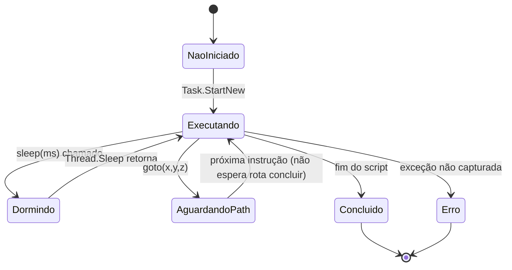
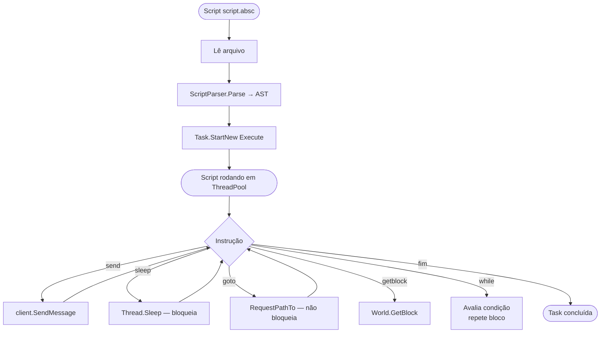
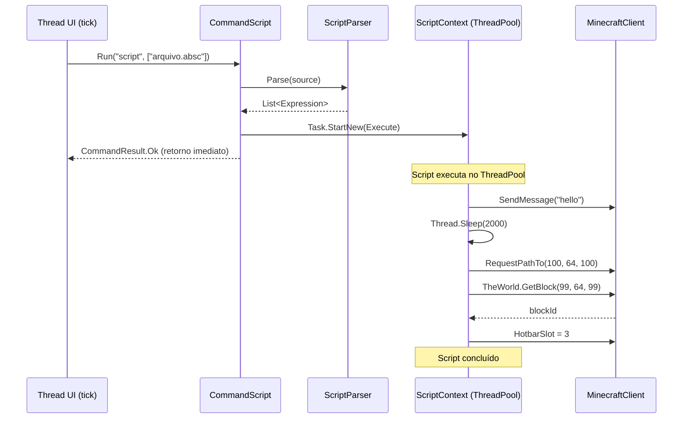
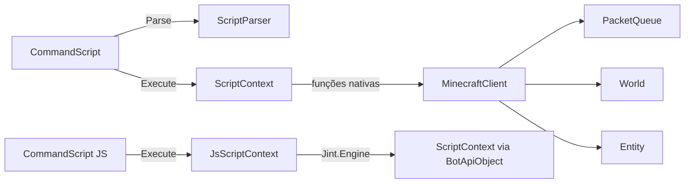

# Fluxo 12 — Macros e Scripts

## 1. Objetivo

Executar sequências de ações pré-programadas que combinam múltiplos comandos, temporizações e reações a eventos. Scripts permitem ao operador criar automações customizadas sem modificar o código do bot. O fluxo cobre tanto o engine de scripts proprietário (`.absc`) quanto o JavaScript via Jint (`.js`).

---

## 2. Evento Iniciador

- `$script caminho.absc` ou `$script caminho.js` — chamada de `CommandScript.Run`.
- Pode ser iniciado por outro script, plugin ou macro.

---

## 3. Componentes Envolvidos

| Componente | Papel |
|---|---|
| `CommandScript` | `ICommand` que inicia a execução do script |
| `ScriptParser` | tokeniza e parseia código `.absc` para AST |
| `ScriptContext` | executa a AST; mantém variáveis e chama funções nativas |
| `JsScriptContext` | executa JavaScript via Jint; expõe objeto `bot` |
| `Jint.Engine` | runtime JS ECMAScript 5.1 |
| `MinecraftClient` | destino de todas as operações nativas do script |
| `PacketQueue` | receptor indireto de ações do script |

---

## 4. Ordem Completa de Chamadas

```
$script caminho.absc
  └── CommandScript.Run("script", ["caminho.absc"])
        ├── Lê conteúdo do arquivo
        ├── [se .js] context = new JsScriptContext(client)
        ├── [se .absc] context = new ScriptContext(client)
        │     └── ScriptParser.Parse(source) → List<Expression>
        └── Task.Factory.StartNew(() => context.Execute(source))
              └── [Task rodando em ThreadPool]

ScriptContext.Execute(source) [Task / ThreadPool]:
  ├── Interpreta expressões sequencialmente:
  │     ├── var x = expr → variables["x"] = eval(expr)
  │     ├── send(msg) → client.SendMessage(msg)
  │     ├── sleep(ms) → Thread.Sleep(ms)   ← BLOQUEIA a Task
  │     ├── goto(x,y,z) → client.RequestPathTo(x,y,z)
  │     ├── look(x,y,z) → client.Player.LookTo(x,y,z)
  │     ├── hotbar(n) → client.HotbarSlot = n
  │     ├── getblock(x,y,z) → client.TheWorld.GetBlock(x,y,z)
  │     ├── getx/y/z() → client.Player.PosX/Y/Z
  │     ├── health() → client.health
  │     ├── while(cond){...} → executa até cond = false
  │     └── if(cond){...}[else{...}]
  └── [ao concluir ou exceção] Task termina

JsScriptContext.Execute(source) [Task / ThreadPool]:
  ├── Jint.Engine.SetValue("bot", new BotApiObject(client))
  └── Jint.Engine.Execute(source)
        └── bot.send/sleep/goto/... → same as above
```

---

## 5. Estados Percorridos



---

## 6. Threads Envolvidas

| Thread | Ação |
|---|---|
| Thread UI (tick) | `RunCommand` inicia a Task; retorna imediatamente |
| ThreadPool worker | executa o script inteiro; `Thread.Sleep` bloqueia este worker |

**Implicação:** cada `$script` consome um thread do pool enquanto roda. Scripts com `sleep` longo mantêm o thread preso. Em execuções longas ou múltiplos scripts simultâneos, o pool pode esgotar.

---

## 7. Eventos Publicados

Qualquer ação que o script invocar gera os mesmos eventos que o comando correspondente:
- `send()` → `PacketChatMessage`
- `goto()` → cálculo de A* + pacotes de movimento
- `break()` → `PacketPlayerDigging`
- `hotbar()` → `PacketHeldItemChange`

---

## 8. Eventos Consumidos

Scripts não consomem eventos diretamente — eles leem estado via funções nativas (`getblock`, `health`, `getx/y/z`). Para reagir a eventos (ex: chat), um script pode fazer polling com `wait(condição)`.

---

## 9. Objetos Modificados

Depende do script. O script pode modificar qualquer estado acessível pelas funções nativas:
- `Player.Yaw/Pitch` via `look()`
- `HotbarSlot` via `hotbar()`
- `PacketQueue` via `send()`, `break()`, `place()`
- `CurrentPath` via `goto()`

---

## 10. Estruturas Compartilhadas

| Estrutura | Risco |
|---|---|
| `MinecraftClient.Player.PosX/Y/Z` | lido pelo script (ThreadPool) enquanto tick o modifica |
| `World.Chunks` | lido pelo script para `getblock` |
| `PacketQueue` | escrito pelo script (ThreadPool) e pelo tick simultaneamente |

`PacketQueue` usa `lock` interno — é thread-safe. Outros acessos de leitura não têm proteção.

---

## 11. Possíveis Falhas

| Situação | Comportamento |
|---|---|
| Script com `while(true)` sem `sleep` | monopoliza thread do pool indefinidamente |
| `sleep` muito longo | thread preso; script não responde a desconexões |
| Script acessa cliente já desconectado | `NullReferenceException` ou `ObjectDisposedException` |
| Exceção em script | Task termina silenciosamente; nenhum log gerado |
| Dois scripts concorrentes modificam mesmos campos | race condition |

---

## 12. Recuperação de Erro

- Exceções na Task são silenciosas — sem log, sem notificação ao operador.
- Sem mecanismo de cancelamento — `$script` não pode ser interrompido via `$script off`.
- Desconexão do cliente não encerra o script — o script pode continuar executando após `beingTicked=false`.

---

## 13. Fluxograma



---

## 14. Diagrama de Sequência



---

## 15. Regras de Negócio

1. **Execução retorna imediatamente** — `CommandScript.Run` retorna `Ok` sem esperar o script terminar.
2. **`goto()` não bloqueia** — invoca `RequestPathTo` (que é assíncrono) e avança para a próxima instrução sem aguardar a chegada.
3. **`sleep()` bloqueia o ThreadPool** — não é cooperativo; usa `Thread.Sleep`.
4. **Variáveis têm escopo plano** — sem closures, sem escopo de bloco; variáveis declaradas em `if/while` vazam para o escopo global do script.
5. **Sem sandbox** — scripts têm acesso completo ao `MinecraftClient`; podem desconectar, enviar chat, etc.
6. **Engine escolhida por extensão** — `.js` → Jint; `.absc` → engine proprietária.
7. **Sem cancelamento** — não há como parar um script em execução via comando.

---

## 16. Dependências entre Módulos



---

## 17. Impacto para Migração Java

| Aspecto | Comportamento C# | Recomendação Java |
|---|---|---|
| `Thread.Sleep` bloqueante | prende ThreadPool | `VirtualThread.sleep()` (Java 21) — leve |
| Sem cancelamento | sem `CancellationToken` | `Future.cancel()` + `Thread.interrupt()` |
| Engine JS: Jint | ECMAScript 5.1 | GraalJS com Polyglot API |
| `goto` não bloqueia | assíncrono | manter assíncrono; script pode usar `wait(atDestino())` |
| Escopo plano | variáveis global no script | aceitável para scripts simples |
| Sem log de erro | `Task` silenciosa | `CompletableFuture.exceptionally()` para log |
| Scripts concorrentes | acessam MC sem sync | executor serial ou `VirtualThread` isolado por script |

**Invariante crítica:** `CommandScript.Run` deve retornar imediatamente — o operador espera feedback instantâneo do comando, não que o script conclua.

---

## Classes participantes

`CommandScript`, `ScriptParser`, `ScriptContext`, `JsScriptContext`, `Expression`, `Function`, `Variable`, `Token`, `MinecraftClient`, `Entity`, `World`, `Inventory`, `PacketQueue`, `Jint.Engine`.
