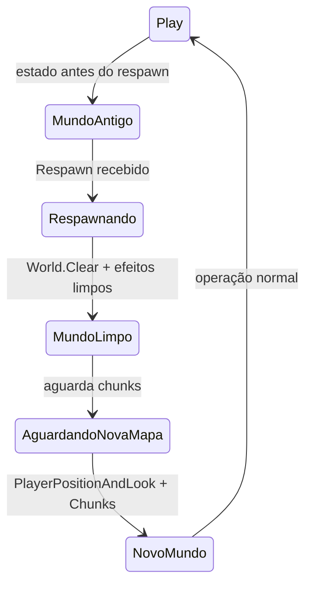
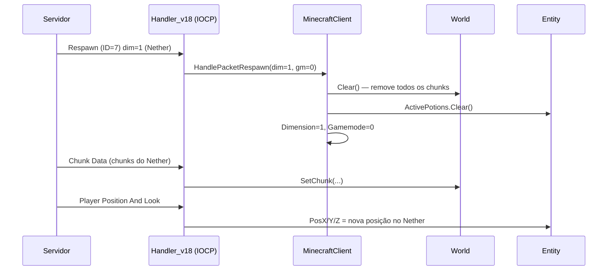
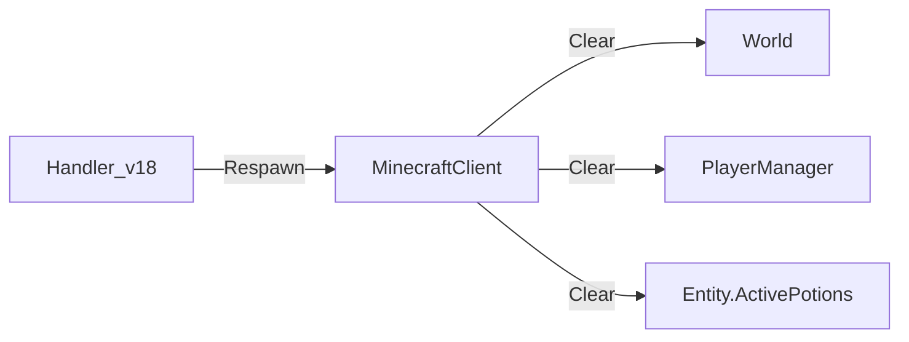
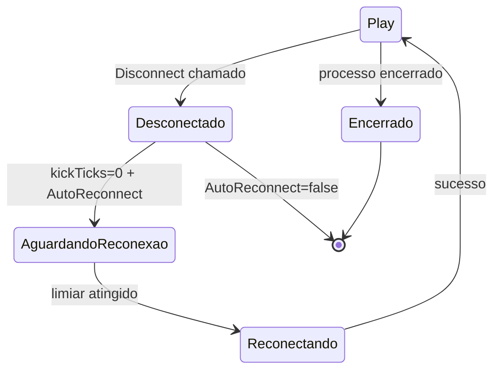

# Fluxo 13 — Troca de Mundo / Respawn

## 1. Objetivo

Lidar com a troca de dimensão (Overworld ↔ Nether ↔ End) e com a respawn após morte. Ambos os eventos chegam como pacote `Respawn`, que o servidor envia para reinicializar o estado de jogo sem encerrar a sessão TCP. O fluxo garante que o mundo local seja limpo antes de receber os novos dados da nova dimensão/spawn.

---

## 2. Evento Iniciador

Recebimento do pacote **Respawn** do servidor:
- Enviado na troca de dimensão (portais do Nether/End)
- Enviado ao respawnar após morte
- ID 0x07 em 1.8

---

## 3. Componentes Envolvidos

| Componente | Papel |
|---|---|
| `Handler_v18` | lê o pacote Respawn e chama o cliente |
| `MinecraftClient.HandlePacketRespawn` | limpa estado do mundo; reinicia player |
| `World` | limpo completamente (chunks, signs) |
| `EntityManager` | limpo (entidades da dimensão anterior) |
| `PlayerManager` | UUID2Nick limpo |
| `Entity` (Player) | efeitos de poção limpos |
| `CommandMob` / `CommandPesca` | recebem sinal indiretamente via chat/estado |

---

## 4. Ordem Completa de Chamadas

```
[Servidor envia Respawn (ID=0x07)]
  └── Handler_v18.HandlePacket(7)
        ├── dim = pkt.ReadInt()
        ├── difficulty = pkt.ReadByte()
        ├── gamemode = pkt.ReadByte()
        ├── levelType = pkt.ReadString()
        └── MinecraftClient.HandlePacketRespawn(dim, gamemode)
              ├── Dimension = dim
              ├── Gamemode = gamemode
              ├── TheWorld.Clear()           ← limpa chunks e signs
              ├── PlayerManager.UUID2Nick.Clear()
              ├── EntityManager.Clear() [se existir]
              └── Player.ActivePotions.Clear()

[Após Respawn — servidor reenvia estado do mundo]
  ├── PlayerPositionAndLook (ID=8) → nova posição
  ├── Chunk Data (ID=33) → chunks da nova dimensão/área
  ├── Health Update (ID=6) → vida restaurada
  └── Window Items (ID=48) → inventário (geralmente preservado)
```

---

## 5. Estados Percorridos



---

## 6. Threads Envolvidas

| Thread | Ação |
|---|---|
| IOCP (callback de rede) | `HandlePacketRespawn`, `World.Clear()` |
| Thread UI (tick) | pode estar rodando física enquanto World é limpo |

**Risco:** `World.Clear()` é chamado do IOCP enquanto `Entity.Tick()` (thread UI) pode estar lendo chunks para colisão. `Clear()` usa `lock(Chunks)`, mas leituras individuais de bloco em `Entity.Move()` não usam lock.

---

## 7. Eventos Publicados

| Evento | Quando |
|---|---|
| `World.OnBlockChange(-1,-1,-1,isChunk=true)` | em `World.Clear()` — notifica viewer |

---

## 8. Eventos Consumidos

| Pacote | ID 1.8 | Efeito |
|---|---|---|
| Respawn | 0x07 | dispara o fluxo |
| Player Position And Look | 0x08 | nova posição na dimensão |
| Chunk Data | 0x21 | chunks da nova área |

---

## 9. Objetos Modificados

| Objeto | Campo | Quando |
|---|---|---|
| `MinecraftClient` | `Dimension` | `HandlePacketRespawn` |
| `MinecraftClient` | `Gamemode` | `HandlePacketRespawn` |
| `World` | `Chunks`, `Signs` | `World.Clear()` |
| `PlayerManager` | `UUID2Nick` | limpo |
| `Entity` | `ActivePotions` | limpo |

---

## 10. Possíveis Falhas

| Situação | Comportamento |
|---|---|
| Comandos ativos durante respawn | continuam ativados; pathfinder usa mapa vazio |
| Física lendo mapa vazio | `GetBlock()` retorna 0 → bot cai até chunks chegarem |
| Inventário não atualizado | assume inventário anterior (geralmente correto) |

---

## 11. Fluxograma

```mermaid
flowchart TD
  PKT([Respawn (ID=7)]) --> PARSE[Lê dim, difficulty, gamemode, levelType]
  PARSE --> HRSP[HandlePacketRespawn]
  HRSP --> SETDIM[Dimension = dim\nGamemode = gamemode]
  SETDIM --> CLR[World.Clear\nPlayerManager.Clear\nActivePotions.Clear]
  CLR --> WAIT[Aguarda PlayerPositionAndLook e Chunks]
  WAIT --> RECV[Nova posição e chunks recebidos]
  RECV --> OP([Bot operacional na nova dimensão])
```

---

## 12. Diagrama de Sequência



---

## 13. Regras de Negócio

1. **`World.Clear()` é obrigatório** — chunks da dimensão anterior não são válidos na nova; manter causaria colisões fantasmas.
2. **`ActivePotions.Clear()`** — ao morrer ou trocar de dimensão, efeitos de poção são removidos pelo servidor.
3. **Inventário não é limpo** — diferente do `Join Game`, o `Respawn` não reseta o inventário (o servidor só reenvia se mudou).
4. **`beingTicked` permanece `true`** — a sessão continua ativa; apenas o estado do mundo é resetado.
5. **Comandos ativos continuam** — pathfinding, macros e KillAura não são desabilitados automaticamente ao respawnar.

---

## 14. Dependências entre Módulos



---

## 15. Impacto para Migração Java

| Aspecto | Comportamento C# | Recomendação Java |
|---|---|---|
| `World.Clear()` sem desabilitar física | tick pode ler mapa vazio | pausar física brevemente via estado `RESPAWNING` |
| Comandos ativos | não são pausados | evento `SessionRespawned` para que comandos possam reagir |
| Dimensão como `int` | 0=Overworld, 1=End, -1=Nether | enum `Dimension { OVERWORLD, NETHER, END }` |

---

## Classes participantes

`Handler_v18`, `MinecraftClient`, `World`, `EntityManager`, `PlayerManager`, `Entity`, `ViewForm` (via `OnBlockChange`).

---

# Fluxo 14 — Desconexão e Encerramento

## 1. Objetivo

Tratar o encerramento da sessão de forma controlada — seja por kick do servidor, erro de rede, timeout de keep-alive ou encerramento voluntário pelo operador. O fluxo define como o estado é limpo, quando a reconexão é agendada e como o processo é encerrado de forma limpa.

---

## 2. Evento Iniciador

Qualquer das seguintes condições:
- **Kick do servidor**: ID=0 (Disconnect) em estado play
- **Erro de rede**: `PacketStream.OnError`
- **Timeout de keep-alive**: `keepAliveTicks > 750` em `Tick()`
- **Timeout de handshake**: `connStatus=0` por mais de 20s
- **Operador**: `$reco` ou botão "Desconectar" na UI
- **Encerramento do processo**: `FormMain.FormClosing` ou `Application.Exit`

---

## 3. Componentes Envolvidos

| Componente | Papel |
|---|---|
| `MinecraftClient.Disconnect` | ponto central de desconexão |
| `PacketStream` | fechado |
| `PacketQueue` | parado (novo pacote não é enfileirado) |
| `PluginManager.Unload` | chamado no encerramento do processo |
| `World` | pode ser limpo (depende da causa) |
| `kickTicks` | gatilho para reconexão automática |

---

## 4. Ordem Completa de Chamadas

### Desconexão por kick ou erro

```
MinecraftClient.Disconnect(reason, ex):
  ├── beingTicked = false
  ├── kickTicks = 0
  ├── PrintToChat("Desconectado: " + reason)
  ├── [se ConProxy e (ex é SocketException ou IOException)]
  │     └── Program.FrmMain.Proxies.NextProxy()
  ├── [se kick por IP saturado no reason]
  │     └── Program.FrmMain.Proxies.NextProxy()
  ├── Stream?.Close()
  └── [notifica UI via event]

HandlePacketDisconnect(reason):
  ├── beingTicked = false
  ├── PlayerManager.UUID2Nick.Clear()
  ├── kickTicks = 0
  └── [verifica IP saturado para troca de proxy]
```

### Timeout de keep-alive (`Tick()`)

```
[keepAliveTicks++ > 750]
  └── Disconnect("keep-alive timeout")
```

### Encerramento do processo (`FormMain.FormClosing`)

```
FormClosing:
  ├── foreach client in Clients:
  │     └── client.Dispose()
  │           ├── beingTicked = false
  │           ├── Stream?.Close()
  │           ├── updateThread?.Abort() / Join(1000)
  │           └── World.Clear()
  └── PluginManager.Unload()
        └── foreach plugin: plugin.Unload()
```

---

## 5. Estados Percorridos



---

## 6. Regras de Negócio

1. **`beingTicked=false` é o primeiro passo** — garante que o tick pare de processar física e comandos imediatamente.
2. **Troca de proxy é automática** — apenas em erros de rede (`SocketException/IOException`) e em kicks de IP.
3. **`kickTicks=0` agenda reconexão** — independentemente da causa, se `AutoReconnect=true`, o tick tentará reconectar.
4. **`Dispose()` fecha o stream** — garante que o TCP seja encerrado mesmo se o outro lado não enviou FIN.
5. **Plugins são descarregados apenas no encerramento do processo** — não em desconexão de sessão individual.
6. **Scripts ativos não são encerrados** — Tasks de script continuam rodando após desconexão.

---

## 7. Impacto para Migração Java

| Aspecto | Recomendação |
|---|---|
| `kickTicks` como int | `SessionDisconnected` event com causa tipada |
| Troca de proxy embutida | porta `ProxyStrategy` injetável |
| Scripts não encerrados | `Future.cancel()` ao desconectar |
| Plugins descarregados no processo | `onSessionDisconnected` callback separado de `onUnload` |

---

## Classes participantes (Desconexão)

`MinecraftClient`, `PacketStream`, `PacketQueue`, `World`, `PlayerManager`, `PluginManager`, `IPlugin`, `Program`, `FormMain`.

---

# Fluxo 15 — Anti-AFK e Automações Passivas

## 1. Objetivo

Manter o bot "vivo" em servidores que desconectam jogadores inativos, executando movimentos ou ações periódicas mínimas que simulam atividade. São automações simples que rodam em paralelo com macros mais complexas.

---

## 2. Evento Iniciador

- `$antiafk on`: toggle de `CommandAntiAFK`
- `$twerk on`: toggle de `CommandTwerk`
- `$sneak on`: toggle de `CommandSneak`
- `$retard on`: toggle de `CommandRetard`

---

## 3. Comportamento por Comando

| Comando | Ação no Tick | Frequência |
|---|---|---|
| `CommandAntiAFK` | `MoveQueue.Enqueue(Jump)` | a cada `delay` ms configurável |
| `CommandTwerk` | `PacketEntityAction(Crouch)` alternando com `Uncrouch` | todo tick ativo |
| `CommandSneak` | `PacketEntityAction(Crouch ou Uncrouch)` uma vez | toggle por `Run` |
| `CommandRetard` | `MoveQueue.Enqueue(Forward)` | todo tick ativo |

---

## 4. Ordem de Chamadas — AntiAFK

```
CommandAntiAFK.Tick():
  ├── [se !toggled] return
  ├── elapsed = GetTickCount64() - lastJump
  ├── [se elapsed < delay] return
  ├── Player.MoveQueue.Enqueue(Movement.Jump)
  └── lastJump = GetTickCount64()
```

---

## 5. Regras de Negócio

1. **AntiAFK usa tempo real** — `GetTickCount64()` em ms, não em ticks. Independente da cadência do tick.
2. **Twerk alterna estados** — um tick: Crouch; próximo: Uncrouch. Efeito visível de "dançar" agachado.
3. **Retard sempre para frente** — enfileira `Forward` sem considerar obstáculos; bot anda na parede.
4. **Sem conflito com pathfinding** — MoveQueue é compartilhada; PathGuide e AntiAFK podem enfileirar simultaneamente, causando movimento errático.

---

## 6. Impacto para Migração Java

| Aspecto | Recomendação |
|---|---|
| `GetTickCount64()` | `System.currentTimeMillis()` |
| `MoveQueue.Enqueue(Jump)` | `moveQueue.offer(Movement.JUMP)` |
| Conflito com pathfinding | `MovementController` com prioridades |

---

## Classes participantes

`CommandAntiAFK`, `CommandTwerk`, `CommandSneak`, `CommandRetard`, `Entity`, `PacketQueue`, `PacketEntityAction`.
