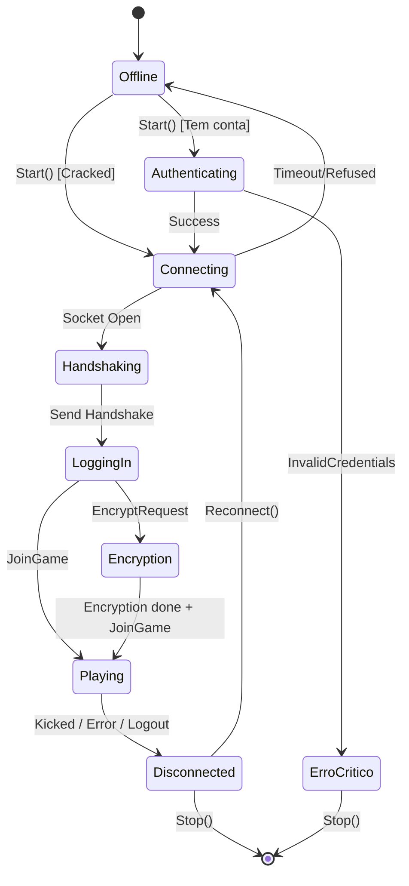
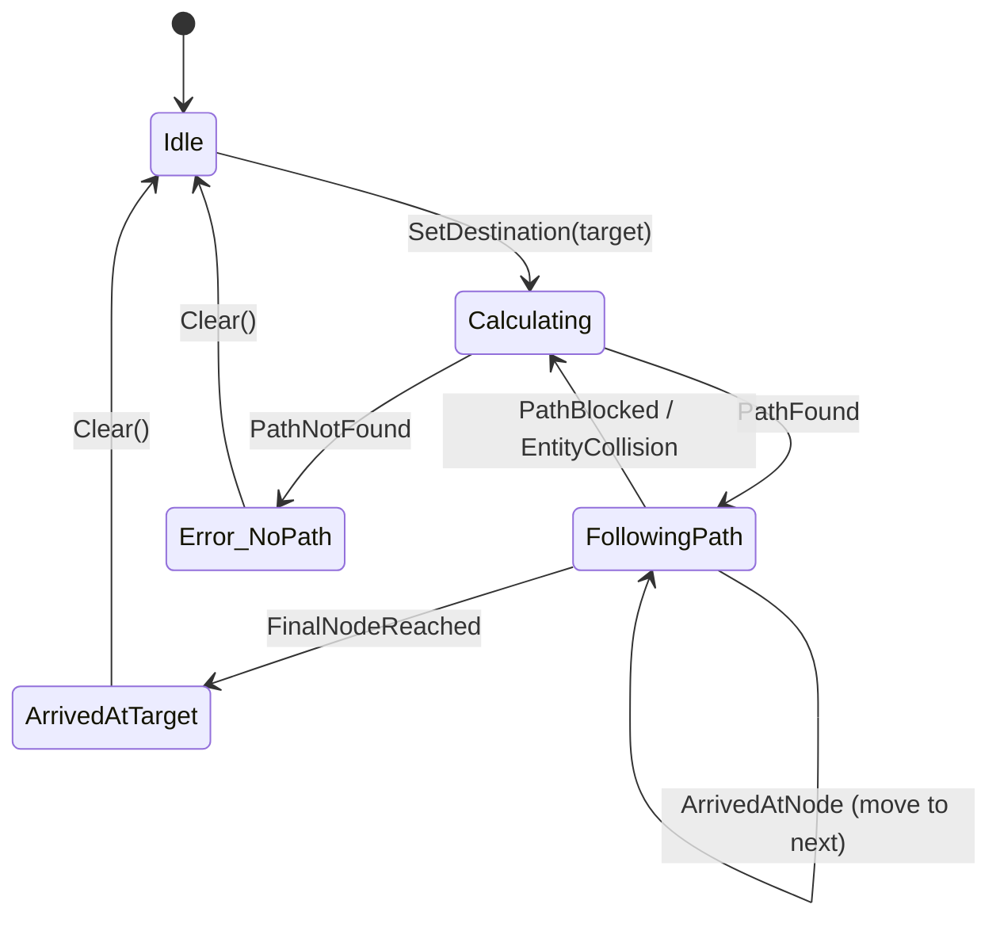
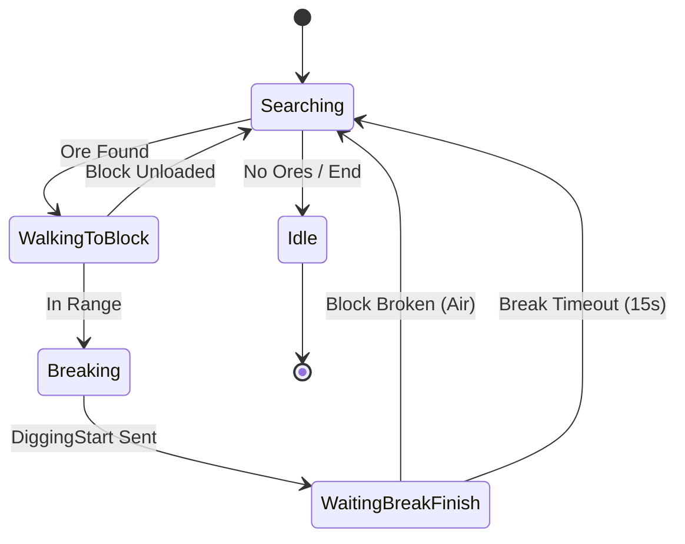
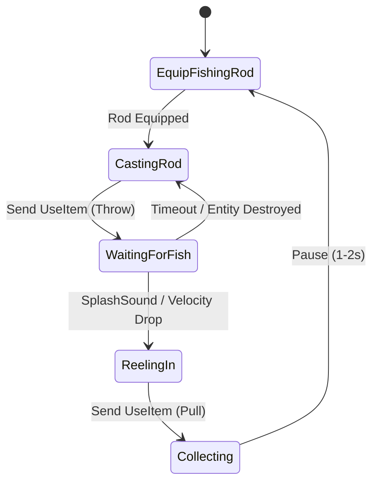
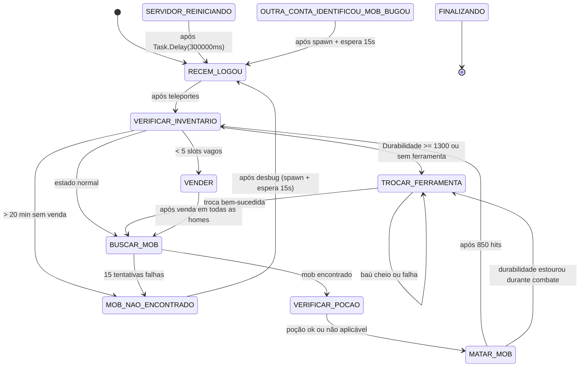
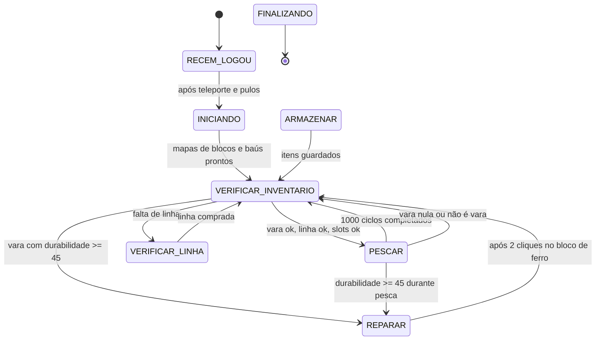
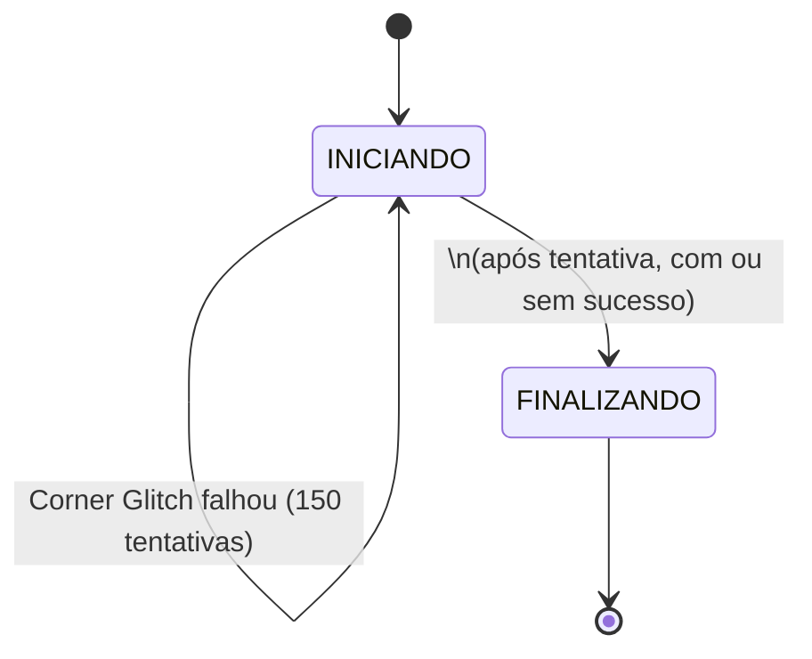

# Máquinas de Estado

Este documento mapeia os diferentes estados das peças centrais do domínio. A transição estrita entre estes estados é vital para evitar bugs de concorrência ou ações impossíveis (como tentar andar estando desconectado).

## 1. Máquina de Estado da Sessão (Conexão e Jogo)

O ciclo de vida fundamental de um bot se conectando ao servidor.

- **Estados Inválidos/Proibidos**: É impossível passar de `Handshaking` direto para `Playing` sem o estado `LoggingIn`. O estado `Encryption` é opcional (depende do servidor/online-mode).
- **Impacto**: Enquanto a Sessão não estiver em `Playing`, a IA, os Comandos e o Inventário estão completamente bloqueados.

## 2. Máquina de Estado do Pathfinding (A*)

Máquina que rege a movimentação de um ponto A a um ponto B (como AutoMiner ou comando de Walk).

- **Invariante**: Se um bloco for alterado no Mundo (`BlockChanged` event) e esse bloco estiver no trajeto atual (`FollowingPath`), o sistema DEVE forçar a transição para `Calculating` para repensar a rota.

## 3. Máquina de Estado da Mineração (AutoMiner / QuebrarMadeira)

Lógica reativa ao ato de destruir um bloco no mundo.

- **Invariante**: É impossível iniciar `Breaking` se a distância entre o jogador e o bloco for superior ao alcance legítimo (4.5 a 5 blocos).

## 4. Máquina de Estado do Macro de Pesca (Solk)

A automação de pesca requer sincronia exata de estado.

- **Falha Truncada**: Se em `WaitingForFish` o servidor enviar pacote para descarregar o Chunk da boia, a máquina volta imediatamente para o estado inicial para arremessar novamente.

---

## 5. Máquina de Estado do Farm de Mobs (`CommandMob` / Solk)

Automatiza farm de mobs com troca de ferramenta, venda de drops e reação a eventos de servidor.

- **Estados de Bloqueio**: `SERVIDOR_REINICIANDO` e `OUTRA_CONTA_IDENTIFICOU_MOB_BUGOU` só transitam para `RECEM_LOGOU`. Tentativas de transição para outros estados são ignoradas em `alterarEstado()`.
- **Trigger externo**: transições de bloqueio são disparadas por `onReceiveChat()`, não pelo loop de tick.
- **Auto-reconnect**: se `!IsBeingTicked()` e `disconnectDelay + 10000 < agora`, chama `StartClient()` com espera de 10s.

---

## 6. Máquina de Estado da Pesca V2 (`CommandPescaV2` / Solk)

Versão refatorada da pesca com fase de inicialização de mapeamento de blocos e baús.

- **Fase de mapeamento**: A fase `INICIANDO` mapeia placas de linha, bloco d'água para pesca, bloco de ferro para reparo e todos os baús por categoria.
- **Bug documentado**: `buscarBausPorArea()` tem loop com condição invertida; as áreas de mapeamento nunca são varridas.

---

## 7. Máquina de Estado do Corner Glitch (`CommandMobTeleport` / Solk)

Macro experimental para atravessar paredes e atacar mobs através de colisões.

- **Estado incompleto**: O ataque após sucesso do glitch está comentado no código. O estado `FINALIZANDO` é vazio (`async Task finalizando() {}`), efetivamente inoperante.
- **Sem persistência**: A macro reinicia do `INICIANDO` a cada tick (5s delay), sem memória de tentativas anteriores.
