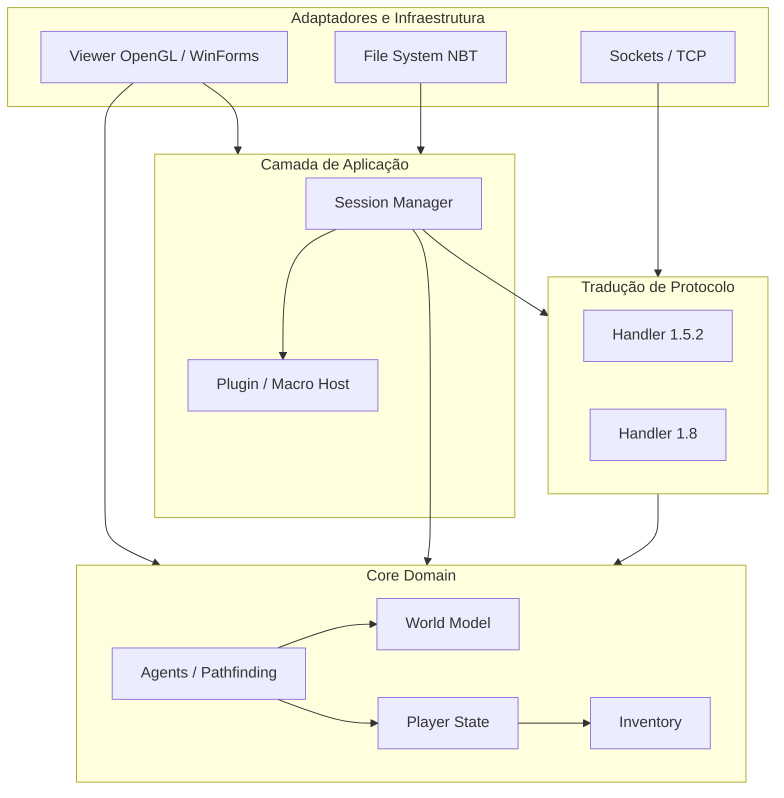

# Mapa de Dependências

Este diagrama ilustra a hierarquia lógica de dependência (quem conhece quem) em uma arquitetura limpa do domínio. Diferente do legado C# onde as classes eram bidirecionais (ex: Bot conhece Viewer que conhece World que tem ponteiro pro Bot), aqui o fluxo de dependência aponta num só sentido, isolando o núcleo.

## Diretrizes de Fluxo Lógico (Hexagonal / Clean)

1. **O Domínio (World, Player, Inv) é Isolado**: Ele não possui importação de bibliotecas de Rede, OpenGL, ou Serializadores (NBT/JSON). Ele trata blocos, vida e física.
2. **O Protocolo Traduz, não Decide**: Os `Handlers` de versão não tomam decisões de negócios. Eles apenas instanciam mutações (ex: *Recebeu bytes -> Avisa ao Mundo que o Bloco mudou*).
3. **Agentes (IA) são Serviços de Aplicação (App Services)**: Um `MinerAgent` precisa do `World` para ler, e usa uma abstração de `Output` para mandar a Sessão agir. O Agente não chama `Socket.Send()`.
4. **Os Plugins são Outermost (Bordas)**: Executam em sandboxes. Só falam com a Aplicação via Interfaces restritas e não têm acesso à injeção direta dos Sockets.
