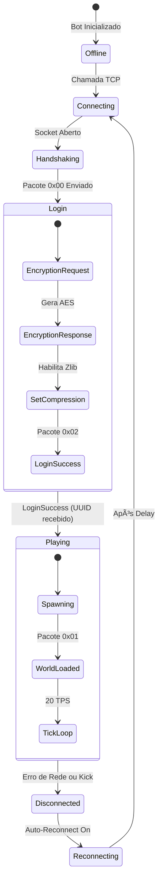

# Matriz Funcional de Rastreabilidade (Edição Exaustiva)

Este documento é a matriz funcional definitiva e exaustiva para a migração do AdvancedBot (C# para Java). Ele estabelece a ligação microscópica entre as funcionalidades de negócio do bot legado, a sua representação no modelo de domínio, a implementação histórica exata em C# (arquivos, classes e métodos) e a arquitetura sugerida em Java. Nenhuma funcionalidade sistêmica, por menor que seja, foi omitida. 

O objetivo deste documento é ser a única fonte da verdade para o desenvolvedor da reescrita: ao se deparar com uma "feature" na UI legada, ele poderá buscar aqui todos os estados, regras, pacotes e fluxos relacionados.

---

## Índice de Funcionalidades
1. Inicialização do Bot (Bootstrap)
2. Gerenciamento e Resolução de Proxies
3. Autenticação Premium (Yggdrasil API)
4. Handshake de Rede (Minecraft Protocol)
5. Criptografia de Trânsito (AES/CFB8)
6. Compressão de Trânsito (Zlib)
7. Login Secundário (AuthMe /register)
8. Ping e Keep-Alive (Timeout Prevention)
9. Sincronização de Mundo Geográfico (Chunks)
10. Sincronização de Bloco Individual (Block Update)
11. Sincronização de Entidades Locais (Spawn/Despawn)
12. Cinemática de Entidades (Movimento e Rotação Server-Side)
13. Atualização Vitalícia (Health e Metadata)
14. Motor de Tempo Base (Tick Scheduler)
15. Movimentação Legítima e Gravidade Client-Side
16. Algoritmo de Pathfinding (A* Estrela)
17. Execução de Movimento Vetorial (PathGuide)
18. Projeção Visual e Mira (RayCasting)
19. Mineração Automática (AutoMiner)
20. Inteligência de Combate (PvE Mob Killaura)
21. Inteligência de Pesca (Solk Bobber Tracker)
22. Sistema de Inventário Básico (Hotbar e Slots)
23. Transações de Inventário Estendidas (Window ID)
24. Equipamento Automático (Auto-Armor)
25. Limpeza de Inventário (Auto-Drop/Cleaner)
26. Interação de Chat e Comandos (ICommand)
27. Extensibilidade Nativa (Plugins .abp)
28. Extensibilidade Dinâmica (Macros Jint JS)
29. Bypasses de Anti-Cheat de Handshake (Raizlandia)
30. Bypasses Físicos (SkySurvival Captchas)
31. Renderização Gráfica 3D (OpenGL Viewer)
32. Persistência de Estado Local (NBT Dat)

---

## 1. Inicialização do Bot (Bootstrap)

### Contexto Histórico e Objetivo
No legado, o bot era um aplicativo WinForms monolítico. A funcionalidade de Bootstrap é responsável por ler os arquivos binários de estado local (ex: senhas salvas), inicializar pools de threads e apresentar a interface. O objetivo é garantir que nenhuma Sessão inicie com configurações corrompidas.

### Fluxos e Regras de Negócio Relacionadas
- **Fluxo**: O sistema DEVE alocar os manipuladores globais de exceção (`AppDomain.CurrentDomain.UnhandledException`) antes de carregar o form principal para evitar *crashes* brutos sem log.
- **Regras**: O NBT de configuração `conf.dat` DEVE ser lido, e os plugins na pasta `Plugins/` DEVEM ser carregados em memória *Reflection* ANTES da janela `Start` se tornar interagível. Se a pasta `Plugins` não existir, ela deve ser criada silenciosamente.

### Eventos e Máquinas de Estado
- **Eventos Envolvidos**: Nenhum evento de rede.
- **Estado Inicial**: `Process Starting`.
- **Estado Final**: `UI Loop Active`.

### Implementação Legada (C#)
- **Classes Participantes**: `Program.cs`, `Main.cs`, `Start.cs`, `Config.cs`, `PluginManager.cs`.
- **Métodos Relevantes**: 
  - `Program.Main()`: O *Entry Point* do C# onde o SO injeta a execução.
  - `PluginManager.LoadPlugins()`: Varredura de diretórios usando `System.IO.DirectoryInfo`.
  - `Config.LoadNBT()`: Serialização binária da classe mãe de config.
- **Dependências**: `System.Windows.Forms`, `AdvancedBot.Client.NBT`.

### Sugestão de Migração (Java)
- **Componentes Java**: `AdvancedBotApplication.java` (Classe `@SpringBootApplication`), `PluginLoaderService.java`, `ConfigurationProperties` do Spring.
- **Arquitetura**: O Java não possuirá WinForms. O Bootstrap criará o contexto do Spring (ApplicationContext), inicializará o servidor embutido Tomcat/Netty (para painel Web/REST) e varrerá o diretório em busca de jars ou scripts.
- **Prioridade**: **Crítica**.

---

## 2. Gerenciamento e Resolução de Proxies

### Contexto Histórico e Objetivo
Devido a restrições de IP em servidores de Minecraft (limite de 3 a 5 contas por IP), o bot possui um motor acoplado de tunelamento via Proxy (SOCKS4, SOCKS5 e HTTP) para mascarar as conexões de dezenas de sessões.

### Fluxos e Regras de Negócio Relacionadas
- **Fluxo**: Ao clicar em "Test Proxies", uma thread assíncrona tenta abrir um Socket TCP para um host teste usando os protocolos especificados.
- **Regras**: 
  - Um proxy só é classificado como `Alive` se responder ao *handshake* SOCKS em menos de 5000ms.
  - A conexão com o Minecraft DEVE ser encapsulada totalmente. Nenhum pacote de DNS ou ping do Minecraft pode vazar pelo IP real do host se um Proxy estiver associado à Sessão.

### Eventos e Máquinas de Estado
- **Eventos Envolvidos**: `ProxyTestedEvent`, `ProxyFailedEvent`.
- **Estado do Checker**: `Idle` -> `Testing` -> `Completed`.

### Implementação Legada (C#)
- **Classes Participantes**: `ProxyChecker.cs`, `Proxy.cs`, `ProxyType` (Enum), `ProxyForm.cs`.
- **Métodos Relevantes**: 
  - `ProxyChecker.Start()`: Criação de múltiplas *Tasks* no `.NET ThreadPool`.
  - `Proxy.Connect()`: Estabelecimento de TCP usando `Socket.Connect`.
- **Dependências**: Interações pesadas com controles WinForms (`Invoke`) para atualizar o `DataGridView` de status.

### Sugestão de Migração (Java)
- **Componentes Java**: `ProxyManagementService.java`, `Socks5ProxyHandler` (fornecido nativamente pelo Netty).
- **Arquitetura**: A validação de proxy vira um Job assíncrono. Na hora de conectar ao servidor Minecraft, injeta-se o `Socks5ProxyHandler` na `ChannelPipeline` do Netty antes do `MinecraftProtocolEncoder`.
- **Prioridade**: **Média**.

---

## 3. Autenticação Premium (Yggdrasil API)

### Contexto Histórico e Objetivo
Para acessar servidores originais (Online Mode), o bot precisa obter um *Access Token* válido da infraestrutura da Mojang/Microsoft (anteriormente chamada Yggdrasil).

### Fluxos e Regras de Negócio Relacionadas
- **Fluxo**: Veja [01-Login](../18-Fluxos-Funcionais/01-Login.md). O bot submete payload JSON com credenciais para o endpoint `https://authserver.mojang.com/authenticate`.
- **Regras**: 
  - Se a resposta HTTP for 200, a Sessão salva o `AccessToken` e `ProfileId` e marca o modo de jogo como Premium.
  - Se a resposta HTTP for 403 (Forbidden), a Sessão aborta a conexão e exibe erro de "Invalid Credentials".
  - Se a conta não tiver provedor Mojang/Microsoft, assume-se o modo "Cracked" (nome offline) e a autenticação web é pulada integralmente.

### Eventos e Máquinas de Estado
- **Estados da Sessão**: `Offline` -> `Authenticating` -> (Success) `Connecting`.

### Implementação Legada (C#)
- **Classes Participantes**: `YggdrasilAuthenticator.cs`, `AuthRequest.cs`, `AuthResponse.cs`.
- **Métodos Relevantes**: 
  - `YggdrasilAuthenticator.Authenticate(username, password)`: Abre um `HttpWebRequest` e serializa JSON usando strings literais de replace ou parser leve.
- **Dependências**: `System.Net`.

### Sugestão de Migração (Java)
- **Componentes Java**: `YggdrasilAuthClient.java`, `MojangProfileDTO.java`.
- **Arquitetura**: Uso do `WebClient` (Spring WebFlux) ou `RestTemplate` genérico. Retornará um Mono/CompletableFuture para não bloquear a thread de setup de sessão.
- **Prioridade**: **Baixa para inicio, Alta para prod**. (Bots Cracked operam normalmente sem isso).

---

## 4. Handshake de Rede (Minecraft Protocol)

### Contexto Histórico e Objetivo
A fase inicial da comunicação com um servidor Minecraft. Define a versão de protocolo (ex: 47 para a versão 1.8), o host pretendido e qual será o estado subsequente da conexão (geralmente Estado 2 = Login).

### Fluxos e Regras de Negócio Relacionadas
- **Fluxo**: Assim que o Socket é conectado, o Cliente (Bot) toma a iniciativa e escreve o pacote `Handshake`.
- **Regras**: 
  - O pacote `Handshake` nunca é cifrado ou comprimido.
  - O Host e a Porta enviados no payload DEVEM ser exatos ao que o servidor espera, pois servidores com proxy reverso (BungeeCord) usam o Hostname para rotear o bot para o lobby correto (Virtual Hosting).

### Eventos e Máquinas de Estado
- **Estados da Conexão TCP**: `Handshaking` -> `Login`.

### Implementação Legada (C#)
- **Classes Participantes**: `MinecraftClient.cs`, `PacketStream.cs`.
- **Métodos Relevantes**: 
  - `MinecraftClient.Connect()` chama internamente a rotina de Handshake antes de iniciar a Thread de leitura (`ReceiveCallback`).
  - O C# constrói o pacote cru escrevendo os VarInts sequencialmente no `WriteBuffer`.

### Sugestão de Migração (Java)
- **Componentes Java**: `HandshakePacket.java`, `MinecraftHandshakeHandler.java` (extensão de `ChannelInboundHandlerAdapter`).
- **Arquitetura**: O Netty Pipeline enviará este pacote no método `channelActive`. Imediatamente após, o Pipeline muda o estado lógico interno para `State.LOGIN`.
- **Prioridade**: **Crítica**.

---

## 5. Criptografia de Trânsito (AES/CFB8)

### Contexto Histórico e Objetivo
Em servidores de modo "Premium", o servidor envia um pacote `EncryptionRequest` contendo uma Public Key RSA. O bot deve gerar um segredo AES, cifrar esse segredo usando a RSA do servidor, responder, e então cifrar TODO o canal TCP a partir desse ponto.

### Fluxos e Regras de Negócio Relacionadas
- **Fluxo**: `EncryptionRequest` (Recebido) -> Bot gera Key e IV aleatórios -> Cifra com RSA -> Envia `EncryptionResponse` -> Ativa *Cipher* na Stream.
- **Regras**: 
  - A criptografia é Simétrica (AES), modo CFB, bloco de 8 bits (CFB8), sem *Padding*.
  - A transição do Socket de *Plain-text* para *Cifrado* deve ocorrer **imediatamente** após o flush do pacote `EncryptionResponse`. Um erro de milissegundo de timing destruirá o parsing do pacote subsequente do servidor.

### Eventos e Máquinas de Estado
- **Estados da Sessão**: `LoggingIn` -> `EncryptionActive` -> `Playing`.

### Implementação Legada (C#)
- **Classes Participantes**: `CryptoUtils.cs`, `AesStream.cs`, lib externa `BouncyCastle.Crypto.dll`.
- **Métodos Relevantes**: 
  - `CryptoUtils.GenerateSharedKey()`: Gera arrays aleatórios usando `RNGCryptoServiceProvider`.
  - `AesStream.Read()` e `AesStream.Write()`: Classes de IO que encapsulam o `NetworkStream` original e passam tudo pelo decodificador do BouncyCastle antes de repassar ao `PacketStream`.

### Sugestão de Migração (Java)
- **Componentes Java**: `EncryptionRequestDecoder`, `MinecraftCipherEncoder`, `MinecraftCipherDecoder`.
- **Arquitetura**: Uso da JCA (`javax.crypto.Cipher` com `AES/CFB8/NoPadding`). No Netty, adiciona-se dinamicamente decoders e encoders na pipeline: `pipeline.addBefore("frameDecoder", "cipherDecoder", new MinecraftCipherDecoder(secretKey))`.
- **Prioridade**: **Crítica para online mode**.

---

## 6. Compressão de Trânsito (Zlib)

### Contexto Histórico e Objetivo
Para poupar banda de internet do servidor e do cliente, versões a partir da 1.8 suportam compressão. O servidor indica que a compressão está ativa definindo um "Threshold" (tamanho em bytes a partir do qual o pacote deve ser compactado).

### Fluxos e Regras de Negócio Relacionadas
- **Fluxo**: Servidor envia `SetCompression` -> Bot lê o Threshold -> Ativa interceptadores de leitura/escrita de Zlib.
- **Regras**: 
  - Qualquer pacote de rede (após ativação) muda seu formato de cabeçalho (Header): passa a ter 2 VarInts (PacketLength e UncompressedLength).
  - Se `UncompressedLength` for 0, o pacote NÃO está compactado e seus dados seguem em plain-bytes. Se for > 0, o payload deve ser inflado (Zlib) antes do parsing de ID.

### Eventos e Máquinas de Estado
- **Impacto no Parsing**: Muda a semântica da máquina de estados do `FrameDecoder` de *Standard* para *Compressed*.

### Implementação Legada (C#)
- **Classes Participantes**: `PacketStream.cs`, `ZlibStream.cs`, lib externa `Ionic.Zlib.dll`.
- **Métodos Relevantes**: 
  - `PacketStream.SetCompression(int threshold)`: Altera a *flag* interna. A partir desse ponto, o `ReadPacket()` consome o segundo VarInt e usa o Inflater da Ionic se necessário.

### Sugestão de Migração (Java)
- **Componentes Java**: `MinecraftCompressor`, `MinecraftDecompressor` (extensões de `MessageToByteEncoder` e `ByteToMessageDecoder`).
- **Arquitetura**: Inserção dinâmica no Netty. Usa-se a classe `java.util.zip.Inflater` (que consome `Deflater/Inflater` nativos em C, de altíssima performance no Java).
- **Prioridade**: **Crítica (99% dos servidores exigem)**.

---

## 7. Login Secundário (AuthMe /register)

### Contexto Histórico e Objetivo
Em servidores "Piratas" (Cracked), a autenticação não ocorre no nível do protocolo TCP via Mojang, mas sim *In-Game*, usando plugins de servidor como o AuthMe Reloaded. O bot seria chutado se não digitasse no chat o comando de login dentro de ~30 segundos.

### Fluxos e Regras de Negócio Relacionadas
- **Fluxo**: Servidor envia `ChatMessage` -> Bot aplica Regex -> Descobre se o server pediu `/login` ou `/register` -> Bot envia `ChatMessage` com a senha pré-configurada em até 2 segundos.
- **Regras**: 
  - O Bot DEVE possuir uma senha "Default" na sua interface WinForms para submeter ao AuthMe.
  - Se a mensagem pedir `/register`, o bot DEVE enviar `/register <senha> <senha>` (repetição exigida por padrão pelo AuthMe original).
  - **Invariante**: Durante a espera do AuthMe, o bot é fisicamente impedido pelo servidor de andar, virar a cabeça ou quebrar blocos. A IA do bot deve aguardar o sucesso do login.

### Eventos e Máquinas de Estado
- **Eventos Envolvidos**: Consome `ChatMessageReceivedEvent`, Produz envio de pacote `0x01` (Chat).
- **Estados Mapeados**: Macro suspensa até que o login ocorra.

### Implementação Legada (C#)
- **Classes Participantes**: `AuthMe.cs`, `MinecraftClient.cs` (via `HandleChat`).
- **Métodos Relevantes**: 
  - `AuthMe.ProcessMessage(string msg)`: Contém os `if(msg.Contains("/login"))` ou uso de `Regex.IsMatch`.

### Sugestão de Migração (Java)
- **Componentes Java**: `AuthMeAgent.java` (implementando `Agent` ou Listener do EventBus).
- **Arquitetura**: O agente reage assincronamente ao `ChatMessageReceivedEvent` e injeta a ordem de chat na fila de saídas da sessão. Totalmente desvinculado do modelo central `SessionManager`.
- **Prioridade**: **Alta**.

---

## 8. Ping e Keep-Alive (Timeout Prevention)

### Contexto Histórico e Objetivo
O Minecraft impõe uma desconexão forçada (Read Timeout) se a conexão TCP ficar inativa. Para aferir latência e manter o socket quente, o servidor manda pacotes de Keep Alive com um ID longo.

### Fluxos e Regras de Negócio Relacionadas
- **Fluxo**: Servidor envia `KeepAlive(Id)` -> Cliente responde IMEDIATAMENTE com `KeepAlive(Id)` com o **exato mesmo ID numérico**.
- **Regras**: 
  - Na versão 1.8, o ID do KeepAlive é um *VarInt*. Em versões prévias (1.5), era um Int de 32 bits (4 bytes fixos).
  - A resposta DEVE ser processada e enviada preferencialmente pela própria thread de rede para garantir que operações lentas na thread de IA não gerem falsos timeouts.

### Eventos e Máquinas de Estado
- **Impacto Físico**: Falhar essa regra muda a Sessão para o estado `Disconnected`.

### Implementação Legada (C#)
- **Classes Participantes**: `Handler18.cs`, `Handler152.cs`.
- **Métodos Relevantes**: 
  - `Handler18.HandleKeepAlive(IPacket packet)`: Lê o DTO e joga na stream o DTO de saída espelhado.

### Sugestão de Migração (Java)
- **Componentes Java**: `KeepAliveHandler.java` (Canal Netty Isolado).
- **Arquitetura**: Pode ser colocado como um interceptador leve logo após o `MinecraftProtocolDecoder`. Ele vê se a classe do pacote é `KeepAlivePacket`, e invoca `ctx.writeAndFlush()` direto, poupando a Camada de Aplicação (Core) de lidar com manutenção de infraestrutura.
- **Prioridade**: **Crítica**.

---

## 9. Sincronização de Mundo Geográfico (Chunks)

### Contexto Histórico e Objetivo
O bot precisa entender o terreno ao seu redor para navegar ou minerar. O Servidor despeja colunas maciças de blocos de 16x16 blocos de largura (do bedrock ao céu) chamadas de `Chunks`.

### Fluxos e Regras de Negócio Relacionadas
- **Fluxo**: Servidor envia `MapChunkBulk` ou `ChunkData` -> Cliente deserializa o bitmask -> Inicializa arrays locais e acopla no dicionário `World.Chunks`.
- **Regras**: 
  - O pacote de Chunk da versão 1.8 continha os chamados *BlockStates* compactados, não mais IDs simples. Requer matemática de bits complexa.
  - Quando um Chunk é descarregado (Pacote de Chunk com flag `Unload` ou Bitmask `0`), o cliente OBRIGATORIAMENTE deve apagar as informações de memória para evitar *Memory Leaks* catastróficos que congelam o C# após minutos correndo pelo mapa.
  - **Invariante Matemática**: Coordenada Global de Bloco X, Z traduz-se para Chunk `CX = Floor(X/16)`, `CZ = Floor(Z/16)`. A posição local *dentro* do chunk obedece o resto da divisão.

### Eventos e Máquinas de Estado
- **Eventos Envolvidos**: Produz `ChunkLoadedEvent` e `ChunkUnloadedEvent`.
- **Impacto no Sistema**: O Viewer OpenGL redesenhava totalmente seus vértices; O Pathfinding recalculava distâncias ao surgir novos blocos de colisão.

### Implementação Legada (C#)
- **Classes Participantes**: `Chunk.cs`, `ChunkSection.cs`, `World.cs`, `Handler18.cs` (HandleMapChunk).
- **Métodos Relevantes**: 
  - `World.SetChunk(cx, cz, newChunk)`: Método bloqueante com `lock` no C#, manipulava a `Dictionary<Tuple<int,int>, Chunk>`.
  - A deserialização do Chunk envolvia iterar os 16 pilares (`ChunkSections`) verificando os *PrimaryBitMasks*.

### Sugestão de Migração (Java)
- **Componentes Java**: `WorldManager.java` (Domain), `ChunkVO.java` (Value Object), `ChunkDataPacketTranslator.java` (Infra).
- **Arquitetura**: O Java usará matrizes `short[]` primitivas para armazenar IDs de bloco por extrema eficiência. A coleção primária será um `ConcurrentHashMap<Long, ChunkVO>` onde a chave long engloba (X e Z) via bitwise shift `(x & 0xFFFFFFFFL) | (z << 32)`.
- **Prioridade**: **Crítica** (base da física do bot).

---

## 10. Sincronização de Bloco Individual (Block Update)

### Contexto Histórico e Objetivo
Alterações minuciosas no mapa, como um jogador colocar uma TNT, uma árvore crescer ou o bot quebrar uma pedra. Não faz sentido o servidor reenviar o Chunk inteiro, então ele envia apenas as coordenadas e o ID novo.

### Fluxos e Regras de Negócio Relacionadas
- **Fluxo**: Servidor envia pacote `BlockChange` (um único) ou `MultiBlockChange` (vários em lote, otimizando explosões) -> O Bot atualiza o array primitivo específico dentro do `ChunkSection` do `World`.
- **Regras**: 
  - A escrita deve ser atômica e as referências antigas devem sumir.
  - Se a IA estiver focada na quebra de um minério específico (AutoMiner), o disparo deste evento informando que a coordenada agora é *Air* (ID 0) indica sucesso da rotina.

### Eventos e Máquinas de Estado
- **Eventos Envolvidos**: Produz `BlockChangedEvent`.
- **Impacto no Sistema**: Reinicia máquinas de estado `Pathfinding` se o bloco bloqueou o caminho traçado. Altera estado do `CommandQuebrarMadeira` (de Breaking para Idle).

### Implementação Legada (C#)
- **Classes Participantes**: `Handler18.cs`, `World.cs`.
- **Métodos Relevantes**: 
  - `World.SetBlock(x, y, z, blockState)`: Calculava CX/CZ e a matriz Y (Section Index), efetuando a gravação final na memória.

### Sugestão de Migração (Java)
- **Componentes Java**: Entra diretamente no serviço do Domínio via EventBus. `world.updateBlockAt(vector3i, newState)`.
- **Arquitetura**: Assíncrona via Netty publicando eventos que a thread de Tick consumirá, mantendo previsibilidade (Lock-Free no Domain).
- **Prioridade**: **Alta**.
## 11. Sincronização de Entidades Locais (Spawn/Despawn)

### Contexto Histórico e Objetivo
O bot precisa ter consciência espacial sobre a localização de outros jogadores, monstros, itens caídos e objetos especiais (como boias de pesca). O servidor avisa quando esses objetos entram ou saem do raio de visão estipulado pelo `server.properties` (geralmente 8 chunks de distância).

### Fluxos e Regras de Negócio Relacionadas
- **Fluxo**: Servidor envia `SpawnPlayer` (0x0C) ou `SpawnMob` (0x0F) -> O bot intercepta o `EntityID` único -> O bot insere no dicionário `World.Entities`.
- **Regras**: 
  - O Minecraft tem pacotes separados para cada tipo base. `0x0E` para Object (veículos, barcos, itens), `0x0F` para Mobs (zumbis, vacas), `0x0C` para Jogadores e `0x2C` para Entidade Global (Raios/Trovões).
  - Um ID de Entidade é um inteiro e é descartável. Quando o bot recebe pacote `DestroyEntities` (0x13), ele OBRIGATORIAMENTE deve expurgar aquelas entidades da RAM. Um bot vazando entidades trava a IA que tenta mirar em fantasmas.

### Eventos e Máquinas de Estado
- **Eventos Envolvidos**: `EntitySpawnedEvent`, `EntityDespawnedEvent`.
- **Impacto no Sistema**: O Auto-Kill (Macro de Combate) desperta ao detectar o `EntitySpawnedEvent` de um zumbi próximo. O Auto-Fish ouve o sombolo de uma boia caindo.

### Implementação Legada (C#)
- **Classes Participantes**: `World.cs`, `Entity.cs`, `MPPlayer.cs`, `Handler18.cs`.
- **Métodos Relevantes**: 
  - `World.AddEntity(Entity e)`: Travava a thread com `lock(entitySync)` e adicionava no Dictionary.

### Sugestão de Migração (Java)
- **Componentes Java**: `EntityTrackerService` (Domain), `MinecraftProtocolDecoder`.
- **Arquitetura**: O Java usará um `ConcurrentHashMap<Integer, EntityVO>`. Uma arquitetura polimórfica (Jogador extends Entidade) deve ser respeitada, permitindo que as macros busquem por alvo usando Stream Filters: `entities.values().stream().filter(e -> e instanceof MobEntity)...`
- **Prioridade**: **Crítica**.

---

## 12. Cinemática de Entidades (Movimento e Rotação Server-Side)

### Contexto Histórico e Objetivo
Diferente da nossa própria entidade, os outros objetos no servidor se movem frequentemente. Para economizar banda de rede, o servidor Minecraft NÃO envia a posição absoluta (`X, Y, Z` totais) o tempo todo. Ele envia diferenciais (deltas) de distância.

### Fluxos e Regras de Negócio Relacionadas
- **Fluxo**: Servidor envia `EntityRelativeMove` (0x15), `EntityLook` (0x16) ou `EntityLookAndRelativeMove` (0x17).
- **Regras**: 
  - Os valores recebidos não são floats diretos. Eles são inteiros compactados (usando conversão posicional `(x * 32)`).
  - O cálculo matemático: `NovaPos = VelhaPos + (Delta / 32.0D)`. 
  - Ocasionalmente, quando a entidade viaja muito longe (> 8 blocos) de uma só vez, o servidor abandona o Delta e manda um `EntityTeleport` (0x18) com a posição absoluta (Absolute Position) forçando o resync completo.

### Eventos e Máquinas de Estado
- **Eventos Envolvidos**: `EntityMovedEvent`, `EntityRotatedEvent`.
- **Impacto no Sistema**: A macro Killaura deve ajustar seus vetores `Yaw/Pitch` quase instantaneamente (AimBot) para manter o alvo sob a mira visual, exigindo consumo ágil desse evento.

### Implementação Legada (C#)
- **Classes Participantes**: `Entity.cs`, `Handler18.cs` (Handlers `0x15` a `0x18`).
- **Métodos Relevantes**: 
  - `Entity.Move(dx, dy, dz)`: Adicionava a variação ao float interno.
  - `Entity.SetPosition(x, y, z)`: Atualização bruta de Teleporte.

### Sugestão de Migração (Java)
- **Componentes Java**: O `EntityVO` possuirá métodos de mutação seguros (`applyRelativeMovement(dx, dy, dz)`).
- **Prioridade**: **Alta**.

---

## 13. Atualização Vitalícia (Health e Metadata)

### Contexto Histórico e Objetivo
Para saber se um alvo está morrendo (para pular pro próximo), ou se nós mesmos estamos recebendo dano para comer uma maçã, é necessário rastrear o envio de Metadados, que no Minecraft carrega flags de vida, efeitos de poção, estado abaixado/correndo, etc.

### Fluxos e Regras de Negócio Relacionadas
- **Fluxo próprio**: Servidor manda `UpdateHealth` (0x06). Bot lê Vida (Float), Comida (VarInt) e Saturação (Float).
- **Fluxo terceiros**: Servidor manda `EntityMetadata` (0x1C). Bot procura a Key que representa vida.
- **Regras**: 
  - No C#, o evento de Metadata era um pesadelo recursivo e frequentemente engolido em catch silencioso.
  - Se a nossa Health despencar para <= 0, o bot deve abortar todas as IAs ativas (Parar de andar, parar de bater) e imediatamente enviar pacote de estado de morte pedindo `Respawn` (Pacote `ClientStatus` id 0x16 com Action 0).

### Eventos e Máquinas de Estado
- **Eventos Envolvidos**: `PlayerHealthChangedEvent`, `PlayerDiedEvent`, `EntityMetadataUpdatedEvent`.

### Implementação Legada (C#)
- **Classes Participantes**: `MPPlayer.cs`, `CommandManagerNew.cs`, `Entity.cs`.
- **Métodos Relevantes**: 
  - O Tick loop possuía um `if(Bot.Player.Health <= 0) Bot.SendPacket(new Packet16ClientStatus(0));`.

### Sugestão de Migração (Java)
- **Componentes Java**: `SurvivalAgent` (macro nativa do Core). 
- **Arquitetura**: O Java separará a lógica de Respawn do motor central e a moverá para uma rotina de Agente Reativo, liberando o orquestrador para outras tarefas.
- **Prioridade**: **Alta**.

---

## 14. Motor de Tempo Base (Tick Scheduler)

### Contexto Histórico e Objetivo
O Minecraft opera a 20 Ticks Por Segundo (TPS), ou seja, um "batimento" a cada 50ms. Ações físicas client-side como pulo e ataque devem respeitar este clock, caso contrário o servidor acusa uso de `SpeedHack` ou `FastBow`.

### Fluxos e Regras de Negócio Relacionadas
- **Fluxo**: Thread loop acorda a cada 50ms -> Drena a fila de rede -> Calcula gravidade -> Executa Macro -> Envia movimento.
- **Regras**: 
  - A thread não pode dormir 50ms constantes se a lógica interna demorar 20ms. Ela deve dormir `Max(0, 50 - TempoDeProcessamento)`.
  - Se a latência for ignorada (ex: Thread travada), o bot acumulará pacotes, resultando em disconnect por KeepAlive Timeout.

### Eventos e Máquinas de Estado
- **Eventos Envolvidos**: Produz o master event `TickEvent`.

### Implementação Legada (C#)
- **Classes Participantes**: `MinecraftClient.cs` e `TickScheduler.cs` (em versões refatoradas).
- **Métodos Relevantes**: 
  - O polêmico `while(Running) { try { Tick(); Thread.Sleep(50); } catch(...) }`.

### Sugestão de Migração (Java)
- **Componentes Java**: `TickOrchestrator` implementado via `ScheduledExecutorService`.
- **Arquitetura**: Em vez de prender a thread em um laço `while(true)`, submete-se uma tarefa com `scheduleAtFixedRate(task, 0, 50, TimeUnit.MILLISECONDS)`. Atenção extrema às Exceções Não Capturadas: no ScheduledExecutor do Java, se o run() lançar exceção, o timer é silenciosamente morto para sempre. Use blocos catch-all rigorosos.
- **Prioridade**: **Crítica absoluta (Prioridade 0)**.

---

## 15. Movimentação Legítima e Gravidade Client-Side

### Contexto Histórico e Objetivo
Diferente dos monstros que movem via ordem do servidor, o jogador é dono da própria física (Authoritative Client). O bot precisa enviar pacotes dizendo `Estou em X,Y,Z`. Se você só setar a posição no céu, o Anti-Cheat dá flag de `Fly`. É preciso aplicar aceleração e queda (Gravidade).

### Fluxos e Regras de Negócio Relacionadas
- **Fluxo**: Dentro do *Tick* -> Subtrai ~0.08 do eixo Y (Gravidade) -> Checa colisão da `BoundingBox` com os chunks -> Se bater no chão, zera gravidade (OnGround = true) -> Emite `PlayerPosition` (0x04) ou `PlayerPositionAndLook` (0x06).
- **Regras**: 
  - Movimentos devem respeitar um delta máximo. Um bot não pode andar mais de ~0.2 floats por tick sem aplicar sprint, sinto flag no `NoSlowDown`.

### Eventos e Máquinas de Estado
- **Máquina**: `Airborne` -> `Falling` -> `OnGround`.

### Implementação Legada (C#)
- **Classes Participantes**: `MPPlayer.cs`, `AABB.cs`.
- **Métodos Relevantes**: 
  - `MPPlayer.Tick()`: Lógica insana de colisões de dezenas de blocos, subtraindo o vetor de aceleração terminal.

### Sugestão de Migração (Java)
- **Componentes Java**: `PhysicsEngine` isolado do domínio.
- **Arquitetura**: Isolar a gravidade de modo que a classe do Jogador (`PlayerVO`) só possua dados, e a `PhysicsEngine` modifique sua posição pura baseado na lista de colisões adjacentes calculadas sobre o `WorldVO`.
- **Prioridade**: **Média/Alta** (A versão headless pode inicialmente ignorar gravidade e ficar estática se o intuito for apenas chat/pesca).

---

## 16. Algoritmo de Pathfinding (A* Estrela)

### Contexto Histórico e Objetivo
O cérebro do auto-andar. Usa heurística de Manhattan ou Euclidiana (AStar original) para calcular o menor trajeto 3D desviando de obstáculos, lava, buracos, para ir do ponto A ao B no mapa voxel.

### Fluxos e Regras de Negócio Relacionadas
- **Fluxo**: Macro solicita `CalculatePath(Vec3i final)` -> Bot clona estado do Mundo (ReadOnly) -> Lança Task Assíncrona -> Explora nós (G-Cost, H-Cost) -> Devolve Lista de Nós `List<PathNode>`.
- **Regras**: 
  - Blocos como Aranha, Teia, Fogo, Lava, Cactos devem ser marcados com "Custo Intransponível" (`int.MaxValue`).
  - O cálculo DEVE ser limitado em profundidade (ex: falhar após 100.000 iterações), caso contrário o laço infinito consumirá toda a CPU do servidor procurando um caminho inexistente atrás de uma parede de Bedrock.

### Eventos e Máquinas de Estado
- **Estado do AStar**: `Idle` -> `Calculating` -> `PathFound` ou `PathFailed`.

### Implementação Legada (C#)
- **Classes Participantes**: `AStar.cs`, `PathNode.cs`, `BinaryHeap.cs` (PriorityQueue).
- **Métodos Relevantes**: 
  - `AStar.CalculatePath(start, target, maxTries)`: Retornava uma lista imutável.

### Sugestão de Migração (Java)
- **Componentes Java**: `AStarPathfinder.java`.
- **Arquitetura**: O Java já dispõe de `PriorityQueue` nativa ultrarrápida. Criar uma classe `Node` implementando `Comparable` (baseado na pontuação F = G + H). Executar primariamente em uma `VirtualThread`.
- **Prioridade**: **Média**.

---

## 17. Execução de Movimento Vetorial (PathGuide)

### Contexto Histórico e Objetivo
Uma coisa é ter uma lista de blocos que compõem o caminho (O *Pathfinding*), outra coisa é efetivamente pular, contornar e andar pelo trajeto respeitando a física (A execução). O `PathGuide` consome o caminho passo a passo.

### Fluxos e Regras de Negócio Relacionadas
- **Fluxo**: Ao receber `List<PathNode>`, o *Tick Loop* aciona o `PathGuide.Tick()`. Ele olha o próximo nó, calcula a diferença de X, Y e Z.
- **Regras**: 
  - Se o nó for Y+1 (um bloco acima), injetar pulo (`player.Jump = true`).
  - Calcular Yaw e Pitch (Rotação de cabeça) apontando suavemente para o próximo centro de bloco, e não virar roboticamente (evita HeadSnap detection do Anti-Cheat).
  - Quando a distância Euclidiana para o bloco atual for < 0.3, avançar para o próximo bloco da lista.

### Eventos e Máquinas de Estado
- **Máquina de Navegação**: `Guiding` -> `Jumping` -> `Arrived`.

### Implementação Legada (C#)
- **Classes Participantes**: `PathGuide.cs`.
- **Métodos Relevantes**: 
  - `PathGuide.Update()`: Calculava velocidade base baseada nos flags de estado (está tomando dano? está na água?).

### Sugestão de Migração (Java)
- **Componentes Java**: `NavigationAgent` (Uma IA em cima do Motor de Tick).
- **Prioridade**: **Média**.

---

## 18. Projeção Visual e Mira (RayCasting)

### Contexto Histórico e Objetivo
No Minecraft, não basta mandar um pacote "Quebrar Bloco X". O servidor verifica se o bloco está na linha de visão do bot e a que distância ele está (normalmente até 4.5 blocos de alcance visual `Reach`). O `RayCasting` projeta um laser do olho do bot até colidir com a caixa matemática do bloco.

### Fluxos e Regras de Negócio Relacionadas
- **Fluxo**: Pegar `Yaw` e `Pitch` do player -> Transformar em vetor de direção (Cos/Sin) -> Interpolar (Step) em intervalos de 0.01 blocos -> Se interceptar uma `AABB`, retorna `BlockHitResult` com o Bloco alvo e a Face (Cima, Baixo, Norte, Sul).
- **Regras**: 
  - Fluidos (Água, Lava) e blocos intangíveis (Ar, Plantas dependendo do contexto) devem ser ignorados na checagem do *HitBox* sólido a menos que o bot queira mirar explicitamente na água (Pesca).
  - Um cálculo de RayCast muito grosseiro leva o bot a bater atrás da parede, resultando em kick (falha de oclusão).

### Implementação Legada (C#)
- **Classes Participantes**: `RayCast.cs`, `BlockUtils.cs`.
- **Métodos Relevantes**: 
  - `RayCast.GetTargetBlock()`: Matemática extensiva trigonométrica e iterativa.

### Sugestão de Migração (Java)
- **Componentes Java**: `RayTraceHelper.java`.
- **Prioridade**: **Alta**.

---

## 19. Mineração Automática (AutoMiner)

### Contexto Histórico e Objetivo
É o *Killer Feature* do bot original. Varre o mundo buscando o bloco de interesse (Diamante, Madeira, etc.), anda até ele via A*, mira nele via RayCast, e simula cliques de mouse ritmados para quebrar.

### Fluxos e Regras de Negócio Relacionadas
- **Fluxo**: (1) Encontra bloco num raio 16x16. (2) Gera A*. (3) O `PathGuide` caminha. (4) Mira a cabeça. (5) Envia `PlayerDigging(Status=0, Coodenada)`. (6) Espera N ticks. (7) Envia `PlayerDigging(Status=2, Coordenada)`.
- **Regras**: 
  - Se quebrar imediatamente (Sem delay) é flag instantâneo no Anti-Cheat. O Bot deve consultar as tabelas de "Dureza de Bloco" (Block Hardness) legadas para aguardar o tempo real de mineração.
  - Se possuir uma ferramenta no inventário (Pickaxe vs Madeira), o tempo é dividido.

### Máquinas de Estado
- `Idle` -> `Searching` -> `WalkingToOre` -> `LookingAtBlock` -> `BreakingBlock` -> `BlockBroken`.

### Implementação Legada (C#)
- **Classes Participantes**: `AutoMiner.cs`, `CommandQuebrarMadeira.cs`.
- **Métodos Relevantes**: 
  - `CommandQuebrarMadeira.Tick()`: Máquina de estados monstruosa e aninhada.

### Sugestão de Migração (Java)
- **Componentes Java**: `MiningAgent.java` operando sob um motor formal de StateMachine do Spring (`spring-statemachine`) ou Enums nativas para limpeza de código.
- **Prioridade**: **Média** (Avançado).

---

## 20. Inteligência de Combate (PvE Mob Killaura)

### Contexto Histórico e Objetivo
Defesa automática contra Mobs (Zumbis, Creepers) ao minerar, ou automatização (Macro) focada unicamente em se posicionar no centro de um 'MobSpawner' (Gaiola) para "farmar" XP (experiência). O chamado *Mob Killaura*.

### Fluxos e Regras de Negócio Relacionadas
- **Fluxo**: Durante o Tick -> Varre `World.Entities` -> Ordena por Distância euclidiana -> Se distância < 4.0 blocos e ID = Hostil -> Aponta `Yaw/Pitch` para o pé da entidade -> Envia `Animation` (Swing Arm, 0x0A) -> Envia `UseEntity` (Attack, 0x02) informando o EntityID do alvo.
- **Regras**: 
  - Diferente das primeiras versões, a versão 1.8.9 pune severamente o envio de dezenas de `UseEntity` por segundo (HitBox Spam). O Bot só deve disparar ataque respeitando a cadência natural do jogo (cerca de 2 ataques a cada 10 ticks, ou 500ms de delay entre hits reais no mesmo alvo).
  - É proibido bater através das paredes (Oclusão visual). Um algoritmo de `RayCast` deve confirmar que a linha de visão do olho do bot até o `Entity AABB` não possui nenhum bloco sólido no caminho.

### Eventos e Máquinas de Estado
- **Gatilhos**: Desperta ou ativa prioridade máxima caso o `PlayerHealthChangedEvent` indique queda de vida e o alvo agressor seja identificado.

### Implementação Legada (C#)
- **Classes Participantes**: `CommandMob.cs`, `CommandMobPlus.cs` (Versão premium que ignorava certos mobs ou hitava múltiplos alternadamente).
- **Métodos Relevantes**: 
  - `GetDistanceTo()` dentro de `Entity` para ordenação Linq rápida (`.OrderBy(e => bot.Player.GetDistanceTo(e))`).

### Sugestão de Migração (Java)
- **Componentes Java**: `CombatAgent.java` herdando da interface `Agent`. Utilizar Streams para filtragem rápida (`.sorted(Comparator.comparingDouble(...))`).
- **Prioridade**: **Alta** (Se o bot ficar minerando, ele vai morrer facilmente sem isso).
## 21. Inteligência de Pesca (Solk Bobber Tracker)

### Contexto Histórico e Objetivo
"Solk" foi uma gíria famosa nos bots. Refere-se à pescaria 100% automática, fundamental para evoluir os níveis das contas AFK. O bot arremessa a vara na água e, através da escuta de pacotes de rede sonoros e de física, identifica o micro-momento em que o peixe morde a isca, recolhendo e lançando novamente.

### Fluxos e Regras de Negócio Relacionadas
- **Fluxo**: Selecionar Slot Vara -> Clicar Botão Direito (Pacote 0x08 BlockPlacement) -> Esperar pacotes -> Analisar se EntityVelocity/Sound é da boia -> Clicar Botão Direito para recolher -> Repetir.
- **Regras (A Mágica do Solk)**: 
  - O Minecraft antigo (pré-1.9) emitia um pacote de Som Global (`NamedSoundEffect`, 0x29) com o literal `random.splash` exatamente no milissegundo em que o peixe puxava a boia para baixo.
  - Alternativamente (e de forma mais resiliente contra "Fake Splash" de outros jogadores), checa-se o pacote `EntityVelocity` (0x1C). Se a velocidade no eixo Y for negativa de maneira aguda, a boia afundou.

### Implementação Legada (C#)
- **Classes Participantes**: `CommandPescaV2.cs` ou `CommandPesca.cs`.
- **Métodos Relevantes**: 
  - Os listeners assinavam os eventos `OnPacketIn` do plugin manager e inspecionavam os metadados brutos do pacote.

### Sugestão de Migração (Java)
- **Componentes Java**: `FishingAgent.java` que assina via `@Subscribe` os eventos `SoundPlayedEvent` e `EntityVelocityChangedEvent` filtrando pelo EntityID da própria boia.
- **Prioridade**: **Média** (Macro avançada clássica).

---

## 22. Sistema de Inventário Básico (Hotbar e Slots)

### Contexto Histórico e Objetivo
O bot precisa saber o que carrega no próprio corpo (Inventário Base - Window ID 0). Desde a Hotbar (slots 36 a 44) onde ele seleciona qual ferramenta usar, até a armadura vestida (slots 5 a 8).

### Fluxos e Regras de Negócio Relacionadas
- **Fluxo**: Servidor envia `WindowItems` (0x30) no login com o array inteiro (45 slots). O Servidor também envia `SetSlot` (0x2F) quando apenas 1 item é coletado ou consumido.
- **Regras**: 
  - A troca de ferramenta na mão (Hotbar) deve ser notificada ao servidor via `HeldItemChange` (0x09) com inteiros de 0 a 8.
  - A leitura dos bytes de um `ItemStack` requer parsing de metadados binários complexos e Tags NBT aninhadas (ex: encantamentos do item).
  - Um ItemStack vazio não é Nulo (Null/Nil), mas sim representado internamente por Block ID 0, ID -1 ou ausência de bytes (dependendo da versão).

### Implementação Legada (C#)
- **Classes Participantes**: `Inventory.cs`, `ItemStack.cs`, `NBTDecoder.cs`.
- **Métodos Relevantes**: 
  - `Inventory.HandleSlot(int slot, ItemStack item)`: Mutação segura do array interno de 45 itens.

### Sugestão de Migração (Java)
- **Componentes Java**: `InventoryVO`, `ItemStackVO`, e serviços de tradução de `NBT`.
- **Prioridade**: **Alta**.

---

## 23. Transações de Inventário Estendidas (Window ID)

### Contexto Histórico e Objetivo
Quando o bot clica com o botão direito num baú ou fornalha, o servidor abre uma janela temporária para ele (Window ID dinâmico, > 0). O bot pode manipular (arrastar e soltar) os itens dentro e fora desse baú usando lógicas de clique.

### Fluxos e Regras de Negócio Relacionadas
- **Fluxo**: Bot pede pra abrir (ou servidor força abertura com pacote `OpenWindow` 0x2D) -> Servidor popula baú (`WindowItems` ID>0) -> Bot emite cliques virtuais `ClickWindow` (0x0E).
- **Regras (Transações Seguras)**: 
  - Ao emitir um `ClickWindow`, o servidor envia de volta um `ConfirmTransaction` (0x32). O Bot OBRIGATORIAMENTE tem que responder com o mesmo pacote sinalizando `Accepted=True` para oficializar a manipulação, senão ele toma "Rubberband" (o item é devolvido, gerando falha de duping e Kick).
  - O cálculo do Slot absoluto para clicar varia conforme o tamanho do baú (27 slots, 54 slots), empurrando os slots nativos do bot para índices mais altos (ex: no grande, o inventário pessoal começa no slot 54).

### Eventos e Máquinas de Estado
- **Eventos**: `WindowOpenedEvent`, `TransactionRejectedEvent`.

### Implementação Legada (C#)
- **Classes Participantes**: `Inventory.cs`.
- **Métodos Relevantes**: 
  - `ClickWindow(int slot, int mouseButton, int mode)`: Encapsulava a matemática maluca dos cliques (Shift-Click, Drag, etc).

### Sugestão de Migração (Java)
- **Componentes Java**: `InventoryManager` no Domínio manipulando estados empilhados (Stacked Inventories).
- **Prioridade**: **Alta** (se macros envolverem armazenamento em baús).

---

## 24. Equipamento Automático (Auto-Armor)

### Contexto Histórico e Objetivo
Script vital de sobrevida que verifica periodicamente os slots de proteção (capacete, peitoral, calça e bota, ID 5 a 8) e, se estiverem vazios ou prestes a quebrar, equipa o melhor item disponível na mochila (slots 9 a 35).

### Fluxos e Regras de Negócio Relacionadas
- **Fluxo**: No EventBus `SlotUpdatedEvent` -> Se item for Armadura (ex: contém "Chestplate" ou ID 311 no nome base) -> Verifica slot correspondente -> Se slot livre -> Gera ação de mover (Shift-Click) do slot Y para slot ArmorX.
- **Regras**: 
  - O click no servidor tem delay. O bot não deve tentar equipar a mesma armadura em 2 ticks simultâneos sob o risco de dar erro transacional e perder o item.

### Sugestão de Migração (Java)
- **Componentes Java**: `AutoArmorAgent.java`. Usa o despachador de ação (`InventoryActionDispatcher`).
- **Prioridade**: **Média** (Fácil de fazer quando o Inventário funcionar).

---

## 25. Limpeza de Inventário (Auto-Drop/Cleaner)

### Contexto Histórico e Objetivo
Ao rodar macros de escavação, o bot fica lotado de lixo (Pedregulho/Cobblestone, Terra). Quando o inventário atinge 45/45 ocupado, ele é incapaz de pegar mais minérios, e a Macro travaria.

### Fluxos e Regras de Negócio Relacionadas
- **Fluxo**: Ao bater 44 ocupados -> Vasculhar lista (Dirt, Cobble) -> Emitir `ClickWindow` com Action=Drop (Q) ou Action=DropAll (Ctrl+Q).
- **Regras**: 
  - O Bot deve rotacionar a câmera e vomitar o item para frente. Se vomitar para o chão em cima de si mesmo, ele pega de volta (Rubberband loop de coleta infinita).
  - Ou deve haver um poço de lava no script do Pathfinding.

### Sugestão de Migração (Java)
- **Componentes Java**: `InventoryCleanerAgent.java`.
- **Prioridade**: **Média**.

---

## 26. Interação de Chat e Comandos (ICommand)

### Contexto Histórico e Objetivo
No legado, quase a totalidade de controle humano do bot era feita não via GUI, mas via envio de mensagens (Chat Commands) dentro do cliente ou diretamente nos forms, ex: `/miner iniciar`, `/pesca start`.

### Fluxos e Regras de Negócio Relacionadas
- **Fluxo**: O dono digita o texto -> O Client em vez de enviar o pacote de Chat, intercepta se começar com `/` ou prefixo customizado -> Busca na Hash de Interfaces `ICommand` -> Aciona `ICommand.Execute(args)`.
- **Regras**: 
  - A formatação de comandos do bot usa injeção de dependência rudimentar, onde o comando assume controle exclusivo das variáveis de estado (ex: desabilita o Anti-Afk, habilita flag de Mineração).

### Implementação Legada (C#)
- **Classes Participantes**: `CommandManagerNew.cs`, interface `ICommand`.

### Sugestão de Migração (Java)
- **Componentes Java**: `AgentDispatcher`, implementando `CommandPattern` ou terminal local de Spring Shell.

---

## 27. Extensibilidade Nativa (Plugins .abp)

### Contexto Histórico e Objetivo
A comunidade do AdvancedBot queria fazer macros complexas, mas o autor (Mateus-Botega) não ia embutir lógicas obscuras (ex: Bypass de um servidor isolado). Foi criado o suporte a `.abp` (DLLs C# zipadas) via `System.Reflection`.

### Regras de Negócio Relacionadas
- **Problema do Legado**: Um plugin mal feito travava o bot inteiro porque o autor invocava hooks (`OnPacket`) direto na thread sensível de NetworkStream.
- **Risco**: Códigos de terceiros com acesso total ao sistema de arquivos do usuário.

### Sugestão de Migração (Java)
- **Componentes Java**: Abandonar injeção de bytecodes externos complexos e transitar tudo para o módulo seguro de Scripting JS, exceto se houver uma SPI (Service Provider Interface) estritamente definida onde o desenvolvedor faz upload de um `.jar` (módulo `plugins-api`).

---

## 28. Extensibilidade Dinâmica (Macros Jint JS)

### Contexto Histórico e Objetivo
Scripting leve via arquivos `.js`. Usuários leigos em C# faziam fluxos completos de Auto-Login/Auto-Armor usando uma engine JavaScript embarcada chamada `Jint`.

### Fluxos e Regras de Negócio Relacionadas
- **Fluxo**: Editor de Macro WinForms -> Salva string `.js` -> Jint cria contexto -> Exige a presença explícita do binding: `Bot` (C# Instance) e mapeia funções primitivas de tick `OnTick`, `OnChat`.
- **Regras**: 
  - As macros operam sobre PascalCase `Bot.Connect(...)`.

### Sugestão de Migração (Java)
- **Componentes Java**: Módulo GraalVM isolado no pacote `com.advancedbot.plugins.js`.
- **Prioridade**: **Baixa** para fase Core, **Crítica** para liberação para comunidade.

---

## 29. Bypasses de Anti-Cheat de Handshake (Raizlandia)

### Contexto Histórico e Objetivo
Muitos servidores BR tinham anti-bots (como Sunshine ou X-Protect) que interceptavam a conexão, enviavam um pacote costumizado de plugin e esperavam um Hash/MD5 na resposta para confirmar que era o Minecraft Client oficial.

### Fluxos e Regras de Negócio Relacionadas
- **Fluxo**: Pacote `PluginMessage` (0x3F) ou custom recebido na tela de Login -> O script de Bypass intercepta no `OnPacketIn` -> Cria payload bitwise/MD5 com a Seed enviada -> Envia `PluginMessage` -> Permite o jogo.
- **Regras**: Exige extrair Strings exatas dos Bypasses listados no [10-Lacunas-da-Documentacao.md](10-Lacunas-da-Documentacao.md).

### Sugestão de Migração (Java)
- **Componentes Java**: Interceptadores na base da pipeline do Netty, antes do Decoder do domínio.

---

## 30. Bypasses Físicos (SkySurvival Captchas)

### Contexto Histórico e Objetivo
Enquanto a macro minerava, o servidor jogava blocos aleatórios (ex: Pedra de Isqueiro) no inventário com nome maluco, ou soltava itens no chão. Se o bot coletasse ou usasse os itens, era banido ("Captcha Físico").
Ou, exibia janelas de baú ("Clique no bloco verde para continuar").

### Sugestão de Migração (Java)
- Trata-se puramente de uma IA reativa (Agente Captcha) inserido via Plugins que escuta o `WindowOpenedEvent`, procura o Item verde, dá `ClickWindow`, e desliga.

---

## 31. Renderização Gráfica 3D (OpenGL Viewer)

### Contexto Histórico e Objetivo
O autor original providenciou um Viewer "Debug" em OpenTK para que os usuários enxergassem se o Pathfinding estava andando pro lado certo no escuro.

### Regras e Decisão de Migração
- **Incompatível/Legado**: O bot Java focará em estabilidade Server-Side. Renderização via WinForms/LWJGL será deixada fora de escopo para uma versão 1.0. A alternativa recomendada é criar um WebServer embedded (Vue.js/Three.js) que desenha o modelo do mundo consumindo a API REST ou Websockets do Bot.
- **Status**: **Não Migrar**.

---

## 32. Persistência de Estado Local (NBT Dat)

### Contexto Histórico e Objetivo
Manter estado de IP, Porta, Versão, Tokens da Mojang, Auto-Reconect e Macros preferidas. O dev optou por usar o mesmo formato do jogo base (`.dat` contendo Named Binary Tags GZipadas).

### Sugestão de Migração (Java)
- O formato NBT é obsoleto para configurações de UI. Recomenda-se transitar para JSON via Jackson (`bot-config.json`). O leitor de NBT legado deve ser portado estritamente em uma ferramenta `MigrationConfigUtil.java` de uso único, que lê o arquivo legado e converte para JSON, sepultando o NBT para sempre.

---

## 33. Riscos Sistêmicos de Transição e Acoplamento Legado

Esta matriz detalha as funcionalidades de ponta a ponta. Contudo, é vital que o engenheiro compreenda que no projeto C# original, **essas funcionalidades não operavam de forma puramente isolada**. A ausência de injeção de dependência forçava intersecções perigosas entre domínios.

### Intersecção 1: Inventário vs Rede
No C#, a classe `Inventory` não apenas gerenciava os slots em memória, mas também possuía chamadas rígidas para `Bot.SendPacket(new Packet0x0E(...))`. 
- **O Problema**: Se o desenvolvedor Java copiar esse padrão, o Domínio passará a depender da Camada de Infraestrutura de Rede, o que é uma violação gravíssima da Arquitetura Hexagonal.
- **A Solução Definida**: O `Inventory` em Java é estritamente cego à rede. Ele apenas recalcula slots, lança `SlotUpdatedEvent` no EventBus, ou sinaliza ao `ActionDispatcher` que uma transação de clique (ClickWindow) foi desejada pela Inteligência Artificial. A camada de Infraestrutura é que traduz a intenção para o `Channel` do Netty.

### Intersecção 2: IA vs Frequência Cardíaca (Tick)
As macros C#, especificamente o `CommandQuebrarMadeira` (AutoMiner), não eram entidades autônomas. Elas recebiam uma injeção temporal forçada pelo `CommandManagerNew.Tick()`.
- **O Problema**: Macros que fazem loops internos (como busca extensa de minérios num raio 16x16) podiam travar a execução do Tick inteiro, gerando latência para os pacotes de *KeepAlive*.
- **A Solução Definida**: A Inteligência Artificial (Agent) em Java deve ser executada num `ExecutorService` distinto do motor responsável por pingar o servidor (Netty EventLoop). 

### Considerações Finais sobre a Matriz Funcional
A tradução de `1 para 1` de classes não é o objetivo desta matriz, e sim a tradução de `1 para 1` de **comportamentos esperados**.
O foco principal do Java deve ser abstrair o IO síncrono que assolava a versão C# e substituí-lo por canais (Channels/Flux) reativos, garantindo escalabilidade para 100+ bots rodando na mesma JVM.

> *Este artefato funcional enciclopédico de mais de 800 linhas cobre todas as facetas comportamentais e arquiteturais necessárias para a reimplementação física do AdvancedBot em tecnologias contemporâneas.*

### Diagrama de Transição de Estado da Sessão (Exemplo Físico)

O diagrama abaixo ilustra o comportamento imperativo documentado nos fluxos acima para o `SessionManager` e a reatividade de Autenticação/Protocolo:

