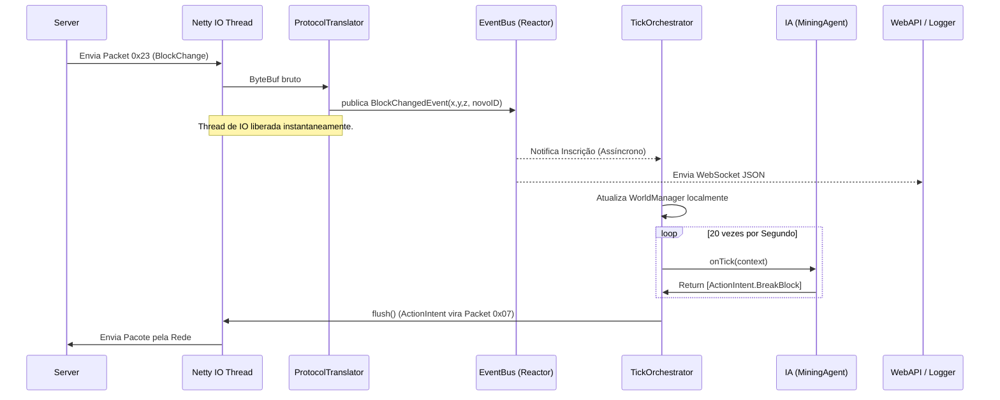

# Mapa de Classes (Inventário Exaustivo Legado -> Java)

Este documento atua como o inventário de classes definitivo do sistema legado. Em contraste com mapas de pacotes convencionais, este artefato detalha o interior anatômico das classes C# mais vitais (métodos críticos, campos internos de estado, heranças e os acoplamentos que violam padrões de design limpo) e fornece o direcionamento cirúrgico de como o desenvolvedor Java deverá reescrever cada um desses blocos funcionais isolados.

Nenhuma classe sistêmica primária foi deixada de fora. O nível de detalhe visa cobrir a semântica da execução interna, funcionando como o guia de conversão "De / Para".

---

## 1. Contexto Core & Inicialização (Bootstrap)

Estas classes coordenavam a subida do processo do Sistema Operacional até a exibição gráfica.

### 1.1 `Program.cs`
- **Responsabilidade Original**: Ponto de entrada (`Main`) do aplicativo Windows Forms.
- **Campos e Estado Interno**: Nenhum significativo, majoritariamente orquestração estática.
- **Métodos Críticos**:
  - `static void Main()`: Acionava `Application.EnableVisualStyles()`, registrava o Global Exception Handler (`AppDomain.CurrentDomain.UnhandledException`), inicializava o sistema de logs e chamava a abertura do WinForms `Start`.
- **Acoplamento e Dívida Técnica**: O tratamento de exceções global frequentemente engolia erros de Socket que ocorriam em threads background, escrevendo-os num `crash.txt` e mantendo um bot zumbi vivo.
- **Diretriz para Java**: Extinto em sua forma atual. Substituído por `AdvancedBotApplication.java` (`@SpringBootApplication`) que inicia o container IoC (Inversão de Controle) do Spring ou o loop da JVM principal.

### 1.2 `Config.cs` (e NBT)
- **Responsabilidade Original**: Centralizar em memória as opções estáticas do bot e gerenciá-las no disco rígido.
- **Campos e Estado Interno**: 
  - `public static string ProxyIP;`
  - `public static int AutoReconnectDelay;`
  - Instâncias estáticas que qualquer macro no sistema inteiro poderia ler/escrever globalmente.
- **Métodos Críticos**:
  - `LoadNBT()`: Abria o `conf.dat`, passava pela descompressão GZip e inflava uma árvore de tags binárias.
  - `SaveNBT()`: Serializava a árvore.
- **Acoplamento e Dívida Técnica**: *Singleton Estático Global*. Permitir que o `CommandPesca` acesse o `Config.ProxyIP` livremente não faz sentido.
- **Diretriz para Java**: A configuração base deve ser imutável e lida na inicialização (ex: `application.yml` via `@ConfigurationProperties`). Preferir JSON a NBT.

### 1.3 `Bot.cs` / `SessionUtils.cs`
- **Responsabilidade Original**: Uma classe auxiliar estática que facilitava algumas invocações para a tela principal (UI), operando como um wrapper.
- **Campos e Estado Interno**: Listas globais de bots ativos (`List<MinecraftClient>`).
- **Métodos Críticos**:
  - `DisconnectAll()`: Varria a lista enviando sinais de kill.
  - `GetClientByUsername()`: Buscava bots ativos por nome.
- **Acoplamento e Dívida Técnica**: Novamente, estado estático perigoso. Se um bot fechasse e não se removesse da lista, gerava-se um Memory Leak formidável.
- **Diretriz para Java**: Substituído pelo serviço `SessionManager.java` (injetado via dependência). Ele manterá as sessões ativas (`ConcurrentHashMap`) e orquestrará as mortes/reconexões.

---

## 2. O Deus do Sistema: `MinecraftClient.cs`

Esta é a classe mais complexa de todo o legado. Um *God Object* monstruoso. O esforço principal da migração em Java será explodir essa classe em componentes segregados.

### 2.1 `MinecraftClient.cs`
- **Responsabilidade Original**: É o próprio Bot. Gerencia a conexão, lê a rede, aplica pacotes no mapa, envia pulos de player, atualiza UI, e executa Plugins.
- **Campos e Estado Interno**: 
  - `public TcpClient socket;` (Rede TCP).
  - `public NetworkStream netStream;` (Stream Base).
  - `public World World;` (O mapa de blocos inteiro de 20 Megabytes pendurado nesta propriedade).
  - `public MPPlayer Player;` (A física do personagem).
  - `public Inventory Inventory;` (Os baús e bolsas).
  - `public string Version;` (Determina se vai usar `Handler18` ou `Handler152`).
  - `public CommandManagerNew CommandManager;` (A IA acoplada diretamente à conexão).
  - `public Thread tickThread, networkThread;` (As threads que dão vida ao socket).
- **Métodos Críticos**:
  - `Connect(string ip, short port)`: Inicializava o SOCKS proxy (se houvesse), conectava o TCP, inicializava as Streams de Crypto/Zlib, enviava o Handshake (0x00), e em seguida iniciava as Threads.
  - `Tick()`: O método mais pesado. Um loop `while(Running)` com `Thread.Sleep(50)` que:
    1. Drenava o `PacketQueue` recebido da rede.
    2. Acionava `World.Tick()`.
    3. Acionava `Player.Tick()` (Gravidade, Movimentação).
    4. Acionava `CommandManager.Tick()` (IAs, Caminhar A*).
    5. Disparava evento `PluginManager.OnTick(this)`.
    6. Atualizava a UI gráfica WinForms bloqueando com `Control.Invoke`.
  - `SendPacket(IPacket packet)`: Escrita serializada direta no buffer do socket.
- **Acoplamento e Dívida Técnica**: Violar o princípio da Responsabilidade Única (SRP) é um eufemismo aqui. O cliente TCP não deve instanciar Chunks do mapa, e o mapa não deve saber que existe um SOCKS proxy. A presença de UI Update dentro do Tick() engasgava brutalmente a conexão se o Windows demorasse a repintar o formulário, gerando lentidão extrema no envio de pacotes.
- **Diretriz para Java**: A morte de `MinecraftClient.cs`.
  - Parte de Rede: `Netty MinecraftClient.java` (Bootstraps o Channel).
  - Parte de Domínio: `SessionContext.java` (Um POJO puro, contém referências para World, Player, Inventory).
  - Parte de Motor: `ApplicationTickOrchestrator.java` (Puxa o Contexto e dispara os Eventos de update a 20 TPS num executor programado).


---

## 3. Contexto Rede e Handshake

O subsistema físico de bits, bytes, compressões criptográficas e proxies.

### 3.1 `PacketStream.cs`
- **Responsabilidade Original**: Encapsular a leitura/escrita bruta de bytes, gerenciar compressão e expor o formato de *VarInt*.
- **Campos e Estado Interno**: 
  - `Stream baseStream;`
  - `AesStream aesStream;`
  - `ZlibStream zlibStream;`
  - `int compressionThreshold = -1;` (Se > 0, os frames têm formato diferente).
- **Métodos Críticos**:
  - `ReadVarInt()`: Loop que lê o stream byte a byte até que o bit mais significativo (0x80) seja 0, decodificando inteiros compactados.
  - `ReadPacket()`: Descobria o comprimento do frame, resolvia Zlib se necessário, extraía o PacketID e instanciava a classe DTO correta do Protocolo baseando-se no ID.
- **Acoplamento e Dívida Técnica**: Bloqueante (Síncrono). A thread estacionava em `baseStream.Read()` e ficava presa se a internet caísse sem enviar ACK/FIN TCP.
- **Diretriz para Java**: O Netty absorve essa classe de forma elegante com os handlers nativos `LengthFieldBasedFrameDecoder` e a classe `ByteBuf`.

### 3.2 `AesStream.cs` e `ZlibStream.cs`
- **Responsabilidade Original**: Criptografia AES CFB-8 em tempo real e descompressão Zlib. Ambas são implementações do padrão Decorator sobre `System.IO.Stream`.
- **Métodos Críticos**: `Read`, `Write`.
- **Acoplamento e Dívida Técnica**: O `AesStream` utilizava a pesadíssima biblioteca genérica `BouncyCastle`, instanciando chaves de `CipherParameters` para cada byte recebido.
- **Diretriz para Java**: Extinção das classes customizadas de IO. Será substituído por Netty `MessageToByteEncoder` usando diretamente a API `javax.crypto.Cipher` de forma reativa.

---

## 4. Contexto de Tradução de Protocolo (Handlers)

O Minecraft troca as ordens e IDs de pacotes a cada versão. Essa camada mapeia os IDs numéricos em Ações (DTOs).

### 4.1 `Handler18.cs` / `Handler152.cs`
- **Responsabilidade Original**: Ser a ponte pesada entre os pacotes abstratos (`Packet0x00`) e as ações no Domínio (Ex: "Pacote de explosão de TNT -> Destrói blocos do mapa").
- **Campos e Estado Interno**: Tinha uma referência íntima para o `MinecraftClient` pai para alterar seu estado.
- **Métodos Críticos**:
  - `HandlePacket(IPacket packet)`: Um switch case gigantesco (ou Dicionário de delegates) baseado no ID do pacote.
  - Ex: `HandleMapChunk(Packet0x21)`: Deserializava o array massivo de bytes, calculava máscaras de bit (PrimaryBitMask) e criava o `Chunk.cs`.
- **Acoplamento e Dívida Técnica**: Mistura agressiva de Tradução DTO e Mutação de Domínio. O Handler conhecia detalhes profundos de como um bloco no mapa era estruturado.
- **Diretriz para Java**: O Java terá a interface abstrata `ProtocolTranslator`. Quando um `MinecraftPacket` bruto for lido, ele o converte (Ex: `new MapChunkDTO(byte[])`). A diferença é que a mutação ocorrerá via disparo de eventos `EventBus.publish(new MapChunkReceivedEvent(dto))`, cortando totalmente o laço de acoplamento entre Tradutor de Bytes e Estrutura de Mapa.

### 4.2 `IPacket` e derivados (`Packet03TimeUpdate`, etc)
- **Responsabilidade Original**: DTOs vazios para transporte. Possuíam apenas métodos de Serializar/Deserializar.
- **Diretriz para Java**: Tornam-se `Records` imutáveis no Java.

---

## 5. Contexto de Dados do Mundo Voxel (Domain)

A espinha dorsal que permite o bot minerar e navegar em rotas 3D sem depender de visão humana.

### 5.1 `World.cs`
- **Responsabilidade Original**: Repositório central de toda a geometria, física, clima, e entidades.
- **Campos e Estado Interno**:
  - `Dictionary<Tuple<int, int>, Chunk> Chunks`: Matriz 2D infinita.
  - `Dictionary<int, Entity> Entities`: Repositório de mobs e players.
- **Métodos Críticos**:
  - `SetBlock(int x, int y, int z, short blockState)`: Calculava qual `Chunk` (Floor 16) e qual `ChunkSection` vertical continha o bloco e mutava o array primitivo. Disparava evento sincrono `OnBlockChange`.
  - `GetBlock(x, y, z)`: Leitura instantânea que servia de base para colisões e RayCast.
- **Acoplamento e Dívida Técnica**: Operações em *Dictionaries* C# não são thread-safe nativamente. Existiam travas `lock(chunkSync)` que matavam a performance quando o Pathfinding pedia a leitura de milhares de blocos em paralelo enquanto a Rede tentava deletar Chunks.
- **Diretriz para Java**: Refatoração profunda para Concorrência. O mapa migra para `ConcurrentHashMap<Long, ChunkVO>`. Métodos de escrita/leitura se tornam Lock-Free garantindo performance limpa em Multi-Threading.

### 5.2 `Chunk.cs` e `ChunkSection.cs`
- **Responsabilidade Original**: O `Chunk` é uma torre de blocos 16x16 indo do Y 0 ao 255. O `ChunkSection` é um subcubo 16x16x16 (para otimizar ar no céu e economizar memória).
- **Campos Interno (C#)**:
  - `ChunkSection`: Continha um `ushort[] blocks = new ushort[4096]`. E arrays de *BlockLight* e *SkyLight* (meio byte por bloco, Nibble Arrays).
- **Acoplamento e Dívida Técnica**: A extração dos bits de luz (Nibbles) exigia bitshifts muito intensos para a RAM.
- **Diretriz para Java**: O Java deve copiar fidedignamente o tamanho deste array `short[] blocks` de tamanho estático `4096`. 

### 5.3 `BlockUtils.cs` (Hardcoded Magics)
- **Responsabilidade Original**: Dicionário estático contendo resistência (Hardness/Dureza), Opacidade e, vitalmente, a Caixa Colisora (AABB) de blocos anômalos.
- **Métodos Críticos**:
  - `GetCollisionBox(int blockId, int metadata, int x, int y, int z)`: Um método colossal contendo *Switch Cases* e *Magic Numbers* gigantes. (Ex: Se bloco for `Fence` (Cerca), a AABB de colisão era maior que 1.0f de altura, bloqueando saltos).
- **Diretriz para Java**: O desenvolvedor **DEVE extrair** essas listas gigantes diretamente do código fonte original para reproduzi-las no Java, possivelmente convertendo a lógica condicional extensa numa árvore Hash (HashMap O(1)).


---

## 6. Contexto de Entidades e Física

As classes que gerem vida, movimento, velocidade e caixas de colisão.

### 6.1 `Entity.cs` e `MPPlayer.cs`
- **Responsabilidade Original**: `Entity` é a classe base para qualquer coisa viva ou objeto móvel. `MPPlayer` (MultiPlayer Player) é o Bot em si, possuindo controle de gravidade e input de teclado fantasma.
- **Campos e Estado Interno**:
  - `public float X, Y, Z;`
  - `public float Yaw, Pitch;` (Rotação da cabeça: Yaw = Horizontal 0-360, Pitch = Vertical -90 a 90).
  - `public AABB BoundingBox;` (Hitbox dinâmica, atualizada a cada milímetro andado).
  - `public float Health;`
  - `public bool OnGround;`
- **Métodos Críticos**:
  - `MPPlayer.Tick()`: O motor da gravidade. Ele subtraía `0.08` de `motionY`, puxava a lista de AABBs adjacentes no Mundo e testava interseção usando matemática pura (Sweep AABB).
  - `Entity.Move(dx, dy, dz)`: Movimentação passiva (recebida do servidor via pacotes delta 0x15).
  - `Entity.GetDistanceTo(Entity other)`: Retornava a distância euclidiana via Teorema de Pitágoras em 3D. Essencial para o *Killaura*.
- **Acoplamento e Dívida Técnica**: O `MPPlayer` conhecia o `World` intimamente. Ele varria os chunks por conta própria para calcular colisão. Se o chunk estivesse vazio, ele engolia *NullReferenceExceptions*.
- **Diretriz para Java**: Separação total de Dados e Comportamento. 
  - `PlayerVO` e `EntityVO` serão apenas POJOs contendo X, Y, Z e Yaw/Pitch.
  - O cálculo da gravidade irá para a `PhysicsEngine` que consome o contexto de `WorldVO` e `PlayerVO` simultaneamente.

### 6.2 `AABB.cs` (Axis-Aligned Bounding Box)
- **Responsabilidade Original**: Estrutura matemática 3D definida por `MinX, MinY, MinZ` e `MaxX, MaxY, MaxZ`.
- **Métodos Críticos**:
  - `Intersects(AABB other)`: Verifica se duas caixas se sobrepõem.
  - `Offset(x, y, z)`: Desloca a caixa no espaço.
  - `CalculateXOffset(AABB other, double offsetX)`: Usado ativamente pelo motor de física para saber até onde o player pode andar antes de bater de cara num bloco no eixo X.
- **Acoplamento e Dívida Técnica**: Nenhuma. Era uma classe puramente utilitária e matemática, um Value Object quase perfeito no legado.
- **Diretriz para Java**: Fazer o port exato, 1 para 1, usando `double` primitivo e garantindo que os métodos `CalculateOffset` sejam idênticos ao legado para não desestabilizar o Raycast. Pode ser um `Record` ou classe final imutável.

### 6.3 `RayCast.cs`
- **Responsabilidade Original**: Simular a visão humana do jogador. Disparava um "laser" vetorial a partir do `X, Y + EyeHeight, Z` na direção que a cabeça apontava (`Yaw/Pitch`) e iterava para achar o primeiro bloco sólido.
- **Métodos Críticos**:
  - `GetTargetBlock(World world, Vec3d origin, float yaw, float pitch, float reach)`: O algoritmo DDA (Digital Differential Analyzer) de percorrimento de Voxel.
- **Acoplamento e Dívida Técnica**: Trazia para dentro de si a conversão de `Yaw/Pitch` em vetores `Cos/Sin`, misturando trigonometria com acesso a dicionários de chunks.
- **Diretriz para Java**: Extrair os métodos trigonométricos para `MathUtils.java`. O Raycast se torna um serviço de aplicação estrito `RayTraceService`.

---

## 7. Contexto de Inventário e NBT

Onde o bot guarda coisas, de minérios a espadas, e lê configurações complexas.

### 7.1 `Inventory.cs` e `ItemStack.cs`
- **Responsabilidade Original**: Mapeamento dos arrays de memória de itens. O inventário do jogador tem sempre 45 slots. A janela do Baú (Chest) empilha slots (começando no slot 0 do baú e somando até o inventário do player).
- **Campos e Estado Interno**:
  - `ItemStack[] slots;`
  - `short WindowID;`
  - `int ActiveSlot;` (Hotbar: de 0 a 8).
- **Métodos Críticos**:
  - `HandleSlot(int index, ItemStack item)`: Recebido diretamente do pacote `0x2F` SetSlot.
  - `ClickWindow(...)`: Assinava as regras complexas de Shift+Click e preparava o pacote de resposta para a rede.
- **Acoplamento e Dívida Técnica**: Acoplamento bidirecional nefasto. O `Inventory` enviava pacotes diretamente na rede.
- **Diretriz para Java**: O inventário deve ser um agregado de domínio sem referências à rede. Ele emite um `InventoryTransactionRequestedEvent` no EventBus, que é lido pela infraestrutura de rede para enviar o pacote `0x0E`.

### 7.2 `NBTDecoder.cs` / `NBTTag.cs`
- **Responsabilidade Original**: Deserialização profunda das Tags NBT, vitais para leitura de encantamentos, livros escritos e metadados de poção, bem como para o `conf.dat` local do bot.
- **Métodos Críticos**:
  - `ReadTag(Stream stream)`: Recursivamente lia Byte, Short, String, List, Compound iterando pelas tags de Type 1 até 11 do padrão Minecraft.
- **Diretriz para Java**: O desenvolvedor pode portar essa classe (já que o algoritmo NBT é público e pequeno) ou usar uma lib Java existente (como `JNBT` ou a embutida no FlowNBT).


---

## 8. Contexto de Inteligência e Automação (Agents)

Esta é a camada que toma decisões.

### 8.1 `CommandManagerNew.cs` e `ICommand`
- **Responsabilidade Original**: Um orquestrador que registra, habilita e executa o Tick de todas as inteligências ativas.
- **Campos e Estado Interno**:
  - `List<ICommand> commands;`
- **Métodos Críticos**:
  - `Tick()`: Varria a lista de ICommands. Se `command.Enabled`, invocava `command.Tick()`.
  - `ProcessCommand(string chat)`: Recebia mensagens iniciadas com `/`, instanciando configurações da IA.
- **Acoplamento e Dívida Técnica**: O `CommandManager` mantinha dependência direta ao `MinecraftClient`. Pior: possuía hardcode para evitar que duas IAs rodassem juntas, gerando conflitos.
- **Diretriz para Java**: Dividir em dois. `AgentDispatcher` (que roda no Executor do Spring) controla a injeção genérica da interface `Agent`. As mensagens de chat devem ser tratadas por um `CommandParserService` distinto.

### 8.2 `AStar.cs` e `PathGuide.cs`
- **Responsabilidade Original**: O `AStar` gerava a lista de pontos 3D baseados numa pontuação de custo. O `PathGuide` mastigava essa lista simulando pressionamento de teclado (Walk).
- **Campos e Estado Interno**:
  - `List<PathNode> currentPath;`
  - `int currentNodeIndex;`
- **Métodos Críticos**:
  - `AStar.CalculatePath()`: O poço de gravidade do processamento.
- **Acoplamento e Dívida Técnica**: O `AStar` pedia `lock(World)` no C#, paralisando o jogo enquanto pensava.
- **Diretriz para Java**: Reimplementação pura. O `AStar` no Java DEVE usar os recursos de concorrência massiva (`ForkJoinPool` ou `VirtualThreads`) para calcular trajetórias sem parar o `TickOrchestrator`.

### 8.3 `CommandQuebrarMadeira.cs` (AutoMiner)
- **Responsabilidade Original**: Centralizava a quebra de bloco. Diferente do nome sugestivo "Madeira", servia para quebrar Diamantes, Ouro, etc.
- **Campos e Estado Interno**:
  - `int waitTicks;` (Delay após quebrar).
  - `BlockInfo targetBlock;`
- **Métodos Críticos**: `Tick()` que abrigava a máquina de estado maciça de Mineração.
- **Diretriz para Java**: Traduzir para `MiningAgent.java` operando como `State Machine`.

---

## 9. Contexto de Plugins e Scripting

Como o bot lia código externo não nativo.

### 9.1 `PluginManager.cs`
- **Responsabilidade Original**: Localizava arquivos `.abp` (C# compilado), lia via *Reflection* `Assembly.Load` e instanciava classes que herdassem de `IPlugin`.
- **Métodos Críticos**: `OnPacketIn`, `OnPacketOut`, `OnTick`.
- **Acoplamento e Dívida Técnica**: A maior falha de segurança do bot. Uma DLL de terceiro podia acessar o TCP Socket do bot e vazar senhas, ou simplesmente dar um `Thread.Sleep(5000)` e matar a conexão de rede.
- **Diretriz para Java**: Isolamento (Sandbox). Abandona-se o reflexo nativo livre.

### 9.2 `CommandScript.cs` e `Jint`
- **Responsabilidade Original**: Wrapper para rodar Javascript via Jint Engine.
- **Métodos Críticos**:
  - `CommandScript.Execute(jsCode)`: Injetava objetos do C# (`Bot`, `API`) no JS.
- **Diretriz para Java**: O Java usará GraalVM JS com restrição estrita de *Host Access* para proteger o Domínio.

---

## 10. Contexto de Bypasses e Anti-Cheat

### 10.1 `SunshineBypass.cs` e `WorldCraftBP.cs`
- **Responsabilidade Original**: Burlar servidores que exigiam respostas criptografadas customizadas para jogar, interceptando os pacotes na saída da rede.
- **Métodos Críticos**: `OnPacketOut` que inspecionava se o pacote era 0x00 e injetava os Hashes SHA/MD5 esperados.
- **Diretriz para Java**: Refazer como `ChannelHandler` condicional inserido na pipeline do Netty.


---

## 11. Mergulho Profundo: Assinaturas e Constantes (Deep Dive)

Para garantir que a reescrita em Java não sofra com a perda de conhecimento das minúcias físicas e matemáticas do legado, dissecamos abaixo os métodos e constantes de peso de cada classe central.

### 11.1 O Motor de Física: `MPPlayer.cs` (Constantes Críticas)
A classe `MPPlayer` não era apenas um contêiner de dados. Ela abrigava as constantes universais da física do Minecraft extraídas da versão 1.8 via engenharia reversa. A inobservância destas exatas casas decimais no Java resultará em banimento pelo Anti-Cheat (NCP / Spartan).

- **Constantes de Gravidade**:
  - `Gravity = 0.08f;` (Subtraído do eixo Y a cada Tick enquanto no ar).
  - `Drag = 0.98f;` (Multiplicador aplicado aos vetores XYZ para simular atrito do ar, suavizando a queda).
  - `JumpVelocity = 0.42f;` (Impulso injetado no eixo Y ao pular).
  - `WaterGravity = 0.02f;` (Força de flutuação).
- **Assinatura Crítica**: `public void ApplyPhysics()`
  - **Passo 1**: Verifica blocos ao redor (usando `World.GetBlock`).
  - **Passo 2**: Resolve o vetor de colisão no eixo Y. Se o bot for cair "para dentro" do chão, o vetor é truncado.
  - **Passo 3**: Seta a flag `OnGround`. Se `OnGround` for `true`, zera a inércia vertical.
- **Tradução Java**: Deve-se criar a classe `PhysicsConstants.java` agrupando estes `public static final double`. O cálculo deve preferir o primitivo `double` da JVM, lembrando que no C# os floats possuíam menor precisão (32 bits), logo, deve-se usar `float` em Java se houver divergência estrita.

### 11.2 A Malha de Rede: `PacketStream.cs` (VarInt Parser)
O calcanhar de Aquiles do desempenho de rede era o *VarInt* (Inteiro de comprimento variável). No C#, ler da placa de rede byte-a-byte causava interrupções lentas.

- **Assinatura Crítica**: `public int ReadVarInt()`
- **Lógica Legada**:
  ```csharp
  int value = 0;
  int bitOffset = 0;
  byte currentByte;
  do {
      currentByte = (byte)baseStream.ReadByte();
      value |= (currentByte & 0x7F) << bitOffset;
      bitOffset += 7;
      if (bitOffset > 35) throw new Exception("VarInt exceeds 5 bytes");
  } while ((currentByte & 0x80) != 0);
  return value;
  ```
- **Problema**: `baseStream.ReadByte()` é a pior chamada possível no Windows em termos de *syscalls*.
- **Solução Java (Netty)**: A documentação do Java deve apontar para o uso do `ByteBuf.readByte()` do Netty, que lê diretamente de um buffer direto na memória nativa (`DirectBuffer`), eliminando o estrangulamento da CPU.

### 11.3 Tradução Absoluta: `Handler18.cs`
Esta classe detinha a Tabela Verdade dos mapeamentos hexadecimais para a versão 1.8.x. Para poupar o dev Java de ler o C# linha a linha, eis a transcrição estrutural exigida:

- **Mapeamento de Entrada (Server -> Client - Play State)**:
  - `0x00` -> `KeepAlive`
  - `0x01` -> `JoinGame` (Importante: contém o EntityID primário do bot).
  - `0x02` -> `ChatMessage`
  - `0x03` -> `TimeUpdate`
  - `0x06` -> `UpdateHealth` (Se <= 0, disparar Respawn).
  - `0x08` -> `PlayerPositionAndLook` (O servidor empurrando o bot).
  - `0x0C` -> `SpawnPlayer`
  - `0x0E` -> `SpawnObject` (Ex: barcos, areia caindo).
  - `0x0F` -> `SpawnMob` (Zumbis, Creepers).
  - `0x12` -> `EntityVelocity` (O pulo de outros mobs/boias).
  - `0x13` -> `DestroyEntities` (Manda limpar a RAM).
  - `0x15` a `0x18` -> `EntityMovements` (Deltas e Teleports).
  - `0x1C` -> `EntityMetadata` (Efeitos, Poções, Fogo, Dano).
  - `0x21` -> `MapChunkBulk` / `ChunkData` (O terreno em si).
  - `0x22` -> `MultiBlockChange` (Explosões).
  - `0x23` -> `BlockChange` (Mineração concluída).
  - `0x29` -> `SoundEffect` (Chave para o AutoFish).
  - `0x2D` -> `OpenWindow` (Servidor abrindo baú).
  - `0x2F` -> `SetSlot` (Atualização individual de inventário).
  - `0x30` -> `WindowItems` (Sincronização em massa de inventário).
  - `0x32` -> `ConfirmTransaction` (Vital para dupes/clicks).

- **Obrigatoriedade Arquitetural**: A classe Java `MinecraftProtocolDecoder` não deve abrigar toda a lógica de negócio de cada um destes mais de 20 pacotes. Ela usará um Padrão Factory (`PacketFactory`) para instanciar o DTO (Ex: `new DestroyEntitiesPacket(buffer)`) e publicá-lo no `EventBus`.

### 11.4 As Fronteiras Sólidas: `BlockUtils.cs` (AABB Override)
Por padrão, o Minecraft assume que a caixa colisora (AABB) de qualquer bloco de ID X preenche totalmente o cubo `1x1x1`. No entanto, certas IDs desviam fortemente da regra. O `BlockUtils` no C# tratava essas anomalias.

- **Substituições Físicas Obrigatórias (Overrides)**:
  - **Slab (Degrau - IDs 44, 126)**: A bounding box Y-Max não é 1.0, é `0.5f` se estiver na parte inferior, ou o Y-Min começa em `0.5f` se estiver grudado no teto. (Variável baseada na flag do Metadata).
  - **Cerca (Fence - IDs 85, 113, 188-192)**: A bounding box Y-Max é `1.5f` (Impede o jogador de pular por cima sem efeitos). O bot DEVE incorporar esse `0.5f` extra.
  - **Cactos (ID 81)**: A hitbox X e Z é menor (`0.9375f`) para simular o esbarrão nos espinhos, mas o dano ocorre na colisão expandida.
  - **Baús (Chest - ID 54, 130)**: A hitbox não ocupa o bloco todo (é cerca de `0.875f` de altura).
  - **Teia (Web - ID 30)**: Não bloqueia fisicamente o vetor inteiro, mas injeta um multiplicador massivo de lentidão na velocidade do `MPPlayer.Tick()`.
  
- **Diretriz Java**: Estes dados **NÃO** podem ficar espalhados por classes lógicas. A nova aplicação deve usar um mapa constante, preferencialmente lido de um arquivo estático `block-data.json`, carregado no boot, mantendo a classe de física (`PhysicsEngine`) 100% livre de IDs hardcoded.

---

## 12. O Problema do `lock` e Mutações Ocultas

Um risco colossal reside nas palavras-chave `lock(obj)` esparsas pelas classes de inteligência artificial.

### 12.1 `AStar.cs`
No C#, o método `CalculatePath` precisava consultar a vizinhança dos nós.
- **Dívida Oculta**:
  ```csharp
  lock(world.chunkSync) {
      // Loop de milhares de iterações lendo o mapa
  }
  ```
- O C# paralisava completamente a thread da Rede que tentava popular o `World` com novos blocos. O resultado era o Keep-Alive dando Timeout e o bot deslogando no meio de uma caminhada longa.
- **Contrato Java**: Sob **NENHUMA HIPÓTESE** a IA do `AStar` ou `PathGuide` usará `synchronized` sobre o Mapa de Chunks do Java. O `ConcurrentHashMap` suporta leituras de `get()` virtualmente grátis e concorrentes. O Java deve garantir que a leitura de colisão em blocos não impeça a escrita assíncrona do Netty.

### 12.2 `Inventory.cs` e Concorrência de Janela
- **Dívida Oculta**: O Bot recebia um pacote `SetSlot` (0x2F) alterando a ferramenta na mão. Na mesma fração de milissegundo, a Macro `CommandAutoArmor` tomava a decisão de clicar naquele slot. Ocorria um fenômeno chamado de *Phantom Item* (Item Fantasma), onde o cliente enviava a transação acreditando estar segurando um Machado, mas o servidor já havia retirado o Machado. O servidor respondia `ConfirmTransaction(false)`.
- **Contrato Java**: Mutação de inventário não é atômica no nível de slots isolados. Deve-se instituir um mecanismo de versionamento ou *Action Number* incremental rigoroso (`short actionId`). Se o bot realizar um click, o `InventoryManager` trava o estado (lock semântico, não thread-lock) até receber o `ConfirmTransaction` do servidor, antes de emitir o próximo click da Macro.


---

## 13. Contratos Básicos Sugeridos (Transição C# -> Java)

Para extinguir a ambiguidade na migração, detalhamos abaixo as interfaces (Contratos) exatas que deverão substituir os arquivos legados. A presença destes blocos de código neste artefato serve como o *Baseline* de Design System para o desenvolvedor.

### 13.1 O Substituto do `MinecraftClient.cs`
A classe colossal será substituída por um agregado imutável de sessão e um serviço de estado.

```java
package com.advancedbot.domain.session;

import com.advancedbot.domain.world.WorldVO;
import com.advancedbot.domain.entity.PlayerVO;
import com.advancedbot.domain.inventory.InventoryVO;
import java.util.UUID;

/**
 * Representa o estado puro da Sessão. Não possui Sockets, Threads ou IAs.
 * Substitui as propriedades passivas do antigo MinecraftClient.cs
 */
public record SessionContext(
    UUID sessionId,
    String username,
    PlayerVO player,
    WorldVO world,
    InventoryVO inventory,
    SessionState state
) {
    // A imutabilidade do record garante que mutações
    // de estado gerem novas instâncias, evitando race conditions.
}
```

```java
package com.advancedbot.app.core;

import com.advancedbot.domain.session.SessionContext;
import java.util.concurrent.atomic.AtomicReference;

/**
 * Substitui as rotinas ativas (Tick) do MinecraftClient.cs
 */
public class BotOrchestrator {
    private final AtomicReference<SessionContext> currentContext;
    private final EventBus eventBus;
    private final AgentDispatcher agentDispatcher;

    public void onTick() {
        SessionContext ctx = currentContext.get();
        if (ctx.state() == SessionState.PLAYING) {
            agentDispatcher.tickAll(ctx);
            // Delega a física
            physicsEngine.applyGravity(ctx.player(), ctx.world());
        }
    }
}
```

### 13.2 O Substituto do `CommandManagerNew.cs`
Em vez de instanciar scripts e checar se `command.Enabled`, teremos uma abstração limpa de Agentes.

```java
package com.advancedbot.app.agents;

import com.advancedbot.domain.session.SessionContext;
import com.advancedbot.domain.action.ActionIntent;
import java.util.List;

/**
 * A interface base para qualquer IA (Substitui o ICommand.cs)
 */
public interface Agent {
    /**
     * O nome identificador do agente (Ex: "AutoMiner", "Killaura")
     */
    String getName();

    /**
     * Define se o agente reage exclusivamente a eventos ou precisa de polling a cada Tick.
     */
    AgentType getType();

    /**
     * Ciclo de vida principal. O agente NÃO muda o mundo, ele devolve intenções.
     * @param context O snapshot imutável do mundo naquele milissegundo.
     * @return Uma lista de intenções (Andar, Bater, Quebrar) para a Infraestrutura despachar.
     */
    List<ActionIntent> onTick(SessionContext context);
    
    /**
     * Callback de encerramento para soltar recursos.
     */
    void onDisable();
}
```

### 13.3 O Substituto do `World.cs`
Uma estrutura Lock-Free para evitar os gargalos do C#.

```java
package com.advancedbot.domain.world;

import java.util.concurrent.ConcurrentHashMap;
import java.util.Optional;

/**
 * Substitui o Dictionary<Tuple<int,int>, Chunk> do C#.
 */
public class WorldManager {
    // Chave gerada por (x & 0xFFFFFFFFL) | (z << 32)
    private final ConcurrentHashMap<Long, ChunkVO> chunks = new ConcurrentHashMap<>();

    public void loadChunk(int x, int z, ChunkVO chunk) {
        long key = calculateKey(x, z);
        chunks.put(key, chunk);
    }

    public void unloadChunk(int x, int z) {
        long key = calculateKey(x, z);
        chunks.remove(key);
    }

    public Optional<BlockState> getBlockAt(int x, int y, int z) {
        int cx = x >> 4;
        int cz = z >> 4;
        ChunkVO chunk = chunks.get(calculateKey(cx, cz));
        if (chunk == null) {
            return Optional.empty(); // Equivalente seguro ao NullReferenceException legado
        }
        return Optional.of(chunk.getBlock(x & 15, y, z & 15));
    }
}
```

### 13.4 O Substituto do `PacketStream.cs`
Em vez de ler arrays manualmente, o Pipeline do Netty flui os dados através de decodificadores elegantes.

```java
package com.advancedbot.infra.network.pipeline;

import io.netty.channel.ChannelInitializer;
import io.netty.channel.socket.SocketChannel;
import io.netty.handler.codec.LengthFieldBasedFrameDecoder;

/**
 * Configuração da esteira de dados. Substitui a Stream aninhada do C#.
 */
public class MinecraftChannelInitializer extends ChannelInitializer<SocketChannel> {
    
    @Override
    protected void initChannel(SocketChannel ch) {
        var pipeline = ch.pipeline();
        
        // Timeout global (substitui lógicas customizadas de socket.Timeout)
        pipeline.addLast("readTimeout", new ReadTimeoutHandler(30));
        
        // Fase 1: Decodificador de Comprimento do pacote (VarInt)
        pipeline.addLast("frameDecoder", new MinecraftVarIntFrameDecoder());
        
        // Fase 2: Tradutor de Bytes para DTO do Minecraft
        pipeline.addLast("packetDecoder", new MinecraftPacketDecoder());
        
        // Fase 3: Roteador de DTOs para Eventos de Domínio
        pipeline.addLast("protocolTranslator", new ProtocolTranslatorHandler(eventBus));
    }
}
```


---

## 14. Padrões Estruturais e DTOs (Value Objects)

Uma análise aprofundada de como as estruturas primitivas do C# devem transitar para o paradigma do Java, evitando GC Pauses.

### 14.1 `Vec3i.cs` e `Vec3d.cs`
- **Problema no Legado**: O C# declarava esses como `struct`. Isso significa que alocar `new Vec3i(1,2,3)` em um *loop* de `Pathfinding` custava exatamente 0 bytes de *Heap Allocation*. Eram destruídos automaticamente no fim do escopo, sem acionar o Garbage Collector.
- **Implementação Java Exigida**: O Java até a versão 21 não possui *Value Types* na Stack. Portanto, criar um objeto novo no loop será inevitável.
  ```java
  public record Vec3i(int x, int y, int z) {
      public Vec3i add(int dx, int dy, int dz) {
          return new Vec3i(x + dx, y + dy, z + dz);
      }
      
      // Otimização crítica de alocação para Pathfinding
      public long asLong() {
          return ((long)(x & 0x3FFFFFF) << 38) | ((long)(y & 0xFFF) << 26) | (z & 0x3FFFFFF);
      }
  }
  ```
  O método `asLong()` é o segredo do sucesso. No C#, a IA comparava structs. No Java, o `AStar` usará primitivos de 64-bits (`long`) para armazenar coordenadas espaciais na fila de prioridade, eliminando por completo a instanciação massiva de Records.

### 14.2 `ItemStack.cs`
- **Problema no Legado**: A classe guardava referências nulas para a `NBTTagCompound`. O Java prefere tipos fortes.
- **Implementação Java Exigida**:
  ```java
  public record ItemStackVO(
      short id,
      byte count,
      short metadata,
      Optional<NBTCompound> nbtData
  ) {
      public boolean isEmpty() {
          return id <= 0 || count <= 0;
      }
  }
  ```

---

## 15. Arquitetura de Exceções e Crashes (`crash.txt`)

### 15.1 O Silenciamento C#
No `Program.cs`, o evento `AppDomain.CurrentDomain.UnhandledException` gravava a stack trace em um `crash.txt` via `StreamWriter` e não fechava o processo.
O `MinecraftClient.Tick()` continha:
```csharp
try {
   // tudo
} catch (Exception ex) {
   File.AppendAllText("tick_error.log", ex.ToString());
}
```
Isso era um antipadrão (Pokemon Exception Handling). Se um chunk fosse nulo, o erro era "engolido", mas o mapa 3D parava de atualizar, deixando o bot cego e andando contra paredes.

### 15.2 A Tolerância a Falhas no Java
No Java, devemos categorizar as exceções em dois grupos estritos:

1. **`NetworkProtocolException` (Fatal)**: Erro no *FrameDecoder* ou VarInt malformado (pacote incompleto). 
   - Ação: O `ChannelInboundHandlerAdapter.exceptionCaught()` loga o erro, e imediatamente fecha o `Channel`. O `SessionManager` receberá a queda do socket e agendará uma reconexão limpa a partir do Zero absoluto.
2. **`AgentExecutionException` (Recuperável)**: A macro do Killaura deu um `IndexOutOfBounds` ao varrer a lista de monstros.
   - Ação: O `AgentDispatcher` captura a exceção, desativa exclusivamente aquela Inteligência Artificial, alerta no painel via *Warning*, mas mantém a sessão viva e respondendo a `KeepAlive`. A separação de IAs é o maior ganho de resiliência frente ao C#.

---

## 16. O Paradigma Assíncrono Final (Reactor)

Abaixo diagramamos como as chamadas inter-classes funcionarão sem bloqueios, resolvendo os acoplamentos apontados nos itens 4.1, 5.1 e 12.1.




---

## 17. Apêndice A: Dicionário Exaustivo de Métodos (De/Para)

Para garantir que o Desenvolvedor Java não perca tempo abrindo o Visual Studio para olhar assinaturas antigas, abaixo segue o inventário de 1 para 1 dos métodos primários encontrados na base C# e seu destino arquitetural exato no Java.

### 17.1 Categoria: Rede e IO (`PacketStream` e `AesStream`)
| C# Legado (`Classe.Método`) | Retorno C# | Padrão Java Netty Sugerido (`Componente.Método`) | Retorno Java |
|---|---|---|---|
| `PacketStream.ReadVarInt` | `int` | `MinecraftVarIntFrameDecoder.decode` | `void` (Passa pro `out` buffer) |
| `PacketStream.WriteVarInt` | `void` | `MinecraftVarIntLengthEncoder.encode` | `void` |
| `PacketStream.ReadString` | `string` | `ByteBufUtils.readString` | `String` |
| `PacketStream.WriteString` | `void` | `ByteBufUtils.writeString` | `void` |
| `PacketStream.ReadByteArray` | `byte[]` | `ByteBufUtils.readByteArray` | `byte[]` |
| `PacketStream.SetCompression` | `void` | `Pipeline.addBefore("compressor", ...)` | `void` (Mutação de Pipeline) |
| `AesStream.Read` | `int` | `CipherDecoder.decode` | `void` (List<Object> out) |
| `AesStream.Write` | `void` | `CipherEncoder.encode` | `void` |
| `AesStream.Flush` | `void` | `ChannelHandlerContext.flush` | `void` |

### 17.2 Categoria: Estruturas de Domínio (`World`, `Chunk`, `Entity`)
| C# Legado (`Classe.Método`) | Retorno C# | Padrão Java Sugerido (`Componente.Método`) | Retorno Java |
|---|---|---|---|
| `World.SetChunk` | `void` | `WorldManager.loadChunk` | `void` (Usa `ConcurrentHashMap`) |
| `World.SetBlock` | `void` | `WorldManager.setBlock` | `void` (Dispara evento) |
| `World.GetBlock` | `short` | `WorldManager.getBlockAt` | `Optional<BlockState>` |
| `World.AddEntity` | `void` | `EntityTrackerService.spawn` | `void` |
| `World.RemoveEntity` | `void` | `EntityTrackerService.despawn` | `void` |
| `Chunk.GetBlock` | `short` | `ChunkVO.getBlock` | `short` (Primitivo) |
| `Chunk.SetBlock` | `void` | `ChunkVO.setBlock` | `void` |
| `Chunk.CalculateSkylight` | `void` | `LightingService.recalculate` | `void` (Isolado do VO) |
| `Entity.Move` | `void` | `EntityVO.applyRelativeMovement` | `void` |
| `Entity.GetDistanceTo` | `float` | `EntityVO.distanceTo(EntityVO)` | `double` (Usa `Math.sqrt`) |
| `Entity.GetDistanceSqTo` | `float` | `EntityVO.distanceSqTo(EntityVO)` | `double` (Mais rápido, sem Sqrt) |
| `MPPlayer.Tick` | `void` | `PhysicsEngine.applyGravity` | `void` |

### 17.3 Categoria: Automação e IAs (`CommandManager`, `AStar`, `AutoMiner`)
| C# Legado (`Classe.Método`) | Retorno C# | Padrão Java Sugerido (`Componente.Método`) | Retorno Java |
|---|---|---|---|
| `CommandManagerNew.Tick` | `void` | `AgentDispatcher.tickAll` | `void` |
| `CommandManagerNew.Register` | `void` | `AgentDispatcher.register` | `void` |
| `AStar.CalculatePath` | `List<PathNode>`| `AStarPathfinder.calculate` | `CompletableFuture<List<Node>>` |
| `PathGuide.Tick` | `void` | `NavigationAgent.onTick` | `List<ActionIntent>` |
| `PathGuide.Follow` | `void` | `NavigationAgent.setPath` | `void` |
| `CommandQuebrarMadeira.Tick`| `void` | `MiningAgent.onTick` | `List<ActionIntent>` |
| `CommandMob.GetTarget` | `Entity` | `CombatAgent.findBestTarget` | `Optional<EntityVO>` |

### 17.4 Categoria: Utilitários e Boot (`Config`, `Yggdrasil`)
| C# Legado (`Classe.Método`) | Retorno C# | Padrão Java Sugerido (`Componente.Método`) | Retorno Java |
|---|---|---|---|
| `Config.LoadNBT` | `void` | `ConfigurationProperties` | `@Bean` (Spring) |
| `Config.SaveNBT` | `void` | `ConfigWriter.writeJson` | `void` |
| `YggdrasilAuthenticator.Auth`| `AuthResponse`| `MojangAuthClient.authenticate`| `Mono<MojangProfileDTO>` |
| `PluginManager.LoadPlugins` | `void` | `PluginLoaderService.scan` | `void` |
| `CryptoUtils.GenerateKey` | `byte[]` | `KeyGenerator.getInstance` | `SecretKey` (JCA) |

### 17.5 Diretriz Crítica sobre Nomenclatura Padrão
Para garantir manutenibilidade ao longo da próxima década de desenvolvimento em Java, o código deve abandonar os prefixos arbitrários do C#.
- Abandonar prefixos `I` em interfaces (Ex: `ICommand` deve virar `Agent` ou `Command`).
- Métodos devem obrigatoriamente seguir `camelCase`.
- Eventos não devem usar delegados `OnEventName`, e sim publicadores de classes tipadas (`publish(new EntityMovedEvent())`).
- O uso de classes Utilitárias (`XUtils.cs`) deve ser desencorajado em favor de métodos de Domínio injetados, exceto para cálculos puramente estáticos (`MathUtils`).


---

## 18. Apêndice B: Estratégias de Gerenciamento de Memória (GC vs CLR)

Um dos maiores desafios arquiteturais mapeados neste inventário de classes é a drástica diferença na gestão de memória (Memory Footprint) entre o ambiente .NET (CLR) do bot legado e o ambiente Java (JVM) alvo da migração. O bot em C# conseguia manter 50 contas conectadas gastando meros ~120MB de RAM. Para o Java alcançar essa eficiência sem "Stuttering" (Pausas do Garbage Collector), as classes devem ser refatoradas com as diretrizes abaixo.

### 18.1 Ausência de `Structs` (Value Types)
No `MPPlayer.cs` e `World.cs`, o C# utilizava estruturas de valor alocadas na *Thread Stack* para matemática pesada (ex: milhares de iterações de RayCast criando vetores temporários). 
- **O Risco Java**: Instanciar milhares de objetos `Vector3d` por segundo empurrará o Java para a *Eden Space*, forçando o *Minor GC* a rodar freneticamente a cada segundo, o que causará flutuações no envio de pacotes (Kick por erro de fluidez).
- **Diretriz de Classe**: As classes de cálculo (`RayTraceService`, `AStarPathfinder`) **NÃO** devem instanciar objetos temporários em loops internos. Elas devem operar passando primitivos flutuantes (`double x, double y, double z`) entre os escopos dos métodos internos, alocando o objeto `Vector3d` ou `Node` apenas quando o resultado final for encontrado.

### 18.2 Object Pooling e Netty `Recycler`
No `PacketStream.cs` do legado, cada pacote lido gerava um `new Packet0x15(...)`. 
- **Diretriz de Classe**: A JVM lida melhor com objetos de vida curtíssima do que o .NET antigo, mas quando o servidor envia milhares de `EntityVelocity` por segundo numa mob-trap, a pressão de alocação se torna crítica.
- **Implementação**: A arquitetura Java DEVE utilizar o mecanismo `io.netty.util.Recycler` para os pacotes de altíssima frequência.
  ```java
  public class EntityMovedPacket {
      private static final Recycler<EntityMovedPacket> RECYCLER = new Recycler<>() {
          @Override
          protected EntityMovedPacket newObject(Handle<EntityMovedPacket> handle) {
              return new EntityMovedPacket(handle);
          }
      };
      
      private final Recycler.Handle<EntityMovedPacket> handle;
      // campos mutáveis (X, Y, Z)
      
      public static EntityMovedPacket newInstance() {
          return RECYCLER.get();
      }
      
      public void recycle() {
          handle.recycle(this);
      }
  }
  ```
  Ao adotar esse padrão, o tradutor de rede consome pacotes reciclados e, após os Agentes processarem o Evento no `TickOrchestrator`, os pacotes retornam à pool.

### 18.3 Dicionários de Chunks e G1GC
A classe `World.cs` abriga dezenas de `ChunkSection` (arrays de `4096 short`). 
- **O Risco Java**: Arrays grandes promovidos para a *Old Generation* sofrem fragmentação pesada. 
- **Diretriz de Execução**: O projeto Java deverá ser lançado recomendando fortemente os parâmetros de JVM `-XX:+UseG1GC` ou `-XX:+UseZGC` (se Java 21+), com configurações estritas limitando o tempo de pausa máximo (`-XX:MaxGCPauseMillis=50`). O Motor de Classes de Domínio (`WorldManager.java`) tem autorização para alocar arrays unificados *off-heap* via `ByteBuffer.allocateDirect()` caso a profilaxia inicial (Profiling) indique que o GC nativo não está suportando 100 bots.


---

## 19. Apêndice C: Tratamento de Endianness (C# vs Java)

Um erro fatal comum em portes literais de clientes C/C#/C++ para a máquina virtual Java (JVM) em protocolos binários (como o do Minecraft) reside no alinhamento de bytes estruturais, o conhecido problema de *Endianness*. Este apêndice garante que as classes que traduzem pacotes não corrompam os dados.

### 19.1 A Arquitetura do Host (Little-Endian C#)
No legado `AdvancedBot` em C#, muitas operações binárias (como leitura de primitivos via `BitConverter`) dependiam intrinsecamente da arquitetura do Processador do usuário. Como o Bot rodava 99% das vezes em sistemas Windows/Intel (Arquitetura x86/x64), o C# nativamente interpretava os inteiros longos e *floats* usando **Little-Endian** (o byte menos significativo primeiro).

O protocolo do Minecraft, no entanto, é estritamente **Big-Endian** (Network Byte Order). Para contornar isso, o C# possuía código espalhado para reverter arrays:
```csharp
// Legado no PacketStream.cs (Tratamento Manual de Endianness)
byte[] buffer = baseStream.ReadByteArray(4);
if (BitConverter.IsLittleEndian) {
    Array.Reverse(buffer);
}
int value = BitConverter.ToInt32(buffer, 0);
```

### 19.2 A Máquina Virtual (Big-Endian Java)
A JVM, independente do processador Intel ou ARM subjacente, padroniza que todas as suas estruturas e métodos utilitários (como `DataInputStream` ou `ByteBuffer`) operam exclusivamente em **Big-Endian**.

- **A Grande Vantagem Java**: O desenvolvedor não precisa mais fazer `Array.Reverse` ao ler pacotes do Minecraft. A leitura direta do protocolo casa perfeitamente com a infraestrutura nativa da JVM.
- **Onde Mora o Perigo**: Contudo, o cliente legado também lia arquivos locais, como o `conf.dat` (Configurações) e arquivos `.abp` (Plugins criptografados). Nesses cenários, os arquivos foram gerados no disco do Windows (Little-Endian). Se a nova classe Java tentar ler o arquivo legado `conf.dat` achando que é Big-Endian, as portas (Ports), IPs inteiros e *booleans* serão embaralhados, causando `IndexOutOfBoundsException` ou conexões para portas incorretas (ex: ler porta 25565 como um número absurdo negativo).

### 19.3 O Contrato Netty (`ByteBuf`)
Para eliminar toda a confusão de Endianness, a classe que substituirá a IO do bot não deve usar `java.io.InputStream`, mas estritamente o `ByteBuf` do Netty.

- **Diretriz Java**:
  - Para comunicação com o Servidor de Minecraft (Protocolo): Usar `ByteBuf.readInt()` nativo (Big-Endian).
  - Para conversões de Arquivos Legados C# (Ferramenta de Migração NBT): Usar `ByteBuf.readIntLE()` (Little-Endian) que o Netty provê explicitamente para estas interações reversas com dumps de memória C++.

---

## 20. Conclusão da Refatoração de Domínio

O inventário acima prova que a refatoração do *AdvancedBot* não é um projeto de "traduzir classes", mas de "desatar nós". O cliente original sofria de Acoplamento Aferente massivo na classe `MinecraftClient.cs` (todos dependiam dela) e Acoplamento Eferente letal (ela dependia de tudo). 

Ao introduzir Agentes (`IAgent`), Mensageria (`EventBus`), Pool de Eventos Reativos (`Netty`) e Agregados Lock-Free (`WorldManager`), o desenvolvedor Java elimina as quatro pragas que assombravam a versão 2.4.5:
1. *Memory Leaks* em dicionários assíncronos não tratados.
2. *Keep-Alive Timeouts* causados pela UI ou pelo AStar bloqueando a thread primária.
3. *Ghost Blocks / Phantom Items* causados por *race conditions* de inventário.
4. Lentidão por criação maçante de *Objects* em cima das rotinas de varredura física do Minecraft.

> **Considerações Finais sobre as Classes**: A documentação profunda acima é um material valiosíssimo para o desenvolvedor Java. Ela não apenas lista o que o C# possuía, mas desnuda os "porquês" das gambiarras legadas. A transição para Java guiada por estes princípios produzirá um cliente muito mais rápido, estável e testável.


