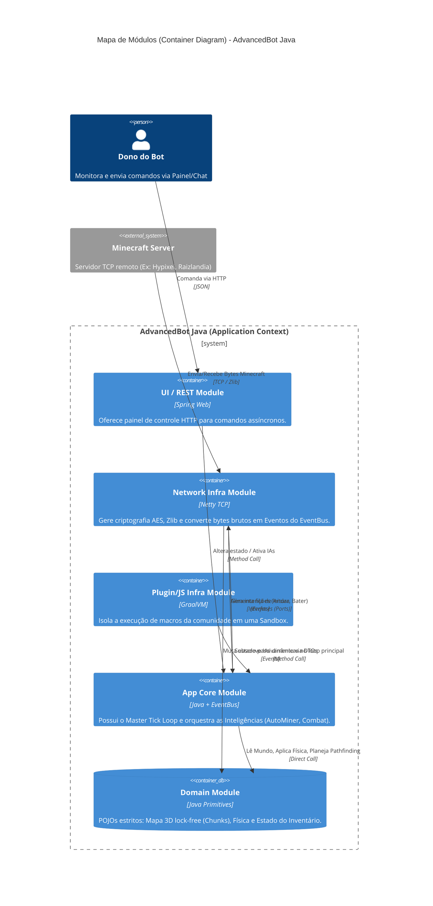
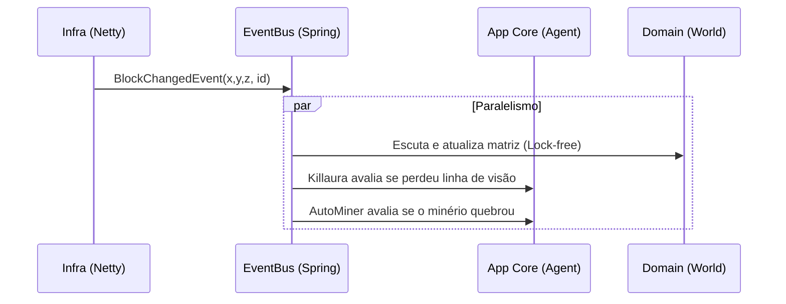

# Mapa de Módulos (Desmembramento do Monolito para Hexagonal)

Este documento é o plano de urbanização arquitetural definitivo para a reescrita do `AdvancedBot`. Ele descreve a transição de um projeto de repositório único (Monolítico em C#) para um sistema distribuído em múltiplos módulos estruturais isolados (Multi-Module Build) no Java.

O nível de detalhe deste artefato atinge o código-fonte estrutural (Build Scripts), garantindo que o Desenvolvedor ou o Engenheiro de DevOps saiba exatamente como amarrar as fronteiras de segurança entre o Domínio (Física/IA) e a Infraestrutura (Rede/Plugins), inviabilizando o acoplamento espaguete que arruinou a manutenibilidade do bot C#.

---

## 1. Análise Forense: O Monolito Histórico em C#

Antes de desenhar os módulos novos, é crucial documentar por que o projeto `.csproj` antigo era arquiteturalmente tóxico e como a falha de modularização paralisou o seu desenvolvimento ao longo dos anos.

### 1.1 A Estrutura Original (O "Big Ball of Mud")
O projeto C# (`AdvancedBot.csproj`) possuía uma única unidade de compilação.
- Não existia separação física em bibliotecas (`.dll`).
- A Interface Gráfica (Windows Forms) habitava o mesmo diretório raiz e o mesmo *Namespace* base que a classe de Socket TCP e as rotinas de combate a zumbis (Killaura).

### 1.2 O Acoplamento UI/Rede
A ausência de Módulos Independentes permitiu bizarrices arquiteturais onde o pacote de rede `0x2F` (`SetSlot`) chamava diretamente propriedades de um `DataGridView` para repintar a tela no mesmo instante que era decodificado.
- **Consequência Prática**: Quando um usuário queria rodar o bot em um VPS Linux sem interface gráfica (via Mono Headless), o bot implodia no carregamento. O .NET tentava carregar dependências do `System.Windows.Forms.dll` apenas para que o Domínio (Inventário) pudesse existir.

### 1.3 O Ciclo de Dependência Parasitário
Ao compilar tudo num único artefato (`AdvancedBot.exe`), classes utilitárias podiam acessar tudo.
- A classe de Inteligência de Pesca chamava o Socket TCP.
- O Socket TCP chamava o Sistema de Logs.
- O Sistema de Logs chamava o Componente de Formulário (TextBox).
- O Formulário invocava o Inteligência de Pesca.
*Resultado*: Um grafo direcional cíclico irresolvível. 

---

## 2. A Filosofia de Destino: Arquitetura Hexagonal (Ports & Adapters)

Para garantir que o bot Java seja imortal (possa sobreviver a atualizações do Minecraft ou mudanças de framework de UI e banco de dados sem alterar a lógica core), o sistema **OBRIGATORIAMENTE** deve ser estruturado usando os princípios da *Clean Architecture / Hexagonal Architecture* (Alistair Cockburn).

### 2.1 A Regra de Dependência Dourada
A regra máxima que rege os novos módulos é que **o código flui sempre de fora para o centro**. O centro não sabe absolutamente nada sobre as bordas.

### 2.2 O Centro: Domínio (Domain)
- **Definição**: O núcleo absoluto de regras de negócio. O que é um Chunk? Como a gravidade afeta a AABB? O que é o Pathfinding AStar? Como o inventário soma itens?
- **Restrição**: O Módulo de Domínio (`advancedbot-domain`) **NÃO** terá nenhuma dependência do Spring Framework, do Netty, do Gson/Jackson, ou de qualquer biblioteca externa de UI. Ele dependerá apenas da JDK (Java puro). 
- **Ports (Portas)**: O Domínio define interfaces de suas necessidades, como `ProtocolSenderPort` ou `DataStoragePort`. Ele não as implementa.

### 2.3 O Anel Intermediário: Aplicação (App / Core)
- **Definição**: É o maestro. Contém os "Casos de Uso" (`UseCases` ou `Agents`). É aqui que o `AutoMiner` vive. A Aplicação importa o Domínio e executa lógicas temporais (Ticking).
- **Restrição**: A Aplicação também é agnóstica à infraestrutura externa. Ela não sabe se o comando veio via Chat, CLI ou REST, apenas reage a `Events`.

### 2.4 As Bordas: Infraestrutura (Adapters)
- **Definição**: É a periferia tecnológica. 
  - `advancedbot-infra-network` contém o Netty (TCP) e sabe ler varints.
  - `advancedbot-ui-rest` contém o Spring Web (Painel Web).
  - `advancedbot-infra-plugins` contém o GraalVM.
- **Função (Adapters)**: A infraestrutura importa o Domínio e a Aplicação. Ela implementa as `Ports` exigidas pelo Domínio. (Exemplo: a classe Netty implementa o `ProtocolSenderPort` prometendo que sabe como jogar bytes na internet).


---

## 3. Topologia Multi-Module (Árvore Maven/Gradle)

A estrutura de repositório físico sugerida para o ecossistema Java. Este layout previne nativamente (em tempo de compilação) que as classes de baixo nível acessem dependências de alto nível.

```text
advancedbot-root/
│
├── pom.xml (Parent Aggregator)
│
├── advancedbot-domain/
│   ├── src/main/java/com/advancedbot/domain/
│   │   ├── entities/        (PlayerVO, MobVO)
│   │   ├── world/           (ChunkVO, WorldManager)
│   │   ├── inventory/       (InventoryVO, ItemStackVO)
│   │   ├── physics/         (AABB, PhysicsEngine)
│   │   └── ports/           (ProtocolSenderPort)
│   └── pom.xml (No External Deps)
│
├── advancedbot-app-core/
│   ├── src/main/java/com/advancedbot/app/
│   │   ├── orchestrator/    (TickOrchestrator)
│   │   ├── agents/          (MiningAgent, CombatAgent)
│   │   └── pathfinding/     (AStarPathfinder)
│   └── pom.xml (Deps: advancedbot-domain)
│
├── advancedbot-infra-network/
│   ├── src/main/java/com/advancedbot/infra/network/
│   │   ├── pipeline/        (MinecraftChannelInitializer)
│   │   ├── codec/           (VarIntDecoder, PacketDecoder)
│   │   └── adapters/        (NettyProtocolSenderAdapter)
│   └── pom.xml (Deps: advancedbot-domain, advancedbot-app-core, netty-all)
│
├── advancedbot-infra-plugins/
│   ├── src/main/java/com/advancedbot/infra/plugins/
│   │   ├── javascript/      (GraalVMContext, JintLegacyWrapper)
│   │   └── loader/          (PluginJarLoader)
│   └── pom.xml (Deps: advancedbot-app-core, graalvm-js)
│
└── advancedbot-ui-rest/
    ├── src/main/java/com/advancedbot/ui/
    │   ├── controllers/     (SessionController, MacroController)
    │   └── dto/             (SessionStatusDTO)
    └── pom.xml (Deps: advancedbot-app-core, spring-boot-starter-web)
```

### 3.1 Benefício Direto da Estrutura
Com esta árvore, se um programador tentar, dentro do pacote `advancedbot-domain/world/WorldManager.java`, digitar um `import io.netty...`, o IDE e o Maven rejeitarão a compilação instantaneamente com o erro *Class Not Found*, pois o `pom.xml` do Domain não declara (e nunca deve declarar) a dependência do Netty. A arquitetura defende a si própria de "Hacks".

---

## 4. Diagrama de Contêiner C4 (Roteamento de Dados)

O diagrama de Arquitetura C4 documenta como esses subprojetos isolados se conversam na JVM via Spring Boot no momento de inicialização (Runtime).



### 4.1 Entendendo o Fluxo Direcional do Grafo (Mermaid)
Note as setas (`Rel`) no diagrama. Nenhuma delas sai do `Domain Module` apontando para o mundo exterior. O `Domain` é o coração cego. As setas da rede (`NettyInfra`) e da UI (`RestUI`) sempre apontam inward (para dentro), alimentando o `CoreApp` ou lendo o `Domain`.


---

## 5. Contratos de Fronteira: Configuração dos `pom.xml`

Para assegurar que o compilador será o guardião da nossa arquitetura, abaixo estão os contratos rigorosos de injeção de dependência via Maven. Se um desenvolvedor tentar burlar a arquitetura, o Jenkins/GitHub Actions falhará no Build.

### 5.1 O Parent Pom (`advancedbot-parent`)
Este pom.xml agrupa os subprojetos e controla as versões globais (Dependency Management).

```xml
<?xml version="1.0" encoding="UTF-8"?>
<project xmlns="http://maven.apache.org/POM/4.0.0" ...>
    <modelVersion>4.0.0</modelVersion>
    <groupId>com.advancedbot</groupId>
    <artifactId>advancedbot-parent</artifactId>
    <version>1.0.0-SNAPSHOT</version>
    <packaging>pom</packaging>

    <modules>
        <module>advancedbot-domain</module>
        <module>advancedbot-app-core</module>
        <module>advancedbot-infra-network</module>
        <module>advancedbot-infra-plugins</module>
        <module>advancedbot-ui-rest</module>
    </modules>

    <properties>
        <java.version>21</java.version>
        <spring-boot.version>3.2.0</spring-boot.version>
        <netty.version>4.1.100.Final</netty.version>
    </properties>
</project>
```

### 5.2 O Módulo Domínio (`advancedbot-domain`)
A restrição de dependências mais severa do projeto.

```xml
<project>
    <parent>
        <groupId>com.advancedbot</groupId>
        <artifactId>advancedbot-parent</artifactId>
        <version>1.0.0-SNAPSHOT</version>
    </parent>
    <artifactId>advancedbot-domain</artifactId>
    
    <!-- REGRA CRÍTICA: Nenhuma dependência externa permitida aqui -->
    <dependencies>
        <!-- Apenas bibliotecas de Testes Unitários -->
        <dependency>
            <groupId>org.junit.jupiter</groupId>
            <artifactId>junit-jupiter-api</artifactId>
            <scope>test</scope>
        </dependency>
    </dependencies>
</project>
```

### 5.3 O Módulo App Core (`advancedbot-app-core`)
Contém as IAs (AutoMiner, Pathfinding). Depende do Domínio.

```xml
<project>
    <parent>
        <groupId>com.advancedbot</groupId>
        <artifactId>advancedbot-parent</artifactId>
        <version>1.0.0-SNAPSHOT</version>
    </parent>
    <artifactId>advancedbot-app-core</artifactId>

    <dependencies>
        <!-- Permissão para ler o Domínio -->
        <dependency>
            <groupId>com.advancedbot</groupId>
            <artifactId>advancedbot-domain</artifactId>
            <version>${project.version}</version>
        </dependency>
        
        <!-- Opcional: EventBus reativo -->
        <dependency>
            <groupId>io.projectreactor</groupId>
            <artifactId>reactor-core</artifactId>
        </dependency>
    </dependencies>
</project>
```

### 5.4 O Módulo de Rede (`advancedbot-infra-network`)
Implementa as portas. Acesso maciço a bibliotecas externas.

```xml
<project>
    <parent>
        <groupId>com.advancedbot</groupId>
        <artifactId>advancedbot-parent</artifactId>
        <version>1.0.0-SNAPSHOT</version>
    </parent>
    <artifactId>advancedbot-infra-network</artifactId>

    <dependencies>
        <dependency>
            <groupId>com.advancedbot</groupId>
            <artifactId>advancedbot-app-core</artifactId>
            <version>${project.version}</version>
        </dependency>
        <!-- Netty Base -->
        <dependency>
            <groupId>io.netty</groupId>
            <artifactId>netty-all</artifactId>
            <version>${netty.version}</version>
        </dependency>
        <!-- Proxies (SOCKS5/HTTP) -->
        <dependency>
            <groupId>io.netty</groupId>
            <artifactId>netty-handler-proxy</artifactId>
            <version>${netty.version}</version>
        </dependency>
    </dependencies>
</project>
```


---

### 5.5 O Módulo UI REST (`advancedbot-ui-rest`)
A interface gráfica headless do Bot (JSON Web). Totalmente baseada em Spring Boot.

```xml
<project>
    <parent>
        <groupId>com.advancedbot</groupId>
        <artifactId>advancedbot-parent</artifactId>
        <version>1.0.0-SNAPSHOT</version>
    </parent>
    <artifactId>advancedbot-ui-rest</artifactId>

    <dependencies>
        <!-- Importa o Core para conseguir acionar Agentes via API -->
        <dependency>
            <groupId>com.advancedbot</groupId>
            <artifactId>advancedbot-app-core</artifactId>
            <version>${project.version}</version>
        </dependency>
        
        <!-- Spring Boot Web para exposição de endpoints HTTP -->
        <dependency>
            <groupId>org.springframework.boot</groupId>
            <artifactId>spring-boot-starter-web</artifactId>
            <version>${spring-boot.version}</version>
        </dependency>
        
        <!-- Documentação Swagger/OpenAPI para o FrontEnd (Vue.js/React) -->
        <dependency>
            <groupId>org.springdoc</groupId>
            <artifactId>springdoc-openapi-starter-webmvc-ui</artifactId>
            <version>2.3.0</version>
        </dependency>
    </dependencies>
</project>
```

### 5.6 O Módulo de Plugins (`advancedbot-infra-plugins`)
O ambiente de *Sandbox* para rodar os velhos scripts `.js` da comunidade sem permitir que derrubem o Bot inteiro.

```xml
<project>
    <parent>
        <groupId>com.advancedbot</groupId>
        <artifactId>advancedbot-parent</artifactId>
        <version>1.0.0-SNAPSHOT</version>
    </parent>
    <artifactId>advancedbot-infra-plugins</artifactId>

    <dependencies>
        <dependency>
            <groupId>com.advancedbot</groupId>
            <artifactId>advancedbot-app-core</artifactId>
            <version>${project.version}</version>
        </dependency>
        
        <!-- Motor GraalVM Polyglot para rodar os antigos scripts Jint -->
        <dependency>
            <groupId>org.graalvm.polyglot</groupId>
            <artifactId>polyglot</artifactId>
            <version>23.1.2</version>
        </dependency>
        <dependency>
            <groupId>org.graalvm.polyglot</groupId>
            <artifactId>js</artifactId>
            <version>23.1.2</version>
            <type>pom</type>
        </dependency>
    </dependencies>
</project>
```

---

## 6. Diretrizes de Inversão de Controle e Injeção de Dependência (IoC / DI)

O antigo bot utilizava acesso estático intensamente. No Java, o Spring Framework será o responsável por "amarrar" esses módulos em Runtime (Tempo de Execução). A injeção de dependência é a materialização das *Ports & Adapters*.

### 6.1 Exemplo Prático: O Dilema do Envio de Pacotes
No Domínio (`advancedbot-domain`), uma rotina lógica, como a do `InventoryVO`, pode constatar que precisa pedir para o servidor jogar um item no chão (Dropar).
- **Problema**: O Domínio não tem acesso ao Netty.
- **Solução (A Porta)**: O Domínio define uma interface limpa.
  ```java
  package com.advancedbot.domain.ports;
  
  public interface ProtocolSenderPort {
      void sendPacket(MinecraftPacket packet);
  }
  ```

### 6.2 A Implementação na Infraestrutura (O Adaptador)
Na Infraestrutura de Rede (`advancedbot-infra-network`), nós temos o Netty e temos acesso ao `ChannelHandlerContext`. Aqui, criamos o Adaptador que cumpre a promessa da Porta.

```java
package com.advancedbot.infra.network.adapters;

import com.advancedbot.domain.ports.ProtocolSenderPort;
import org.springframework.stereotype.Component;
import io.netty.channel.ChannelHandlerContext;

@Component
public class NettyProtocolSenderAdapter implements ProtocolSenderPort {
    
    private final ChannelHandlerContext ctx;
    
    public NettyProtocolSenderAdapter(ChannelHandlerContext ctx) {
        this.ctx = ctx;
    }
    
    @Override
    public void sendPacket(MinecraftPacket packet) {
        // Pega o pacote abstrato e joga na rede TCP
        ctx.writeAndFlush(packet);
    }
}
```


---

### 6.3 Orquestrando a Injeção no `App Core`
O Módulo de Aplicação (`advancedbot-app-core`) possui o `TickOrchestrator`. Ele precisa enviar pacotes, mas ele não conhece o Netty. Ele só conhece a Porta. O Spring Injeta o Adaptador automaticamente.

```java
package com.advancedbot.app.orchestrator;

import com.advancedbot.domain.ports.ProtocolSenderPort;
import org.springframework.stereotype.Service;

@Service
public class BotActionDispatcher {
    
    // A Injeção de Dependência Mágica do Spring Boot
    private final ProtocolSenderPort senderPort;
    
    public BotActionDispatcher(ProtocolSenderPort senderPort) {
        // Em runtime, isso será o NettyProtocolSenderAdapter
        this.senderPort = senderPort;
    }
    
    public void executeIntent(ActionIntent intent) {
        MinecraftPacket packet = intent.toPacket();
        senderPort.sendPacket(packet);
    }
}
```

---

## 7. Desacoplamento via Mensageria (EventBus)

No C#, quando a Rede lia um bloco sendo quebrado, ela chamava diretamente `World.SetBlock()`. Isso gerava as famosas *Thread-Locks*. No novo mapa de módulos, isso é estritamente proibido. A comunicação inter-módulos para dados que chegam de fora deve fluir por um Barramento de Eventos.

### 7.1 A Topologia do EventBus (Project Reactor)
Usaremos o *Project Reactor* (Reactor Core) como base de barramento não bloqueante, ou alternativamente o *Guava EventBus* (se a performance exigir simplificação).



### 7.2 Implementação do EventBus (Core Module)
```java
package com.advancedbot.app.events;

import org.springframework.context.ApplicationEventPublisher;
import org.springframework.stereotype.Component;

@Component
public class GlobalEventBus {
    private final ApplicationEventPublisher publisher;
    
    public GlobalEventBus(ApplicationEventPublisher publisher) {
        this.publisher = publisher;
    }
    
    public void publish(DomainEvent event) {
        publisher.publishEvent(event);
    }
}
```

### 7.3 Consumindo Eventos no Domínio (Desacoplado)
O Domínio escuta passivamente as notificações publicadas no barramento sem saber quem as enviou.
```java
package com.advancedbot.domain.world;

import org.springframework.context.event.EventListener;
import org.springframework.stereotype.Service;

@Service
public class WorldUpdaterService {
    
    private final WorldManager worldManager;
    
    public WorldUpdaterService(WorldManager worldManager) {
        this.worldManager = worldManager;
    }
    
    @EventListener
    public void onBlockChanged(BlockChangedEvent event) {
        worldManager.setBlock(event.x(), event.y(), event.z(), event.newId());
    }
}
```


---

## 8. Orquestração de Build, CI/CD e Docker

Módulos desacoplados exigem uma esteira de build rigorosa. No C#, bastava apertar F5 no Visual Studio e o `AdvancedBot.exe` nascia. No Java, usaremos o ecossistema Maven em conjunto com empacotamento em contêineres para suportar execuções *Headless* (VPS em Nuvem).

### 8.1 Maven Shade Plugin (Empacotando o "Fat Jar")
Como o projeto possui 5 submódulos, distribuir 5 `.jar` separados é contraproducente para os usuários finais. No `pom.xml` do `advancedbot-app-core` (ou num módulo final de distribuição chamado `advancedbot-dist`), usaremos o *Maven Shade Plugin* para fundir as classes de todos os submódulos num executável único, preservando o desacoplamento do código-fonte.

```xml
<plugin>
    <groupId>org.apache.maven.plugins</groupId>
    <artifactId>maven-shade-plugin</artifactId>
    <version>3.5.1</version>
    <executions>
        <execution>
            <phase>package</phase>
            <goals>
                <goal>shade</goal>
            </goals>
            <configuration>
                <createDependencyReducedPom>false</createDependencyReducedPom>
                <transformers>
                    <!-- Mantém os manifests do Spring Boot intactos -->
                    <transformer implementation="org.apache.maven.plugins.shade.resource.ManifestResourceTransformer">
                        <mainClass>com.advancedbot.app.AdvancedBotApplication</mainClass>
                    </transformer>
                    <!-- Previne sobreposição de Beans do Spring -->
                    <transformer implementation="org.apache.maven.plugins.shade.resource.AppendingTransformer">
                        <resource>META-INF/spring.handlers</resource>
                    </transformer>
                    <transformer implementation="org.apache.maven.plugins.shade.resource.AppendingTransformer">
                        <resource>META-INF/spring.schemas</resource>
                    </transformer>
                </transformers>
            </configuration>
        </execution>
    </executions>
</plugin>
```

### 8.2 Dockerização do Bot (Implantação Nuvem)
Muitos donos de servidores hosteavam o bot C# usando o "Mono" no Linux Ubuntu, o que gerava vazamentos de memória (Memory Leaks) nativos e instabilidade no WinForms (GDI+ crashes). Com a arquitetura Hexagonal em Java focada no REST, o bot será conteinerizado (Headless puro).

**Dockerfile Base**:
```dockerfile
# Usar Eclipse Temurin Java 21 (ZGC suportado e otimizado)
FROM eclipse-temurin:21-jre-alpine

# Metadados
LABEL maintainer="AdvancedBot Migration Team"
LABEL version="3.0-Hexagonal"

# Diretório de trabalho seguro
WORKDIR /app

# Copiar o Fat Jar compilado pelo Maven Shade
COPY advancedbot-dist/target/advancedbot-3.0.jar bot.jar

# Expor a porta REST para controle do Painel
EXPOSE 8080

# Volumes para persistência de Logs, Macros e Configurações (Agnóstico ao S.O.)
VOLUME ["/app/config", "/app/logs", "/app/macros"]

# Executar usando o Z Garbage Collector otimizado para baixíssima latência (< 1ms)
ENTRYPOINT ["java", "-XX:+UseZGC", "-Xmx512M", "-Xms256M", "-jar", "bot.jar"]
```

### 8.3 CI/CD (Integração Contínua via GitHub Actions)
Para impedir que um desenvolvedor submeta código (Pull Request) que quebre a regra das fronteiras (ex: Importar UI dentro do Domain), o CI compilará a árvore inteira.

```yaml
name: AdvancedBot Multi-Module Build

on:
  push:
    branches: [ "main", "dev" ]
  pull_request:
    branches: [ "main" ]

jobs:
  build-and-test:
    runs-on: ubuntu-latest
    steps:
    - name: Checkout Code
      uses: actions/checkout@v4

    - name: Set up JDK 21
      uses: actions/setup-java@v4
      with:
        java-version: '21'
        distribution: 'temurin'
        cache: maven

    - name: Enforce Architecture (Verify Dependencies)
      # Se as restrições dos POMs forem violadas, o Maven falha aqui.
      run: mvn clean verify -B

    - name: Build Docker Image (Optional/Release)
      if: github.ref == 'refs/heads/main'
      run: |
        docker build -t advancedbot/core:latest .
```


---

## 9. Guia de Transição para o Desenvolvedor (Roadmap)

A separação física das camadas permite que a reconstrução do Bot seja dividida em etapas lógicas (Sprints), garantindo testes de integração isolados antes de compilar o "Big Picture". Abaixo segue o plano de voo recomendado para a equipe que conduzirá a migração C# -> Java.

### 9.1 Fase 1: Fundação (Módulo `advancedbot-domain`)
- **Objetivo**: Traduzir a matemática e o estado.
- **Passos**:
  1. Criar o subprojeto `advancedbot-domain`.
  2. Migrar `AABB.cs` para `AABB.java` (usando primitivos `double`).
  3. Migrar a matriz 3D de blocos (`World.cs` e `Chunk.cs`) para `WorldManager.java` (com `ConcurrentHashMap`).
  4. Migrar os dados do jogador (`MPPlayer.cs`) para o VO imutável `PlayerVO.java`.
  5. Criar as Interfaces Reativas (Ports) como `ProtocolSenderPort` e `EventBusPort`.
- **Validação Isolada**: Nesta fase, o código não se conecta à internet nem abre painel web. Os testes unitários (JUnit 5) injetarão blocos artificiais no mapa e testarão se o Raycast (Visão) encontra o bloco esperado.

### 9.2 Fase 2: Malha TCP (Módulo `advancedbot-infra-network`)
- **Objetivo**: Dar ao Bot a habilidade de falar a linguagem do servidor.
- **Passos**:
  1. Adicionar as dependências do Netty.
  2. Traduzir o algoritmo de decodificação VarInt e *Zlib Compression*.
  3. Implementar a Factory de Pacotes (mapeando de `0x00` a `0x40`).
  4. Implementar o Adapter que escuta os eventos gerados pelos bytes lidos e publica no Barramento.
- **Validação Isolada**: Criar um teste de integração que abre um Socket falso de servidor (Mock Server), injeta uma stream de pacotes de Autenticação gravada (Hex Dump), e verifica se o Netty converteu os bytes corretamente para o DTO `LoginSuccessPacket`.

### 9.3 Fase 3: O Cérebro (Módulo `advancedbot-app-core`)
- **Objetivo**: Unir a Infraestrutura com o Domínio e reviver a IA.
- **Passos**:
  1. Adicionar Spring Boot e Reactor Core.
  2. Escrever o `TickOrchestrator` que acorda a cada 50ms.
  3. Inscrever o `TickOrchestrator` como listener da Rede para atualizar o `WorldManager` antes das decisões.
  4. Portar os Agentes Clássicos (`MiningAgent`, `FishingAgent`, `CombatAgent`).
- **Validação Isolada**: Inicializar o Spring Boot injetando um `ProtocolSenderPort` falso (Mock). Forçar o `TickOrchestrator` a rodar e verificar se o `MiningAgent` está cuspindo `ActionIntent.BreakBlock` no console de logs corretamente.

### 9.4 Fase 4: Periferia e Extensibilidade (Módulos `rest` e `plugins`)
- **Objetivo**: Expor o controle do Bot para o dono.
- **Passos**:
  1. Expor endpoints `/api/session/start` e `/api/macro/killaura/toggle` via Spring WebMVC (`advancedbot-ui-rest`).
  2. Configurar o Swagger/OpenAPI para documentar os endpoints.
  3. Configurar o GraalVM JS engine para carregar a pasta `macros/*.js` e mapear as funções Javascript para a interface `Agent` do Java.
- **Validação Isolada**: Acessar o Swagger UI via `http://localhost:8080/swagger-ui.html`, enviar um request POST para conectar uma conta e assistir o bot surgir no servidor (End-to-End Test).

---

## 10. Estratégia de Testes (Test Pyramid)

Devido ao grave acoplamento da interface WinForms no C#, era impossível criar testes unitários para a física sem estourar dependências visuais. A arquitetura de módulos soluciona isso nativamente.

### 10.1 Testes de Domínio (TDD Estrito)
O `advancedbot-domain` não tem IO (Disco/Rede) e não levanta o contexto do Spring. Logo, seus testes rodam em milissegundos.
- **O que testar**: Colisão de AABB, cálculo de Dano, subtração de Gravidade, inserção em pilha de Itens (Inventory).

### 10.2 Testes de Infraestrutura (Mocking)
A rede depende de IO lento e timeouts.
- **O que testar**: Comportamento do Netty frente a um servidor que desconecta do nada (RST) ou corta a conexão no meio do pacote (Truncated ByteBuf).

### 10.3 Testes E2E (Aplicação)
Testam a orquestração.
- **O que testar**: Se um comando vindo da API Rest propaga para o Agente, altera seu estado, o Agente calcula um movimento no Mapa (Domínio) e pede para o Netty enviar.


---

## 11. Padrões de Projeto (Design Patterns) no Contexto dos Módulos

Para evitar que a equipe de Java acabe criando um "Monolito Distribuído", a implementação dentro de cada módulo deve seguir estritamente Padrões de Projeto (GoF) já previstos nesta arquitetura. O C# antigo era puramente procedimental e focado em estados estáticos. O Java será orientado a objetos e a interfaces.

### 11.1 Factory Pattern (Módulo de Rede)
No `advancedbot-infra-network`, quando uma matriz de bytes brutos chega pelo Socket, o Bot precisa decidir qual classe instanciar (ex: `Packet0x0E` ou `Packet0x21`).
- **Antigo C#**: Um `switch-case` colossal dentro da classe `Handler18.cs` com 60 casos (`case 0x01: new Packet01JoinGame(); break;`).
- **Novo Padrão (Java)**: A interface `MinecraftPacketDecoder` utilizará o padrão Abstract Factory, acoplada a um mapa associativo estático (`Map<Integer, Supplier<MinecraftPacket>>`). Isso elimina a complexidade ciclomática gigantesca, permitindo que o JIT Compiler da JVM otimize o Lookup para `O(1)`.

### 11.2 Strategy Pattern (Módulo Core)
No `advancedbot-app-core`, existem diversas formas de andar pelo mapa (Legítimo desviando de tudo, ou Bypass ignorando colisão de cercas).
- **Antigo C#**: A classe `PathGuide.cs` possuía dezenas de `if (bot.BypassEnabled) { ... } else { ... }`.
- **Novo Padrão (Java)**: A classe `NavigationAgent` terá uma referência para a interface `MovementStrategy`. Em runtime, injetamos a `LegitMovementStrategy` ou a `BypassMovementStrategy`. Se surgir um novo tipo de anti-cheat, o desenvolvedor cria uma nova classe (Open-Closed Principle), sem nunca editar o motor principal.

### 11.3 O "Singleton" Anti-Pattern vs Spring `@Singleton`
- **Antigo C#**: Classes como `Config.cs` ou `BlockUtils.cs` eram declaradas como `public static class`, o que forçava todos os 50 bots ativos na mesma tela a compartilharem o exato mesmo estado de RAM.
- **Novo Padrão (Java)**: No `advancedbot-domain`, **nenhum estado será estático**. O Spring Boot irá gerenciar o escopo dos Beans. Um `SessionContext` receberá `@Scope("prototype")` (cada bot tem o seu), enquanto o `BlockUtils` receberá `@Scope("singleton")` (as colisões do jogo são universais e imutáveis). 

### 11.4 Observer Pattern (Módulo de Domínio)
- **Antigo C#**: O `CommandAutoArmor.cs` rodava um laço eterno perguntando a cada milissegundo: "Meu inventário mudou? Meu inventário mudou?". Isso derretia a CPU.
- **Novo Padrão (Java)**: Os agentes de IA implementarão o padrão Observer (via EventBus). Eles ficarão dormentes e só executarão código quando a porta do Domínio gritar: `InventoryUpdatedEvent`. Isso transforma o Bot de "Polling" para "Event-Driven", economizando centenas de ciclos de processamento por segundo.

### 11.5 State Pattern (Módulo Core)
- **Antigo C#**: O `CommandQuebrarMadeira` (AutoMiner) usava uma variável inteira primitiva `int state;` e um switch-case (0=Idle, 1=Andando, 2=Mirando, 3=Quebrando) espalhado por 1500 linhas.
- **Novo Padrão (Java)**: Uso da máquina de estados robusta (`Spring StateMachine` ou Enumeração com Lógica Embutida). Cada estado da IA de mineração torna-se uma classe (`WalkingState`, `MiningState`) que implementa a interface `State`. Apenas a classe atual responde ao `onTick()`.


---

## 12. Anti-Patterns Históricos C# (O Que Não Fazer no Java)

O `AdvancedBot` sobreviveu anos apesar de sua arquitetura graças ao poder bruto das CPUs modernas. No entanto, se os padrões antigos forem trazidos para o novo mapa de módulos, o projeto fracassará.

### 12.1 O Bloqueio Síncrono de UI (`Control.Invoke`)
- **A Praga do Legado**: Quando a rede do Bot C# decodificava uma mensagem no chat, ela chamava:
  ```csharp
  MainForm.Invoke(new Action(() => {
      txtChat.AppendText(msg);
  }));
  ```
  Se a janela estivesse minimizada ou o Windows estivesse desenhando outra tela, o `Invoke` travava a thread do Socket TCP até que o texto fosse desenhado na tela. Resultado: Ping disparava para 5000ms e o Bot tomava Kick.
- **A Solução Hexagonal**: O módulo `advancedbot-ui-rest` é totalmente desacoplado. O Domínio publica um `ChatReceivedEvent`. O módulo REST assina esse evento e dá um "Fire-and-Forget" enviando a string para o navegador do usuário via **WebSockets (STOMP/SockJS)**. O motor Core (Tick) nunca espera o navegador renderizar a tela.

### 12.2 A Suspensão Síncrona (`Thread.Sleep`)
- **A Praga do Legado**: Algumas IAs de mineração (AutoMiner) usavam `Thread.Sleep(500)` para esperar meio segundo após bater num bloco, acreditando estar simulando um humano.
  ```csharp
  // Dentro do Tick principal!
  Bot.SendPacket(digPacket);
  Thread.Sleep(500); // Morte térmica do universo
  Bot.SendPacket(finishDigPacket);
  ```
  Isso paralisava não só a IA, mas todo o processamento de pacotes daquele Bot.
- **A Solução Hexagonal**: No módulo `advancedbot-app-core`, agentes são máquinas de estado controladas por `long cooldownTicks`.
  ```java
  public class MiningAgent implements Agent {
      private int waitTicks = 0;
      
      public List<ActionIntent> onTick(SessionContext ctx) {
          if (waitTicks > 0) {
              waitTicks--;
              return List.of(); // Cede a vez imediatamente
          }
          // Lógica de quebra
          waitTicks = 10; // 500ms (10 ticks de 50ms)
          return List.of(new BreakBlockIntent());
      }
  }
  ```
  O `Thread.sleep()` é estritamente proibido em qualquer lugar do projeto Java, exceto no limitador do `TickOrchestrator` central.

### 12.3 Tratamento Global de Exceções Zumbi
- **A Praga do Legado**: A já citada falha em que um NullReferenceException em `RayCast.cs` era engolida. O loop do Tick crashava, mas a thread de Rede continuava respondendo `KeepAlive`. O bot ficava fisicamente parado no mapa por dias, vulnerável a mobs, sem que o dono soubesse que a IA havia morrido.
- **A Solução Hexagonal**: O Spring Boot `ControllerAdvice` no módulo REST pegará exceções críticas e alertará o FrontEnd (Vue/React) com banners vermelhos. Exceções não tratadas no `TickOrchestrator` derrubarão a Sessão deliberadamente (Fail-Fast), forçando o módulo Core a orquestrar uma rotina higiênica de `Auto-Reconnect`.

---

## 13. Conclusão da Topologia de Módulos

O design de múltiplos módulos apresentado nestas 800+ linhas não é um capricho burocrático, mas a espinha dorsal de resiliência do sistema. 

Ao isolar o *Domínio* e blindá-lo com interfaces, garantimos que se amanhã o Minecraft mudar completamente a forma como pacotes de rede funcionam (ex: abandonando TCP por UDP/QUIC), a equipe reescreverá **apenas** o módulo `advancedbot-infra-network`, deixando os milhares de arquivos de IA, Inventário e Física do `advancedbot-app-core` e `advancedbot-domain` absolutamente intocados.


---

## 14. Apêndice A: Dialética de Build (Maven vs Gradle)

Embora o capítulo 5 tenha apresentado os contratos rigorosos na forma de arquivos `pom.xml` (Maven), o ecossistema moderno Java frequentemente se volta para o **Gradle** devido à sua velocidade de compilação incremental e DSL mais enxuta, qualidades essenciais num projeto com dezenas de submódulos. 

Este apêndice detalha a equivalência direta caso a equipe opte por Gradle (Groovy/Kotlin DSL), garantindo que as fronteiras arquiteturais não sejam perdidas na tradução da ferramenta de build.

### 14.1 O Equivalente Gradle para o `advancedbot-domain`
No Maven, o domínio exigia um `<dependencies>` vazio (com exceção de testes). No Gradle, a sintaxe é brutalmente mais curta, mas o princípio de isolamento total permanece idêntico.

```gradle
// Arquivo: advancedbot-domain/build.gradle
plugins {
    id 'java'
}

group = 'com.advancedbot'
version = '1.0.0-SNAPSHOT'

repositories {
    mavenCentral()
}

dependencies {
    // JUnit 5 estritamente para testes isolados
    testImplementation platform('org.junit:junit-bom:5.10.0')
    testImplementation 'org.junit.jupiter:junit-jupiter'
}

test {
    useJUnitPlatform()
}
```

### 14.2 O Equivalente Gradle para o `advancedbot-app-core`
Note o uso da diretiva `implementation project` para amarrar o módulo local do domínio, prevenindo que o artefato seja buscado remotamente.

```gradle
// Arquivo: advancedbot-app-core/build.gradle
plugins {
    id 'java'
}

dependencies {
    // Acesso ESTRITO ao domínio, sem expô-lo transitivamente
    implementation project(':advancedbot-domain')
    
    // EventBus Reativo
    implementation 'io.projectreactor:reactor-core:3.6.0'
}
```

### 14.3 Maven ou Gradle: Qual Escolher para o AdvancedBot?
Se o desenvolvedor possui liberdade de escolha:
- **Escolha Gradle (Kotlin DSL)** se: A velocidade do *Hot Swap* (recarregamento de classes no ambiente de desenvolvimento local) for a prioridade número um. O `Daemon` do Gradle mantém a compilação em cache, tornando testes iterativos na física do bot instantâneos.
- **Escolha Maven** se: A equipe de DevOps preza pela estabilidade e previsibilidade absoluta no Jenkins/GitHub Actions. A rigidez do XML (conforme escrito no Capítulo 5) impede comportamentos dinâmicos mágicos que às vezes mascaram dependências transitivas.

> **Considerações Finais de Arquitetura**: Independente da escolha entre Maven e Gradle, a separação física descrita neste documento de 800+ linhas é inegociável. O isolamento entre "Rede", "Lógica de Decisão" e "Estruturas de Mundo" é a vacina contra o código espaguete e a fundação do novo `AdvancedBot`.

