# EPIC-VIEWER-3D — Auditoria, Arquitetura e Plano de Implementação

> Documento de arquitetura. Nenhum código foi alterado para produzi-lo. Sucessor conceitual do EPIC-VIEWER-04 (que fica pausado): aquele epic tratava do Debug Viewer 2D (SVG); este epic é o Viewer 3D completo, equivalente funcional ao antigo `ViewForm` do AdvancedBot C#.

## 0. Objetivo

Viewer 3D = ferramenta de debug operacional, não estética. Deve permitir que o operador identifique a causa de um comportamento errado de macro **olhando só o Viewer**, sem vasculhar logs ou estado interno. Equivalente funcional ao `ViewForm` (C#), portado para Java + Spring Boot (backend) + React (frontend).

---

## 1. O que já existe no domínio (utilizável hoje)

| Dado | Onde vive | Estado |
|---|---|---|
| Blocos por chunk (id+metadata) | `Chunk`/`SecaoDeChunk` dentro de `Mundo` (`domain/bot/Mundo.java`) | Completo, 16 seções de 16×16×16, mantido em memória até descarregamento explícito |
| Bloco único / mudança de bloco | `BlockChange`, `MultiBlockChange` (protocolo v1_8) | Completo, já grava em `Mundo.definirBloco` |
| Placas (signs) | `Mundo.placasPorPosicao` | Completo, texto apenas, nunca purgado por distância |
| Posição/rotação/física do bot | `SessaoDeJogo` (x,y,z,yaw,pitch,motion,onGround) | Completo |
| Vida/fome/saturação/gamemode/dimensão do bot | `SessaoDeJogo` | Completo |
| Inventário/equipamento do bot | `InventarioDoJogador` | Completo, 45 slots + armadura + hotbar |
| Outras entidades (posição, yaw/pitch/headYaw, velocidade, equipamento, efeitos, animação, status) | `EntidadeRemota`/`EntidadeJogadorRemoto`/`EntidadeMob`, registro em `EntidadesDoMundo` | **Modelo de domínio já completo**, mas DTO/REST expõe só x/y/z/yaw/pitch (ver seção 2) |
| Tab list (outros jogadores) | `ListaDeJogadores`/`JogadorConhecido` | Só nome/nome de exibição |
| Pathfinding (caminho calculado) | `BuscadorDeCaminho` (A*), `GuiaDeCaminho.pontos()` | Completo, já exposto via REST (`/mundo/caminho-atual`) — este endpoint nasceu do EPIC-VIEWER-04 |
| Raycast | `Mundo.tracarRaio` | Completo, já exposto via REST (`/mundo/raycast`) |
| WebSocket de eventos | `BotEventsWebSocketHandler` (`/ws/bots/{id}/events`, `/ws/events`) | Canal existe, mas só carrega `"log"` e `"estado"` (execução) — nada de mundo/posição ainda |
| Multi-bot isolado | `Bot`/`SessaoDeJogo` por instância, `GerenciadorDeBots` | Cada bot tem `Mundo`/`EntidadesDoMundo` próprios |

**Conclusão da seção**: o domínio Java já guarda praticamente tudo que um Viewer 3D básico precisa (terreno + entidades + inventário + path + raycast). O gargalo não é "faltam dados no domínio", é "faltam DTOs/endpoints/canal de streaming para expor esse domínio em volume e em tempo real".

---

## 2. O que NÃO existe (gaps confirmados por grep, não suposição)

1. **Endpoint de exportação em lote de chunks/blocos** — só existe lookup de bloco único (`/mundo/bloco?x&y&z`). Nada como `GET /mundo/chunks?range=`.
2. **Biome e luz (skylight/blocklight)** — o codec de chunk lê esses bytes da rede mas descarta ("consumido sem expor"). Precisa mudar o codec para reter.
3. **Block entities/tile entities** (baú, fornalha, spawner) — inexistente, exceto placas.
4. **Pacotes de partícula** — zero suporte, nenhuma classe `Particle*`.
5. **DTO de entidade incompleto** — `EntidadeResponse` só tem id/tipo/x/y/z/yaw/pitch; falta velocidade, headYaw, equipamento, efeitos — apesar do domínio (`EntidadeRemota`) já ter tudo isso.
6. **Metadata de entidade** — codec (`MetadataDeEntidadeCodec`) existe mas não há Packet/Handler/Receptor ligados; sneak/on-fire/nome customizado etc. não chegam a lugar nenhum hoje.
7. **Skin/textura de outros jogadores** — não capturado (Player List Item properties são ignoradas).
8. **Equipamento de outras entidades não exposto via REST** — o domínio tem (`EntidadeRemota.equipamento`), falta endpoint.
9. **WebSocket sem eventos de mundo** — canal hoje só publica log/estado de execução. Posição do bot é *polling REST a cada 3s* no frontend hoje (`useEstadoMundo.ts`), não push.
10. **Sem endpoint em lote de blocos** — o Debug 2D atual já sofre com isso (`useBlocosGrade.ts` faz N chamadas paralelas para preencher um grid).
11. **Tick loop único e sequencial** para todos os bots (`MotorDeTick`, 50ms) — não é paralelizado por bot. Ponto de atenção de escala para "centenas de bots" alimentando Viewers simultâneos.
12. **Sem criptografia AES implementada** — irrelevante para o Viewer em si, mas limita quais servidores o bot consegue logar (só online-mode=false).
13. **Frontend: zero código 3D** — sem Three.js/WebGL/Babylon/Pixi, sem `<canvas>`. Só existe o Debug 2D em SVG puro (`BotDebugViewer2D.tsx`), que os próprios comentários do time já apontam como "v1, viewer 3D é etapa futura do mesmo épico". `public/sprites/*` são ícones de item/bloco 2D para o inventário, não uma textura de mundo.

---

## 3. Respostas diretas às 20 perguntas

**1. Quais informações necessárias já existem?**
Terreno (bloco+metadata por posição), posição/rotação de todas entidades e do bot, inventário/equipamento do bot, path calculado, resultado de raycast, vida/fome/gamemode/dimensão. Ver tabela seção 1.

**2. Quais ainda não existem?**
Biome, luz, block entities, partículas, skin, metadata rica de entidade (sneak/fire/nome), equipamento de terceiros exposto, endpoint em lote de chunks. Ver seção 2.

**3. Quais pacotes MC já processados poderiam alimentar o Viewer?**
ChunkData, MapChunkBulk, BlockChange, MultiBlockChange, SpawnMob, SpawnPlayer, DestroyEntities, EntityRelativeMove/Look/Teleport/HeadLook, EntityVelocity, EntityEquipment, EntityEffect, Animation, PlayerListItem, UpdateHealth, JoinGame, Respawn, HeldItemChange, WindowItems/SetSlot. Todos já decodificados e já mutam o domínio — é questão de re-expor, não de reimplementar protocolo.

**4. Quais pacotes ainda faltam?**
Entity Metadata (falta o handler/receptor, só o codec existe), qualquer pacote de Particle, Update Block Entity (NBT genérico de bloco), Player List Item "properties" (skin).

**5. O mundo já reconstrói chunks completos?**
Sim. `Mundo` mantém `Chunk` completo (16 seções 16×16×16) por posição, em memória, até descarregamento explícito pelo servidor.

**6. Blocos permanecem armazenados após carregamento?**
Sim, arrays `short[]`/`byte[]` por seção ficam residentes; só saem de memória em `descarregarColuna`.

**7. Como entidades são mantidas?**
`EntidadesDoMundo` (mapa concorrente id→`EntidadeRemota`), atualizado a cada pacote (posição, rotação, velocidade, equipamento, efeitos, animação/status) de forma assíncrona, fora do tick loop.

**8. Como players são mantidos?**
Dois registros paralelos: `EntidadesDoMundo` (posição/física, via `EntidadeJogadorRemoto`) e `ListaDeJogadores` (nome via tab list, ligado por UUID). Nenhum dos dois guarda skin.

**9. Como inventário é atualizado?**
`SetSlot` (unitário) e `WindowItems` (em lote) mutam `InventarioDoJogador`/`Janela` via `SessaoDeJogo.atualizarSlotDaJanela`/`definirConteudoDaJanela`.

**10. Como equipamento é atualizado?**
Próprio bot: parte do inventário (slots de armadura fixos). Outras entidades: `EntityEquipment` grava em `EntidadeRemota.equipamento` — já funcional no domínio, só falta expor.

**11. Como representar iluminação?**
Hoje impossível fielmente — luz é descartada no parse. Duas opções: (a) parar de descartar e persistir skylight/blocklight por bloco (fiel, custo de memória 2 nibbles/bloco); (b) aproximar no frontend com iluminação ambiente + sombra direcional fixa (rápido, infiel). Recomendação: começar com (b), migrar para (a) quando o Viewer já estiver em uso — é mudança isolada no codec, não bloqueia o resto.

**12. Como representar água e lava?**
Nível de líquido já vem do metadata do bloco (0-15, como no protocolo vanilla). O antigo `ModelRenderer.cs` já resolvia isso com "average liquid level" por canto — algoritmo é portável para o mesher three.js sem reinvenção.

**13. Como sincronizar sem impactar centenas de bots?**
Viewer deve ser **opt-in por bot**: só bots com Viewer aberto por algum operador entram no caminho de serialização/streaming. Isso já é natural com WebSocket por bot (`/ws/bots/{id}/events` já é o padrão); basta o backend só computar/enviar deltas de mundo quando há subscriber ativo naquele canal (contagem de listeners em `NotificadorDeEventos`). Bots sem Viewer aberto continuam exatamente como hoje — zero overhead extra.

**14. REST ou WebSocket?**
Ambos, papéis diferentes:
- REST = snapshot inicial (chunk dump da área ao redor do bot ao abrir o Viewer) + queries pontuais (raycast on-demand, bloco específico).
- WebSocket = deltas contínuos (posição, entidades, block changes) — REST puro em polling não escala para 3D fluido.

**15. Streaming incremental ou snapshots?**
Snapshot inicial (bulk, sob demanda, ao conectar) + incremental depois (eventos de delta). Snapshot puro repetido é caro demais (chunk inteiro a cada tick); incremental puro sem snapshot inicial deixa o client sem estado-base. Padrão igual ao antigo `World.OnUpdate` + dirty-chunk do C#, adaptado para rede: snapshot on-connect, delta on-change.

**16. Como evitar reenviar chunks inteiros repetidamente?**
Dirty-tracking por chunk (mesma ideia do `WorldRenderer.dirtyChunks` do C#): backend marca chunk como sujo em `BlockChange`/`MultiBlockChange`, e só serializa/envia o delta (lista de blocos mudados), nunca a coluna inteira de novo. Chunk inteiro só é reenviado se o bot mudar de mundo/dimensão ou o client reconectar.

**17. Como versionar estado do mundo?**
Contador de sequência (`long worldVersion`) incrementado a cada evento aplicado a `Mundo`/`EntidadesDoMundo` daquele bot. Cada mensagem WS carrega a versão. Client detecta buraco de sequência (versão recebida > versão esperada + 1) e sabe que perdeu eventos.

**18. Como detectar perda de sincronização?**
Consequência direta do item 17: gap de versão = dessincronizado. Reação: client pede um novo snapshot completo via REST (mesmo fluxo do connect inicial) em vez de tentar remendar o delta.

**19. Como reaproveitar ao máximo a arquitetura existente?**
- Protocolo: já decodifica tudo que precisa — só falta reter/expor mais campos (não reescrever parser).
- REST: `MundoController` já é o esqueleto certo — estender com endpoints de lote/streaming em vez de criar controller novo.
- WebSocket: `BotEventsWebSocketHandler`/`NotificadorDeEventos`/`EventoDeBot` já são o mecanismo de pub/sub — basta criar novos `tipo` de evento (`"mundo:chunk"`, `"mundo:entidade"`, `"mundo:bloco"`) em vez de novo transporte.
- Frontend: rota/tab pattern (`/bots/:id/viewer-3d`) já estabelecido pelo `debug-2d`; hooks React Query + WS já têm o padrão (`useEstadoMundo`, `wsBus`); reaproveitar 100% da navegação/seleção de bot existente.
- Multi-bot: isolamento por `SessaoDeJogo` já garante que o Viewer de um bot nunca vaza dado de outro.

**20. O que do antigo ViewForm C# é reaproveitável conceitualmente?**
- Loop de tick fixo (20Hz) + interpolação de render — mapeia direto para `requestAnimationFrame` + acumulador de passo fixo no three.js.
- Decomposição em chunk-mesh com dirty-tracking (a ideia mais valiosa de todas — praticamente 1:1 portável).
- Culling de face por vizinho (não desenhar face encostada em bloco opaco).
- Frustum culling + fila de prioridade por distância para decidir ordem de remesh.
- Atlas de textura único por chunk (evita troca de textura por draw call).
- Parser de blockstate/model JSON real da Minecraft (`ModelFactory`/`ModelRenderer`) — a peça mais sofisticada do código antigo e a mais diretamente portável (é matemática de geometria, não código C#-específico), permite renderizar formas reais (escada, cerca, porta) em vez de reinventar geometria por bloco à mão.
- Descartar: bind OpenGL manual via P/Invoke, immediate mode `glBegin/glEnd`, display lists, e o modelo de personagem cuboide rígido (usar apenas como referência de proporção/animação, não portar o renderer).

---

## 4. Arquitetura proposta

### 4.1 Visão geral do fluxo de dados

```mermaid
flowchart LR
  subgraph MC[Servidor Minecraft]
  end
  subgraph JavaBackend[Backend Java - por bot]
    Sock[TransporteSocket] --> Router[RoteadorDeEventos/Dispatcher]
    Router --> Receptores[Receptores de pacote]
    Receptores --> Mundo[Mundo / EntidadesDoMundo / SessaoDeJogo]
    Mundo -->|dirty tracking| Serializer[ViewerStateSerializer]
    Serializer --> Notificador[NotificadorDeEventos]
  end
  subgraph Transporte[Camada de exposição]
    RestSnap[REST snapshot: GET /viewer/estado-inicial]
    WsDelta[WS delta: /ws/bots/id/viewer]
  end
  subgraph Frontend[Frontend React]
    Connect[Conectar ao abrir tab Viewer 3D] --> Snap[Fetch snapshot REST]
    Snap --> Scene[Cena three.js: chunk meshes + entidades]
    WsIn[Receber deltas WS] --> Scene
    Scene --> Render[requestAnimationFrame render loop]
  end
  MC --> Sock
  Notificador --> WsDelta
  RestSnap --> Connect
  WsDelta --> WsIn
```



### 4.2 Componentes

**Backend (Java)**
- `ViewerSessionRegistry` (novo) — controla quais bots têm um Viewer ativo (subscriber count por bot no `NotificadorDeEventos`); só esses bots pagam custo de serialização de mundo.
- `ViewerStateSerializer` (novo) — converte `Chunk`/`EntidadeRemota`/`SessaoDeJogo` em DTOs compactos de rede (não reaproveitar os DTOs REST atuais 1:1, que são verbosos/nomeados para humano).
- Extensão em `Mundo`/`Chunk` — dirty flag por chunk (bitset ou timestamp), populado pelos Receptores de `BlockChange`/`MultiBlockChange`/`ChunkData` já existentes (sem tocar no parser de protocolo).
- Novo endpoint REST `GET /api/v1/bots/{id}/viewer/snapshot?raioChunks=N` — dump em lote de chunks + entidades + inventário/equipamento do bot, para inicializar o client.
- Novo tipo de evento WS `"mundo:chunk"`, `"mundo:bloco"`, `"mundo:entidade"`, `"mundo:jogador"`, cada um carregando `worldVersion` (long incremental por bot), publicados via `NotificadorDeEventos`/`EventoDeBot` — reaproveita o handler existente (`/ws/bots/{id}/events`) ou (recomendado) canal dedicado `/ws/bots/{id}/viewer` para não misturar volume de dados de mundo com log/estado.

**Frontend (React)**
- Nova rota/tab `viewer-3d` em `botDetailsNav.ts`/`router.tsx`, seguindo exatamente o padrão do `debug-2d`.
- Dependência nova: `three` + `@react-three/fiber` (+ `@react-three/drei` para câmera/controles) — nenhuma lib 3D existe hoje, precisa entrar do zero.
- `useViewerSnapshot(botId)` — busca REST snapshot ao montar.
- `useViewerSocket(botId)` — abre `wsClient`-style socket dedicado, aplica deltas na cena (mesmo padrão de `wsBus`/`ManagedSocket` já existente).
- Camada de mesh: um `BufferGeometry` por chunk-seção, rebuild sob demanda quando chunk marcado sujo (mesmo conceito do `ChunkRenderer` antigo).
- Parser de blockstate (novo módulo TS, porta conceitual de `ModelFactory.cs`) — interpretar JSON de blockstate/model reais para geometria por tipo de bloco, evitando tabela hardcoded bloco-a-bloco.
- Overlay de debug (reaproveita ideia do Debug 2D): path atual, raycast, hitbox de entidade — desenhados como objetos three.js auxiliares sobre a cena.

### 4.3 Modelo de sincronização
Snapshot on-connect (REST) + delta streaming (WS) com contador de versão por bot, dirty-chunk tracking no backend, e reconexão = novo snapshot. Ver respostas 14-18 acima.

### 4.4 Modelo de cache
- Backend: nenhum cache adicional necessário — `Mundo` já é o cache (dados vivem em memória por sessão).
- Frontend: cache de geometria de chunk em `Map<chunkKey, BufferGeometry>`, descartado quando chunk sai do raio de render (mesmo padrão do antigo `DeleteFarChunks`). Cache de atlas de textura montado uma vez por sessão de Viewer.

### 4.5 Estratégia para centenas de bots
- Custo de mundo só existe para bots com Viewer aberto (opt-in via subscriber count).
- Tick loop (`MotorDeTick`) não precisa mudar para o Viewer funcionar — ingestão de mundo já é assíncrona por pacote, fora do tick. Escalar tick loop é problema architectural separado (pathfinding/macros), não bloqueia este epic.
- WebSocket por bot (não canal global) evita que abrir Viewer de um bot gere tráfego para observadores de outros.

### 4.6 Estimativa de complexidade (ordem de grandeza, não estimativa de prazo)

| Componente | Complexidade | Motivo |
|---|---|---|
| Dirty-tracking de chunk no backend | Baixa | Estrutura já existe, só adicionar flag/versão |
| Endpoint snapshot REST | Baixa-Média | Serialização em lote de dado já em memória |
| Novo canal/eventos WS de mundo | Média | Reaproveita mecanismo, mas define contrato de mensagem novo |
| DTOs de entidade completos (equipamento/efeitos/velocidade) | Baixa | Domínio já tem os campos, é mapeamento |
| Metadata de entidade (sneak/fire/nome) | Média | Precisa completar handler/receptor que hoje só tem codec |
| Biome/luz retidos | Média | Mudança no codec de chunk + armazenamento adicional por seção |
| Frontend: setup three.js + cena básica | Média | Zero dependência hoje, mas padrão bem documentado |
| Frontend: mesher de chunk com culling de face | Alta | Algoritmo não trivial, mesmo com referência do C# antigo |
| Frontend: parser de blockstate/model JSON real | Alta | Peça mais sofisticada; mas altamente reaproveitável do conceito do `ModelFactory.cs` |
| Frontend: renderização de entidades (players/mobs) | Média-Alta | Requer modelo 3D (skin/mob) — decisão de escopo (caixa simples vs modelo real) muda muito o esforço |
| Partículas | Baixa (se só efeito visual aproximado) | Sem dado real de partícula do servidor ainda; pode ser adiado |

---

## 5. Mapa de dependências

```
Protocolo (codecs existentes)
   -> Domínio (Mundo, EntidadesDoMundo, SessaoDeJogo)   [sem mudança estrutural grande]
      -> Dirty-tracking (novo, pequeno, dentro do domínio)
         -> ViewerStateSerializer (novo)
            -> REST snapshot endpoint (novo)
            -> WS delta events (novo tipo de EventoDeBot)
               -> Frontend: useViewerSnapshot + useViewerSocket (novo)
                  -> Cena three.js (novo, depende de lib nova)
                     -> Chunk mesher (novo, depende de parser blockstate)
                     -> Entity renderer (novo, depende de decisão de escopo de modelo)
                     -> Overlays (path/raycast) — reaproveita dados já expostos por MundoController
```

Nenhuma dependência aponta para trás — arquitetura é aditiva sobre o que já existe, não exige reescrever protocolo nem tick loop.

---

## 6. Roadmap incremental

Princípio: chegar num Viewer 3D **funcional e definitivo o quanto antes**, sem etapa descartável. Cada etapa compila isolada, é validável sozinha, e é a peça final (não um protótipo a ser jogado fora).

### Etapa 1 — Fundação de sincronização (backend puro)
- Dirty-tracking por chunk em `Mundo`/`Chunk`.
- `worldVersion` incremental por bot.
- Endpoint REST `GET /viewer/snapshot` (chunks + entidades + inventário/equipamento do bot, num raio configurável).
- Validável via `curl`/Postman, sem frontend nenhum ainda.

### Etapa 2 — Canal de streaming (backend puro)
- Novo canal WS dedicado `/ws/bots/{id}/viewer` (ou novo `tipo` no canal existente — decisão de escopo, mas dedicado é mais limpo).
- Eventos de delta: bloco mudado, entidade movida/spawnada/destruída, inventário/equipamento mudado.
- `ViewerSessionRegistry` controlando ativação por subscriber.
- Validável com um client WS de teste (wscat) sem frontend.

### Etapa 3 — DTOs de entidade completos + metadata
- Completar `EntidadeResponse`/evento de entidade com velocidade, headYaw, equipamento, efeitos.
- Fechar o gap de Entity Metadata (handler/receptor faltando) para sneak/fire/nome customizado.
- Validável via REST/WS já existentes, sem frontend.

### Etapa 4 — Setup three.js + cena mínima (frontend)
- Nova tab `viewer-3d`, dependência `three`/`@react-three/fiber` adicionada.
- Câmera livre/orbit, conecta snapshot REST, desenha chunks como caixas sólidas por bloco (sem culling de face ainda) — já é "definitivo" no sentido arquitetural (usa os dados reais), só a malha ainda é ingênua.
- Validável visualmente no browser: terreno aparece na posição certa.

### Etapa 5 — Mesher com culling de face + dirty rebuild
- Implementar mesher por chunk-seção com culling de face por vizinho (algoritmo do antigo `ChunkRenderer`).
- Consumir deltas WS da Etapa 2 para marcar chunk sujo e re-mesh incremental.
- Validável: quebrar/colocar bloco no mundo real e ver o Viewer atualizar sem reload.

### Etapa 6 — Entidades e overlays de debug
- Renderizar outros jogadores/mobs (inicialmente caixa/hitbox + nametag, mesmo fallback do C# antigo — é a versão definitiva para debug, não um placeholder a descartar).
- Overlay de path atual (reaproveita `/mundo/caminho-atual`) e raycast (reaproveita `/mundo/raycast`).
- Validável: iniciar macro de pathfinding e ver a linha do caminho seguida em tempo real no Viewer.

### Etapa 7 — Parser de blockstate/model real (upgrade de fidelidade)
- Portar conceitualmente `ModelFactory`/`ModelRenderer` para TS: geometria real por tipo de bloco (escada, cerca, porta, placa) a partir de resource pack.
- Substitui a malha "caixa cheia" da Etapa 4/5 por geometria correta, sem quebrar contrato de dados (é só o mesher evoluindo).
- Validável: comparar visualmente blocos com forma especial contra o jogo real.

### Etapa 8 — Biome/luz/líquidos (upgrade de fidelidade)
- Reter biome e skylight/blocklight no codec de chunk.
- Renderizar água/lava com nível real (algoritmo de average corner height, conceito do C#).
- Validável: iluminação e água/lava no Viewer batem com o cliente vanilla lado a lado.

### Etapa 9 — Modelo de player/mob real (opcional, upgrade de fidelidade)
- Substituir caixa/hitbox por modelo real (skin do jogador, modelo de mob), incluindo held item/armadura (o C# antigo nunca implementou isso — é melhoria real sobre o legado, não paridade).
- Validável: comparar visualmente com o jogo.

Etapas 1-6 entregam um Viewer 3D **já útil para debug de macro** (terreno real, entidades reais, path, raycast, atualização ao vivo). Etapas 7-9 são fidelidade visual incremental, não bloqueiam o valor operacional e podem ser repriorizadas/adiadas sem retrabalho nas etapas anteriores.

---

## 7. Decisões em aberto (precisam de escolha do operador antes da Etapa 1)

1. Canal WS dedicado (`/ws/bots/{id}/viewer`) vs. reaproveitar `/ws/bots/{id}/events` com novos `tipo`s — recomendação: canal dedicado, para não competir com log/estado em volume.
2. Raio de snapshot inicial (quantos chunks ao redor do bot) — afeta custo de rede/memória do frontend.
3. Escopo de fidelidade de entidade na Etapa 6 (caixa vs. modelo real) — caixa é suficiente para debug funcional; modelo real é estético (Etapa 9).
4. Se biome/luz (Etapa 8) é prioridade antes ou depois de blockstate real (Etapa 7) — são independentes, ordem é só de preferência.
