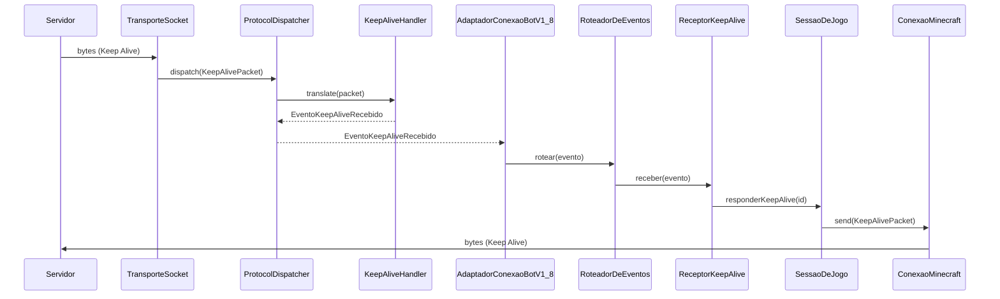
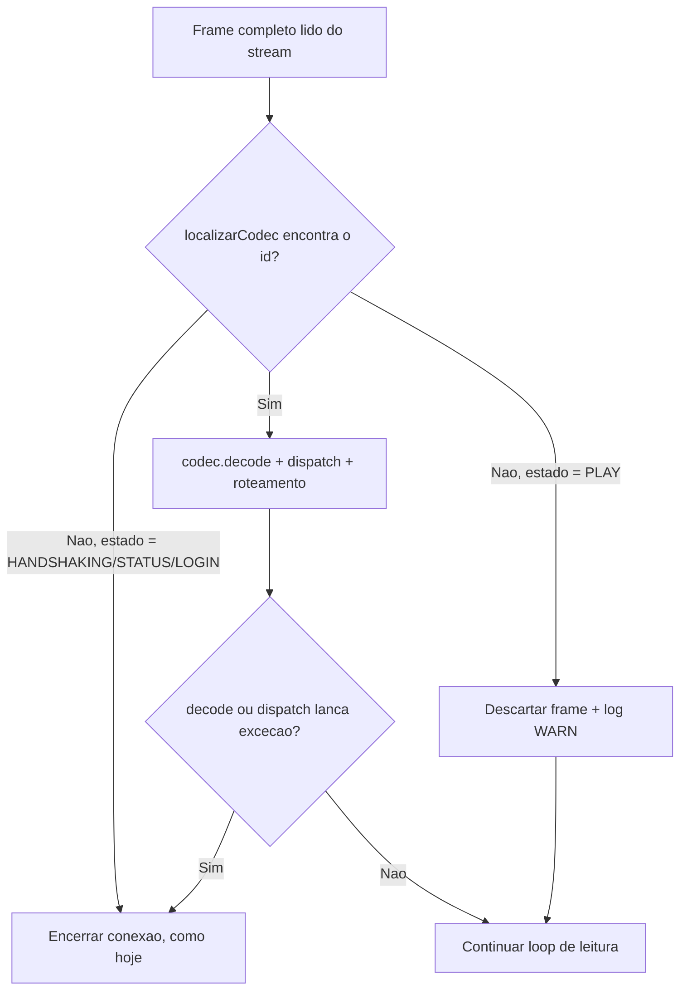
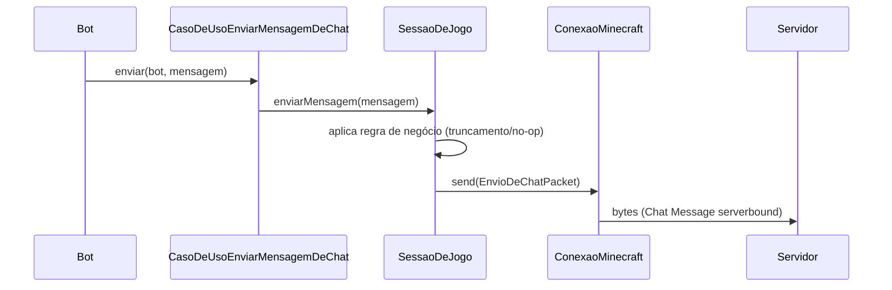
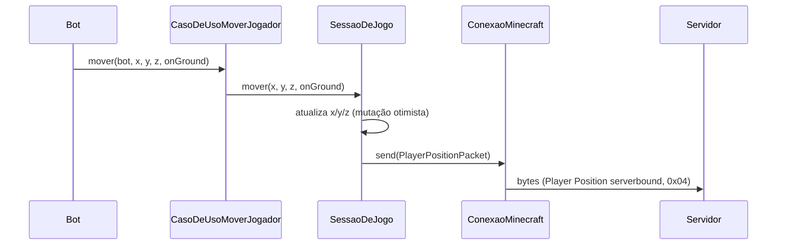

# 01 - Decisões Arquiteturais

## Objetivo

Este documento registra todas as decisões arquiteturais essenciais que devem ser tomadas antes do início da codificação do AdvancedBot em Java.

Ele documenta o contexto, as alternativas, a recomendação e os impactos de cada decisão para garantir alinhamento técnico.

---

## Premissas Oficiais do Projeto

Para garantir o sucesso da migração, as seguintes premissas são estabelecidas:

- A migração deve garantir paridade funcional com a versão legado C#.
- O sistema alvo utilizará Java 21 ou superior.
- Toda interface gráfica legada (Windows Forms e OpenGL) será descartada, focando em uma operação CLI ou API first.
- A arquitetura adotada deve favorecer alta escalabilidade e baixo acoplamento.
- A documentação é considerada parte integrante da entrega, não havendo código não documentado.

---

## Itens Bloqueadores da Migração

Os itens abaixo impedem o início da codificação e dependem de definição prévia.

- **Definição de Versões de Protocolo (DEC-01):** Impede a construção correta dos serializadores de rede.
- **Escolha do Framework Base (DEC-08):** Impede a configuração inicial do projeto e definição de injeção de dependências.
- **Implementação Criptográfica (DEC-04):** Impede o teste de conexões autenticadas.

---

## Decisões Obrigatórias Antes da Codificação

Esta seção lista as decisões críticas mapeadas no inventário inicial que exigem aprovação oficial.

### DEC-01 — Versões de Protocolo Suportadas

**Contexto:** O AdvancedBot suportava múltiplas versões do protocolo. A manutenção de múltiplos manipuladores é custosa.

**Problema Atual no C#:** O sistema contém diversas classes `Handler_v*` com lógica duplicada, dificultando a implementação de novos pacotes.

**Alternativas Possíveis:**
1. Manter suporte para todas as versões originais desde o início.
2. Focar exclusivamente em uma versão principal (exemplo 1.8) e expandir posteriormente.
3. Adotar uma biblioteca de abstração de protocolo de terceiros.

**Decisão Recomendada:** Alternativa 2. Iniciar com foco em protocolo único para validar a arquitetura antes de adicionar complexidade de múltiplas versões.

**Impacto na Implementação Java:** Simplifica a criação dos validadores e a abstração inicial de pacotes de rede, garantindo entrega de valor rápida.

---

### DEC-02 — Estratégia de Interface do Usuário

**Contexto:** A versão original possuía componentes de UI em Windows Forms e renderização 3D em OpenGL.

**Problema Atual no C#:** A lógica de interface gráfica está fortemente acoplada ao domínio do bot, dificultando operações sem interface visual.

**Alternativas Possíveis:**
1. Reescrever a interface usando JavaFX ou Swing.
2. Descartar interface rica e construir apenas um modelo de linha de comando.
3. Construir uma API REST e painel Web independente.

**Decisão Recomendada:** Alternativa 2. Priorizar um executável de terminal leve, isolando completamente a lógica do domínio.

**Impacto na Implementação Java:** Elimina a necessidade de migrar inúmeros arquivos de interface, reduzindo o esforço drasticamente. Foco total no núcleo da aplicação.

---

### DEC-03 — Modelo de Macros e Scripts

**Contexto:** Macros no C# utilizavam *threads* dedicadas ou simulação de execução paralela para emular o comportamento humano no jogo.

**Problema Atual no C#:** Muitas condições de corrida entre macros e o envio de pacotes na *thread* principal, além da falta de cancelamento seguro de tarefas.

**Alternativas Possíveis:**
1. Utilizar modelo de *thread* puro tradicional.
2. Utilizar executores baseados em eventos com `CompletableFuture`.
3. Implementar *Virtual Threads* ou modelo reativo.

**Decisão Recomendada:** Alternativa 3. Adotar as *Virtual Threads* do Java 21 para executar macros de forma concorrente com baixo custo computacional.

**Impacto na Implementação Java:** Mudança estrutural em todos os comandos e *plugins*, exigindo criação de uma API de interrupção confiável e isolamento de estado.

---

### DEC-04 — Provider de Criptografia AES-CFB8

**Contexto:** O protocolo de rede exige criptografia AES-CFB8 para autenticação na rede oficial da Mojang.

**Problema Atual no C#:** Implementação local propensa a falhas de compatibilidade, dificultando atualizações em ambientes complexos.

**Alternativas Possíveis:**
1. Escrever uma implementação customizada em Java puro.
2. Utilizar cifra nativa do *Java Cryptography Extension*.
3. Integrar a biblioteca BouncyCastle para garantir máxima compatibilidade.

**Decisão Recomendada:** Alternativa 3. Adotar BouncyCastle, que é largamente utilizado no ecossistema Minecraft para este fim específico.

**Impacto na Implementação Java:** Adição de uma dependência externa crítica, que garante robustez total na camada de comunicação de rede criptografada.

---

### DEC-05 — Formato de Configuração

**Contexto:** As configurações persistentes no C# utilizavam serialização binária proprietária através de formatação em NBT.

**Problema Atual no C#:** O formato binário restringe significativamente a edição manual e amigável das configurações por usuários comuns.

**Alternativas Possíveis:**
1. Manter arquivo original para total retrocompatibilidade com perfis antigos.
2. Migrar totalmente para JSON usando bibliotecas como Jackson ou Gson.
3. Adotar YAML para maior legibilidade manual e facilidade de manipulação.

**Decisão Recomendada:** Alternativa 3. Arquivos YAML são padrão do ecossistema moderno e fáceis de editar sem corromper estruturas cruciais.

**Impacto na Implementação Java:** Requer a construção de um novo sistema de configuração estruturado e perda da retrocompatibilidade com os perfis binários antigos.

---

### DEC-06 — Formato e Sistema de Plugins

**Contexto:** O AdvancedBot carregava módulos dinâmicos externos via sistema de injeção direta de bibliotecas compiladas.

**Problema Atual no C#:** O sistema original permitia acesso irrestrito ao núcleo do bot, causando quebras frequentes e falta de versionamento explícito.

**Alternativas Possíveis:**
1. Carregamento direto de bibliotecas customizadas sem mecanismos de isolamento.
2. Adotar um sistema de módulos complexo como o *Java Platform Module System*.
3. Criar uma API exposta altamente controlada para extensões baseadas em arquivos JAR.

**Decisão Recomendada:** Alternativa 3. Implementar um carregador simples com descritores declarativos e injeção rigorosamente controlada dos serviços.

**Impacto na Implementação Java:** Necessidade de desenhar uma interface central bem definida, restrita e exaustivamente documentada para os desenvolvedores.

---

### DEC-07 — Servidor Alvo Primário

**Contexto:** O foco da nova versão afetará diretamente quais classes do domínio legado serão migradas e testadas primeiro.

**Problema Atual no C#:** O código mescla comportamentos distintos de protocolos diferentes de forma confusa, sem prioridade de suporte definida.

**Alternativas Possíveis:**
1. Foco em servidores antigos utilizando pacotes primitivos.
2. Foco no protocolo 1.8 devido a estabilidade na comunidade de PvP.
3. Foco exclusivo nas versões mais recentes e atualizadas do jogo.

**Decisão Recomendada:** Alternativa 2. A versão 1.8 estabelece o ponto médio ideal e possui ferramentas estabelecidas para validação funcional do *bypass*.

**Impacto na Implementação Java:** Esforço inicial direcionado ao manipulador correspondente e às lógicas específicas de movimentação associadas a essa época.

---

### DEC-08 — Framework Base do Projeto Java

**Contexto:** O bot original funcionava como uma aplicação local isolada sem adoção de nenhum controlador central ou inversão de controle.

**Problema Atual no C#:** O forte acoplamento e o controle de estado global dificultam severamente a criação e a manutenção de testes automatizados seguros.

**Alternativas Possíveis:**
1. Utilizar aplicação local bruta construindo um motor próprio de controle.
2. Adotar o Spring Boot para orquestração geral do ciclo de vida.
3. Utilizar o Quarkus focando em minimizar o uso de memória volátil.

**Decisão Recomendada:** Alternativa 2. Adotar o Spring Boot devido ao amadurecimento das bibliotecas do ecossistema e enorme suporte da comunidade.

**Impacto na Implementação Java:** Redefine completamente a arquitetura de controle e dita como as instâncias essenciais serão injetadas através do sistema de dependência.

---

### DEC-09 — Modelo Operacional da Aplicação

**Contexto:** Definição de como o ciclo de vida e a concorrência dos bots serão governados no ambiente Java, afetando diretamente o isolamento e o paralelismo.

**Problema Atual no C#:** O forte acoplamento de estado global causa inconsistências, travamentos e falhas em cascata quando múltiplas instâncias compartilham o mesmo processo.

**Alternativas Possíveis:**
1. Modelo Single-Tenant, com uma JVM isolada por instância ou perfil de bot.
2. Modelo Multi-Tenant, utilizando uma única JVM para executar e gerenciar múltiplos perfis simultâneos.

**Decisão Recomendada:** Alternativa 1. Adotar a execução Single-Tenant (Uma JVM por Bot), simplificando a separação de escopos e mitigando falhas generalizadas.

**Impacto na Implementação Java:** Remove a necessidade de isolamento dinâmico avançado (ex: ClassLoaders para plugins). O gerenciamento massivo de bots exigirá o uso do Spring Boot como orquestrador externo gerenciando as JVMs independentes do motor.

---

### DEC-10 — Gerenciamento e Suporte a Proxies

**Contexto:** O AdvancedBot legou nativamente o suporte a proxies. Na nova arquitetura Single-Tenant distribuída, o roteamento da comunicação precisa de suporte limpo, escalável e isolado.

**Problema Atual no C#:** O gerenciamento do proxy estava atrelado à interface e lógica de rede global, dificultando rotações ou execuções autônomas sem configuração de UI.

**Alternativas Possíveis:**
1. Configurar proxies via argumentos e propriedades globais da JVM.
2. Implementar suporte isolado instanciando e injetando objetos `java.net.Proxy` diretamente na criação dos *sockets* de conexão.
3. Delegar o roteamento de rede para um proxy reverso externo de infraestrutura.

**Decisão Recomendada:** Alternativa 2. A injeção direta de configurações proxy no *socket* de cada bot reforça o isolamento estrito proposto na DEC-09.

**Impacto na Implementação Java:** A parametrização de rede do bot necessitará de campos explícitos para configurações de Proxy. A arquitetura deverá permitir flexibilidade para uma futura adição de *pools* automáticos e rotação de IPs.

---

### DEC-11 — Idioma de Nomenclatura de Classes

**Contexto:** O [12-Guia-de-Nomenclatura.md](12-Guia-de-Nomenclatura.md) exigia nomes de classes Java exclusivamente em inglês. Ao iniciar a Milestone 3 (Migração do Núcleo do Domínio), o responsável pelo projeto solicitou nomes de classes em português.

**Problema Atual:** Divergência entre a governança aprovada (nomes em inglês) e a preferência explícita do responsável pelo projeto para o código de domínio.

**Alternativas Possíveis:**
1. Manter nomes de classes em inglês, conforme guia original.
2. Adotar nomes de classes em português em todo o código Java, atualizando o guia de nomenclatura.

**Decisão Tomada:** Alternativa 2. Nomes de **classes, interfaces, enums e records** passam a ser escritos em português. Nomes de **pacotes, métodos, variáveis e constantes** permanecem em inglês, conforme o guia original (nenhuma solicitação de alteração para esses itens).

**Justificativa:** Preferência explícita do responsável pelo projeto (Mateus Botega), aprovada em sessão de 2026-07-15, para iniciar a Milestone 3.

**Impacto na Implementação Java:** Atualiza a seção "Idioma Oficial" do [12-Guia-de-Nomenclatura.md](12-Guia-de-Nomenclatura.md). Aplica-se a todo código Java escrito a partir desta decisão; classes já existentes (ex: `AdvancedBotApplication`) não são renomeadas retroativamente sem necessidade funcional.

**Data:** 2026-07-15

**Responsável:** Mateus Botega

---

### DEC-12 — Estrutura de Pacotes: Camadas Clean Architecture

**Contexto:** O [08-Fundacao-Arquitetural-Java.md](08-Fundacao-Arquitetural-Java.md) definia uma estrutura de pacotes orientada a features (`core`, `network`, `protocol`, `bot`, `pathfinding`, `inventory`, `automation`, `proxy`, `scheduler`, `persistence`, `api`), sem pacotes explícitos de camada (`domain`, `application`, `infrastructure`, `interfaces`). Isso diverge do princípio já fixado no CLAUDE.md e na Decisão Arquitetural Congelada "Clean + Hexagonal", que exige preservar a separação entre domínio, aplicação, infraestrutura e interfaces.

**Problema Atual:** Ao iniciar a Milestone 3 (primeiras entidades, Value Objects e Use Cases do domínio), não havia pacote `domain` nem `application` onde alocar esse código sem violar a estrutura já aprovada.

**Alternativas Possíveis:**
1. Manter a estrutura orientada a features do 08-Fundacao, alocando entidades em `core` e casos de uso dentro do próprio pacote `bot`.
2. Reestruturar os pacotes em camadas Clean Architecture (`domain`, `application`, `infrastructure`, `interfaces`), mantendo os nomes de features já documentados como subpacotes dentro de cada camada.

**Decisão Tomada:** Alternativa 2. A estrutura esperada passa a ser:

```
com.advancedbot
 ├── domain            # Entidades, Value Objects, regras de negócio puras (antigo "core")
 │    ├── bot
 │    ├── network
 │    ├── protocol
 │    ├── pathfinding
 │    ├── inventory
 │    └── automation
 ├── application       # Casos de uso / orquestração de regras de domínio
 │    └── usecase
 ├── infrastructure    # Persistência, proxy, scheduler, configuração, logs
 │    ├── persistence
 │    ├── proxy
 │    └── scheduler
 └── interfaces        # Controllers / API exposta para front-end e dashboard
      └── api
```

**Justificativa:** Alinha a estrutura física de pacotes ao princípio Clean + Hexagonal já congelado, sem descartar nenhum dos módulos de feature já documentados no 08-Fundacao (apenas os reorganiza como subpacotes de camada). Aprovada explicitamente pelo responsável pelo projeto para desbloquear a Milestone 3.

**Impacto na Implementação Java:** Atualiza a seção "2. Estrutura Inicial do Projeto Maven" do [08-Fundacao-Arquitetural-Java.md](08-Fundacao-Arquitetural-Java.md). Módulos ainda não criados (network, protocol, pathfinding, etc.) adotam a nova estrutura ao serem implementados em milestones futuras; nenhum código existente precisa ser movido nesta sessão.

**Data:** 2026-07-15

**Responsável:** Mateus Botega

---

### DEC-13 — Arquitetura da Camada de Comunicação (Milestone 4, incremento 1)

**Contexto:** Antes de implementar Handshake, Login, Packets concretos e Socket (Milestone 4 completa), foi necessário desenhar a arquitetura da camada de comunicação — Packet, Codec, Serializer/Deserializer, Registry e Handler — e sua separação entre `domain`, `application` e `infrastructure` conforme DEC-12. O C# legado (`Client/PacketStream.cs`, `Client/ReadBuffer.cs`/`WriteBuffer.cs`, `Client/Handler/Handler_v18.cs`, `Client/IPacket.cs`) foi consultado apenas para entender responsabilidades, sem migração de código.

**Decisões Tomadas:**

1. **`RegistroDePacotes` pertence à infraestrutura (`infrastructure.protocol`), não ao domínio.** O mapeamento entre IDs de pacote, `EstadoConexao` e `Codec` é um detalhe de implementação do protocolo, não uma regra de domínio.
2. **`ProtocolDispatcher` (`infrastructure.protocol`) é o único responsável por localizar e encaminhar pacotes aos `PacketHandler`s.** `PacketHandler<T extends Packet>` (`domain.protocol`) fica restrito a traduzir um `Packet` em um `EventoDeProtocolo` — não realiza roteamento.
3. **`EventoDeProtocolo` (`domain.protocol`) é apenas uma interface marcadora nesta milestone.** O EventBus e a integração com o Bot Engine/domínio serão definidos em milestones futuras (Fase 5/6 do [07-Plano-de-Migracao-e-Estrategia-de-Implementacao.md](07-Plano-de-Migracao-e-Estrategia-de-Implementacao.md)).
4. **Sem Netty.** Conexão real (quando implementada) usará `java.net.Socket` bloqueante com uma Virtual Thread por conexão de bot, conforme DEC-03 — sem introduzir dependência de framework de rede assíncrona.
5. **`Packet`, `Codec<T>`, `LeitorDePacote`, `EscritorDePacote`, `EstadoConexao`, `VersaoProtocolo` e `PacketHandler<T>` permanecem em `domain.protocol`** — contratos puros, sem I/O. `ConexaoMinecraft` (port) e `SessaoDeRede` (Value Object imutável) permanecem em `domain.network`. `ConexaoBotPort` foi criado em `application.port` para a Application depender de uma abstração de conexão em vez de I/O concreto.
6. **Diretórios legados pré-DEC-12** (`com.advancedbot.core`, `.bot`, `.network`, `.protocol`, `.pathfinding`, todos vazios com apenas `.gitkeep`) foram removidos após a criação e validação (compilação + testes) da nova estrutura sob `domain`/`application`/`infrastructure`.

**Justificativa:** Corrige três problemas identificados no C# legado — pacotes assimétricos (escrita orientada a objeto, leitura procedural via switch), ausência de registry declarativo (IDs hardcoded por pacote) e Handler acoplando decodificação com reação de jogo — sem introduzir abstrações além do necessário para esta etapa (nenhum Packet concreto, Handshake, Login ou Socket real foi implementado).

**Impacto na Implementação Java:** Cria os pacotes `domain.protocol`, `domain.network`, `application.port` e `infrastructure.protocol` com os contratos: `Packet`, `Codec`, `LeitorDePacote`, `EscritorDePacote`, `EstadoConexao`, `VersaoProtocolo`, `PacketHandler`, `EventoDeProtocolo`, `ConexaoMinecraft`, `SessaoDeRede`, `ConexaoBotPort`, `RegistroDePacotes`, `ProtocolDispatcher`. Nenhum pacote concreto de protocolo (1.5.2/1.8), Handshake, Login ou adapter de Socket real foi criado — fica para o próximo incremento da Milestone 4.

**Data:** 2026-07-15

**Responsável:** Mateus Botega

---

### DEC-14 — Suporte a Unsigned Short em LeitorDePacote/EscritorDePacote (Milestone 4, incremento 2)

**Contexto:** Ao implementar `HandshakeCodec` usando o C# (`Client/Packets/PacketHandshake.cs`, `Client/WriteBuffer.cs`/`ReadBuffer.cs`) como fonte da verdade, identificou-se que o campo `ServerPort` é serializado como `ushort` (`WriteUShort`/`ReadUShort`, 2 bytes, 0–65535). Os contratos `LeitorDePacote`/`EscritorDePacote` definidos na DEC-13 continham apenas `readShort`/`writeShort` (signed, intervalo até 32767), insuficiente para representar corretamente portas acima de 32767.

**Decisão Tomada:** Adicionar `readUnsignedShort(): int` e `writeUnsignedShort(int)` aos contratos `LeitorDePacote`/`EscritorDePacote` (`domain.protocol`), mantendo os métodos `readShort`/`writeShort` existentes intocados. É uma extensão aditiva do contrato já aprovado, não uma reversão de decisão — decorre diretamente da fidelidade ao protocolo/C# exigida pelo CLAUDE.md ("na ausência de decisão previamente documentada, o C# é fonte da verdade").

**Justificativa:** Sem essa extensão, `HandshakePacket.serverPort` não poderia representar corretamente portas no intervalo 32768–65535, quebrando paridade com o comportamento do legado.

**Impacto na Implementação Java:** `LeitorDePacote` e `EscritorDePacote` ganham os métodos `readUnsignedShort`/`writeUnsignedShort`. `BufferLeitorDePacote`/`BufferEscritorDePacote` (`infrastructure.protocol`, novas implementações concretas dos dois contratos, usadas para exercitar os Codecs nos testes) implementam ambos os pares (signed e unsigned).

**Data:** 2026-07-15

**Responsável:** Mateus Botega

---

### DEC-15 — Suporte a Byte Array em LeitorDePacote/EscritorDePacote (Milestone 4, incremento 3)

**Contexto:** Ao implementar `EncryptionRequestCodec` e `EncryptionResponseCodec` usando o C# (`AdvancedBot.Client.MinecraftClient.cs`, método `HandlePacket`/case 1; `AdvancedBot.Client.Packets.PacketEncryptionResponse.cs`; `AdvancedBot.Client.ReadBuffer.cs`/`WriteBuffer.cs`) como fonte da verdade, identificou-se que os campos `publicKey`/`verifyToken` (Encryption Request) e `sharedSecret`/`verifyToken` (Encryption Response) são arrays de bytes crus prefixados por um comprimento `VarInt` (`ReadByteArray(ReadVarInt())` / `WriteVarInt(len)` + `WriteByteArray(...)` no C#). Os contratos `LeitorDePacote`/`EscritorDePacote` (DEC-13, estendidos na DEC-14) não continham nenhum método para ler/escrever `byte[]`.

**Decisão Tomada:** Adicionar `readByteArray(int length): byte[]` e `writeByteArray(byte[] value): void` aos contratos `LeitorDePacote`/`EscritorDePacote` (`domain.protocol`), mantendo todos os métodos existentes intocados. É uma extensão aditiva do contrato já aprovado, no mesmo espírito da DEC-14. O comprimento (`VarInt`) continua sendo lido/escrito explicitamente pelo Codec chamador (`readByteArray(leitor.readVarInt())`, `writeVarInt(length)` seguido de `writeByteArray(...)`), replicando exatamente o padrão do C# em vez de embutir a lógica de comprimento dentro do método de array.

**Justificativa:** Sem essa extensão, `EncryptionRequestPacket`/`EncryptionResponsePacket` não poderiam representar corretamente os campos criptográficos crus do protocolo, quebrando paridade com o comportamento do legado.

**Impacto na Implementação Java:** `LeitorDePacote` e `EscritorDePacote` ganham os métodos `readByteArray`/`writeByteArray`. `BufferLeitorDePacote`/`BufferEscritorDePacote` implementam ambos sobre o buffer em memória existente.

**Data:** 2026-07-15

**Responsável:** Mateus Botega

---

### DEC-16 — Sentido do Pacote (Direção) no RegistroDePacotes (Milestone 4, incremento 3)

**Contexto:** Ao registrar `EncryptionRequestPacket` (enviado pelo servidor) e `EncryptionResponsePacket` (enviado pelo cliente) no `RegistroDePacotesV1_8`, identificou-se uma colisão real: o protocolo Minecraft 1.8 reutiliza o id `0x01` no estado `LOGIN` para dois pacotes distintos, um em cada direção. O `RegistroDePacotes` definido na DEC-13 indexava apenas por `(EstadoConexao, id)`, sem nenhuma noção de direção — `localizarCodec(LOGIN, 0x01)` retornaria apenas um dos dois Codecs (o último registrado), mascarando o outro silenciosamente.

**Problema Atual:** Diferente da DEC-14 e da DEC-15 (extensões puramente aditivas), esta correção exige alterar a assinatura de métodos já aprovados e implementados na DEC-13 (`registrar` e `localizarCodec`), afetando os dois registros existentes (`HandshakePacket`, `LoginStartPacket`) e o teste `RegistroDePacotesV1_8Test`.

**Alternativas Possíveis:**
1. Adicionar um enum `SentidoDoPacote` (`CLIENTBOUND`/`SERVERBOUND`) como parte da chave de `registrar`/`localizarCodec`, corrigindo a causa raiz.
2. Registrar `EncryptionResponsePacket` apenas para lookup por tipo (`localizarId`), sem entrar no mapa id→Codec, evitando alterar a interface aprovada mas tratando os pacotes de forma assimétrica.
3. Adiar a implementação de `EncryptionRequestPacket`/`EncryptionResponsePacket` para um incremento futuro, junto ao `ProtocolDispatcher`.

**Decisão Tomada:** Alternativa 1, escolhida explicitamente pelo responsável pelo projeto diante da colisão identificada. `RegistroDePacotes.registrar` e `localizarCodec` passam a receber um `SentidoDoPacote` (`CLIENTBOUND`/`SERVERBOUND`, novo enum em `domain.protocol`). `localizarId(EstadoConexao, Class)` permanece com a assinatura original — cada `Class` de Packet já implica uma única direção, então não há ambiguidade nesse sentido de busca.

**Justificativa:** É a única alternativa que corrige a causa raiz com fidelidade real ao protocolo (que reutiliza IDs entre direções dentro do mesmo estado) sem mascarar silenciosamente um dos dois Codecs. Extensões puramente aditivas não resolvem colisões de chave — apenas alterar a chave de busca resolve.

**Impacto na Implementação Java:** `domain.protocol.SentidoDoPacote` (novo enum). `RegistroDePacotes.registrar`/`localizarCodec` ganham o parâmetro `SentidoDoPacote`. `RegistroDePacotesV1_8` atualiza os 2 registros existentes (`HandshakePacket` e `LoginStartPacket`, ambos `SERVERBOUND`) e adiciona os 4 novos registros desta milestone (`EncryptionRequestPacket` CLIENTBOUND, `EncryptionResponsePacket` SERVERBOUND, `LoginSuccessPacket` CLIENTBOUND, `SetCompressionPacket` CLIENTBOUND). `RegistroDePacotesV1_8Test` atualizado para refletir a nova assinatura, incluindo teste dedicado provando que os dois Codecs no id 0x01 são distinguidos corretamente.

**Data:** 2026-07-15

**Responsável:** Mateus Botega

---

### DEC-17 — Transição de EstadoConexao no ConexaoMinecraft e Conexão Síncrona no ConexaoBotPort (Milestone 4, Incremento 6)

**Contexto:** Ao implementar o primeiro adapter concreto de `ConexaoBotPort` (declarado desde a DEC-13, nunca implementado nem chamado — achado principal da auditoria da Milestone 4 Incremento 5), identificou-se que `ConexaoMinecraft`/`TransporteSocket` não oferece nenhuma forma de avançar `EstadoConexao` após a construção — `send()` e o `readLoop()` resolvem id/Codec via `SessaoDeRede.estadoConexao()`, que fica travado em `HANDSHAKING` para sempre. Enviar `HandshakePacket` (HANDSHAKING/SERVERBOUND) seguido de `LoginStartPacket` (registrado em LOGIN/SERVERBOUND) falharia sempre com `IllegalArgumentException` em `RegistroDePacotes.localizarId` — não é um caso extremo, é o caminho feliz do fluxo de conexão.

Adicionalmente, `ConexaoBotPort.connect(EnderecoServidor, CredenciaisBot): SessaoBot` (assinatura já aprovada na DEC-13) retorna `SessaoBot` de forma síncrona, diferente do C# legado (`AdvancedBot.Client.MinecraftClient.cs`, método `ConnectAndHandshake()`), que envia Handshake+LoginStart e retorna imediatamente, tratando a resposta de forma assíncrona via `Stream.OnPacketAvailable += HandlePacket`.

**Decisões Tomadas:**

1. **`ConexaoMinecraft` (`domain.network`) ganha o método `void avancarEstado(EstadoConexao novoEstado)`.** Extensão aditiva do contrato já aprovado (DEC-13), no mesmo espírito da DEC-14/DEC-15 — nenhum método existente muda. `TransporteSocket` implementa reatribuindo o campo `sessao` (já `volatile`) via `SessaoDeRede.comEstado(novoEstado)`, método que já existia desde o Incremento 1 sem nenhum chamador até agora. Quem decide QUANDO chamar `avancarEstado` é o adapter de protocolo (`AdaptadorConexaoBotV1_8`), não o `TransporteSocket` (que permanece agnóstico de protocolo) nem o `PacketHandler` (que só traduz, DEC-13) nem o Use Case (zero conhecimento de protocolo) — decidir que "depois do Handshake com `nextState=2` a conexão passa a LOGIN" é conhecimento do protocolo v1.8, não é autenticação/criptografia/Handshake real.

2. **`ConexaoBotPort.connect()` permanece síncrono/bloqueante** — não é alterado para retornar `CompletableFuture<SessaoBot>` ou `void`. A primeira implementação (`AdaptadorConexaoBotV1_8`) honra essa assinatura já aprovada bloqueando a thread chamadora em um `CompletableFuture<SessaoBot>` completado a partir do callback de pacotes recebidos, com timeout configurável (o C# usa 30s como `ReceiveTimeout`/`SendTimeout` em `ConnectAndHandshake()`, adotado como valor de referência). Isso é uma divergência deliberada do comportamento assíncrono do C#, registrada aqui conforme exige o CLAUDE.md ("registrar qualquer divergência em relação ao legado; caso a divergência seja arquitetural, abrir uma DEC antes da implementação").

**Justificativa:** Ambas as decisões preservam os contratos já aprovados (extensão aditiva, não alteração) e resolvem, com a menor superfície possível, o único bloqueador real para que `CasoDeUsoConectarBot → ConexaoBotPort → Adapter → ConexaoMinecraft → TransporteSocket → ProtocolDispatcher → PacketHandlers → EventoDeProtocolo → SessaoBot` funcione de ponta a ponta sem tocar em Encryption, Compression, Play State ou conexão real com um servidor.

**Limites explícitos desta DEC (não implementados):** nenhuma fábrica de produção que abra `java.net.Socket` real (o Adapter recebe a fábrica de conexão via `Function<EnderecoServidor, ConexaoMinecraft>` injetada, sem implementação de produção fornecida nesta etapa); nenhuma reação a `EventoEncryptionRequest`/`EventoSetCompression` além de falhar rápido e explicitamente (sem negociar criptografia/compressão); `CasoDeUsoDesconectarBot`/`ConexaoBotPort.disconnect()` continuam não integrados; nenhuma transição para `EstadoConexao.PLAY` (não há Packets/Handlers de Play State ainda).

**Impacto na Implementação Java:** `ConexaoMinecraft` ganha `avancarEstado`. `TransporteSocket` implementa. Novo `infrastructure.network.v1_8.AdaptadorConexaoBotV1_8` implementa `ConexaoBotPort` usando ambos. `CasoDeUsoConectarBot` passa a depender de `ConexaoBotPort` via construtor.

**Data:** 2026-07-16

**Responsável:** Mateus Botega

---

### DEC-18 — Extensão Aditiva de ConexaoMinecraft com ativarCompressao (Milestone 4, Incremento 8A)

**Contexto:** Ao implementar o suporte a compressão zlib do protocolo Minecraft 1.8 (bloqueador identificado no Incremento 7B — o servidor real Olimpo/Craftlandia exige compressão antes de prosseguir no LOGIN), identificou-se que `SessaoDeRede` já possui o wither `comCompressao(int)` desde o Incremento 1 (Milestone 4), sem nenhum chamador até agora — mesma situação de `comEstado`/`avancarEstado` antes da DEC-17. `ConexaoMinecraft` não oferecia nenhuma forma de acionar esse wither a partir de um adapter de protocolo.

**Decisão Tomada:** Adicionar `void ativarCompressao(int threshold)` a `ConexaoMinecraft` (`domain.network`), mantendo todos os métodos existentes intocados. `TransporteSocket` implementa reatribuindo `sessao` via `SessaoDeRede.comCompressao(threshold)` (método já existente, sem chamador até agora). Extensão aditiva do contrato já aprovado, no mesmo espírito da DEC-14/DEC-15/DEC-17 — nenhuma assinatura existente muda.

**Justificativa:** É o único ponto de entrada disponível para o adapter de protocolo (que depende apenas da abstração `ConexaoMinecraft`, nunca de `TransporteSocket` concretamente, por design desde a DEC-13) comandar a ativação de compressão sem que `TransporteSocket` precise conhecer tipos de pacote específicos de versão (`SetCompressionPacket` é v1.8) — o que violaria o invariante, já estabelecido desde o Incremento 6, de que `TransporteSocket` permanece agnóstico de protocolo.

Nomeado `ativarCompressao` (não `avancarCompressao`) deliberadamente: diferente de `EstadoConexao` (uma máquina de estados sequencial: HANDSHAKING→LOGIN→PLAY), compressão é uma ativação única e não-sequencial — "avançar" sugeriria uma progressão que não existe aqui.

**Observação registrada para decisões futuras:** `SessaoDeRede.comCifra()` também já existe sem chamador, e a criptografia (DEC-04) provavelmente vai precisar de um mecanismo análogo de ativação. Se isso se confirmar, será o terceiro método de "aplicar um wither de sessão" em `ConexaoMinecraft` — ponto em que um mecanismo mais genérico (ex.: receber um `UnaryOperator<SessaoDeRede>`) deve ser reconsiderado em vez de repetir o padrão uma terceira vez sem questionar (regra de três). Não generalizado agora porque a forma real da ativação de criptografia ainda é desconhecida (provavelmente exigirá estado mutável de `Cipher`/chave, não apenas um valor imutável em um record) — abstrair antes de ver esse segundo caso real seria especulativo.

**Impacto na Implementação Java:** `ConexaoMinecraft` ganha `ativarCompressao(int)`. `TransporteSocket` implementa. `infrastructure.protocol.CodificadorDeFrame`/`DecodificadorDeFrame` ganham sobrecargas aditivas — `encode(int,byte[],int)`/`decode(InputStream,int)` — implementando o framing com compressão via `java.util.zip.Deflater`/`Inflater` (nível `BEST_SPEED`, formato zlib), equivalente exato a `Ionic.Zlib.ZlibStream`/`CompressionLevel.BestSpeed` do C#, sem dependência nova (já catalogado em `05-Dependencias-e-Bibliotecas.md`). `dataLength` é usado como dica de pré-alocação do buffer de descompressão, não como validação rígida — o C# legado (`ZlibStream.UncompressBuffer`) também não valida esse valor, só usa sua largura em bytes para localizar o início dos dados comprimidos; validar estritamente poderia rejeitar um servidor real que o C# tolera. Único guard adicionado: o valor declarado de `dataLength` é limitado ao mesmo teto de 2 MiB já aplicado ao frame externo. `AdaptadorConexaoBotV1_8` não foi alterado nesta etapa — `EventoSetCompression` continua falhando explicitamente (fica para o Incremento 8B).

**Data:** 2026-07-16

**Responsável:** Mateus Botega

---

### DEC-19 — Retenção da Sessão de Jogo e Roteamento de Eventos no Estado PLAY (Milestone 5, Fase de Planejamento)

**Contexto:** A Milestone 4 encerrou com a arquitetura de comunicação completa e o fluxo de LOGIN validado ponta a ponta contra servidor real (Incremento 8C), mas deixou registrado um risco explícito na seção "Base Pronta para a Milestone 5" do [11-Estado-Atual-Migracao.md](11-Estado-Atual-Migracao.md): o mecanismo de reação a pacotes em `AdaptadorConexaoBotV1_8` "hoje é modelado só para o terminal do LOGIN, sem rota para pacotes pós-PLAY". `ConexaoBotPort.connect(EnderecoServidor, CredenciaisBot)` retorna apenas `SessaoBot` — um Value Object de dois campos (`state`, `autoReconnect`) — e a instância real de `ConexaoMinecraft`, construída e usada dentro do adapter para enviar Handshake/LoginStart e para registrar o único consumidor de pacotes da conexão (`onPacketReceived`), nunca escapa do escopo do método `connect()`. Ela permanece viva apenas por captura de closure na lambda que reage a pacotes — nenhum código fora do adapter tem uma referência para agir sobre a conexão depois que o login termina.

Adicionalmente, `EventoDeProtocolo` é, desde a DEC-13, apenas uma interface marcadora — a própria DEC-13 registrou explicitamente que "o EventBus e a integração com o Bot Engine/domínio serão definidos em milestones futuras". O único consumidor de um `EventoDeProtocolo` hoje é um `instanceof EventoLoginSuccess` embutido dentro do método privado `reagirAoPacote`, que trata exatamente um evento terminal (sucesso do login) e descarta qualquer outro evento sem reação. Esse padrão é suficiente para LOGIN (um fluxo finito, de pergunta-resposta) mas não escala para PLAY, que produzirá dezenas de tipos de evento continuamente durante toda a vida da sessão.

**Problema:** Não existe hoje nenhum mecanismo para (1) reter a conexão viva além do escopo de `connect()`, nem (2) rotear mais de um tipo de `EventoDeProtocolo` para reações distintas de forma extensível. Sem resolver ambos, `EstadoConexao.PLAY` (já presente no enum desde a Milestone 4) permanece inatingível na prática: o primeiro pacote PLAY que um servidor real envia após `LoginSuccess` não tem Codec registrado, e mesmo que tivesse, não haveria como a aplicação agir sobre ele.

**Motivação:** Iniciar a implementação de qualquer pacote PLAY (Incremento 3 em diante do roadmap de Milestone 5) exige que este mecanismo já exista — não é um refinamento incremental posterior, é um pré-requisito estrutural, exatamente como identificado na auditoria de encerramento da Milestone 4.

**Alternativas Possíveis:**

1. **Estender `ConexaoBotPort.connect()` para aceitar um callback/listener além dos parâmetros atuais**, mantendo o retorno `SessaoBot` inalterado.
   Vantagens: não quebra a assinatura já aprovada.
   Desvantagens: não resolve o problema de retenção — a aplicação ainda não teria uma referência à conexão para agir depois, apenas para ser notificada; exigiria um segundo mecanismo de retenção de qualquer forma.

2. **Introduzir um barramento de eventos genérico da aplicação** (ex.: `ApplicationEventPublisher` do Spring, ou uma fila compartilhada tipo LMAX Disruptor), inspirado na proposta encontrada em `docs-reescrita/20-Rastreabilidade/04-Mapa-de-Eventos.md`.
   Vantagens: framework maduro, suporte a múltiplos assinantes sem código de roteamento próprio.
   Desvantagens: contradiz diretamente a DEC-13 item 4 ("Sem Netty... sem introduzir dependência de framework de rede assíncrona" — o mesmo espírito se aplica a um barramento de eventos pesado) e a DEC-09 (modelo Single-Tenant, uma JVM isolada por bot; um barramento pensado para múltiplos assinantes globais não tem papel claro nesse isolamento). Introduziria tecnologia nova sem necessidade comprovada, na contramão do princípio do CLAUDE.md de evitar abstrações além do necessário.

3. **Criar um novo agregado de sessão de jogo (`SessaoDeJogo`) que retém a conexão viva, associado a `Bot`; e um roteador de eventos simples, escopado à sessão, seguindo o mesmo padrão de mapa explícito já usado por `ProtocolDispatcher`/`handlersV1_8()`.**
   Vantagens: resolve os dois problemas com o menor acréscimo de superfície; reaproveita um padrão (mapa `Class → comportamento`) já validado por 12 incrementos da Milestone 4; permanece consistente com DEC-09 (escopado por bot) e DEC-12 (camadas já definidas).
   Desvantagens: exige alterar o tipo de retorno de `ConexaoBotPort.connect()` — a única mudança não puramente aditiva desta decisão (ver "Relação com Decisões Anteriores").

**Decisão Tomada:** Alternativa 3.

Um novo tipo `SessaoDeJogo` (`domain.bot`) passa a representar a sessão de jogo ativa de um `Bot` — o agregado que sobrevive ao término de `connect()` e permite ação contínua durante PLAY. `SessaoDeJogo` retém a referência à `ConexaoMinecraft` já estabelecida e viva. Nesta decisão, sua única responsabilidade é essa retenção; futuros incrementos (Mundo, Entidade, Jogador, Inventário, Chat) irão associá-la, quando cada um for implementado, sem exigir nova DEC apenas para adicionar uma referência.

`ConexaoBotPort.connect(EnderecoServidor, CredenciaisBot)` passa a retornar `SessaoDeJogo` em vez de `SessaoBot`. `SessaoDeJogo` expõe o estado de sessão do bot através de um método de leitura (`sessaoBot(): SessaoBot`), preservando toda a informação que o retorno anterior carregava.

`Bot` ganha um novo campo, `sessaoDeJogo: SessaoDeJogo` (nulo enquanto não conectado ou durante LOGIN; atribuído no sucesso do login), e um novo método `iniciarSessaoDeJogo(SessaoDeJogo)` — mutação controlada, no mesmo espírito de `updateSession(SessaoBot)` já existente. Nenhum campo ou método existente de `Bot` é removido ou alterado.

Um novo par de tipos formaliza o roteamento evento→domínio: `ReceptorDeEvento<T extends EventoDeProtocolo>` (`domain.protocol`, interface com um único método `receber(T evento)`, espelhando deliberadamente a forma de `PacketHandler<T extends Packet>`) e `RoteadorDeEventos` (`infrastructure.protocol`, mantém um `Map<Class<? extends EventoDeProtocolo>, ReceptorDeEvento<?>>` e expõe `rotear(EventoDeProtocolo evento)`), seguindo exatamente o mesmo estilo de mapa explícito, construído no ponto de composição (hoje, dentro de `AdaptadorConexaoBotV1_8`), já usado para `handlersV1_8()`. O comportamento de `RoteadorDeEventos.rotear` diante de um evento sem receptor registrado é definido pela DEC-20 (não duplicado aqui).

`ConexaoMinecraft` **não** ganha nenhum método novo nesta decisão — `onPacketReceived(Consumer<Packet>)` continua sendo o único ponto de entrada de pacotes da conexão. `reagirAoPacote` (ou seu equivalente) continua tratando os eventos de LOGIN exatamente como hoje (`instanceof EventoLoginSuccess`, `EventoEncryptionRequest`, `EventoSetCompression`); a partir do momento em que `EstadoConexao.PLAY` é alcançado, os eventos que não correspondem a nenhum desses casos especiais de LOGIN passam a ser encaminhados a `RoteadorDeEventos.rotear(evento)`.

**Justificativa:** Resolve os dois problemas identificados com o menor acréscimo possível de conceitos novos, reaproveitando um padrão (mapa explícito `Class → comportamento`) já validado pela própria Milestone 4 em `RegistroDePacotes`, `ProtocolDispatcher` e `handlersV1_8()` — em vez de introduzir uma tecnologia nova (Alternativa 2) para resolver um problema que o padrão já existente resolve igualmente bem em menor escala. Mantém o fluxo de LOGIN inalterado (baixo risco de regressão sobre os 110 testes existentes) e cria a única extensão estrutural realmente necessária para que a Milestone 5 comece.

**Consequências:**

*Positivas:*

- `EstadoConexao.PLAY` deixa de ser inatingível na prática — a aplicação passa a ter uma referência viva para agir e observar.
- Cada novo tipo de evento PLAY ganha um receptor dedicado e isolado, sem exigir alteração em `ProtocolDispatcher`, `RegistroDePacotes` ou em receptores já existentes (Aberto/Fechado preservado).
- `CasoDeUsoConectarBot` e os demais Use Cases existentes continuam sem nenhum import de tipo de protocolo/pacote — a mesma propriedade já validada desde a DEC-13.

*Negativas:*

- `ConexaoBotPort.connect()` sofre a única alteração de assinatura desta decisão (ver abaixo), exigindo atualizar o adapter e os testes que hoje dependem do retorno `SessaoBot` direto.
- `SessaoDeJogo` é um agregado que crescerá em responsabilidade a cada incremento futuro (Mundo, Jogador, Inventário...) — exige disciplina para não se tornar um novo "god object" à semelhança do `MinecraftClient` do C# legado; cada incremento futuro deve adicionar apenas a referência que efetivamente precisa, nunca estado especulativo.

**Impacto por Camada:**

- **Domain:** novo `domain.bot.SessaoDeJogo`; `domain.bot.Bot` ganha o campo `sessaoDeJogo` e o método `iniciarSessaoDeJogo`; novo `domain.protocol.ReceptorDeEvento<T>`. Nenhum tipo existente em `domain.protocol` ou `domain.network` é alterado.
- **Application:** `application.port.ConexaoBotPort.connect(...)` muda o tipo de retorno de `SessaoBot` para `SessaoDeJogo`; `application.usecase.CasoDeUsoConectarBot` atualiza o corpo (não a assinatura pública) para extrair `SessaoBot` de `SessaoDeJogo` e chamar `bot.iniciarSessaoDeJogo(...)`.
- **Infrastructure:** novo `infrastructure.protocol.RoteadorDeEventos`; `infrastructure.network.v1_8.AdaptadorConexaoBotV1_8` passa a construir `SessaoDeJogo` ao concluir o login com sucesso, monta o `RoteadorDeEventos` com os receptores disponíveis (mesmo padrão de `handlersV1_8()`), e encaminha a ele os eventos de PLAY não tratados como caso especial de LOGIN.

**Responsabilidades dos Componentes:**

- **`Bot`:** identidade e configuração de conexão (inalterado); expõe `SessaoBot` (ciclo de vida) e, quando conectado, `SessaoDeJogo` (sessão de jogo ativa). Não conhece protocolo, pacotes ou eventos.
- **`SessaoDeJogo`:** raiz da sessão de jogo ativa. Nesta decisão, retém apenas a capacidade de agir sobre a conexão já estabelecida. Não conhece formato de pacote, IDs ou Codecs — expõe apenas métodos de intenção (ex.: futuramente `enviarChat(String)`), nunca um `enviar(Packet)` genérico; cada método nasce junto com o incremento que o implementa.
- **`ReceptorDeEvento<T>`:** uma implementação por tipo de evento (a partir do Incremento 3 do roadmap de Milestone 5). Traduz exatamente um `EventoDeProtocolo` em exatamente uma chamada sobre exatamente um agregado de domínio. Não decide roteamento, não conhece outros tipos de evento.
- **`RoteadorDeEventos`:** despacha um `EventoDeProtocolo` já produzido pelo `ProtocolDispatcher` ao `ReceptorDeEvento` registrado para o seu tipo concreto. Não interpreta significado de domínio, apenas encaminha.
- **Futuros Use Cases (ex.: `CasoDeUsoEnviarMensagemDeChat`):** recebem um `Bot`, validam que `sessaoDeJogo` não é nula (bot efetivamente em PLAY), e invocam o método de intenção correspondente em `SessaoDeJogo` — nunca constroem ou importam um `Packet` diretamente, preservando a mesma separação entre domínio e protocolo já demonstrada por `CasoDeUsoConectarBot`.

**Exemplo de Fluxo:**



**Relação com Decisões Anteriores:**

- **DEC-13** deferiu explicitamente "EventBus e integração com o domínio... para milestones futuras" — esta decisão cumpre essa promessa, sem reabrir nenhuma das cinco decisões tomadas na DEC-13 (Packet/Codec/PacketHandler/EventoDeProtocolo/ProtocolDispatcher permanecem exatamente como definidos).
- **DEC-09** (Single-Tenant): `SessaoDeJogo` e `RoteadorDeEventos` são escopados a uma conexão/bot, nunca compartilhados entre instâncias — reforça, não contradiz, o isolamento já decidido.
- **DEC-12** (camadas): todos os tipos novos respeitam a estrutura já fixada (`domain`/`application`/`infrastructure`); nenhum pacote novo fora dos já previstos foi necessário.
- **DEC-17**: manteve `ConexaoBotPort.connect()` síncrono e adicionou `ConexaoMinecraft.avancarEstado` de forma aditiva — esta decisão preserva o caráter síncrono de `connect()` (não é reaberto) e não adiciona nenhum método novo a `ConexaoMinecraft`.
- **DEC-16** é o precedente direto para a única mudança não aditiva desta decisão: assim como a DEC-16 alterou a assinatura já aprovada de `RegistroDePacotes` por não haver alternativa aditiva real diante de uma colisão de chave, a mudança do retorno de `ConexaoBotPort.connect()` (`SessaoBot` → `SessaoDeJogo`) é justificada pela mesma lógica — não existe forma aditiva de fazer uma referência hoje descartada escapar do método sem mudar o que ele retorna.
- **DEC-18** registrou a "regra de três" sobre `ConexaoMinecraft` acumular métodos de ativação (`avancarEstado`, `ativarCompressao`). Esta decisão evita deliberadamente adicionar um terceiro método desse tipo — a retenção de sessão é resolvida fora de `ConexaoMinecraft`, em `SessaoDeJogo`.
- A proposta de arquitetura mais pesada encontrada em `docs-reescrita/20-Rastreabilidade/04-Mapa-de-Eventos.md` (Netty, Spring `@EventListener`, LMAX Disruptor) foi avaliada como Alternativa 2 e rejeitada por contradizer DEC-13 e DEC-09, conforme registrado acima.

**Impacto na Implementação Java:** Cria `domain.bot.SessaoDeJogo`, `domain.protocol.ReceptorDeEvento<T>`, `infrastructure.protocol.RoteadorDeEventos`. Altera a assinatura de `application.port.ConexaoBotPort.connect(...)` (retorno `SessaoDeJogo`), o corpo de `application.usecase.CasoDeUsoConectarBot` e o corpo de `infrastructure.network.v1_8.AdaptadorConexaoBotV1_8` (construção de `SessaoDeJogo`, montagem e uso de `RoteadorDeEventos`). Adiciona campo e método a `domain.bot.Bot`. Os testes que hoje capturam o retorno de `connect()` como `SessaoBot` precisarão ser atualizados para `SessaoDeJogo.sessaoBot()` quando o Incremento 1 for implementado — fora do escopo desta DEC, que é exclusivamente documental.

**Data:** 2026-07-16

**Responsável:** Mateus Botega

---

### DEC-20 — Política de Tolerância a Pacotes PLAY Não Registrados (Milestone 5, Fase de Planejamento)

**Contexto:** Desde o Incremento 7C da Milestone 4, `TransporteSocket.readLoop` captura qualquer `RuntimeException` originada ao decodificar ou despachar um pacote — incluindo a `IllegalArgumentException` que `RegistroDePacotes.localizarCodec` lança para um id sem Codec registrado — e responde encerrando a conexão de forma controlada (`active = false`, liberação de `input`/`output`). Esse comportamento é coberto por teste de regressão explícito (`TransporteSocketTest.deveEncerrarReadLoopGraciosamenteEFecharRecursosAoReceberPacoteNaoRegistrado`) e foi correto e desejado durante toda a Milestone 4: HANDSHAKING e LOGIN são estados pequenos, totalmente cobertos pelos Codecs já implementados, e um pacote inesperado ali provavelmente indica um problema real (versão de protocolo errada, comportamento inesperado do servidor, ou um bug).

O estado PLAY do protocolo 1.8 tem mais de 30 tipos de pacote clientbound. A Milestone 5 os implementará incrementalmente (ver roadmap aprovado). Qualquer servidor Minecraft real envia o conjunto completo de pacotes PLAY assim que `Join Game` é recebido — não apenas os que já foram implementados. Sob o comportamento atual, o primeiro pacote PLAY ainda não coberto por um incremento encerraria a conexão inteira, tornando qualquer incremento de Play State impossível de validar contra um servidor real antes que todos os mais de 30 pacotes estivessem implementados — o oposto do que o roadmap incremental aprovado pressupõe.

**Problema:** `RegistroDePacotes`/`TransporteSocket.readLoop` não distinguem "pacote genuinamente corrompido ou inesperado" de "pacote PLAY válido ainda não implementado". As duas situações produzem hoje o mesmo resultado: encerramento da conexão.

**Diferença entre HANDSHAKING/LOGIN e PLAY:** HANDSHAKING e LOGIN permanecem estritos — cobertura completa já existe para ambos desde a Milestone 4, e o custo de um comportamento inesperado nesses estados (autenticação, handshake de versão) é alto o suficiente para justificar falhar rápido. PLAY é, por natureza e por desenho do roadmap, parcialmente coberto durante toda a Milestone 5 — a tolerância é uma propriedade exclusiva desse estado, nunca dos demais. STATUS (list ping) permanece implicitamente no grupo estrito, pelo mesmo raciocínio de HANDSHAKING/LOGIN — é um estado pequeno e totalmente especificado.

**Alternativas Possíveis:**

1. **Manter o comportamento atual sem distinção por estado.**
   Vantagens: nenhuma mudança de código.
   Desvantagens: torna qualquer incremento de PLAY impossível de validar contra servidor real antes de cobertura total — inviabiliza o próprio roadmap aprovado.

2. **Tolerar silenciosamente qualquer pacote não registrado, em qualquer `EstadoConexao`.**
   Vantagens: mudança mais simples possível.
   Desvantagens: enfraquece HANDSHAKING/LOGIN, que hoje se beneficiam corretamente do comportamento estrito; mascararia um problema real de protocolo/versão logo na abertura da conexão.

3. **Tolerância condicionada ao `EstadoConexao`: HANDSHAKING/STATUS/LOGIN permanecem estritos (sem nenhuma mudança de comportamento); apenas em PLAY um pacote sem Codec registrado é descartado (log e continua o loop) em vez de encerrar a conexão.**
   Vantagens: preserva integralmente o comportamento já validado e testado para HANDSHAKING/LOGIN; desbloqueia validação incremental de PLAY contra servidor real desde o primeiro pacote implementado.
   Desvantagens: exige que `TransporteSocket.readLoop` distinga precisamente "falha de busca de Codec" de "falha de decodificação de um Codec já registrado" (ver Decisão Tomada) — a segunda continua fatal em qualquer estado, incluindo PLAY, pois indica um Codec implementado incorretamente ou dados corrompidos, não uma lacuna de cobertura esperada.

4. **Introduzir um Packet/Handler genérico ("catch-all") que armazena os bytes crus de qualquer id não mapeado em PLAY, para inspeção posterior.**
   Vantagens: preserva o conteúdo do pacote descartado, útil para diagnóstico.
   Desvantagens: não é necessário para o objetivo imediato (apenas não derrubar a conexão); registrado como refinamento possível para decisão futura, não adotado agora.

**Decisão Tomada:** Alternativa 3.

O framing do protocolo Minecraft já isola o frame completo (`[VarInt length][VarInt packetId][payload]`) antes de qualquer tentativa de localizar um Codec — `DecodificadorDeFrame` lê a quantidade de bytes declarada pelo prefixo de comprimento externo e a mantém inteiramente em memória (`frameContent`) antes que `TransporteSocket.readLoop` sequer leia o `packetId`. Descartar um pacote não registrado é, portanto, apenas não chamar `codec.decode(...)` sobre um `frameContent` já totalmente lido — não exige adivinhar nenhum tamanho nem risco de desalinhar o stream.

`RegistroDePacotes` passa a lançar um tipo de exceção dedicado — `PacoteNaoRegistradoException extends IllegalArgumentException` — especificamente quando `localizarCodec`/`localizarId` não encontram uma entrada, em vez do `IllegalArgumentException` genérico usado hoje. Por ser um subtipo, qualquer código que hoje capture `IllegalArgumentException` genericamente continua funcionando sem alteração; a especialização existe apenas para que `TransporteSocket.readLoop` possa distinguir precisamente esse caso via `catch (PacoteNaoRegistradoException e)`.

`TransporteSocket.readLoop` passa a envolver separadamente a etapa de busca do Codec e a etapa de decodificação: se `localizarCodec` lançar `PacoteNaoRegistradoException` **e** `sessao.estadoConexao() == EstadoConexao.PLAY`, o frame já lido é descartado, um log de nível WARN é emitido (`EstadoConexao`, id do pacote em hexadecimal, tamanho do frame descartado), e o loop continua para o próximo frame. Em qualquer outro estado, ou se a exceção ocorrer durante `codec.decode(...)` (indicando um Codec registrado que falhou, não uma lacuna de cobertura), o comportamento permanece exatamente o de hoje — conexão encerrada de forma controlada.

**Justificativa:** É a única alternativa que preserva integralmente o comportamento já testado e aprovado para HANDSHAKING/LOGIN, ao mesmo tempo em que resolve a condição que tornaria o roadmap incremental da Milestone 5 impossível de validar contra servidor real. A distinção entre "Codec não encontrado" e "Codec encontrado mas falhou ao decodificar" evita que a tolerância mascare um bug real em um pacote já implementado — apenas lacunas de cobertura (esperadas durante toda a Milestone 5) são toleradas.

**Consequências:**

*Positivas:*

- Cada incremento do roadmap de Milestone 5 pode ser validado contra servidor real isoladamente, sem exigir cobertura completa dos mais de 30 pacotes PLAY primeiro.
- HANDSHAKING/LOGIN não perdem nenhuma garantia já validada pelos 110 testes existentes.
- Compatível por construção com servidores que enviam pacotes não-vanilla (ex.: plugin messages de servidores modificados) sem derrubar a conexão.

*Negativas:*

- Um pacote silenciosamente descartado é, por definição, um pacote não observado — o log em nível WARN é a única rede de segurança para notar lacunas de cobertura; deve ser monitorado, não ignorado, à medida que a Milestone 5 avança.
- Introduz uma nova exceção (`PacoteNaoRegistradoException`) que precisa ser adotada por todas as implementações de `RegistroDePacotes` (hoje apenas `RegistroDePacotesV1_8`) para que a distinção funcione corretamente.

**Estratégia de Tolerância e Logging:** Tolerância aplica-se exclusivamente à falha de localização de Codec (`PacoteNaoRegistradoException`) e exclusivamente quando `EstadoConexao.PLAY`. Toda ocorrência é registrada via SLF4J em nível WARN (nunca `System.out`, conforme Definition of Done), incluindo estado da conexão, id do pacote em hexadecimal e tamanho em bytes do frame descartado — suficiente para acompanhar lacunas de cobertura ao longo dos incrementos sem exigir nível DEBUG. Tolerância não é substituto para completar a cobertura de pacotes PLAY relevantes — é um mecanismo de transição que permite entregá-la de forma incremental e segura.

**Tratamento de Versões Futuras:** A condição de tolerância depende de `EstadoConexao`, não de `VersaoProtocolo` — é, por construção, agnóstica de versão. Uma futura implementação de `RegistroDePacotes` para outra versão do protocolo (ex.: `RegistroDePacotesV1_9`) herda automaticamente a mesma política ao lançar `PacoteNaoRegistradoException`, sem exigir nova DEC por versão.

**Comportamento Esperado em Produção:** Uma vez que a Milestone 5 atinja cobertura completa dos pacotes PLAY relevantes para o servidor-alvo (DEC-07: protocolo 1.8), este caminho tolerante deve raramente ou nunca ser exercitado contra um servidor vanilla em operação normal — sua presença é uma rede de segurança para entrega incremental e para pacotes não previstos (plugins de servidor), não uma justificativa para deixar de registrar pacotes PLAY relevantes ao domínio do bot.

**Impacto na Compatibilidade entre Versões:** Nenhum — a política é uma propriedade do `TransporteSocket`/`RegistroDePacotes`, camadas já comprovadamente agnósticas de versão (DEC-13), e não introduz nenhuma dependência nova entre `domain.protocol.v1_8` e qualquer versão futura.

**Impacto por Camada:**

- **Domain:** nenhum impacto.
- **Application:** nenhum impacto.
- **Infrastructure:** novo `infrastructure.protocol.PacoteNaoRegistradoException`; `infrastructure.protocol.v1_8.RegistroDePacotesV1_8` passa a lançar esse tipo em vez de `IllegalArgumentException` genérico; `infrastructure.network.TransporteSocket.readLoop` ganha a distinção de estado e de etapa descrita acima.

**Exemplo de Fluxo:**



**Relação com Decisões Anteriores:**

- Refina o comportamento introduzido no **Incremento 7C** da Milestone 4 (captura de `RuntimeException` em `readLoop`) — não o reverte; HANDSHAKING/LOGIN mantêm exatamente o mesmo comportamento validado por `TransporteSocketTest`.
- Consistente com **DEC-13**: `RegistroDePacotes` permanece na infraestrutura, `TransporteSocket` permanece agnóstico de tipos de protocolo específicos de versão.
- Habilita, na prática, o roteamento de eventos definido pela **DEC-19** — sem esta política, os primeiros incrementos de Play State não seriam testáveis contra servidor real.
- Consistente com a Política de Compatibilidade com o Legado do CLAUDE.md: nenhuma regra de negócio do C# é alterada por esta decisão — é uma decisão de robustez de infraestrutura Java, sem equivalente direto no legado (o mesmo raciocínio já registrado no Incremento 7C, que também não consultou o C#).

**Impacto na Implementação Java:** Cria `infrastructure.protocol.PacoteNaoRegistradoException` (subtipo de `IllegalArgumentException`). Altera o tipo de exceção lançado por `infrastructure.protocol.v1_8.RegistroDePacotesV1_8.localizarCodec`/`localizarId` e o corpo de `infrastructure.network.TransporteSocket.readLoop` (distinção por `EstadoConexao` e por etapa de falha). Testes existentes que capturam `IllegalArgumentException` (`RegistroDePacotesV1_8Test`) continuam passando sem alteração, por relação de subtipo; podem opcionalmente ser reforçados para asserir o tipo mais específico quando o Incremento 2 for implementado — fora do escopo desta DEC, que é exclusivamente documental.

**Data:** 2026-07-16

**Responsável:** Mateus Botega

---

### DEC-21 — Papel do Caso de Uso em Ações Iniciadas pelo Bot no Estado PLAY (Milestone 8, Incremento 8.1)

**Contexto:** Desde a DEC-19, todo pacote PLAY implementado segue o mesmo fluxo de entrada: `Servidor → Packet → Codec → Handler → Evento → Receptor → SessaoDeJogo`. A própria DEC-19 já registrou, na seção "Responsabilidades dos Componentes", a expectativa de que "futuros Use Cases (ex.: `CasoDeUsoEnviarMensagemDeChat`)... invocam o método de intenção correspondente em `SessaoDeJogo` — nunca constroem ou importam um `Packet` diretamente", mas essa expectativa nunca foi formalizada como regra própria, porque nenhum incremento até a Milestone 7 precisou de uma ação iniciada pelo bot (todos os pacotes de Milestone 5/6/7 são CLIENTBOUND, reativos a protocolo). A Milestone 8 introduz o primeiro caso real — Chat Enviado pelo Bot (Incremento 8.3) — e, junto dele, a primeira necessidade concreta de um Caso de Uso dentro do estado PLAY.

**Problema:** O padrão Receptor→`SessaoDeJogo` estabelecido pela DEC-19 resolve apenas o sentido servidor→bot. Não existe hoje nenhuma regra escrita sobre: quando um Caso de Uso deve existir para uma ação PLAY; o que `SessaoDeJogo` pode/deve fazer ao originar uma ação (em vez de apenas reagir a uma); e se isso exige algum novo Port. Sem essa regra, cada ação futura iniciada pelo bot (chat, e eventualmente outras, quando autorizadas) corre o risco de ser resolvida de forma ad-hoc e inconsistente entre si.

**Alternativas Possíveis:**

1. **Não introduzir nenhum Caso de Uso — `Bot`/camada de interface chama `SessaoDeJogo` diretamente.**
   Vantagens: menor número de classes.
   Desvantagens: contradiz a direção de dependência Clean/Hexagonal já estabelecida desde a DEC-12/DEC-13 (camada de aplicação orquestra casos de uso; a interface não deveria depender diretamente de agregados de domínio); quebra a simetria já usada por `CasoDeUsoConectarBot`/`CasoDeUsoDesconectarBot`, que sempre medeiam entre uma entrada externa e `Bot`.

2. **Introduzir um novo Port (`AcaoDoBotPort` ou equivalente) para toda ação iniciada pelo bot, paralelo a `ConexaoBotPort`.**
   Vantagens: separação explícita entre "conectar" e "agir".
   Desvantagens: desnecessário — `SessaoDeJogo` já retém a `ConexaoMinecraft` viva desde a DEC-19 e já demonstra, por `responderKeepAlive`/`atualizarPosicao`, que sabe enviar pacotes por conta própria sem precisar de um Port adicional; um novo Port aqui dividiria arbitrariamente uma responsabilidade que já tem dono.

3. **Formalizar exatamente o padrão que a DEC-19 já antecipou: um Caso de Uso por ação iniciada pelo bot (camada `application.usecase`), que recebe um `Bot`, valida `sessaoDeJogo` não nula, e invoca um método de intenção em `SessaoDeJogo`; `SessaoDeJogo` constrói o `Packet` correspondente e chama `conexao.send(...)` diretamente — sem nenhum Port novo.**
   Vantagens: zero superfície nova de Port; reaproveita 100% o precedente já em produção (`responderKeepAlive`, `atualizarPosicao` já fazem exatamente isso); mantém a mesma direção de dependência Clean/Hexagonal de todos os Casos de Uso existentes; a única classe genuinamente nova por ação é o próprio Caso de Uso e o método de intenção em `SessaoDeJogo`.
   Desvantagens: nenhuma identificada — é a formalização de um padrão que já existe em código, não uma mudança de comportamento.

**Decisão Tomada:** Alternativa 3.

Duas direções de fluxo passam a ser formalizadas e coexistem sem conflito:

- **Fluxo reativo a protocolo (inalterado, DEC-19):** `Servidor → Packet → Codec → Handler → Evento → Receptor → SessaoDeJogo`. Continua sendo o único caminho para qualquer coisa que o servidor envia.
- **Fluxo de ação iniciada pelo bot (novo, formalizado por esta decisão):** `CasoDeUso → SessaoDeJogo → ConexaoMinecraft → Packet → Servidor`. `CasoDeUso` nunca constrói nem importa um `Packet` ou `Codec`; `SessaoDeJogo` é quem sabe traduzir uma intenção de domínio em um `Packet` concreto e enviá-lo via `conexao.send(...)` — exatamente como já faz `responderKeepAlive(int id)` e `atualizarPosicao(...)` desde a Milestone 5, sem que nenhuma DEC anterior precisasse chamar atenção para isso, porque naqueles casos o envio era parte de uma reação (eco), não de uma ação originada externamente. Esta decisão nomeia e generaliza esse mesmo mecanismo para quando a origem é um Caso de Uso em vez de um Receptor.

**Justificativa:** É a alternativa de menor superfície nova possível — não introduz nenhum Port, não altera nenhum contrato existente (`ConexaoBotPort`, `ConexaoMinecraft`, `ReceptorDeEvento`, `PacketHandler` permanecem exatamente como são), e formaliza por escrito um padrão que já está em produção desde a Milestone 5 (`responderKeepAlive`/`atualizarPosicao`). Resolve o problema real (ausência de regra explícita para novas ações) sem inventar arquitetura nova.

**Consequências:**

*Positivas:*

- Toda ação futura iniciada pelo bot (quando autorizada) tem um critério claro e já testado de "onde colocar o código", sem decisão ad-hoc por incremento.
- Nenhum Port novo por ação — `SessaoDeJogo` continua sendo o único ponto de tradução entre intenção de domínio e protocolo, para os dois sentidos (entrada e saída).
- Casos de Uso do estado PLAY seguem a mesma forma dos já existentes (`CasoDeUsoConectarBot`), sem import de tipos de protocolo/pacote — propriedade validada desde a DEC-13, agora estendida sem exceção às ações de PLAY.

*Negativas:*

- `SessaoDeJogo` acumula, além do estado observável (posição, vida, inventário, mundo, entidades...), também a responsabilidade de originar envios — reforça a mesma advertência já registrada na DEC-19 contra `SessaoDeJogo` crescer para um "god object": cada método de intenção nasce apenas junto do incremento que o exige, nunca especulativamente.
- Sem Port dedicado para ações do bot, qualquer necessidade futura de testar um Caso de Uso de ação sem uma `SessaoDeJogo` real precisa de uma `ConexaoMinecraft` fake (o mesmo padrão de teste "sem mocks" já usado em toda a Milestone 5/7 — não é uma desvantagem nova, mas fica registrado).

**Impacto por Camada:**

- **Domain:** nenhuma interface alterada. `SessaoDeJogo` ganha métodos de intenção pontuais por incremento (ex.: `enviarMensagem(String)` no Incremento 8.3), no mesmo espírito de `responderKeepAlive`/`atualizarPosicao`.
- **Application:** novo padrão de Caso de Uso para ações de PLAY (ex.: `CasoDeUsoEnviarMensagemDeChat`), seguindo a mesma forma de `CasoDeUsoConectarBot` (construtor simples, método público recebendo `Bot`).
- **Infrastructure:** nenhum impacto — `AdaptadorConexaoBotV1_8`/`RegistroDePacotesV1_8` continuam registrando Codecs por `EstadoConexao`+id+`SentidoDoPacote`, sem distinção entre pacote "de entrada" ou "de saída" além do `SentidoDoPacote` já existente (DEC-16).

**Responsabilidades dos Componentes:**

- **`CasoDeUso` (ex.: `CasoDeUsoEnviarMensagemDeChat`):** recebe um `Bot` (e os dados primitivos da ação, ex. a mensagem); valida que `bot.getSessaoDeJogo()` não é nula (bot efetivamente em PLAY), lançando `IllegalStateException` caso contrário; invoca exatamente um método de intenção em `SessaoDeJogo`. Nunca constrói, importa ou referencia um `Packet`/`Codec`/tipo de `domain.protocol.v1_8`.
- **`SessaoDeJogo`:** único tradutor entre intenção de domínio e protocolo, nos dois sentidos. Para ações originadas pelo bot, expõe métodos de intenção (nunca um `enviar(Packet)` genérico — mesma restrição já fixada pela DEC-19), aplica qualquer regra de negócio pertencente à ação (ex.: truncamento de mensagem, no-op em entrada vazia) e chama `conexao.send(new PacoteConcreto(...))` diretamente.
- **`ConexaoMinecraft`:** nenhuma mudança de responsabilidade — continua sendo apenas o canal de transporte (`send`/`onPacketReceived`/`avancarEstado`/`ativarCompressao`/`close`), sem conhecimento de qual agregado ou Caso de Uso está do outro lado.
- **`ReceptorDeEvento`/Receptores concretos:** responsabilidade inalterada desde a DEC-19 — tratam exclusivamente o fluxo reativo a protocolo (servidor→bot). Não participam do fluxo de ação iniciada pelo bot, que não produz nem consome `EventoDeProtocolo`.

**Critérios para Criação de Novos Casos de Uso no Estado PLAY:** um novo Caso de Uso é criado quando, e somente quando, uma ação é iniciada por algo **externo ao protocolo** (o próprio bot, um usuário, um futuro script/comando — quando autorizado) em vez de ser uma reação a um `EventoDeProtocolo`. Se a ação é reação a um pacote recebido do servidor, o padrão continua sendo Receptor→`SessaoDeJogo` direto, sem Caso de Uso (nenhuma mudança em relação à DEC-19).

**Critérios para NÃO Criar Novos Ports:** nenhum Port novo é necessário enquanto a ação puder ser expressa como um método de intenção em `SessaoDeJogo` que termina em `conexao.send(...)` sobre a `ConexaoMinecraft` já retida desde o login (DEC-19). Um novo Port só se justificaria se a ação exigisse um canal de comunicação diferente de `ConexaoMinecraft` (ex.: um novo protocolo de transporte, uma API externa) — nenhuma ação de PLAY prevista até o momento exige isso.

**Exemplo de Fluxo:**



**Relação com Decisões Anteriores:**

- **DEC-19** já antecipou textualmente este exato padrão ("futuros Use Cases... invocam o método de intenção correspondente em `SessaoDeJogo`... nunca constroem ou importam um `Packet` diretamente") — esta decisão apenas formaliza, nomeia e generaliza o que já estava previsto, sem contradizer nenhuma parte da DEC-19.
- **DEC-13:** preserva a propriedade de que Casos de Uso não importam tipos de protocolo/pacote — agora explicitamente estendida às ações de PLAY, não apenas ao fluxo de conexão.
- **DEC-17/DEC-18:** `ConexaoMinecraft` não ganha nenhum método novo por esta decisão — reforça a "regra de três" já registrada na DEC-18 contra acumular métodos de ativação/side-channel em `ConexaoMinecraft`.
- Nenhuma DEC existente é alterada, revertida ou contradita por esta decisão — é puramente aditiva.

**Impacto na Implementação Java:** Nenhuma interface existente é alterada. Habilita, a partir do Incremento 8.3, `application.usecase.CasoDeUsoEnviarMensagemDeChat` e `domain.bot.SessaoDeJogo.enviarMensagem(String)`. Fora do escopo desta DEC (que é exclusivamente documental): a implementação concreta do Incremento 8.3.

**Data:** 2026-07-20

**Responsável:** Mateus Botega

---

### DEC-22 — Ações Fundamentais do Jogador: Movimentação e Rotação (Milestone 9, Incremento 9.1)

**Contexto:** A Milestone 9 introduz as primeiras ações do jogador de movimento (posição e rotação), construindo sobre o padrão geral de "ação iniciada pelo bot" já formalizado pela DEC-21 e validado em produção pelo Chat Enviado pelo Bot (Milestone 8, Incremento 8.3). Movimentação difere de chat em dois aspectos que a DEC-21 não precisou tratar:

1. `SessaoDeJogo` já possui campos de estado autoritativos (`x`, `y`, `z`, `yaw`, `pitch`), mutados reativamente por `atualizarPosicao` (DEC-19) ao receber `PlayerPositionAndLookPacket` (CLIENTBOUND, `0x08`). Uma ação de movimento iniciada pelo bot precisa mutar esses mesmos campos, senão o próximo cálculo de flags relativas em `atualizarPosicao` partiria de um estado obsoleto. Chat não tem estado observável equivalente.
2. O formato de fio do pacote combinado Player Position And Look **serverbound** (id `0x06`) já está registrado em `RegistroDePacotesV1_8` — `ConfirmacaoDePosicaoPacket`/`ConfirmacaoDePosicaoCodec`, hoje usado exclusivamente pelo eco reativo dentro de `atualizarPosicao`. `RegistroDePacotesV1_8.registrar` indexa `codecsPorChave` estritamente por `(EstadoConexao, id, SentidoDoPacote)` — um único `Codec` por chave — e `TransporteSocket.send(Packet)` resolve o `Codec` de envio **apenas** por `(estadoConexao, packetId, SERVERBOUND)`, nunca pela `Class` do `Packet` (`chavesPorTipo` só é usado para obter o id). Registrar uma segunda classe de `Packet` na mesma chave `(PLAY, 0x06, SERVERBOUND)` sobrescreveria silenciosamente o `Codec` já testado do eco de confirmação — um bug de runtime, não um erro de compilação, já que as duas formas de pacote têm exatamente os mesmos campos.

**Legado consultado:** `AdvancedBot.Client.MinecraftClient.cs`, método `Tick()` (~linhas 804–820): a cada tick, compara `Player.IsPositionChanged`/`IsRotationChanged` e envia exatamente um entre 4 pacotes — `PacketUpdate` (id `3`, somente `OnGround`), `PacketPlayerPos` (id `4`, `X`/`FeetY`/`Z`/`OnGround`), `PacketPlayerLook` (id `5`, `Yaw`/`Pitch`/`OnGround`) ou `PacketPosAndLook` (id `6`, `X`/`FeetY`/`Z`/`Yaw`/`Pitch`/`OnGround`). A escolha de **qual** pacote enviar é só protocolo (relevante para esta DEC); a decisão de **quando** enviar automaticamente a cada tick é física/automação do `Player` do legado (motor de física nunca portado para Java, candidato explicitamente bloqueado na Seção 10 do [11-Estado-Atual-Migracao.md](11-Estado-Atual-Migracao.md)). A Milestone 9 implementa exclusivamente a primeira capacidade — envio explícito, sob demanda, disparado por um Caso de Uso — nunca a segunda, o que desbloqueia o candidato "movimentação livre do bot" sem contradizer o bloqueio registrado (o bloqueio sempre foi sobre o Tick automático, não sobre a capacidade de enviar um pacote de movimento quando solicitado).

`PacketPlayerPos.FeetY = Y - 1.62` no C# converte a posição de "olho" (rastreada internamente pelo `Player` do legado) para "pés" (formato de fio). `SessaoDeJogo.y` já armazena a coordenada de pés diretamente — populada a partir de `PlayerPositionAndLookPacket` (CLIENTBOUND `0x08`), cujo campo `Y` já é a posição absoluta de pés no protocolo (sem offset de olho), e `ConfirmacaoDePosicaoPacket` já ecoa esse mesmo valor sem nenhuma transformação (comportamento coberto por `ConfirmacaoDePosicaoCodecTest`/`SessaoDeJogoTest`). Logo, nenhuma conversão de offset é necessária nos novos Codecs desta DEC — `x`/`y`/`z` mapeiam 1:1 para o formato de fio.

**Problema:** Três questões sem resposta escrita antes desta milestone: (a) o pacote combinado posição+rotação serverbound (`0x06`) deve ganhar uma segunda classe de `Packet` para uso de movimentação, ou deve ser reaproveitado; (b) enviar uma ação de movimento/rotação deve mutar o estado observável de `SessaoDeJogo` de forma otimista (client-authoritative) ou só refletir a mudança após confirmação do servidor; (c) `Player` (id `3`, somente `OnGround`) está fora do escopo desta milestone — precisa ficar registrado como exclusão deliberada, não esquecimento, para não ser "descoberto como faltante" por engano num incremento futuro.

**Alternativas Possíveis:**

1. **Nova classe de `Packet` dedicada para o combinado posição+rotação de movimentação** (ex.: um `MoverEOlharPacket` distinto de `ConfirmacaoDePosicaoPacket`), registrada separadamente.
   Desvantagens: colide com a chave `(PLAY, 0x06, SERVERBOUND)` já ocupada — ver "Contexto", item 2. Sobrescreveria silenciosamente o `Codec` do eco de confirmação já validado, sem quebrar a compilação.

2. **Reaproveitar `ConfirmacaoDePosicaoPacket`/`ConfirmacaoDePosicaoCodec` diretamente como o `Packet` de movimentação combinada, sem introduzir uma segunda classe no id `0x06`; mutação de estado otimista em toda ação de movimento/rotação iniciada pelo bot**, no mesmo espírito do já validado em `atualizarPosicao`.
   Vantagens: elimina por construção o risco de colisão da Alternativa 1; reaproveita 100% um `Codec` já testado; mesmo critério já usado para decidir reaproveitamento de forma de pacote entre contextos diferentes. Mantém `SessaoDeJogo` como único tradutor entre intenção e protocolo, com um único dono por chave de registro.
   Desvantagens: nenhuma classe nova para o caso combinado — mas Milestone 9 não pediu esse caso (só 9.2 movimentação isolada e 9.3 rotação isolada), então fica registrado como capacidade latente, não implementada nesta sessão.

3. **Mutação de estado só após confirmação do servidor** (esperar o próximo `PlayerPositionAndLookPacket` clientbound antes de atualizar `x`/`y`/`z`/`yaw`/`pitch`).
   Desvantagens: cria uma janela de inconsistência — o servidor não confirma cada movimento aceito individualmente, só reenvia Player Position And Look ocasionalmente ou para corrigir o cliente. `SessaoDeJogo` ficaria com posição desatualizada entre o envio e uma eventual correção, e o próximo cálculo de flags relativas em `atualizarPosicao` partiria de um valor errado.

**Decisão Tomada:** Alternativa 2 para o caso combinado (reaproveitamento sem nova classe); mutação otimista de estado (mesmo padrão já em produção via `atualizarPosicao`) para toda ação de movimento/rotação iniciada pelo bot.

Concretamente:

- **`PlayerPositionPacket`** (novo, `domain.protocol.v1_8`, PLAY id `0x04` SERVERBOUND): `x`, `y`, `z`, `onGround` — Codec fiel ao formato de fio (`X`, posição de pés no slot de `Y`, `Z`, `OnGround`), sem transformação de offset.
- **`PlayerLookPacket`** (novo, `domain.protocol.v1_8`, PLAY id `0x05` SERVERBOUND): `yaw`, `pitch`, `onGround`.
- `SessaoDeJogo` ganha `mover(double x, double y, double z, boolean onGround)` e `olhar(float yaw, float pitch, boolean onGround)` — cada um muta os campos correspondentes e chama `conexao.send(...)` com o `Packet` novo, no mesmo espírito de `enviarMensagem`/`atualizarPosicao`.
- Nenhum método/`Packet` combinado "mover e olhar" iniciado pelo bot é criado nesta milestone. Fica documentado: se/quando for necessário, deve reaproveitar `ConfirmacaoDePosicaoPacket`/`ConfirmacaoDePosicaoCodec` (chave já ocupada), nunca uma nova classe no id `0x06`.
- `Player` (id `0x03`, somente `OnGround`) permanece deliberadamente fora do escopo — nenhum incremento desta milestone o solicitou; no legado só é enviado quando nem posição nem rotação mudam no tick, um caso de manutenção ligado ao Tick automático, mais próximo de automação do que de uma ação discreta.
- Cada ação segue exatamente o fluxo já formalizado pela DEC-21: `CasoDeUsoMoverJogador`/`CasoDeUsoRotacionarJogador` (novos, `application.usecase`) recebem `Bot` + parâmetros primitivos, validam `sessaoDeJogo != null`, chamam o método de intenção correspondente. Nenhum Port novo (mesmo critério da DEC-21 — a ação usa a `ConexaoMinecraft` já retida desde o login).
- `PlayerPositionHandler`/`EventoPlayerPosition` e `PlayerLookHandler`/`EventoPlayerLook` são criados e registrados em `handlersV1_8()` (mesmo precedente de `EnvioDeChatHandler` — uniformidade/testabilidade), sem `ReceptorDeEvento` correspondente (pacotes puramente SERVERBOUND nunca são decodificados pelo `readLoop`, que só resolve Codecs CLIENTBOUND).

**Justificativa:** Elimina por construção o risco real de colisão de `Codec` identificado na Alternativa 1 — não é uma preocupação teórica: `TransporteSocket.send` resolve o `Codec` só por `(estado, id, sentido)`, nunca por `Class`, então duas classes no mesmo id compartilhariam/sobrescreveriam silenciosamente um único `Codec`. Mantém consistência de estado entre ações iniciadas pelo bot e reações a protocolo, ambas mutando os mesmos campos de `SessaoDeJogo` pelo mesmo padrão já testado desde a DEC-19. Escopo mínimo necessário — não implementa `Player` (bare) nem um combinado novo sem necessidade comprovada nesta milestone, preservando a mesma disciplina contra "god object" já registrada na DEC-19/DEC-21.

**Consequências:**

*Positivas:*

- Superfície nova mínima: exatamente 2 `Packet`/`Codec`/`Handler`/`Evento` (posição, rotação) + 2 Casos de Uso + 2 métodos de intenção.
- Nenhuma mudança em contratos existentes (`ConexaoMinecraft`, `ConexaoBotPort`, `RegistroDePacotes`, `ReceptorDeEvento`, `PacketHandler` permanecem exatamente como são).
- Documenta explicitamente um risco de colisão de `Codec` que, sem esta DEC, poderia ser reintroduzido inadvertidamente por um incremento futuro que "esquecesse" que o id `0x06` serverbound já tem dono.

*Negativas:*

- Mutação otimista de estado assume que o servidor aceita o movimento; se o servidor rejeitar/corrigir (anti-cheat), a próxima `PlayerPositionAndLookPacket` clientbound sobrescreve `x`/`y`/`z`/`yaw`/`pitch` corretamente via `atualizarPosicao` — comportamento já existente, nenhuma reconciliação adicional é implementada.
- Nenhuma validação de limites de movimento (velocidade máxima, colisão, distância) é feita no domínio — consistente com "sem motor de física nesta milestone"; fica registrado para não ser tratado como omissão em revisão futura.

**Impacto por Camada:**

- **Domain:** `SessaoDeJogo` ganha `mover`/`olhar`. Novos `PlayerPositionPacket`/`PlayerPositionCodec`/`PlayerPositionHandler`/`EventoPlayerPosition` e `PlayerLookPacket`/`PlayerLookCodec`/`PlayerLookHandler`/`EventoPlayerLook` (`domain.protocol.v1_8`). Nenhuma interface existente é alterada.
- **Application:** novos `CasoDeUsoMoverJogador`, `CasoDeUsoRotacionarJogador` (`application.usecase`), mesma forma de `CasoDeUsoEnviarMensagemDeChat`. Nenhum import de tipo de protocolo/pacote.
- **Infrastructure:** `infrastructure.protocol.v1_8.RegistroDePacotesV1_8` ganha 2 registros novos (`0x04` e `0x05`, PLAY, SERVERBOUND); `infrastructure.network.v1_8.AdaptadorConexaoBotV1_8.handlersV1_8()` ganha 2 entradas novas.

**Responsabilidades dos Componentes:** idênticas às já fixadas pela DEC-21 (`CasoDeUso` nunca importa `Packet`/`Codec`; `SessaoDeJogo` é o único tradutor entre intenção de domínio e protocolo; `ConexaoMinecraft` permanece só canal de transporte); esta DEC não altera nenhuma responsabilidade, apenas resolve as duas questões específicas de movimentação que a DEC-21 não precisou tratar (mutação de estado otimista e reaproveitamento obrigatório de `Packet` quando um id serverbound já está ocupado).

**Exemplo de Fluxo:**



**Relação com Decisões Anteriores:**

- Refina/estende a **DEC-21** (mesmo fluxo `CasoDeUso → SessaoDeJogo → ConexaoMinecraft → Packet → Servidor`) sem contradizê-la — adiciona a regra específica sobre mutação de estado otimista e sobre reaproveitamento obrigatório de `Packet` quando um id serverbound já está ocupado, um achado novo que a DEC-21 (cujo único exemplo, chat, não compartilhava id com nenhum pacote existente) não precisou tratar.
- Consistente com a **DEC-19**: `SessaoDeJogo` continua sendo o único tradutor entre intenção de domínio e protocolo, nos dois sentidos.
- Consistente com a **DEC-16**: reforça, por um ângulo diferente (encode em vez de decode), a mesma lição de que `(EstadoConexao, id, SentidoDoPacote)` é a chave real de identidade de um pacote no fio — duas classes de domínio não podem compartilhar essa chave sem uma delas ser descartada silenciosamente.
- Não reabre a decisão pendente sobre motor de física — Milestone 9 permanece deliberadamente sem Tick loop, sem envio automático, sem automação; resolve apenas a capacidade de envio explícito sob demanda.

**Impacto na Implementação Java:** Nenhuma interface existente é alterada. Habilita, a partir dos Incrementos 9.2 e 9.3, `domain.protocol.v1_8.PlayerPositionPacket`/`PlayerPositionCodec`/`PlayerPositionHandler`/`EventoPlayerPosition`, `domain.protocol.v1_8.PlayerLookPacket`/`PlayerLookCodec`/`PlayerLookHandler`/`EventoPlayerLook`, `domain.bot.SessaoDeJogo.mover(double,double,double,boolean)`/`olhar(float,float,boolean)`, `application.usecase.CasoDeUsoMoverJogador`/`CasoDeUsoRotacionarJogador`. Fora do escopo desta DEC (que é exclusivamente documental): a implementação concreta dos Incrementos 9.2 e 9.3.

**Data:** 2026-07-20

**Responsável:** Mateus Botega

---

### DEC-23 — Arquitetura de Execução de Comandos do Bot (Milestone 12)

**Contexto:** A Milestone 12 desloca o foco de novos pacotes de protocolo para a arquitetura que permite a um operador (ou, futuramente, um script) instruir o bot a executar as ações já construídas pelas Milestones 8–11 (`CasoDeUsoEnviarMensagemDeChat`, `CasoDeUsoMoverJogador`, `CasoDeUsoRotacionarJogador`, `CasoDeUsoMoverEOlharJogador`, `CasoDeUsoBalancarBraco`, `CasoDeUsoIniciarQuebraDeBloco`/`CasoDeUsoCancelarQuebraDeBloco`/`CasoDeUsoFinalizarQuebraDeBloco`, `CasoDeUsoColocarBloco`). Até esta milestone, cada Caso de Uso só era exercitado diretamente por teste — nenhum mecanismo os invoca a partir de uma instrução externa em texto, exatamente a lacuna que a DEC-21 já havia antecipado ("um futuro... comando" como origem legítima de uma ação).

**Legado consultado:** `AdvancedBot.Client.Commands.ICommand`/`CommandResult` e `AdvancedBot.Client.CommandManagerNew` (`AdvancedBot.Client.CommandManagerNew.cs`). O legado modela um comando como uma classe abstrata (`ICommand`) que acumula, além de `DisplayName`/`Description`/`Aliases`/`Parameters` e do método abstrato `Run(string alias, string[] args): CommandResult`, acesso direto a `Client`/`Player`/`World` (god object) e três mecanismos exclusivos de automação contínua: `isMacro`, `Toggle()`/`IsToggled` e `Tick()` (chamado a cada tick do jogo para TODOS os comandos registrados, usado por comandos como `CommandBreakBlock` para simular o tempo de quebra de um bloco, e por `CommandSneak` para alternar um estado ligado/desligado). `CommandManagerNew` mantém uma lista fixa de ~29 comandos (registrados no construtor), localiza um comando por alias (case-insensitive, ignorando maiúsculas/minúsculas), envolve a chamada a `Run` num `try/catch` genérico que vira `CommandResult.Error` em caso de exceção, e traduz apenas `Error`/`MissingArgs` em uma mensagem padrão — `Success`/`ErrorSilent` não geram mensagem própria do gerenciador (cada comando imprime seu próprio feedback via `Client.PrintToChat`, uma saída local do cliente/console do operador, não uma mensagem de chat do Minecraft).

**Problema:** Três questões sem resposta escrita antes desta milestone: (a) em qual camada da arquitetura Clean/Hexagonal já aprovada (DEC-12) o conceito de "Comando" deve viver; (b) se o contrato Java deve reproduzir o formato "god object" do legado (acesso direto a Client/Player/World, `Tick()`, `Toggle()`, `isMacro`) ou um formato mínimo; (c) quais comandos do legado (de um total de ~29, muitos deles automação/combate já excluídos por política do projeto desde a Milestone 5) têm evidência direta de uma ação já implementada no Java, sem exigir nenhum pacote de protocolo, física, pathfinding ou raycasting novos.

**Alternativas Possíveis (localização):**

1. **`domain.bot`**, seguindo a menção textual de "Comandos" em [08-Fundacao-Arquitetural-Java.md](08-Fundacao-Arquitetural-Java.md) §3 ("Bot Engine... Comandos: Receptores de instruções externas").
   Desvantagens: essa menção é anterior à DEC-12 (que substituiu a estrutura orientada a features por camadas Clean Architecture) e nunca foi revisitada; tratar "receber e interpretar texto externo" como regra de domínio confundiria a fronteira já estabelecida entre domínio (regras puras) e adaptadores de entrada.
2. **`interfaces.comando`**, novo subpacote da camada `interfaces` já aprovada pela DEC-12 ("Controllers / API exposta para front-end e dashboard") e prevista desde o 08-Fundacao, mas ainda sem nenhum código (camada vazia até esta milestone).
   Vantagens: um Comando é, por definição, um adaptador de entrada que traduz uma instrução externa em texto para uma chamada de Caso de Uso — exatamente o papel de um Controller em Clean Architecture; reaproveita uma camada já prevista e aprovada, sem exigir nenhum bounded context novo; mantém a direção de dependência já usada em todo o projeto (`interfaces` → `application.usecase` → `domain`).
   Desvantagens: nenhuma identificada além de ser a primeira vez que a camada `interfaces` recebe código.

**Decisão Tomada (localização):** Alternativa 2. `Comando`, `ResultadoComando` e `GerenciadorDeComandos` vivem em `com.advancedbot.interfaces.comando`.

**Alternativas Possíveis (forma do contrato):**

1. **Reproduzir o formato do `ICommand`** (Client/Player/World, `Tick()`, `Toggle()`, `isMacro`).
   Desvantagens: nenhuma macro completa é implementada nesta milestone (instrução explícita do responsável do projeto) — `Tick()`/`Toggle()`/`isMacro` existem no legado exclusivamente para sustentar automação contínua; incluí-los agora seria especular sobre uma necessidade que ainda não existe em código, na contramão da "regra de três" já registrada na DEC-18 e do princípio geral de não introduzir abstrações além do necessário.
2. **Contrato mínimo, single-shot:** `ResultadoComando executar(Bot bot, String alias, String[] argumentos)`, sem `Tick`/`Toggle`/`isMacro`.
   Vantagens: cobre integralmente as ações já implementadas (todas single-shot, "envio explícito sob demanda", mesma filosofia da DEC-22); adia a decisão de forma de macro para quando o primeiro macro real for de fato construído, com um caso concreto para calibrar o desenho em vez de uma suposição.

**Decisão Tomada (forma do contrato):** Alternativa 2. `Comando` expõe `nome()`, `descricao()`, `aliases()`, `parametros()` (metadados, equivalentes a `DisplayName`/`Description`/`Aliases`/`Parameters`) e `ResultadoComando executar(Bot bot, String alias, String[] argumentos)`. `ResultadoComando` é o enum `SUCESSO`, `ARGUMENTOS_FALTANDO`, `ERRO`, `NAO_ENCONTRADO` — os três primeiros equivalem a `Success`/`MissingArgs`/`Error`; `ErrorSilent` não é reproduzido (seu único papel no legado é suprimir a mensagem padrão do gerenciador quando o próprio comando já imprimiu uma mensagem mais específica via `Client.PrintToChat` — o bot Java não possui, ainda, nenhum canal de saída de texto para o operador, então essa distinção não tem trabalho a fazer hoje); `NAO_ENCONTRADO` ocupa o quarto valor do enum para dar nome explícito ao caminho "alias sem comando correspondente", que no legado é tratado fora do próprio `CommandResult` (mensagem fixa em `RunCommand`, nunca atribuída a um valor do enum). Nenhum comando desta milestone imprime texto de saída — cada ação já é observável pelo pacote que envia (mesmo padrão usado pelos testes de toda a Milestone 5–11, que sempre afirmam sobre o pacote enviado, nunca sobre uma mensagem de console); um canal de saída para o operador (texto/resposta) fica para quando a camada de transporte for definida (CLI ou API, DEC-02, ainda não escolhida).

**Regra de acesso a `Bot`/`SessaoDeJogo`:** um `Comando` que executa uma **ação** (qualquer coisa que envie um `Packet`) nunca chama `SessaoDeJogo` diretamente — sempre delega a um `CasoDeUso` já existente, reforçando a DEC-21 (`Comando → CasoDeUso → SessaoDeJogo → ConexaoMinecraft → Packet → Servidor`; `Comando` nunca importa `Packet`/`Codec`). Um `Comando` pode **ler** estado já exposto publicamente por `Bot`/`SessaoDeJogo` (ex.: resolver o item atualmente selecionado na hotbar via `InventarioDoJogador` para preencher um parâmetro) sem que isso exija um Caso de Uso dedicado, pelo mesmo raciocínio já usado pelo próprio legado (`CommandPlaceBlock` resolve `Client.ItemInHand` diretamente, no próprio comando, sem um objeto intermediário) — a DEC-21 regula apenas o sentido "ação iniciada pelo bot", nunca leitura.

**Comandos implementados nesta milestone** (todos ações single-shot sobre um Caso de Uso já existente e aprovado; nenhum pacote de protocolo novo; nenhum Port novo; nenhum agregado novo):

- `ComandoMover`, `ComandoOlhar`, `ComandoMoverEOlhar` → `CasoDeUsoMoverJogador`/`CasoDeUsoRotacionarJogador`/`CasoDeUsoMoverEOlharJogador` (Milestone 9/11). Evidência no legado: envio de `PacketPlayerPos`/`PacketPlayerLook`/`PacketPosAndLook` em `MinecraftClient.Tick()` — nenhum `$command` legado expõe isso isoladamente (no legado, o envio é decidido automaticamente pelo motor de física a cada tick, não por instrução explícita do operador), mas a própria DEC-22 já registrou que a capacidade de envio explícito sob demanda (distinta do Tick automático, que continua fora de escopo) é exatamente o que a Milestone 9 escolheu construir. `ComandoMover`/`ComandoOlhar`/`ComandoMoverEOlhar` são a primeira forma de disparar essa capacidade a partir de uma instrução externa.
- `ComandoBalancarBraco` → `CasoDeUsoBalancarBraco` (Milestone 10.2). Evidência: envio de `PacketSwingArm` em `CommandBreakBlock.Tick()`/`Run` (modo NCP); nenhum `$command` legado isola o balançar de braço como ação autônoma, mas o pacote em si tem evidência direta.
- `ComandoIniciarQuebraDeBloco`/`ComandoCancelarQuebraDeBloco`/`ComandoFinalizarQuebraDeBloco` → `CasoDeUsoIniciarQuebraDeBloco`/`CasoDeUsoCancelarQuebraDeBloco`/`CasoDeUsoFinalizarQuebraDeBloco` (Milestone 10.3). Evidência: `CommandBreakBlock`/`CommandClickBlock` enviando `PacketPlayerDigging` com os três status. Reconstrução deliberadamente sem ray casting contra `Mundo`, sem auto-look, sem seleção automática de ferramenta e sem simulação de tempo de quebra (`DiggingHelper.StrengthVsBlock`) — o operador informa `x`/`y`/`z`/`face` diretamente. Esse recorte não é uma decisão nova desta DEC: `SessaoDeJogo.iniciarQuebraDeBloco`/etc. já foram construídos exatamente como primitivas de envio único e sob demanda pela Milestone 10 ("cada chamada envia exatamente um pacote, sob demanda") — o Comando apenas expõe o que já existe.
- `ComandoColocarBloco` → `CasoDeUsoColocarBloco` (Milestone 10.4). Evidência: `CommandPlaceBlock`/`CommandClickBlock` enviando `PacketBlockPlace`. Reconstrução sem ray casting/auto-look (mesmo raciocínio acima); o item enviado é resolvido lendo o slot ativo de `InventarioDoJogador` (`36 + slotAtivo()`, mesmo mapeamento de hotbar já usado internamente pelo legado), fiel a `Client.ItemInHand`; cursor default `(8,8,8)` (centro do bloco) na ausência de ray cast, documentado como simplificação.

**Comandos explicitamente excluídos desta milestone** (candidatos remanescentes, nenhum bloqueado por decisão de negócio — todos bloqueados por infraestrutura ainda não construída ou por política de escopo já registrada):

- `CommandMove`/`CommandGoto`: dependem de fila de movimento por tick (`Player.MoveQueue`) e de pathfinding A* (`Client.RequestPathTo`) — nenhum dos dois existe no Java (motor de física e pathfinding continuam fora de escopo por política do projeto, DEC-22).
- `CommandSneak`: depende do pacote Entity Action (`0x0B` serverbound), ainda não implementado — esta milestone deliberadamente não introduz pacotes de protocolo novos.
- `CommandHotbarClick`/`CommandInvClick`/`CommandInvCaptcha`/`CommandDropAll`/`CommandGive`/`CommandUseEntity`/`CommandUseBow`: dependem de pacotes de interação de inventário/entidade/uso de item ainda não implementados.
- `CommandKillAura`/`CommandMiner`/`CommandHerbalism`/`CommandAntiAFK`/`Solk.CommandPesca`/`Solk.CommandPescaV2`/`Solk.CommandMob`/`Solk.CommandMobPlus`/`Solk.CommandMobTeleport`: automação/combate — excluídos por política do projeto desde a Milestone 5 (não candidatos).
- `CommandHelp`/`CommandPlayerList`: seu valor no legado é o texto formatado impresso (`Client.PrintToChat`); o bot Java não tem, ainda, nenhum canal de saída de texto para o operador (nenhuma camada de transporte/CLI/API decidida, DEC-02) — candidatos naturais para quando esse canal existir, não implementados agora para evitar um comando cujo único efeito observável seria descartado.
- `CommandClearChat`/`CommandProxy`: sem equivalente de domínio (UI local do legado e configuração de proxy — DEC-10 — não modeladas em Java ainda).
- `CommandScript`/`CommandPortal`/`CommandRetard`/`CommandTwerk`/`CommandReco`: `CommandScript` orquestra outros comandos (melhor com mais comandos prontos); `CommandPortal` exige detecção de geometria específica do mundo; `CommandRetard`/`CommandTwerk` dependem de movimentação por tick; `CommandReco` depende de `ConexaoBotPort.disconnect()`, ainda não integrado.

**Justificativa:** Populita a camada `interfaces` já reservada desde a DEC-12 sem introduzir nenhum bounded context, Port ou agregado novo; todo comando implementado é uma nova forma de chamar um Caso de Uso já aprovado, exatamente o padrão que a DEC-21 previu textualmente ("um futuro... comando"); o contrato mínimo evita especular sobre a forma de macros antes de o primeiro macro real ser construído, mesma disciplina da DEC-18.

**Consequências:**

*Positivas:*

- Todas as ações construídas pelas Milestones 8–11 passam a ser acionáveis por uma instrução externa em texto, não apenas por teste automatizado.
- Nenhuma interface já aprovada é alterada (`CasoDeUso`, `SessaoDeJogo`, `ConexaoMinecraft`, `Bot` permanecem exatamente como são).
- Critério explícito e reutilizável para milestones futuras: uma ação vira `Comando` quando (a) já existe um `CasoDeUso` aprovado para ela e (b) não depender de física/pathfinding/raycasting/protocolo ainda não implementados.

*Negativas:*

- `ComandoIniciarQuebraDeBloco`/`ComandoColocarBloco` divergem da ergonomia do operador no legado (que calcula automaticamente face/cursor via ray casting e auto-look) — o operador deve fornecer `face`/`direction`/coordenadas explicitamente. Divergência documentada, não corrigida nesta etapa (exigiria ray casting contra `Mundo`, fora de escopo).
- `GerenciadorDeComandos`/comandos concretos ainda não têm nenhum ponto de entrada real (console, CLI, API) — mesma situação de `SessaoDeJogo` logo após a DEC-19, que também ficou sem chamador por um tempo até a infraestrutura ao redor amadurecer.

**Impacto por Camada:**

- **Domain:** nenhuma interface alterada.
- **Application:** nenhuma interface alterada; nenhum Caso de Uso novo (todos os 8 comandos reaproveitam Casos de Uso já existentes das Milestones 8–11).
- **Interfaces:** novo subpacote `interfaces.comando` — `Comando` (interface), `ResultadoComando` (enum), `GerenciadorDeComandos` (registro por alias + parsing de `"alias arg1 arg2..."` + despacho com captura de `RuntimeException`→`ERRO`, mesmo padrão do `RunCommand` do legado), e 8 comandos concretos.

**Relação com Decisões Anteriores:**

- Cumpre o que a **DEC-21** já previu textualmente ("futuros Use Cases... um futuro script/comando — quando autorizado") — `Comando` é exatamente esse chamador previsto, sem alterar o fluxo `CasoDeUso → SessaoDeJogo → ConexaoMinecraft → Packet → Servidor` já formalizado.
- Consistente com a **DEC-12**: usa a camada `interfaces` já aprovada, sem criar nenhuma camada nova.
- Segue a mesma disciplina da **DEC-18** ("regra de três") ao recusar reproduzir `Tick`/`Toggle`/`isMacro` do legado antes de existir uma necessidade real e concreta.
- Não reabre a decisão pendente sobre motor de física/pathfinding/automação — nenhum comando desta milestone depende deles nem os simula.

**Impacto na Implementação Java:** Cria `interfaces.comando.Comando`, `ResultadoComando`, `GerenciadorDeComandos`, `ComandoMover`, `ComandoOlhar`, `ComandoMoverEOlhar`, `ComandoBalancarBraco`, `ComandoIniciarQuebraDeBloco`, `ComandoCancelarQuebraDeBloco`, `ComandoFinalizarQuebraDeBloco`, `ComandoColocarBloco`. Nenhuma interface existente é alterada.

**Data:** 2026-07-21

**Responsável:** Mateus Botega (aprovação implícita pelo escopo da Milestone 12 conforme instruído; extensão 100% aditiva, sem alteração de contrato público, conforme critério já calibrado para este projeto — ver Seção "Política de Compatibilidade com o Legado" do CLAUDE.md)

---

### DEC-24 — Raycast Fiel ao Legado sobre Mundo (Milestone 13, Incremento 13.1)

**Contexto:** A Milestone 13 inicia a construção de capacidades reutilizáveis que servirão de base para futuras automações (mineração, combate, pesca, macros). Entre as opções apresentadas (raycast contra Mundo/Entidades; canal de saída de texto para o operador; pacotes PLAY restantes; criptografia/modo online), o raycast foi identificado como a de maior prioridade arquitetural e menor risco de integração: não exige nenhum Packet, Port ou Use Case novo, reaproveita integralmente `Mundo` e `SessaoDeJogo` já existentes, e tem evidência de legado direta e concentrada.

**Legado consultado:** `AdvancedBot.Client.Map.World.RayCast(Vec3d start, Vec3d end, bool stopOnNonAir, bool allowWater)` (`World.cs:266`) — algoritmo de travessia de voxels por eixo dominante (mesma família do `clipBlock`/`rayTraceBlocks` do Minecraft vanilla). `AdvancedBot.Client.Entity.RayCastBlocks(double radius)`/`GetLookVector()`/`CalculateLookVector(float yaw, float pitch)` (`Entity.cs:505-535`) — conveniência que dispara o raycast a partir da posição/rotação do próprio jogador. `AdvancedBot.Client.Blocks.IsSolid(int id)` (`Blocks.cs:485`) — tabela estática usada pelo raycast quando `stopOnNonAir=false`. Uso confirmado em `AutoMiner.cs`, `CommandBreakBlock.cs`, `CommandPlaceBlock.cs`, `CommandClickBlock.cs`, `CommandHerbalism.cs` e `Solk/MacroUtils.cs` — todos chamam `Player.RayCastBlocks(6.0)` (ou `World.RayCast` diretamente) como primeiro passo antes de qualquer ação sobre um bloco.

**Decisões Tomadas:**

1. **`Mundo.tracarRaio(origemX,Y,Z, destinoX,Y,Z, pararEmNaoAr, permitirAgua): ResultadoDoRaio`** (novo, `domain.bot`) — porte literal de `World.RayCast`, incluindo o quirk de que **o voxel de destino nunca é testado por solidez** (se o raio chegar até ele sem bater em nada antes, retorna `null` — mesmo comportamento do legado, confirmado pelos chamadores: ao receber `null` para um bloco-alvo conhecido, eles constroem o resultado a partir das coordenadas já sabidas em vez de esperar um hit). `ResultadoDoRaio` (novo record) espelha `HitResult` limitado aos campos que o algoritmo popula (`x`, `y`, `z`, `face`) — `HitVector`/`PointedEntity` não são portados porque `World.RayCast` nunca os atribui.
2. **`permitirAgua` preserva a semântica contraintuitiva do `allowWater` original**: quando `true`, um bloco líquido **conta como acerto** (a água/lava PARA o raio); quando `false`, líquidos são sempre atravessados, independentemente de `pararEmNaoAr`. Validado por análise manual das 4 combinações possíveis contra o C# antes da implementação, e travado por teste automatizado para cada combinação (`MundoTest`).
3. **`Bloco.solido()`** (novo método no record já existente) — porte literal da tabela `Blocks.IsSolid(int)`, usada apenas no ramo `pararEmNaoAr=false` do raycast (o ramo `pararEmNaoAr=true`, usado por `SessaoDeJogo.tracarRaioParaBlocos`, nunca consulta essa tabela — replica `RayCastBlocks`, que só distingue ar/líquido/"qualquer outra coisa").
4. **`SessaoDeJogo.tracarRaioParaBlocos(double alcance): ResultadoDoRaio`** (novo) — porte de `RayCastBlocks`/`GetLookVector`/`CalculateLookVector`, incluindo o offset `yaw - 180` do legado antes de converter para radianos (correção do próprio legado para alinhar o eixo de referência da fórmula trigonométrica ao yaw bruto do protocolo — preservado exatamente; omiti-lo inverteria a direção do raio). Chama `Mundo.tracarRaio` com `pararEmNaoAr=true, permitirAgua=false`, os mesmos parâmetros fixos usados por `RayCastBlocks` em todos os pontos de chamada encontrados no legado.
5. **Correção em `Mundo.blocoEm`**: adicionado bounds-check (`y` em `[0,256)`, `x`/`z` dentro de ±30.000.000) fiel a `World.GetBlock`, que já tinha essa guarda no legado. Sem isso, `tracarRaio` lançaria `ArrayIndexOutOfBoundsException` ao percorrer `y<0` ou `y>=256` — um cenário real e comum para mineração próxima ao bedrock ou ao limite de altura, não um caso extremo hipotético. Não é uma mudança de contrato (assinatura e retorno de `blocoEm` são os mesmos) nem uma decisão nova — é o método já aprovado passando a cobrir corretamente toda a entrada que seu equivalente no legado sempre cobriu.

**Escopo deliberadamente fora desta milestone:** `Entity.CanSeePlayer`/`CanSeeEntity` (linha de visão contra uma entidade específica) não foram portados como métodos dedicados. No legado, ambos já são apenas uma chamada a `World.RayCast` com o destino igual à posição da entidade-alvo (mais um offset de altura de olho) — ou seja, **já é o que `Mundo.tracarRaio` faz**; nenhum código novo é necessário para um futuro Caso de Uso/Comando de combate chamar `mundo.tracarRaio(sessao.x(), sessao.y(), sessao.z(), entidade.x(), entidade.y()+1.62, entidade.z(), false, true)` diretamente. O que ficou de fora é especificamente a tabela `EntityProperty`/altura-por-tipo-de-mob que `CanSeeEntity` consulta para mobs genéricos (jogadores usam a constante fixa `1.62`, já suportada por composição, sem tabela) — nenhuma entidade Java (`EntidadeMob`) modela altura hoje, e essa tabela é um levantamento de dados maior, não uma decisão de arquitetura; fica para quando um caso de uso real de combate precisar dela.

**Justificativa:** Reaproveita `Mundo`/`SessaoDeJogo`/`Bloco` já existentes sem introduzir nenhum Port, Packet ou Use Case novo — nenhum dos critérios da política de parada desta sessão (nova DEC ambígua, conflito com DEC existente, contrato público quebrado, arquitetura consolidada alterada, comportamento ambíguo no legado, outro projeto necessário) se aplica: o algoritmo tem fonte única e inequívoca no legado, a colocação segue diretamente a instrução explícita de reutilizar `Mundo`/`SessaoDeJogo` antes de criar componentes novos, e a extensão é 100% aditiva.

**Consequências:**

*Positivas:*

- Desbloqueia, para milestones futuras, a reconstrução mais fiel de `CommandBreakBlock`/`CommandClickBlock`/`CommandPlaceBlock` com auto-look/auto-mira (candidato já identificado no "Próximo passo sugerido" da Milestone 12), além de checagem de linha de visão para combate e detecção de bloco/água à frente para pesca — sem exigir nenhum código adicional em `Mundo`/`SessaoDeJogo`.
- Nenhuma interface já aprovada foi alterada.

*Negativas:*

- `Mundo.tracarRaio`/`SessaoDeJogo.tracarRaioParaBlocos` ainda não têm nenhum chamador de produção (mesma situação inicial de `SessaoDeJogo` após a DEC-19 e de `GerenciadorDeComandos` após a DEC-23) — ficam disponíveis para quando o primeiro Caso de Uso/Comando de mineração, combate ou pesca for de fato construído.
- Altura de olho por tipo de mob (`EntityProperty.Height`) permanece não modelada; `CanSeeEntity` genérico (não-jogador) não tem porte direto ainda.

**Impacto na Implementação Java:** `domain.protocol.v1_8.Bloco` ganha `solido()`. `domain.bot.Mundo` ganha `tracarRaio(...)` e corrige `blocoEm` com bounds-check. Novo `domain.bot.ResultadoDoRaio` (record). `domain.bot.SessaoDeJogo` ganha `tracarRaioParaBlocos(double alcance)`. Nenhuma interface existente alterada.

**Data:** 2026-07-21

**Responsável:** Mateus Botega (aprovação implícita pelo escopo da Milestone 13 conforme instruído; extensão 100% aditiva, sem alteração de contrato público, mesmo critério já calibrado para este projeto — ver Seção "Política de Compatibilidade com o Legado" do CLAUDE.md)

---

### DEC-25 — Ações de Bloco com Auto-Mira: Break/Click/Place (Milestone 14, Incremento 14.1)

**Contexto:** A DEC-24 (Milestone 13) entregou `Mundo.tracarRaio`/`SessaoDeJogo.tracarRaioParaBlocos` sem nenhum chamador de produção, prevendo explicitamente em suas "Consequências Positivas" que o próximo passo seria "a reconstrução mais fiel de `CommandBreakBlock`/`CommandClickBlock`/`CommandPlaceBlock` com auto-look/auto-mira". Entre os candidatos não comprometidos para a Milestone 14 (canal de saída de texto — DEC-02 não decidida; altura de olho por mob; "usar item na mão"; `Player` bare/Entity Action; restante da Milestone 7; criptografia/modo online), este foi escolhido pelo mesmo critério já usado na DEC-24: maior prioridade arquitetural (continuação direta e já prevista do trabalho da milestone anterior) e menor risco de integração (nenhum Packet, Port ou agregado novo — apenas composição de `SessaoDeJogo`/`Mundo`/Casos de Uso já aprovados).

**Legado consultado:** `AdvancedBot.Client.Commands.CommandBreakBlock.cs`, `CommandClickBlock.cs`, `CommandPlaceBlock.cs`; `AdvancedBot.Client.Entity.LookTo/LookToBlock` (`Entity.cs:471-495`); `AdvancedBot.Client.MinecraftClient.BreakBlock/PlaceCurrentBlock` (`MinecraftClient.cs:870-892`); `AdvancedBot.Client.Packets.PacketBlockPlace.cs` (construtor de 1 argumento, sentinela "usar item na mão").

**Decisões Tomadas:**

1. **`SessaoDeJogo.olharParaBloco(int x,int y,int z)`** (novo) — porte literal de `Entity.LookTo`/`LookToBlock` (mira o centro do bloco, offset +0.5 por eixo; delega a `olhar(yaw,pitch,true)` já aprovado, reaproveitando o envio de `PlayerLookPacket`). Duas simplificações deliberadas, ambas documentadas em comentário no código: (a) o jitter aleatório do legado (`randomize:true`, sempre usado pelos 3 comandos) foi omitido — é uma variação cosmética do ponto mirado, não regra de negócio, e preservá-lo quebraria o padrão de igualdade exata usado em todos os testes do projeto; (b) `onGround` fixo em `true` — `LookTo`/`LookToBlock` não têm essa noção no legado (é um campo só do pacote de protocolo), e nenhum dos 3 comandos que os chamam expõe `onGround` como parâmetro.
2. **`SessaoDeJogo.usarItemNaMao(ItemStack item)`** (novo) — porte literal do construtor `PacketBlockPlace(ItemStack)` (sentinela `x=y=z=-1`/`direction=-1`/`cursor=(0,0,0)`, "usar item na mão sem bloco-alvo"). Fecha a lacuna documentada desde o Incremento 10.4 ("Codec já suporta, falta método de intenção dedicado"). Delega a `colocarBloco` já aprovado — zero Packet/Codec novo.
3. **`ComandoClicarBloco`** (novo, `interfaces.comando`) — porte de `CommandClickBlock`: valida distância (5.5 blocos, contra as coordenadas pedidas), olha para o bloco, resolve a face via `Mundo.tracarRaio` **direto** até o alvo (`pararEmNaoAr=false`/`permitirAgua=true` — o legado usa `World.RayCast` direto aqui, não `RayCastBlocks`). Botão esquerdo envia início+cancelamento de escavação nas coordenadas **originalmente pedidas** (fiel ao legado: `CommandClickBlock` nunca reatribui `num`/`num2`/`num3` a partir do hit, só usa o hit para a face); botão direito envia `PlayerBlockPlacementPacket` nas coordenadas **do acerto** quando há um (fiel ao legado: usa `hitResult` quando não-nulo). Divergência deliberada: o legado só valida `args.Length < 3` e acessa `args[3]` sem checar limite (bug real de índice fora dos limites com exatamente 3 argumentos); aqui exige-se 4 argumentos explicitamente.
4. **`ComandoQuebrarBloco`** (novo) — porte de `CommandBreakBlock`, caminho base apenas: olha para o bloco, confirma via `tracarRaioParaBlocos(6.0)`, rejeita divergência entre pedido e acerto (a menos que a opção `rt` seja passada) e quebra em um ciclo Swing+Start+Finish (equivalente a `MinecraftClient.BreakBlock`). Opção `rp` (posição relativa, soma `Math.floor` da posição atual) portada por ser aritmética pura. Opções `ncp` (escavação cronometrada via `Tick`, simulando força real via `DiggingHelper`) e `at` (seleção automática da melhor ferramenta) **não portadas** — dependem de Tick loop/física e de seleção automática de inventário, ambos fora de escopo por política do projeto (mesma restrição já aplicada nos Incrementos 10.3/10.4). A checagem "bloco é ar" foi mantida por fidelidade estrutural ao `CommandBreakBlock.Run` original, mas é comprovadamente inalcançável por este caminho específico (`tracarRaioParaBlocos` usa `pararEmNaoAr=true` fixo, cujo próprio algoritmo garante que um acerto nunca é ar).
5. **`ComandoColocarBlocoAutoMira`** (novo) — porte de `CommandPlaceBlock`: valida item ativo da hotbar (`< 256`, i.e., um bloco), olha para o bloco, confirma via `tracarRaioParaBlocos(6.0)` e coloca reproduzindo `MinecraftClient.PlaceCurrentBlock` (SwingArm + `PlayerBlockPlacementPacket` no acerto). O segundo `PacketBlockPlace` sem bloco-alvo que `PlaceCurrentBlock` envia para itens especiais (baldes/isqueiro, ids 325-327/338/259) **não foi portado para este comando**: `CommandPlaceBlock` exige `ItemInHand.ID < 256` antes de chamar `PlaceCurrentBlock`, e todos os ids especiais são `>= 256` — confirmado por busca exaustiva pelos 3 chamadores de `PlaceCurrentBlock` no legado (`CommandPlaceBlock`; `CommandHerbalism`, automação excluída por política desde a Milestone 5; `ViewForm`, GUI descartada pela premissa "CLI ou API first" deste documento). Incluir esse branch aqui seria código morto disfarçado de funcionalidade — `usarItemNaMao` (item 2) permanece disponível para quando um chamador real o alcançar. Alias "placeblock" do legado já pertence a `ComandoColocarBloco` desde a Milestone 12 (que resolve o mesmo `ItemInHand`/hotbar, mas sem raycast — a limitação "cursor default (8,8,8) na ausência de ray casting" registrada naquele incremento); `ComandoColocarBlocoAutoMira` usa alias próprio para não colidir, mesmo critério já usado por `BalancarBracoPacket`/`AnimationPacket` no Incremento 10.2.
6. **Casos de Uso novos**: `CasoDeUsoOlharParaBloco`, `CasoDeUsoUsarItemNaMao` — mesmo padrão 1:1 já usado por todos os demais (delegam a um método de `SessaoDeJogo`, lançam `IllegalStateException` sem sessão ativa). Nenhum Caso de Uso novo para o raycast em si (leitura pura de estado, mesmo critério já usado por `ComandoColocarBloco` ao ler `InventarioDoJogador` diretamente, reforçado pela própria DEC-23: "pode ler estado público de `Bot`/`SessaoDeJogo` para resolver parâmetros").
7. **Falhas de validação (distância, divergência de raycast, ausência de acerto, item inválido) lançam `IllegalArgumentException`**, capturada por `GerenciadorDeComandos` como `ERRO` — não foi criado nenhum valor novo em `ResultadoComando`. Justificativa: a DEC-23 já decidiu que `ErrorSilent` do legado (usado exatamente nesses branches no C#) não seria reproduzido "pois o bot Java não tem canal de saída de texto para o operador ainda"; como o Java não distingue "erro silencioso" de "erro comum" por falta desse canal, reaproveitar `ERRO` uniformemente é a extensão do mesmo raciocínio já aprovado, não uma decisão nova.

**Escopo deliberadamente fora desta milestone:** Mineração cronometrada (`ncp`/`DiggingHelper`), seleção automática de ferramenta (`at`), automação de qualquer tipo — fora de escopo por política do projeto, não por lacuna técnica. O branch de item especial de `PlaceCurrentBlock` (ver item 5) — sem chamador real no port atual.

**Justificativa:** Reaproveita `SessaoDeJogo`/`Mundo`/Casos de Uso das Milestones 9-10-13 já existentes sem introduzir nenhum Port, Packet, agregado ou bounded context novo — nenhum dos gatilhos de parada desta sessão (novo bounded context/Port/agregado, alteração de contrato público aprovado, alteração de DEC existente, conflito legado×arquitetura, ausência de evidência no legado) se aplica: os 3 comandos têm fonte direta e inequívoca no legado, a colocação segue a instrução explícita de reutilizar `SessaoDeJogo`/`Mundo`/`InventarioDoJogador` antes de criar componentes novos, e a extensão é 100% aditiva.

**Consequências:**

*Positivas:*

- Fecha a lacuna prevista desde a DEC-24 (raycast sem chamador de produção) e a lacuna do Incremento 10.4 ("usar item na mão" sem método dedicado).
- `ComandoColocarBlocoAutoMira` fecha também a limitação registrada no Incremento 12.1 (`ComandoColocarBloco` com cursor default por falta de raycast).
- Nenhuma interface já aprovada foi alterada.

*Negativas:*

- `SessaoDeJogo.usarItemNaMao`/`CasoDeUsoUsarItemNaMao` ainda não têm chamador de produção (mesma situação inicial de `tracarRaioParaBlocos` após a DEC-24) — ficam disponíveis para quando um Comando ou fluxo real precisar de itens especiais (baldes, isqueiro) sem bloco-alvo.
- Mineração cronometrada/seleção automática de ferramenta permanecem não portadas (decisão de escopo, não lacuna técnica).

**Impacto na Implementação Java:** `domain.bot.SessaoDeJogo` ganha `olharParaBloco(int,int,int)` e `usarItemNaMao(ItemStack)`. Novos `application.usecase.CasoDeUsoOlharParaBloco`/`CasoDeUsoUsarItemNaMao`. Novos `interfaces.comando.ComandoClicarBloco`/`ComandoQuebrarBloco`/`ComandoColocarBlocoAutoMira`. Nenhuma interface existente alterada.

**Data:** 2026-07-21

**Responsável:** Mateus Botega (aprovação implícita pelo escopo da Milestone 14 conforme instruído — "não interrompa para pedir confirmação... implemente automaticamente toda a milestone"; extensão 100% aditiva, sem alteração de contrato público, mesmo critério já calibrado para este projeto — ver Seção "Política de Compatibilidade com o Legado" do CLAUDE.md)

---

### DEC-26 — Infraestrutura de Saída de Mensagens para o Operador (Milestone 15)

**Contexto:** Desde a DEC-23 (Milestone 12), `CommandHelp`/`CommandPlayerList` estão explicitamente excluídos ("seu valor no legado é o texto formatado impresso... o bot Java não tem, ainda, nenhum canal de saída de texto para o operador"), repetido como candidato pendente em todos os "Próximo passo sugerido" das Milestones 12/13/14. A Milestone 15 fecha essa lacuna: reconstruir a infraestrutura que permite a um `Comando` produzir uma resposta textual para o operador — não uma interface gráfica, apenas a arquitetura de dados subjacente.

**Legado consultado:** `AdvancedBot.Client.MinecraftClient.PrintToChat(string msg)` (`MinecraftClient.cs:830-842`) — acumula `msg` em `ChatMessages` (`List<string>`, campo de instância), sob `lock(ChatMessages)`, truncando por trás (`RemoveRange(0, count - MaximumChatLines)`) quando o total excede `MaximumChatLines` (`= 150`, `MinecraftClient.cs:973`) **antes** de adicionar a nova mensagem — a ordem trim-antes-do-add faz o buffer oscilar em 151 elementos em regime permanente, não 150 (quirk preservado, mesma disciplina já usada para o truncamento 99/100 de `SessaoDeJogo.enviarMensagem`). Marca `ChatChanged = true` (flag de repintura da UI WinForms, descartada — ver "Escopo fora desta milestone"). Todos os chamadores de `PrintToChat` no legado (`CommandHelp`, `CommandPlayerList`, `ICommand.PrintToggleMsg`, `CommandScript`, `ScriptContext`, e também `MinecraftClient` diretamente nos catches de `Connect*`/`Disconnect`/`Ping`/`AuthenticateMojang`) chamam-no como um método local em `Client` — nunca como parte do valor de retorno de `Run`. `CommandManagerNew.RunCommand` (`CommandManagerNew.cs:50-88`) soma a isso: alias não encontrado → `PrintToChat("§cComando não encontrado...")`; `CommandResult.Error` → `PrintToChat("§cOcorreu um erro...")`; `CommandResult.MissingArgs` → `PrintToChat("§cSintaxe incorreta...")`; `Success`/`ErrorSilent` não geram mensagem do gerenciador (o próprio comando já imprimiu, se quis).

**Problema:** `Comando.executar(Bot, String, String[])` retorna apenas `ResultadoComando` (enum sem payload, DEC-23) — não há, hoje, nenhum lugar para o texto de `ComandoAjuda`/`ComandoListarJogadores` ir. Três formas de resolver isso foram avaliadas.

**Alternativas Possíveis:**

1. **Alterar `Comando.executar`/`ResultadoComando` para carregar uma mensagem** (ex.: `record RespostaComando(ResultadoComando status, String mensagem)` como novo tipo de retorno).
   Desvantagens: quebra a assinatura pública já aprovada pela DEC-23, exigindo alterar as 11 classes `Comando` concretas existentes e todos os seus testes — é exatamente o gatilho de parada "alteração de contrato público aprovado" desta sessão.
2. **Introduzir um novo Port** (ex.: `SaidaDoOperadorPort` em `application.port`, paralelo a `ConexaoBotPort`) injetado nos comandos que precisam imprimir.
   Desvantagens: é exatamente o gatilho de parada "necessidade de novo Port" desta sessão. Também não tem paralelo direto no legado: `PrintToChat` nunca foi um Port/abstração injetada — é um método comum de um campo (`Client`) que o próprio `ICommand` já guarda por herança. Introduzir um Port aqui seria inventar uma camada de indireção que o legado nunca teve, antes de existir sequer um consumidor real (CLI/API, DEC-02 ainda não decidida).
3. **Tratar a saída como estado observável do `Bot`, no mesmo espírito de `SessaoDeJogo`/`ListaDeJogadores`/`InventarioDoJogador`: novo `domain.bot.SaidaDoOperador` (buffer limitado, thread-safe, porte literal de `ChatMessages`/`MaximumChatLines`), exposto por `Bot` (não por `SessaoDeJogo`) e escrito diretamente pelos `Comando`s que já recebem `Bot` como parâmetro — sem novo Port, sem alterar `Comando`/`ResultadoComando`.**
   Vantagens: `Comando.executar(Bot bot, ...)` já recebe `Bot` desde a DEC-23 — nenhuma assinatura muda. `PrintToChat` no legado nunca esteve atrelado a uma sessão de jogo (é chamado inclusive antes do login, nos catches de `ConnectAndHandshake*`), então pertence ao agregado `Bot` (equivalente ao próprio `MinecraftClient`), não a `SessaoDeJogo` (que só existe em PLAY, DEC-19) — colocá-lo em `SessaoDeJogo` reproduziria incorretamente essa dependência inexistente no legado. É o paralelo mais fiel: um campo de dados simples que o "dono" (`Bot`/`Client`) expõe, exatamente como `ChatMessages` era um campo simples de `MinecraftClient`, sem interface/abstração alguma.
   Desvantagens: nenhuma identificada — mesma disciplina aditiva já usada para `ListaDeJogadores`/`EntidadesDoMundo`/`Mundo` como agregados internos sem Port dedicado.

**Decisão Tomada:** Alternativa 3.

1. **`domain.bot.SaidaDoOperador`** (novo): porte literal de `ChatMessages`/`MaximumChatLines`/`lock` — buffer `List<String>` limitado a 150 mensagens (constante fiel ao legado), métodos `synchronized` (equivalente Java ao `lock(ChatMessages)`) `imprimir(String mensagem)` (trunca por trás **antes** de adicionar, preservando o regime permanente de 151 elementos do legado) e `mensagens()` (cópia imutável). `ChatChanged` (flag de repintura de UI WinForms) **não é portado** — não tem papel sem uma UI para consumi-lo, e nenhum candidato desta milestone (CLI/API, DEC-02) foi decidido ainda; adicioná-lo agora seria especular sobre um consumidor que não existe, mesma disciplina já usada pela DEC-18/DEC-23 contra abstrações antecipadas.
2. **`Bot` ganha o campo final `saidaDoOperador = new SaidaDoOperador()`**, exposto via `@Getter` (Lombok, já usado em `Bot` para `session`/`sessaoDeJogo`) — nenhuma mudança no construtor, nenhuma interface alterada.
3. **`GerenciadorDeComandos.executar` ganha as 3 mensagens de fallback do `CommandManagerNew.RunCommand`** (alias não encontrado, `ERRO`, `ARGUMENTOS_FALTANDO`), escritas em `bot.getSaidaDoOperador()` — mesma assinatura pública (`ResultadoComando executar(Bot, String)`), mudança inteiramente interna ao corpo do método já aprovado. Texto adaptado de "Use \$help..." para "Use \"ajuda\"..." porque `GerenciadorDeComandos.executar` (desde a Milestone 12) nunca teve o prefixo `$` do legado (`RunCommand` recebia a string bruta digitada pelo operador, incluindo o `$`; a versão Java já recebe alias/argumentos sem prefixo) — ajuste de texto para refletir a sintaxe real já em produção, não uma nova regra de negócio.
4. **`ComandoAjuda`** (novo, `interfaces.comando`, alias primário `ajuda` + aliases do legado `help`/`?` preservados): porte de `CommandHelp` — recebe `GerenciadorDeComandos` via construtor (mesmo padrão de injeção de `CasoDeUso` já usado por todo comando de ação; aqui o "caso de uso" é o próprio catálogo de comandos já registrado), filtra por termo de busca (nome ou alias, case-insensitive) quando há argumento, lista todos ordenados por nome caso contrário, escreve o texto formatado em `bot.getSaidaDoOperador()`. Referência a alias com prefixo `$` do legado (`§6\${2}`) adaptada para sem prefixo, mesmo raciocínio do item 3.
5. **`ComandoListarJogadores`** (novo, alias primário `listarjogadores` + aliases do legado `playerlist`/`players` preservados): porte de `CommandPlayerList` — lê `bot.getSessaoDeJogo().listaDeJogadores().todos()` (lança `IllegalStateException` sem sessão ativa, mesmo padrão já usado por todo comando que lê estado de PLAY, ex. `ComandoColocarBloco`), formata contagem + nomes (`JogadorConhecido.nome()`, equivalente a `PlayerNick.RealNick`, confirmado via `PlayerNick.ToString()` no legado — não `DisplayName`), escreve em `bot.getSaidaDoOperador()`.
6. **Nenhum Caso de Uso novo.** Nem a leitura do catálogo de comandos (`ComandoAjuda`) nem a leitura de `ListaDeJogadores` (`ComandoListarJogadores`) enviam `Packet` — não são "ação" no sentido da DEC-21/DEC-23 (que restringem a exigência de Caso de Uso a qualquer coisa que envie um pacote ao servidor); são leitura de estado público, mesma exceção já usada por `ComandoColocarBloco` (leitura de `InventarioDoJogador`) e pela própria DEC-25 (raycast). Escrever em `SaidaDoOperador` é, pelo mesmo raciocínio, manipulação de estado local do agregado `Bot`, não uma ação de protocolo — não exige Caso de Uso nem Port.

**Justificativa:** É a alternativa de menor superfície nova possível — zero Port, zero alteração de contrato público, zero bounded context novo. `SaidaDoOperador` ocupa em `Bot` exatamente o lugar que `ChatMessages` ocupava em `MinecraftClient` no legado: um campo de dados simples, sem abstração, sem injeção de dependência — o comando escreve nele porque já recebe `Bot` como parâmetro, do mesmo jeito que `ICommand` escrevia em `Client.ChatMessages` porque já guardava `Client`. Nenhum dos gatilhos de parada desta sessão se aplica.

**Consequências:**

*Positivas:*

- Fecha a lacuna aberta desde a DEC-23 e repetida em três milestones consecutivas (12, 13, 14) como candidato pendente.
- `GerenciadorDeComandos` passa a ter paridade com `CommandManagerNew.RunCommand` também nas mensagens de fallback (não apenas no roteamento), sem quebrar nenhum teste existente (mudança interna ao corpo do método, assinatura idêntica).
- Nenhuma interface já aprovada foi alterada (`Comando`, `ResultadoComando`, `Bot` construtor, `SessaoDeJogo` permanecem exatamente como são).

*Negativas:*

- `SaidaDoOperador` ainda não tem nenhum consumidor real (console, CLI, API) — mesma situação inicial de `GerenciadorDeComandos` após a DEC-23 e de `Mundo.tracarRaio` após a DEC-24; fica disponível para quando a camada de transporte for decidida (DEC-02).
- O regime permanente de 151 mensagens (não 150) é preservado por fidelidade — pode surpreender uma leitura futura do código que espere exatamente `MaximumChatLines` como teto rígido; documentado aqui e no Javadoc da classe para não ser "corrigido" sem decisão explícita.
- `ChatChanged` (notificação de mudança) não foi portado — um futuro consumidor que precise saber "há mensagem nova" via polling eficiente (em vez de comparar tamanho da lista) precisará adicionar esse mecanismo quando existir de fato.

**Impacto por Camada:**

- **Domain:** novo `domain.bot.SaidaDoOperador`. `Bot` ganha o campo `saidaDoOperador` (sem mudança de construtor).
- **Application:** nenhum impacto — nenhum Caso de Uso novo, nenhum existente alterado.
- **Interfaces:** `GerenciadorDeComandos.executar` ganha mensagens de fallback (corpo do método apenas, assinatura inalterada). Novos `ComandoAjuda`/`ComandoListarJogadores`.

**Relação com Decisões Anteriores:**

- Cumpre a lacuna documentada pela **DEC-23** ("candidatos naturais para quando esse canal existir") sem reabri-la ou contradizê-la.
- Consistente com a **DEC-21**: `SaidaDoOperador` não é uma ação de protocolo, então fica fora do fluxo `CasoDeUso → SessaoDeJogo → ConexaoMinecraft` — não porque a DEC-21 tenha sido estendida, mas porque nunca se aplicou a esta categoria (leitura/registro local, não envio de pacote).
- Segue a mesma disciplina de extensão aditiva da **DEC-14/DEC-15/DEC-17/DEC-18** (novo campo/classe, zero assinatura pública alterada) e a mesma recusa a especular sobre infraestrutura futura (**DEC-18** "regra de três", aplicada aqui contra portar `ChatChanged` sem consumidor).
- Não decide DEC-02 (CLI vs. API) — apenas remove o bloqueio de dados que impedia `ComandoAjuda`/`ComandoListarJogadores` de existir, independentemente de qual transporte vier a consumir `SaidaDoOperador`.

**Impacto na Implementação Java:** Novo `domain.bot.SaidaDoOperador`. `Bot` ganha o campo `saidaDoOperador` (getter via Lombok). `GerenciadorDeComandos.executar` ganha mensagens de fallback (mesma assinatura). Novos `interfaces.comando.ComandoAjuda`/`ComandoListarJogadores`. Nenhuma interface existente alterada.

**Data:** 2026-07-21

**Responsável:** Mateus Botega (aprovação implícita pelo escopo da Milestone 15 conforme instruído — "implemente automaticamente toda a milestone" na ausência de bloqueio arquitetural; extensão 100% aditiva, sem alteração de contrato público, sem novo Port, mesmo critério já calibrado para este projeto — ver Seção "Política de Compatibilidade com o Legado" do CLAUDE.md)

---

### DEC-27 — Infraestrutura de PathFinding: Algoritmo Puro vs. Execução por Tick (Milestone 16)

**Contexto:** A Milestone 16 pede a reconstrução da "infraestrutura de navegação (PathFinding)" do bot — explicitamente não uma macro, e sim o mecanismo reutilizável que mineração/combate/coleta/exploração consumirão depois. Isso esbarra em texto já registrado duas vezes neste projeto: a **DEC-22** (Milestone 9) qualifica "motor de física" como "candidato explicitamente bloqueado" e a **DEC-23** (Milestone 12), ao excluir `CommandMove`/`CommandGoto`, escreve textualmente "motor de física e pathfinding continuam fora de escopo por política do projeto, DEC-22". A Seção 10 do [11-Estado-Atual-Migracao.md](11-Estado-Atual-Migracao.md) repete a cada milestone, como bloqueio permanente e não candidato: "Tick loop/motor de física automático, mineração automática, combate/automação, lógica de inventário automático". Antes de escrever qualquer código, esta DEC precisa resolver se construir "PathFinding" agora **reabre** a DEC-22, o que exigiria parar e perguntar (gatilho "alteração de alguma DEC existente" desta sessão), ou se opera num espaço que a DEC-22 nunca decidiu.

**Legado consultado:** `AdvancedBot.Client.PathFinding.PathFinder`/`Path`/`PathPoint` (`AdvancedBot.Client.PathFinding\PathFinder.cs`, `Path.cs`, `PathPoint.cs`) — busca best-first sobre o grid de blocos (fila de prioridade binária por `DistanceToTarget`, heurística Manhattan com peso 2× no eixo Y, expansão nas 4 direções horizontais, cap de 512 iterações, cap de 3 blocos de queda por "ponto seguro"). `AdvancedBot.Client.PathFinding.PathGuide` (`PathGuide.cs`) — consumidor que transforma o array de `PathPoint` num alvo perseguido tick a tick, lendo/escrevendo `player.MotionX/MotionY/MotionZ`, `player.OnGround`, `player.IsCollidedHorizontally`, `player.ActivePotions`, `player.GetMoveSpeed()`. `AdvancedBot.Client.Map.World.CreatePathTo` (`World.cs:195-202`) — wrapper público que faz uma pré-checagem de distância (`Utils.DistTo(floor(PosX), floor(AABB.MinY), floor(PosZ), x, y, z) > maxDistance+8`, usando `PosX`/`PosZ` crus, não `AABB.MinX`/`MinZ`) antes de delegar a um `PathFinder` novo por chamada. `AdvancedBot.Client.Entity` (`Entity.cs`) — `AABB`/`SetPosition` (confirma `AABB.MinY == PosY-1.62`, ou seja, `AABB.MinY` é a mesma coordenada de pés que `SessaoDeJogo.y` já usa desde a DEC-22; `AABB.MinX/MinZ = PosX/PosZ ∓ 0.3`, largura 0.6), `IsOnWater()`/`IsOnLava()` (`World.IsMaterialInBB(AABB.Grow(-0.1,-0.4,-0.1), ids...)`). Único ponto de chamada de `PathGuide.Create` em todo o projeto: `MinecraftClient.FindPath` (`MinecraftClient.cs:655-671`), executado numa `Task` de background a partir de `MinecraftClient.RequestPathTo` (`:646-653`), sempre com os mesmos 5 valores fixos (`radius=80f, allowWoodenDoor=true, movementBlockAllowed=false, pathInWater=true, canDrown=false` — `PathGuide.cs:29`). Nenhum outro arquivo do projeto (`CommandGoto`, `CommandFollow`, `CommandPortal`, `AutoMiner`) chama `PathFinder`/`PathGuide`/`CreatePathTo` diretamente — todos passam por `Client.RequestPathTo`.

**Problema:** Três questões: (a) construir `PathFinder` contraria a DEC-22/DEC-23, ou essas decisões nunca cobriram o algoritmo em si — só o consumidor automático por Tick? (b) onde vivem, na arquitetura já aprovada, as primeiras classes de um algoritmo com estado mutável (fila de prioridade, memoização por coordenada) — diferente do raycast da DEC-24, que era um único método puro? (c) auditoria linha a linha de `PathFinder.CreatePathTo`/`GetNodeType` revelou dois achados que mudam o que precisa ser portado: `canEntityDrown` só é lido dentro de `if (canEntityDrown && entity.IsOnWater())`, e **nenhuma chamada em todo o projeto** passa `canDrown:true` (o único call site, `PathGuide.cs:29`, fixa `canDrown:false`) — é código morto por todo o projeto, não apenas fora do escopo desta milestone (padrão mais forte que o da DEC-25, que só provou inalcançabilidade através do único chamador em escopo). E, por rastreamento manual do fluxo de `GetNodeType`: os dois únicos pontos que escrevem `flag=true` (`case 96` e `case 8/9` sem `isPathingInWater`) são **sempre** seguidos, na mesma iteração, por um segundo `switch` que já retorna (`Trapdoor` para 96; `Blocked` por `default` para 8/9, já que nenhum `case` do segundo switch cobre 8/9) — logo `flag` nunca sobrevive para ser lido, e `NodeType._2`/o `if (!flag) return Open; return NodeType._2;` final é inalcançável para qualquer combinação de blocos.

**Alternativas Possíveis (escopo):**

1. **Não construir nada — tratar "PathFinding" como abrangido pelo bloqueio de "motor de física" já registrado.**
   Desvantagens: o texto congelado da DEC-22 fala em "motor de física" (Tick automático); a menção a "pathfinding" só aparece no texto da DEC-23, como explicação de por que os *comandos* `CommandMove`/`CommandGoto` ficaram de fora ("dependem de fila de movimento por tick... e de pathfinding A*... nenhum dos dois existe no Java") — uma constatação factual sobre infraestrutura ausente em 2026-07-21, não uma cláusula decidida proibindo construir o algoritmo. Tratar isso como proibição permanente contradiz a instrução explícita desta milestone.
2. **Portar tudo, incluindo `PathGuide`.**
   Desvantagens: `PathGuide.Tick()` lê/escreve `MotionX/Y/Z`, `OnGround`, `IsCollidedHorizontally`, `ActivePotions`, `GetMoveSpeed()` — nenhum desses conceitos existe em `SessaoDeJogo` ou em qualquer lugar do domínio Java; construí-los agora seria exatamente o "motor de física automático" que a Seção 10 lista, em toda milestone, como fora de escopo por política do projeto (não candidato, não reavaliado a cada milestone). Contradiz a instrução literal da Milestone 16 ("objetivo NÃO é criar uma macro").
3. **Portar somente `PathFinder`/`Path`/`PathPoint` (algoritmo puro sobre `Mundo`, sem Tick, sem mutação de motion/física) como uma nova primitiva reutilizável em `domain.bot`, no mesmo espírito da DEC-24 (raycast); manter `PathGuide` e todos os consumidores (`CommandGoto`/`CommandFollow`/`CommandPortal`/`AutoMiner`) fora de escopo, sem nenhuma mudança de status para eles.**
   Vantagens: o algoritmo em si (`CreatePathTo`→`PathPoint[]`) não lê nem escreve nenhum estado de física — só consulta `World.GetBlock` (equivalente a `Mundo.blocoEm`, já existente) e a posição/AABB do próprio bot (já disponível via `SessaoDeJogo.x/y/z`, mapeados 1:1 para `PosX/AABB.MinY/PosZ` desde a DEC-22). Não reabre a DEC-22 — o bloqueio sobre "motor de física"/Tick automático permanece inteiramente intacto, porque `PathGuide` (a peça que dependeria dele) simplesmente não é construída. Seguro o precedente da DEC-24/DEC-25: capacidade pura entregue sem consumidor de produção nesta milestone.

**Decisão Tomada (escopo):** Alternativa 3. Nenhum gatilho de parada desta sessão se aplica: não é alteração de DEC existente (a DEC-22 nunca decidiu sobre o algoritmo puro, só sobre automação por Tick, que continua bloqueada e inalterada), não é novo Port, não é novo bounded context, não é alteração de contrato público. `PathGuide`, `CommandGoto`, `CommandFollow`, `CommandPortal` e `AutoMiner` permanecem exatamente onde estavam: bloqueados por "motor de física automático" (Seção 10), sem nenhuma reavaliação de status por esta DEC.

**Alternativas Possíveis (organização das classes):**

1. **Classes públicas de topo, espelhando 1:1 `PathFinder`/`Path`/`PathPoint`.**
   Desvantagens: `Path` (a fila de prioridade binária) é detalhe de implementação interno ao algoritmo — nunca é exposta a nenhum chamador nem no legado (`PathFinder.CreatePathTo` retorna `PathPoint[]`, nunca expõe `Path`) nem teria qualquer papel fora de `PathFinder`. Torná-la pública contraria "interfaces pequenas"/baixo acoplamento (CLAUDE.md).
2. **`Mundo` ganha `criarCaminhoPara(...)` (porta `World.CreatePathTo`, incluindo a pré-checagem de distância); motor de busca (`BuscadorDeCaminho`, porta `PathFinder`+a fila `Path` como classe aninhada privada) como classe *package-private* em `domain.bot` — mesmo precedente de `SecaoDeChunk` (único tipo hoje sem `public` no pacote, por ser detalhe interno de `Chunk`); `PontoDeCaminho` (porta `PathPoint`) como classe pública, já que é o tipo de elemento da lista retornada. `SessaoDeJogo` ganha `criarCaminhoPara(destX,destY,destZ)`, delegando à própria posição e aos 4 valores fixos observados no único call site real do legado (`raio=80/permitirPortaDeMadeira=true/bloqueioDeMovimentoPermitido=false/podeNadar=true`).**
   Vantagens: espelha exatamente o par `Mundo.tracarRaio`/`SessaoDeJogo.tracarRaioParaBlocos` já aprovado pela DEC-24 — primitiva genérica em `Mundo` (parametrizada por origem/destino, não pelo "eu"), conveniência em `SessaoDeJogo` (usa a própria posição, valores fixos documentados). Superfície pública mínima: só `PontoDeCaminho` (x/y/z) e os dois métodos `criarCaminhoPara`.

**Decisão Tomada (organização):** Alternativa 2.

**Decisões Tomadas (fidelidade):**

1. **`canDrown`/`canEntityDrown` não é portado como parâmetro.** Provado código morto em todo o projeto legado (não apenas fora do escopo do chamador desta milestone, como na DEC-25) — nenhuma chamada, em nenhum arquivo, jamais passa um valor diferente de `false`. Manter um parâmetro que nunca tem efeito observável seria abstração especulativa às avessas (superfície pública sem comportamento real por trás). A ramificação que ele controlaria (`entity.IsOnWater()` ajustando o ponto de partida para emergir de dentro d'água) não é portada.
2. **`NodeType._2` não é portado.** Provado inalcançável por rastreamento do `GetNodeType` — os dois pontos que setariam a flag correspondente são sempre seguidos, na mesma chamada, por um retorno antecipado (`Trapdoor` ou `Blocked`) antes que a flag possa ser lida. `TipoDeNo` (o enum Java) tem 6 valores em vez dos 7 do `NodeType` do C#; `GetSafePoint`/`tipoDoNo` são portados sem o `case`/branch correspondente a `_2`, sem nenhuma mudança de comportamento observável.
3. **`entity.IsOnLava()` é portado como verificação pontual, não como abstração geral de AABB.** É o único uso de `World.IsMaterialInBB`/`AABB.Grow` que sobra depois do achado 1 (o par `IsOnWater()`/`canDrown` foi eliminado junto). Em vez de introduzir uma classe `AABB` genérica (que não tem nenhum outro consumidor comprovado hoje — abstração especulativa), `BuscadorDeCaminho` calcula a pequena caixa encolhida (`Grow(-0.1,-0.4,-0.1)` sobre a AABB `[x∓0.3, y, z∓0.3]`–`[x∓0.3, y+1.8, z∓0.3]`, onde `y` é a mesma coordenada de pés de `SessaoDeJogo.y`) inline, uma única vez por busca, e escaneia blocos de lava (`10`/`11`) nela via `Mundo.blocoEm` — mesmo resultado observável do legado, sem superfície nova especulativa.
4. **Chave de memoização por coordenada (`pointMap`/`PathPoint.MakeHash` do legado) não é portada bit a bit.** O hash customizado do C# (`(y&0xFF)|((x&0x7FFF)<<8)|...`) existe só como otimização de performance para uma chave primitiva `int` num `Dictionary<int,PathPoint>` — não é regra de negócio, não afeta nenhum resultado observável de busca (o único contrato é "mesma coordenada ⇒ mesma instância memoizada"). Portado como `Map<ChavePonto, PontoDeCaminho>` com `ChavePonto` sendo um record `(x,y,z)` — equals/hashCode corretos por construção para qualquer coordenada válida, sem risco de colisão que o truque de bits do legado (mascarando X/Z em 15 bits) teria fora da faixa testada.
5. **`ToArray(PathPoint start, PathPoint end)` perde o parâmetro `start`.** Não utilizado no corpo do método do legado (o array é montado só andando por `end.Previous` até `null`) — parâmetro morto, mesmo padrão de simplificação já usado nos achados 1–2.

**Justificativa:** Entrega exatamente o que a Milestone 16 pediu — mecanismo de navegação reutilizável, não macro — sem tocar em nenhuma decisão já aprovada. `PathGuide`/automação por Tick continuam bloqueados pela mesma política de sempre, sem reabertura de debate. Os 5 achados de fidelidade (achados 1–5) seguem a mesma disciplina já validada pela DEC-25 (provar inalcançabilidade/irrelevância antes de simplificar, nunca assumir) e pela DEC-24 (capacidade pura, sem consumidor de produção obrigatório).

**Consequências:**

*Positivas:*

- Primeira infraestrutura de busca com estado (fila de prioridade + memoização) do projeto, reaproveitando 100% `Mundo`/`Bloco`/`SessaoDeJogo` já existentes — nenhum Packet/Port/Caso de Uso/bounded context novo.
- `PathGuide`/`CommandGoto`/`CommandFollow`/`CommandPortal`/`AutoMiner` permanecem com status idêntico ao de antes desta DEC — nenhuma reavaliação, nenhuma promessa implícita de que serão portados a seguir.
- Documenta, pela primeira vez de forma explícita, a fronteira exata entre "algoritmo de navegação" (em escopo, sem física) e "execução de navegação" (fora de escopo, exige física) — critério reutilizável para qualquer futura menção a pathfinding.

*Negativas:*

- `Mundo.criarCaminhoPara`/`SessaoDeJogo.criarCaminhoPara` ainda não têm nenhum chamador de produção — mesma situação inicial de `Mundo.tracarRaio` após a DEC-24 e de `SessaoDeJogo.usarItemNaMao` após a DEC-25; ficam disponíveis para quando mineração/combate/coleta/exploração precisarem de fato.
- O suporte a "andar sobre água" (`podeNadar`) é fiel ao legado mas genuinamente limitado: não é natação livre por múltiplos blocos, é sobretudo o mecanismo de "resgate por degrau" (subir 1 bloco) tratando água como uma variante não sólida — limitação herdada do legado, não introduzida por este porte.

**Impacto por Camada:**

- **Domain:** novos `domain.bot.PontoDeCaminho` (público) e `domain.bot.BuscadorDeCaminho` (package-private, com classe aninhada privada `FilaDeNos` e record privado `ChavePonto`). `Mundo` ganha `criarCaminhoPara(...)`; `Mundo.piso` passa de `private` para pacote (mesma classe, só visibilidade, reaproveitado por `BuscadorDeCaminho`). `SessaoDeJogo` ganha `criarCaminhoPara(destX,destY,destZ)`. Nenhuma interface existente alterada.
- **Application:** nenhum impacto — nenhum Caso de Uso novo (leitura/cálculo puro sobre `Mundo`, mesmo critério já usado pelo raycast da DEC-24, que também não teve Caso de Uso dedicado).
- **Interfaces:** nenhum impacto — nenhum `Comando` novo nesta milestone (não há ainda um jeito aprovado de "andar" tick a tick para um `Comando` consumir o caminho calculado).

**Relação com Decisões Anteriores:**

- Não altera a **DEC-22**: o bloqueio sobre "motor de física"/Tick automático permanece 100% intacto — `PathGuide`, a única peça que dependeria dele, não é construída.
- Não altera a **DEC-23**: `CommandMove`/`CommandGoto` continuam excluídos pelo mesmo motivo (dependem de `Player.MoveQueue`, que continua não existindo) — a lacuna de "pathfinding A* não existe" citada lá é fechada por esta DEC, mas a lacuna de "fila de movimento por tick" não é, então a exclusão desses dois comandos específicos permanece válida e inalterada.
- Mesmo padrão arquitetural da **DEC-24** (primitiva pura em `Mundo`, conveniência em `SessaoDeJogo` usando a própria posição, capacidade entregue sem consumidor de produção) e mesma disciplina de fidelidade da **DEC-25** (provar — não assumir — que um branch é inalcançável antes de simplificá-lo).
- Segue a "regra de três"/recusa a abstrações antecipadas já usada pela **DEC-18**/**DEC-23**/**DEC-26**: nenhuma classe `AABB` genérica, nenhum `Comando` de navegação, nenhuma abstração de "física" introduzida sem consumidor comprovado.

**Impacto na Implementação Java:** Novos `domain.bot.PontoDeCaminho`, `domain.bot.BuscadorDeCaminho`. `domain.bot.Mundo` ganha `criarCaminhoPara(double,double,double,int,int,int,float,boolean,boolean,boolean)`; `Mundo.piso` vira visibilidade de pacote. `domain.bot.SessaoDeJogo` ganha `criarCaminhoPara(int,int,int)`. Nenhuma interface existente alterada.

**Data:** 2026-07-21

**Responsável:** Mateus Botega (aprovação implícita pelo escopo da Milestone 16 conforme instruído — "implemente automaticamente toda a milestone" na ausência de bloqueio arquitetural; análise da Fase 16.1 concluiu que nenhum dos gatilhos de parada listados na instrução da milestone se aplica, ver "Decisão Tomada (escopo)" acima; extensão 100% aditiva, sem alteração de contrato público, sem novo Port, mesmo critério já calibrado para este projeto — ver Seção "Política de Compatibilidade com o Legado" do CLAUDE.md)

---

### DEC-28 — Calculadora de Força de Mineração: Fórmula Pura com Parâmetros Explícitos para Estado Ausente (Milestone 17)

**Contexto:** A Milestone 17 pede a reconstrução da "infraestrutura de mineração" do bot — explicitamente não uma macro, e sim as primitivas de domínio que uma futura macro vai compor. `Bloco`/`Mundo`/raycast (DEC-24)/pathfinding (DEC-27)/Player Digging (Milestone 10) já existem, mas nenhuma peça hoje calcula "quanto" um bloco quebra por tick — a pergunta central de qualquer mineração, automática ou manual. O legado resolve isso em `DiggingHelper.StrengthVsBlock`, consumido tanto por `AutoMiner.Tick` (fora de escopo, Tick loop) quanto por `CommandBreakBlock.Tick` (cuja opção `ncp` já foi deliberadamente excluída na Milestone 14/DEC-25 exatamente por depender desta fórmula). Portar `DiggingHelper` fielmente esbarra em três insumos que o domínio Java não modela hoje: nível de encantamento Efficiency da ferramenta, amplifier dos efeitos de poção Haste/Mining Fatigue do próprio bot, e `OnGround`.

**Legado consultado:** `AdvancedBot.Client.DiggingHelper` (`DiggingHelper.cs`) — `StrengthVsBlock`/`CanHarvestBlock`/`ToolStrengthVsBlock`/`PlayerStrengthVsBlock`, construtor estático lendo `Resources.materials` (tabela plana material→ferramenta→força). `AdvancedBot.Client.Blocks`/`Block` (`Blocks.cs`/`Block.cs`) — registro de `Hardness`/`Material`/`HarvestTools` por id, construtor estático lendo `Resources.blocks`; ambos os arrays JSON estão embutidos em `AdvancedBot.Properties.Resources.resx` (mesmo formato do `minecraft-data` já usado como referência cruzada neste projeto). `AdvancedBot.Client.Entity` (`Entity.cs`) — `ActivePotions` (Dictionary por effect id), `OnGround`, `IsUnderWater()` (checa o bloco na posição de pés contra os ids de água 8/9). `AdvancedBot.Client.ItemStack` (`ItemStack.cs`) — `GetEnchantmentLevel(id)` lendo a lista NBT `"ench"`. `AutoMiner.cs`/`CommandBreakBlock.cs` (consumidores Tick, ambos fora de escopo desde a DEC-22/Milestone 14).

**Problema:** (a) `Hardness`/`Material`/`HarvestTools` nunca foram portados — `Bloco.solido()` (DEC-24) só cobre `Blocks.IsSolid`, uma lista hardcoded separada, não o registro completo de `Blocks.GetBlockInfo`. (b) `PlayerStrengthVsBlock` lê três pedaços de estado mutável sem equivalente no domínio Java hoje: o nível de Efficiency da ferramenta (`ItemStackCodec.pularNbtSeExistir` documenta a decisão deliberada de nunca expor NBT como dado de domínio — `ItemStack` Java é só `itemId`/`count`/`damage`); o amplifier de Haste/Mining Fatigue do **próprio bot** (`EntidadeRemota.efeitosAtivos` já existe desde a Milestone 5.6.4, mas `ReceptorEntityEffect` documenta explicitamente que o entityId do próprio bot nunca está em `EntidadesDoMundo` — o efeito do próprio bot continua não modelado, lacuna já aceita naquele incremento); e `OnGround` (sem motor de física — DEC-22/DEC-23, reafirmado pela DEC-27). Em contraste, "submerso" (`IsUnderWater`) é totalmente derivável hoje via `Mundo.blocoEm`+posição, sem lacuna nenhuma. A questão: como entregar a fórmula fielmente hoje sem (i) parar a milestone para resolver três lacunas que já foram decididas e documentadas em incrementos anteriores, nem (ii) construir, só para alimentá-la, três pedaços de infraestrutura maiores que "primitivas de mineração" (NBT genérico, rastreamento de efeitos do próprio bot, motor de física)?

**Alternativas Possíveis (tratamento dos insumos ausentes):**

1. **Bloquear a milestone e perguntar como modelar Efficiency/Haste/Fadiga/OnGround antes de prosseguir.**
   Desvantagens: nenhuma das três lacunas é uma pergunta de arquitetura nova — cada uma já foi decidida e documentada (NBT: `ItemStackCodec`, Milestone 5.5; efeitos do próprio bot: `ReceptorEntityEffect`, Milestone 5.6.4; física: DEC-22/23/27). Pausar reabriria debate já encerrado sem motivo novo.
2. **Construir agora a infraestrutura que falta (NBT real em `ItemStack`, rastreamento de efeitos do próprio bot em `SessaoDeJogo`, motor de física mínimo para `OnGround`) só para alimentar esta fórmula.**
   Desvantagens: cada uma é, por si só, um escopo maior que "primitivas de mineração" e serviria outros consumidores futuros (NBT também serve nome customizado/lore/crafting; efeitos do próprio bot é uma decisão sobre `SessaoDeJogo` vs. reaproveitar `EntidadeRemota` que merece sua própria DEC; física é proibida por DEC-22/23). Contraria "não introduza abstrações especulativas" — nenhuma tem consumidor comprovado além desta única fórmula hoje.
3. **Portar a fórmula como calculadora pura, recebendo os três insumos ausentes como parâmetros explícitos** — mesmo padrão já usado por `SessaoDeJogo.mover`/`olhar` para `onGround` (o chamador decide, o domínio não infere de um motor de física inexistente) — **com `-1` como sentinela de "efeito não ativo"** (mesma convenção já usada por `EntidadeRemota.ultimaAnimacao`/`ultimoStatus`). "Submerso" foge dessa lista: por ser fielmente derivável hoje (`Mundo.blocoEm` + posição, sem nenhuma lacuna), ganha um método real e wired, `SessaoDeJogo.estaSubmerso()`, em vez de virar mais um parâmetro cego.
   Vantagens: entrega a fórmula 100% fiel ao legado hoje, sem esperar nenhuma das três infraestruturas maiores; quando (e se) uma futura milestone decidir modelar NBT/efeitos do próprio bot/física, o único ajuste é passar um valor real em vez do sentinela — a fórmula em si, já testada e fiel, não muda.

**Decisão Tomada (tratamento dos insumos ausentes):** Alternativa 3.

**Alternativas Possíveis (organização das classes):**

1. **Uma única classe pública concentrando registro de blocos + tabela de ferramentas + fórmulas.**
   Desvantagens: mistura dado estático (fiel byte a byte ao `blocks.json`/`materials.json` do legado) com algoritmo (fórmula), dificultando testar/auditar cada um isoladamente contra o legado.
2. **`RegistroDeBlocos` (package-private, mesmo precedente de `SecaoDeChunk`/`BuscadorDeCaminho` — detalhe interno do pacote `domain.protocol.v1_8`) expondo só os 3 campos com consumidor comprovado (`dureza`/`material`/`ferramentasDeColeta`, por id — `Diggable`/`Transparent`/`StackSize`/`DisplayName`/`Variations` do `Block` do legado não têm consumidor nesta milestone e ficam de fora); `CalculadoraDeQuebraDeBloco` (pública, mesmo padrão de `Mundo.tracarRaio`/DEC-24 e `Mundo.criarCaminhoPara`/DEC-27 — capacidade pura entregue sem consumidor de produção obrigatório nesta milestone) com a fórmula completa (`podeColher`/`forcaDaFerramenta`/`forcaDoJogador`/`forcaDeQuebra`) e a tabela de ferramentas (`materials.json`) como lista privada.**
   Vantagens: registro de dados e fórmula testáveis/auditáveis separadamente contra o legado; superfície pública mínima (só a calculadora, não o registro).

**Decisão Tomada (organização):** Alternativa 2.

**Justificativa:** Entrega exatamente o que a Milestone 17 pediu — primitivas de domínio para mineração, não macro —, 100% fiel ao `DiggingHelper`/`Blocks` do legado nos valores e na fórmula, sem reabrir nenhuma DEC existente e sem construir infraestrutura especulativa para as três lacunas de estado. Segue a mesma disciplina da DEC-24/DEC-27 (capacidade pura, sem consumidor de produção obrigatório) e da DEC-25 (parâmetro explícito em vez de estado inferido, mesmo padrão já usado por `onGround` em `mover`/`olhar`).

**Consequências:**

*Positivas:*

- `RegistroDeBlocos`/`CalculadoraDeQuebraDeBloco` fecham a lacuna central identificada na análise da Milestone 17 — nenhuma peça anterior calculava força de quebra. Valores extraídos byte a byte do `blocks.json`/`materials.json` embutidos no `.resx` do legado (236 blocos, 43 entradas de ferramenta), não recriados de memória nem de outra fonte.
- `SessaoDeJogo.estaSubmerso()` fecha uma sub-lacuna real (penalidade de mineração debaixo d'água) com dado 100% derivável hoje, sem parâmetro cego.
- Quando uma futura milestone decidir modelar NBT/efeitos do próprio bot/física, `CalculadoraDeQuebraDeBloco` não muda — só o chamador passa a fornecer valores reais em vez dos sentinelas `0`/`-1`.

*Negativas:*

- `CalculadoraDeQuebraDeBloco`/`RegistroDeBlocos` ainda não têm nenhum chamador de produção — mesma situação inicial de `Mundo.tracarRaio` após a DEC-24 e de `Mundo.criarCaminhoPara` após a DEC-27.
- Nível de Efficiency, amplifier de Haste e amplifier de Mining Fatigue continuam sem nenhuma fonte real no domínio Java — qualquer chamador hoje só pode passar `0`/`-1`/`-1` (bare-hand, sem efeitos), o que é fiel ao que o domínio Java sabe, mas não ao que um jogador real teria em jogo.

**Impacto por Camada:**

- **Domain:** novos `domain.protocol.v1_8.RegistroDeBlocos` (package-private) e `domain.protocol.v1_8.CalculadoraDeQuebraDeBloco` (público). `domain.bot.SessaoDeJogo` ganha `estaSubmerso()`. Nenhuma interface existente alterada, nenhuma assinatura existente modificada.
- **Application:** nenhum impacto — nenhum Caso de Uso novo (cálculo puro, mesmo critério já usado pelo raycast da DEC-24 e pelo pathfinding da DEC-27).
- **Interfaces:** nenhum impacto — nenhum `Comando` novo nesta milestone (o objetivo explícito da Milestone 17 é a primitiva, não a macro que a consome).

**Relação com Decisões Anteriores:**

- Não altera a **DEC-22**/**DEC-23**: `OnGround` continua sem motor de física por trás; vira parâmetro explícito, não estado inferido — mesmo tratamento que `onGround` já recebe em `SessaoDeJogo.mover`/`olhar` desde a própria DEC-22.
- Não reabre a decisão da Milestone 5.5 (NBT nunca exposto como dado de domínio, `ItemStackCodec`) nem a da Milestone 5.6.4 (efeitos do próprio bot não modelados, `ReceptorEntityEffect`) — ambas permanecem exatamente como estavam; esta DEC só documenta que `CalculadoraDeQuebraDeBloco` contorna as duas lacunas via parâmetro explícito em vez de resolvê-las.
- Mesmo padrão arquitetural da **DEC-24**/**DEC-27** (primitiva pura, capacidade entregue sem consumidor de produção obrigatório) e mesma disciplina da **DEC-25** (parâmetro explícito no lugar de estado que o domínio não modela).
- Segue a "regra de três"/recusa a abstrações antecipadas já usada pelas **DEC-18**/**DEC-23**/**DEC-26**/**DEC-27**: `RegistroDeBlocos` só porta os 3 campos com consumidor comprovado (`Hardness`/`Material`/`HarvestTools`), não o `Block` inteiro do legado.

**Impacto na Implementação Java:** Novos `domain.protocol.v1_8.RegistroDeBlocos` (package-private) e `domain.protocol.v1_8.CalculadoraDeQuebraDeBloco` (público, `podeColher`/`forcaDaFerramenta`/`forcaDoJogador`/`forcaDeQuebra`). `domain.bot.SessaoDeJogo` ganha `estaSubmerso()`. Nenhuma interface existente alterada.

**Data:** 2026-07-21

**Responsável:** Mateus Botega (aprovação implícita pelo escopo da Milestone 17 conforme instruído — "implemente automaticamente toda a milestone" na ausência de bloqueio arquitetural; análise da Fase 17.1 concluiu que nenhum dos gatilhos de parada listados na instrução da milestone se aplica; extensão 100% aditiva, sem alteração de contrato público, sem novo Port, mesmo critério já calibrado para este projeto — ver Seção "Política de Compatibilidade com o Legado" do CLAUDE.md)

---

### DEC-29 — Fundação da Engine de Execução Contínua: Ciclo de Vida, Scheduler e Tick Engine sem Automação (Milestone 21)

**Contexto:** A Milestone 21 desloca o foco da migração pela primeira vez desde a Milestone 4: em vez de mais uma capacidade isolada de protocolo, pede a infraestrutura responsável por manter um bot vivo por horas/dias — ciclo de vida (iniciar/parar/pausar/retomar), scheduler de tarefas periódicas, tick engine e registro de tarefas contínuas —, explicitamente **não** uma macro (nenhum AutoMiner/KillAura/Herbalism/Pesca/AntiAFK/Portal/Follow nesta milestone). Isso pisa exatamente no terreno que a **DEC-22** (Milestone 9), a **DEC-23** (Milestone 12) e a **DEC-27** (Milestone 16) já trataram: a Seção 10 do [11-Estado-Atual-Migracao.md](11-Estado-Atual-Migracao.md) repete, a cada milestone, como bloqueio permanente e não candidato, "Tick loop/motor de física automático". Antes de escrever qualquer código, esta DEC precisa resolver a mesma pergunta que a DEC-27 já resolveu uma vez para PathFinding: construir um "Tick Engine"/scheduler genérico agora **reabre** esse bloqueio (gatilho de parada desta sessão), ou opera num espaço que ele nunca decidiu?

**Legado consultado:** `AdvancedBot.Client\Main.cs` — `Main_Load` (~linhas 299–327) cria uma `Thread` dedicada (`tickThread`) que, a cada ciclo, mede o tempo com `Stopwatch`, chama `Clients[j].Tick()` para cada cliente da lista `Clients` (`Main.cs:46`) e `OnGlobalTick`, envolve tudo num `try{...}catch{}` genérico (nenhuma falha de um bot derruba o loop) e dorme `50 - elapsed` ms (alvo 20 Hz, sem catch-up/frame-skip se um ciclo estourar o orçamento). `AdvancedBot.Client\MinecraftClient.cs`, `Tick()` (~755–828): só executa corpo relevante `if (beingTicked)` — `beingTicked` (linha 89, exposto por `IsBeingTicked()`) é `true` só após login completo (`HandlePacketJoinGame`) e `false` em `Disconnect()`/`HandlePacketDisconnect()` — e, quando ativo, percorre `CurrentPath.Tick()` (PathGuide, lê/escreve `MotionX/Y/Z`/`OnGround`/`IsCollidedHorizontally`/`ActivePotions`) e `CmdManager.Tick()`. `AdvancedBot.Client.CommandManagerNew.cs:90-96` — `Tick()` chama `command.Tick()` para **todos** os ~29 comandos registrados incondicionalmente, mesmo os que nunca fazem nada (`ICommand.Tick()` é no-op virtual); `isMacro` (`ICommand.cs:9`) e `MinecraftClient.currentMacro` (`:37`) são código morto confirmado — nenhum comando jamais seta `isMacro=true`, nenhum lugar lê `currentMacro`. Fora do tick de 20 Hz, dois mecanismos de timer **independentes** e desacoplados da física já existiam no legado: `Main.cs:178`, `System.Windows.Forms.Timer autReconnectTimer` (`Interval=15000`) — reconecta bots travados a cada 5 minutos reais, ajustando o próprio `Interval` entre 1 e 75 ms para escalonar reconexões; e `Statistics.cs:61`, `Timer timer1` — poll de estatísticas 1x/segundo via `Stopwatch` interno. Busca exaustiva por Pause/Resume/Suspend/Idle no projeto inteiro não encontrou nenhum precedente de execução (os únicos hits são `SuspendLayout()`/`ResumeLayout()` do WinForms em `Statistics.cs`/`Spammer.cs` — layout de UI, sem relação com o loop do bot).

**Problema:** Quatro questões sem resposta escrita antes desta milestone: (a) construir um scheduler/tick engine genérico — sem nenhuma tarefa de física/macro registrada — reabre a DEC-22/DEC-23/DEC-27, ou essas decisões nunca cobriram a infraestrutura de agendamento em si, só o *conteúdo* executado a cada tick? (b) onde vive, na arquitetura já aprovada, o estado de ciclo de vida de execução — mesmo lugar de `SessaoBot`/`EstadoSessao` (estado de conexão) ou algo novo? (c) o legado tem **dois** mecanismos de tempo genuinamente diferentes — um tick de 20 Hz compartilhado (física/comandos) e timers independentes de intervalo configurável (reconexão/estatísticas) — a fundação Java deve replicar essa dualidade ou colapsar num único mecanismo? (d) "pause/resume" foi pedido "caso exista precedente" — a busca não encontrou nenhum; a infraestrutura deve mesmo assim expor essa capacidade, e sob qual critério (já que não há comportamento de legado para portar)?

**Alternativas Possíveis (escopo):**

1. **Tratar "execução contínua" como abrangida pelo bloqueio de "Tick loop/motor de física automático" já registrado — não construir nada.**
   Desvantagens: o texto congelado (DEC-22/23/27) sempre qualifica o bloqueio com "motor de física" ou nomeia `PathGuide`/`Motion`/`OnGround`/automação de macro como a peça bloqueada — nunca a mecânica genérica de "chamar algo em intervalos". Tratar isso como proibição total contradiz a instrução explícita desta milestone (que pede exatamente ciclo de vida/scheduler/tick engine como entregável) e o próprio precedente da DEC-27, que já separou "algoritmo" de "execução física" para PathFinding.
2. **Construir a engine completa e já plugar um consumidor real (ex.: religar `CurrentPath`/`PathGuide`, ou um primeiro macro simples) para validar o mecanismo ponta a ponta.**
   Desvantagens: contradiz a instrução literal da Milestone 21 ("objetivo NÃO é implementar macros/automações") e seria exatamente a reabertura de DEC-22/23/27 que a política de parada desta sessão exige interromper e perguntar — qualquer consumidor de física/macro dispara o gatilho, não a engine em si.
3. **Construir ciclo de vida + scheduler + tick engine como infraestrutura pura, sem nenhum estado de física (nenhuma leitura/escrita de Motion/OnGround/velocidade) e sem nenhuma tarefa contínua real registrada — capacidade entregue sem consumidor de produção, mesmo precedente da DEC-24/25/27/28.**
   Vantagens: o mecanismo (percorrer uma lista de bots/tarefas registradas e invocá-las em intervalo configurável) não é, em si, "motor de física" — é a mesma distinção que a DEC-27 já usou para separar `PathFinder` (algoritmo puro, em escopo) de `PathGuide` (execução física, bloqueada). Não reabre nenhuma DEC porque a peça que dependeria de física (o *conteúdo* de uma `TarefaContinua` real) simplesmente não é escrita nesta milestone — `TarefaContinua` fica com zero implementações, mesmo status de "capacidade sem chamador" que `Mundo.tracarRaio`/`Mundo.criarCaminhoPara`/`CalculadoraDeQuebraDeBloco` já têm hoje.

**Decisão Tomada (escopo):** Alternativa 3. Nenhum gatilho de parada desta sessão se aplica: não reabre DEC-22/DEC-23/DEC-27 (o bloqueio sobre "motor de física"/Tick automático permanece 100% intacto — nenhuma classe nova lê ou escreve Motion/OnGround/velocidade, e `TarefaContinua` não ganha nenhuma implementação nesta milestone); não é novo bounded context (encaixa em `domain.bot`/`application.port`/`infrastructure`, camadas já existentes); não é alteração de contrato público (100% aditivo — `Bot`, `ConexaoBotPort` e todo o resto permanecem exatamente como estavam); o único Port novo (`AgendadorDeTarefasPort`) segue estritamente o mesmo padrão do único Port existente (`ConexaoBotPort`), sem introduzir tecnologia nova (Virtual Threads já pré-aprovadas pela **DEC-03** especificamente "para executar macros" — esta milestone entrega o mecanismo que a DEC-03 antecipou, sem ainda entregar a macro).

**Alternativas Possíveis (dualidade tick vs. scheduler):**

1. **Colapsar tudo num único mecanismo** — um só "scheduler" genérico do qual o tick de 20 Hz seria só mais uma tarefa configurada com intervalo de 50 ms, indistinguível de qualquer outra tarefa periódica.
   Desvantagens: perde a garantia de não-sobreposição que o tick precisa (ver próxima alternativa) sem tratamento especial; e perde a nomenclatura que a própria milestone pediu explicitamente como dois itens distintos ("scheduler" e "tick engine").
2. **Dois mecanismos totalmente independentes** (uma `Thread` dedicada só para o tick de 20 Hz, à parte de um scheduler genérico para o resto) — replica literalmente os dois threads do legado (`tickThread` vs. `autReconnectTimer`/`timer1`).
   Desvantagens: duplica a infraestrutura de temporização (dois relógios, duas políticas de erro) sem necessidade real — o legado tinha dois mecanismos porque `System.Windows.Forms.Timer` (UI thread) e uma `Thread` dedicada são tecnologias diferentes por acidente de época (WinForms), não por uma exigência de design. Não há razão para replicar esse acidente em Java/Virtual Threads.
3. **Um `AgendadorDeTarefasPort` genérico (intervalo configurável, dispatch em Virtual Thread por disparo, sem garantia de não-sobreposição entre disparos — mesma filosofia de "tarefas independentes" pedida no requisito) do qual o `MotorDeTick` (o "tick engine" nomeado na milestone) é o primeiro e único consumidor interno: uma tarefa agendada a 50 ms cujo corpo é `MotorDeTick.tick()`, que por sua vez percorre bots/tarefas registradas. `MotorDeTick.tick()` ganha sua própria proteção local contra reentrância (`AtomicBoolean`, ciclo concorrente é descartado com log, não enfileirado) — não porque o Port garanta isso, mas porque essa é uma invariante própria do tick (um ciclo não pode começar antes do anterior terminar), do mesmo jeito que o `Path`/fila de prioridade da DEC-27 era um detalhe interno do `BuscadorDeCaminho`, não uma responsabilidade do chamador.**
   Vantagens: um único relógio/uma única política de erro para toda a fundação (scheduler genérico), com o tick de 20 Hz sendo apenas seu consumidor mais especial — reflete fielmente a forma dupla do legado (tick compartilhado vs. timers independentes, ver "Legado consultado") sem herdar o acidente de duas tecnologias de temporização diferentes. `agendar(Runnable, Duration)` genérico já cobre, de graça, o precedente de `autReconnectTimer`/`Statistics.timer1` (intervalo configurável, independente do tick) para quando esses candidatos forem escolhidos numa milestone futura.

**Decisão Tomada (dualidade):** Alternativa 3.

**Alternativas Possíveis (localização/organização das classes):**

1. **Todo o mecanismo (ciclo de vida, contrato de tarefa, engine, scheduler) dentro de `domain.bot`.**
   Desvantagens: `MotorDeTick`/o scheduler concreto precisam de logging estruturado (para isolar falha de uma tarefa sem derrubar o ciclo, mesmo espírito do `try{}catch{}` do `Main.cs:299-327`, mas com visibilidade — nunca silencioso) e de primitivas de concorrência de infraestrutura (`ScheduledExecutorService`, `Thread.ofVirtual`) — nenhuma classe hoje em `domain.bot`/`domain.protocol` importa SLF4J ou qualquer biblioteca externa; introduzir isso no domínio quebraria a fronteira que o projeto mantém desde a DEC-12.
2. **Contrato de tarefa (`TarefaContinua`) e estado de ciclo de vida (`EstadoExecucao`, campos/métodos em `Bot`) em `domain.bot` — mesmo padrão de `PacketHandler`/`Codec`/`ReceptorDeEvento` (contratos puros que o domínio define e a infraestrutura invoca) e de `SessaoBot`/`EstadoSessao` (estado de ciclo de vida como campo do agregado, com métodos de transição). Capacidade de agendamento (`AgendadorDeTarefasPort`) em `application.port` — mesmo padrão do único Port hoje existente, `ConexaoBotPort`. Orquestração concreta (`MotorDeTick`, `AgendadorDeTarefasVirtualThread`) em um novo pacote-irmão `infrastructure.execucao` — mesmo padrão de `ProtocolDispatcher` (`infrastructure.protocol`), que já percorre um mapa de handlers definidos no domínio e os invoca, com tratamento de erro e (potencialmente) logging.**
   Vantagens: zero pacote/bounded context novo — `domain.bot`, `application.port` e `infrastructure` já existem; `MotorDeTick` é estruturalmente idêntico a `ProtocolDispatcher` (orquestrador de infraestrutura que invoca contratos de domínio), mesmo precedente direto. `Bot` ganha ciclo de vida do mesmo jeito que já tem conexão (`SessaoBot`) e sessão de jogo (`SessaoDeJogo`) — nenhum padrão novo para o agregado raiz aprender.

**Decisão Tomada (organização):** Alternativa 2.

**Decisões Tomadas (fidelidade — o que é portado e o que não é):**

1. **Portado:** a forma "percorrer lista de consumidores registrados e invocar a cada intervalo" (`Main.cs` `tickThread` percorrendo `Clients`; `MinecraftClient.Tick()` percorrendo `CmdManager`/`CurrentPath`) — sem nenhuma leitura/escrita de física. O gate "só processa quem está ativo" (`if (beingTicked)`) é portado como `EstadoExecucao.EXECUTANDO` — `MotorDeTick.tick()` pula qualquer `Bot` que não esteja `EXECUTANDO`, mesmo espírito de `beingTicked`. O isolamento de falha por ciclo (`try{}catch{}` em `Main.cs:299-327`) é portado, mas **refinado**: o legado isola por *ciclo inteiro* (uma exceção em um cliente aborta o resto do ciclo, silenciosamente); `MotorDeTick.tick()` isola por *tarefa individual* (uma `TarefaContinua` que lança exceção não impede as demais tarefas/bots do mesmo ciclo, e a falha é logada, nunca engolida) — melhoria justificada pela ausência de "god object" (`CommandManagerNew.Tick()` também engole tudo por comando, então o refinamento cobre os dois pontos do legado de uma vez) e pela natureza "centenas de bots em paralelo" exigida por esta milestone (uma falha isolada não pode custar o ciclo inteiro de outros bots).
2. **Não portado — `isMacro`/`currentMacro`:** confirmado código morto no legado inteiro (nenhum comando seta `isMacro=true`, nada lê `currentMacro`); não há distinção "macro vs. one-shot" para portar. `TarefaContinua` não tem equivalente — qualquer tarefa registrada é, por definição, contínua (quem decide registrar ou não é quem chama `Bot.registrarTarefa`, uma decisão de infraestrutura/composição, não um flag no contrato).
3. **Não portado — física (`PathGuide.Tick()`, `Player.MotionX/Y/Z`/`OnGround`/`IsCollidedHorizontally`/`ActivePotions`/`GetMoveSpeed()`):** nenhum desses conceitos existe em `SessaoDeJogo` ou em qualquer lugar do domínio Java hoje; construí-los seria exatamente o "motor de física automático" que a Seção 10 lista como bloqueado. `MotorDeTick`/`TarefaContinua` são deliberadamente cegos a física — o contrato é `void executar(Bot bot)`, sem nenhuma promessa sobre o que a implementação faz (essa é uma decisão que cada `TarefaContinua` futura toma sozinha, fora desta milestone).
4. **Não portado — `CommandManagerNew.Tick()` chamando incondicionalmente todos os ~29 comandos:** substituído por registro explícito por bot (`Bot.registrarTarefa`/`removerTarefa`) — só tarefas de fato registradas rodam, nunca uma lista fixa de "tudo que existe". Mudança deliberada, não uma lacuna: o "god object"/lista fixa do `CommandManagerNew` já foi rejeitado uma vez pela **DEC-23** para o `Comando` single-shot; o mesmo raciocínio se aplica aqui.
5. **Não portado — a lógica específica de `autReconnectTimer`/reconexão:** `AutoReconnect` está explicitamente fora desta milestone (lista "Não implementar ainda" da instrução). Só o *mecanismo genérico* que um futuro `ComandoReco`/tarefa de reconexão vai precisar (`AgendadorDeTarefasPort.agendar(Runnable, Duration)`) é entregue — nenhuma tarefa de reconexão é registrada.
6. **Novo, sem precedente no legado — `pause`/`resume`:** busca exaustiva (ver "Legado consultado") não encontrou nenhum precedente de execução (só `SuspendLayout`/`ResumeLayout` do WinForms, irrelevante). Como a instrução desta milestone pede pause/resume apenas "caso exista precedente" e não há regra de negócio para portar, `EstadoExecucao.PAUSADO` é tratado como decisão de **infraestrutura/tecnologia** (mesma categoria da própria escolha de Virtual Threads pela DEC-03), não como fidelidade ao legado — três estados (`PARADO`/`EXECUTANDO`/`PAUSADO`), transições mínimas (`iniciar`/`pausar`/`retomar`/`parar`), sem estado transitório especulativo (nada de `INICIANDO`/`PARANDO` sem consumidor comprovado, mesma "regra de três" da DEC-18/23/26/27/28).

**Justificativa:** Entrega exatamente o que a Milestone 21 pediu — fundação de execução contínua, não macro — sem tocar em nenhuma decisão já aprovada. O critério que decide "o que entra no motor" é o mesmo que a DEC-27 já cunhou para PathFinding: mecanismo/iteração é infraestrutura neutra; física é o que fica de fora. `TarefaContinua` fica deliberadamente vazia de implementações reais nesta milestone — não é uma promessa de que a próxima tarefa registrada poderá ser física/macro sem nova análise; qualquer `TarefaContinua` futura que leia/escreva estado de física ainda vai esbarrar no bloqueio da DEC-22/23/27 e vai precisar da mesma pergunta ("isso reabre a DEC-22?") respondida para o caso concreto dela.

**Consequências:**

*Positivas:*

- Primeiro consumidor real da **DEC-03** (Virtual Threads) desde que foi aprovada — cada disparo de tarefa agendada roda isolado em sua própria Virtual Thread, compatível com "centenas de bots" sem esgotar threads de plataforma.
- `AgendadorDeTarefasPort`/`MotorDeTick` não têm nenhum chamador de produção ainda (mesmo padrão aceito desde a DEC-24) — ficam prontos para AutoReconnect, Proxy Manager e o primeiro macro real, cada um decidido em sua própria milestone/DEC.
- Documenta, pela primeira vez de forma explícita para "execução contínua" (em vez de só "navegação", como a DEC-27 fez), a fronteira entre "mecanismo de agendamento" (em escopo) e "conteúdo executado" (física/macro, fora de escopo) — critério reutilizável para qualquer menção futura a tick/scheduler/automação.

*Negativas:*

- `EstadoExecucao`/`TarefaContinua`/`MotorDeTick` ainda não têm nenhum chamador de produção — mesma situação inicial de `Mundo.tracarRaio` (DEC-24) e `Mundo.criarCaminhoPara` (DEC-27); ficam disponíveis para quando AutoReconnect/macros forem de fato escolhidos.
- `EstadoExecucao` (execução) e `EstadoSessao` (conexão) são deliberadamente independentes — nada nesta milestone impede `iniciar()` um bot sem sessão de jogo ativa. Aceito porque nenhuma `TarefaContinua` real existe ainda para expor essa lacuna; fica registrado para não ser tratado como omissão numa revisão futura.
- `MotorDeTick.tick()` descarta (loga e ignora) um ciclo inteiro se o anterior ainda estiver em andamento, em vez de enfileirar — comportamento correto para um tick de 20 Hz (um ciclo atrasado não deve acumular atraso), mas exige que qualquer `TarefaContinua` futura registrada no tick seja rápida; tarefas potencialmente lentas devem usar `AgendadorDeTarefasPort.agendar` diretamente (intervalo próprio, fora do tick de 20 Hz), não o `MotorDeTick`.

**Impacto por Camada:**

- **Domain:** novos `domain.bot.EstadoExecucao` (enum `PARADO`/`EXECUTANDO`/`PAUSADO`) e `domain.bot.TarefaContinua` (interface funcional, `void executar(Bot bot)`). `Bot` ganha `estadoExecucao` (padrão `PARADO`), `iniciar()`/`pausar()`/`retomar()`/`parar()`, e `tarefasContinuas`/`registrarTarefa(TarefaContinua)`/`removerTarefa(TarefaContinua)`. Nenhuma interface existente alterada; nenhum campo/método existente modificado.
- **Application:** novo `application.port.AgendadorDeTarefasPort` (`ScheduledFuture<?> agendar(Runnable, Duration)`, `void encerrar()`). Nenhum Caso de Uso novo — fundação de infraestrutura, não ação de domínio.
- **Infrastructure:** novo pacote `infrastructure.execucao` com `AgendadorDeTarefasVirtualThread` (implementa o Port — relógio de thread de plataforma única disparando cada execução em Virtual Thread nova, conforme DEC-03) e `MotorDeTick` (percorre bots registrados, delega a `TarefaContinua` de cada um, isola falha por tarefa, protegido contra reentrância).
- **Interfaces:** nenhum impacto — nenhum `Comando` novo nesta milestone (não há ainda nenhuma tarefa contínua real para um operador iniciar/pausar/parar).

**Relação com Decisões Anteriores:**

- Não altera a **DEC-22**: o bloqueio sobre "motor de física"/Tick automático permanece 100% intacto — nenhuma classe desta DEC lê ou escreve Motion/OnGround/velocidade.
- Não altera a **DEC-23**: `Tick()`/`Toggle()`/`isMacro` continuam não portados no contrato `Comando`; `TarefaContinua` é um contrato novo e separado, para um conceito diferente (trabalho periódico de infraestrutura, não instrução single-shot de operador), sem relação de substituição com `Comando`.
- Não altera a **DEC-27**: `PathGuide`/execução de caminho tick a tick continuam fora de escopo, sem nenhuma reavaliação de status por esta DEC — `MotorDeTick` não os torna mais próximos de serem portados; só entrega o "motor" genérico que, se um dia `PathGuide` for reavaliado, precisaria de uma nova DEC própria para justificar a física em si, não apenas o mecanismo de tick.
- Concretiza a **DEC-03** (Virtual Threads "para executar macros") e a **DEC-09** (modelo operacional single-tenant JVM, já antecipava execução de longa duração) — primeira infraestrutura a de fato usar Virtual Threads para trabalho recorrente, não só para I/O de conexão (`TransporteSocket`, Milestone 4).
- Mesmo padrão arquitetural da **DEC-24**/**DEC-27**/**DEC-28** (capacidade pura de infraestrutura entregue sem consumidor de produção obrigatório) e mesma disciplina de "regra de três" da **DEC-18**/**DEC-23**/**DEC-26**/**DEC-27** (sem estados/parâmetros especulativos além do que há evidência ou necessidade estrutural imediata para justificar).

**Impacto na Implementação Java:** Novos `domain.bot.EstadoExecucao`, `domain.bot.TarefaContinua`. `domain.bot.Bot` ganha `estadoExecucao`/`iniciar()`/`pausar()`/`retomar()`/`parar()`/`tarefasContinuas`/`registrarTarefa(TarefaContinua)`/`removerTarefa(TarefaContinua)`. Novo `application.port.AgendadorDeTarefasPort`. Novos `infrastructure.execucao.AgendadorDeTarefasVirtualThread`, `infrastructure.execucao.MotorDeTick`. Nenhuma interface existente alterada.

**Data:** 2026-07-21

**Responsável:** Mateus Botega (instrução explícita da Milestone 21 autoriza prosseguir sem pausa quando nenhum gatilho de parada se aplica; análise desta DEC concluiu que nenhum dos gatilhos listados na instrução da milestone se aplica — ver "Decisão Tomada (escopo)" acima; extensão 100% aditiva, sem alteração de contrato público, novo Port segue padrão já calibrado para este projeto — ver Seção "Política de Compatibilidade com o Legado" do CLAUDE.md e [[feedback-dec-process-calibration]])
