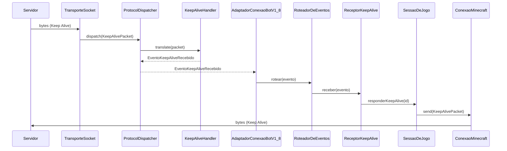
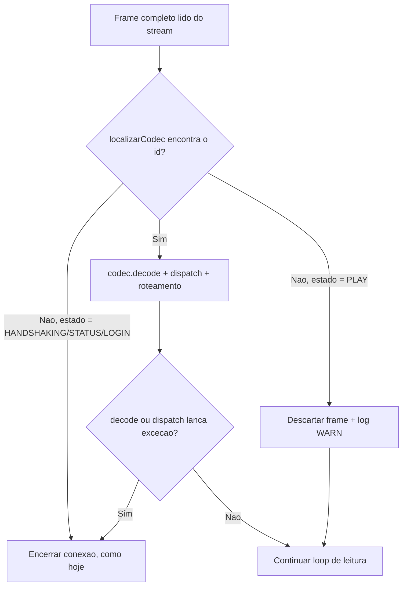
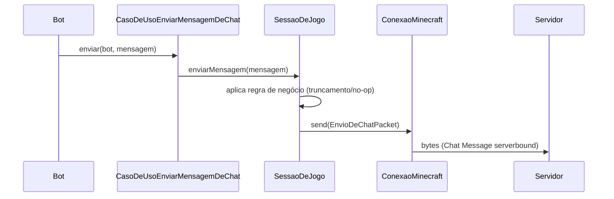

# 01 - Decisões Arquiteturais

## Objetivo

Este documento registra todas as decisões arquiteturais essenciais que devem ser tomadas antes do início da codificação do AdvancedBot em Java.

Ele documenta o contexto, as alternativas, a recomendação e os impactos de cada decisão para garantir alinhamento técnico.

---

## Premissas Oficiais do Projeto

Para garantir o sucesso da migração, as seguintes premissas são estabelecidas:

- A migração deve garantir paridade funcional com a versão legado C#.
- O sistema alvo utilizará Java 21 ou superior.
- Toda interface gráfica legada (Windows Forms e OpenGL) será descartada, focando em uma operação CLI ou API first.
- A arquitetura adotada deve favorecer alta escalabilidade e baixo acoplamento.
- A documentação é considerada parte integrante da entrega, não havendo código não documentado.

---

## Itens Bloqueadores da Migração

Os itens abaixo impedem o início da codificação e dependem de definição prévia.

- **Definição de Versões de Protocolo (DEC-01):** Impede a construção correta dos serializadores de rede.
- **Escolha do Framework Base (DEC-08):** Impede a configuração inicial do projeto e definição de injeção de dependências.
- **Implementação Criptográfica (DEC-04):** Impede o teste de conexões autenticadas.

---

## Decisões Obrigatórias Antes da Codificação

Esta seção lista as decisões críticas mapeadas no inventário inicial que exigem aprovação oficial.

### DEC-01 — Versões de Protocolo Suportadas

**Contexto:** O AdvancedBot suportava múltiplas versões do protocolo. A manutenção de múltiplos manipuladores é custosa.

**Problema Atual no C#:** O sistema contém diversas classes `Handler_v*` com lógica duplicada, dificultando a implementação de novos pacotes.

**Alternativas Possíveis:**
1. Manter suporte para todas as versões originais desde o início.
2. Focar exclusivamente em uma versão principal (exemplo 1.8) e expandir posteriormente.
3. Adotar uma biblioteca de abstração de protocolo de terceiros.

**Decisão Recomendada:** Alternativa 2. Iniciar com foco em protocolo único para validar a arquitetura antes de adicionar complexidade de múltiplas versões.

**Impacto na Implementação Java:** Simplifica a criação dos validadores e a abstração inicial de pacotes de rede, garantindo entrega de valor rápida.

---

### DEC-02 — Estratégia de Interface do Usuário

**Contexto:** A versão original possuía componentes de UI em Windows Forms e renderização 3D em OpenGL.

**Problema Atual no C#:** A lógica de interface gráfica está fortemente acoplada ao domínio do bot, dificultando operações sem interface visual.

**Alternativas Possíveis:**
1. Reescrever a interface usando JavaFX ou Swing.
2. Descartar interface rica e construir apenas um modelo de linha de comando.
3. Construir uma API REST e painel Web independente.

**Decisão Recomendada:** Alternativa 2. Priorizar um executável de terminal leve, isolando completamente a lógica do domínio.

**Impacto na Implementação Java:** Elimina a necessidade de migrar inúmeros arquivos de interface, reduzindo o esforço drasticamente. Foco total no núcleo da aplicação.

---

### DEC-03 — Modelo de Macros e Scripts

**Contexto:** Macros no C# utilizavam *threads* dedicadas ou simulação de execução paralela para emular o comportamento humano no jogo.

**Problema Atual no C#:** Muitas condições de corrida entre macros e o envio de pacotes na *thread* principal, além da falta de cancelamento seguro de tarefas.

**Alternativas Possíveis:**
1. Utilizar modelo de *thread* puro tradicional.
2. Utilizar executores baseados em eventos com `CompletableFuture`.
3. Implementar *Virtual Threads* ou modelo reativo.

**Decisão Recomendada:** Alternativa 3. Adotar as *Virtual Threads* do Java 21 para executar macros de forma concorrente com baixo custo computacional.

**Impacto na Implementação Java:** Mudança estrutural em todos os comandos e *plugins*, exigindo criação de uma API de interrupção confiável e isolamento de estado.

---

### DEC-04 — Provider de Criptografia AES-CFB8

**Contexto:** O protocolo de rede exige criptografia AES-CFB8 para autenticação na rede oficial da Mojang.

**Problema Atual no C#:** Implementação local propensa a falhas de compatibilidade, dificultando atualizações em ambientes complexos.

**Alternativas Possíveis:**
1. Escrever uma implementação customizada em Java puro.
2. Utilizar cifra nativa do *Java Cryptography Extension*.
3. Integrar a biblioteca BouncyCastle para garantir máxima compatibilidade.

**Decisão Recomendada:** Alternativa 3. Adotar BouncyCastle, que é largamente utilizado no ecossistema Minecraft para este fim específico.

**Impacto na Implementação Java:** Adição de uma dependência externa crítica, que garante robustez total na camada de comunicação de rede criptografada.

---

### DEC-05 — Formato de Configuração

**Contexto:** As configurações persistentes no C# utilizavam serialização binária proprietária através de formatação em NBT.

**Problema Atual no C#:** O formato binário restringe significativamente a edição manual e amigável das configurações por usuários comuns.

**Alternativas Possíveis:**
1. Manter arquivo original para total retrocompatibilidade com perfis antigos.
2. Migrar totalmente para JSON usando bibliotecas como Jackson ou Gson.
3. Adotar YAML para maior legibilidade manual e facilidade de manipulação.

**Decisão Recomendada:** Alternativa 3. Arquivos YAML são padrão do ecossistema moderno e fáceis de editar sem corromper estruturas cruciais.

**Impacto na Implementação Java:** Requer a construção de um novo sistema de configuração estruturado e perda da retrocompatibilidade com os perfis binários antigos.

---

### DEC-06 — Formato e Sistema de Plugins

**Contexto:** O AdvancedBot carregava módulos dinâmicos externos via sistema de injeção direta de bibliotecas compiladas.

**Problema Atual no C#:** O sistema original permitia acesso irrestrito ao núcleo do bot, causando quebras frequentes e falta de versionamento explícito.

**Alternativas Possíveis:**
1. Carregamento direto de bibliotecas customizadas sem mecanismos de isolamento.
2. Adotar um sistema de módulos complexo como o *Java Platform Module System*.
3. Criar uma API exposta altamente controlada para extensões baseadas em arquivos JAR.

**Decisão Recomendada:** Alternativa 3. Implementar um carregador simples com descritores declarativos e injeção rigorosamente controlada dos serviços.

**Impacto na Implementação Java:** Necessidade de desenhar uma interface central bem definida, restrita e exaustivamente documentada para os desenvolvedores.

---

### DEC-07 — Servidor Alvo Primário

**Contexto:** O foco da nova versão afetará diretamente quais classes do domínio legado serão migradas e testadas primeiro.

**Problema Atual no C#:** O código mescla comportamentos distintos de protocolos diferentes de forma confusa, sem prioridade de suporte definida.

**Alternativas Possíveis:**
1. Foco em servidores antigos utilizando pacotes primitivos.
2. Foco no protocolo 1.8 devido a estabilidade na comunidade de PvP.
3. Foco exclusivo nas versões mais recentes e atualizadas do jogo.

**Decisão Recomendada:** Alternativa 2. A versão 1.8 estabelece o ponto médio ideal e possui ferramentas estabelecidas para validação funcional do *bypass*.

**Impacto na Implementação Java:** Esforço inicial direcionado ao manipulador correspondente e às lógicas específicas de movimentação associadas a essa época.

---

### DEC-08 — Framework Base do Projeto Java

**Contexto:** O bot original funcionava como uma aplicação local isolada sem adoção de nenhum controlador central ou inversão de controle.

**Problema Atual no C#:** O forte acoplamento e o controle de estado global dificultam severamente a criação e a manutenção de testes automatizados seguros.

**Alternativas Possíveis:**
1. Utilizar aplicação local bruta construindo um motor próprio de controle.
2. Adotar o Spring Boot para orquestração geral do ciclo de vida.
3. Utilizar o Quarkus focando em minimizar o uso de memória volátil.

**Decisão Recomendada:** Alternativa 2. Adotar o Spring Boot devido ao amadurecimento das bibliotecas do ecossistema e enorme suporte da comunidade.

**Impacto na Implementação Java:** Redefine completamente a arquitetura de controle e dita como as instâncias essenciais serão injetadas através do sistema de dependência.

---

### DEC-09 — Modelo Operacional da Aplicação

**Contexto:** Definição de como o ciclo de vida e a concorrência dos bots serão governados no ambiente Java, afetando diretamente o isolamento e o paralelismo.

**Problema Atual no C#:** O forte acoplamento de estado global causa inconsistências, travamentos e falhas em cascata quando múltiplas instâncias compartilham o mesmo processo.

**Alternativas Possíveis:**
1. Modelo Single-Tenant, com uma JVM isolada por instância ou perfil de bot.
2. Modelo Multi-Tenant, utilizando uma única JVM para executar e gerenciar múltiplos perfis simultâneos.

**Decisão Recomendada:** Alternativa 1. Adotar a execução Single-Tenant (Uma JVM por Bot), simplificando a separação de escopos e mitigando falhas generalizadas.

**Impacto na Implementação Java:** Remove a necessidade de isolamento dinâmico avançado (ex: ClassLoaders para plugins). O gerenciamento massivo de bots exigirá o uso do Spring Boot como orquestrador externo gerenciando as JVMs independentes do motor.

---

### DEC-10 — Gerenciamento e Suporte a Proxies

**Contexto:** O AdvancedBot legou nativamente o suporte a proxies. Na nova arquitetura Single-Tenant distribuída, o roteamento da comunicação precisa de suporte limpo, escalável e isolado.

**Problema Atual no C#:** O gerenciamento do proxy estava atrelado à interface e lógica de rede global, dificultando rotações ou execuções autônomas sem configuração de UI.

**Alternativas Possíveis:**
1. Configurar proxies via argumentos e propriedades globais da JVM.
2. Implementar suporte isolado instanciando e injetando objetos `java.net.Proxy` diretamente na criação dos *sockets* de conexão.
3. Delegar o roteamento de rede para um proxy reverso externo de infraestrutura.

**Decisão Recomendada:** Alternativa 2. A injeção direta de configurações proxy no *socket* de cada bot reforça o isolamento estrito proposto na DEC-09.

**Impacto na Implementação Java:** A parametrização de rede do bot necessitará de campos explícitos para configurações de Proxy. A arquitetura deverá permitir flexibilidade para uma futura adição de *pools* automáticos e rotação de IPs.

---

### DEC-11 — Idioma de Nomenclatura de Classes

**Contexto:** O [12-Guia-de-Nomenclatura.md](12-Guia-de-Nomenclatura.md) exigia nomes de classes Java exclusivamente em inglês. Ao iniciar a Milestone 3 (Migração do Núcleo do Domínio), o responsável pelo projeto solicitou nomes de classes em português.

**Problema Atual:** Divergência entre a governança aprovada (nomes em inglês) e a preferência explícita do responsável pelo projeto para o código de domínio.

**Alternativas Possíveis:**
1. Manter nomes de classes em inglês, conforme guia original.
2. Adotar nomes de classes em português em todo o código Java, atualizando o guia de nomenclatura.

**Decisão Tomada:** Alternativa 2. Nomes de **classes, interfaces, enums e records** passam a ser escritos em português. Nomes de **pacotes, métodos, variáveis e constantes** permanecem em inglês, conforme o guia original (nenhuma solicitação de alteração para esses itens).

**Justificativa:** Preferência explícita do responsável pelo projeto (Mateus Botega), aprovada em sessão de 2026-07-15, para iniciar a Milestone 3.

**Impacto na Implementação Java:** Atualiza a seção "Idioma Oficial" do [12-Guia-de-Nomenclatura.md](12-Guia-de-Nomenclatura.md). Aplica-se a todo código Java escrito a partir desta decisão; classes já existentes (ex: `AdvancedBotApplication`) não são renomeadas retroativamente sem necessidade funcional.

**Data:** 2026-07-15

**Responsável:** Mateus Botega

---

### DEC-12 — Estrutura de Pacotes: Camadas Clean Architecture

**Contexto:** O [08-Fundacao-Arquitetural-Java.md](08-Fundacao-Arquitetural-Java.md) definia uma estrutura de pacotes orientada a features (`core`, `network`, `protocol`, `bot`, `pathfinding`, `inventory`, `automation`, `proxy`, `scheduler`, `persistence`, `api`), sem pacotes explícitos de camada (`domain`, `application`, `infrastructure`, `interfaces`). Isso diverge do princípio já fixado no CLAUDE.md e na Decisão Arquitetural Congelada "Clean + Hexagonal", que exige preservar a separação entre domínio, aplicação, infraestrutura e interfaces.

**Problema Atual:** Ao iniciar a Milestone 3 (primeiras entidades, Value Objects e Use Cases do domínio), não havia pacote `domain` nem `application` onde alocar esse código sem violar a estrutura já aprovada.

**Alternativas Possíveis:**
1. Manter a estrutura orientada a features do 08-Fundacao, alocando entidades em `core` e casos de uso dentro do próprio pacote `bot`.
2. Reestruturar os pacotes em camadas Clean Architecture (`domain`, `application`, `infrastructure`, `interfaces`), mantendo os nomes de features já documentados como subpacotes dentro de cada camada.

**Decisão Tomada:** Alternativa 2. A estrutura esperada passa a ser:

```
com.advancedbot
 ├── domain            # Entidades, Value Objects, regras de negócio puras (antigo "core")
 │    ├── bot
 │    ├── network
 │    ├── protocol
 │    ├── pathfinding
 │    ├── inventory
 │    └── automation
 ├── application       # Casos de uso / orquestração de regras de domínio
 │    └── usecase
 ├── infrastructure    # Persistência, proxy, scheduler, configuração, logs
 │    ├── persistence
 │    ├── proxy
 │    └── scheduler
 └── interfaces        # Controllers / API exposta para front-end e dashboard
      └── api
```

**Justificativa:** Alinha a estrutura física de pacotes ao princípio Clean + Hexagonal já congelado, sem descartar nenhum dos módulos de feature já documentados no 08-Fundacao (apenas os reorganiza como subpacotes de camada). Aprovada explicitamente pelo responsável pelo projeto para desbloquear a Milestone 3.

**Impacto na Implementação Java:** Atualiza a seção "2. Estrutura Inicial do Projeto Maven" do [08-Fundacao-Arquitetural-Java.md](08-Fundacao-Arquitetural-Java.md). Módulos ainda não criados (network, protocol, pathfinding, etc.) adotam a nova estrutura ao serem implementados em milestones futuras; nenhum código existente precisa ser movido nesta sessão.

**Data:** 2026-07-15

**Responsável:** Mateus Botega

---

### DEC-13 — Arquitetura da Camada de Comunicação (Milestone 4, incremento 1)

**Contexto:** Antes de implementar Handshake, Login, Packets concretos e Socket (Milestone 4 completa), foi necessário desenhar a arquitetura da camada de comunicação — Packet, Codec, Serializer/Deserializer, Registry e Handler — e sua separação entre `domain`, `application` e `infrastructure` conforme DEC-12. O C# legado (`Client/PacketStream.cs`, `Client/ReadBuffer.cs`/`WriteBuffer.cs`, `Client/Handler/Handler_v18.cs`, `Client/IPacket.cs`) foi consultado apenas para entender responsabilidades, sem migração de código.

**Decisões Tomadas:**

1. **`RegistroDePacotes` pertence à infraestrutura (`infrastructure.protocol`), não ao domínio.** O mapeamento entre IDs de pacote, `EstadoConexao` e `Codec` é um detalhe de implementação do protocolo, não uma regra de domínio.
2. **`ProtocolDispatcher` (`infrastructure.protocol`) é o único responsável por localizar e encaminhar pacotes aos `PacketHandler`s.** `PacketHandler<T extends Packet>` (`domain.protocol`) fica restrito a traduzir um `Packet` em um `EventoDeProtocolo` — não realiza roteamento.
3. **`EventoDeProtocolo` (`domain.protocol`) é apenas uma interface marcadora nesta milestone.** O EventBus e a integração com o Bot Engine/domínio serão definidos em milestones futuras (Fase 5/6 do [07-Plano-de-Migracao-e-Estrategia-de-Implementacao.md](07-Plano-de-Migracao-e-Estrategia-de-Implementacao.md)).
4. **Sem Netty.** Conexão real (quando implementada) usará `java.net.Socket` bloqueante com uma Virtual Thread por conexão de bot, conforme DEC-03 — sem introduzir dependência de framework de rede assíncrona.
5. **`Packet`, `Codec<T>`, `LeitorDePacote`, `EscritorDePacote`, `EstadoConexao`, `VersaoProtocolo` e `PacketHandler<T>` permanecem em `domain.protocol`** — contratos puros, sem I/O. `ConexaoMinecraft` (port) e `SessaoDeRede` (Value Object imutável) permanecem em `domain.network`. `ConexaoBotPort` foi criado em `application.port` para a Application depender de uma abstração de conexão em vez de I/O concreto.
6. **Diretórios legados pré-DEC-12** (`com.advancedbot.core`, `.bot`, `.network`, `.protocol`, `.pathfinding`, todos vazios com apenas `.gitkeep`) foram removidos após a criação e validação (compilação + testes) da nova estrutura sob `domain`/`application`/`infrastructure`.

**Justificativa:** Corrige três problemas identificados no C# legado — pacotes assimétricos (escrita orientada a objeto, leitura procedural via switch), ausência de registry declarativo (IDs hardcoded por pacote) e Handler acoplando decodificação com reação de jogo — sem introduzir abstrações além do necessário para esta etapa (nenhum Packet concreto, Handshake, Login ou Socket real foi implementado).

**Impacto na Implementação Java:** Cria os pacotes `domain.protocol`, `domain.network`, `application.port` e `infrastructure.protocol` com os contratos: `Packet`, `Codec`, `LeitorDePacote`, `EscritorDePacote`, `EstadoConexao`, `VersaoProtocolo`, `PacketHandler`, `EventoDeProtocolo`, `ConexaoMinecraft`, `SessaoDeRede`, `ConexaoBotPort`, `RegistroDePacotes`, `ProtocolDispatcher`. Nenhum pacote concreto de protocolo (1.5.2/1.8), Handshake, Login ou adapter de Socket real foi criado — fica para o próximo incremento da Milestone 4.

**Data:** 2026-07-15

**Responsável:** Mateus Botega

---

### DEC-14 — Suporte a Unsigned Short em LeitorDePacote/EscritorDePacote (Milestone 4, incremento 2)

**Contexto:** Ao implementar `HandshakeCodec` usando o C# (`Client/Packets/PacketHandshake.cs`, `Client/WriteBuffer.cs`/`ReadBuffer.cs`) como fonte da verdade, identificou-se que o campo `ServerPort` é serializado como `ushort` (`WriteUShort`/`ReadUShort`, 2 bytes, 0–65535). Os contratos `LeitorDePacote`/`EscritorDePacote` definidos na DEC-13 continham apenas `readShort`/`writeShort` (signed, intervalo até 32767), insuficiente para representar corretamente portas acima de 32767.

**Decisão Tomada:** Adicionar `readUnsignedShort(): int` e `writeUnsignedShort(int)` aos contratos `LeitorDePacote`/`EscritorDePacote` (`domain.protocol`), mantendo os métodos `readShort`/`writeShort` existentes intocados. É uma extensão aditiva do contrato já aprovado, não uma reversão de decisão — decorre diretamente da fidelidade ao protocolo/C# exigida pelo CLAUDE.md ("na ausência de decisão previamente documentada, o C# é fonte da verdade").

**Justificativa:** Sem essa extensão, `HandshakePacket.serverPort` não poderia representar corretamente portas no intervalo 32768–65535, quebrando paridade com o comportamento do legado.

**Impacto na Implementação Java:** `LeitorDePacote` e `EscritorDePacote` ganham os métodos `readUnsignedShort`/`writeUnsignedShort`. `BufferLeitorDePacote`/`BufferEscritorDePacote` (`infrastructure.protocol`, novas implementações concretas dos dois contratos, usadas para exercitar os Codecs nos testes) implementam ambos os pares (signed e unsigned).

**Data:** 2026-07-15

**Responsável:** Mateus Botega

---

### DEC-15 — Suporte a Byte Array em LeitorDePacote/EscritorDePacote (Milestone 4, incremento 3)

**Contexto:** Ao implementar `EncryptionRequestCodec` e `EncryptionResponseCodec` usando o C# (`AdvancedBot.Client.MinecraftClient.cs`, método `HandlePacket`/case 1; `AdvancedBot.Client.Packets.PacketEncryptionResponse.cs`; `AdvancedBot.Client.ReadBuffer.cs`/`WriteBuffer.cs`) como fonte da verdade, identificou-se que os campos `publicKey`/`verifyToken` (Encryption Request) e `sharedSecret`/`verifyToken` (Encryption Response) são arrays de bytes crus prefixados por um comprimento `VarInt` (`ReadByteArray(ReadVarInt())` / `WriteVarInt(len)` + `WriteByteArray(...)` no C#). Os contratos `LeitorDePacote`/`EscritorDePacote` (DEC-13, estendidos na DEC-14) não continham nenhum método para ler/escrever `byte[]`.

**Decisão Tomada:** Adicionar `readByteArray(int length): byte[]` e `writeByteArray(byte[] value): void` aos contratos `LeitorDePacote`/`EscritorDePacote` (`domain.protocol`), mantendo todos os métodos existentes intocados. É uma extensão aditiva do contrato já aprovado, no mesmo espírito da DEC-14. O comprimento (`VarInt`) continua sendo lido/escrito explicitamente pelo Codec chamador (`readByteArray(leitor.readVarInt())`, `writeVarInt(length)` seguido de `writeByteArray(...)`), replicando exatamente o padrão do C# em vez de embutir a lógica de comprimento dentro do método de array.

**Justificativa:** Sem essa extensão, `EncryptionRequestPacket`/`EncryptionResponsePacket` não poderiam representar corretamente os campos criptográficos crus do protocolo, quebrando paridade com o comportamento do legado.

**Impacto na Implementação Java:** `LeitorDePacote` e `EscritorDePacote` ganham os métodos `readByteArray`/`writeByteArray`. `BufferLeitorDePacote`/`BufferEscritorDePacote` implementam ambos sobre o buffer em memória existente.

**Data:** 2026-07-15

**Responsável:** Mateus Botega

---

### DEC-16 — Sentido do Pacote (Direção) no RegistroDePacotes (Milestone 4, incremento 3)

**Contexto:** Ao registrar `EncryptionRequestPacket` (enviado pelo servidor) e `EncryptionResponsePacket` (enviado pelo cliente) no `RegistroDePacotesV1_8`, identificou-se uma colisão real: o protocolo Minecraft 1.8 reutiliza o id `0x01` no estado `LOGIN` para dois pacotes distintos, um em cada direção. O `RegistroDePacotes` definido na DEC-13 indexava apenas por `(EstadoConexao, id)`, sem nenhuma noção de direção — `localizarCodec(LOGIN, 0x01)` retornaria apenas um dos dois Codecs (o último registrado), mascarando o outro silenciosamente.

**Problema Atual:** Diferente da DEC-14 e da DEC-15 (extensões puramente aditivas), esta correção exige alterar a assinatura de métodos já aprovados e implementados na DEC-13 (`registrar` e `localizarCodec`), afetando os dois registros existentes (`HandshakePacket`, `LoginStartPacket`) e o teste `RegistroDePacotesV1_8Test`.

**Alternativas Possíveis:**
1. Adicionar um enum `SentidoDoPacote` (`CLIENTBOUND`/`SERVERBOUND`) como parte da chave de `registrar`/`localizarCodec`, corrigindo a causa raiz.
2. Registrar `EncryptionResponsePacket` apenas para lookup por tipo (`localizarId`), sem entrar no mapa id→Codec, evitando alterar a interface aprovada mas tratando os pacotes de forma assimétrica.
3. Adiar a implementação de `EncryptionRequestPacket`/`EncryptionResponsePacket` para um incremento futuro, junto ao `ProtocolDispatcher`.

**Decisão Tomada:** Alternativa 1, escolhida explicitamente pelo responsável pelo projeto diante da colisão identificada. `RegistroDePacotes.registrar` e `localizarCodec` passam a receber um `SentidoDoPacote` (`CLIENTBOUND`/`SERVERBOUND`, novo enum em `domain.protocol`). `localizarId(EstadoConexao, Class)` permanece com a assinatura original — cada `Class` de Packet já implica uma única direção, então não há ambiguidade nesse sentido de busca.

**Justificativa:** É a única alternativa que corrige a causa raiz com fidelidade real ao protocolo (que reutiliza IDs entre direções dentro do mesmo estado) sem mascarar silenciosamente um dos dois Codecs. Extensões puramente aditivas não resolvem colisões de chave — apenas alterar a chave de busca resolve.

**Impacto na Implementação Java:** `domain.protocol.SentidoDoPacote` (novo enum). `RegistroDePacotes.registrar`/`localizarCodec` ganham o parâmetro `SentidoDoPacote`. `RegistroDePacotesV1_8` atualiza os 2 registros existentes (`HandshakePacket` e `LoginStartPacket`, ambos `SERVERBOUND`) e adiciona os 4 novos registros desta milestone (`EncryptionRequestPacket` CLIENTBOUND, `EncryptionResponsePacket` SERVERBOUND, `LoginSuccessPacket` CLIENTBOUND, `SetCompressionPacket` CLIENTBOUND). `RegistroDePacotesV1_8Test` atualizado para refletir a nova assinatura, incluindo teste dedicado provando que os dois Codecs no id 0x01 são distinguidos corretamente.

**Data:** 2026-07-15

**Responsável:** Mateus Botega

---

### DEC-17 — Transição de EstadoConexao no ConexaoMinecraft e Conexão Síncrona no ConexaoBotPort (Milestone 4, Incremento 6)

**Contexto:** Ao implementar o primeiro adapter concreto de `ConexaoBotPort` (declarado desde a DEC-13, nunca implementado nem chamado — achado principal da auditoria da Milestone 4 Incremento 5), identificou-se que `ConexaoMinecraft`/`TransporteSocket` não oferece nenhuma forma de avançar `EstadoConexao` após a construção — `send()` e o `readLoop()` resolvem id/Codec via `SessaoDeRede.estadoConexao()`, que fica travado em `HANDSHAKING` para sempre. Enviar `HandshakePacket` (HANDSHAKING/SERVERBOUND) seguido de `LoginStartPacket` (registrado em LOGIN/SERVERBOUND) falharia sempre com `IllegalArgumentException` em `RegistroDePacotes.localizarId` — não é um caso extremo, é o caminho feliz do fluxo de conexão.

Adicionalmente, `ConexaoBotPort.connect(EnderecoServidor, CredenciaisBot): SessaoBot` (assinatura já aprovada na DEC-13) retorna `SessaoBot` de forma síncrona, diferente do C# legado (`AdvancedBot.Client.MinecraftClient.cs`, método `ConnectAndHandshake()`), que envia Handshake+LoginStart e retorna imediatamente, tratando a resposta de forma assíncrona via `Stream.OnPacketAvailable += HandlePacket`.

**Decisões Tomadas:**

1. **`ConexaoMinecraft` (`domain.network`) ganha o método `void avancarEstado(EstadoConexao novoEstado)`.** Extensão aditiva do contrato já aprovado (DEC-13), no mesmo espírito da DEC-14/DEC-15 — nenhum método existente muda. `TransporteSocket` implementa reatribuindo o campo `sessao` (já `volatile`) via `SessaoDeRede.comEstado(novoEstado)`, método que já existia desde o Incremento 1 sem nenhum chamador até agora. Quem decide QUANDO chamar `avancarEstado` é o adapter de protocolo (`AdaptadorConexaoBotV1_8`), não o `TransporteSocket` (que permanece agnóstico de protocolo) nem o `PacketHandler` (que só traduz, DEC-13) nem o Use Case (zero conhecimento de protocolo) — decidir que "depois do Handshake com `nextState=2` a conexão passa a LOGIN" é conhecimento do protocolo v1.8, não é autenticação/criptografia/Handshake real.

2. **`ConexaoBotPort.connect()` permanece síncrono/bloqueante** — não é alterado para retornar `CompletableFuture<SessaoBot>` ou `void`. A primeira implementação (`AdaptadorConexaoBotV1_8`) honra essa assinatura já aprovada bloqueando a thread chamadora em um `CompletableFuture<SessaoBot>` completado a partir do callback de pacotes recebidos, com timeout configurável (o C# usa 30s como `ReceiveTimeout`/`SendTimeout` em `ConnectAndHandshake()`, adotado como valor de referência). Isso é uma divergência deliberada do comportamento assíncrono do C#, registrada aqui conforme exige o CLAUDE.md ("registrar qualquer divergência em relação ao legado; caso a divergência seja arquitetural, abrir uma DEC antes da implementação").

**Justificativa:** Ambas as decisões preservam os contratos já aprovados (extensão aditiva, não alteração) e resolvem, com a menor superfície possível, o único bloqueador real para que `CasoDeUsoConectarBot → ConexaoBotPort → Adapter → ConexaoMinecraft → TransporteSocket → ProtocolDispatcher → PacketHandlers → EventoDeProtocolo → SessaoBot` funcione de ponta a ponta sem tocar em Encryption, Compression, Play State ou conexão real com um servidor.

**Limites explícitos desta DEC (não implementados):** nenhuma fábrica de produção que abra `java.net.Socket` real (o Adapter recebe a fábrica de conexão via `Function<EnderecoServidor, ConexaoMinecraft>` injetada, sem implementação de produção fornecida nesta etapa); nenhuma reação a `EventoEncryptionRequest`/`EventoSetCompression` além de falhar rápido e explicitamente (sem negociar criptografia/compressão); `CasoDeUsoDesconectarBot`/`ConexaoBotPort.disconnect()` continuam não integrados; nenhuma transição para `EstadoConexao.PLAY` (não há Packets/Handlers de Play State ainda).

**Impacto na Implementação Java:** `ConexaoMinecraft` ganha `avancarEstado`. `TransporteSocket` implementa. Novo `infrastructure.network.v1_8.AdaptadorConexaoBotV1_8` implementa `ConexaoBotPort` usando ambos. `CasoDeUsoConectarBot` passa a depender de `ConexaoBotPort` via construtor.

**Data:** 2026-07-16

**Responsável:** Mateus Botega

---

### DEC-18 — Extensão Aditiva de ConexaoMinecraft com ativarCompressao (Milestone 4, Incremento 8A)

**Contexto:** Ao implementar o suporte a compressão zlib do protocolo Minecraft 1.8 (bloqueador identificado no Incremento 7B — o servidor real Olimpo/Craftlandia exige compressão antes de prosseguir no LOGIN), identificou-se que `SessaoDeRede` já possui o wither `comCompressao(int)` desde o Incremento 1 (Milestone 4), sem nenhum chamador até agora — mesma situação de `comEstado`/`avancarEstado` antes da DEC-17. `ConexaoMinecraft` não oferecia nenhuma forma de acionar esse wither a partir de um adapter de protocolo.

**Decisão Tomada:** Adicionar `void ativarCompressao(int threshold)` a `ConexaoMinecraft` (`domain.network`), mantendo todos os métodos existentes intocados. `TransporteSocket` implementa reatribuindo `sessao` via `SessaoDeRede.comCompressao(threshold)` (método já existente, sem chamador até agora). Extensão aditiva do contrato já aprovado, no mesmo espírito da DEC-14/DEC-15/DEC-17 — nenhuma assinatura existente muda.

**Justificativa:** É o único ponto de entrada disponível para o adapter de protocolo (que depende apenas da abstração `ConexaoMinecraft`, nunca de `TransporteSocket` concretamente, por design desde a DEC-13) comandar a ativação de compressão sem que `TransporteSocket` precise conhecer tipos de pacote específicos de versão (`SetCompressionPacket` é v1.8) — o que violaria o invariante, já estabelecido desde o Incremento 6, de que `TransporteSocket` permanece agnóstico de protocolo.

Nomeado `ativarCompressao` (não `avancarCompressao`) deliberadamente: diferente de `EstadoConexao` (uma máquina de estados sequencial: HANDSHAKING→LOGIN→PLAY), compressão é uma ativação única e não-sequencial — "avançar" sugeriria uma progressão que não existe aqui.

**Observação registrada para decisões futuras:** `SessaoDeRede.comCifra()` também já existe sem chamador, e a criptografia (DEC-04) provavelmente vai precisar de um mecanismo análogo de ativação. Se isso se confirmar, será o terceiro método de "aplicar um wither de sessão" em `ConexaoMinecraft` — ponto em que um mecanismo mais genérico (ex.: receber um `UnaryOperator<SessaoDeRede>`) deve ser reconsiderado em vez de repetir o padrão uma terceira vez sem questionar (regra de três). Não generalizado agora porque a forma real da ativação de criptografia ainda é desconhecida (provavelmente exigirá estado mutável de `Cipher`/chave, não apenas um valor imutável em um record) — abstrair antes de ver esse segundo caso real seria especulativo.

**Impacto na Implementação Java:** `ConexaoMinecraft` ganha `ativarCompressao(int)`. `TransporteSocket` implementa. `infrastructure.protocol.CodificadorDeFrame`/`DecodificadorDeFrame` ganham sobrecargas aditivas — `encode(int,byte[],int)`/`decode(InputStream,int)` — implementando o framing com compressão via `java.util.zip.Deflater`/`Inflater` (nível `BEST_SPEED`, formato zlib), equivalente exato a `Ionic.Zlib.ZlibStream`/`CompressionLevel.BestSpeed` do C#, sem dependência nova (já catalogado em `05-Dependencias-e-Bibliotecas.md`). `dataLength` é usado como dica de pré-alocação do buffer de descompressão, não como validação rígida — o C# legado (`ZlibStream.UncompressBuffer`) também não valida esse valor, só usa sua largura em bytes para localizar o início dos dados comprimidos; validar estritamente poderia rejeitar um servidor real que o C# tolera. Único guard adicionado: o valor declarado de `dataLength` é limitado ao mesmo teto de 2 MiB já aplicado ao frame externo. `AdaptadorConexaoBotV1_8` não foi alterado nesta etapa — `EventoSetCompression` continua falhando explicitamente (fica para o Incremento 8B).

**Data:** 2026-07-16

**Responsável:** Mateus Botega

---

### DEC-19 — Retenção da Sessão de Jogo e Roteamento de Eventos no Estado PLAY (Milestone 5, Fase de Planejamento)

**Contexto:** A Milestone 4 encerrou com a arquitetura de comunicação completa e o fluxo de LOGIN validado ponta a ponta contra servidor real (Incremento 8C), mas deixou registrado um risco explícito na seção "Base Pronta para a Milestone 5" do [11-Estado-Atual-Migracao.md](11-Estado-Atual-Migracao.md): o mecanismo de reação a pacotes em `AdaptadorConexaoBotV1_8` "hoje é modelado só para o terminal do LOGIN, sem rota para pacotes pós-PLAY". `ConexaoBotPort.connect(EnderecoServidor, CredenciaisBot)` retorna apenas `SessaoBot` — um Value Object de dois campos (`state`, `autoReconnect`) — e a instância real de `ConexaoMinecraft`, construída e usada dentro do adapter para enviar Handshake/LoginStart e para registrar o único consumidor de pacotes da conexão (`onPacketReceived`), nunca escapa do escopo do método `connect()`. Ela permanece viva apenas por captura de closure na lambda que reage a pacotes — nenhum código fora do adapter tem uma referência para agir sobre a conexão depois que o login termina.

Adicionalmente, `EventoDeProtocolo` é, desde a DEC-13, apenas uma interface marcadora — a própria DEC-13 registrou explicitamente que "o EventBus e a integração com o Bot Engine/domínio serão definidos em milestones futuras". O único consumidor de um `EventoDeProtocolo` hoje é um `instanceof EventoLoginSuccess` embutido dentro do método privado `reagirAoPacote`, que trata exatamente um evento terminal (sucesso do login) e descarta qualquer outro evento sem reação. Esse padrão é suficiente para LOGIN (um fluxo finito, de pergunta-resposta) mas não escala para PLAY, que produzirá dezenas de tipos de evento continuamente durante toda a vida da sessão.

**Problema:** Não existe hoje nenhum mecanismo para (1) reter a conexão viva além do escopo de `connect()`, nem (2) rotear mais de um tipo de `EventoDeProtocolo` para reações distintas de forma extensível. Sem resolver ambos, `EstadoConexao.PLAY` (já presente no enum desde a Milestone 4) permanece inatingível na prática: o primeiro pacote PLAY que um servidor real envia após `LoginSuccess` não tem Codec registrado, e mesmo que tivesse, não haveria como a aplicação agir sobre ele.

**Motivação:** Iniciar a implementação de qualquer pacote PLAY (Incremento 3 em diante do roadmap de Milestone 5) exige que este mecanismo já exista — não é um refinamento incremental posterior, é um pré-requisito estrutural, exatamente como identificado na auditoria de encerramento da Milestone 4.

**Alternativas Possíveis:**

1. **Estender `ConexaoBotPort.connect()` para aceitar um callback/listener além dos parâmetros atuais**, mantendo o retorno `SessaoBot` inalterado.
   Vantagens: não quebra a assinatura já aprovada.
   Desvantagens: não resolve o problema de retenção — a aplicação ainda não teria uma referência à conexão para agir depois, apenas para ser notificada; exigiria um segundo mecanismo de retenção de qualquer forma.

2. **Introduzir um barramento de eventos genérico da aplicação** (ex.: `ApplicationEventPublisher` do Spring, ou uma fila compartilhada tipo LMAX Disruptor), inspirado na proposta encontrada em `docs-reescrita/20-Rastreabilidade/04-Mapa-de-Eventos.md`.
   Vantagens: framework maduro, suporte a múltiplos assinantes sem código de roteamento próprio.
   Desvantagens: contradiz diretamente a DEC-13 item 4 ("Sem Netty... sem introduzir dependência de framework de rede assíncrona" — o mesmo espírito se aplica a um barramento de eventos pesado) e a DEC-09 (modelo Single-Tenant, uma JVM isolada por bot; um barramento pensado para múltiplos assinantes globais não tem papel claro nesse isolamento). Introduziria tecnologia nova sem necessidade comprovada, na contramão do princípio do CLAUDE.md de evitar abstrações além do necessário.

3. **Criar um novo agregado de sessão de jogo (`SessaoDeJogo`) que retém a conexão viva, associado a `Bot`; e um roteador de eventos simples, escopado à sessão, seguindo o mesmo padrão de mapa explícito já usado por `ProtocolDispatcher`/`handlersV1_8()`.**
   Vantagens: resolve os dois problemas com o menor acréscimo de superfície; reaproveita um padrão (mapa `Class → comportamento`) já validado por 12 incrementos da Milestone 4; permanece consistente com DEC-09 (escopado por bot) e DEC-12 (camadas já definidas).
   Desvantagens: exige alterar o tipo de retorno de `ConexaoBotPort.connect()` — a única mudança não puramente aditiva desta decisão (ver "Relação com Decisões Anteriores").

**Decisão Tomada:** Alternativa 3.

Um novo tipo `SessaoDeJogo` (`domain.bot`) passa a representar a sessão de jogo ativa de um `Bot` — o agregado que sobrevive ao término de `connect()` e permite ação contínua durante PLAY. `SessaoDeJogo` retém a referência à `ConexaoMinecraft` já estabelecida e viva. Nesta decisão, sua única responsabilidade é essa retenção; futuros incrementos (Mundo, Entidade, Jogador, Inventário, Chat) irão associá-la, quando cada um for implementado, sem exigir nova DEC apenas para adicionar uma referência.

`ConexaoBotPort.connect(EnderecoServidor, CredenciaisBot)` passa a retornar `SessaoDeJogo` em vez de `SessaoBot`. `SessaoDeJogo` expõe o estado de sessão do bot através de um método de leitura (`sessaoBot(): SessaoBot`), preservando toda a informação que o retorno anterior carregava.

`Bot` ganha um novo campo, `sessaoDeJogo: SessaoDeJogo` (nulo enquanto não conectado ou durante LOGIN; atribuído no sucesso do login), e um novo método `iniciarSessaoDeJogo(SessaoDeJogo)` — mutação controlada, no mesmo espírito de `updateSession(SessaoBot)` já existente. Nenhum campo ou método existente de `Bot` é removido ou alterado.

Um novo par de tipos formaliza o roteamento evento→domínio: `ReceptorDeEvento<T extends EventoDeProtocolo>` (`domain.protocol`, interface com um único método `receber(T evento)`, espelhando deliberadamente a forma de `PacketHandler<T extends Packet>`) e `RoteadorDeEventos` (`infrastructure.protocol`, mantém um `Map<Class<? extends EventoDeProtocolo>, ReceptorDeEvento<?>>` e expõe `rotear(EventoDeProtocolo evento)`), seguindo exatamente o mesmo estilo de mapa explícito, construído no ponto de composição (hoje, dentro de `AdaptadorConexaoBotV1_8`), já usado para `handlersV1_8()`. O comportamento de `RoteadorDeEventos.rotear` diante de um evento sem receptor registrado é definido pela DEC-20 (não duplicado aqui).

`ConexaoMinecraft` **não** ganha nenhum método novo nesta decisão — `onPacketReceived(Consumer<Packet>)` continua sendo o único ponto de entrada de pacotes da conexão. `reagirAoPacote` (ou seu equivalente) continua tratando os eventos de LOGIN exatamente como hoje (`instanceof EventoLoginSuccess`, `EventoEncryptionRequest`, `EventoSetCompression`); a partir do momento em que `EstadoConexao.PLAY` é alcançado, os eventos que não correspondem a nenhum desses casos especiais de LOGIN passam a ser encaminhados a `RoteadorDeEventos.rotear(evento)`.

**Justificativa:** Resolve os dois problemas identificados com o menor acréscimo possível de conceitos novos, reaproveitando um padrão (mapa explícito `Class → comportamento`) já validado pela própria Milestone 4 em `RegistroDePacotes`, `ProtocolDispatcher` e `handlersV1_8()` — em vez de introduzir uma tecnologia nova (Alternativa 2) para resolver um problema que o padrão já existente resolve igualmente bem em menor escala. Mantém o fluxo de LOGIN inalterado (baixo risco de regressão sobre os 110 testes existentes) e cria a única extensão estrutural realmente necessária para que a Milestone 5 comece.

**Consequências:**

*Positivas:*

- `EstadoConexao.PLAY` deixa de ser inatingível na prática — a aplicação passa a ter uma referência viva para agir e observar.
- Cada novo tipo de evento PLAY ganha um receptor dedicado e isolado, sem exigir alteração em `ProtocolDispatcher`, `RegistroDePacotes` ou em receptores já existentes (Aberto/Fechado preservado).
- `CasoDeUsoConectarBot` e os demais Use Cases existentes continuam sem nenhum import de tipo de protocolo/pacote — a mesma propriedade já validada desde a DEC-13.

*Negativas:*

- `ConexaoBotPort.connect()` sofre a única alteração de assinatura desta decisão (ver abaixo), exigindo atualizar o adapter e os testes que hoje dependem do retorno `SessaoBot` direto.
- `SessaoDeJogo` é um agregado que crescerá em responsabilidade a cada incremento futuro (Mundo, Jogador, Inventário...) — exige disciplina para não se tornar um novo "god object" à semelhança do `MinecraftClient` do C# legado; cada incremento futuro deve adicionar apenas a referência que efetivamente precisa, nunca estado especulativo.

**Impacto por Camada:**

- **Domain:** novo `domain.bot.SessaoDeJogo`; `domain.bot.Bot` ganha o campo `sessaoDeJogo` e o método `iniciarSessaoDeJogo`; novo `domain.protocol.ReceptorDeEvento<T>`. Nenhum tipo existente em `domain.protocol` ou `domain.network` é alterado.
- **Application:** `application.port.ConexaoBotPort.connect(...)` muda o tipo de retorno de `SessaoBot` para `SessaoDeJogo`; `application.usecase.CasoDeUsoConectarBot` atualiza o corpo (não a assinatura pública) para extrair `SessaoBot` de `SessaoDeJogo` e chamar `bot.iniciarSessaoDeJogo(...)`.
- **Infrastructure:** novo `infrastructure.protocol.RoteadorDeEventos`; `infrastructure.network.v1_8.AdaptadorConexaoBotV1_8` passa a construir `SessaoDeJogo` ao concluir o login com sucesso, monta o `RoteadorDeEventos` com os receptores disponíveis (mesmo padrão de `handlersV1_8()`), e encaminha a ele os eventos de PLAY não tratados como caso especial de LOGIN.

**Responsabilidades dos Componentes:**

- **`Bot`:** identidade e configuração de conexão (inalterado); expõe `SessaoBot` (ciclo de vida) e, quando conectado, `SessaoDeJogo` (sessão de jogo ativa). Não conhece protocolo, pacotes ou eventos.
- **`SessaoDeJogo`:** raiz da sessão de jogo ativa. Nesta decisão, retém apenas a capacidade de agir sobre a conexão já estabelecida. Não conhece formato de pacote, IDs ou Codecs — expõe apenas métodos de intenção (ex.: futuramente `enviarChat(String)`), nunca um `enviar(Packet)` genérico; cada método nasce junto com o incremento que o implementa.
- **`ReceptorDeEvento<T>`:** uma implementação por tipo de evento (a partir do Incremento 3 do roadmap de Milestone 5). Traduz exatamente um `EventoDeProtocolo` em exatamente uma chamada sobre exatamente um agregado de domínio. Não decide roteamento, não conhece outros tipos de evento.
- **`RoteadorDeEventos`:** despacha um `EventoDeProtocolo` já produzido pelo `ProtocolDispatcher` ao `ReceptorDeEvento` registrado para o seu tipo concreto. Não interpreta significado de domínio, apenas encaminha.
- **Futuros Use Cases (ex.: `CasoDeUsoEnviarMensagemDeChat`):** recebem um `Bot`, validam que `sessaoDeJogo` não é nula (bot efetivamente em PLAY), e invocam o método de intenção correspondente em `SessaoDeJogo` — nunca constroem ou importam um `Packet` diretamente, preservando a mesma separação entre domínio e protocolo já demonstrada por `CasoDeUsoConectarBot`.

**Exemplo de Fluxo:**



**Relação com Decisões Anteriores:**

- **DEC-13** deferiu explicitamente "EventBus e integração com o domínio... para milestones futuras" — esta decisão cumpre essa promessa, sem reabrir nenhuma das cinco decisões tomadas na DEC-13 (Packet/Codec/PacketHandler/EventoDeProtocolo/ProtocolDispatcher permanecem exatamente como definidos).
- **DEC-09** (Single-Tenant): `SessaoDeJogo` e `RoteadorDeEventos` são escopados a uma conexão/bot, nunca compartilhados entre instâncias — reforça, não contradiz, o isolamento já decidido.
- **DEC-12** (camadas): todos os tipos novos respeitam a estrutura já fixada (`domain`/`application`/`infrastructure`); nenhum pacote novo fora dos já previstos foi necessário.
- **DEC-17**: manteve `ConexaoBotPort.connect()` síncrono e adicionou `ConexaoMinecraft.avancarEstado` de forma aditiva — esta decisão preserva o caráter síncrono de `connect()` (não é reaberto) e não adiciona nenhum método novo a `ConexaoMinecraft`.
- **DEC-16** é o precedente direto para a única mudança não aditiva desta decisão: assim como a DEC-16 alterou a assinatura já aprovada de `RegistroDePacotes` por não haver alternativa aditiva real diante de uma colisão de chave, a mudança do retorno de `ConexaoBotPort.connect()` (`SessaoBot` → `SessaoDeJogo`) é justificada pela mesma lógica — não existe forma aditiva de fazer uma referência hoje descartada escapar do método sem mudar o que ele retorna.
- **DEC-18** registrou a "regra de três" sobre `ConexaoMinecraft` acumular métodos de ativação (`avancarEstado`, `ativarCompressao`). Esta decisão evita deliberadamente adicionar um terceiro método desse tipo — a retenção de sessão é resolvida fora de `ConexaoMinecraft`, em `SessaoDeJogo`.
- A proposta de arquitetura mais pesada encontrada em `docs-reescrita/20-Rastreabilidade/04-Mapa-de-Eventos.md` (Netty, Spring `@EventListener`, LMAX Disruptor) foi avaliada como Alternativa 2 e rejeitada por contradizer DEC-13 e DEC-09, conforme registrado acima.

**Impacto na Implementação Java:** Cria `domain.bot.SessaoDeJogo`, `domain.protocol.ReceptorDeEvento<T>`, `infrastructure.protocol.RoteadorDeEventos`. Altera a assinatura de `application.port.ConexaoBotPort.connect(...)` (retorno `SessaoDeJogo`), o corpo de `application.usecase.CasoDeUsoConectarBot` e o corpo de `infrastructure.network.v1_8.AdaptadorConexaoBotV1_8` (construção de `SessaoDeJogo`, montagem e uso de `RoteadorDeEventos`). Adiciona campo e método a `domain.bot.Bot`. Os testes que hoje capturam o retorno de `connect()` como `SessaoBot` precisarão ser atualizados para `SessaoDeJogo.sessaoBot()` quando o Incremento 1 for implementado — fora do escopo desta DEC, que é exclusivamente documental.

**Data:** 2026-07-16

**Responsável:** Mateus Botega

---

### DEC-20 — Política de Tolerância a Pacotes PLAY Não Registrados (Milestone 5, Fase de Planejamento)

**Contexto:** Desde o Incremento 7C da Milestone 4, `TransporteSocket.readLoop` captura qualquer `RuntimeException` originada ao decodificar ou despachar um pacote — incluindo a `IllegalArgumentException` que `RegistroDePacotes.localizarCodec` lança para um id sem Codec registrado — e responde encerrando a conexão de forma controlada (`active = false`, liberação de `input`/`output`). Esse comportamento é coberto por teste de regressão explícito (`TransporteSocketTest.deveEncerrarReadLoopGraciosamenteEFecharRecursosAoReceberPacoteNaoRegistrado`) e foi correto e desejado durante toda a Milestone 4: HANDSHAKING e LOGIN são estados pequenos, totalmente cobertos pelos Codecs já implementados, e um pacote inesperado ali provavelmente indica um problema real (versão de protocolo errada, comportamento inesperado do servidor, ou um bug).

O estado PLAY do protocolo 1.8 tem mais de 30 tipos de pacote clientbound. A Milestone 5 os implementará incrementalmente (ver roadmap aprovado). Qualquer servidor Minecraft real envia o conjunto completo de pacotes PLAY assim que `Join Game` é recebido — não apenas os que já foram implementados. Sob o comportamento atual, o primeiro pacote PLAY ainda não coberto por um incremento encerraria a conexão inteira, tornando qualquer incremento de Play State impossível de validar contra um servidor real antes que todos os mais de 30 pacotes estivessem implementados — o oposto do que o roadmap incremental aprovado pressupõe.

**Problema:** `RegistroDePacotes`/`TransporteSocket.readLoop` não distinguem "pacote genuinamente corrompido ou inesperado" de "pacote PLAY válido ainda não implementado". As duas situações produzem hoje o mesmo resultado: encerramento da conexão.

**Diferença entre HANDSHAKING/LOGIN e PLAY:** HANDSHAKING e LOGIN permanecem estritos — cobertura completa já existe para ambos desde a Milestone 4, e o custo de um comportamento inesperado nesses estados (autenticação, handshake de versão) é alto o suficiente para justificar falhar rápido. PLAY é, por natureza e por desenho do roadmap, parcialmente coberto durante toda a Milestone 5 — a tolerância é uma propriedade exclusiva desse estado, nunca dos demais. STATUS (list ping) permanece implicitamente no grupo estrito, pelo mesmo raciocínio de HANDSHAKING/LOGIN — é um estado pequeno e totalmente especificado.

**Alternativas Possíveis:**

1. **Manter o comportamento atual sem distinção por estado.**
   Vantagens: nenhuma mudança de código.
   Desvantagens: torna qualquer incremento de PLAY impossível de validar contra servidor real antes de cobertura total — inviabiliza o próprio roadmap aprovado.

2. **Tolerar silenciosamente qualquer pacote não registrado, em qualquer `EstadoConexao`.**
   Vantagens: mudança mais simples possível.
   Desvantagens: enfraquece HANDSHAKING/LOGIN, que hoje se beneficiam corretamente do comportamento estrito; mascararia um problema real de protocolo/versão logo na abertura da conexão.

3. **Tolerância condicionada ao `EstadoConexao`: HANDSHAKING/STATUS/LOGIN permanecem estritos (sem nenhuma mudança de comportamento); apenas em PLAY um pacote sem Codec registrado é descartado (log e continua o loop) em vez de encerrar a conexão.**
   Vantagens: preserva integralmente o comportamento já validado e testado para HANDSHAKING/LOGIN; desbloqueia validação incremental de PLAY contra servidor real desde o primeiro pacote implementado.
   Desvantagens: exige que `TransporteSocket.readLoop` distinga precisamente "falha de busca de Codec" de "falha de decodificação de um Codec já registrado" (ver Decisão Tomada) — a segunda continua fatal em qualquer estado, incluindo PLAY, pois indica um Codec implementado incorretamente ou dados corrompidos, não uma lacuna de cobertura esperada.

4. **Introduzir um Packet/Handler genérico ("catch-all") que armazena os bytes crus de qualquer id não mapeado em PLAY, para inspeção posterior.**
   Vantagens: preserva o conteúdo do pacote descartado, útil para diagnóstico.
   Desvantagens: não é necessário para o objetivo imediato (apenas não derrubar a conexão); registrado como refinamento possível para decisão futura, não adotado agora.

**Decisão Tomada:** Alternativa 3.

O framing do protocolo Minecraft já isola o frame completo (`[VarInt length][VarInt packetId][payload]`) antes de qualquer tentativa de localizar um Codec — `DecodificadorDeFrame` lê a quantidade de bytes declarada pelo prefixo de comprimento externo e a mantém inteiramente em memória (`frameContent`) antes que `TransporteSocket.readLoop` sequer leia o `packetId`. Descartar um pacote não registrado é, portanto, apenas não chamar `codec.decode(...)` sobre um `frameContent` já totalmente lido — não exige adivinhar nenhum tamanho nem risco de desalinhar o stream.

`RegistroDePacotes` passa a lançar um tipo de exceção dedicado — `PacoteNaoRegistradoException extends IllegalArgumentException` — especificamente quando `localizarCodec`/`localizarId` não encontram uma entrada, em vez do `IllegalArgumentException` genérico usado hoje. Por ser um subtipo, qualquer código que hoje capture `IllegalArgumentException` genericamente continua funcionando sem alteração; a especialização existe apenas para que `TransporteSocket.readLoop` possa distinguir precisamente esse caso via `catch (PacoteNaoRegistradoException e)`.

`TransporteSocket.readLoop` passa a envolver separadamente a etapa de busca do Codec e a etapa de decodificação: se `localizarCodec` lançar `PacoteNaoRegistradoException` **e** `sessao.estadoConexao() == EstadoConexao.PLAY`, o frame já lido é descartado, um log de nível WARN é emitido (`EstadoConexao`, id do pacote em hexadecimal, tamanho do frame descartado), e o loop continua para o próximo frame. Em qualquer outro estado, ou se a exceção ocorrer durante `codec.decode(...)` (indicando um Codec registrado que falhou, não uma lacuna de cobertura), o comportamento permanece exatamente o de hoje — conexão encerrada de forma controlada.

**Justificativa:** É a única alternativa que preserva integralmente o comportamento já testado e aprovado para HANDSHAKING/LOGIN, ao mesmo tempo em que resolve a condição que tornaria o roadmap incremental da Milestone 5 impossível de validar contra servidor real. A distinção entre "Codec não encontrado" e "Codec encontrado mas falhou ao decodificar" evita que a tolerância mascare um bug real em um pacote já implementado — apenas lacunas de cobertura (esperadas durante toda a Milestone 5) são toleradas.

**Consequências:**

*Positivas:*

- Cada incremento do roadmap de Milestone 5 pode ser validado contra servidor real isoladamente, sem exigir cobertura completa dos mais de 30 pacotes PLAY primeiro.
- HANDSHAKING/LOGIN não perdem nenhuma garantia já validada pelos 110 testes existentes.
- Compatível por construção com servidores que enviam pacotes não-vanilla (ex.: plugin messages de servidores modificados) sem derrubar a conexão.

*Negativas:*

- Um pacote silenciosamente descartado é, por definição, um pacote não observado — o log em nível WARN é a única rede de segurança para notar lacunas de cobertura; deve ser monitorado, não ignorado, à medida que a Milestone 5 avança.
- Introduz uma nova exceção (`PacoteNaoRegistradoException`) que precisa ser adotada por todas as implementações de `RegistroDePacotes` (hoje apenas `RegistroDePacotesV1_8`) para que a distinção funcione corretamente.

**Estratégia de Tolerância e Logging:** Tolerância aplica-se exclusivamente à falha de localização de Codec (`PacoteNaoRegistradoException`) e exclusivamente quando `EstadoConexao.PLAY`. Toda ocorrência é registrada via SLF4J em nível WARN (nunca `System.out`, conforme Definition of Done), incluindo estado da conexão, id do pacote em hexadecimal e tamanho em bytes do frame descartado — suficiente para acompanhar lacunas de cobertura ao longo dos incrementos sem exigir nível DEBUG. Tolerância não é substituto para completar a cobertura de pacotes PLAY relevantes — é um mecanismo de transição que permite entregá-la de forma incremental e segura.

**Tratamento de Versões Futuras:** A condição de tolerância depende de `EstadoConexao`, não de `VersaoProtocolo` — é, por construção, agnóstica de versão. Uma futura implementação de `RegistroDePacotes` para outra versão do protocolo (ex.: `RegistroDePacotesV1_9`) herda automaticamente a mesma política ao lançar `PacoteNaoRegistradoException`, sem exigir nova DEC por versão.

**Comportamento Esperado em Produção:** Uma vez que a Milestone 5 atinja cobertura completa dos pacotes PLAY relevantes para o servidor-alvo (DEC-07: protocolo 1.8), este caminho tolerante deve raramente ou nunca ser exercitado contra um servidor vanilla em operação normal — sua presença é uma rede de segurança para entrega incremental e para pacotes não previstos (plugins de servidor), não uma justificativa para deixar de registrar pacotes PLAY relevantes ao domínio do bot.

**Impacto na Compatibilidade entre Versões:** Nenhum — a política é uma propriedade do `TransporteSocket`/`RegistroDePacotes`, camadas já comprovadamente agnósticas de versão (DEC-13), e não introduz nenhuma dependência nova entre `domain.protocol.v1_8` e qualquer versão futura.

**Impacto por Camada:**

- **Domain:** nenhum impacto.
- **Application:** nenhum impacto.
- **Infrastructure:** novo `infrastructure.protocol.PacoteNaoRegistradoException`; `infrastructure.protocol.v1_8.RegistroDePacotesV1_8` passa a lançar esse tipo em vez de `IllegalArgumentException` genérico; `infrastructure.network.TransporteSocket.readLoop` ganha a distinção de estado e de etapa descrita acima.

**Exemplo de Fluxo:**



**Relação com Decisões Anteriores:**

- Refina o comportamento introduzido no **Incremento 7C** da Milestone 4 (captura de `RuntimeException` em `readLoop`) — não o reverte; HANDSHAKING/LOGIN mantêm exatamente o mesmo comportamento validado por `TransporteSocketTest`.
- Consistente com **DEC-13**: `RegistroDePacotes` permanece na infraestrutura, `TransporteSocket` permanece agnóstico de tipos de protocolo específicos de versão.
- Habilita, na prática, o roteamento de eventos definido pela **DEC-19** — sem esta política, os primeiros incrementos de Play State não seriam testáveis contra servidor real.
- Consistente com a Política de Compatibilidade com o Legado do CLAUDE.md: nenhuma regra de negócio do C# é alterada por esta decisão — é uma decisão de robustez de infraestrutura Java, sem equivalente direto no legado (o mesmo raciocínio já registrado no Incremento 7C, que também não consultou o C#).

**Impacto na Implementação Java:** Cria `infrastructure.protocol.PacoteNaoRegistradoException` (subtipo de `IllegalArgumentException`). Altera o tipo de exceção lançado por `infrastructure.protocol.v1_8.RegistroDePacotesV1_8.localizarCodec`/`localizarId` e o corpo de `infrastructure.network.TransporteSocket.readLoop` (distinção por `EstadoConexao` e por etapa de falha). Testes existentes que capturam `IllegalArgumentException` (`RegistroDePacotesV1_8Test`) continuam passando sem alteração, por relação de subtipo; podem opcionalmente ser reforçados para asserir o tipo mais específico quando o Incremento 2 for implementado — fora do escopo desta DEC, que é exclusivamente documental.

**Data:** 2026-07-16

**Responsável:** Mateus Botega

---

### DEC-21 — Papel do Caso de Uso em Ações Iniciadas pelo Bot no Estado PLAY (Milestone 8, Incremento 8.1)

**Contexto:** Desde a DEC-19, todo pacote PLAY implementado segue o mesmo fluxo de entrada: `Servidor → Packet → Codec → Handler → Evento → Receptor → SessaoDeJogo`. A própria DEC-19 já registrou, na seção "Responsabilidades dos Componentes", a expectativa de que "futuros Use Cases (ex.: `CasoDeUsoEnviarMensagemDeChat`)... invocam o método de intenção correspondente em `SessaoDeJogo` — nunca constroem ou importam um `Packet` diretamente", mas essa expectativa nunca foi formalizada como regra própria, porque nenhum incremento até a Milestone 7 precisou de uma ação iniciada pelo bot (todos os pacotes de Milestone 5/6/7 são CLIENTBOUND, reativos a protocolo). A Milestone 8 introduz o primeiro caso real — Chat Enviado pelo Bot (Incremento 8.3) — e, junto dele, a primeira necessidade concreta de um Caso de Uso dentro do estado PLAY.

**Problema:** O padrão Receptor→`SessaoDeJogo` estabelecido pela DEC-19 resolve apenas o sentido servidor→bot. Não existe hoje nenhuma regra escrita sobre: quando um Caso de Uso deve existir para uma ação PLAY; o que `SessaoDeJogo` pode/deve fazer ao originar uma ação (em vez de apenas reagir a uma); e se isso exige algum novo Port. Sem essa regra, cada ação futura iniciada pelo bot (chat, e eventualmente outras, quando autorizadas) corre o risco de ser resolvida de forma ad-hoc e inconsistente entre si.

**Alternativas Possíveis:**

1. **Não introduzir nenhum Caso de Uso — `Bot`/camada de interface chama `SessaoDeJogo` diretamente.**
   Vantagens: menor número de classes.
   Desvantagens: contradiz a direção de dependência Clean/Hexagonal já estabelecida desde a DEC-12/DEC-13 (camada de aplicação orquestra casos de uso; a interface não deveria depender diretamente de agregados de domínio); quebra a simetria já usada por `CasoDeUsoConectarBot`/`CasoDeUsoDesconectarBot`, que sempre medeiam entre uma entrada externa e `Bot`.

2. **Introduzir um novo Port (`AcaoDoBotPort` ou equivalente) para toda ação iniciada pelo bot, paralelo a `ConexaoBotPort`.**
   Vantagens: separação explícita entre "conectar" e "agir".
   Desvantagens: desnecessário — `SessaoDeJogo` já retém a `ConexaoMinecraft` viva desde a DEC-19 e já demonstra, por `responderKeepAlive`/`atualizarPosicao`, que sabe enviar pacotes por conta própria sem precisar de um Port adicional; um novo Port aqui dividiria arbitrariamente uma responsabilidade que já tem dono.

3. **Formalizar exatamente o padrão que a DEC-19 já antecipou: um Caso de Uso por ação iniciada pelo bot (camada `application.usecase`), que recebe um `Bot`, valida `sessaoDeJogo` não nula, e invoca um método de intenção em `SessaoDeJogo`; `SessaoDeJogo` constrói o `Packet` correspondente e chama `conexao.send(...)` diretamente — sem nenhum Port novo.**
   Vantagens: zero superfície nova de Port; reaproveita 100% o precedente já em produção (`responderKeepAlive`, `atualizarPosicao` já fazem exatamente isso); mantém a mesma direção de dependência Clean/Hexagonal de todos os Casos de Uso existentes; a única classe genuinamente nova por ação é o próprio Caso de Uso e o método de intenção em `SessaoDeJogo`.
   Desvantagens: nenhuma identificada — é a formalização de um padrão que já existe em código, não uma mudança de comportamento.

**Decisão Tomada:** Alternativa 3.

Duas direções de fluxo passam a ser formalizadas e coexistem sem conflito:

- **Fluxo reativo a protocolo (inalterado, DEC-19):** `Servidor → Packet → Codec → Handler → Evento → Receptor → SessaoDeJogo`. Continua sendo o único caminho para qualquer coisa que o servidor envia.
- **Fluxo de ação iniciada pelo bot (novo, formalizado por esta decisão):** `CasoDeUso → SessaoDeJogo → ConexaoMinecraft → Packet → Servidor`. `CasoDeUso` nunca constrói nem importa um `Packet` ou `Codec`; `SessaoDeJogo` é quem sabe traduzir uma intenção de domínio em um `Packet` concreto e enviá-lo via `conexao.send(...)` — exatamente como já faz `responderKeepAlive(int id)` e `atualizarPosicao(...)` desde a Milestone 5, sem que nenhuma DEC anterior precisasse chamar atenção para isso, porque naqueles casos o envio era parte de uma reação (eco), não de uma ação originada externamente. Esta decisão nomeia e generaliza esse mesmo mecanismo para quando a origem é um Caso de Uso em vez de um Receptor.

**Justificativa:** É a alternativa de menor superfície nova possível — não introduz nenhum Port, não altera nenhum contrato existente (`ConexaoBotPort`, `ConexaoMinecraft`, `ReceptorDeEvento`, `PacketHandler` permanecem exatamente como são), e formaliza por escrito um padrão que já está em produção desde a Milestone 5 (`responderKeepAlive`/`atualizarPosicao`). Resolve o problema real (ausência de regra explícita para novas ações) sem inventar arquitetura nova.

**Consequências:**

*Positivas:*

- Toda ação futura iniciada pelo bot (quando autorizada) tem um critério claro e já testado de "onde colocar o código", sem decisão ad-hoc por incremento.
- Nenhum Port novo por ação — `SessaoDeJogo` continua sendo o único ponto de tradução entre intenção de domínio e protocolo, para os dois sentidos (entrada e saída).
- Casos de Uso do estado PLAY seguem a mesma forma dos já existentes (`CasoDeUsoConectarBot`), sem import de tipos de protocolo/pacote — propriedade validada desde a DEC-13, agora estendida sem exceção às ações de PLAY.

*Negativas:*

- `SessaoDeJogo` acumula, além do estado observável (posição, vida, inventário, mundo, entidades...), também a responsabilidade de originar envios — reforça a mesma advertência já registrada na DEC-19 contra `SessaoDeJogo` crescer para um "god object": cada método de intenção nasce apenas junto do incremento que o exige, nunca especulativamente.
- Sem Port dedicado para ações do bot, qualquer necessidade futura de testar um Caso de Uso de ação sem uma `SessaoDeJogo` real precisa de uma `ConexaoMinecraft` fake (o mesmo padrão de teste "sem mocks" já usado em toda a Milestone 5/7 — não é uma desvantagem nova, mas fica registrado).

**Impacto por Camada:**

- **Domain:** nenhuma interface alterada. `SessaoDeJogo` ganha métodos de intenção pontuais por incremento (ex.: `enviarMensagem(String)` no Incremento 8.3), no mesmo espírito de `responderKeepAlive`/`atualizarPosicao`.
- **Application:** novo padrão de Caso de Uso para ações de PLAY (ex.: `CasoDeUsoEnviarMensagemDeChat`), seguindo a mesma forma de `CasoDeUsoConectarBot` (construtor simples, método público recebendo `Bot`).
- **Infrastructure:** nenhum impacto — `AdaptadorConexaoBotV1_8`/`RegistroDePacotesV1_8` continuam registrando Codecs por `EstadoConexao`+id+`SentidoDoPacote`, sem distinção entre pacote "de entrada" ou "de saída" além do `SentidoDoPacote` já existente (DEC-16).

**Responsabilidades dos Componentes:**

- **`CasoDeUso` (ex.: `CasoDeUsoEnviarMensagemDeChat`):** recebe um `Bot` (e os dados primitivos da ação, ex. a mensagem); valida que `bot.getSessaoDeJogo()` não é nula (bot efetivamente em PLAY), lançando `IllegalStateException` caso contrário; invoca exatamente um método de intenção em `SessaoDeJogo`. Nunca constrói, importa ou referencia um `Packet`/`Codec`/tipo de `domain.protocol.v1_8`.
- **`SessaoDeJogo`:** único tradutor entre intenção de domínio e protocolo, nos dois sentidos. Para ações originadas pelo bot, expõe métodos de intenção (nunca um `enviar(Packet)` genérico — mesma restrição já fixada pela DEC-19), aplica qualquer regra de negócio pertencente à ação (ex.: truncamento de mensagem, no-op em entrada vazia) e chama `conexao.send(new PacoteConcreto(...))` diretamente.
- **`ConexaoMinecraft`:** nenhuma mudança de responsabilidade — continua sendo apenas o canal de transporte (`send`/`onPacketReceived`/`avancarEstado`/`ativarCompressao`/`close`), sem conhecimento de qual agregado ou Caso de Uso está do outro lado.
- **`ReceptorDeEvento`/Receptores concretos:** responsabilidade inalterada desde a DEC-19 — tratam exclusivamente o fluxo reativo a protocolo (servidor→bot). Não participam do fluxo de ação iniciada pelo bot, que não produz nem consome `EventoDeProtocolo`.

**Critérios para Criação de Novos Casos de Uso no Estado PLAY:** um novo Caso de Uso é criado quando, e somente quando, uma ação é iniciada por algo **externo ao protocolo** (o próprio bot, um usuário, um futuro script/comando — quando autorizado) em vez de ser uma reação a um `EventoDeProtocolo`. Se a ação é reação a um pacote recebido do servidor, o padrão continua sendo Receptor→`SessaoDeJogo` direto, sem Caso de Uso (nenhuma mudança em relação à DEC-19).

**Critérios para NÃO Criar Novos Ports:** nenhum Port novo é necessário enquanto a ação puder ser expressa como um método de intenção em `SessaoDeJogo` que termina em `conexao.send(...)` sobre a `ConexaoMinecraft` já retida desde o login (DEC-19). Um novo Port só se justificaria se a ação exigisse um canal de comunicação diferente de `ConexaoMinecraft` (ex.: um novo protocolo de transporte, uma API externa) — nenhuma ação de PLAY prevista até o momento exige isso.

**Exemplo de Fluxo:**



**Relação com Decisões Anteriores:**

- **DEC-19** já antecipou textualmente este exato padrão ("futuros Use Cases... invocam o método de intenção correspondente em `SessaoDeJogo`... nunca constroem ou importam um `Packet` diretamente") — esta decisão apenas formaliza, nomeia e generaliza o que já estava previsto, sem contradizer nenhuma parte da DEC-19.
- **DEC-13:** preserva a propriedade de que Casos de Uso não importam tipos de protocolo/pacote — agora explicitamente estendida às ações de PLAY, não apenas ao fluxo de conexão.
- **DEC-17/DEC-18:** `ConexaoMinecraft` não ganha nenhum método novo por esta decisão — reforça a "regra de três" já registrada na DEC-18 contra acumular métodos de ativação/side-channel em `ConexaoMinecraft`.
- Nenhuma DEC existente é alterada, revertida ou contradita por esta decisão — é puramente aditiva.

**Impacto na Implementação Java:** Nenhuma interface existente é alterada. Habilita, a partir do Incremento 8.3, `application.usecase.CasoDeUsoEnviarMensagemDeChat` e `domain.bot.SessaoDeJogo.enviarMensagem(String)`. Fora do escopo desta DEC (que é exclusivamente documental): a implementação concreta do Incremento 8.3.

**Data:** 2026-07-20

**Responsável:** Mateus Botega
