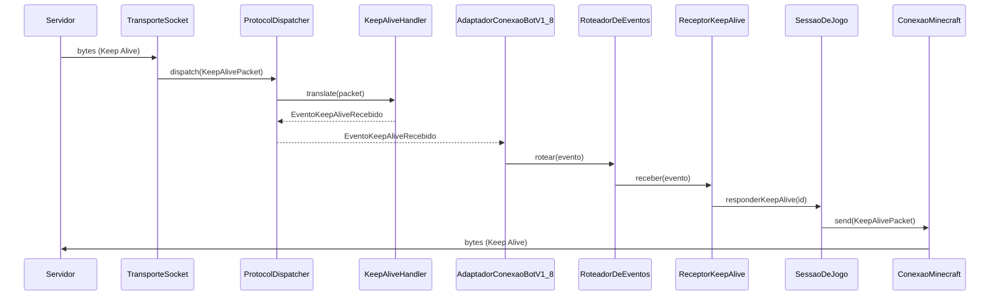
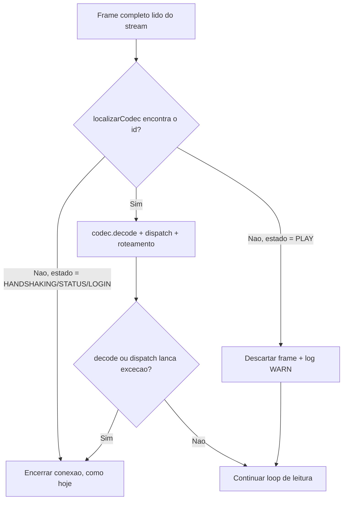
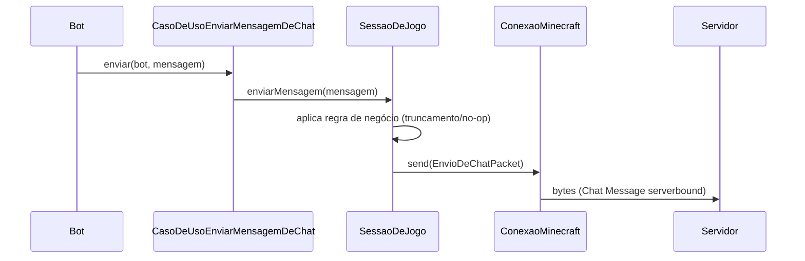
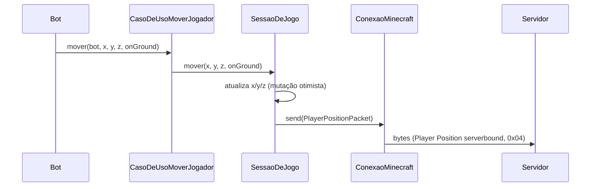

# 01 - Decisões Arquiteturais

## Objetivo

Este documento registra todas as decisões arquiteturais essenciais que devem ser tomadas antes do início da codificação do AdvancedBot em Java.

Ele documenta o contexto, as alternativas, a recomendação e os impactos de cada decisão para garantir alinhamento técnico.

---

## Premissas Oficiais do Projeto

Para garantir o sucesso da migração, as seguintes premissas são estabelecidas:

- A migração deve garantir paridade funcional com a versão legado C#.
- O sistema alvo utilizará Java 21 ou superior.
- Toda interface gráfica legada (Windows Forms e OpenGL) será descartada, focando em uma operação CLI ou API first.
- A arquitetura adotada deve favorecer alta escalabilidade e baixo acoplamento.
- A documentação é considerada parte integrante da entrega, não havendo código não documentado.

---

## Itens Bloqueadores da Migração

Os itens abaixo impedem o início da codificação e dependem de definição prévia.

- **Definição de Versões de Protocolo (DEC-01):** Impede a construção correta dos serializadores de rede.
- **Escolha do Framework Base (DEC-08):** Impede a configuração inicial do projeto e definição de injeção de dependências.
- **Implementação Criptográfica (DEC-04):** Impede o teste de conexões autenticadas.

---

## Decisões Obrigatórias Antes da Codificação

Esta seção lista as decisões críticas mapeadas no inventário inicial que exigem aprovação oficial.

### DEC-01 — Versões de Protocolo Suportadas

**Contexto:** O AdvancedBot suportava múltiplas versões do protocolo. A manutenção de múltiplos manipuladores é custosa.

**Problema Atual no C#:** O sistema contém diversas classes `Handler_v*` com lógica duplicada, dificultando a implementação de novos pacotes.

**Alternativas Possíveis:**
1. Manter suporte para todas as versões originais desde o início.
2. Focar exclusivamente em uma versão principal (exemplo 1.8) e expandir posteriormente.
3. Adotar uma biblioteca de abstração de protocolo de terceiros.

**Decisão Recomendada:** Alternativa 2. Iniciar com foco em protocolo único para validar a arquitetura antes de adicionar complexidade de múltiplas versões.

**Impacto na Implementação Java:** Simplifica a criação dos validadores e a abstração inicial de pacotes de rede, garantindo entrega de valor rápida.

---

### DEC-02 — Estratégia de Interface do Usuário

**Contexto:** A versão original possuía componentes de UI em Windows Forms e renderização 3D em OpenGL.

**Problema Atual no C#:** A lógica de interface gráfica está fortemente acoplada ao domínio do bot, dificultando operações sem interface visual.

**Alternativas Possíveis:**
1. Reescrever a interface usando JavaFX ou Swing.
2. Descartar interface rica e construir apenas um modelo de linha de comando.
3. Construir uma API REST e painel Web independente.

**Decisão Recomendada:** Alternativa 2. Priorizar um executável de terminal leve, isolando completamente a lógica do domínio.

**Impacto na Implementação Java:** Elimina a necessidade de migrar inúmeros arquivos de interface, reduzindo o esforço drasticamente. Foco total no núcleo da aplicação.

---

### DEC-03 — Modelo de Macros e Scripts

**Contexto:** Macros no C# utilizavam *threads* dedicadas ou simulação de execução paralela para emular o comportamento humano no jogo.

**Problema Atual no C#:** Muitas condições de corrida entre macros e o envio de pacotes na *thread* principal, além da falta de cancelamento seguro de tarefas.

**Alternativas Possíveis:**
1. Utilizar modelo de *thread* puro tradicional.
2. Utilizar executores baseados em eventos com `CompletableFuture`.
3. Implementar *Virtual Threads* ou modelo reativo.

**Decisão Recomendada:** Alternativa 3. Adotar as *Virtual Threads* do Java 21 para executar macros de forma concorrente com baixo custo computacional.

**Impacto na Implementação Java:** Mudança estrutural em todos os comandos e *plugins*, exigindo criação de uma API de interrupção confiável e isolamento de estado.

---

### DEC-04 — Provider de Criptografia AES-CFB8

**Contexto:** O protocolo de rede exige criptografia AES-CFB8 para autenticação na rede oficial da Mojang.

**Problema Atual no C#:** Implementação local propensa a falhas de compatibilidade, dificultando atualizações em ambientes complexos.

**Alternativas Possíveis:**
1. Escrever uma implementação customizada em Java puro.
2. Utilizar cifra nativa do *Java Cryptography Extension*.
3. Integrar a biblioteca BouncyCastle para garantir máxima compatibilidade.

**Decisão Recomendada:** Alternativa 3. Adotar BouncyCastle, que é largamente utilizado no ecossistema Minecraft para este fim específico.

**Impacto na Implementação Java:** Adição de uma dependência externa crítica, que garante robustez total na camada de comunicação de rede criptografada.

---

### DEC-05 — Formato de Configuração

**Contexto:** As configurações persistentes no C# utilizavam serialização binária proprietária através de formatação em NBT.

**Problema Atual no C#:** O formato binário restringe significativamente a edição manual e amigável das configurações por usuários comuns.

**Alternativas Possíveis:**
1. Manter arquivo original para total retrocompatibilidade com perfis antigos.
2. Migrar totalmente para JSON usando bibliotecas como Jackson ou Gson.
3. Adotar YAML para maior legibilidade manual e facilidade de manipulação.

**Decisão Recomendada:** Alternativa 3. Arquivos YAML são padrão do ecossistema moderno e fáceis de editar sem corromper estruturas cruciais.

**Impacto na Implementação Java:** Requer a construção de um novo sistema de configuração estruturado e perda da retrocompatibilidade com os perfis binários antigos.

---

### DEC-06 — Formato e Sistema de Plugins

**Contexto:** O AdvancedBot carregava módulos dinâmicos externos via sistema de injeção direta de bibliotecas compiladas.

**Problema Atual no C#:** O sistema original permitia acesso irrestrito ao núcleo do bot, causando quebras frequentes e falta de versionamento explícito.

**Alternativas Possíveis:**
1. Carregamento direto de bibliotecas customizadas sem mecanismos de isolamento.
2. Adotar um sistema de módulos complexo como o *Java Platform Module System*.
3. Criar uma API exposta altamente controlada para extensões baseadas em arquivos JAR.

**Decisão Recomendada:** Alternativa 3. Implementar um carregador simples com descritores declarativos e injeção rigorosamente controlada dos serviços.

**Impacto na Implementação Java:** Necessidade de desenhar uma interface central bem definida, restrita e exaustivamente documentada para os desenvolvedores.

---

### DEC-07 — Servidor Alvo Primário

**Contexto:** O foco da nova versão afetará diretamente quais classes do domínio legado serão migradas e testadas primeiro.

**Problema Atual no C#:** O código mescla comportamentos distintos de protocolos diferentes de forma confusa, sem prioridade de suporte definida.

**Alternativas Possíveis:**
1. Foco em servidores antigos utilizando pacotes primitivos.
2. Foco no protocolo 1.8 devido a estabilidade na comunidade de PvP.
3. Foco exclusivo nas versões mais recentes e atualizadas do jogo.

**Decisão Recomendada:** Alternativa 2. A versão 1.8 estabelece o ponto médio ideal e possui ferramentas estabelecidas para validação funcional do *bypass*.

**Impacto na Implementação Java:** Esforço inicial direcionado ao manipulador correspondente e às lógicas específicas de movimentação associadas a essa época.

---

### DEC-08 — Framework Base do Projeto Java

**Contexto:** O bot original funcionava como uma aplicação local isolada sem adoção de nenhum controlador central ou inversão de controle.

**Problema Atual no C#:** O forte acoplamento e o controle de estado global dificultam severamente a criação e a manutenção de testes automatizados seguros.

**Alternativas Possíveis:**
1. Utilizar aplicação local bruta construindo um motor próprio de controle.
2. Adotar o Spring Boot para orquestração geral do ciclo de vida.
3. Utilizar o Quarkus focando em minimizar o uso de memória volátil.

**Decisão Recomendada:** Alternativa 2. Adotar o Spring Boot devido ao amadurecimento das bibliotecas do ecossistema e enorme suporte da comunidade.

**Impacto na Implementação Java:** Redefine completamente a arquitetura de controle e dita como as instâncias essenciais serão injetadas através do sistema de dependência.

---

### DEC-09 — Modelo Operacional da Aplicação

**Contexto:** Definição de como o ciclo de vida e a concorrência dos bots serão governados no ambiente Java, afetando diretamente o isolamento e o paralelismo.

**Problema Atual no C#:** O forte acoplamento de estado global causa inconsistências, travamentos e falhas em cascata quando múltiplas instâncias compartilham o mesmo processo.

**Alternativas Possíveis:**
1. Modelo Single-Tenant, com uma JVM isolada por instância ou perfil de bot.
2. Modelo Multi-Tenant, utilizando uma única JVM para executar e gerenciar múltiplos perfis simultâneos.

**Decisão Recomendada:** Alternativa 1. Adotar a execução Single-Tenant (Uma JVM por Bot), simplificando a separação de escopos e mitigando falhas generalizadas.

**Impacto na Implementação Java:** Remove a necessidade de isolamento dinâmico avançado (ex: ClassLoaders para plugins). O gerenciamento massivo de bots exigirá o uso do Spring Boot como orquestrador externo gerenciando as JVMs independentes do motor.

---

### DEC-10 — Gerenciamento e Suporte a Proxies

**Contexto:** O AdvancedBot legou nativamente o suporte a proxies. Na nova arquitetura Single-Tenant distribuída, o roteamento da comunicação precisa de suporte limpo, escalável e isolado.

**Problema Atual no C#:** O gerenciamento do proxy estava atrelado à interface e lógica de rede global, dificultando rotações ou execuções autônomas sem configuração de UI.

**Alternativas Possíveis:**
1. Configurar proxies via argumentos e propriedades globais da JVM.
2. Implementar suporte isolado instanciando e injetando objetos `java.net.Proxy` diretamente na criação dos *sockets* de conexão.
3. Delegar o roteamento de rede para um proxy reverso externo de infraestrutura.

**Decisão Recomendada:** Alternativa 2. A injeção direta de configurações proxy no *socket* de cada bot reforça o isolamento estrito proposto na DEC-09.

**Impacto na Implementação Java:** A parametrização de rede do bot necessitará de campos explícitos para configurações de Proxy. A arquitetura deverá permitir flexibilidade para uma futura adição de *pools* automáticos e rotação de IPs.

---

### DEC-11 — Idioma de Nomenclatura de Classes

**Contexto:** O [12-Guia-de-Nomenclatura.md](12-Guia-de-Nomenclatura.md) exigia nomes de classes Java exclusivamente em inglês. Ao iniciar a Milestone 3 (Migração do Núcleo do Domínio), o responsável pelo projeto solicitou nomes de classes em português.

**Problema Atual:** Divergência entre a governança aprovada (nomes em inglês) e a preferência explícita do responsável pelo projeto para o código de domínio.

**Alternativas Possíveis:**
1. Manter nomes de classes em inglês, conforme guia original.
2. Adotar nomes de classes em português em todo o código Java, atualizando o guia de nomenclatura.

**Decisão Tomada:** Alternativa 2. Nomes de **classes, interfaces, enums e records** passam a ser escritos em português. Nomes de **pacotes, métodos, variáveis e constantes** permanecem em inglês, conforme o guia original (nenhuma solicitação de alteração para esses itens).

**Justificativa:** Preferência explícita do responsável pelo projeto (Mateus Botega), aprovada em sessão de 2026-07-15, para iniciar a Milestone 3.

**Impacto na Implementação Java:** Atualiza a seção "Idioma Oficial" do [12-Guia-de-Nomenclatura.md](12-Guia-de-Nomenclatura.md). Aplica-se a todo código Java escrito a partir desta decisão; classes já existentes (ex: `AdvancedBotApplication`) não são renomeadas retroativamente sem necessidade funcional.

**Data:** 2026-07-15

**Responsável:** Mateus Botega

---

### DEC-12 — Estrutura de Pacotes: Camadas Clean Architecture

**Contexto:** O [08-Fundacao-Arquitetural-Java.md](08-Fundacao-Arquitetural-Java.md) definia uma estrutura de pacotes orientada a features (`core`, `network`, `protocol`, `bot`, `pathfinding`, `inventory`, `automation`, `proxy`, `scheduler`, `persistence`, `api`), sem pacotes explícitos de camada (`domain`, `application`, `infrastructure`, `interfaces`). Isso diverge do princípio já fixado no CLAUDE.md e na Decisão Arquitetural Congelada "Clean + Hexagonal", que exige preservar a separação entre domínio, aplicação, infraestrutura e interfaces.

**Problema Atual:** Ao iniciar a Milestone 3 (primeiras entidades, Value Objects e Use Cases do domínio), não havia pacote `domain` nem `application` onde alocar esse código sem violar a estrutura já aprovada.

**Alternativas Possíveis:**
1. Manter a estrutura orientada a features do 08-Fundacao, alocando entidades em `core` e casos de uso dentro do próprio pacote `bot`.
2. Reestruturar os pacotes em camadas Clean Architecture (`domain`, `application`, `infrastructure`, `interfaces`), mantendo os nomes de features já documentados como subpacotes dentro de cada camada.

**Decisão Tomada:** Alternativa 2. A estrutura esperada passa a ser:

```
com.advancedbot
 ├── domain            # Entidades, Value Objects, regras de negócio puras (antigo "core")
 │    ├── bot
 │    ├── network
 │    ├── protocol
 │    ├── pathfinding
 │    ├── inventory
 │    └── automation
 ├── application       # Casos de uso / orquestração de regras de domínio
 │    └── usecase
 ├── infrastructure    # Persistência, proxy, scheduler, configuração, logs
 │    ├── persistence
 │    ├── proxy
 │    └── scheduler
 └── interfaces        # Controllers / API exposta para front-end e dashboard
      └── api
```

**Justificativa:** Alinha a estrutura física de pacotes ao princípio Clean + Hexagonal já congelado, sem descartar nenhum dos módulos de feature já documentados no 08-Fundacao (apenas os reorganiza como subpacotes de camada). Aprovada explicitamente pelo responsável pelo projeto para desbloquear a Milestone 3.

**Impacto na Implementação Java:** Atualiza a seção "2. Estrutura Inicial do Projeto Maven" do [08-Fundacao-Arquitetural-Java.md](08-Fundacao-Arquitetural-Java.md). Módulos ainda não criados (network, protocol, pathfinding, etc.) adotam a nova estrutura ao serem implementados em milestones futuras; nenhum código existente precisa ser movido nesta sessão.

**Data:** 2026-07-15

**Responsável:** Mateus Botega

---

### DEC-13 — Arquitetura da Camada de Comunicação (Milestone 4, incremento 1)

**Contexto:** Antes de implementar Handshake, Login, Packets concretos e Socket (Milestone 4 completa), foi necessário desenhar a arquitetura da camada de comunicação — Packet, Codec, Serializer/Deserializer, Registry e Handler — e sua separação entre `domain`, `application` e `infrastructure` conforme DEC-12. O C# legado (`Client/PacketStream.cs`, `Client/ReadBuffer.cs`/`WriteBuffer.cs`, `Client/Handler/Handler_v18.cs`, `Client/IPacket.cs`) foi consultado apenas para entender responsabilidades, sem migração de código.

**Decisões Tomadas:**

1. **`RegistroDePacotes` pertence à infraestrutura (`infrastructure.protocol`), não ao domínio.** O mapeamento entre IDs de pacote, `EstadoConexao` e `Codec` é um detalhe de implementação do protocolo, não uma regra de domínio.
2. **`ProtocolDispatcher` (`infrastructure.protocol`) é o único responsável por localizar e encaminhar pacotes aos `PacketHandler`s.** `PacketHandler<T extends Packet>` (`domain.protocol`) fica restrito a traduzir um `Packet` em um `EventoDeProtocolo` — não realiza roteamento.
3. **`EventoDeProtocolo` (`domain.protocol`) é apenas uma interface marcadora nesta milestone.** O EventBus e a integração com o Bot Engine/domínio serão definidos em milestones futuras (Fase 5/6 do [07-Plano-de-Migracao-e-Estrategia-de-Implementacao.md](07-Plano-de-Migracao-e-Estrategia-de-Implementacao.md)).
4. **Sem Netty.** Conexão real (quando implementada) usará `java.net.Socket` bloqueante com uma Virtual Thread por conexão de bot, conforme DEC-03 — sem introduzir dependência de framework de rede assíncrona.
5. **`Packet`, `Codec<T>`, `LeitorDePacote`, `EscritorDePacote`, `EstadoConexao`, `VersaoProtocolo` e `PacketHandler<T>` permanecem em `domain.protocol`** — contratos puros, sem I/O. `ConexaoMinecraft` (port) e `SessaoDeRede` (Value Object imutável) permanecem em `domain.network`. `ConexaoBotPort` foi criado em `application.port` para a Application depender de uma abstração de conexão em vez de I/O concreto.
6. **Diretórios legados pré-DEC-12** (`com.advancedbot.core`, `.bot`, `.network`, `.protocol`, `.pathfinding`, todos vazios com apenas `.gitkeep`) foram removidos após a criação e validação (compilação + testes) da nova estrutura sob `domain`/`application`/`infrastructure`.

**Justificativa:** Corrige três problemas identificados no C# legado — pacotes assimétricos (escrita orientada a objeto, leitura procedural via switch), ausência de registry declarativo (IDs hardcoded por pacote) e Handler acoplando decodificação com reação de jogo — sem introduzir abstrações além do necessário para esta etapa (nenhum Packet concreto, Handshake, Login ou Socket real foi implementado).

**Impacto na Implementação Java:** Cria os pacotes `domain.protocol`, `domain.network`, `application.port` e `infrastructure.protocol` com os contratos: `Packet`, `Codec`, `LeitorDePacote`, `EscritorDePacote`, `EstadoConexao`, `VersaoProtocolo`, `PacketHandler`, `EventoDeProtocolo`, `ConexaoMinecraft`, `SessaoDeRede`, `ConexaoBotPort`, `RegistroDePacotes`, `ProtocolDispatcher`. Nenhum pacote concreto de protocolo (1.5.2/1.8), Handshake, Login ou adapter de Socket real foi criado — fica para o próximo incremento da Milestone 4.

**Data:** 2026-07-15

**Responsável:** Mateus Botega

---

### DEC-14 — Suporte a Unsigned Short em LeitorDePacote/EscritorDePacote (Milestone 4, incremento 2)

**Contexto:** Ao implementar `HandshakeCodec` usando o C# (`Client/Packets/PacketHandshake.cs`, `Client/WriteBuffer.cs`/`ReadBuffer.cs`) como fonte da verdade, identificou-se que o campo `ServerPort` é serializado como `ushort` (`WriteUShort`/`ReadUShort`, 2 bytes, 0–65535). Os contratos `LeitorDePacote`/`EscritorDePacote` definidos na DEC-13 continham apenas `readShort`/`writeShort` (signed, intervalo até 32767), insuficiente para representar corretamente portas acima de 32767.

**Decisão Tomada:** Adicionar `readUnsignedShort(): int` e `writeUnsignedShort(int)` aos contratos `LeitorDePacote`/`EscritorDePacote` (`domain.protocol`), mantendo os métodos `readShort`/`writeShort` existentes intocados. É uma extensão aditiva do contrato já aprovado, não uma reversão de decisão — decorre diretamente da fidelidade ao protocolo/C# exigida pelo CLAUDE.md ("na ausência de decisão previamente documentada, o C# é fonte da verdade").

**Justificativa:** Sem essa extensão, `HandshakePacket.serverPort` não poderia representar corretamente portas no intervalo 32768–65535, quebrando paridade com o comportamento do legado.

**Impacto na Implementação Java:** `LeitorDePacote` e `EscritorDePacote` ganham os métodos `readUnsignedShort`/`writeUnsignedShort`. `BufferLeitorDePacote`/`BufferEscritorDePacote` (`infrastructure.protocol`, novas implementações concretas dos dois contratos, usadas para exercitar os Codecs nos testes) implementam ambos os pares (signed e unsigned).

**Data:** 2026-07-15

**Responsável:** Mateus Botega

---

### DEC-15 — Suporte a Byte Array em LeitorDePacote/EscritorDePacote (Milestone 4, incremento 3)

**Contexto:** Ao implementar `EncryptionRequestCodec` e `EncryptionResponseCodec` usando o C# (`AdvancedBot.Client.MinecraftClient.cs`, método `HandlePacket`/case 1; `AdvancedBot.Client.Packets.PacketEncryptionResponse.cs`; `AdvancedBot.Client.ReadBuffer.cs`/`WriteBuffer.cs`) como fonte da verdade, identificou-se que os campos `publicKey`/`verifyToken` (Encryption Request) e `sharedSecret`/`verifyToken` (Encryption Response) são arrays de bytes crus prefixados por um comprimento `VarInt` (`ReadByteArray(ReadVarInt())` / `WriteVarInt(len)` + `WriteByteArray(...)` no C#). Os contratos `LeitorDePacote`/`EscritorDePacote` (DEC-13, estendidos na DEC-14) não continham nenhum método para ler/escrever `byte[]`.

**Decisão Tomada:** Adicionar `readByteArray(int length): byte[]` e `writeByteArray(byte[] value): void` aos contratos `LeitorDePacote`/`EscritorDePacote` (`domain.protocol`), mantendo todos os métodos existentes intocados. É uma extensão aditiva do contrato já aprovado, no mesmo espírito da DEC-14. O comprimento (`VarInt`) continua sendo lido/escrito explicitamente pelo Codec chamador (`readByteArray(leitor.readVarInt())`, `writeVarInt(length)` seguido de `writeByteArray(...)`), replicando exatamente o padrão do C# em vez de embutir a lógica de comprimento dentro do método de array.

**Justificativa:** Sem essa extensão, `EncryptionRequestPacket`/`EncryptionResponsePacket` não poderiam representar corretamente os campos criptográficos crus do protocolo, quebrando paridade com o comportamento do legado.

**Impacto na Implementação Java:** `LeitorDePacote` e `EscritorDePacote` ganham os métodos `readByteArray`/`writeByteArray`. `BufferLeitorDePacote`/`BufferEscritorDePacote` implementam ambos sobre o buffer em memória existente.

**Data:** 2026-07-15

**Responsável:** Mateus Botega

---

### DEC-16 — Sentido do Pacote (Direção) no RegistroDePacotes (Milestone 4, incremento 3)

**Contexto:** Ao registrar `EncryptionRequestPacket` (enviado pelo servidor) e `EncryptionResponsePacket` (enviado pelo cliente) no `RegistroDePacotesV1_8`, identificou-se uma colisão real: o protocolo Minecraft 1.8 reutiliza o id `0x01` no estado `LOGIN` para dois pacotes distintos, um em cada direção. O `RegistroDePacotes` definido na DEC-13 indexava apenas por `(EstadoConexao, id)`, sem nenhuma noção de direção — `localizarCodec(LOGIN, 0x01)` retornaria apenas um dos dois Codecs (o último registrado), mascarando o outro silenciosamente.

**Problema Atual:** Diferente da DEC-14 e da DEC-15 (extensões puramente aditivas), esta correção exige alterar a assinatura de métodos já aprovados e implementados na DEC-13 (`registrar` e `localizarCodec`), afetando os dois registros existentes (`HandshakePacket`, `LoginStartPacket`) e o teste `RegistroDePacotesV1_8Test`.

**Alternativas Possíveis:**
1. Adicionar um enum `SentidoDoPacote` (`CLIENTBOUND`/`SERVERBOUND`) como parte da chave de `registrar`/`localizarCodec`, corrigindo a causa raiz.
2. Registrar `EncryptionResponsePacket` apenas para lookup por tipo (`localizarId`), sem entrar no mapa id→Codec, evitando alterar a interface aprovada mas tratando os pacotes de forma assimétrica.
3. Adiar a implementação de `EncryptionRequestPacket`/`EncryptionResponsePacket` para um incremento futuro, junto ao `ProtocolDispatcher`.

**Decisão Tomada:** Alternativa 1, escolhida explicitamente pelo responsável pelo projeto diante da colisão identificada. `RegistroDePacotes.registrar` e `localizarCodec` passam a receber um `SentidoDoPacote` (`CLIENTBOUND`/`SERVERBOUND`, novo enum em `domain.protocol`). `localizarId(EstadoConexao, Class)` permanece com a assinatura original — cada `Class` de Packet já implica uma única direção, então não há ambiguidade nesse sentido de busca.

**Justificativa:** É a única alternativa que corrige a causa raiz com fidelidade real ao protocolo (que reutiliza IDs entre direções dentro do mesmo estado) sem mascarar silenciosamente um dos dois Codecs. Extensões puramente aditivas não resolvem colisões de chave — apenas alterar a chave de busca resolve.

**Impacto na Implementação Java:** `domain.protocol.SentidoDoPacote` (novo enum). `RegistroDePacotes.registrar`/`localizarCodec` ganham o parâmetro `SentidoDoPacote`. `RegistroDePacotesV1_8` atualiza os 2 registros existentes (`HandshakePacket` e `LoginStartPacket`, ambos `SERVERBOUND`) e adiciona os 4 novos registros desta milestone (`EncryptionRequestPacket` CLIENTBOUND, `EncryptionResponsePacket` SERVERBOUND, `LoginSuccessPacket` CLIENTBOUND, `SetCompressionPacket` CLIENTBOUND). `RegistroDePacotesV1_8Test` atualizado para refletir a nova assinatura, incluindo teste dedicado provando que os dois Codecs no id 0x01 são distinguidos corretamente.

**Data:** 2026-07-15

**Responsável:** Mateus Botega

---

### DEC-17 — Transição de EstadoConexao no ConexaoMinecraft e Conexão Síncrona no ConexaoBotPort (Milestone 4, Incremento 6)

**Contexto:** Ao implementar o primeiro adapter concreto de `ConexaoBotPort` (declarado desde a DEC-13, nunca implementado nem chamado — achado principal da auditoria da Milestone 4 Incremento 5), identificou-se que `ConexaoMinecraft`/`TransporteSocket` não oferece nenhuma forma de avançar `EstadoConexao` após a construção — `send()` e o `readLoop()` resolvem id/Codec via `SessaoDeRede.estadoConexao()`, que fica travado em `HANDSHAKING` para sempre. Enviar `HandshakePacket` (HANDSHAKING/SERVERBOUND) seguido de `LoginStartPacket` (registrado em LOGIN/SERVERBOUND) falharia sempre com `IllegalArgumentException` em `RegistroDePacotes.localizarId` — não é um caso extremo, é o caminho feliz do fluxo de conexão.

Adicionalmente, `ConexaoBotPort.connect(EnderecoServidor, CredenciaisBot): SessaoBot` (assinatura já aprovada na DEC-13) retorna `SessaoBot` de forma síncrona, diferente do C# legado (`AdvancedBot.Client.MinecraftClient.cs`, método `ConnectAndHandshake()`), que envia Handshake+LoginStart e retorna imediatamente, tratando a resposta de forma assíncrona via `Stream.OnPacketAvailable += HandlePacket`.

**Decisões Tomadas:**

1. **`ConexaoMinecraft` (`domain.network`) ganha o método `void avancarEstado(EstadoConexao novoEstado)`.** Extensão aditiva do contrato já aprovado (DEC-13), no mesmo espírito da DEC-14/DEC-15 — nenhum método existente muda. `TransporteSocket` implementa reatribuindo o campo `sessao` (já `volatile`) via `SessaoDeRede.comEstado(novoEstado)`, método que já existia desde o Incremento 1 sem nenhum chamador até agora. Quem decide QUANDO chamar `avancarEstado` é o adapter de protocolo (`AdaptadorConexaoBotV1_8`), não o `TransporteSocket` (que permanece agnóstico de protocolo) nem o `PacketHandler` (que só traduz, DEC-13) nem o Use Case (zero conhecimento de protocolo) — decidir que "depois do Handshake com `nextState=2` a conexão passa a LOGIN" é conhecimento do protocolo v1.8, não é autenticação/criptografia/Handshake real.

2. **`ConexaoBotPort.connect()` permanece síncrono/bloqueante** — não é alterado para retornar `CompletableFuture<SessaoBot>` ou `void`. A primeira implementação (`AdaptadorConexaoBotV1_8`) honra essa assinatura já aprovada bloqueando a thread chamadora em um `CompletableFuture<SessaoBot>` completado a partir do callback de pacotes recebidos, com timeout configurável (o C# usa 30s como `ReceiveTimeout`/`SendTimeout` em `ConnectAndHandshake()`, adotado como valor de referência). Isso é uma divergência deliberada do comportamento assíncrono do C#, registrada aqui conforme exige o CLAUDE.md ("registrar qualquer divergência em relação ao legado; caso a divergência seja arquitetural, abrir uma DEC antes da implementação").

**Justificativa:** Ambas as decisões preservam os contratos já aprovados (extensão aditiva, não alteração) e resolvem, com a menor superfície possível, o único bloqueador real para que `CasoDeUsoConectarBot → ConexaoBotPort → Adapter → ConexaoMinecraft → TransporteSocket → ProtocolDispatcher → PacketHandlers → EventoDeProtocolo → SessaoBot` funcione de ponta a ponta sem tocar em Encryption, Compression, Play State ou conexão real com um servidor.

**Limites explícitos desta DEC (não implementados):** nenhuma fábrica de produção que abra `java.net.Socket` real (o Adapter recebe a fábrica de conexão via `Function<EnderecoServidor, ConexaoMinecraft>` injetada, sem implementação de produção fornecida nesta etapa); nenhuma reação a `EventoEncryptionRequest`/`EventoSetCompression` além de falhar rápido e explicitamente (sem negociar criptografia/compressão); `CasoDeUsoDesconectarBot`/`ConexaoBotPort.disconnect()` continuam não integrados; nenhuma transição para `EstadoConexao.PLAY` (não há Packets/Handlers de Play State ainda).

**Impacto na Implementação Java:** `ConexaoMinecraft` ganha `avancarEstado`. `TransporteSocket` implementa. Novo `infrastructure.network.v1_8.AdaptadorConexaoBotV1_8` implementa `ConexaoBotPort` usando ambos. `CasoDeUsoConectarBot` passa a depender de `ConexaoBotPort` via construtor.

**Data:** 2026-07-16

**Responsável:** Mateus Botega

---

### DEC-18 — Extensão Aditiva de ConexaoMinecraft com ativarCompressao (Milestone 4, Incremento 8A)

**Contexto:** Ao implementar o suporte a compressão zlib do protocolo Minecraft 1.8 (bloqueador identificado no Incremento 7B — o servidor real Olimpo/Craftlandia exige compressão antes de prosseguir no LOGIN), identificou-se que `SessaoDeRede` já possui o wither `comCompressao(int)` desde o Incremento 1 (Milestone 4), sem nenhum chamador até agora — mesma situação de `comEstado`/`avancarEstado` antes da DEC-17. `ConexaoMinecraft` não oferecia nenhuma forma de acionar esse wither a partir de um adapter de protocolo.

**Decisão Tomada:** Adicionar `void ativarCompressao(int threshold)` a `ConexaoMinecraft` (`domain.network`), mantendo todos os métodos existentes intocados. `TransporteSocket` implementa reatribuindo `sessao` via `SessaoDeRede.comCompressao(threshold)` (método já existente, sem chamador até agora). Extensão aditiva do contrato já aprovado, no mesmo espírito da DEC-14/DEC-15/DEC-17 — nenhuma assinatura existente muda.

**Justificativa:** É o único ponto de entrada disponível para o adapter de protocolo (que depende apenas da abstração `ConexaoMinecraft`, nunca de `TransporteSocket` concretamente, por design desde a DEC-13) comandar a ativação de compressão sem que `TransporteSocket` precise conhecer tipos de pacote específicos de versão (`SetCompressionPacket` é v1.8) — o que violaria o invariante, já estabelecido desde o Incremento 6, de que `TransporteSocket` permanece agnóstico de protocolo.

Nomeado `ativarCompressao` (não `avancarCompressao`) deliberadamente: diferente de `EstadoConexao` (uma máquina de estados sequencial: HANDSHAKING→LOGIN→PLAY), compressão é uma ativação única e não-sequencial — "avançar" sugeriria uma progressão que não existe aqui.

**Observação registrada para decisões futuras:** `SessaoDeRede.comCifra()` também já existe sem chamador, e a criptografia (DEC-04) provavelmente vai precisar de um mecanismo análogo de ativação. Se isso se confirmar, será o terceiro método de "aplicar um wither de sessão" em `ConexaoMinecraft` — ponto em que um mecanismo mais genérico (ex.: receber um `UnaryOperator<SessaoDeRede>`) deve ser reconsiderado em vez de repetir o padrão uma terceira vez sem questionar (regra de três). Não generalizado agora porque a forma real da ativação de criptografia ainda é desconhecida (provavelmente exigirá estado mutável de `Cipher`/chave, não apenas um valor imutável em um record) — abstrair antes de ver esse segundo caso real seria especulativo.

**Impacto na Implementação Java:** `ConexaoMinecraft` ganha `ativarCompressao(int)`. `TransporteSocket` implementa. `infrastructure.protocol.CodificadorDeFrame`/`DecodificadorDeFrame` ganham sobrecargas aditivas — `encode(int,byte[],int)`/`decode(InputStream,int)` — implementando o framing com compressão via `java.util.zip.Deflater`/`Inflater` (nível `BEST_SPEED`, formato zlib), equivalente exato a `Ionic.Zlib.ZlibStream`/`CompressionLevel.BestSpeed` do C#, sem dependência nova (já catalogado em `05-Dependencias-e-Bibliotecas.md`). `dataLength` é usado como dica de pré-alocação do buffer de descompressão, não como validação rígida — o C# legado (`ZlibStream.UncompressBuffer`) também não valida esse valor, só usa sua largura em bytes para localizar o início dos dados comprimidos; validar estritamente poderia rejeitar um servidor real que o C# tolera. Único guard adicionado: o valor declarado de `dataLength` é limitado ao mesmo teto de 2 MiB já aplicado ao frame externo. `AdaptadorConexaoBotV1_8` não foi alterado nesta etapa — `EventoSetCompression` continua falhando explicitamente (fica para o Incremento 8B).

**Data:** 2026-07-16

**Responsável:** Mateus Botega

---

### DEC-19 — Retenção da Sessão de Jogo e Roteamento de Eventos no Estado PLAY (Milestone 5, Fase de Planejamento)

**Contexto:** A Milestone 4 encerrou com a arquitetura de comunicação completa e o fluxo de LOGIN validado ponta a ponta contra servidor real (Incremento 8C), mas deixou registrado um risco explícito na seção "Base Pronta para a Milestone 5" do [11-Estado-Atual-Migracao.md](11-Estado-Atual-Migracao.md): o mecanismo de reação a pacotes em `AdaptadorConexaoBotV1_8` "hoje é modelado só para o terminal do LOGIN, sem rota para pacotes pós-PLAY". `ConexaoBotPort.connect(EnderecoServidor, CredenciaisBot)` retorna apenas `SessaoBot` — um Value Object de dois campos (`state`, `autoReconnect`) — e a instância real de `ConexaoMinecraft`, construída e usada dentro do adapter para enviar Handshake/LoginStart e para registrar o único consumidor de pacotes da conexão (`onPacketReceived`), nunca escapa do escopo do método `connect()`. Ela permanece viva apenas por captura de closure na lambda que reage a pacotes — nenhum código fora do adapter tem uma referência para agir sobre a conexão depois que o login termina.

Adicionalmente, `EventoDeProtocolo` é, desde a DEC-13, apenas uma interface marcadora — a própria DEC-13 registrou explicitamente que "o EventBus e a integração com o Bot Engine/domínio serão definidos em milestones futuras". O único consumidor de um `EventoDeProtocolo` hoje é um `instanceof EventoLoginSuccess` embutido dentro do método privado `reagirAoPacote`, que trata exatamente um evento terminal (sucesso do login) e descarta qualquer outro evento sem reação. Esse padrão é suficiente para LOGIN (um fluxo finito, de pergunta-resposta) mas não escala para PLAY, que produzirá dezenas de tipos de evento continuamente durante toda a vida da sessão.

**Problema:** Não existe hoje nenhum mecanismo para (1) reter a conexão viva além do escopo de `connect()`, nem (2) rotear mais de um tipo de `EventoDeProtocolo` para reações distintas de forma extensível. Sem resolver ambos, `EstadoConexao.PLAY` (já presente no enum desde a Milestone 4) permanece inatingível na prática: o primeiro pacote PLAY que um servidor real envia após `LoginSuccess` não tem Codec registrado, e mesmo que tivesse, não haveria como a aplicação agir sobre ele.

**Motivação:** Iniciar a implementação de qualquer pacote PLAY (Incremento 3 em diante do roadmap de Milestone 5) exige que este mecanismo já exista — não é um refinamento incremental posterior, é um pré-requisito estrutural, exatamente como identificado na auditoria de encerramento da Milestone 4.

**Alternativas Possíveis:**

1. **Estender `ConexaoBotPort.connect()` para aceitar um callback/listener além dos parâmetros atuais**, mantendo o retorno `SessaoBot` inalterado.
   Vantagens: não quebra a assinatura já aprovada.
   Desvantagens: não resolve o problema de retenção — a aplicação ainda não teria uma referência à conexão para agir depois, apenas para ser notificada; exigiria um segundo mecanismo de retenção de qualquer forma.

2. **Introduzir um barramento de eventos genérico da aplicação** (ex.: `ApplicationEventPublisher` do Spring, ou uma fila compartilhada tipo LMAX Disruptor), inspirado na proposta encontrada em `docs-reescrita/20-Rastreabilidade/04-Mapa-de-Eventos.md`.
   Vantagens: framework maduro, suporte a múltiplos assinantes sem código de roteamento próprio.
   Desvantagens: contradiz diretamente a DEC-13 item 4 ("Sem Netty... sem introduzir dependência de framework de rede assíncrona" — o mesmo espírito se aplica a um barramento de eventos pesado) e a DEC-09 (modelo Single-Tenant, uma JVM isolada por bot; um barramento pensado para múltiplos assinantes globais não tem papel claro nesse isolamento). Introduziria tecnologia nova sem necessidade comprovada, na contramão do princípio do CLAUDE.md de evitar abstrações além do necessário.

3. **Criar um novo agregado de sessão de jogo (`SessaoDeJogo`) que retém a conexão viva, associado a `Bot`; e um roteador de eventos simples, escopado à sessão, seguindo o mesmo padrão de mapa explícito já usado por `ProtocolDispatcher`/`handlersV1_8()`.**
   Vantagens: resolve os dois problemas com o menor acréscimo de superfície; reaproveita um padrão (mapa `Class → comportamento`) já validado por 12 incrementos da Milestone 4; permanece consistente com DEC-09 (escopado por bot) e DEC-12 (camadas já definidas).
   Desvantagens: exige alterar o tipo de retorno de `ConexaoBotPort.connect()` — a única mudança não puramente aditiva desta decisão (ver "Relação com Decisões Anteriores").

**Decisão Tomada:** Alternativa 3.

Um novo tipo `SessaoDeJogo` (`domain.bot`) passa a representar a sessão de jogo ativa de um `Bot` — o agregado que sobrevive ao término de `connect()` e permite ação contínua durante PLAY. `SessaoDeJogo` retém a referência à `ConexaoMinecraft` já estabelecida e viva. Nesta decisão, sua única responsabilidade é essa retenção; futuros incrementos (Mundo, Entidade, Jogador, Inventário, Chat) irão associá-la, quando cada um for implementado, sem exigir nova DEC apenas para adicionar uma referência.

`ConexaoBotPort.connect(EnderecoServidor, CredenciaisBot)` passa a retornar `SessaoDeJogo` em vez de `SessaoBot`. `SessaoDeJogo` expõe o estado de sessão do bot através de um método de leitura (`sessaoBot(): SessaoBot`), preservando toda a informação que o retorno anterior carregava.

`Bot` ganha um novo campo, `sessaoDeJogo: SessaoDeJogo` (nulo enquanto não conectado ou durante LOGIN; atribuído no sucesso do login), e um novo método `iniciarSessaoDeJogo(SessaoDeJogo)` — mutação controlada, no mesmo espírito de `updateSession(SessaoBot)` já existente. Nenhum campo ou método existente de `Bot` é removido ou alterado.

Um novo par de tipos formaliza o roteamento evento→domínio: `ReceptorDeEvento<T extends EventoDeProtocolo>` (`domain.protocol`, interface com um único método `receber(T evento)`, espelhando deliberadamente a forma de `PacketHandler<T extends Packet>`) e `RoteadorDeEventos` (`infrastructure.protocol`, mantém um `Map<Class<? extends EventoDeProtocolo>, ReceptorDeEvento<?>>` e expõe `rotear(EventoDeProtocolo evento)`), seguindo exatamente o mesmo estilo de mapa explícito, construído no ponto de composição (hoje, dentro de `AdaptadorConexaoBotV1_8`), já usado para `handlersV1_8()`. O comportamento de `RoteadorDeEventos.rotear` diante de um evento sem receptor registrado é definido pela DEC-20 (não duplicado aqui).

`ConexaoMinecraft` **não** ganha nenhum método novo nesta decisão — `onPacketReceived(Consumer<Packet>)` continua sendo o único ponto de entrada de pacotes da conexão. `reagirAoPacote` (ou seu equivalente) continua tratando os eventos de LOGIN exatamente como hoje (`instanceof EventoLoginSuccess`, `EventoEncryptionRequest`, `EventoSetCompression`); a partir do momento em que `EstadoConexao.PLAY` é alcançado, os eventos que não correspondem a nenhum desses casos especiais de LOGIN passam a ser encaminhados a `RoteadorDeEventos.rotear(evento)`.

**Justificativa:** Resolve os dois problemas identificados com o menor acréscimo possível de conceitos novos, reaproveitando um padrão (mapa explícito `Class → comportamento`) já validado pela própria Milestone 4 em `RegistroDePacotes`, `ProtocolDispatcher` e `handlersV1_8()` — em vez de introduzir uma tecnologia nova (Alternativa 2) para resolver um problema que o padrão já existente resolve igualmente bem em menor escala. Mantém o fluxo de LOGIN inalterado (baixo risco de regressão sobre os 110 testes existentes) e cria a única extensão estrutural realmente necessária para que a Milestone 5 comece.

**Consequências:**

*Positivas:*

- `EstadoConexao.PLAY` deixa de ser inatingível na prática — a aplicação passa a ter uma referência viva para agir e observar.
- Cada novo tipo de evento PLAY ganha um receptor dedicado e isolado, sem exigir alteração em `ProtocolDispatcher`, `RegistroDePacotes` ou em receptores já existentes (Aberto/Fechado preservado).
- `CasoDeUsoConectarBot` e os demais Use Cases existentes continuam sem nenhum import de tipo de protocolo/pacote — a mesma propriedade já validada desde a DEC-13.

*Negativas:*

- `ConexaoBotPort.connect()` sofre a única alteração de assinatura desta decisão (ver abaixo), exigindo atualizar o adapter e os testes que hoje dependem do retorno `SessaoBot` direto.
- `SessaoDeJogo` é um agregado que crescerá em responsabilidade a cada incremento futuro (Mundo, Jogador, Inventário...) — exige disciplina para não se tornar um novo "god object" à semelhança do `MinecraftClient` do C# legado; cada incremento futuro deve adicionar apenas a referência que efetivamente precisa, nunca estado especulativo.

**Impacto por Camada:**

- **Domain:** novo `domain.bot.SessaoDeJogo`; `domain.bot.Bot` ganha o campo `sessaoDeJogo` e o método `iniciarSessaoDeJogo`; novo `domain.protocol.ReceptorDeEvento<T>`. Nenhum tipo existente em `domain.protocol` ou `domain.network` é alterado.
- **Application:** `application.port.ConexaoBotPort.connect(...)` muda o tipo de retorno de `SessaoBot` para `SessaoDeJogo`; `application.usecase.CasoDeUsoConectarBot` atualiza o corpo (não a assinatura pública) para extrair `SessaoBot` de `SessaoDeJogo` e chamar `bot.iniciarSessaoDeJogo(...)`.
- **Infrastructure:** novo `infrastructure.protocol.RoteadorDeEventos`; `infrastructure.network.v1_8.AdaptadorConexaoBotV1_8` passa a construir `SessaoDeJogo` ao concluir o login com sucesso, monta o `RoteadorDeEventos` com os receptores disponíveis (mesmo padrão de `handlersV1_8()`), e encaminha a ele os eventos de PLAY não tratados como caso especial de LOGIN.

**Responsabilidades dos Componentes:**

- **`Bot`:** identidade e configuração de conexão (inalterado); expõe `SessaoBot` (ciclo de vida) e, quando conectado, `SessaoDeJogo` (sessão de jogo ativa). Não conhece protocolo, pacotes ou eventos.
- **`SessaoDeJogo`:** raiz da sessão de jogo ativa. Nesta decisão, retém apenas a capacidade de agir sobre a conexão já estabelecida. Não conhece formato de pacote, IDs ou Codecs — expõe apenas métodos de intenção (ex.: futuramente `enviarChat(String)`), nunca um `enviar(Packet)` genérico; cada método nasce junto com o incremento que o implementa.
- **`ReceptorDeEvento<T>`:** uma implementação por tipo de evento (a partir do Incremento 3 do roadmap de Milestone 5). Traduz exatamente um `EventoDeProtocolo` em exatamente uma chamada sobre exatamente um agregado de domínio. Não decide roteamento, não conhece outros tipos de evento.
- **`RoteadorDeEventos`:** despacha um `EventoDeProtocolo` já produzido pelo `ProtocolDispatcher` ao `ReceptorDeEvento` registrado para o seu tipo concreto. Não interpreta significado de domínio, apenas encaminha.
- **Futuros Use Cases (ex.: `CasoDeUsoEnviarMensagemDeChat`):** recebem um `Bot`, validam que `sessaoDeJogo` não é nula (bot efetivamente em PLAY), e invocam o método de intenção correspondente em `SessaoDeJogo` — nunca constroem ou importam um `Packet` diretamente, preservando a mesma separação entre domínio e protocolo já demonstrada por `CasoDeUsoConectarBot`.

**Exemplo de Fluxo:**


```mermaid
sequenceDiagram

Servidor->>TransporteSocket: bytes (Keep Alive)
TransporteSocket->>ProtocolDispatcher: dispatch(KeepAlivePacket)
ProtocolDispatcher->>KeepAliveHandler: translate(packet)
KeepAliveHandler-->>ProtocolDispatcher: EventoKeepAliveRecebido
ProtocolDispatcher-->>AdaptadorConexaoBotV1_8: EventoKeepAliveRecebido
AdaptadorConexaoBotV1_8->>RoteadorDeEventos: rotear(evento)
RoteadorDeEventos->>ReceptorKeepAlive: receber(evento)
ReceptorKeepAlive->>SessaoDeJogo: responderKeepAlive(id)
SessaoDeJogo->>ConexaoMinecraft: send(KeepAlivePacket)
ConexaoMinecraft->>Servidor: bytes (Keep Alive)
```

**Relação com Decisões Anteriores:**

- **DEC-13** deferiu explicitamente "EventBus e integração com o domínio... para milestones futuras" — esta decisão cumpre essa promessa, sem reabrir nenhuma das cinco decisões tomadas na DEC-13 (Packet/Codec/PacketHandler/EventoDeProtocolo/ProtocolDispatcher permanecem exatamente como definidos).
- **DEC-09** (Single-Tenant): `SessaoDeJogo` e `RoteadorDeEventos` são escopados a uma conexão/bot, nunca compartilhados entre instâncias — reforça, não contradiz, o isolamento já decidido.
- **DEC-12** (camadas): todos os tipos novos respeitam a estrutura já fixada (`domain`/`application`/`infrastructure`); nenhum pacote novo fora dos já previstos foi necessário.
- **DEC-17**: manteve `ConexaoBotPort.connect()` síncrono e adicionou `ConexaoMinecraft.avancarEstado` de forma aditiva — esta decisão preserva o caráter síncrono de `connect()` (não é reaberto) e não adiciona nenhum método novo a `ConexaoMinecraft`.
- **DEC-16** é o precedente direto para a única mudança não aditiva desta decisão: assim como a DEC-16 alterou a assinatura já aprovada de `RegistroDePacotes` por não haver alternativa aditiva real diante de uma colisão de chave, a mudança do retorno de `ConexaoBotPort.connect()` (`SessaoBot` → `SessaoDeJogo`) é justificada pela mesma lógica — não existe forma aditiva de fazer uma referência hoje descartada escapar do método sem mudar o que ele retorna.
- **DEC-18** registrou a "regra de três" sobre `ConexaoMinecraft` acumular métodos de ativação (`avancarEstado`, `ativarCompressao`). Esta decisão evita deliberadamente adicionar um terceiro método desse tipo — a retenção de sessão é resolvida fora de `ConexaoMinecraft`, em `SessaoDeJogo`.
- A proposta de arquitetura mais pesada encontrada em `docs-reescrita/20-Rastreabilidade/04-Mapa-de-Eventos.md` (Netty, Spring `@EventListener`, LMAX Disruptor) foi avaliada como Alternativa 2 e rejeitada por contradizer DEC-13 e DEC-09, conforme registrado acima.

**Impacto na Implementação Java:** Cria `domain.bot.SessaoDeJogo`, `domain.protocol.ReceptorDeEvento<T>`, `infrastructure.protocol.RoteadorDeEventos`. Altera a assinatura de `application.port.ConexaoBotPort.connect(...)` (retorno `SessaoDeJogo`), o corpo de `application.usecase.CasoDeUsoConectarBot` e o corpo de `infrastructure.network.v1_8.AdaptadorConexaoBotV1_8` (construção de `SessaoDeJogo`, montagem e uso de `RoteadorDeEventos`). Adiciona campo e método a `domain.bot.Bot`. Os testes que hoje capturam o retorno de `connect()` como `SessaoBot` precisarão ser atualizados para `SessaoDeJogo.sessaoBot()` quando o Incremento 1 for implementado — fora do escopo desta DEC, que é exclusivamente documental.

**Data:** 2026-07-16

**Responsável:** Mateus Botega

---

### DEC-20 — Política de Tolerância a Pacotes PLAY Não Registrados (Milestone 5, Fase de Planejamento)

**Contexto:** Desde o Incremento 7C da Milestone 4, `TransporteSocket.readLoop` captura qualquer `RuntimeException` originada ao decodificar ou despachar um pacote — incluindo a `IllegalArgumentException` que `RegistroDePacotes.localizarCodec` lança para um id sem Codec registrado — e responde encerrando a conexão de forma controlada (`active = false`, liberação de `input`/`output`). Esse comportamento é coberto por teste de regressão explícito (`TransporteSocketTest.deveEncerrarReadLoopGraciosamenteEFecharRecursosAoReceberPacoteNaoRegistrado`) e foi correto e desejado durante toda a Milestone 4: HANDSHAKING e LOGIN são estados pequenos, totalmente cobertos pelos Codecs já implementados, e um pacote inesperado ali provavelmente indica um problema real (versão de protocolo errada, comportamento inesperado do servidor, ou um bug).

O estado PLAY do protocolo 1.8 tem mais de 30 tipos de pacote clientbound. A Milestone 5 os implementará incrementalmente (ver roadmap aprovado). Qualquer servidor Minecraft real envia o conjunto completo de pacotes PLAY assim que `Join Game` é recebido — não apenas os que já foram implementados. Sob o comportamento atual, o primeiro pacote PLAY ainda não coberto por um incremento encerraria a conexão inteira, tornando qualquer incremento de Play State impossível de validar contra um servidor real antes que todos os mais de 30 pacotes estivessem implementados — o oposto do que o roadmap incremental aprovado pressupõe.

**Problema:** `RegistroDePacotes`/`TransporteSocket.readLoop` não distinguem "pacote genuinamente corrompido ou inesperado" de "pacote PLAY válido ainda não implementado". As duas situações produzem hoje o mesmo resultado: encerramento da conexão.

**Diferença entre HANDSHAKING/LOGIN e PLAY:** HANDSHAKING e LOGIN permanecem estritos — cobertura completa já existe para ambos desde a Milestone 4, e o custo de um comportamento inesperado nesses estados (autenticação, handshake de versão) é alto o suficiente para justificar falhar rápido. PLAY é, por natureza e por desenho do roadmap, parcialmente coberto durante toda a Milestone 5 — a tolerância é uma propriedade exclusiva desse estado, nunca dos demais. STATUS (list ping) permanece implicitamente no grupo estrito, pelo mesmo raciocínio de HANDSHAKING/LOGIN — é um estado pequeno e totalmente especificado.

**Alternativas Possíveis:**

1. **Manter o comportamento atual sem distinção por estado.**
   Vantagens: nenhuma mudança de código.
   Desvantagens: torna qualquer incremento de PLAY impossível de validar contra servidor real antes de cobertura total — inviabiliza o próprio roadmap aprovado.

2. **Tolerar silenciosamente qualquer pacote não registrado, em qualquer `EstadoConexao`.**
   Vantagens: mudança mais simples possível.
   Desvantagens: enfraquece HANDSHAKING/LOGIN, que hoje se beneficiam corretamente do comportamento estrito; mascararia um problema real de protocolo/versão logo na abertura da conexão.

3. **Tolerância condicionada ao `EstadoConexao`: HANDSHAKING/STATUS/LOGIN permanecem estritos (sem nenhuma mudança de comportamento); apenas em PLAY um pacote sem Codec registrado é descartado (log e continua o loop) em vez de encerrar a conexão.**
   Vantagens: preserva integralmente o comportamento já validado e testado para HANDSHAKING/LOGIN; desbloqueia validação incremental de PLAY contra servidor real desde o primeiro pacote implementado.
   Desvantagens: exige que `TransporteSocket.readLoop` distinga precisamente "falha de busca de Codec" de "falha de decodificação de um Codec já registrado" (ver Decisão Tomada) — a segunda continua fatal em qualquer estado, incluindo PLAY, pois indica um Codec implementado incorretamente ou dados corrompidos, não uma lacuna de cobertura esperada.

4. **Introduzir um Packet/Handler genérico ("catch-all") que armazena os bytes crus de qualquer id não mapeado em PLAY, para inspeção posterior.**
   Vantagens: preserva o conteúdo do pacote descartado, útil para diagnóstico.
   Desvantagens: não é necessário para o objetivo imediato (apenas não derrubar a conexão); registrado como refinamento possível para decisão futura, não adotado agora.

**Decisão Tomada:** Alternativa 3.

O framing do protocolo Minecraft já isola o frame completo (`[VarInt length][VarInt packetId][payload]`) antes de qualquer tentativa de localizar um Codec — `DecodificadorDeFrame` lê a quantidade de bytes declarada pelo prefixo de comprimento externo e a mantém inteiramente em memória (`frameContent`) antes que `TransporteSocket.readLoop` sequer leia o `packetId`. Descartar um pacote não registrado é, portanto, apenas não chamar `codec.decode(...)` sobre um `frameContent` já totalmente lido — não exige adivinhar nenhum tamanho nem risco de desalinhar o stream.

`RegistroDePacotes` passa a lançar um tipo de exceção dedicado — `PacoteNaoRegistradoException extends IllegalArgumentException` — especificamente quando `localizarCodec`/`localizarId` não encontram uma entrada, em vez do `IllegalArgumentException` genérico usado hoje. Por ser um subtipo, qualquer código que hoje capture `IllegalArgumentException` genericamente continua funcionando sem alteração; a especialização existe apenas para que `TransporteSocket.readLoop` possa distinguir precisamente esse caso via `catch (PacoteNaoRegistradoException e)`.

`TransporteSocket.readLoop` passa a envolver separadamente a etapa de busca do Codec e a etapa de decodificação: se `localizarCodec` lançar `PacoteNaoRegistradoException` **e** `sessao.estadoConexao() == EstadoConexao.PLAY`, o frame já lido é descartado, um log de nível WARN é emitido (`EstadoConexao`, id do pacote em hexadecimal, tamanho do frame descartado), e o loop continua para o próximo frame. Em qualquer outro estado, ou se a exceção ocorrer durante `codec.decode(...)` (indicando um Codec registrado que falhou, não uma lacuna de cobertura), o comportamento permanece exatamente o de hoje — conexão encerrada de forma controlada.

**Justificativa:** É a única alternativa que preserva integralmente o comportamento já testado e aprovado para HANDSHAKING/LOGIN, ao mesmo tempo em que resolve a condição que tornaria o roadmap incremental da Milestone 5 impossível de validar contra servidor real. A distinção entre "Codec não encontrado" e "Codec encontrado mas falhou ao decodificar" evita que a tolerância mascare um bug real em um pacote já implementado — apenas lacunas de cobertura (esperadas durante toda a Milestone 5) são toleradas.

**Consequências:**

*Positivas:*

- Cada incremento do roadmap de Milestone 5 pode ser validado contra servidor real isoladamente, sem exigir cobertura completa dos mais de 30 pacotes PLAY primeiro.
- HANDSHAKING/LOGIN não perdem nenhuma garantia já validada pelos 110 testes existentes.
- Compatível por construção com servidores que enviam pacotes não-vanilla (ex.: plugin messages de servidores modificados) sem derrubar a conexão.

*Negativas:*

- Um pacote silenciosamente descartado é, por definição, um pacote não observado — o log em nível WARN é a única rede de segurança para notar lacunas de cobertura; deve ser monitorado, não ignorado, à medida que a Milestone 5 avança.
- Introduz uma nova exceção (`PacoteNaoRegistradoException`) que precisa ser adotada por todas as implementações de `RegistroDePacotes` (hoje apenas `RegistroDePacotesV1_8`) para que a distinção funcione corretamente.

**Estratégia de Tolerância e Logging:** Tolerância aplica-se exclusivamente à falha de localização de Codec (`PacoteNaoRegistradoException`) e exclusivamente quando `EstadoConexao.PLAY`. Toda ocorrência é registrada via SLF4J em nível WARN (nunca `System.out`, conforme Definition of Done), incluindo estado da conexão, id do pacote em hexadecimal e tamanho em bytes do frame descartado — suficiente para acompanhar lacunas de cobertura ao longo dos incrementos sem exigir nível DEBUG. Tolerância não é substituto para completar a cobertura de pacotes PLAY relevantes — é um mecanismo de transição que permite entregá-la de forma incremental e segura.

**Tratamento de Versões Futuras:** A condição de tolerância depende de `EstadoConexao`, não de `VersaoProtocolo` — é, por construção, agnóstica de versão. Uma futura implementação de `RegistroDePacotes` para outra versão do protocolo (ex.: `RegistroDePacotesV1_9`) herda automaticamente a mesma política ao lançar `PacoteNaoRegistradoException`, sem exigir nova DEC por versão.

**Comportamento Esperado em Produção:** Uma vez que a Milestone 5 atinja cobertura completa dos pacotes PLAY relevantes para o servidor-alvo (DEC-07: protocolo 1.8), este caminho tolerante deve raramente ou nunca ser exercitado contra um servidor vanilla em operação normal — sua presença é uma rede de segurança para entrega incremental e para pacotes não previstos (plugins de servidor), não uma justificativa para deixar de registrar pacotes PLAY relevantes ao domínio do bot.

**Impacto na Compatibilidade entre Versões:** Nenhum — a política é uma propriedade do `TransporteSocket`/`RegistroDePacotes`, camadas já comprovadamente agnósticas de versão (DEC-13), e não introduz nenhuma dependência nova entre `domain.protocol.v1_8` e qualquer versão futura.

**Impacto por Camada:**

- **Domain:** nenhum impacto.
- **Application:** nenhum impacto.
- **Infrastructure:** novo `infrastructure.protocol.PacoteNaoRegistradoException`; `infrastructure.protocol.v1_8.RegistroDePacotesV1_8` passa a lançar esse tipo em vez de `IllegalArgumentException` genérico; `infrastructure.network.TransporteSocket.readLoop` ganha a distinção de estado e de etapa descrita acima.

**Exemplo de Fluxo:**


```mermaid
flowchart TD

FrameLido[Frame completo lido do stream] --> BuscarCodec{localizarCodec encontra o id?}
BuscarCodec -->|Sim| Decodificar[codec.decode + dispatch + roteamento]
BuscarCodec -->|Nao, estado = PLAY| Descartar[Descartar frame + log WARN]
BuscarCodec -->|Nao, estado = HANDSHAKING/STATUS/LOGIN| Encerrar[Encerrar conexao, como hoje]
Decodificar --> FalhaDecode{decode ou dispatch lanca excecao?}
FalhaDecode -->|Sim| Encerrar
FalhaDecode -->|Nao| Continuar[Continuar loop de leitura]
Descartar --> Continuar
```

**Relação com Decisões Anteriores:**

- Refina o comportamento introduzido no **Incremento 7C** da Milestone 4 (captura de `RuntimeException` em `readLoop`) — não o reverte; HANDSHAKING/LOGIN mantêm exatamente o mesmo comportamento validado por `TransporteSocketTest`.
- Consistente com **DEC-13**: `RegistroDePacotes` permanece na infraestrutura, `TransporteSocket` permanece agnóstico de tipos de protocolo específicos de versão.
- Habilita, na prática, o roteamento de eventos definido pela **DEC-19** — sem esta política, os primeiros incrementos de Play State não seriam testáveis contra servidor real.
- Consistente com a Política de Compatibilidade com o Legado do CLAUDE.md: nenhuma regra de negócio do C# é alterada por esta decisão — é uma decisão de robustez de infraestrutura Java, sem equivalente direto no legado (o mesmo raciocínio já registrado no Incremento 7C, que também não consultou o C#).

**Impacto na Implementação Java:** Cria `infrastructure.protocol.PacoteNaoRegistradoException` (subtipo de `IllegalArgumentException`). Altera o tipo de exceção lançado por `infrastructure.protocol.v1_8.RegistroDePacotesV1_8.localizarCodec`/`localizarId` e o corpo de `infrastructure.network.TransporteSocket.readLoop` (distinção por `EstadoConexao` e por etapa de falha). Testes existentes que capturam `IllegalArgumentException` (`RegistroDePacotesV1_8Test`) continuam passando sem alteração, por relação de subtipo; podem opcionalmente ser reforçados para asserir o tipo mais específico quando o Incremento 2 for implementado — fora do escopo desta DEC, que é exclusivamente documental.

**Data:** 2026-07-16

**Responsável:** Mateus Botega

---

### DEC-21 — Papel do Caso de Uso em Ações Iniciadas pelo Bot no Estado PLAY (Milestone 8, Incremento 8.1)

**Contexto:** Desde a DEC-19, todo pacote PLAY implementado segue o mesmo fluxo de entrada: `Servidor → Packet → Codec → Handler → Evento → Receptor → SessaoDeJogo`. A própria DEC-19 já registrou, na seção "Responsabilidades dos Componentes", a expectativa de que "futuros Use Cases (ex.: `CasoDeUsoEnviarMensagemDeChat`)... invocam o método de intenção correspondente em `SessaoDeJogo` — nunca constroem ou importam um `Packet` diretamente", mas essa expectativa nunca foi formalizada como regra própria, porque nenhum incremento até a Milestone 7 precisou de uma ação iniciada pelo bot (todos os pacotes de Milestone 5/6/7 são CLIENTBOUND, reativos a protocolo). A Milestone 8 introduz o primeiro caso real — Chat Enviado pelo Bot (Incremento 8.3) — e, junto dele, a primeira necessidade concreta de um Caso de Uso dentro do estado PLAY.

**Problema:** O padrão Receptor→`SessaoDeJogo` estabelecido pela DEC-19 resolve apenas o sentido servidor→bot. Não existe hoje nenhuma regra escrita sobre: quando um Caso de Uso deve existir para uma ação PLAY; o que `SessaoDeJogo` pode/deve fazer ao originar uma ação (em vez de apenas reagir a uma); e se isso exige algum novo Port. Sem essa regra, cada ação futura iniciada pelo bot (chat, e eventualmente outras, quando autorizadas) corre o risco de ser resolvida de forma ad-hoc e inconsistente entre si.

**Alternativas Possíveis:**

1. **Não introduzir nenhum Caso de Uso — `Bot`/camada de interface chama `SessaoDeJogo` diretamente.**
   Vantagens: menor número de classes.
   Desvantagens: contradiz a direção de dependência Clean/Hexagonal já estabelecida desde a DEC-12/DEC-13 (camada de aplicação orquestra casos de uso; a interface não deveria depender diretamente de agregados de domínio); quebra a simetria já usada por `CasoDeUsoConectarBot`/`CasoDeUsoDesconectarBot`, que sempre medeiam entre uma entrada externa e `Bot`.

2. **Introduzir um novo Port (`AcaoDoBotPort` ou equivalente) para toda ação iniciada pelo bot, paralelo a `ConexaoBotPort`.**
   Vantagens: separação explícita entre "conectar" e "agir".
   Desvantagens: desnecessário — `SessaoDeJogo` já retém a `ConexaoMinecraft` viva desde a DEC-19 e já demonstra, por `responderKeepAlive`/`atualizarPosicao`, que sabe enviar pacotes por conta própria sem precisar de um Port adicional; um novo Port aqui dividiria arbitrariamente uma responsabilidade que já tem dono.

3. **Formalizar exatamente o padrão que a DEC-19 já antecipou: um Caso de Uso por ação iniciada pelo bot (camada `application.usecase`), que recebe um `Bot`, valida `sessaoDeJogo` não nula, e invoca um método de intenção em `SessaoDeJogo`; `SessaoDeJogo` constrói o `Packet` correspondente e chama `conexao.send(...)` diretamente — sem nenhum Port novo.**
   Vantagens: zero superfície nova de Port; reaproveita 100% o precedente já em produção (`responderKeepAlive`, `atualizarPosicao` já fazem exatamente isso); mantém a mesma direção de dependência Clean/Hexagonal de todos os Casos de Uso existentes; a única classe genuinamente nova por ação é o próprio Caso de Uso e o método de intenção em `SessaoDeJogo`.
   Desvantagens: nenhuma identificada — é a formalização de um padrão que já existe em código, não uma mudança de comportamento.

**Decisão Tomada:** Alternativa 3.

Duas direções de fluxo passam a ser formalizadas e coexistem sem conflito:

- **Fluxo reativo a protocolo (inalterado, DEC-19):** `Servidor → Packet → Codec → Handler → Evento → Receptor → SessaoDeJogo`. Continua sendo o único caminho para qualquer coisa que o servidor envia.
- **Fluxo de ação iniciada pelo bot (novo, formalizado por esta decisão):** `CasoDeUso → SessaoDeJogo → ConexaoMinecraft → Packet → Servidor`. `CasoDeUso` nunca constrói nem importa um `Packet` ou `Codec`; `SessaoDeJogo` é quem sabe traduzir uma intenção de domínio em um `Packet` concreto e enviá-lo via `conexao.send(...)` — exatamente como já faz `responderKeepAlive(int id)` e `atualizarPosicao(...)` desde a Milestone 5, sem que nenhuma DEC anterior precisasse chamar atenção para isso, porque naqueles casos o envio era parte de uma reação (eco), não de uma ação originada externamente. Esta decisão nomeia e generaliza esse mesmo mecanismo para quando a origem é um Caso de Uso em vez de um Receptor.

**Justificativa:** É a alternativa de menor superfície nova possível — não introduz nenhum Port, não altera nenhum contrato existente (`ConexaoBotPort`, `ConexaoMinecraft`, `ReceptorDeEvento`, `PacketHandler` permanecem exatamente como são), e formaliza por escrito um padrão que já está em produção desde a Milestone 5 (`responderKeepAlive`/`atualizarPosicao`). Resolve o problema real (ausência de regra explícita para novas ações) sem inventar arquitetura nova.

**Consequências:**

*Positivas:*

- Toda ação futura iniciada pelo bot (quando autorizada) tem um critério claro e já testado de "onde colocar o código", sem decisão ad-hoc por incremento.
- Nenhum Port novo por ação — `SessaoDeJogo` continua sendo o único ponto de tradução entre intenção de domínio e protocolo, para os dois sentidos (entrada e saída).
- Casos de Uso do estado PLAY seguem a mesma forma dos já existentes (`CasoDeUsoConectarBot`), sem import de tipos de protocolo/pacote — propriedade validada desde a DEC-13, agora estendida sem exceção às ações de PLAY.

*Negativas:*

- `SessaoDeJogo` acumula, além do estado observável (posição, vida, inventário, mundo, entidades...), também a responsabilidade de originar envios — reforça a mesma advertência já registrada na DEC-19 contra `SessaoDeJogo` crescer para um "god object": cada método de intenção nasce apenas junto do incremento que o exige, nunca especulativamente.
- Sem Port dedicado para ações do bot, qualquer necessidade futura de testar um Caso de Uso de ação sem uma `SessaoDeJogo` real precisa de uma `ConexaoMinecraft` fake (o mesmo padrão de teste "sem mocks" já usado em toda a Milestone 5/7 — não é uma desvantagem nova, mas fica registrado).

**Impacto por Camada:**

- **Domain:** nenhuma interface alterada. `SessaoDeJogo` ganha métodos de intenção pontuais por incremento (ex.: `enviarMensagem(String)` no Incremento 8.3), no mesmo espírito de `responderKeepAlive`/`atualizarPosicao`.
- **Application:** novo padrão de Caso de Uso para ações de PLAY (ex.: `CasoDeUsoEnviarMensagemDeChat`), seguindo a mesma forma de `CasoDeUsoConectarBot` (construtor simples, método público recebendo `Bot`).
- **Infrastructure:** nenhum impacto — `AdaptadorConexaoBotV1_8`/`RegistroDePacotesV1_8` continuam registrando Codecs por `EstadoConexao`+id+`SentidoDoPacote`, sem distinção entre pacote "de entrada" ou "de saída" além do `SentidoDoPacote` já existente (DEC-16).

**Responsabilidades dos Componentes:**

- **`CasoDeUso` (ex.: `CasoDeUsoEnviarMensagemDeChat`):** recebe um `Bot` (e os dados primitivos da ação, ex. a mensagem); valida que `bot.getSessaoDeJogo()` não é nula (bot efetivamente em PLAY), lançando `IllegalStateException` caso contrário; invoca exatamente um método de intenção em `SessaoDeJogo`. Nunca constrói, importa ou referencia um `Packet`/`Codec`/tipo de `domain.protocol.v1_8`.
- **`SessaoDeJogo`:** único tradutor entre intenção de domínio e protocolo, nos dois sentidos. Para ações originadas pelo bot, expõe métodos de intenção (nunca um `enviar(Packet)` genérico — mesma restrição já fixada pela DEC-19), aplica qualquer regra de negócio pertencente à ação (ex.: truncamento de mensagem, no-op em entrada vazia) e chama `conexao.send(new PacoteConcreto(...))` diretamente.
- **`ConexaoMinecraft`:** nenhuma mudança de responsabilidade — continua sendo apenas o canal de transporte (`send`/`onPacketReceived`/`avancarEstado`/`ativarCompressao`/`close`), sem conhecimento de qual agregado ou Caso de Uso está do outro lado.
- **`ReceptorDeEvento`/Receptores concretos:** responsabilidade inalterada desde a DEC-19 — tratam exclusivamente o fluxo reativo a protocolo (servidor→bot). Não participam do fluxo de ação iniciada pelo bot, que não produz nem consome `EventoDeProtocolo`.

**Critérios para Criação de Novos Casos de Uso no Estado PLAY:** um novo Caso de Uso é criado quando, e somente quando, uma ação é iniciada por algo **externo ao protocolo** (o próprio bot, um usuário, um futuro script/comando — quando autorizado) em vez de ser uma reação a um `EventoDeProtocolo`. Se a ação é reação a um pacote recebido do servidor, o padrão continua sendo Receptor→`SessaoDeJogo` direto, sem Caso de Uso (nenhuma mudança em relação à DEC-19).

**Critérios para NÃO Criar Novos Ports:** nenhum Port novo é necessário enquanto a ação puder ser expressa como um método de intenção em `SessaoDeJogo` que termina em `conexao.send(...)` sobre a `ConexaoMinecraft` já retida desde o login (DEC-19). Um novo Port só se justificaria se a ação exigisse um canal de comunicação diferente de `ConexaoMinecraft` (ex.: um novo protocolo de transporte, uma API externa) — nenhuma ação de PLAY prevista até o momento exige isso.

**Exemplo de Fluxo:**


```mermaid
sequenceDiagram

Bot->>CasoDeUsoEnviarMensagemDeChat: enviar(bot, mensagem)
CasoDeUsoEnviarMensagemDeChat->>SessaoDeJogo: enviarMensagem(mensagem)
SessaoDeJogo->>SessaoDeJogo: aplica regra de negócio (truncamento/no-op)
SessaoDeJogo->>ConexaoMinecraft: send(EnvioDeChatPacket)
ConexaoMinecraft->>Servidor: bytes (Chat Message serverbound)
```

**Relação com Decisões Anteriores:**

- **DEC-19** já antecipou textualmente este exato padrão ("futuros Use Cases... invocam o método de intenção correspondente em `SessaoDeJogo`... nunca constroem ou importam um `Packet` diretamente") — esta decisão apenas formaliza, nomeia e generaliza o que já estava previsto, sem contradizer nenhuma parte da DEC-19.
- **DEC-13:** preserva a propriedade de que Casos de Uso não importam tipos de protocolo/pacote — agora explicitamente estendida às ações de PLAY, não apenas ao fluxo de conexão.
- **DEC-17/DEC-18:** `ConexaoMinecraft` não ganha nenhum método novo por esta decisão — reforça a "regra de três" já registrada na DEC-18 contra acumular métodos de ativação/side-channel em `ConexaoMinecraft`.
- Nenhuma DEC existente é alterada, revertida ou contradita por esta decisão — é puramente aditiva.

**Impacto na Implementação Java:** Nenhuma interface existente é alterada. Habilita, a partir do Incremento 8.3, `application.usecase.CasoDeUsoEnviarMensagemDeChat` e `domain.bot.SessaoDeJogo.enviarMensagem(String)`. Fora do escopo desta DEC (que é exclusivamente documental): a implementação concreta do Incremento 8.3.

**Data:** 2026-07-20

**Responsável:** Mateus Botega

---

### DEC-22 — Ações Fundamentais do Jogador: Movimentação e Rotação (Milestone 9, Incremento 9.1)

**Contexto:** A Milestone 9 introduz as primeiras ações do jogador de movimento (posição e rotação), construindo sobre o padrão geral de "ação iniciada pelo bot" já formalizado pela DEC-21 e validado em produção pelo Chat Enviado pelo Bot (Milestone 8, Incremento 8.3). Movimentação difere de chat em dois aspectos que a DEC-21 não precisou tratar:

1. `SessaoDeJogo` já possui campos de estado autoritativos (`x`, `y`, `z`, `yaw`, `pitch`), mutados reativamente por `atualizarPosicao` (DEC-19) ao receber `PlayerPositionAndLookPacket` (CLIENTBOUND, `0x08`). Uma ação de movimento iniciada pelo bot precisa mutar esses mesmos campos, senão o próximo cálculo de flags relativas em `atualizarPosicao` partiria de um estado obsoleto. Chat não tem estado observável equivalente.
2. O formato de fio do pacote combinado Player Position And Look **serverbound** (id `0x06`) já está registrado em `RegistroDePacotesV1_8` — `ConfirmacaoDePosicaoPacket`/`ConfirmacaoDePosicaoCodec`, hoje usado exclusivamente pelo eco reativo dentro de `atualizarPosicao`. `RegistroDePacotesV1_8.registrar` indexa `codecsPorChave` estritamente por `(EstadoConexao, id, SentidoDoPacote)` — um único `Codec` por chave — e `TransporteSocket.send(Packet)` resolve o `Codec` de envio **apenas** por `(estadoConexao, packetId, SERVERBOUND)`, nunca pela `Class` do `Packet` (`chavesPorTipo` só é usado para obter o id). Registrar uma segunda classe de `Packet` na mesma chave `(PLAY, 0x06, SERVERBOUND)` sobrescreveria silenciosamente o `Codec` já testado do eco de confirmação — um bug de runtime, não um erro de compilação, já que as duas formas de pacote têm exatamente os mesmos campos.

**Legado consultado:** `AdvancedBot.Client.MinecraftClient.cs`, método `Tick()` (~linhas 804–820): a cada tick, compara `Player.IsPositionChanged`/`IsRotationChanged` e envia exatamente um entre 4 pacotes — `PacketUpdate` (id `3`, somente `OnGround`), `PacketPlayerPos` (id `4`, `X`/`FeetY`/`Z`/`OnGround`), `PacketPlayerLook` (id `5`, `Yaw`/`Pitch`/`OnGround`) ou `PacketPosAndLook` (id `6`, `X`/`FeetY`/`Z`/`Yaw`/`Pitch`/`OnGround`). A escolha de **qual** pacote enviar é só protocolo (relevante para esta DEC); a decisão de **quando** enviar automaticamente a cada tick é física/automação do `Player` do legado (motor de física nunca portado para Java, candidato explicitamente bloqueado na Seção 10 do [11-Estado-Atual-Migracao.md](11-Estado-Atual-Migracao.md)). A Milestone 9 implementa exclusivamente a primeira capacidade — envio explícito, sob demanda, disparado por um Caso de Uso — nunca a segunda, o que desbloqueia o candidato "movimentação livre do bot" sem contradizer o bloqueio registrado (o bloqueio sempre foi sobre o Tick automático, não sobre a capacidade de enviar um pacote de movimento quando solicitado).

`PacketPlayerPos.FeetY = Y - 1.62` no C# converte a posição de "olho" (rastreada internamente pelo `Player` do legado) para "pés" (formato de fio). `SessaoDeJogo.y` já armazena a coordenada de pés diretamente — populada a partir de `PlayerPositionAndLookPacket` (CLIENTBOUND `0x08`), cujo campo `Y` já é a posição absoluta de pés no protocolo (sem offset de olho), e `ConfirmacaoDePosicaoPacket` já ecoa esse mesmo valor sem nenhuma transformação (comportamento coberto por `ConfirmacaoDePosicaoCodecTest`/`SessaoDeJogoTest`). Logo, nenhuma conversão de offset é necessária nos novos Codecs desta DEC — `x`/`y`/`z` mapeiam 1:1 para o formato de fio.

**Problema:** Três questões sem resposta escrita antes desta milestone: (a) o pacote combinado posição+rotação serverbound (`0x06`) deve ganhar uma segunda classe de `Packet` para uso de movimentação, ou deve ser reaproveitado; (b) enviar uma ação de movimento/rotação deve mutar o estado observável de `SessaoDeJogo` de forma otimista (client-authoritative) ou só refletir a mudança após confirmação do servidor; (c) `Player` (id `3`, somente `OnGround`) está fora do escopo desta milestone — precisa ficar registrado como exclusão deliberada, não esquecimento, para não ser "descoberto como faltante" por engano num incremento futuro.

**Alternativas Possíveis:**

1. **Nova classe de `Packet` dedicada para o combinado posição+rotação de movimentação** (ex.: um `MoverEOlharPacket` distinto de `ConfirmacaoDePosicaoPacket`), registrada separadamente.
   Desvantagens: colide com a chave `(PLAY, 0x06, SERVERBOUND)` já ocupada — ver "Contexto", item 2. Sobrescreveria silenciosamente o `Codec` do eco de confirmação já validado, sem quebrar a compilação.

2. **Reaproveitar `ConfirmacaoDePosicaoPacket`/`ConfirmacaoDePosicaoCodec` diretamente como o `Packet` de movimentação combinada, sem introduzir uma segunda classe no id `0x06`; mutação de estado otimista em toda ação de movimento/rotação iniciada pelo bot**, no mesmo espírito do já validado em `atualizarPosicao`.
   Vantagens: elimina por construção o risco de colisão da Alternativa 1; reaproveita 100% um `Codec` já testado; mesmo critério já usado para decidir reaproveitamento de forma de pacote entre contextos diferentes. Mantém `SessaoDeJogo` como único tradutor entre intenção e protocolo, com um único dono por chave de registro.
   Desvantagens: nenhuma classe nova para o caso combinado — mas Milestone 9 não pediu esse caso (só 9.2 movimentação isolada e 9.3 rotação isolada), então fica registrado como capacidade latente, não implementada nesta sessão.

3. **Mutação de estado só após confirmação do servidor** (esperar o próximo `PlayerPositionAndLookPacket` clientbound antes de atualizar `x`/`y`/`z`/`yaw`/`pitch`).
   Desvantagens: cria uma janela de inconsistência — o servidor não confirma cada movimento aceito individualmente, só reenvia Player Position And Look ocasionalmente ou para corrigir o cliente. `SessaoDeJogo` ficaria com posição desatualizada entre o envio e uma eventual correção, e o próximo cálculo de flags relativas em `atualizarPosicao` partiria de um valor errado.

**Decisão Tomada:** Alternativa 2 para o caso combinado (reaproveitamento sem nova classe); mutação otimista de estado (mesmo padrão já em produção via `atualizarPosicao`) para toda ação de movimento/rotação iniciada pelo bot.

Concretamente:

- **`PlayerPositionPacket`** (novo, `domain.protocol.v1_8`, PLAY id `0x04` SERVERBOUND): `x`, `y`, `z`, `onGround` — Codec fiel ao formato de fio (`X`, posição de pés no slot de `Y`, `Z`, `OnGround`), sem transformação de offset.
- **`PlayerLookPacket`** (novo, `domain.protocol.v1_8`, PLAY id `0x05` SERVERBOUND): `yaw`, `pitch`, `onGround`.
- `SessaoDeJogo` ganha `mover(double x, double y, double z, boolean onGround)` e `olhar(float yaw, float pitch, boolean onGround)` — cada um muta os campos correspondentes e chama `conexao.send(...)` com o `Packet` novo, no mesmo espírito de `enviarMensagem`/`atualizarPosicao`.
- Nenhum método/`Packet` combinado "mover e olhar" iniciado pelo bot é criado nesta milestone. Fica documentado: se/quando for necessário, deve reaproveitar `ConfirmacaoDePosicaoPacket`/`ConfirmacaoDePosicaoCodec` (chave já ocupada), nunca uma nova classe no id `0x06`.
- `Player` (id `0x03`, somente `OnGround`) permanece deliberadamente fora do escopo — nenhum incremento desta milestone o solicitou; no legado só é enviado quando nem posição nem rotação mudam no tick, um caso de manutenção ligado ao Tick automático, mais próximo de automação do que de uma ação discreta.
- Cada ação segue exatamente o fluxo já formalizado pela DEC-21: `CasoDeUsoMoverJogador`/`CasoDeUsoRotacionarJogador` (novos, `application.usecase`) recebem `Bot` + parâmetros primitivos, validam `sessaoDeJogo != null`, chamam o método de intenção correspondente. Nenhum Port novo (mesmo critério da DEC-21 — a ação usa a `ConexaoMinecraft` já retida desde o login).
- `PlayerPositionHandler`/`EventoPlayerPosition` e `PlayerLookHandler`/`EventoPlayerLook` são criados e registrados em `handlersV1_8()` (mesmo precedente de `EnvioDeChatHandler` — uniformidade/testabilidade), sem `ReceptorDeEvento` correspondente (pacotes puramente SERVERBOUND nunca são decodificados pelo `readLoop`, que só resolve Codecs CLIENTBOUND).

**Justificativa:** Elimina por construção o risco real de colisão de `Codec` identificado na Alternativa 1 — não é uma preocupação teórica: `TransporteSocket.send` resolve o `Codec` só por `(estado, id, sentido)`, nunca por `Class`, então duas classes no mesmo id compartilhariam/sobrescreveriam silenciosamente um único `Codec`. Mantém consistência de estado entre ações iniciadas pelo bot e reações a protocolo, ambas mutando os mesmos campos de `SessaoDeJogo` pelo mesmo padrão já testado desde a DEC-19. Escopo mínimo necessário — não implementa `Player` (bare) nem um combinado novo sem necessidade comprovada nesta milestone, preservando a mesma disciplina contra "god object" já registrada na DEC-19/DEC-21.

**Consequências:**

*Positivas:*

- Superfície nova mínima: exatamente 2 `Packet`/`Codec`/`Handler`/`Evento` (posição, rotação) + 2 Casos de Uso + 2 métodos de intenção.
- Nenhuma mudança em contratos existentes (`ConexaoMinecraft`, `ConexaoBotPort`, `RegistroDePacotes`, `ReceptorDeEvento`, `PacketHandler` permanecem exatamente como são).
- Documenta explicitamente um risco de colisão de `Codec` que, sem esta DEC, poderia ser reintroduzido inadvertidamente por um incremento futuro que "esquecesse" que o id `0x06` serverbound já tem dono.

*Negativas:*

- Mutação otimista de estado assume que o servidor aceita o movimento; se o servidor rejeitar/corrigir (anti-cheat), a próxima `PlayerPositionAndLookPacket` clientbound sobrescreve `x`/`y`/`z`/`yaw`/`pitch` corretamente via `atualizarPosicao` — comportamento já existente, nenhuma reconciliação adicional é implementada.
- Nenhuma validação de limites de movimento (velocidade máxima, colisão, distância) é feita no domínio — consistente com "sem motor de física nesta milestone"; fica registrado para não ser tratado como omissão em revisão futura.

**Impacto por Camada:**

- **Domain:** `SessaoDeJogo` ganha `mover`/`olhar`. Novos `PlayerPositionPacket`/`PlayerPositionCodec`/`PlayerPositionHandler`/`EventoPlayerPosition` e `PlayerLookPacket`/`PlayerLookCodec`/`PlayerLookHandler`/`EventoPlayerLook` (`domain.protocol.v1_8`). Nenhuma interface existente é alterada.
- **Application:** novos `CasoDeUsoMoverJogador`, `CasoDeUsoRotacionarJogador` (`application.usecase`), mesma forma de `CasoDeUsoEnviarMensagemDeChat`. Nenhum import de tipo de protocolo/pacote.
- **Infrastructure:** `infrastructure.protocol.v1_8.RegistroDePacotesV1_8` ganha 2 registros novos (`0x04` e `0x05`, PLAY, SERVERBOUND); `infrastructure.network.v1_8.AdaptadorConexaoBotV1_8.handlersV1_8()` ganha 2 entradas novas.

**Responsabilidades dos Componentes:** idênticas às já fixadas pela DEC-21 (`CasoDeUso` nunca importa `Packet`/`Codec`; `SessaoDeJogo` é o único tradutor entre intenção de domínio e protocolo; `ConexaoMinecraft` permanece só canal de transporte); esta DEC não altera nenhuma responsabilidade, apenas resolve as duas questões específicas de movimentação que a DEC-21 não precisou tratar (mutação de estado otimista e reaproveitamento obrigatório de `Packet` quando um id serverbound já está ocupado).

**Exemplo de Fluxo:**


```mermaid
sequenceDiagram

Bot->>CasoDeUsoMoverJogador: mover(bot, x, y, z, onGround)
CasoDeUsoMoverJogador->>SessaoDeJogo: mover(x, y, z, onGround)
SessaoDeJogo->>SessaoDeJogo: atualiza x/y/z (mutação otimista)
SessaoDeJogo->>ConexaoMinecraft: send(PlayerPositionPacket)
ConexaoMinecraft->>Servidor: bytes (Player Position serverbound, 0x04)
```

**Relação com Decisões Anteriores:**

- Refina/estende a **DEC-21** (mesmo fluxo `CasoDeUso → SessaoDeJogo → ConexaoMinecraft → Packet → Servidor`) sem contradizê-la — adiciona a regra específica sobre mutação de estado otimista e sobre reaproveitamento obrigatório de `Packet` quando um id serverbound já está ocupado, um achado novo que a DEC-21 (cujo único exemplo, chat, não compartilhava id com nenhum pacote existente) não precisou tratar.
- Consistente com a **DEC-19**: `SessaoDeJogo` continua sendo o único tradutor entre intenção de domínio e protocolo, nos dois sentidos.
- Consistente com a **DEC-16**: reforça, por um ângulo diferente (encode em vez de decode), a mesma lição de que `(EstadoConexao, id, SentidoDoPacote)` é a chave real de identidade de um pacote no fio — duas classes de domínio não podem compartilhar essa chave sem uma delas ser descartada silenciosamente.
- Não reabre a decisão pendente sobre motor de física — Milestone 9 permanece deliberadamente sem Tick loop, sem envio automático, sem automação; resolve apenas a capacidade de envio explícito sob demanda.

**Impacto na Implementação Java:** Nenhuma interface existente é alterada. Habilita, a partir dos Incrementos 9.2 e 9.3, `domain.protocol.v1_8.PlayerPositionPacket`/`PlayerPositionCodec`/`PlayerPositionHandler`/`EventoPlayerPosition`, `domain.protocol.v1_8.PlayerLookPacket`/`PlayerLookCodec`/`PlayerLookHandler`/`EventoPlayerLook`, `domain.bot.SessaoDeJogo.mover(double,double,double,boolean)`/`olhar(float,float,boolean)`, `application.usecase.CasoDeUsoMoverJogador`/`CasoDeUsoRotacionarJogador`. Fora do escopo desta DEC (que é exclusivamente documental): a implementação concreta dos Incrementos 9.2 e 9.3.

**Data:** 2026-07-20

**Responsável:** Mateus Botega

---

### DEC-23 — Arquitetura de Execução de Comandos do Bot (Milestone 12)

**Contexto:** A Milestone 12 desloca o foco de novos pacotes de protocolo para a arquitetura que permite a um operador (ou, futuramente, um script) instruir o bot a executar as ações já construídas pelas Milestones 8–11 (`CasoDeUsoEnviarMensagemDeChat`, `CasoDeUsoMoverJogador`, `CasoDeUsoRotacionarJogador`, `CasoDeUsoMoverEOlharJogador`, `CasoDeUsoBalancarBraco`, `CasoDeUsoIniciarQuebraDeBloco`/`CasoDeUsoCancelarQuebraDeBloco`/`CasoDeUsoFinalizarQuebraDeBloco`, `CasoDeUsoColocarBloco`). Até esta milestone, cada Caso de Uso só era exercitado diretamente por teste — nenhum mecanismo os invoca a partir de uma instrução externa em texto, exatamente a lacuna que a DEC-21 já havia antecipado ("um futuro... comando" como origem legítima de uma ação).

**Legado consultado:** `AdvancedBot.Client.Commands.ICommand`/`CommandResult` e `AdvancedBot.Client.CommandManagerNew` (`AdvancedBot.Client.CommandManagerNew.cs`). O legado modela um comando como uma classe abstrata (`ICommand`) que acumula, além de `DisplayName`/`Description`/`Aliases`/`Parameters` e do método abstrato `Run(string alias, string[] args): CommandResult`, acesso direto a `Client`/`Player`/`World` (god object) e três mecanismos exclusivos de automação contínua: `isMacro`, `Toggle()`/`IsToggled` e `Tick()` (chamado a cada tick do jogo para TODOS os comandos registrados, usado por comandos como `CommandBreakBlock` para simular o tempo de quebra de um bloco, e por `CommandSneak` para alternar um estado ligado/desligado). `CommandManagerNew` mantém uma lista fixa de ~29 comandos (registrados no construtor), localiza um comando por alias (case-insensitive, ignorando maiúsculas/minúsculas), envolve a chamada a `Run` num `try/catch` genérico que vira `CommandResult.Error` em caso de exceção, e traduz apenas `Error`/`MissingArgs` em uma mensagem padrão — `Success`/`ErrorSilent` não geram mensagem própria do gerenciador (cada comando imprime seu próprio feedback via `Client.PrintToChat`, uma saída local do cliente/console do operador, não uma mensagem de chat do Minecraft).

**Problema:** Três questões sem resposta escrita antes desta milestone: (a) em qual camada da arquitetura Clean/Hexagonal já aprovada (DEC-12) o conceito de "Comando" deve viver; (b) se o contrato Java deve reproduzir o formato "god object" do legado (acesso direto a Client/Player/World, `Tick()`, `Toggle()`, `isMacro`) ou um formato mínimo; (c) quais comandos do legado (de um total de ~29, muitos deles automação/combate já excluídos por política do projeto desde a Milestone 5) têm evidência direta de uma ação já implementada no Java, sem exigir nenhum pacote de protocolo, física, pathfinding ou raycasting novos.

**Alternativas Possíveis (localização):**

1. **`domain.bot`**, seguindo a menção textual de "Comandos" em [08-Fundacao-Arquitetural-Java.md](08-Fundacao-Arquitetural-Java.md) §3 ("Bot Engine... Comandos: Receptores de instruções externas").
   Desvantagens: essa menção é anterior à DEC-12 (que substituiu a estrutura orientada a features por camadas Clean Architecture) e nunca foi revisitada; tratar "receber e interpretar texto externo" como regra de domínio confundiria a fronteira já estabelecida entre domínio (regras puras) e adaptadores de entrada.
2. **`interfaces.comando`**, novo subpacote da camada `interfaces` já aprovada pela DEC-12 ("Controllers / API exposta para front-end e dashboard") e prevista desde o 08-Fundacao, mas ainda sem nenhum código (camada vazia até esta milestone).
   Vantagens: um Comando é, por definição, um adaptador de entrada que traduz uma instrução externa em texto para uma chamada de Caso de Uso — exatamente o papel de um Controller em Clean Architecture; reaproveita uma camada já prevista e aprovada, sem exigir nenhum bounded context novo; mantém a direção de dependência já usada em todo o projeto (`interfaces` → `application.usecase` → `domain`).
   Desvantagens: nenhuma identificada além de ser a primeira vez que a camada `interfaces` recebe código.

**Decisão Tomada (localização):** Alternativa 2. `Comando`, `ResultadoComando` e `GerenciadorDeComandos` vivem em `com.advancedbot.interfaces.comando`.

**Alternativas Possíveis (forma do contrato):**

1. **Reproduzir o formato do `ICommand`** (Client/Player/World, `Tick()`, `Toggle()`, `isMacro`).
   Desvantagens: nenhuma macro completa é implementada nesta milestone (instrução explícita do responsável do projeto) — `Tick()`/`Toggle()`/`isMacro` existem no legado exclusivamente para sustentar automação contínua; incluí-los agora seria especular sobre uma necessidade que ainda não existe em código, na contramão da "regra de três" já registrada na DEC-18 e do princípio geral de não introduzir abstrações além do necessário.
2. **Contrato mínimo, single-shot:** `ResultadoComando executar(Bot bot, String alias, String[] argumentos)`, sem `Tick`/`Toggle`/`isMacro`.
   Vantagens: cobre integralmente as ações já implementadas (todas single-shot, "envio explícito sob demanda", mesma filosofia da DEC-22); adia a decisão de forma de macro para quando o primeiro macro real for de fato construído, com um caso concreto para calibrar o desenho em vez de uma suposição.

**Decisão Tomada (forma do contrato):** Alternativa 2. `Comando` expõe `nome()`, `descricao()`, `aliases()`, `parametros()` (metadados, equivalentes a `DisplayName`/`Description`/`Aliases`/`Parameters`) e `ResultadoComando executar(Bot bot, String alias, String[] argumentos)`. `ResultadoComando` é o enum `SUCESSO`, `ARGUMENTOS_FALTANDO`, `ERRO`, `NAO_ENCONTRADO` — os três primeiros equivalem a `Success`/`MissingArgs`/`Error`; `ErrorSilent` não é reproduzido (seu único papel no legado é suprimir a mensagem padrão do gerenciador quando o próprio comando já imprimiu uma mensagem mais específica via `Client.PrintToChat` — o bot Java não possui, ainda, nenhum canal de saída de texto para o operador, então essa distinção não tem trabalho a fazer hoje); `NAO_ENCONTRADO` ocupa o quarto valor do enum para dar nome explícito ao caminho "alias sem comando correspondente", que no legado é tratado fora do próprio `CommandResult` (mensagem fixa em `RunCommand`, nunca atribuída a um valor do enum). Nenhum comando desta milestone imprime texto de saída — cada ação já é observável pelo pacote que envia (mesmo padrão usado pelos testes de toda a Milestone 5–11, que sempre afirmam sobre o pacote enviado, nunca sobre uma mensagem de console); um canal de saída para o operador (texto/resposta) fica para quando a camada de transporte for definida (CLI ou API, DEC-02, ainda não escolhida).

**Regra de acesso a `Bot`/`SessaoDeJogo`:** um `Comando` que executa uma **ação** (qualquer coisa que envie um `Packet`) nunca chama `SessaoDeJogo` diretamente — sempre delega a um `CasoDeUso` já existente, reforçando a DEC-21 (`Comando → CasoDeUso → SessaoDeJogo → ConexaoMinecraft → Packet → Servidor`; `Comando` nunca importa `Packet`/`Codec`). Um `Comando` pode **ler** estado já exposto publicamente por `Bot`/`SessaoDeJogo` (ex.: resolver o item atualmente selecionado na hotbar via `InventarioDoJogador` para preencher um parâmetro) sem que isso exija um Caso de Uso dedicado, pelo mesmo raciocínio já usado pelo próprio legado (`CommandPlaceBlock` resolve `Client.ItemInHand` diretamente, no próprio comando, sem um objeto intermediário) — a DEC-21 regula apenas o sentido "ação iniciada pelo bot", nunca leitura.

**Comandos implementados nesta milestone** (todos ações single-shot sobre um Caso de Uso já existente e aprovado; nenhum pacote de protocolo novo; nenhum Port novo; nenhum agregado novo):

- `ComandoMover`, `ComandoOlhar`, `ComandoMoverEOlhar` → `CasoDeUsoMoverJogador`/`CasoDeUsoRotacionarJogador`/`CasoDeUsoMoverEOlharJogador` (Milestone 9/11). Evidência no legado: envio de `PacketPlayerPos`/`PacketPlayerLook`/`PacketPosAndLook` em `MinecraftClient.Tick()` — nenhum `$command` legado expõe isso isoladamente (no legado, o envio é decidido automaticamente pelo motor de física a cada tick, não por instrução explícita do operador), mas a própria DEC-22 já registrou que a capacidade de envio explícito sob demanda (distinta do Tick automático, que continua fora de escopo) é exatamente o que a Milestone 9 escolheu construir. `ComandoMover`/`ComandoOlhar`/`ComandoMoverEOlhar` são a primeira forma de disparar essa capacidade a partir de uma instrução externa.
- `ComandoBalancarBraco` → `CasoDeUsoBalancarBraco` (Milestone 10.2). Evidência: envio de `PacketSwingArm` em `CommandBreakBlock.Tick()`/`Run` (modo NCP); nenhum `$command` legado isola o balançar de braço como ação autônoma, mas o pacote em si tem evidência direta.
- `ComandoIniciarQuebraDeBloco`/`ComandoCancelarQuebraDeBloco`/`ComandoFinalizarQuebraDeBloco` → `CasoDeUsoIniciarQuebraDeBloco`/`CasoDeUsoCancelarQuebraDeBloco`/`CasoDeUsoFinalizarQuebraDeBloco` (Milestone 10.3). Evidência: `CommandBreakBlock`/`CommandClickBlock` enviando `PacketPlayerDigging` com os três status. Reconstrução deliberadamente sem ray casting contra `Mundo`, sem auto-look, sem seleção automática de ferramenta e sem simulação de tempo de quebra (`DiggingHelper.StrengthVsBlock`) — o operador informa `x`/`y`/`z`/`face` diretamente. Esse recorte não é uma decisão nova desta DEC: `SessaoDeJogo.iniciarQuebraDeBloco`/etc. já foram construídos exatamente como primitivas de envio único e sob demanda pela Milestone 10 ("cada chamada envia exatamente um pacote, sob demanda") — o Comando apenas expõe o que já existe.
- `ComandoColocarBloco` → `CasoDeUsoColocarBloco` (Milestone 10.4). Evidência: `CommandPlaceBlock`/`CommandClickBlock` enviando `PacketBlockPlace`. Reconstrução sem ray casting/auto-look (mesmo raciocínio acima); o item enviado é resolvido lendo o slot ativo de `InventarioDoJogador` (`36 + slotAtivo()`, mesmo mapeamento de hotbar já usado internamente pelo legado), fiel a `Client.ItemInHand`; cursor default `(8,8,8)` (centro do bloco) na ausência de ray cast, documentado como simplificação.

**Comandos explicitamente excluídos desta milestone** (candidatos remanescentes, nenhum bloqueado por decisão de negócio — todos bloqueados por infraestrutura ainda não construída ou por política de escopo já registrada):

- `CommandMove`/`CommandGoto`: dependem de fila de movimento por tick (`Player.MoveQueue`) e de pathfinding A* (`Client.RequestPathTo`) — nenhum dos dois existe no Java (motor de física e pathfinding continuam fora de escopo por política do projeto, DEC-22).
- `CommandSneak`: depende do pacote Entity Action (`0x0B` serverbound), ainda não implementado — esta milestone deliberadamente não introduz pacotes de protocolo novos.
- `CommandHotbarClick`/`CommandInvClick`/`CommandInvCaptcha`/`CommandDropAll`/`CommandGive`/`CommandUseEntity`/`CommandUseBow`: dependem de pacotes de interação de inventário/entidade/uso de item ainda não implementados.
- `CommandKillAura`/`CommandMiner`/`CommandHerbalism`/`CommandAntiAFK`/`Solk.CommandPesca`/`Solk.CommandPescaV2`/`Solk.CommandMob`/`Solk.CommandMobPlus`/`Solk.CommandMobTeleport`: automação/combate — excluídos por política do projeto desde a Milestone 5 (não candidatos).
- `CommandHelp`/`CommandPlayerList`: seu valor no legado é o texto formatado impresso (`Client.PrintToChat`); o bot Java não tem, ainda, nenhum canal de saída de texto para o operador (nenhuma camada de transporte/CLI/API decidida, DEC-02) — candidatos naturais para quando esse canal existir, não implementados agora para evitar um comando cujo único efeito observável seria descartado.
- `CommandClearChat`/`CommandProxy`: sem equivalente de domínio (UI local do legado e configuração de proxy — DEC-10 — não modeladas em Java ainda).
- `CommandScript`/`CommandPortal`/`CommandRetard`/`CommandTwerk`/`CommandReco`: `CommandScript` orquestra outros comandos (melhor com mais comandos prontos); `CommandPortal` exige detecção de geometria específica do mundo; `CommandRetard`/`CommandTwerk` dependem de movimentação por tick; `CommandReco` depende de `ConexaoBotPort.disconnect()`, ainda não integrado.

**Justificativa:** Populita a camada `interfaces` já reservada desde a DEC-12 sem introduzir nenhum bounded context, Port ou agregado novo; todo comando implementado é uma nova forma de chamar um Caso de Uso já aprovado, exatamente o padrão que a DEC-21 previu textualmente ("um futuro... comando"); o contrato mínimo evita especular sobre a forma de macros antes de o primeiro macro real ser construído, mesma disciplina da DEC-18.

**Consequências:**

*Positivas:*

- Todas as ações construídas pelas Milestones 8–11 passam a ser acionáveis por uma instrução externa em texto, não apenas por teste automatizado.
- Nenhuma interface já aprovada é alterada (`CasoDeUso`, `SessaoDeJogo`, `ConexaoMinecraft`, `Bot` permanecem exatamente como são).
- Critério explícito e reutilizável para milestones futuras: uma ação vira `Comando` quando (a) já existe um `CasoDeUso` aprovado para ela e (b) não depender de física/pathfinding/raycasting/protocolo ainda não implementados.

*Negativas:*

- `ComandoIniciarQuebraDeBloco`/`ComandoColocarBloco` divergem da ergonomia do operador no legado (que calcula automaticamente face/cursor via ray casting e auto-look) — o operador deve fornecer `face`/`direction`/coordenadas explicitamente. Divergência documentada, não corrigida nesta etapa (exigiria ray casting contra `Mundo`, fora de escopo).
- `GerenciadorDeComandos`/comandos concretos ainda não têm nenhum ponto de entrada real (console, CLI, API) — mesma situação de `SessaoDeJogo` logo após a DEC-19, que também ficou sem chamador por um tempo até a infraestrutura ao redor amadurecer.

**Impacto por Camada:**

- **Domain:** nenhuma interface alterada.
- **Application:** nenhuma interface alterada; nenhum Caso de Uso novo (todos os 8 comandos reaproveitam Casos de Uso já existentes das Milestones 8–11).
- **Interfaces:** novo subpacote `interfaces.comando` — `Comando` (interface), `ResultadoComando` (enum), `GerenciadorDeComandos` (registro por alias + parsing de `"alias arg1 arg2..."` + despacho com captura de `RuntimeException`→`ERRO`, mesmo padrão do `RunCommand` do legado), e 8 comandos concretos.

**Relação com Decisões Anteriores:**

- Cumpre o que a **DEC-21** já previu textualmente ("futuros Use Cases... um futuro script/comando — quando autorizado") — `Comando` é exatamente esse chamador previsto, sem alterar o fluxo `CasoDeUso → SessaoDeJogo → ConexaoMinecraft → Packet → Servidor` já formalizado.
- Consistente com a **DEC-12**: usa a camada `interfaces` já aprovada, sem criar nenhuma camada nova.
- Segue a mesma disciplina da **DEC-18** ("regra de três") ao recusar reproduzir `Tick`/`Toggle`/`isMacro` do legado antes de existir uma necessidade real e concreta.
- Não reabre a decisão pendente sobre motor de física/pathfinding/automação — nenhum comando desta milestone depende deles nem os simula.

**Impacto na Implementação Java:** Cria `interfaces.comando.Comando`, `ResultadoComando`, `GerenciadorDeComandos`, `ComandoMover`, `ComandoOlhar`, `ComandoMoverEOlhar`, `ComandoBalancarBraco`, `ComandoIniciarQuebraDeBloco`, `ComandoCancelarQuebraDeBloco`, `ComandoFinalizarQuebraDeBloco`, `ComandoColocarBloco`. Nenhuma interface existente é alterada.

**Data:** 2026-07-21

**Responsável:** Mateus Botega (aprovação implícita pelo escopo da Milestone 12 conforme instruído; extensão 100% aditiva, sem alteração de contrato público, conforme critério já calibrado para este projeto — ver Seção "Política de Compatibilidade com o Legado" do CLAUDE.md)

---

### DEC-24 — Raycast Fiel ao Legado sobre Mundo (Milestone 13, Incremento 13.1)

**Contexto:** A Milestone 13 inicia a construção de capacidades reutilizáveis que servirão de base para futuras automações (mineração, combate, pesca, macros). Entre as opções apresentadas (raycast contra Mundo/Entidades; canal de saída de texto para o operador; pacotes PLAY restantes; criptografia/modo online), o raycast foi identificado como a de maior prioridade arquitetural e menor risco de integração: não exige nenhum Packet, Port ou Use Case novo, reaproveita integralmente `Mundo` e `SessaoDeJogo` já existentes, e tem evidência de legado direta e concentrada.

**Legado consultado:** `AdvancedBot.Client.Map.World.RayCast(Vec3d start, Vec3d end, bool stopOnNonAir, bool allowWater)` (`World.cs:266`) — algoritmo de travessia de voxels por eixo dominante (mesma família do `clipBlock`/`rayTraceBlocks` do Minecraft vanilla). `AdvancedBot.Client.Entity.RayCastBlocks(double radius)`/`GetLookVector()`/`CalculateLookVector(float yaw, float pitch)` (`Entity.cs:505-535`) — conveniência que dispara o raycast a partir da posição/rotação do próprio jogador. `AdvancedBot.Client.Blocks.IsSolid(int id)` (`Blocks.cs:485`) — tabela estática usada pelo raycast quando `stopOnNonAir=false`. Uso confirmado em `AutoMiner.cs`, `CommandBreakBlock.cs`, `CommandPlaceBlock.cs`, `CommandClickBlock.cs`, `CommandHerbalism.cs` e `Solk/MacroUtils.cs` — todos chamam `Player.RayCastBlocks(6.0)` (ou `World.RayCast` diretamente) como primeiro passo antes de qualquer ação sobre um bloco.

**Decisões Tomadas:**

1. **`Mundo.tracarRaio(origemX,Y,Z, destinoX,Y,Z, pararEmNaoAr, permitirAgua): ResultadoDoRaio`** (novo, `domain.bot`) — porte literal de `World.RayCast`, incluindo o quirk de que **o voxel de destino nunca é testado por solidez** (se o raio chegar até ele sem bater em nada antes, retorna `null` — mesmo comportamento do legado, confirmado pelos chamadores: ao receber `null` para um bloco-alvo conhecido, eles constroem o resultado a partir das coordenadas já sabidas em vez de esperar um hit). `ResultadoDoRaio` (novo record) espelha `HitResult` limitado aos campos que o algoritmo popula (`x`, `y`, `z`, `face`) — `HitVector`/`PointedEntity` não são portados porque `World.RayCast` nunca os atribui.
2. **`permitirAgua` preserva a semântica contraintuitiva do `allowWater` original**: quando `true`, um bloco líquido **conta como acerto** (a água/lava PARA o raio); quando `false`, líquidos são sempre atravessados, independentemente de `pararEmNaoAr`. Validado por análise manual das 4 combinações possíveis contra o C# antes da implementação, e travado por teste automatizado para cada combinação (`MundoTest`).
3. **`Bloco.solido()`** (novo método no record já existente) — porte literal da tabela `Blocks.IsSolid(int)`, usada apenas no ramo `pararEmNaoAr=false` do raycast (o ramo `pararEmNaoAr=true`, usado por `SessaoDeJogo.tracarRaioParaBlocos`, nunca consulta essa tabela — replica `RayCastBlocks`, que só distingue ar/líquido/"qualquer outra coisa").
4. **`SessaoDeJogo.tracarRaioParaBlocos(double alcance): ResultadoDoRaio`** (novo) — porte de `RayCastBlocks`/`GetLookVector`/`CalculateLookVector`, incluindo o offset `yaw - 180` do legado antes de converter para radianos (correção do próprio legado para alinhar o eixo de referência da fórmula trigonométrica ao yaw bruto do protocolo — preservado exatamente; omiti-lo inverteria a direção do raio). Chama `Mundo.tracarRaio` com `pararEmNaoAr=true, permitirAgua=false`, os mesmos parâmetros fixos usados por `RayCastBlocks` em todos os pontos de chamada encontrados no legado.
5. **Correção em `Mundo.blocoEm`**: adicionado bounds-check (`y` em `[0,256)`, `x`/`z` dentro de ±30.000.000) fiel a `World.GetBlock`, que já tinha essa guarda no legado. Sem isso, `tracarRaio` lançaria `ArrayIndexOutOfBoundsException` ao percorrer `y<0` ou `y>=256` — um cenário real e comum para mineração próxima ao bedrock ou ao limite de altura, não um caso extremo hipotético. Não é uma mudança de contrato (assinatura e retorno de `blocoEm` são os mesmos) nem uma decisão nova — é o método já aprovado passando a cobrir corretamente toda a entrada que seu equivalente no legado sempre cobriu.

**Escopo deliberadamente fora desta milestone:** `Entity.CanSeePlayer`/`CanSeeEntity` (linha de visão contra uma entidade específica) não foram portados como métodos dedicados. No legado, ambos já são apenas uma chamada a `World.RayCast` com o destino igual à posição da entidade-alvo (mais um offset de altura de olho) — ou seja, **já é o que `Mundo.tracarRaio` faz**; nenhum código novo é necessário para um futuro Caso de Uso/Comando de combate chamar `mundo.tracarRaio(sessao.x(), sessao.y(), sessao.z(), entidade.x(), entidade.y()+1.62, entidade.z(), false, true)` diretamente. O que ficou de fora é especificamente a tabela `EntityProperty`/altura-por-tipo-de-mob que `CanSeeEntity` consulta para mobs genéricos (jogadores usam a constante fixa `1.62`, já suportada por composição, sem tabela) — nenhuma entidade Java (`EntidadeMob`) modela altura hoje, e essa tabela é um levantamento de dados maior, não uma decisão de arquitetura; fica para quando um caso de uso real de combate precisar dela.

**Justificativa:** Reaproveita `Mundo`/`SessaoDeJogo`/`Bloco` já existentes sem introduzir nenhum Port, Packet ou Use Case novo — nenhum dos critérios da política de parada desta sessão (nova DEC ambígua, conflito com DEC existente, contrato público quebrado, arquitetura consolidada alterada, comportamento ambíguo no legado, outro projeto necessário) se aplica: o algoritmo tem fonte única e inequívoca no legado, a colocação segue diretamente a instrução explícita de reutilizar `Mundo`/`SessaoDeJogo` antes de criar componentes novos, e a extensão é 100% aditiva.

**Consequências:**

*Positivas:*

- Desbloqueia, para milestones futuras, a reconstrução mais fiel de `CommandBreakBlock`/`CommandClickBlock`/`CommandPlaceBlock` com auto-look/auto-mira (candidato já identificado no "Próximo passo sugerido" da Milestone 12), além de checagem de linha de visão para combate e detecção de bloco/água à frente para pesca — sem exigir nenhum código adicional em `Mundo`/`SessaoDeJogo`.
- Nenhuma interface já aprovada foi alterada.

*Negativas:*

- `Mundo.tracarRaio`/`SessaoDeJogo.tracarRaioParaBlocos` ainda não têm nenhum chamador de produção (mesma situação inicial de `SessaoDeJogo` após a DEC-19 e de `GerenciadorDeComandos` após a DEC-23) — ficam disponíveis para quando o primeiro Caso de Uso/Comando de mineração, combate ou pesca for de fato construído.
- Altura de olho por tipo de mob (`EntityProperty.Height`) permanece não modelada; `CanSeeEntity` genérico (não-jogador) não tem porte direto ainda.

**Impacto na Implementação Java:** `domain.protocol.v1_8.Bloco` ganha `solido()`. `domain.bot.Mundo` ganha `tracarRaio(...)` e corrige `blocoEm` com bounds-check. Novo `domain.bot.ResultadoDoRaio` (record). `domain.bot.SessaoDeJogo` ganha `tracarRaioParaBlocos(double alcance)`. Nenhuma interface existente alterada.

**Data:** 2026-07-21

**Responsável:** Mateus Botega (aprovação implícita pelo escopo da Milestone 13 conforme instruído; extensão 100% aditiva, sem alteração de contrato público, mesmo critério já calibrado para este projeto — ver Seção "Política de Compatibilidade com o Legado" do CLAUDE.md)

---

### DEC-25 — Ações de Bloco com Auto-Mira: Break/Click/Place (Milestone 14, Incremento 14.1)

**Contexto:** A DEC-24 (Milestone 13) entregou `Mundo.tracarRaio`/`SessaoDeJogo.tracarRaioParaBlocos` sem nenhum chamador de produção, prevendo explicitamente em suas "Consequências Positivas" que o próximo passo seria "a reconstrução mais fiel de `CommandBreakBlock`/`CommandClickBlock`/`CommandPlaceBlock` com auto-look/auto-mira". Entre os candidatos não comprometidos para a Milestone 14 (canal de saída de texto — DEC-02 não decidida; altura de olho por mob; "usar item na mão"; `Player` bare/Entity Action; restante da Milestone 7; criptografia/modo online), este foi escolhido pelo mesmo critério já usado na DEC-24: maior prioridade arquitetural (continuação direta e já prevista do trabalho da milestone anterior) e menor risco de integração (nenhum Packet, Port ou agregado novo — apenas composição de `SessaoDeJogo`/`Mundo`/Casos de Uso já aprovados).

**Legado consultado:** `AdvancedBot.Client.Commands.CommandBreakBlock.cs`, `CommandClickBlock.cs`, `CommandPlaceBlock.cs`; `AdvancedBot.Client.Entity.LookTo/LookToBlock` (`Entity.cs:471-495`); `AdvancedBot.Client.MinecraftClient.BreakBlock/PlaceCurrentBlock` (`MinecraftClient.cs:870-892`); `AdvancedBot.Client.Packets.PacketBlockPlace.cs` (construtor de 1 argumento, sentinela "usar item na mão").

**Decisões Tomadas:**

1. **`SessaoDeJogo.olharParaBloco(int x,int y,int z)`** (novo) — porte literal de `Entity.LookTo`/`LookToBlock` (mira o centro do bloco, offset +0.5 por eixo; delega a `olhar(yaw,pitch,true)` já aprovado, reaproveitando o envio de `PlayerLookPacket`). Duas simplificações deliberadas, ambas documentadas em comentário no código: (a) o jitter aleatório do legado (`randomize:true`, sempre usado pelos 3 comandos) foi omitido — é uma variação cosmética do ponto mirado, não regra de negócio, e preservá-lo quebraria o padrão de igualdade exata usado em todos os testes do projeto; (b) `onGround` fixo em `true` — `LookTo`/`LookToBlock` não têm essa noção no legado (é um campo só do pacote de protocolo), e nenhum dos 3 comandos que os chamam expõe `onGround` como parâmetro.
2. **`SessaoDeJogo.usarItemNaMao(ItemStack item)`** (novo) — porte literal do construtor `PacketBlockPlace(ItemStack)` (sentinela `x=y=z=-1`/`direction=-1`/`cursor=(0,0,0)`, "usar item na mão sem bloco-alvo"). Fecha a lacuna documentada desde o Incremento 10.4 ("Codec já suporta, falta método de intenção dedicado"). Delega a `colocarBloco` já aprovado — zero Packet/Codec novo.
3. **`ComandoClicarBloco`** (novo, `interfaces.comando`) — porte de `CommandClickBlock`: valida distância (5.5 blocos, contra as coordenadas pedidas), olha para o bloco, resolve a face via `Mundo.tracarRaio` **direto** até o alvo (`pararEmNaoAr=false`/`permitirAgua=true` — o legado usa `World.RayCast` direto aqui, não `RayCastBlocks`). Botão esquerdo envia início+cancelamento de escavação nas coordenadas **originalmente pedidas** (fiel ao legado: `CommandClickBlock` nunca reatribui `num`/`num2`/`num3` a partir do hit, só usa o hit para a face); botão direito envia `PlayerBlockPlacementPacket` nas coordenadas **do acerto** quando há um (fiel ao legado: usa `hitResult` quando não-nulo). Divergência deliberada: o legado só valida `args.Length < 3` e acessa `args[3]` sem checar limite (bug real de índice fora dos limites com exatamente 3 argumentos); aqui exige-se 4 argumentos explicitamente.
4. **`ComandoQuebrarBloco`** (novo) — porte de `CommandBreakBlock`, caminho base apenas: olha para o bloco, confirma via `tracarRaioParaBlocos(6.0)`, rejeita divergência entre pedido e acerto (a menos que a opção `rt` seja passada) e quebra em um ciclo Swing+Start+Finish (equivalente a `MinecraftClient.BreakBlock`). Opção `rp` (posição relativa, soma `Math.floor` da posição atual) portada por ser aritmética pura. Opções `ncp` (escavação cronometrada via `Tick`, simulando força real via `DiggingHelper`) e `at` (seleção automática da melhor ferramenta) **não portadas** — dependem de Tick loop/física e de seleção automática de inventário, ambos fora de escopo por política do projeto (mesma restrição já aplicada nos Incrementos 10.3/10.4). A checagem "bloco é ar" foi mantida por fidelidade estrutural ao `CommandBreakBlock.Run` original, mas é comprovadamente inalcançável por este caminho específico (`tracarRaioParaBlocos` usa `pararEmNaoAr=true` fixo, cujo próprio algoritmo garante que um acerto nunca é ar).
5. **`ComandoColocarBlocoAutoMira`** (novo) — porte de `CommandPlaceBlock`: valida item ativo da hotbar (`< 256`, i.e., um bloco), olha para o bloco, confirma via `tracarRaioParaBlocos(6.0)` e coloca reproduzindo `MinecraftClient.PlaceCurrentBlock` (SwingArm + `PlayerBlockPlacementPacket` no acerto). O segundo `PacketBlockPlace` sem bloco-alvo que `PlaceCurrentBlock` envia para itens especiais (baldes/isqueiro, ids 325-327/338/259) **não foi portado para este comando**: `CommandPlaceBlock` exige `ItemInHand.ID < 256` antes de chamar `PlaceCurrentBlock`, e todos os ids especiais são `>= 256` — confirmado por busca exaustiva pelos 3 chamadores de `PlaceCurrentBlock` no legado (`CommandPlaceBlock`; `CommandHerbalism`, automação excluída por política desde a Milestone 5; `ViewForm`, GUI descartada pela premissa "CLI ou API first" deste documento). Incluir esse branch aqui seria código morto disfarçado de funcionalidade — `usarItemNaMao` (item 2) permanece disponível para quando um chamador real o alcançar. Alias "placeblock" do legado já pertence a `ComandoColocarBloco` desde a Milestone 12 (que resolve o mesmo `ItemInHand`/hotbar, mas sem raycast — a limitação "cursor default (8,8,8) na ausência de ray casting" registrada naquele incremento); `ComandoColocarBlocoAutoMira` usa alias próprio para não colidir, mesmo critério já usado por `BalancarBracoPacket`/`AnimationPacket` no Incremento 10.2.
6. **Casos de Uso novos**: `CasoDeUsoOlharParaBloco`, `CasoDeUsoUsarItemNaMao` — mesmo padrão 1:1 já usado por todos os demais (delegam a um método de `SessaoDeJogo`, lançam `IllegalStateException` sem sessão ativa). Nenhum Caso de Uso novo para o raycast em si (leitura pura de estado, mesmo critério já usado por `ComandoColocarBloco` ao ler `InventarioDoJogador` diretamente, reforçado pela própria DEC-23: "pode ler estado público de `Bot`/`SessaoDeJogo` para resolver parâmetros").
7. **Falhas de validação (distância, divergência de raycast, ausência de acerto, item inválido) lançam `IllegalArgumentException`**, capturada por `GerenciadorDeComandos` como `ERRO` — não foi criado nenhum valor novo em `ResultadoComando`. Justificativa: a DEC-23 já decidiu que `ErrorSilent` do legado (usado exatamente nesses branches no C#) não seria reproduzido "pois o bot Java não tem canal de saída de texto para o operador ainda"; como o Java não distingue "erro silencioso" de "erro comum" por falta desse canal, reaproveitar `ERRO` uniformemente é a extensão do mesmo raciocínio já aprovado, não uma decisão nova.

**Escopo deliberadamente fora desta milestone:** Mineração cronometrada (`ncp`/`DiggingHelper`), seleção automática de ferramenta (`at`), automação de qualquer tipo — fora de escopo por política do projeto, não por lacuna técnica. O branch de item especial de `PlaceCurrentBlock` (ver item 5) — sem chamador real no port atual.

**Justificativa:** Reaproveita `SessaoDeJogo`/`Mundo`/Casos de Uso das Milestones 9-10-13 já existentes sem introduzir nenhum Port, Packet, agregado ou bounded context novo — nenhum dos gatilhos de parada desta sessão (novo bounded context/Port/agregado, alteração de contrato público aprovado, alteração de DEC existente, conflito legado×arquitetura, ausência de evidência no legado) se aplica: os 3 comandos têm fonte direta e inequívoca no legado, a colocação segue a instrução explícita de reutilizar `SessaoDeJogo`/`Mundo`/`InventarioDoJogador` antes de criar componentes novos, e a extensão é 100% aditiva.

**Consequências:**

*Positivas:*

- Fecha a lacuna prevista desde a DEC-24 (raycast sem chamador de produção) e a lacuna do Incremento 10.4 ("usar item na mão" sem método dedicado).
- `ComandoColocarBlocoAutoMira` fecha também a limitação registrada no Incremento 12.1 (`ComandoColocarBloco` com cursor default por falta de raycast).
- Nenhuma interface já aprovada foi alterada.

*Negativas:*

- `SessaoDeJogo.usarItemNaMao`/`CasoDeUsoUsarItemNaMao` ainda não têm chamador de produção (mesma situação inicial de `tracarRaioParaBlocos` após a DEC-24) — ficam disponíveis para quando um Comando ou fluxo real precisar de itens especiais (baldes, isqueiro) sem bloco-alvo.
- Mineração cronometrada/seleção automática de ferramenta permanecem não portadas (decisão de escopo, não lacuna técnica).

**Impacto na Implementação Java:** `domain.bot.SessaoDeJogo` ganha `olharParaBloco(int,int,int)` e `usarItemNaMao(ItemStack)`. Novos `application.usecase.CasoDeUsoOlharParaBloco`/`CasoDeUsoUsarItemNaMao`. Novos `interfaces.comando.ComandoClicarBloco`/`ComandoQuebrarBloco`/`ComandoColocarBlocoAutoMira`. Nenhuma interface existente alterada.

**Data:** 2026-07-21

**Responsável:** Mateus Botega (aprovação implícita pelo escopo da Milestone 14 conforme instruído — "não interrompa para pedir confirmação... implemente automaticamente toda a milestone"; extensão 100% aditiva, sem alteração de contrato público, mesmo critério já calibrado para este projeto — ver Seção "Política de Compatibilidade com o Legado" do CLAUDE.md)

---

### DEC-26 — Infraestrutura de Saída de Mensagens para o Operador (Milestone 15)

**Contexto:** Desde a DEC-23 (Milestone 12), `CommandHelp`/`CommandPlayerList` estão explicitamente excluídos ("seu valor no legado é o texto formatado impresso... o bot Java não tem, ainda, nenhum canal de saída de texto para o operador"), repetido como candidato pendente em todos os "Próximo passo sugerido" das Milestones 12/13/14. A Milestone 15 fecha essa lacuna: reconstruir a infraestrutura que permite a um `Comando` produzir uma resposta textual para o operador — não uma interface gráfica, apenas a arquitetura de dados subjacente.

**Legado consultado:** `AdvancedBot.Client.MinecraftClient.PrintToChat(string msg)` (`MinecraftClient.cs:830-842`) — acumula `msg` em `ChatMessages` (`List<string>`, campo de instância), sob `lock(ChatMessages)`, truncando por trás (`RemoveRange(0, count - MaximumChatLines)`) quando o total excede `MaximumChatLines` (`= 150`, `MinecraftClient.cs:973`) **antes** de adicionar a nova mensagem — a ordem trim-antes-do-add faz o buffer oscilar em 151 elementos em regime permanente, não 150 (quirk preservado, mesma disciplina já usada para o truncamento 99/100 de `SessaoDeJogo.enviarMensagem`). Marca `ChatChanged = true` (flag de repintura da UI WinForms, descartada — ver "Escopo fora desta milestone"). Todos os chamadores de `PrintToChat` no legado (`CommandHelp`, `CommandPlayerList`, `ICommand.PrintToggleMsg`, `CommandScript`, `ScriptContext`, e também `MinecraftClient` diretamente nos catches de `Connect*`/`Disconnect`/`Ping`/`AuthenticateMojang`) chamam-no como um método local em `Client` — nunca como parte do valor de retorno de `Run`. `CommandManagerNew.RunCommand` (`CommandManagerNew.cs:50-88`) soma a isso: alias não encontrado → `PrintToChat("§cComando não encontrado...")`; `CommandResult.Error` → `PrintToChat("§cOcorreu um erro...")`; `CommandResult.MissingArgs` → `PrintToChat("§cSintaxe incorreta...")`; `Success`/`ErrorSilent` não geram mensagem do gerenciador (o próprio comando já imprimiu, se quis).

**Problema:** `Comando.executar(Bot, String, String[])` retorna apenas `ResultadoComando` (enum sem payload, DEC-23) — não há, hoje, nenhum lugar para o texto de `ComandoAjuda`/`ComandoListarJogadores` ir. Três formas de resolver isso foram avaliadas.

**Alternativas Possíveis:**

1. **Alterar `Comando.executar`/`ResultadoComando` para carregar uma mensagem** (ex.: `record RespostaComando(ResultadoComando status, String mensagem)` como novo tipo de retorno).
   Desvantagens: quebra a assinatura pública já aprovada pela DEC-23, exigindo alterar as 11 classes `Comando` concretas existentes e todos os seus testes — é exatamente o gatilho de parada "alteração de contrato público aprovado" desta sessão.
2. **Introduzir um novo Port** (ex.: `SaidaDoOperadorPort` em `application.port`, paralelo a `ConexaoBotPort`) injetado nos comandos que precisam imprimir.
   Desvantagens: é exatamente o gatilho de parada "necessidade de novo Port" desta sessão. Também não tem paralelo direto no legado: `PrintToChat` nunca foi um Port/abstração injetada — é um método comum de um campo (`Client`) que o próprio `ICommand` já guarda por herança. Introduzir um Port aqui seria inventar uma camada de indireção que o legado nunca teve, antes de existir sequer um consumidor real (CLI/API, DEC-02 ainda não decidida).
3. **Tratar a saída como estado observável do `Bot`, no mesmo espírito de `SessaoDeJogo`/`ListaDeJogadores`/`InventarioDoJogador`: novo `domain.bot.SaidaDoOperador` (buffer limitado, thread-safe, porte literal de `ChatMessages`/`MaximumChatLines`), exposto por `Bot` (não por `SessaoDeJogo`) e escrito diretamente pelos `Comando`s que já recebem `Bot` como parâmetro — sem novo Port, sem alterar `Comando`/`ResultadoComando`.**
   Vantagens: `Comando.executar(Bot bot, ...)` já recebe `Bot` desde a DEC-23 — nenhuma assinatura muda. `PrintToChat` no legado nunca esteve atrelado a uma sessão de jogo (é chamado inclusive antes do login, nos catches de `ConnectAndHandshake*`), então pertence ao agregado `Bot` (equivalente ao próprio `MinecraftClient`), não a `SessaoDeJogo` (que só existe em PLAY, DEC-19) — colocá-lo em `SessaoDeJogo` reproduziria incorretamente essa dependência inexistente no legado. É o paralelo mais fiel: um campo de dados simples que o "dono" (`Bot`/`Client`) expõe, exatamente como `ChatMessages` era um campo simples de `MinecraftClient`, sem interface/abstração alguma.
   Desvantagens: nenhuma identificada — mesma disciplina aditiva já usada para `ListaDeJogadores`/`EntidadesDoMundo`/`Mundo` como agregados internos sem Port dedicado.

**Decisão Tomada:** Alternativa 3.

1. **`domain.bot.SaidaDoOperador`** (novo): porte literal de `ChatMessages`/`MaximumChatLines`/`lock` — buffer `List<String>` limitado a 150 mensagens (constante fiel ao legado), métodos `synchronized` (equivalente Java ao `lock(ChatMessages)`) `imprimir(String mensagem)` (trunca por trás **antes** de adicionar, preservando o regime permanente de 151 elementos do legado) e `mensagens()` (cópia imutável). `ChatChanged` (flag de repintura de UI WinForms) **não é portado** — não tem papel sem uma UI para consumi-lo, e nenhum candidato desta milestone (CLI/API, DEC-02) foi decidido ainda; adicioná-lo agora seria especular sobre um consumidor que não existe, mesma disciplina já usada pela DEC-18/DEC-23 contra abstrações antecipadas.
2. **`Bot` ganha o campo final `saidaDoOperador = new SaidaDoOperador()`**, exposto via `@Getter` (Lombok, já usado em `Bot` para `session`/`sessaoDeJogo`) — nenhuma mudança no construtor, nenhuma interface alterada.
3. **`GerenciadorDeComandos.executar` ganha as 3 mensagens de fallback do `CommandManagerNew.RunCommand`** (alias não encontrado, `ERRO`, `ARGUMENTOS_FALTANDO`), escritas em `bot.getSaidaDoOperador()` — mesma assinatura pública (`ResultadoComando executar(Bot, String)`), mudança inteiramente interna ao corpo do método já aprovado. Texto adaptado de "Use \$help..." para "Use \"ajuda\"..." porque `GerenciadorDeComandos.executar` (desde a Milestone 12) nunca teve o prefixo `$` do legado (`RunCommand` recebia a string bruta digitada pelo operador, incluindo o `$`; a versão Java já recebe alias/argumentos sem prefixo) — ajuste de texto para refletir a sintaxe real já em produção, não uma nova regra de negócio.
4. **`ComandoAjuda`** (novo, `interfaces.comando`, alias primário `ajuda` + aliases do legado `help`/`?` preservados): porte de `CommandHelp` — recebe `GerenciadorDeComandos` via construtor (mesmo padrão de injeção de `CasoDeUso` já usado por todo comando de ação; aqui o "caso de uso" é o próprio catálogo de comandos já registrado), filtra por termo de busca (nome ou alias, case-insensitive) quando há argumento, lista todos ordenados por nome caso contrário, escreve o texto formatado em `bot.getSaidaDoOperador()`. Referência a alias com prefixo `$` do legado (`§6\${2}`) adaptada para sem prefixo, mesmo raciocínio do item 3.
5. **`ComandoListarJogadores`** (novo, alias primário `listarjogadores` + aliases do legado `playerlist`/`players` preservados): porte de `CommandPlayerList` — lê `bot.getSessaoDeJogo().listaDeJogadores().todos()` (lança `IllegalStateException` sem sessão ativa, mesmo padrão já usado por todo comando que lê estado de PLAY, ex. `ComandoColocarBloco`), formata contagem + nomes (`JogadorConhecido.nome()`, equivalente a `PlayerNick.RealNick`, confirmado via `PlayerNick.ToString()` no legado — não `DisplayName`), escreve em `bot.getSaidaDoOperador()`.
6. **Nenhum Caso de Uso novo.** Nem a leitura do catálogo de comandos (`ComandoAjuda`) nem a leitura de `ListaDeJogadores` (`ComandoListarJogadores`) enviam `Packet` — não são "ação" no sentido da DEC-21/DEC-23 (que restringem a exigência de Caso de Uso a qualquer coisa que envie um pacote ao servidor); são leitura de estado público, mesma exceção já usada por `ComandoColocarBloco` (leitura de `InventarioDoJogador`) e pela própria DEC-25 (raycast). Escrever em `SaidaDoOperador` é, pelo mesmo raciocínio, manipulação de estado local do agregado `Bot`, não uma ação de protocolo — não exige Caso de Uso nem Port.

**Justificativa:** É a alternativa de menor superfície nova possível — zero Port, zero alteração de contrato público, zero bounded context novo. `SaidaDoOperador` ocupa em `Bot` exatamente o lugar que `ChatMessages` ocupava em `MinecraftClient` no legado: um campo de dados simples, sem abstração, sem injeção de dependência — o comando escreve nele porque já recebe `Bot` como parâmetro, do mesmo jeito que `ICommand` escrevia em `Client.ChatMessages` porque já guardava `Client`. Nenhum dos gatilhos de parada desta sessão se aplica.

**Consequências:**

*Positivas:*

- Fecha a lacuna aberta desde a DEC-23 e repetida em três milestones consecutivas (12, 13, 14) como candidato pendente.
- `GerenciadorDeComandos` passa a ter paridade com `CommandManagerNew.RunCommand` também nas mensagens de fallback (não apenas no roteamento), sem quebrar nenhum teste existente (mudança interna ao corpo do método, assinatura idêntica).
- Nenhuma interface já aprovada foi alterada (`Comando`, `ResultadoComando`, `Bot` construtor, `SessaoDeJogo` permanecem exatamente como são).

*Negativas:*

- `SaidaDoOperador` ainda não tem nenhum consumidor real (console, CLI, API) — mesma situação inicial de `GerenciadorDeComandos` após a DEC-23 e de `Mundo.tracarRaio` após a DEC-24; fica disponível para quando a camada de transporte for decidida (DEC-02).
- O regime permanente de 151 mensagens (não 150) é preservado por fidelidade — pode surpreender uma leitura futura do código que espere exatamente `MaximumChatLines` como teto rígido; documentado aqui e no Javadoc da classe para não ser "corrigido" sem decisão explícita.
- `ChatChanged` (notificação de mudança) não foi portado — um futuro consumidor que precise saber "há mensagem nova" via polling eficiente (em vez de comparar tamanho da lista) precisará adicionar esse mecanismo quando existir de fato.

**Impacto por Camada:**

- **Domain:** novo `domain.bot.SaidaDoOperador`. `Bot` ganha o campo `saidaDoOperador` (sem mudança de construtor).
- **Application:** nenhum impacto — nenhum Caso de Uso novo, nenhum existente alterado.
- **Interfaces:** `GerenciadorDeComandos.executar` ganha mensagens de fallback (corpo do método apenas, assinatura inalterada). Novos `ComandoAjuda`/`ComandoListarJogadores`.

**Relação com Decisões Anteriores:**

- Cumpre a lacuna documentada pela **DEC-23** ("candidatos naturais para quando esse canal existir") sem reabri-la ou contradizê-la.
- Consistente com a **DEC-21**: `SaidaDoOperador` não é uma ação de protocolo, então fica fora do fluxo `CasoDeUso → SessaoDeJogo → ConexaoMinecraft` — não porque a DEC-21 tenha sido estendida, mas porque nunca se aplicou a esta categoria (leitura/registro local, não envio de pacote).
- Segue a mesma disciplina de extensão aditiva da **DEC-14/DEC-15/DEC-17/DEC-18** (novo campo/classe, zero assinatura pública alterada) e a mesma recusa a especular sobre infraestrutura futura (**DEC-18** "regra de três", aplicada aqui contra portar `ChatChanged` sem consumidor).
- Não decide DEC-02 (CLI vs. API) — apenas remove o bloqueio de dados que impedia `ComandoAjuda`/`ComandoListarJogadores` de existir, independentemente de qual transporte vier a consumir `SaidaDoOperador`.

**Impacto na Implementação Java:** Novo `domain.bot.SaidaDoOperador`. `Bot` ganha o campo `saidaDoOperador` (getter via Lombok). `GerenciadorDeComandos.executar` ganha mensagens de fallback (mesma assinatura). Novos `interfaces.comando.ComandoAjuda`/`ComandoListarJogadores`. Nenhuma interface existente alterada.

**Data:** 2026-07-21

**Responsável:** Mateus Botega (aprovação implícita pelo escopo da Milestone 15 conforme instruído — "implemente automaticamente toda a milestone" na ausência de bloqueio arquitetural; extensão 100% aditiva, sem alteração de contrato público, sem novo Port, mesmo critério já calibrado para este projeto — ver Seção "Política de Compatibilidade com o Legado" do CLAUDE.md)

---

### DEC-27 — Infraestrutura de PathFinding: Algoritmo Puro vs. Execução por Tick (Milestone 16)

**Contexto:** A Milestone 16 pede a reconstrução da "infraestrutura de navegação (PathFinding)" do bot — explicitamente não uma macro, e sim o mecanismo reutilizável que mineração/combate/coleta/exploração consumirão depois. Isso esbarra em texto já registrado duas vezes neste projeto: a **DEC-22** (Milestone 9) qualifica "motor de física" como "candidato explicitamente bloqueado" e a **DEC-23** (Milestone 12), ao excluir `CommandMove`/`CommandGoto`, escreve textualmente "motor de física e pathfinding continuam fora de escopo por política do projeto, DEC-22". A Seção 10 do [11-Estado-Atual-Migracao.md](11-Estado-Atual-Migracao.md) repete a cada milestone, como bloqueio permanente e não candidato: "Tick loop/motor de física automático, mineração automática, combate/automação, lógica de inventário automático". Antes de escrever qualquer código, esta DEC precisa resolver se construir "PathFinding" agora **reabre** a DEC-22, o que exigiria parar e perguntar (gatilho "alteração de alguma DEC existente" desta sessão), ou se opera num espaço que a DEC-22 nunca decidiu.

**Legado consultado:** `AdvancedBot.Client.PathFinding.PathFinder`/`Path`/`PathPoint` (`AdvancedBot.Client.PathFinding\PathFinder.cs`, `Path.cs`, `PathPoint.cs`) — busca best-first sobre o grid de blocos (fila de prioridade binária por `DistanceToTarget`, heurística Manhattan com peso 2× no eixo Y, expansão nas 4 direções horizontais, cap de 512 iterações, cap de 3 blocos de queda por "ponto seguro"). `AdvancedBot.Client.PathFinding.PathGuide` (`PathGuide.cs`) — consumidor que transforma o array de `PathPoint` num alvo perseguido tick a tick, lendo/escrevendo `player.MotionX/MotionY/MotionZ`, `player.OnGround`, `player.IsCollidedHorizontally`, `player.ActivePotions`, `player.GetMoveSpeed()`. `AdvancedBot.Client.Map.World.CreatePathTo` (`World.cs:195-202`) — wrapper público que faz uma pré-checagem de distância (`Utils.DistTo(floor(PosX), floor(AABB.MinY), floor(PosZ), x, y, z) > maxDistance+8`, usando `PosX`/`PosZ` crus, não `AABB.MinX`/`MinZ`) antes de delegar a um `PathFinder` novo por chamada. `AdvancedBot.Client.Entity` (`Entity.cs`) — `AABB`/`SetPosition` (confirma `AABB.MinY == PosY-1.62`, ou seja, `AABB.MinY` é a mesma coordenada de pés que `SessaoDeJogo.y` já usa desde a DEC-22; `AABB.MinX/MinZ = PosX/PosZ ∓ 0.3`, largura 0.6), `IsOnWater()`/`IsOnLava()` (`World.IsMaterialInBB(AABB.Grow(-0.1,-0.4,-0.1), ids...)`). Único ponto de chamada de `PathGuide.Create` em todo o projeto: `MinecraftClient.FindPath` (`MinecraftClient.cs:655-671`), executado numa `Task` de background a partir de `MinecraftClient.RequestPathTo` (`:646-653`), sempre com os mesmos 5 valores fixos (`radius=80f, allowWoodenDoor=true, movementBlockAllowed=false, pathInWater=true, canDrown=false` — `PathGuide.cs:29`). Nenhum outro arquivo do projeto (`CommandGoto`, `CommandFollow`, `CommandPortal`, `AutoMiner`) chama `PathFinder`/`PathGuide`/`CreatePathTo` diretamente — todos passam por `Client.RequestPathTo`.

**Problema:** Três questões: (a) construir `PathFinder` contraria a DEC-22/DEC-23, ou essas decisões nunca cobriram o algoritmo em si — só o consumidor automático por Tick? (b) onde vivem, na arquitetura já aprovada, as primeiras classes de um algoritmo com estado mutável (fila de prioridade, memoização por coordenada) — diferente do raycast da DEC-24, que era um único método puro? (c) auditoria linha a linha de `PathFinder.CreatePathTo`/`GetNodeType` revelou dois achados que mudam o que precisa ser portado: `canEntityDrown` só é lido dentro de `if (canEntityDrown && entity.IsOnWater())`, e **nenhuma chamada em todo o projeto** passa `canDrown:true` (o único call site, `PathGuide.cs:29`, fixa `canDrown:false`) — é código morto por todo o projeto, não apenas fora do escopo desta milestone (padrão mais forte que o da DEC-25, que só provou inalcançabilidade através do único chamador em escopo). E, por rastreamento manual do fluxo de `GetNodeType`: os dois únicos pontos que escrevem `flag=true` (`case 96` e `case 8/9` sem `isPathingInWater`) são **sempre** seguidos, na mesma iteração, por um segundo `switch` que já retorna (`Trapdoor` para 96; `Blocked` por `default` para 8/9, já que nenhum `case` do segundo switch cobre 8/9) — logo `flag` nunca sobrevive para ser lido, e `NodeType._2`/o `if (!flag) return Open; return NodeType._2;` final é inalcançável para qualquer combinação de blocos.

**Alternativas Possíveis (escopo):**

1. **Não construir nada — tratar "PathFinding" como abrangido pelo bloqueio de "motor de física" já registrado.**
   Desvantagens: o texto congelado da DEC-22 fala em "motor de física" (Tick automático); a menção a "pathfinding" só aparece no texto da DEC-23, como explicação de por que os *comandos* `CommandMove`/`CommandGoto` ficaram de fora ("dependem de fila de movimento por tick... e de pathfinding A*... nenhum dos dois existe no Java") — uma constatação factual sobre infraestrutura ausente em 2026-07-21, não uma cláusula decidida proibindo construir o algoritmo. Tratar isso como proibição permanente contradiz a instrução explícita desta milestone.
2. **Portar tudo, incluindo `PathGuide`.**
   Desvantagens: `PathGuide.Tick()` lê/escreve `MotionX/Y/Z`, `OnGround`, `IsCollidedHorizontally`, `ActivePotions`, `GetMoveSpeed()` — nenhum desses conceitos existe em `SessaoDeJogo` ou em qualquer lugar do domínio Java; construí-los agora seria exatamente o "motor de física automático" que a Seção 10 lista, em toda milestone, como fora de escopo por política do projeto (não candidato, não reavaliado a cada milestone). Contradiz a instrução literal da Milestone 16 ("objetivo NÃO é criar uma macro").
3. **Portar somente `PathFinder`/`Path`/`PathPoint` (algoritmo puro sobre `Mundo`, sem Tick, sem mutação de motion/física) como uma nova primitiva reutilizável em `domain.bot`, no mesmo espírito da DEC-24 (raycast); manter `PathGuide` e todos os consumidores (`CommandGoto`/`CommandFollow`/`CommandPortal`/`AutoMiner`) fora de escopo, sem nenhuma mudança de status para eles.**
   Vantagens: o algoritmo em si (`CreatePathTo`→`PathPoint[]`) não lê nem escreve nenhum estado de física — só consulta `World.GetBlock` (equivalente a `Mundo.blocoEm`, já existente) e a posição/AABB do próprio bot (já disponível via `SessaoDeJogo.x/y/z`, mapeados 1:1 para `PosX/AABB.MinY/PosZ` desde a DEC-22). Não reabre a DEC-22 — o bloqueio sobre "motor de física"/Tick automático permanece inteiramente intacto, porque `PathGuide` (a peça que dependeria dele) simplesmente não é construída. Seguro o precedente da DEC-24/DEC-25: capacidade pura entregue sem consumidor de produção nesta milestone.

**Decisão Tomada (escopo):** Alternativa 3. Nenhum gatilho de parada desta sessão se aplica: não é alteração de DEC existente (a DEC-22 nunca decidiu sobre o algoritmo puro, só sobre automação por Tick, que continua bloqueada e inalterada), não é novo Port, não é novo bounded context, não é alteração de contrato público. `PathGuide`, `CommandGoto`, `CommandFollow`, `CommandPortal` e `AutoMiner` permanecem exatamente onde estavam: bloqueados por "motor de física automático" (Seção 10), sem nenhuma reavaliação de status por esta DEC.

**Alternativas Possíveis (organização das classes):**

1. **Classes públicas de topo, espelhando 1:1 `PathFinder`/`Path`/`PathPoint`.**
   Desvantagens: `Path` (a fila de prioridade binária) é detalhe de implementação interno ao algoritmo — nunca é exposta a nenhum chamador nem no legado (`PathFinder.CreatePathTo` retorna `PathPoint[]`, nunca expõe `Path`) nem teria qualquer papel fora de `PathFinder`. Torná-la pública contraria "interfaces pequenas"/baixo acoplamento (CLAUDE.md).
2. **`Mundo` ganha `criarCaminhoPara(...)` (porta `World.CreatePathTo`, incluindo a pré-checagem de distância); motor de busca (`BuscadorDeCaminho`, porta `PathFinder`+a fila `Path` como classe aninhada privada) como classe *package-private* em `domain.bot` — mesmo precedente de `SecaoDeChunk` (único tipo hoje sem `public` no pacote, por ser detalhe interno de `Chunk`); `PontoDeCaminho` (porta `PathPoint`) como classe pública, já que é o tipo de elemento da lista retornada. `SessaoDeJogo` ganha `criarCaminhoPara(destX,destY,destZ)`, delegando à própria posição e aos 4 valores fixos observados no único call site real do legado (`raio=80/permitirPortaDeMadeira=true/bloqueioDeMovimentoPermitido=false/podeNadar=true`).**
   Vantagens: espelha exatamente o par `Mundo.tracarRaio`/`SessaoDeJogo.tracarRaioParaBlocos` já aprovado pela DEC-24 — primitiva genérica em `Mundo` (parametrizada por origem/destino, não pelo "eu"), conveniência em `SessaoDeJogo` (usa a própria posição, valores fixos documentados). Superfície pública mínima: só `PontoDeCaminho` (x/y/z) e os dois métodos `criarCaminhoPara`.

**Decisão Tomada (organização):** Alternativa 2.

**Decisões Tomadas (fidelidade):**

1. **`canDrown`/`canEntityDrown` não é portado como parâmetro.** Provado código morto em todo o projeto legado (não apenas fora do escopo do chamador desta milestone, como na DEC-25) — nenhuma chamada, em nenhum arquivo, jamais passa um valor diferente de `false`. Manter um parâmetro que nunca tem efeito observável seria abstração especulativa às avessas (superfície pública sem comportamento real por trás). A ramificação que ele controlaria (`entity.IsOnWater()` ajustando o ponto de partida para emergir de dentro d'água) não é portada.
2. **`NodeType._2` não é portado.** Provado inalcançável por rastreamento do `GetNodeType` — os dois pontos que setariam a flag correspondente são sempre seguidos, na mesma chamada, por um retorno antecipado (`Trapdoor` ou `Blocked`) antes que a flag possa ser lida. `TipoDeNo` (o enum Java) tem 6 valores em vez dos 7 do `NodeType` do C#; `GetSafePoint`/`tipoDoNo` são portados sem o `case`/branch correspondente a `_2`, sem nenhuma mudança de comportamento observável.
3. **`entity.IsOnLava()` é portado como verificação pontual, não como abstração geral de AABB.** É o único uso de `World.IsMaterialInBB`/`AABB.Grow` que sobra depois do achado 1 (o par `IsOnWater()`/`canDrown` foi eliminado junto). Em vez de introduzir uma classe `AABB` genérica (que não tem nenhum outro consumidor comprovado hoje — abstração especulativa), `BuscadorDeCaminho` calcula a pequena caixa encolhida (`Grow(-0.1,-0.4,-0.1)` sobre a AABB `[x∓0.3, y, z∓0.3]`–`[x∓0.3, y+1.8, z∓0.3]`, onde `y` é a mesma coordenada de pés de `SessaoDeJogo.y`) inline, uma única vez por busca, e escaneia blocos de lava (`10`/`11`) nela via `Mundo.blocoEm` — mesmo resultado observável do legado, sem superfície nova especulativa.
4. **Chave de memoização por coordenada (`pointMap`/`PathPoint.MakeHash` do legado) não é portada bit a bit.** O hash customizado do C# (`(y&0xFF)|((x&0x7FFF)<<8)|...`) existe só como otimização de performance para uma chave primitiva `int` num `Dictionary<int,PathPoint>` — não é regra de negócio, não afeta nenhum resultado observável de busca (o único contrato é "mesma coordenada ⇒ mesma instância memoizada"). Portado como `Map<ChavePonto, PontoDeCaminho>` com `ChavePonto` sendo um record `(x,y,z)` — equals/hashCode corretos por construção para qualquer coordenada válida, sem risco de colisão que o truque de bits do legado (mascarando X/Z em 15 bits) teria fora da faixa testada.
5. **`ToArray(PathPoint start, PathPoint end)` perde o parâmetro `start`.** Não utilizado no corpo do método do legado (o array é montado só andando por `end.Previous` até `null`) — parâmetro morto, mesmo padrão de simplificação já usado nos achados 1–2.

**Justificativa:** Entrega exatamente o que a Milestone 16 pediu — mecanismo de navegação reutilizável, não macro — sem tocar em nenhuma decisão já aprovada. `PathGuide`/automação por Tick continuam bloqueados pela mesma política de sempre, sem reabertura de debate. Os 5 achados de fidelidade (achados 1–5) seguem a mesma disciplina já validada pela DEC-25 (provar inalcançabilidade/irrelevância antes de simplificar, nunca assumir) e pela DEC-24 (capacidade pura, sem consumidor de produção obrigatório).

**Consequências:**

*Positivas:*

- Primeira infraestrutura de busca com estado (fila de prioridade + memoização) do projeto, reaproveitando 100% `Mundo`/`Bloco`/`SessaoDeJogo` já existentes — nenhum Packet/Port/Caso de Uso/bounded context novo.
- `PathGuide`/`CommandGoto`/`CommandFollow`/`CommandPortal`/`AutoMiner` permanecem com status idêntico ao de antes desta DEC — nenhuma reavaliação, nenhuma promessa implícita de que serão portados a seguir.
- Documenta, pela primeira vez de forma explícita, a fronteira exata entre "algoritmo de navegação" (em escopo, sem física) e "execução de navegação" (fora de escopo, exige física) — critério reutilizável para qualquer futura menção a pathfinding.

*Negativas:*

- `Mundo.criarCaminhoPara`/`SessaoDeJogo.criarCaminhoPara` ainda não têm nenhum chamador de produção — mesma situação inicial de `Mundo.tracarRaio` após a DEC-24 e de `SessaoDeJogo.usarItemNaMao` após a DEC-25; ficam disponíveis para quando mineração/combate/coleta/exploração precisarem de fato.
- O suporte a "andar sobre água" (`podeNadar`) é fiel ao legado mas genuinamente limitado: não é natação livre por múltiplos blocos, é sobretudo o mecanismo de "resgate por degrau" (subir 1 bloco) tratando água como uma variante não sólida — limitação herdada do legado, não introduzida por este porte.

**Impacto por Camada:**

- **Domain:** novos `domain.bot.PontoDeCaminho` (público) e `domain.bot.BuscadorDeCaminho` (package-private, com classe aninhada privada `FilaDeNos` e record privado `ChavePonto`). `Mundo` ganha `criarCaminhoPara(...)`; `Mundo.piso` passa de `private` para pacote (mesma classe, só visibilidade, reaproveitado por `BuscadorDeCaminho`). `SessaoDeJogo` ganha `criarCaminhoPara(destX,destY,destZ)`. Nenhuma interface existente alterada.
- **Application:** nenhum impacto — nenhum Caso de Uso novo (leitura/cálculo puro sobre `Mundo`, mesmo critério já usado pelo raycast da DEC-24, que também não teve Caso de Uso dedicado).
- **Interfaces:** nenhum impacto — nenhum `Comando` novo nesta milestone (não há ainda um jeito aprovado de "andar" tick a tick para um `Comando` consumir o caminho calculado).

**Relação com Decisões Anteriores:**

- Não altera a **DEC-22**: o bloqueio sobre "motor de física"/Tick automático permanece 100% intacto — `PathGuide`, a única peça que dependeria dele, não é construída.
- Não altera a **DEC-23**: `CommandMove`/`CommandGoto` continuam excluídos pelo mesmo motivo (dependem de `Player.MoveQueue`, que continua não existindo) — a lacuna de "pathfinding A* não existe" citada lá é fechada por esta DEC, mas a lacuna de "fila de movimento por tick" não é, então a exclusão desses dois comandos específicos permanece válida e inalterada.
- Mesmo padrão arquitetural da **DEC-24** (primitiva pura em `Mundo`, conveniência em `SessaoDeJogo` usando a própria posição, capacidade entregue sem consumidor de produção) e mesma disciplina de fidelidade da **DEC-25** (provar — não assumir — que um branch é inalcançável antes de simplificá-lo).
- Segue a "regra de três"/recusa a abstrações antecipadas já usada pela **DEC-18**/**DEC-23**/**DEC-26**: nenhuma classe `AABB` genérica, nenhum `Comando` de navegação, nenhuma abstração de "física" introduzida sem consumidor comprovado.

**Impacto na Implementação Java:** Novos `domain.bot.PontoDeCaminho`, `domain.bot.BuscadorDeCaminho`. `domain.bot.Mundo` ganha `criarCaminhoPara(double,double,double,int,int,int,float,boolean,boolean,boolean)`; `Mundo.piso` vira visibilidade de pacote. `domain.bot.SessaoDeJogo` ganha `criarCaminhoPara(int,int,int)`. Nenhuma interface existente alterada.

**Data:** 2026-07-21

**Responsável:** Mateus Botega (aprovação implícita pelo escopo da Milestone 16 conforme instruído — "implemente automaticamente toda a milestone" na ausência de bloqueio arquitetural; análise da Fase 16.1 concluiu que nenhum dos gatilhos de parada listados na instrução da milestone se aplica, ver "Decisão Tomada (escopo)" acima; extensão 100% aditiva, sem alteração de contrato público, sem novo Port, mesmo critério já calibrado para este projeto — ver Seção "Política de Compatibilidade com o Legado" do CLAUDE.md)

---

### DEC-28 — Calculadora de Força de Mineração: Fórmula Pura com Parâmetros Explícitos para Estado Ausente (Milestone 17)

**Contexto:** A Milestone 17 pede a reconstrução da "infraestrutura de mineração" do bot — explicitamente não uma macro, e sim as primitivas de domínio que uma futura macro vai compor. `Bloco`/`Mundo`/raycast (DEC-24)/pathfinding (DEC-27)/Player Digging (Milestone 10) já existem, mas nenhuma peça hoje calcula "quanto" um bloco quebra por tick — a pergunta central de qualquer mineração, automática ou manual. O legado resolve isso em `DiggingHelper.StrengthVsBlock`, consumido tanto por `AutoMiner.Tick` (fora de escopo, Tick loop) quanto por `CommandBreakBlock.Tick` (cuja opção `ncp` já foi deliberadamente excluída na Milestone 14/DEC-25 exatamente por depender desta fórmula). Portar `DiggingHelper` fielmente esbarra em três insumos que o domínio Java não modela hoje: nível de encantamento Efficiency da ferramenta, amplifier dos efeitos de poção Haste/Mining Fatigue do próprio bot, e `OnGround`.

**Legado consultado:** `AdvancedBot.Client.DiggingHelper` (`DiggingHelper.cs`) — `StrengthVsBlock`/`CanHarvestBlock`/`ToolStrengthVsBlock`/`PlayerStrengthVsBlock`, construtor estático lendo `Resources.materials` (tabela plana material→ferramenta→força). `AdvancedBot.Client.Blocks`/`Block` (`Blocks.cs`/`Block.cs`) — registro de `Hardness`/`Material`/`HarvestTools` por id, construtor estático lendo `Resources.blocks`; ambos os arrays JSON estão embutidos em `AdvancedBot.Properties.Resources.resx` (mesmo formato do `minecraft-data` já usado como referência cruzada neste projeto). `AdvancedBot.Client.Entity` (`Entity.cs`) — `ActivePotions` (Dictionary por effect id), `OnGround`, `IsUnderWater()` (checa o bloco na posição de pés contra os ids de água 8/9). `AdvancedBot.Client.ItemStack` (`ItemStack.cs`) — `GetEnchantmentLevel(id)` lendo a lista NBT `"ench"`. `AutoMiner.cs`/`CommandBreakBlock.cs` (consumidores Tick, ambos fora de escopo desde a DEC-22/Milestone 14).

**Problema:** (a) `Hardness`/`Material`/`HarvestTools` nunca foram portados — `Bloco.solido()` (DEC-24) só cobre `Blocks.IsSolid`, uma lista hardcoded separada, não o registro completo de `Blocks.GetBlockInfo`. (b) `PlayerStrengthVsBlock` lê três pedaços de estado mutável sem equivalente no domínio Java hoje: o nível de Efficiency da ferramenta (`ItemStackCodec.pularNbtSeExistir` documenta a decisão deliberada de nunca expor NBT como dado de domínio — `ItemStack` Java é só `itemId`/`count`/`damage`); o amplifier de Haste/Mining Fatigue do **próprio bot** (`EntidadeRemota.efeitosAtivos` já existe desde a Milestone 5.6.4, mas `ReceptorEntityEffect` documenta explicitamente que o entityId do próprio bot nunca está em `EntidadesDoMundo` — o efeito do próprio bot continua não modelado, lacuna já aceita naquele incremento); e `OnGround` (sem motor de física — DEC-22/DEC-23, reafirmado pela DEC-27). Em contraste, "submerso" (`IsUnderWater`) é totalmente derivável hoje via `Mundo.blocoEm`+posição, sem lacuna nenhuma. A questão: como entregar a fórmula fielmente hoje sem (i) parar a milestone para resolver três lacunas que já foram decididas e documentadas em incrementos anteriores, nem (ii) construir, só para alimentá-la, três pedaços de infraestrutura maiores que "primitivas de mineração" (NBT genérico, rastreamento de efeitos do próprio bot, motor de física)?

**Alternativas Possíveis (tratamento dos insumos ausentes):**

1. **Bloquear a milestone e perguntar como modelar Efficiency/Haste/Fadiga/OnGround antes de prosseguir.**
   Desvantagens: nenhuma das três lacunas é uma pergunta de arquitetura nova — cada uma já foi decidida e documentada (NBT: `ItemStackCodec`, Milestone 5.5; efeitos do próprio bot: `ReceptorEntityEffect`, Milestone 5.6.4; física: DEC-22/23/27). Pausar reabriria debate já encerrado sem motivo novo.
2. **Construir agora a infraestrutura que falta (NBT real em `ItemStack`, rastreamento de efeitos do próprio bot em `SessaoDeJogo`, motor de física mínimo para `OnGround`) só para alimentar esta fórmula.**
   Desvantagens: cada uma é, por si só, um escopo maior que "primitivas de mineração" e serviria outros consumidores futuros (NBT também serve nome customizado/lore/crafting; efeitos do próprio bot é uma decisão sobre `SessaoDeJogo` vs. reaproveitar `EntidadeRemota` que merece sua própria DEC; física é proibida por DEC-22/23). Contraria "não introduza abstrações especulativas" — nenhuma tem consumidor comprovado além desta única fórmula hoje.
3. **Portar a fórmula como calculadora pura, recebendo os três insumos ausentes como parâmetros explícitos** — mesmo padrão já usado por `SessaoDeJogo.mover`/`olhar` para `onGround` (o chamador decide, o domínio não infere de um motor de física inexistente) — **com `-1` como sentinela de "efeito não ativo"** (mesma convenção já usada por `EntidadeRemota.ultimaAnimacao`/`ultimoStatus`). "Submerso" foge dessa lista: por ser fielmente derivável hoje (`Mundo.blocoEm` + posição, sem nenhuma lacuna), ganha um método real e wired, `SessaoDeJogo.estaSubmerso()`, em vez de virar mais um parâmetro cego.
   Vantagens: entrega a fórmula 100% fiel ao legado hoje, sem esperar nenhuma das três infraestruturas maiores; quando (e se) uma futura milestone decidir modelar NBT/efeitos do próprio bot/física, o único ajuste é passar um valor real em vez do sentinela — a fórmula em si, já testada e fiel, não muda.

**Decisão Tomada (tratamento dos insumos ausentes):** Alternativa 3.

**Alternativas Possíveis (organização das classes):**

1. **Uma única classe pública concentrando registro de blocos + tabela de ferramentas + fórmulas.**
   Desvantagens: mistura dado estático (fiel byte a byte ao `blocks.json`/`materials.json` do legado) com algoritmo (fórmula), dificultando testar/auditar cada um isoladamente contra o legado.
2. **`RegistroDeBlocos` (package-private, mesmo precedente de `SecaoDeChunk`/`BuscadorDeCaminho` — detalhe interno do pacote `domain.protocol.v1_8`) expondo só os 3 campos com consumidor comprovado (`dureza`/`material`/`ferramentasDeColeta`, por id — `Diggable`/`Transparent`/`StackSize`/`DisplayName`/`Variations` do `Block` do legado não têm consumidor nesta milestone e ficam de fora); `CalculadoraDeQuebraDeBloco` (pública, mesmo padrão de `Mundo.tracarRaio`/DEC-24 e `Mundo.criarCaminhoPara`/DEC-27 — capacidade pura entregue sem consumidor de produção obrigatório nesta milestone) com a fórmula completa (`podeColher`/`forcaDaFerramenta`/`forcaDoJogador`/`forcaDeQuebra`) e a tabela de ferramentas (`materials.json`) como lista privada.**
   Vantagens: registro de dados e fórmula testáveis/auditáveis separadamente contra o legado; superfície pública mínima (só a calculadora, não o registro).

**Decisão Tomada (organização):** Alternativa 2.

**Justificativa:** Entrega exatamente o que a Milestone 17 pediu — primitivas de domínio para mineração, não macro —, 100% fiel ao `DiggingHelper`/`Blocks` do legado nos valores e na fórmula, sem reabrir nenhuma DEC existente e sem construir infraestrutura especulativa para as três lacunas de estado. Segue a mesma disciplina da DEC-24/DEC-27 (capacidade pura, sem consumidor de produção obrigatório) e da DEC-25 (parâmetro explícito em vez de estado inferido, mesmo padrão já usado por `onGround` em `mover`/`olhar`).

**Consequências:**

*Positivas:*

- `RegistroDeBlocos`/`CalculadoraDeQuebraDeBloco` fecham a lacuna central identificada na análise da Milestone 17 — nenhuma peça anterior calculava força de quebra. Valores extraídos byte a byte do `blocks.json`/`materials.json` embutidos no `.resx` do legado (236 blocos, 43 entradas de ferramenta), não recriados de memória nem de outra fonte.
- `SessaoDeJogo.estaSubmerso()` fecha uma sub-lacuna real (penalidade de mineração debaixo d'água) com dado 100% derivável hoje, sem parâmetro cego.
- Quando uma futura milestone decidir modelar NBT/efeitos do próprio bot/física, `CalculadoraDeQuebraDeBloco` não muda — só o chamador passa a fornecer valores reais em vez dos sentinelas `0`/`-1`.

*Negativas:*

- `CalculadoraDeQuebraDeBloco`/`RegistroDeBlocos` ainda não têm nenhum chamador de produção — mesma situação inicial de `Mundo.tracarRaio` após a DEC-24 e de `Mundo.criarCaminhoPara` após a DEC-27.
- Nível de Efficiency, amplifier de Haste e amplifier de Mining Fatigue continuam sem nenhuma fonte real no domínio Java — qualquer chamador hoje só pode passar `0`/`-1`/`-1` (bare-hand, sem efeitos), o que é fiel ao que o domínio Java sabe, mas não ao que um jogador real teria em jogo.

**Impacto por Camada:**

- **Domain:** novos `domain.protocol.v1_8.RegistroDeBlocos` (package-private) e `domain.protocol.v1_8.CalculadoraDeQuebraDeBloco` (público). `domain.bot.SessaoDeJogo` ganha `estaSubmerso()`. Nenhuma interface existente alterada, nenhuma assinatura existente modificada.
- **Application:** nenhum impacto — nenhum Caso de Uso novo (cálculo puro, mesmo critério já usado pelo raycast da DEC-24 e pelo pathfinding da DEC-27).
- **Interfaces:** nenhum impacto — nenhum `Comando` novo nesta milestone (o objetivo explícito da Milestone 17 é a primitiva, não a macro que a consome).

**Relação com Decisões Anteriores:**

- Não altera a **DEC-22**/**DEC-23**: `OnGround` continua sem motor de física por trás; vira parâmetro explícito, não estado inferido — mesmo tratamento que `onGround` já recebe em `SessaoDeJogo.mover`/`olhar` desde a própria DEC-22.
- Não reabre a decisão da Milestone 5.5 (NBT nunca exposto como dado de domínio, `ItemStackCodec`) nem a da Milestone 5.6.4 (efeitos do próprio bot não modelados, `ReceptorEntityEffect`) — ambas permanecem exatamente como estavam; esta DEC só documenta que `CalculadoraDeQuebraDeBloco` contorna as duas lacunas via parâmetro explícito em vez de resolvê-las.
- Mesmo padrão arquitetural da **DEC-24**/**DEC-27** (primitiva pura, capacidade entregue sem consumidor de produção obrigatório) e mesma disciplina da **DEC-25** (parâmetro explícito no lugar de estado que o domínio não modela).
- Segue a "regra de três"/recusa a abstrações antecipadas já usada pelas **DEC-18**/**DEC-23**/**DEC-26**/**DEC-27**: `RegistroDeBlocos` só porta os 3 campos com consumidor comprovado (`Hardness`/`Material`/`HarvestTools`), não o `Block` inteiro do legado.

**Impacto na Implementação Java:** Novos `domain.protocol.v1_8.RegistroDeBlocos` (package-private) e `domain.protocol.v1_8.CalculadoraDeQuebraDeBloco` (público, `podeColher`/`forcaDaFerramenta`/`forcaDoJogador`/`forcaDeQuebra`). `domain.bot.SessaoDeJogo` ganha `estaSubmerso()`. Nenhuma interface existente alterada.

**Data:** 2026-07-21

**Responsável:** Mateus Botega (aprovação implícita pelo escopo da Milestone 17 conforme instruído — "implemente automaticamente toda a milestone" na ausência de bloqueio arquitetural; análise da Fase 17.1 concluiu que nenhum dos gatilhos de parada listados na instrução da milestone se aplica; extensão 100% aditiva, sem alteração de contrato público, sem novo Port, mesmo critério já calibrado para este projeto — ver Seção "Política de Compatibilidade com o Legado" do CLAUDE.md)

---

### DEC-29 — Fundação da Engine de Execução Contínua: Ciclo de Vida, Scheduler e Tick Engine sem Automação (Milestone 21)

**Contexto:** A Milestone 21 desloca o foco da migração pela primeira vez desde a Milestone 4: em vez de mais uma capacidade isolada de protocolo, pede a infraestrutura responsável por manter um bot vivo por horas/dias — ciclo de vida (iniciar/parar/pausar/retomar), scheduler de tarefas periódicas, tick engine e registro de tarefas contínuas —, explicitamente **não** uma macro (nenhum AutoMiner/KillAura/Herbalism/Pesca/AntiAFK/Portal/Follow nesta milestone). Isso pisa exatamente no terreno que a **DEC-22** (Milestone 9), a **DEC-23** (Milestone 12) e a **DEC-27** (Milestone 16) já trataram: a Seção 10 do [11-Estado-Atual-Migracao.md](11-Estado-Atual-Migracao.md) repete, a cada milestone, como bloqueio permanente e não candidato, "Tick loop/motor de física automático". Antes de escrever qualquer código, esta DEC precisa resolver a mesma pergunta que a DEC-27 já resolveu uma vez para PathFinding: construir um "Tick Engine"/scheduler genérico agora **reabre** esse bloqueio (gatilho de parada desta sessão), ou opera num espaço que ele nunca decidiu?

**Legado consultado:** `AdvancedBot.Client\Main.cs` — `Main_Load` (~linhas 299–327) cria uma `Thread` dedicada (`tickThread`) que, a cada ciclo, mede o tempo com `Stopwatch`, chama `Clients[j].Tick()` para cada cliente da lista `Clients` (`Main.cs:46`) e `OnGlobalTick`, envolve tudo num `try{...}catch{}` genérico (nenhuma falha de um bot derruba o loop) e dorme `50 - elapsed` ms (alvo 20 Hz, sem catch-up/frame-skip se um ciclo estourar o orçamento). `AdvancedBot.Client\MinecraftClient.cs`, `Tick()` (~755–828): só executa corpo relevante `if (beingTicked)` — `beingTicked` (linha 89, exposto por `IsBeingTicked()`) é `true` só após login completo (`HandlePacketJoinGame`) e `false` em `Disconnect()`/`HandlePacketDisconnect()` — e, quando ativo, percorre `CurrentPath.Tick()` (PathGuide, lê/escreve `MotionX/Y/Z`/`OnGround`/`IsCollidedHorizontally`/`ActivePotions`) e `CmdManager.Tick()`. `AdvancedBot.Client.CommandManagerNew.cs:90-96` — `Tick()` chama `command.Tick()` para **todos** os ~29 comandos registrados incondicionalmente, mesmo os que nunca fazem nada (`ICommand.Tick()` é no-op virtual); `isMacro` (`ICommand.cs:9`) e `MinecraftClient.currentMacro` (`:37`) são código morto confirmado — nenhum comando jamais seta `isMacro=true`, nenhum lugar lê `currentMacro`. Fora do tick de 20 Hz, dois mecanismos de timer **independentes** e desacoplados da física já existiam no legado: `Main.cs:178`, `System.Windows.Forms.Timer autReconnectTimer` (`Interval=15000`) — reconecta bots travados a cada 5 minutos reais, ajustando o próprio `Interval` entre 1 e 75 ms para escalonar reconexões; e `Statistics.cs:61`, `Timer timer1` — poll de estatísticas 1x/segundo via `Stopwatch` interno. Busca exaustiva por Pause/Resume/Suspend/Idle no projeto inteiro não encontrou nenhum precedente de execução (os únicos hits são `SuspendLayout()`/`ResumeLayout()` do WinForms em `Statistics.cs`/`Spammer.cs` — layout de UI, sem relação com o loop do bot).

**Problema:** Quatro questões sem resposta escrita antes desta milestone: (a) construir um scheduler/tick engine genérico — sem nenhuma tarefa de física/macro registrada — reabre a DEC-22/DEC-23/DEC-27, ou essas decisões nunca cobriram a infraestrutura de agendamento em si, só o *conteúdo* executado a cada tick? (b) onde vive, na arquitetura já aprovada, o estado de ciclo de vida de execução — mesmo lugar de `SessaoBot`/`EstadoSessao` (estado de conexão) ou algo novo? (c) o legado tem **dois** mecanismos de tempo genuinamente diferentes — um tick de 20 Hz compartilhado (física/comandos) e timers independentes de intervalo configurável (reconexão/estatísticas) — a fundação Java deve replicar essa dualidade ou colapsar num único mecanismo? (d) "pause/resume" foi pedido "caso exista precedente" — a busca não encontrou nenhum; a infraestrutura deve mesmo assim expor essa capacidade, e sob qual critério (já que não há comportamento de legado para portar)?

**Alternativas Possíveis (escopo):**

1. **Tratar "execução contínua" como abrangida pelo bloqueio de "Tick loop/motor de física automático" já registrado — não construir nada.**
   Desvantagens: o texto congelado (DEC-22/23/27) sempre qualifica o bloqueio com "motor de física" ou nomeia `PathGuide`/`Motion`/`OnGround`/automação de macro como a peça bloqueada — nunca a mecânica genérica de "chamar algo em intervalos". Tratar isso como proibição total contradiz a instrução explícita desta milestone (que pede exatamente ciclo de vida/scheduler/tick engine como entregável) e o próprio precedente da DEC-27, que já separou "algoritmo" de "execução física" para PathFinding.
2. **Construir a engine completa e já plugar um consumidor real (ex.: religar `CurrentPath`/`PathGuide`, ou um primeiro macro simples) para validar o mecanismo ponta a ponta.**
   Desvantagens: contradiz a instrução literal da Milestone 21 ("objetivo NÃO é implementar macros/automações") e seria exatamente a reabertura de DEC-22/23/27 que a política de parada desta sessão exige interromper e perguntar — qualquer consumidor de física/macro dispara o gatilho, não a engine em si.
3. **Construir ciclo de vida + scheduler + tick engine como infraestrutura pura, sem nenhum estado de física (nenhuma leitura/escrita de Motion/OnGround/velocidade) e sem nenhuma tarefa contínua real registrada — capacidade entregue sem consumidor de produção, mesmo precedente da DEC-24/25/27/28.**
   Vantagens: o mecanismo (percorrer uma lista de bots/tarefas registradas e invocá-las em intervalo configurável) não é, em si, "motor de física" — é a mesma distinção que a DEC-27 já usou para separar `PathFinder` (algoritmo puro, em escopo) de `PathGuide` (execução física, bloqueada). Não reabre nenhuma DEC porque a peça que dependeria de física (o *conteúdo* de uma `TarefaContinua` real) simplesmente não é escrita nesta milestone — `TarefaContinua` fica com zero implementações, mesmo status de "capacidade sem chamador" que `Mundo.tracarRaio`/`Mundo.criarCaminhoPara`/`CalculadoraDeQuebraDeBloco` já têm hoje.

**Decisão Tomada (escopo):** Alternativa 3. Nenhum gatilho de parada desta sessão se aplica: não reabre DEC-22/DEC-23/DEC-27 (o bloqueio sobre "motor de física"/Tick automático permanece 100% intacto — nenhuma classe nova lê ou escreve Motion/OnGround/velocidade, e `TarefaContinua` não ganha nenhuma implementação nesta milestone); não é novo bounded context (encaixa em `domain.bot`/`application.port`/`infrastructure`, camadas já existentes); não é alteração de contrato público (100% aditivo — `Bot`, `ConexaoBotPort` e todo o resto permanecem exatamente como estavam); o único Port novo (`AgendadorDeTarefasPort`) segue estritamente o mesmo padrão do único Port existente (`ConexaoBotPort`), sem introduzir tecnologia nova (Virtual Threads já pré-aprovadas pela **DEC-03** especificamente "para executar macros" — esta milestone entrega o mecanismo que a DEC-03 antecipou, sem ainda entregar a macro).

**Alternativas Possíveis (dualidade tick vs. scheduler):**

1. **Colapsar tudo num único mecanismo** — um só "scheduler" genérico do qual o tick de 20 Hz seria só mais uma tarefa configurada com intervalo de 50 ms, indistinguível de qualquer outra tarefa periódica.
   Desvantagens: perde a garantia de não-sobreposição que o tick precisa (ver próxima alternativa) sem tratamento especial; e perde a nomenclatura que a própria milestone pediu explicitamente como dois itens distintos ("scheduler" e "tick engine").
2. **Dois mecanismos totalmente independentes** (uma `Thread` dedicada só para o tick de 20 Hz, à parte de um scheduler genérico para o resto) — replica literalmente os dois threads do legado (`tickThread` vs. `autReconnectTimer`/`timer1`).
   Desvantagens: duplica a infraestrutura de temporização (dois relógios, duas políticas de erro) sem necessidade real — o legado tinha dois mecanismos porque `System.Windows.Forms.Timer` (UI thread) e uma `Thread` dedicada são tecnologias diferentes por acidente de época (WinForms), não por uma exigência de design. Não há razão para replicar esse acidente em Java/Virtual Threads.
3. **Um `AgendadorDeTarefasPort` genérico (intervalo configurável, dispatch em Virtual Thread por disparo, sem garantia de não-sobreposição entre disparos — mesma filosofia de "tarefas independentes" pedida no requisito) do qual o `MotorDeTick` (o "tick engine" nomeado na milestone) é o primeiro e único consumidor interno: uma tarefa agendada a 50 ms cujo corpo é `MotorDeTick.tick()`, que por sua vez percorre bots/tarefas registradas. `MotorDeTick.tick()` ganha sua própria proteção local contra reentrância (`AtomicBoolean`, ciclo concorrente é descartado com log, não enfileirado) — não porque o Port garanta isso, mas porque essa é uma invariante própria do tick (um ciclo não pode começar antes do anterior terminar), do mesmo jeito que o `Path`/fila de prioridade da DEC-27 era um detalhe interno do `BuscadorDeCaminho`, não uma responsabilidade do chamador.**
   Vantagens: um único relógio/uma única política de erro para toda a fundação (scheduler genérico), com o tick de 20 Hz sendo apenas seu consumidor mais especial — reflete fielmente a forma dupla do legado (tick compartilhado vs. timers independentes, ver "Legado consultado") sem herdar o acidente de duas tecnologias de temporização diferentes. `agendar(Runnable, Duration)` genérico já cobre, de graça, o precedente de `autReconnectTimer`/`Statistics.timer1` (intervalo configurável, independente do tick) para quando esses candidatos forem escolhidos numa milestone futura.

**Decisão Tomada (dualidade):** Alternativa 3.

**Alternativas Possíveis (localização/organização das classes):**

1. **Todo o mecanismo (ciclo de vida, contrato de tarefa, engine, scheduler) dentro de `domain.bot`.**
   Desvantagens: `MotorDeTick`/o scheduler concreto precisam de logging estruturado (para isolar falha de uma tarefa sem derrubar o ciclo, mesmo espírito do `try{}catch{}` do `Main.cs:299-327`, mas com visibilidade — nunca silencioso) e de primitivas de concorrência de infraestrutura (`ScheduledExecutorService`, `Thread.ofVirtual`) — nenhuma classe hoje em `domain.bot`/`domain.protocol` importa SLF4J ou qualquer biblioteca externa; introduzir isso no domínio quebraria a fronteira que o projeto mantém desde a DEC-12.
2. **Contrato de tarefa (`TarefaContinua`) e estado de ciclo de vida (`EstadoExecucao`, campos/métodos em `Bot`) em `domain.bot` — mesmo padrão de `PacketHandler`/`Codec`/`ReceptorDeEvento` (contratos puros que o domínio define e a infraestrutura invoca) e de `SessaoBot`/`EstadoSessao` (estado de ciclo de vida como campo do agregado, com métodos de transição). Capacidade de agendamento (`AgendadorDeTarefasPort`) em `application.port` — mesmo padrão do único Port hoje existente, `ConexaoBotPort`. Orquestração concreta (`MotorDeTick`, `AgendadorDeTarefasVirtualThread`) em um novo pacote-irmão `infrastructure.execucao` — mesmo padrão de `ProtocolDispatcher` (`infrastructure.protocol`), que já percorre um mapa de handlers definidos no domínio e os invoca, com tratamento de erro e (potencialmente) logging.**
   Vantagens: zero pacote/bounded context novo — `domain.bot`, `application.port` e `infrastructure` já existem; `MotorDeTick` é estruturalmente idêntico a `ProtocolDispatcher` (orquestrador de infraestrutura que invoca contratos de domínio), mesmo precedente direto. `Bot` ganha ciclo de vida do mesmo jeito que já tem conexão (`SessaoBot`) e sessão de jogo (`SessaoDeJogo`) — nenhum padrão novo para o agregado raiz aprender.

**Decisão Tomada (organização):** Alternativa 2.

**Decisões Tomadas (fidelidade — o que é portado e o que não é):**

1. **Portado:** a forma "percorrer lista de consumidores registrados e invocar a cada intervalo" (`Main.cs` `tickThread` percorrendo `Clients`; `MinecraftClient.Tick()` percorrendo `CmdManager`/`CurrentPath`) — sem nenhuma leitura/escrita de física. O gate "só processa quem está ativo" (`if (beingTicked)`) é portado como `EstadoExecucao.EXECUTANDO` — `MotorDeTick.tick()` pula qualquer `Bot` que não esteja `EXECUTANDO`, mesmo espírito de `beingTicked`. O isolamento de falha por ciclo (`try{}catch{}` em `Main.cs:299-327`) é portado, mas **refinado**: o legado isola por *ciclo inteiro* (uma exceção em um cliente aborta o resto do ciclo, silenciosamente); `MotorDeTick.tick()` isola por *tarefa individual* (uma `TarefaContinua` que lança exceção não impede as demais tarefas/bots do mesmo ciclo, e a falha é logada, nunca engolida) — melhoria justificada pela ausência de "god object" (`CommandManagerNew.Tick()` também engole tudo por comando, então o refinamento cobre os dois pontos do legado de uma vez) e pela natureza "centenas de bots em paralelo" exigida por esta milestone (uma falha isolada não pode custar o ciclo inteiro de outros bots).
2. **Não portado — `isMacro`/`currentMacro`:** confirmado código morto no legado inteiro (nenhum comando seta `isMacro=true`, nada lê `currentMacro`); não há distinção "macro vs. one-shot" para portar. `TarefaContinua` não tem equivalente — qualquer tarefa registrada é, por definição, contínua (quem decide registrar ou não é quem chama `Bot.registrarTarefa`, uma decisão de infraestrutura/composição, não um flag no contrato).
3. **Não portado — física (`PathGuide.Tick()`, `Player.MotionX/Y/Z`/`OnGround`/`IsCollidedHorizontally`/`ActivePotions`/`GetMoveSpeed()`):** nenhum desses conceitos existe em `SessaoDeJogo` ou em qualquer lugar do domínio Java hoje; construí-los seria exatamente o "motor de física automático" que a Seção 10 lista como bloqueado. `MotorDeTick`/`TarefaContinua` são deliberadamente cegos a física — o contrato é `void executar(Bot bot)`, sem nenhuma promessa sobre o que a implementação faz (essa é uma decisão que cada `TarefaContinua` futura toma sozinha, fora desta milestone).
4. **Não portado — `CommandManagerNew.Tick()` chamando incondicionalmente todos os ~29 comandos:** substituído por registro explícito por bot (`Bot.registrarTarefa`/`removerTarefa`) — só tarefas de fato registradas rodam, nunca uma lista fixa de "tudo que existe". Mudança deliberada, não uma lacuna: o "god object"/lista fixa do `CommandManagerNew` já foi rejeitado uma vez pela **DEC-23** para o `Comando` single-shot; o mesmo raciocínio se aplica aqui.
5. **Não portado — a lógica específica de `autReconnectTimer`/reconexão:** `AutoReconnect` está explicitamente fora desta milestone (lista "Não implementar ainda" da instrução). Só o *mecanismo genérico* que um futuro `ComandoReco`/tarefa de reconexão vai precisar (`AgendadorDeTarefasPort.agendar(Runnable, Duration)`) é entregue — nenhuma tarefa de reconexão é registrada.
6. **Novo, sem precedente no legado — `pause`/`resume`:** busca exaustiva (ver "Legado consultado") não encontrou nenhum precedente de execução (só `SuspendLayout`/`ResumeLayout` do WinForms, irrelevante). Como a instrução desta milestone pede pause/resume apenas "caso exista precedente" e não há regra de negócio para portar, `EstadoExecucao.PAUSADO` é tratado como decisão de **infraestrutura/tecnologia** (mesma categoria da própria escolha de Virtual Threads pela DEC-03), não como fidelidade ao legado — três estados (`PARADO`/`EXECUTANDO`/`PAUSADO`), transições mínimas (`iniciar`/`pausar`/`retomar`/`parar`), sem estado transitório especulativo (nada de `INICIANDO`/`PARANDO` sem consumidor comprovado, mesma "regra de três" da DEC-18/23/26/27/28).

**Justificativa:** Entrega exatamente o que a Milestone 21 pediu — fundação de execução contínua, não macro — sem tocar em nenhuma decisão já aprovada. O critério que decide "o que entra no motor" é o mesmo que a DEC-27 já cunhou para PathFinding: mecanismo/iteração é infraestrutura neutra; física é o que fica de fora. `TarefaContinua` fica deliberadamente vazia de implementações reais nesta milestone — não é uma promessa de que a próxima tarefa registrada poderá ser física/macro sem nova análise; qualquer `TarefaContinua` futura que leia/escreva estado de física ainda vai esbarrar no bloqueio da DEC-22/23/27 e vai precisar da mesma pergunta ("isso reabre a DEC-22?") respondida para o caso concreto dela.

**Consequências:**

*Positivas:*

- Primeiro consumidor real da **DEC-03** (Virtual Threads) desde que foi aprovada — cada disparo de tarefa agendada roda isolado em sua própria Virtual Thread, compatível com "centenas de bots" sem esgotar threads de plataforma.
- `AgendadorDeTarefasPort`/`MotorDeTick` não têm nenhum chamador de produção ainda (mesmo padrão aceito desde a DEC-24) — ficam prontos para AutoReconnect, Proxy Manager e o primeiro macro real, cada um decidido em sua própria milestone/DEC.
- Documenta, pela primeira vez de forma explícita para "execução contínua" (em vez de só "navegação", como a DEC-27 fez), a fronteira entre "mecanismo de agendamento" (em escopo) e "conteúdo executado" (física/macro, fora de escopo) — critério reutilizável para qualquer menção futura a tick/scheduler/automação.

*Negativas:*

- `EstadoExecucao`/`TarefaContinua`/`MotorDeTick` ainda não têm nenhum chamador de produção — mesma situação inicial de `Mundo.tracarRaio` (DEC-24) e `Mundo.criarCaminhoPara` (DEC-27); ficam disponíveis para quando AutoReconnect/macros forem de fato escolhidos.
- `EstadoExecucao` (execução) e `EstadoSessao` (conexão) são deliberadamente independentes — nada nesta milestone impede `iniciar()` um bot sem sessão de jogo ativa. Aceito porque nenhuma `TarefaContinua` real existe ainda para expor essa lacuna; fica registrado para não ser tratado como omissão numa revisão futura.
- `MotorDeTick.tick()` descarta (loga e ignora) um ciclo inteiro se o anterior ainda estiver em andamento, em vez de enfileirar — comportamento correto para um tick de 20 Hz (um ciclo atrasado não deve acumular atraso), mas exige que qualquer `TarefaContinua` futura registrada no tick seja rápida; tarefas potencialmente lentas devem usar `AgendadorDeTarefasPort.agendar` diretamente (intervalo próprio, fora do tick de 20 Hz), não o `MotorDeTick`.

**Impacto por Camada:**

- **Domain:** novos `domain.bot.EstadoExecucao` (enum `PARADO`/`EXECUTANDO`/`PAUSADO`) e `domain.bot.TarefaContinua` (interface funcional, `void executar(Bot bot)`). `Bot` ganha `estadoExecucao` (padrão `PARADO`), `iniciar()`/`pausar()`/`retomar()`/`parar()`, e `tarefasContinuas`/`registrarTarefa(TarefaContinua)`/`removerTarefa(TarefaContinua)`. Nenhuma interface existente alterada; nenhum campo/método existente modificado.
- **Application:** novo `application.port.AgendadorDeTarefasPort` (`ScheduledFuture<?> agendar(Runnable, Duration)`, `void encerrar()`). Nenhum Caso de Uso novo — fundação de infraestrutura, não ação de domínio.
- **Infrastructure:** novo pacote `infrastructure.execucao` com `AgendadorDeTarefasVirtualThread` (implementa o Port — relógio de thread de plataforma única disparando cada execução em Virtual Thread nova, conforme DEC-03) e `MotorDeTick` (percorre bots registrados, delega a `TarefaContinua` de cada um, isola falha por tarefa, protegido contra reentrância).
- **Interfaces:** nenhum impacto — nenhum `Comando` novo nesta milestone (não há ainda nenhuma tarefa contínua real para um operador iniciar/pausar/parar).

**Relação com Decisões Anteriores:**

- Não altera a **DEC-22**: o bloqueio sobre "motor de física"/Tick automático permanece 100% intacto — nenhuma classe desta DEC lê ou escreve Motion/OnGround/velocidade.
- Não altera a **DEC-23**: `Tick()`/`Toggle()`/`isMacro` continuam não portados no contrato `Comando`; `TarefaContinua` é um contrato novo e separado, para um conceito diferente (trabalho periódico de infraestrutura, não instrução single-shot de operador), sem relação de substituição com `Comando`.
- Não altera a **DEC-27**: `PathGuide`/execução de caminho tick a tick continuam fora de escopo, sem nenhuma reavaliação de status por esta DEC — `MotorDeTick` não os torna mais próximos de serem portados; só entrega o "motor" genérico que, se um dia `PathGuide` for reavaliado, precisaria de uma nova DEC própria para justificar a física em si, não apenas o mecanismo de tick.
- Concretiza a **DEC-03** (Virtual Threads "para executar macros") e a **DEC-09** (modelo operacional single-tenant JVM, já antecipava execução de longa duração) — primeira infraestrutura a de fato usar Virtual Threads para trabalho recorrente, não só para I/O de conexão (`TransporteSocket`, Milestone 4).
- Mesmo padrão arquitetural da **DEC-24**/**DEC-27**/**DEC-28** (capacidade pura de infraestrutura entregue sem consumidor de produção obrigatório) e mesma disciplina de "regra de três" da **DEC-18**/**DEC-23**/**DEC-26**/**DEC-27** (sem estados/parâmetros especulativos além do que há evidência ou necessidade estrutural imediata para justificar).

**Impacto na Implementação Java:** Novos `domain.bot.EstadoExecucao`, `domain.bot.TarefaContinua`. `domain.bot.Bot` ganha `estadoExecucao`/`iniciar()`/`pausar()`/`retomar()`/`parar()`/`tarefasContinuas`/`registrarTarefa(TarefaContinua)`/`removerTarefa(TarefaContinua)`. Novo `application.port.AgendadorDeTarefasPort`. Novos `infrastructure.execucao.AgendadorDeTarefasVirtualThread`, `infrastructure.execucao.MotorDeTick`. Nenhuma interface existente alterada.

**Data:** 2026-07-21

**Responsável:** Mateus Botega (instrução explícita da Milestone 21 autoriza prosseguir sem pausa quando nenhum gatilho de parada se aplica; análise desta DEC concluiu que nenhum dos gatilhos listados na instrução da milestone se aplica — ver "Decisão Tomada (escopo)" acima; extensão 100% aditiva, sem alteração de contrato público, novo Port segue padrão já calibrado para este projeto — ver Seção "Política de Compatibilidade com o Legado" do CLAUDE.md e [[feedback-dec-process-calibration]])

---

### DEC-30 — Propagação de Perda de Conexão para o Ciclo de Vida do Bot: Poll pelo MotorDeTick, sem Barramento de Eventos (Milestone 22)

**Contexto:** A Milestone 22 abre a frente de "ciclo de vida contínuo dos bots" sobre a fundação da Milestone 21 (DEC-29). Antes de portar Auto Reconnect (candidato já listado na Seção 10 do [11-Estado-Atual-Migracao.md](11-Estado-Atual-Migracao.md) desde o fechamento da M21), é preciso responder uma pergunta que a M21 deixou em aberto por instrução explícita: quando a conexão de um bot cai — por decisão do operador, por pacote Disconnect do servidor, ou por falha bruta de rede — como esse fato chega até o agregado `Bot` (que guarda `estadoExecucao`/`tarefasContinuas`) e até o `MotorDeTick` (que decide se as tarefas contínuas de um bot rodam)? Auditoria do código Java atual confirma que hoje **não chega**: `SessaoDeJogo.encerrarPorDesconexaoDoServidor` só marca `motivoDesconexao` e fecha a conexão, sem nenhuma referência de volta a `Bot`; `AdaptadorConexaoBotV1_8.connect(EnderecoServidor, CredenciaisBot)` nem recebe o `Bot` como parâmetro; `AdaptadorConexaoBotV1_8.disconnect(Bot)` lançava `UnsupportedOperationException` (gap documentado desde a Milestone 4); `TransporteSocket.readLoop`, ao capturar `IOException` (falha bruta de socket), só marcava `active=false` e terminava a Virtual Thread — sem log, sem callback, sem nenhum sinal para o resto do sistema.

**Legado consultado:** `AdvancedBot.Client\MinecraftClient.cs` — todo o ciclo de vida de conexão gira em torno de um único campo privado, `beingTicked` (linha 89, getter `IsBeingTicked()` linhas 750-753), ligado só em `HandlePacketJoinGame` (681) e desligado em ~7 pontos (`StartClient`, `Connect_v15`, `HandlePacket`, `Disconnect`, `HandlePacketDisconnect`). Busca exaustiva por `event`/`Action<T>`/`EventHandler` de conexão no projeto inteiro confirma: **não existe nenhum evento "OnConnected"/"OnDisconnected"** — os únicos `event`s reais do projeto são `PacketStream.OnError`/`OnPacketAvailable` (plumbing interno de um único consumidor, não um broadcast) e `Main.OnGlobalTick` (heartbeat de UI, dispara toda hora independente de estado de conexão). Toda leitura de estado de conexão no legado é poll direto de `IsBeingTicked()`, em ~15 pontos de chamada espalhados (`Main.cs`, `Spammer.cs`, `Statistics.cs`, `UserListBox.cs`, vários `ICommand`). `IPlugin.onClientConnect` é a única coisa parecida com um "evento" de conexão, e é uma iteração manual de dicionário (`MinecraftClient.cs:265-268`), não um `event` C#, e não tem par simétrico de desconexão (`onClientDisconnect` não existe). Ou seja: o próprio legado nunca resolveu este problema com um mecanismo de notificação — resolveu com polling puro.

**Problema:** (a) propagar desconexão via callback/listener injetado em `ConexaoBotPort.connect(...)` exigiria mudar a assinatura de um Port já aprovado (DEC-17); (b) o legado não oferece nenhum precedente de push/evento para copiar — só polling; (c) qualquer solução precisa continuar compilando os 65 arquivos de teste que hoje implementam `ConexaoMinecraft` diretamente como fake, sem exigir alteração em nenhum deles.

**Alternativas Possíveis:**

1. **Callback/listener injetado** — `ConexaoBotPort.connect` ganha um parâmetro extra (ex.: `Consumer<String>`) invocado no momento exato da queda.
   Desvantagens: muda assinatura de Port já aprovado (DEC-17); a reação imediata não tem nenhum consumidor que precise dessa latência, já que `TarefaContinua`s só rodam dentro de `MotorDeTick.tick()` de qualquer forma; sem precedente no legado, que só faz polling.
2. **Barramento de eventos genérico** (EventBus) que `Bot`/`TarefaContinua` assinariam.
   Desvantagens: zero precedente no legado (nem `OnGlobalTick`, o único evento genuinamente multi-assinante do projeto todo, é usado para propagar estado de conexão); introduz abstração nova não exigida por fidelidade nem por necessidade estrutural comprovada — mesma objeção que a DEC-23 já usou para rejeitar `Toggle()`/`isMacro` especulativos no contrato `Comando`.
3. **Poll dentro do `MotorDeTick.tick()`**: `SessaoDeJogo` ganha `estaEncerrada()` (verifica `motivoDesconexao != null` OU `!conexao.estaAberta()`); a cada ciclo, antes de decidir se as tarefas de um bot rodam, `MotorDeTick` consulta esse método e, se verdadeiro, chama `bot.registrarDesconexao()` (novo método em `Bot`: `estadoExecucao=PARADO` + `session=session.disconnect()`). `ConexaoMinecraft` ganha `estaAberta()` como **método default** (`return true`), preservando os 65 fakes de teste existentes sem tocar em nenhum deles.
   Vantagens: fiel ao único padrão que o legado de fato usa (poll de `beingTicked`); zero mudança de assinatura em interface já aprovada; `MotorDeTick` já faz exatamente este tipo de verificação por ciclo (`estadoExecucao != EXECUTANDO`), então a extensão é natural, não uma responsabilidade nova enxertada de fora.

**Decisão Tomada:** Alternativa 3.

**Justificativa:** mesmo critério de fidelidade que orienta o projeto inteiro — na ausência de uma decisão arquitetural já documentada, o comportamento do C# é fonte da verdade, e o C# aqui documenta com clareza (busca exaustiva, zero eventos de conexão em todo o projeto) que "poll de uma flag" é o padrão real, não uma simplificação preguiçosa. Poll pelo `MotorDeTick` também é estritamente aditivo: `ConexaoMinecraft.estaAberta()` é `default`, então os 65 fakes de teste continuam compilando sem tocar em nenhum deles; `Bot`/`SessaoDeJogo` ganham métodos novos, nenhuma assinatura existente muda; nenhum teste pré-existente foi alterado para este incremento (confirmado: `mvn test` — 737 testes, 0 falhas, 0 erros, mesmos 3 skips de sempre, contra 726 antes deste incremento).

**Consequências:**

*Positivas:*
- Fecha, de uma vez, dois gaps documentados desde a Milestone 4/21 ("`CasoDeUsoDesconectarBot`/`ConexaoBotPort.disconnect()` não integrados") e um gap novo encontrado nesta análise (`TransporteSocket.readLoop` engolindo `IOException` sem sinalizar ninguém).
- `SessaoBot.autoReconnect` (campo já existente desde a Milestone 3, sempre `false`, nunca lido por nada) passa a ter, pela primeira vez, um ponto de leitura natural: o mesmo `MotorDeTick.tick()` que agora detecta desconexão é onde a Milestone 22.3 (Auto Reconnect) vai encaixar a decisão de reconectar.
- Zero nova tecnologia/abstração (nada de EventBus) — mecanismo cabe inteiro em `domain.bot`/`infrastructure.execucao`, camadas já existentes.

*Negativas:*
- Latência de detecção limitada à cadência do `MotorDeTick` (hoje sem wiring de produção — `infrastructure.config` vazio; quando ligado via `AgendadorDeTarefasPort`, mesma ordem de grandeza do tick de 20Hz do legado). Aceito porque nenhuma `TarefaContinua` real existe ainda para expor essa lacuna como problema prático — mesma situação de "capacidade sem consumidor de produção" das DEC-24/27/28.
- Falha bruta de rede (`TransporteSocket.readLoop`'s `catch (IOException)`) ainda não gera nenhum log/motivo — só `estaAberta()` vira `false`. `estaEncerrada()` cobre esse caminho (via `!conexao.estaAberta()`), mas `motivoDesconexao` fica `null` nesse caso específico — aceito como fidelidade ao legado, que também não captura uma "razão" para falha bruta de socket (só marca desconectado via `beingTicked=false`).

**Impacto por Camada:**
- **Domain:** `Bot.registrarDesconexao()` (novo). `SessaoDeJogo.encerrarVoluntariamente()`/`estaEncerrada()` (novos). `ConexaoMinecraft.estaAberta()` (novo método default).
- **Application:** `CasoDeUsoDesconectarBot` ganha dependência de `ConexaoBotPort` (antes não tinha nenhuma — construtor sem argumentos, sem nenhum call site de produção ou teste existente) e passa a delegar a ela + chamar `bot.registrarDesconexao()`.
- **Infrastructure:** `TransporteSocket.estaAberta()` (override, retorna `active`). `AdaptadorConexaoBotV1_8.disconnect(Bot)` implementado de fato (antes lançava `UnsupportedOperationException`). `MotorDeTick.tick()` ganha a checagem de desconexão antes do filtro de `EstadoExecucao` já existente.
- **Interfaces:** nenhum impacto.

**Relação com Decisões Anteriores:** não altera a **DEC-17** (assinatura de `ConexaoBotPort` intocada — `estaAberta()` entra em `ConexaoMinecraft`, não em `ConexaoBotPort`); não altera a **DEC-19** (o fluxo `Packet → Handler → Evento → Receptor → SessaoDeJogo` de eventos PLAY continua igual; esta DEC só resolve o que acontece depois que `SessaoDeJogo` já registrou a desconexão); mesma disciplina "mecanismo vs. conteúdo" da **DEC-27**/**DEC-29** — aqui aplicada à *detecção* de desconexão, não à *execução* de tarefas.

**Impacto na Implementação Java:** `domain.network.ConexaoMinecraft` ganha `estaAberta()` (default `true`). `infrastructure.network.TransporteSocket` sobrescreve `estaAberta()` (retorna `active`). `domain.bot.SessaoDeJogo` ganha `encerrarVoluntariamente()`/`estaEncerrada()`. `domain.bot.Bot` ganha `registrarDesconexao()`. `infrastructure.execucao.MotorDeTick.tick()` passa a chamar `bot.registrarDesconexao()` quando `bot.getSessaoDeJogo().estaEncerrada()` e o bot ainda está `EXECUTANDO`. `infrastructure.network.v1_8.AdaptadorConexaoBotV1_8.disconnect(Bot)` implementado. `application.usecase.CasoDeUsoDesconectarBot` ganha construtor com `ConexaoBotPort`. Nenhuma interface pública pré-existente teve assinatura alterada.

**Data:** 2026-07-21

**Responsável:** Mateus Botega (extensão 100% aditiva — `ConexaoMinecraft.estaAberta()` é `default`, preservando os 65 fakes de teste existentes; `CasoDeUsoDesconectarBot` ganhou dependência de Port mas não tinha nenhum call site de produção/teste prévio para quebrar; nenhuma assinatura de interface já aprovada foi alterada; fidelidade ao legado aponta a mesma direção — poll, não push, é o único padrão real do C#. Segue o critério "puramente aditivo → prosseguir e documentar como nova DEC" já calibrado para este projeto — ver [[feedback-dec-process-calibration]]. `mvn test`: 737/737, 0 falhas, 0 erros, 3 skips pré-existentes.)

---

### DEC-31 — AutoReconnect: Regra Funcional Fiel ao Legado, Intervalo como Política Configurável de Infraestrutura (Milestone 22)

**Contexto:** Ordem explícita do responsável do projeto para a Milestone 22, Incremento 22.3: a política de AutoReconnect deve preservar a regra funcional do legado (reconectar automaticamente até sucesso, sem desistir), mas o **intervalo** entre tentativas deixa de ser um valor rígido embutido no código e passa a ser uma **política configurável da infraestrutura**. A lógica de decidir *se* reconecta não muda; só a estratégia de *quando* tentar de novo passa a ser plugável.

**Legado consultado (ver levantamento completo na subseção da Milestone 22 em [11-Estado-Atual-Migracao.md](11-Estado-Atual-Migracao.md)):** dois mecanismos de reconexão automática coexistem em `AdvancedBot.Client\MinecraftClient.cs`/`AdvancedBot\Main.cs`, nenhum com cap de tentativas e nenhum com backoff:
- Interno, por bot: `Tick()` (`MinecraftClient.cs:823-827`) — `kickTicks++ > 40` a ~50ms/tick ≈ **2000ms fixos**, só em `ReconnectType.type_0`.
- Externo, compartilhado: `autReconnectTimer` (`Main.cs:178,1484`) — **15000ms fixos**, com uma varredura "AntStop" a cada 5 minutos reais reconectando todo bot desconectado incondicionalmente, e um modo "Bot por Bot" que **acelera** o próprio `Interval` (15000→75→1ms) ao percorrer a lista de bots — o único ajuste de intervalo existente no legado é essa aceleração, o oposto de backoff.

Em nenhum dos dois mecanismos existe qualquer noção de "desistir" — `StartClient()` é chamado de novo indefinidamente, inclusive se a tentativa anterior lançou exceção (`MinecraftClient.cs:273`, `kickTicks=0` re-arma ambos os mecanismos).

**Problema:** replicar o valor fixo do legado (2000ms ou 15000ms, à escolha) preservaria a regra funcional ("reconectar até dar certo"), mas centenas de bots desconectados ao mesmo tempo (ex.: reinício do servidor de destino, queda de rede) tentariam reconectar exatamente no mesmo instante — uma tempestade de reconexão sem paralelo no legado, que nunca operou centenas de bots simultâneos contra o mesmo servidor de destino sob esse padrão de carga. O valor fixo do legado, tomado ao pé da letra, não escala para o objetivo deste projeto (centenas de bots).

**Alternativas Possíveis:**

1. **Portar o valor fixo do legado (2000ms ou 15000ms) como constante, sem torná-lo configurável.**
   Desvantagens: fidelidade literal ao número, mas não à intenção — o legado nunca foi projetado/testado para centenas de bots reconectando ao mesmo servidor simultaneamente; um valor fixo idêntico para todos os bots é exatamente o cenário de tempestade que a instrução desta DEC pede para evitar.
2. **Implementar backoff exponencial obrigatório, sem opção de desligar.**
   Desvantagens: nenhum precedente no legado (busca exaustiva não encontra backoff em lugar nenhum do projeto) — inventar um algoritmo de backoff específico sem pedido explícito seria alterar a regra funcional em si (a velocidade com que o bot volta a tentar), o que a instrução desta DEC proíbe explicitamente ("a lógica de reconectar não muda").
3. **Manter a regra funcional idêntica ao legado (retry incondicional até sucesso, sem cap de tentativas) e extrair só o *intervalo entre tentativas* para uma política injetável (`domain.bot.PoliticaDeReconexao`, `Duration proximoIntervalo(int tentativa)`), com uma implementação concreta configurável (`PoliticaDeReconexaoComJitter`: intervalo-base + jitter aleatório máximo) escolhida por quem monta o `GerenciadorDeReconexao` — sem novo Port (é uma estratégia de cálculo puro, mesma categoria de `TarefaContinua`: domínio define o contrato, infraestrutura aplica), sem novo bounded context, sem alterar nenhuma interface já aprovada.**
   Vantagens: preserva 100% a regra funcional do legado (retry infinito até sucesso — nenhum cap, nenhuma desistência, exatamente como pedido); jitter configurável resolve a tempestade de reconexão diretamente (bots que caem no mesmo instante sorteiam instantes de retry espalhados dentro da janela de jitter, sem precisar de paralelismo novo nem de um Port novo); `jitterMaximo=Duration.ZERO` reproduz o comportamento fixo do legado exatamente, então a fidelidade literal continua disponível como caso particular, não descartada.

**Decisão Tomada:** Alternativa 3.

**Justificativa (por item pedido):**
- **Objetivo do projeto (centenas de bots):** um valor fixo de intervalo, replicado de um legado que nunca operou nessa escala, é o próprio mecanismo da tempestade de reconexão contra a qual este projeto precisa se proteger. Tornar o intervalo uma política (não a lógica de retry) resolve isso sem inventar uma regra de negócio nova.
- **Arquitetura construída até a Milestone 21:** `PoliticaDeReconexao` segue exatamente o mesmo padrão já estabelecido pela DEC-29 para `TarefaContinua` — contrato puro no domínio (`domain.bot`), sem I/O, aplicado por uma peça de infraestrutura (`infrastructure.execucao.GerenciadorDeReconexao`, novo, mesma categoria de `MotorDeTick` — não é Port/agregado/bounded context). Reconexão em si é disparada via `CasoDeUsoConectarBot` (já existe, DEC-21) chamado de dentro do `GerenciadorDeReconexao`; nenhum novo Port foi necessário — reaproveita `ConexaoBotPort`/`AgendadorDeTarefasPort` tal como já existiam.
- **Compatibilidade com o legado:** a regra funcional (retry incondicional até sucesso, sem cap de tentativas) é portada exatamente — `GerenciadorDeReconexao.verificarBot` nunca desiste de um bot com `autoReconnect=true` desconectado. O valor fixo do legado (~2000ms do mecanismo interno por bot, mais próximo em espírito do `GerenciadorDeReconexao` por-bot do que o timer global de UI) continua disponível como `PoliticaDeReconexaoComJitter(Duration.ofMillis(2000), Duration.ZERO)` — quem configurar a infraestrutura escolhe entre fidelidade literal ou jitter, a decisão passou a ser de configuração, não mais uma escolha definitiva do código.
- **Evitar tempestades de reconexão:** jitter aleatório (`ThreadLocalRandom`, por tentativa) distribui o instante real de cada nova tentativa dentro de `[intervaloBase, intervaloBase+jitterMaximo]" — centenas de bots que desconectam no mesmo milissegundo não voltam a tentar no mesmo milissegundo.

**Consequências:**

*Positivas:*
- Regra funcional do legado (retry até sucesso) 100% preservada — nenhuma desistência, nenhum cap de tentativas inventado.
- Resolve a tempestade de reconexão sem exigir paralelismo novo no `GerenciadorDeReconexao` (que permanece sequencial por ciclo, mesmo padrão já aceito do `MotorDeTick`) — o jitter atua no *momento em que cada bot fica elegível*, não em *como o gerenciador os processa*.
- Zero novo Port/agregado/bounded context — `PoliticaDeReconexao` é estritamente análoga a `TarefaContinua` (DEC-29); `GerenciadorDeReconexao` é estritamente análoga a `MotorDeTick` (DEC-29).

*Negativas:*
- Nenhuma política "padrão" é fixada em código de produção (não há `infrastructure.config`/DI ainda, Incremento 22.7 continua em aberto) — quem for montar o `GerenciadorDeReconexao` em produção precisa escolher explicitamente os valores de `intervaloBase`/`jitterMaximo`; documentado aqui como decisão pendente de wiring, não como lacuna desta DEC.
- `GerenciadorDeReconexao.verificar()` continua sequencial por ciclo (mesma limitação já registrada para `MotorDeTick` na análise da Milestone 22) — o jitter mitiga o pior caso (todos os bots tentando no mesmo instante) mas não paraleliza tentativas que genuinamente coincidam dentro da mesma janela.

**Impacto por Camada:**
- **Domain:** `domain.bot.PoliticaDeReconexao` (novo, interface funcional) e `domain.bot.PoliticaDeReconexaoComJitter` (novo, record). Nenhuma interface existente alterada.
- **Application:** nenhum impacto — `CasoDeUsoConectarBot` reaproveitado sem mudanças.
- **Infrastructure:** `infrastructure.execucao.GerenciadorDeReconexao` (novo, mesma categoria arquitetural de `MotorDeTick`) — consome `CasoDeUsoConectarBot`, `PoliticaDeReconexao`, `PoolDeProxies` (este último também novo, ver Incremento 22.6 na Milestone 22).
- **Interfaces:** nenhum impacto.

**Relação com Decisões Anteriores:** aplica a mesma distinção "contrato puro no domínio vs. orquestração na infraestrutura" da **DEC-29** (`TarefaContinua`/`MotorDeTick`) ao par `PoliticaDeReconexao`/`GerenciadorDeReconexao`; reaproveita **DEC-21** (papel do Caso de Uso em ações iniciadas pelo bot — `CasoDeUsoConectarBot` chamado a partir de uma nova peça de infraestrutura, mesmo papel de sempre); não reabre **DEC-17** (assinatura de `ConexaoBotPort` intocada) nem **DEC-30** (o `GerenciadorDeReconexao` lê `bot.getSession().state()`/`autoReconnect()`, o mesmo poll já estabelecido, não um mecanismo novo de propagação).

**Impacto na Implementação Java:** `domain.bot.PoliticaDeReconexao` (novo), `domain.bot.PoliticaDeReconexaoComJitter` (novo), `infrastructure.execucao.GerenciadorDeReconexao` (novo). Nenhuma interface pré-existente teve assinatura alterada.

**Data:** 2026-07-21

**Responsável:** Mateus Botega (instrução explícita: formalizar DEC-31 antes de implementar 22.2-22.6, justificando com objetivo de centenas de bots + arquitetura da M21 + compatibilidade com legado + necessidade de evitar tempestade de reconexão — todos os 4 pontos endereçados acima. Nenhum gatilho de parada acionado: sem novo Port/agregado/bounded context, sem alteração de contrato público já aprovado, sem reabertura de DEC/bloqueio já firmado. `mvn test`: 766/766, 0 falhas, 0 erros, 3 skips pré-existentes.)

---

### DEC-32 — Reabertura Parcial da DEC-22: Motor de Física Vertical Mínimo para a Primeira Macro Real (AntiAFK, Milestone 23)

**Contexto:** Sessão com instrução explícita do responsável do projeto para iniciar a primeira Macro real sobre a engine de execução contínua da Milestone 21/22 (`MotorDeTick`/`TarefaContinua`), analisando exclusivamente `CommandAntiAFK` do legado. A análise (ver subseção da Milestone 23 em [11-Estado-Atual-Migracao.md](11-Estado-Atual-Migracao.md)) comprovou que o único mecanismo de `CommandAntiAFK` (enfileirar `Movement.Jump` periodicamente) depende integralmente de um motor de física local (gravidade, colisão vertical, `OnGround`) nunca portado para Java — bloqueio explicitamente registrado pela **DEC-22** (Milestone 9) e reafirmado sem reabertura por **DEC-23**, **DEC-27**, **DEC-28**, **DEC-29**, **DEC-30**, **DEC-31**, com o próprio `CommandAntiAFK` citado nominalmente na lista "fora de escopo por política" (Seção 10 de 11-Estado-Atual-Migracao.md). Consultado, o responsável escolheu explicitamente reabrir a DEC-22 para este caso específico, restrita ao eixo vertical (sem movimento horizontal/água/lava/escada, que continuam sem consumidor real) e com fidelidade de forma de bloco no nível "alturas parciais simples" (slab/snow layer/soul sand/carpet), não o motor de colisão multi-caixa completo do legado.

**Legado consultado:** `AdvancedBot.Client.Commands.CommandAntiAFK` (toggle simples, delay padrão 5000ms, só enfileira `Movement.Jump`); `AdvancedBot.Client.Entity.Tick()`/`Move()` (`Entity.cs:96-200,238-328`) — gravidade `MotionY -= 0.08`/tick, drag vertical `MotionY *= 0.98`, impulso de pulo `MotionY = 0.42` se `OnGround`, caixa da entidade meia-largura 0.3/altura 1.8 ancorada nos pés; `AdvancedBot.Client.AABB.ClipYCollide` (`AABB.cs:144-171`); `AdvancedBot.Client.Map.World.GetCollisionBoxes`/`BlockUtils.AddAABBsToList` (`World.cs:140-163`, `BlockUtils.cs:7-317`) — confirma que blocos sólidos não são sempre cubo cheio (slabs 44/126/182/205 altura 0.5, snow layer 78 altura `(data&7)*0.125`, soul sand 88 altura 0.875, carpet 171 altura 0.0625, além de formas multi-caixa como stairs/fences/trapdoors/beds/doors, fora do escopo aprovado nesta sessão).

**Problema:** três questões sem resposta escrita antes desta milestone: (a) o bloqueio da DEC-22 sobre "motor de física" é uma decisão do responsável do projeto, não uma limitação técnica — só ele pode autorizar reabri-la, e só para o escopo que autorizar; (b) qual subconjunto do motor de física do legado é o mínimo necessário para o único consumidor real (`CommandAntiAFK`, que nunca enfileira movimento horizontal); (c) qual nível de fidelidade de forma de bloco (cubo cheio sempre vs. alturas parciais vs. porte completo multi-caixa) é proporcional a esse único consumidor.

**Alternativas Possíveis (escopo do motor):**

1. **Não reabrir a DEC-22 — tratar AntiAFK como bloqueada, sem implementar Milestone 23.**
   Desvantagens: contradiz a instrução explícita do responsável desta sessão de iniciar a primeira Macro real; a Milestone 22 (M21-M22.6) já entrega o mecanismo genérico de execução contínua sem nenhum consumidor real — permanecer nesse estado indefinidamente esvazia o propósito de tê-lo construído.
2. **Portar o motor de física completo do legado (movimento horizontal, água, lava, escada, sprint, `MoveQueue` de 5 flags) de uma vez.**
   Desvantagens: nenhum consumidor real solicita movimento horizontal hoje (`CommandMove`/`CommandGoto` seguem excluídos pela própria DEC-23/DEC-27, "dependem de `Player.MoveQueue`, que continua não existindo") — construir isso agora é especulação pura, na contramão da "regra de três" já aplicada em toda a DEC-24/27/28.
3. **Motor vertical mínimo: só gravidade + colisão vertical (`ClipYCollide`) + `OnGround` + impulso de pulo, restrito ao único consumidor real (`CommandAntiAFK`, que nunca enfileira movimento horizontal — `MoveRelative`/`ClipXCollide`/`ClipZCollide` seriam sempre no-op para esse consumidor). Movimento horizontal/água/lava/escada permanecem bloqueados pela DEC-22 inalterada.**
   Vantagens: fidelidade total ao único comportamento que precisa existir (gravidade, pouso, teto); zero especulação sobre capacidades sem consumidor comprovado; a DEC-22 continua vigente para tudo que não é este caso vertical-only, preservando a disciplina "mecanismo vs. conteúdo" já usada pela DEC-27/DEC-29.

**Decisão Tomada (escopo do motor):** Alternativa 3, decidida explicitamente pelo responsável do projeto.

**Alternativas Possíveis (fidelidade de forma de bloco):**

1. **Só cubo cheio.** Todo bloco sólido é tratado como caixa `[0,1.0]`. Menor escopo, mas diverge visivelmente do legado em slab/snow layer/soul sand/carpet (bot flutua ou afunda em relação à superfície real).
2. **Alturas parciais simples** (slab/snow layer/soul sand/carpet — caixa única de altura variável, sem shapes multi-caixa). Cobre os casos mais comuns de "chão onde um bot pode ficar parado" sem o custo de modelar stairs/fences/trapdoors/beds (que exigem múltiplas caixas por bloco e têm variação de orientação).
3. **Porte completo da tabela de formas do legado** (`BlockUtils.AddAABBsToList` inteiro, incluindo multi-caixa). Fidelidade total, mas boa parte sem qualquer consumidor real hoje (stairs/fences/trapdoors/beds não são "chão" típico de um bot parado).

**Decisão Tomada (fidelidade de forma de bloco):** Alternativa 2, decidida explicitamente pelo responsável do projeto.

**Justificativa:** O escopo vertical-only (Alternativa 3 de escopo) é o único subconjunto do motor de física do legado com consumidor real comprovado nesta sessão — replica exatamente `Entity.Tick()`/`Move()` restrito ao eixo Y (gravidade, drag, impulso de pulo, `ClipYCollide`), sem tocar em `MoveRelative`/colisão horizontal/água/lava/escada/sprint, que continuam sem qualquer call site e permanecem bloqueados pela DEC-22 tal como estava. As alturas parciais simples (Alternativa 2 de fidelidade) cobrem o caso realista mais comum de terreno onde um operador ligaria AntiAFK (slab/snow/carpet/soul sand são blocos de "chão" comuns em construções), sem a complexidade de modelar orientação/múltiplas caixas de stairs/fences/trapdoors/beds, que não são "chão" no sentido em que este consumidor precisa.

**Consequências:**

*Positivas:*
- Primeiro consumidor real de `MotorDeTick`/`TarefaContinua` (DEC-29) desde que foram construídos — valida ponta a ponta o mecanismo de execução contínua com uma tarefa de verdade.
- `SessaoDeJogo.onGround()`/`pular()`/`aplicarFisicaVertical()` são aditivos — nenhuma assinatura pré-existente alterada; os 65+ fakes de teste de `ConexaoMinecraft` continuam funcionando sem mudança.
- `Bloco.alturaSuperficie()` é aditivo sobre o record já existente — `solido()` inalterado.
- A DEC-22 permanece vigente e citável para qualquer futuro pedido de movimento horizontal/água/lava/escada — esta DEC não a revoga, só abre uma exceção pontual e documentada.

*Negativas:*
- Bot parado sobre stairs/fences/trapdoors/beds/doors/cake vai pousar na altura de cubo cheio (divergência documentada do legado) até que um consumidor real justifique portar essas formas.
- Colisão de teto contra a parte vazia por baixo de uma forma parcial (ex.: cabeça batendo por baixo de uma slab superior) é tratada como cubo cheio — simplificação aceita porque o caso relevante para este consumidor é sempre pouso, nunca esse ângulo de colisão.
- Cadência real de produção (a cada quanto tempo `MotorDeTick.tick()`/`TarefaAntiAFK.executar()` de fato roda) continua dependente do Incremento 22.7 (wiring de produção), ainda não feito — os testes tratam cada chamada como "um tick" discreto, mesmo critério já usado por `GerenciadorDeReconexao`/`AgendadorDeTarefasPort`.
- `MotorDeTick.tick()` não garante `SessaoDeJogo` não-nula antes de rodar uma `TarefaContinua` (lacuna documentada e aceita desde a DEC-29, "até a 1ª TarefaContinua real existir") — `TarefaAntiAFK.executar` precisou da guarda defensiva que a DEC-29 já previa que seria necessária.

**Impacto por Camada:**
- **Domain:** `domain.bot.SessaoDeJogo` ganha `onGround()` (getter), `pular()`, `aplicarFisicaVertical()` (privados: `resolverColisaoVertical`/`clipYCollide`). `domain.protocol.v1_8.Bloco` ganha `alturaSuperficie()`. `domain.bot.TarefaAntiAFK` (novo, `implements TarefaContinua`). Nenhuma interface existente alterada.
- **Application:** nenhum impacto — nenhum Caso de Uso novo (registrar/remover `TarefaContinua` não envia Packet, ver Interfaces abaixo).
- **Interfaces:** `interfaces.comando.ComandoAntiAFK` (novo) — toggle sem CasoDeUso dedicado, busca `TarefaAntiAFK` já registrada via `instanceof` em `bot.getTarefasContinuas()` (leitura de estado já publicamente exposta) e chama `bot.registrarTarefa`/`removerTarefa` diretamente — extensão da exceção de leitura já aberta pela DEC-23 para também cobrir gerência de ciclo de vida de tarefa contínua, já que nenhum Packet é enviado por este Comando diretamente.

**Relação com Decisões Anteriores:** reabre parcialmente a **DEC-22** — só para o eixo vertical de um consumidor comprovado (`TarefaAntiAFK`); o bloqueio sobre movimento horizontal/água/lava/escada/sprint permanece 100% intacto, e a DEC-22 continua sendo a referência para qualquer pedido futuro desses. Não reabre a **DEC-23** (`Comando` continua sem `Tick()`/`Toggle()`/`isMacro` no contrato — `ComandoAntiAFK` é single-shot como todos os outros, o "toggle" é lógica de aplicação, não um método novo do contrato). Não reabre a **DEC-27** (`PathGuide`/execução de caminho tick a tick continuam fora de escopo — nenhuma dependência entre pathfinding e este motor vertical). Concretiza a **DEC-29** (`MotorDeTick`/`TarefaContinua` ganham o primeiro consumidor real desde que foram entregues) sem alterar nenhuma de suas garantias (isolamento de falha por tarefa, descarte de ciclo concorrente). Mesma disciplina de "regra de três"/primitiva mínima com consumidor real já usada pela **DEC-24**/**DEC-27**/**DEC-28**.

**Impacto na Implementação Java:** Novos `domain.bot.TarefaAntiAFK`, `interfaces.comando.ComandoAntiAFK`. `domain.bot.SessaoDeJogo` ganha `onGround()`/`pular()`/`aplicarFisicaVertical()` (aditivo). `domain.protocol.v1_8.Bloco` ganha `alturaSuperficie()` (aditivo). Nenhuma interface pré-existente teve assinatura alterada.

**Data:** 2026-07-21

**Responsável:** Mateus Botega (reabertura parcial da DEC-22 e nível de fidelidade de forma de bloco, ambos decididos explicitamente pelo responsável do projeto após apresentação da análise e das alternativas. `mvn test`: 791/791, 0 falhas, 0 erros, 3 skips pré-existentes — 766→791, +25 testes, mudança 100% aditiva.)

---

### DEC-33 — Wiring de Produção: Bot Criado/Conectado Passa a Ser Ticado de Fato pelo MotorDeTick (Milestone 24, abertura da Fase 2 — Macros)

**Contexto:** Sessão com instrução explícita do responsável do projeto para iniciar a Fase 2 (reconstrução de macros/automações), a partir de uma análise exaustiva do framework de macros do legado (`Projeto Adv 2.4.5`, única fonte autorizada) — `ICommand`/`Tick()`, `CommandManagerNew`, e as automações `AutoMiner`, `Pesca` (AutoFish), `KillAura` (AutoAttack), `Herbalism`, `Solk`, `Follow`, `Portal` — cruzada com um inventário completo da arquitetura Java atual (`MotorDeTick`, `TarefaContinua`, `SessaoDeJogo`, `Mundo`, `BuscadorDeCaminho`, `Mundo.tracarRaio`, `CalculadoraDeQuebraDeBloco`, `interfaces.comando`, `application.usecase`). Essa análise (não este documento — ver relatório da sessão) encontrou uma lacuna arquitetural real e anterior a qualquer macro nova: `MotorDeTick.registrar(Bot)` e `Bot.iniciar()` não tinham **nenhum** call site de produção — confirmado por grep de todo `src/main/java` — apesar de `MotorDeTick`/`TarefaContinua` existirem desde a DEC-29 e da primeira macro real (`TarefaAntiAFK`) existir desde a DEC-32. O próprio `BootstrapDeProducaoTest` (Incremento 22.7) evidenciava a lacuna: para provar que o agendamento de produção dispara `MotorDeTick.tick()` de verdade, o teste constrói um `Bot` manualmente e chama `motorDeTick.registrar(...)`/`bot.iniciar()` diretamente, contornando `CasoDeUsoCriarBot`/`CasoDeUsoConectarBot` — porque nenhum dos dois faz isso. Na prática, mesmo `TarefaAntiAFK` nunca executou fora de teste.

**Legado consultado:** `AdvancedBot\Main.cs` (thread de tick ~50ms, itera `List<MinecraftClient> Clients`) e `AdvancedBot.Client\MinecraftClient.cs` (`Tick()`, `beingTicked`, `CommandManagerNew.Tick()`). Confirmado: o legado adiciona cada cliente a `Clients` **uma única vez**, no momento em que a conta é criada na UI, e nunca remove dali — todo o controle de "processar ou não este tick" passa pela flag `beingTicked` (`true` após handshake completo, `false` na desconexão), não por entrar/sair da lista. `CommandManagerNew.Tick()` também itera incondicionalmente todos os comandos registrados, sem lista de "ativos" — cada `ICommand` se autogoverna via `IsToggled`. Esse par (lista fixa + flag de gate) é exatamente o par já existente em Java (`MotorDeTick.bots` + `Bot.estadoExecucao`), só faltando ligá-lo ao ciclo de vida real do bot.

**Problema:** Sem este wiring, qualquer macro futura construída na Fase 2 herdaria a mesma lacuna — funcionaria em teste unitário e nunca em produção. Fechar isso é pré-requisito de toda a Fase 2, não específico de uma macro.

**Alternativas Possíveis:**

1. **Chamar `MotorDeTick.registrar(bot)`/`bot.iniciar()` diretamente de dentro de `CasoDeUsoCriarBot`/`CasoDeUsoConectarBot`, importando `infrastructure.execucao.MotorDeTick` direto na camada `application`.**
   Desvantagem: viola a Dependency Rule já fixada pela DEC-12 (Clean/Hexagonal) — `application` passaria a depender de `infrastructure` diretamente, sem Port, quebrando a mesma disciplina que `ConexaoBotPort`/`AgendadorDeTarefasPort` já estabeleceram para toda dependência de infraestrutura vinda da camada de aplicação.
2. **Introduzir `application.port.MotorDeExecucaoPort` (`registrar(Bot)`/`remover(Bot)`), implementado por `MotorDeTick` (mesma categoria de `ConexaoBotPort`/`AgendadorDeTarefasPort`), injetado em `CasoDeUsoCriarBot`; `CasoDeUsoConectarBot` passa a chamar `bot.iniciar()` (já é método de domínio, nenhuma dependência nova) após sucesso da conexão.**
   Vantagens: preserva a Dependency Rule; zero bounded context novo (mais um Port, mesmo padrão de sempre); 100% reaproveitamento (`MotorDeTick.registrar/remover` e `Bot.iniciar/registrarDesconexao` já prontos e testados desde DEC-29/DEC-30, nenhum dos dois precisou de nova lógica).
3. **Registrar o bot no `MotorDeTick` apenas no connect, e remover no disconnect.**
   Desvantagem: diverge do paralelo com o legado (Alternativa 2 é o único que espelha `Clients.Add` uma vez na criação + `beingTicked` alternando depois) sem nenhum ganho real — `MotorDeTick.tick()` já ignora todo bot fora de `EXECUTANDO`, então registrar cedo demais não tem custo prático.

**Decisão Tomada:** Alternativa 2. `CasoDeUsoCriarBot` registra o bot no `MotorDeExecucaoPort` uma única vez, na criação (paralelo a `Clients.Add`); `CasoDeUsoConectarBot.connect()` chama `bot.iniciar()` só no caminho de sucesso (paralelo a `beingTicked=true` pós-handshake), e a queda já reutiliza `Bot.registrarDesconexao()` (DEC-30, preexistente) para o caminho inverso. Nenhum `remover()` é chamado nesta milestone — não existe hoje nenhum caso de uso de "destruir bot definitivamente"; adicionar essa chamada agora seria especular sobre um consumidor inexistente, mesma disciplina já aplicada pela DEC-24/27/28.

**Justificativa:** A Alternativa 2 é a única que fecha a lacuna sem violar a arquitetura já aprovada (DEC-12) e sem inventar nada além de um Port — categoria já usada duas vezes neste mesmo projeto para exatamente este tipo de fronteira (`application` precisando de uma capacidade que só `infrastructure` sabe prover). Fidelidade ao legado (Alternativa 2 vs. 3) favorece registrar uma vez na criação, não no connect/disconnect, porque é isso que `Clients`/`beingTicked` fazem no C# — e como `MotorDeTick.tick()` já filtra por `EstadoExecucao`, não há custo em registrar mais cedo.

**Consequências:**

*Positivas:*
- Fecha, pela primeira vez, o ciclo completo "criar bot → conectar → macro registrada nele é de fato ticada": `TarefaAntiAFK` (DEC-32) deixa de ser "capacidade sem consumidor de produção" e passa a executar de verdade após um `connect()` real, sem nenhuma chamada manual de teste.
- Zero tecnologia/abstração nova além de mais um Port, seguindo padrão já estabelecido (`ConexaoBotPort`, `AgendadorDeTarefasPort`).
- 100% aditivo: nenhuma assinatura pública pré-existente mudou, exceto o construtor de `CasoDeUsoCriarBot` — que não tinha nenhum call site de produção fixo além do próprio `@Bean` (atualizado nesta mesma DEC) e de testes (também atualizados).
- Efeito colateral correto e desejado: como `GerenciadorDeReconexao` (DEC-31) já chama `CasoDeUsoConectarBot.connect(...)` para reconectar, um bot que caiu e reconectou automaticamente volta a ser marcado `EXECUTANDO` — sem este wiring, um bot reconectado ficaria permanentemente `PARADO` para o `MotorDeTick` após a primeira queda, mesmo com `autoReconnect=true`.

*Negativas:*
- `MotorDeExecucaoPort.remover(Bot)` continua sem nenhum call site de produção (só em teste, via `MotorDeTick.remover` diretamente) — aceito, mesma disciplina "capacidade sem consumidor real ainda" já usada repetidamente neste projeto (DEC-24/27/28/29); será ligado quando uma operação real de remoção definitiva de bot existir.
- A interação entre `EstadoExecucao.PAUSADO` e reconexão automática não foi analisada nesta DEC — `bot.iniciar()` é incondicional, então um bot pausado que caiu e reconectou volta como `EXECUTANDO`, não `PAUSADO`. Não há hoje nenhum consumidor real combinando pausa + reconexão para expor isso como problema prático; registrado aqui como observação para uma DEC futura, não como decisão tomada.

**Impacto por Camada:**
- **Domain:** nenhuma mudança (`Bot.iniciar()`/`registrarTarefa()`/`registrarDesconexao()` já existiam desde DEC-29/DEC-30).
- **Application:** `application.port.MotorDeExecucaoPort` (novo — `registrar(Bot)`/`remover(Bot)`). `CasoDeUsoCriarBot` ganha construtor com `MotorDeExecucaoPort` e chama `registrar(bot)` ao criar. `CasoDeUsoConectarBot.connect()` ganha uma chamada a `bot.iniciar()` no caminho de sucesso.
- **Infrastructure:** `MotorDeTick implements MotorDeExecucaoPort` (nenhuma mudança de comportamento, só o contrato explícito — os métodos já existiam com a assinatura exigida). `infrastructure.config.ConfiguracaoDeConexao.casoDeUsoCriarBot(...)` ganha parâmetro `MotorDeExecucaoPort`.
- **Interfaces:** nenhum impacto.

**Relação com Decisões Anteriores:** Concretiza a **DEC-29** — fecha "zero consumidor de produção" de fato, não só para `TarefaAntiAFK` mas para qualquer `TarefaContinua` futura desta Fase 2. Reaproveita a **DEC-30** (`Bot.registrarDesconexao()`) sem alterá-la. Não reabre **DEC-21** (papel do Caso de Uso em ações do bot inalterado — ganha mais uma colaboração, mesmo papel de sempre). Não toca em **DEC-22/23/27** (nenhum movimento horizontal, nenhum `Tick()`/`Toggle()` novo no contrato `Comando`, nenhuma execução de caminho envolvida). Mesmo padrão de Port de **DEC-17** (`ConexaoBotPort`) e da fundação de execução da **DEC-29** (`AgendadorDeTarefasPort`).

**Impacto na Implementação Java:** Novo `application.port.MotorDeExecucaoPort`. `infrastructure.execucao.MotorDeTick` passa a `implements MotorDeExecucaoPort` (métodos já existentes, só ganham `@Override`). `application.usecase.CasoDeUsoCriarBot` ganha construtor com `MotorDeExecucaoPort` e chama `registrar(bot)`. `application.usecase.CasoDeUsoConectarBot.connect()` ganha chamada a `bot.iniciar()` no caminho de sucesso. `infrastructure.config.ConfiguracaoDeConexao` atualiza o `@Bean casoDeUsoCriarBot(...)` para injetar o Port. Nenhuma interface pré-existente teve assinatura de método alterada.

**Data:** 2026-07-22

**Responsável:** Mateus Botega (wiring puramente aditivo, fechando lacuna já documentada e prevista desde a DEC-29 — "até a 1ª TarefaContinua real existir". Nenhum gatilho de parada acionado: sem bounded context novo, sem redefinição de nenhuma DEC existente, sem alteração de contrato público já aprovado — o único construtor alterado (`CasoDeUsoCriarBot`) não tinha nenhum call site de produção fixo antes desta própria DEC. Segue o critério "puramente aditivo → prosseguir e documentar como nova DEC" já calibrado para este projeto — ver [[feedback-dec-process-calibration]]. `mvn test`: 798/798, 0 falhas, 0 erros, 3 skips pré-existentes — 791→798, +7 testes, dos quais 4 desta DEC (`CasoDeUsoCriarBotTest`+1, `CasoDeUsoConectarBotTest`+2, `FluxoCriacaoConexaoETickDoBotTest`+1 novo); os +3 restantes já estavam presentes no working tree no início da sessão, parte do Incremento 22.7/Milestone 23 ainda não commitado — fora do escopo desta DEC. Mudança 100% aditiva.)

---

### DEC-34 — Correção de Fidelidade: Origem de Mira/Raycast do Próprio Bot Passa a Usar Altura do Olho, Não dos Pés (Milestone 25 — Herbalismo)

**Contexto:** Durante a implementação da macro Herbalismo (primeira macro concreta da Fase 2 após a Milestone 24/DEC-33), a verificação de fidelidade obrigatória (Política de Compatibilidade com o Legado) encontrou uma divergência real, não superficial: `SessaoDeJogo.olharParaBloco`/`tracarRaioParaBlocos` (DEC-24/DEC-25, Milestones 13-14) e `SessaoDeJogo.podeVerJogador` (Milestone 19) usam `x/y/z` do próprio bot — que representam a posição dos **pés**, exigência do próprio protocolo (`PlayerPositionPacket` sempre transmite pés) — como substituto direto de `Entity.PosX/PosY/PosZ` do legado nas fórmulas portadas de `Entity.LookTo`/`Entity.RayCastBlocks`/`Entity.CanSeePlayer`. Confirmado por leitura direta de `AdvancedBot.Client/Entity.cs:326`: `PosY = AABB.MinY + 1.62` — ou seja, o campo `PosY` do legado, usado por essas três funções como origem do próprio bot, é **altura do olho**, não dos pés (`AABB.MinY` é o campo separado que representa pés). A Milestone 19 já havia notado a ausência de offset como decisão deliberada ("sem offset de altura, mesma referência crua do legado") — essa leitura não considerou a atribuição de `Entity.cs:326`, então a decisão foi tomada com informação incompleta, não por uma análise que a contradisse.

**Por que só apareceu agora:** para os 3 consumidores já em produção (`ComandoClicarBloco`/`ComandoQuebrarBloco`/`ComandoColocarBlocoAutoMira`, todos mirando blocos a alguma distância), a ausência do offset de 1.62 desloca o ângulo de mira computado, mas o par mira→raycast permanece autoconsistente (mesma origem em ambas as pontas) e normalmente ainda acerta o alvo dentro do alcance testado — divergência presente mas não observável nesses testes. Herbalismo mira o **próprio bloco dos pés** (`olharParaBloco(pesX, pesY, pesZ)`) — nesse caso-limite, a ausência do offset produz `dy` positivo (alvo acima da origem crua) em vez de negativo (alvo abaixo da origem real, no legado), invertendo a direção do raio de "para baixo" para "para cima". Confirmado empiricamente (cálculo direto da fórmula já existente, bot parado em y=64.0 mirando seu próprio bloco: resultado pitch=-90°, direção do raio (0, +1, 0) — para cima) e cruzado linha a linha contra `Entity.LookTo`/`Entity.CalculateLookVector`/`Entity.RayCastBlocks` (fórmulas idênticas — a única variável é qual valor entra como origem Y).

**Alternativas Possíveis:**

1. **Corrigir apenas dentro de `TarefaHerbalismo`** (ex.: mirar para baixo com pitch fixo em vez de `olharParaBloco` no próprio bloco), sem tocar nos 3 métodos compartilhados.
   Vantagens: zero risco para os comandos já em produção, menor escopo imediato.
   Desvantagens: não fecha a divergência nos outros 3 consumidores (`ComandoClicarBloco`/`ComandoQuebrarBloco`/`ComandoColocarBlocoAutoMira`/`podeVerJogador`), que continuam com a mira levemente incorreta; a mesma pergunta reaparece na próxima macro que precise mirar perto de si mesma.
2. **Corrigir globalmente**: `olharParaBloco` passa a calcular `dy` contra `y + 1.62` (não `y`); `tracarRaioParaBlocos` passa a originar o raio em `(x, y + 1.62, z)`; `podeVerJogador` passa a originar em `(x, y + 1.62, z)` (o alvo, `jogador.y() + 1.62`, já estava correto desde a Milestone 19). Mesma constante 1.62 já usada em `podeVerJogador`/`criarCaminhoPara` para altura de olho de entidades remotas — sem valor novo, só aplicado também à origem do próprio bot.
   Vantagens: fidelidade real ao `Entity.PosY` do legado nos 3 pontos onde ele é usado; autoconsistente (mira e raycast sempre usam a mesma origem); desbloqueia Herbalismo e qualquer macro futura que precise mirar perto de si mesma sem repetir a mesma análise.
   Desvantagens: muda o comportamento observável (ângulos exatos de mira, e por consequência os testes que fixam esses valores) dos 3 comandos já aprovados e testados; exige atualizar os testes que fixam yaw/pitch/coordenadas de acerto exatas para os novos valores corretos — não uma regressão funcional (os comandos continuam acertando o bloco pedido), mas os números mudam.

**Decisão Tomada:** Alternativa 2, escolhida explicitamente pelo responsável do projeto após apresentação das duas opções.

**Justificativa:** A Alternativa 1 resolveria só o sintoma em Herbalismo e deixaria a mesma divergência real latente nos outros 3 consumidores, exigindo a mesma análise de novo na próxima macro que mire perto de si mesma (ex.: qualquer verificação futura de "o que há debaixo/na minha frente"). A Alternativa 2 é a única que corrige a causa raiz (origem do próprio bot nas fórmulas herdadas de `Entity`) de uma vez, com fidelidade comprovada linha a linha contra o C#, reaproveitando a mesma constante 1.62 já em uso no projeto — não introduz valor novo nem conceito novo, só aplica um já usado de forma consistente.

**Consequências:**

*Positivas:*
- `olharParaBloco`/`tracarRaioParaBlocos`/`podeVerJogador` passam a refletir fielmente `Entity.LookTo`/`Entity.RayCastBlocks`/`Entity.CanSeePlayer` do legado, incluindo a origem no olho, não só a direção.
- Desbloqueia Herbalismo (e qualquer macro futura que precise olhar para perto de si mesma) sem introduzir nenhum conceito novo — reaproveita a constante 1.62 já usada em `podeVerJogador`/`criarCaminhoPara`.
- Autoconsistente: mira e raycast sempre partem da mesma origem, então o padrão "olhar para X, depois traçar raio, esperar acertar X" continua válido para qualquer distância.

*Negativas:*
- Muda os valores exatos de yaw/pitch/coordenadas de acerto asserted pelos testes existentes de `olharParaBloco`/`tracarRaioParaBlocos`/`podeVerJogador` e dos comandos que os consomem (`ComandoClicarBloco`/`ComandoQuebrarBloco`/`ComandoColocarBlocoAutoMira`) — todos recalculados e atualizados nesta mesma sessão, sem alterar o comportamento funcional observável (os comandos continuam acertando o bloco pedido; só o ângulo exato interno muda).
- `tracarRaioParaBlocos`/`podeVerJogador` chamados com o mesmo `alcance` de antes agora cobrem uma distância em linha reta ligeiramente maior (a hipotenusa passa a incluir os 1.62 verticais) — para alvos próximos ao limite do alcance testado, isso pode (em tese) fazer um raio que antes alcançava deixar de alcançar; nenhum teste existente ficou nessa margem após a correção (verificado ao rodar a suíte completa).

**Impacto por Camada:**
- **Domain:** `domain.bot.SessaoDeJogo.olharParaBloco`/`tracarRaioParaBlocos`/`podeVerJogador` (assinaturas inalteradas, só a fórmula interna).
- **Application/Infrastructure/Interfaces:** nenhum impacto de assinatura — `CasoDeUsoOlharParaBloco`, `ComandoClicarBloco`/`ComandoQuebrarBloco`/`ComandoColocarBlocoAutoMira` continuam chamando os mesmos métodos sem mudança de código, só herdam o resultado corrigido.

**Relação com Decisões Anteriores:** Corrige (não reabre) a **DEC-24** (`tracarRaioParaBlocos`) e a **DEC-25** (`olharParaBloco`) — a fórmula/algoritmo do raycast em si (`Mundo.tracarRaio`) e o padrão de mira (`Entity.LookTo`) permanecem exatamente os mesmos; só a origem Y usada para o próprio bot passa a incluir a altura do olho, fechando uma lacuna de leitura do legado, não uma mudança de arquitetura. Corrige a leitura da Milestone 19 (`podeVerJogador`) sem reabrir nenhuma DEC formal (Milestone 19 não tinha DEC própria). Não reabre **DEC-22** (nenhum movimento novo, só mira/raycast).

**Impacto na Implementação Java:** `domain.bot.SessaoDeJogo.olharParaBloco`/`tracarRaioParaBlocos`/`podeVerJogador` corrigidos. Testes atualizados: `SessaoDeJogoTest` (yaw/pitch/hit esperados), `ComandoClicarBlocoTest`/`ComandoQuebrarBlocoTest`/`ComandoColocarBlocoAutoMiraTest` (coordenadas/posições de bot ajustadas onde necessário para os novos ângulos). Nenhuma assinatura pública alterada.

**Data:** 2026-07-22

**Responsável:** Mateus Botega (divergência de fidelidade encontrada durante a Milestone 25 (Herbalismo), apresentada com as duas alternativas antes de qualquer implementação; decisão de corrigir globalmente tomada explicitamente pelo responsável do projeto, ciente de que muda os valores exatos de teste dos 3 comandos já aprovados. Gatilho de parada acionado corretamente: mudança de comportamento de código já aprovado exige documentação e decisão explícita, não passagem silenciosa.)

---

### DEC-35 — Reabertura Parcial da DEC-22: Motor de Física Horizontal Mínimo para Execução de Caminho (Milestone 26)

**Contexto:** Sessão com instrução explícita do responsável do projeto para determinar o menor subconjunto do motor de movimento horizontal necessário para reconstruir `CommandGoto`/`AutoMiner`/`CommandFollow`/`CommandPortal`, sem reabrir a física completa do Minecraft — mesmo tipo de pergunta que a **DEC-32** (Milestone 23) já respondeu para o eixo vertical (`TarefaAntiAFK`). A Seção 10/Milestone 24 já registrava a resposta esperada: as três automações (`AutoMiner`/`Follow`/`Portal`) "dependem de execução de movimento horizontal (`PathGuide` do legado, nunca portado) — permanecem bloqueadas pela DEC-22; qualquer uma exige uma nova DEC de reabertura, com escopo próprio, antes de qualquer implementação (mesmo tratamento que a DEC-32 já deu ao caso vertical-only de AntiAFK — não herda essa aprovação)".

**Legado consultado:** `AdvancedBot.Client/Entity.cs` — `Tick()` (:96-200, consome `Player.MoveQueue`/`Movement` via `MoveRelative`, delega a `Move()`), `Move(xa,ya,za)` (:238-328, colisão 3-eixos com assistência de "step" `stepHeight=0.5` e novo cálculo de `IsCollidedHorizontally`/`OnGround`), `MoveRelative(xa,za,speed)` (:330-348, converte input relativo ao **yaw** em `MotionX/MotionZ`), `GetMoveSpeed()` (:202-222, base 0.1 + sprint + potions Speed/Slowness do próprio bot). `AdvancedBot.Client/AABB.cs` — `ClipXCollide`/`ClipYCollide`/`ClipZCollide` (:115-200, estruturalmente idênticos entre si, só o eixo muda). `AdvancedBot.Client.PathFinding/PathGuide.cs` — `Create` (delega a `World.CreatePathTo`, já portado pela DEC-27), `Tick()` (:49-74, pulo automático quando `IsCollidedHorizontally && OnGround`, mira o próximo `PathPoint` **diretamente por ângulo absoluto** via `move(x,z)` — não usa `MoveRelative`/yaw), `move(int,int)` (:76-88, mesma fórmula de velocidade de `Entity.Tick()`, mas mirando o alvo em vez do input do operador), `getClosestIndex` (:99-114, recuperação quando a distância ao ponto atual excede 2.5). `AdvancedBot.Client.Commands/CommandGoto.cs` (single-shot, `Client.RequestPathTo`), `CommandFollow.cs` (Tick, repath a cada 2.5 blocos de deslocamento do alvo), `CommandPortal.cs` (single-shot, localização de portal + `RequestPathTo`), `AdvancedBot.Client/AutoMiner.cs` + `Commands/CommandMiner.cs` (Tick — combina `RequestPathTo`/`CurrentPath` **e** `Player.MoveQueue.Enqueue(Movement.Forward)` direto, um segundo mecanismo de movimento distinto de `PathGuide`, usado como "caminhada exploratória" enquanto procura o próximo bloco). Único ponto de chamada de `PathGuide.Create` em todo o legado: `MinecraftClient.FindPath`/`RequestPathTo`, sempre com os mesmos 5 valores fixos (raio=80/portaDeMadeira=true/bloqueioDeMovimento=false/podeNadar=true) — já replicados por `SessaoDeJogo.criarCaminhoPara` desde a DEC-27.

**Diferenciação pedida (mecanismo vs. física completa vs. execução de caminho vs. consumidores):**
1. **Mecanismo de movimento** = `Entity.Move()`/`MoveRelative()`/`AABB.Clip*Collide` — resolve colisão e atualiza posição/motion a partir de um delta proposto. Já existe parcialmente em Java (`SessaoDeJogo.aplicarFisicaVertical`, DEC-32, só eixo Y).
2. **Física completa do Minecraft** = mecanismo acima **mais** água/lava/escada/sprint/`MoveQueue` de 5 flags/potions do próprio bot — permanece 100% fora de escopo, DEC-22 inalterada para esse restante.
3. **Execução de caminho** = `PathGuide` — consumidor **do mecanismo** que transforma uma lista de `PontoDeCaminho` (já produzida pelo algoritmo puro da DEC-27) em motion tick a tick, mirando pontos absolutos (não input do operador). Não existe em Java antes desta DEC.
4. **Consumidores (macros)** = `CommandGoto`/`CommandFollow`/`CommandPortal` (usam só `PathGuide`, via `RequestPathTo`/`CurrentPath`) e `AutoMiner` (usa `PathGuide` **e** `Player.MoveQueue`/`MoveRelative`, mecanismo adicional não coberto por esta DEC). Nenhum dos quatro é implementado nesta sessão — ver "Próximos incrementos".

**Problema:** (a) a DEC-22 precisa de reabertura parcial para o eixo horizontal, mesmo padrão da DEC-32 — sem ela, nenhuma execução de caminho é possível; (b) `Entity.Move()` inclui uma assistência de "step" (`stepHeight=0.5`, um segundo passe de colisão comparando progresso com/sem subir meio bloco) que não tem nenhum consumidor comprovado *hoje* fora do caso genérico de terreno irregular — vale portá-la agora ou ela é especulação sem uso comprovado, adiável para quando um caminho real exigir? (c) qual o menor recorte de `PathGuide` que atende `CommandGoto`/`Follow`/`Portal` sem tocar em `MoveQueue`/`Movement` (mecanismo extra e distinto, só usado por `AutoMiner`)?

**Alternativas Possíveis (escopo do motor horizontal):**

1. **Não reabrir a DEC-22 — tratar AutoMiner/Follow/Portal/Goto como bloqueados, sem implementar Milestone 26.**
   Desvantagens: contradiz a instrução explícita desta sessão; a Milestone 24 já apontou exatamente esta lacuna como a única coisa que falta para desbloquear as três automações restantes de movimento.
2. **Portar `Entity.Move()` por completo, incluindo a assistência de "step" (`stepHeight`) e o mecanismo de `MoveQueue`/`Movement`/`MoveRelative` por yaw.**
   Desvantagens: `MoveQueue`/`Movement`/`MoveRelative` por yaw não têm nenhum consumidor comprovado nesta sessão — `PathGuide` (o único consumidor real de movimento horizontal identificado até aqui) mira pontos absolutos diretamente, nunca usa `MoveRelative`/`MoveQueue` (só `AutoMiner` usa esse segundo mecanismo, para uma caminhada exploratória que é conteúdo de uma DEC própria, não de mecanismo genérico). Construir os dois agora antecipa uma necessidade (AutoMiner) que ainda não foi decidida, contra a "regra de três" já aplicada em toda a DEC-24/27/28/32.
3. **Motor horizontal mínimo: generalizar `aplicarFisicaVertical` (DEC-32) para resolver colisão nos 3 eixos (Y, depois X, depois Z, mesma ordem do legado), usando `Bloco.alturaSuperficie()` (DEC-32) também para X/Z — sem a assistência de "step" do legado. Qualquer resistência horizontal é tratada como colisão cheia, resolvida pelo mesmo pulo automático que `PathGuide.Tick()` já dispara ao detectar colisão horizontal com o bot no chão. `MoveQueue`/`Movement`/`MoveRelative` por yaw continuam fora de escopo (sem consumidor comprovado — `AutoMiner` é conteúdo de um incremento futuro próprio).**
   Vantagens: cobre com fidelidade total o único consumidor real desta sessão (`PathGuide`/`GuiaDeCaminho`, que nunca usa `MoveRelative`/yaw); reaproveita 100% `Bloco.alturaSuperficie()`/`Mundo.blocoEm` já existentes; a assistência de "step" fica documentada como simplificação aceita (bot sobe slabs/carpet/soul sand pulando em vez de subir suavemente — diferença de comportamento visível mas não de corretude: o caminho é sempre concluído) e pode ser adicionada depois se um consumidor real provar necessidade, mesma disciplina "prove antes de generalizar" já usada pela DEC-25/27.

**Decisão Tomada (escopo do motor):** Alternativa 3, decidida sob a autorização explícita desta sessão para prosseguir sem parar quando (i) nenhum gatilho de parada se aplica, (ii) nenhuma DEC existente precisa ser redefinida além da própria reabertura parcial proposta, e (iii) nenhum novo Port/bounded context/agregado é necessário — todas as três condições verificadas: esta DEC reabre a DEC-22 exatamente como a DEC-32 já fez (precedente direto, não uma decisão nova de categoria), não cria nenhum Port/bounded context/agregado (`GuiaDeCaminho` é uma classe de domínio par a `TarefaAntiAFK`/`BuscadorDeCaminho`, não uma raiz de agregado nova), e o motor generalizado é estritamente aditivo sobre `aplicarFisicaVertical` (renomeado para `aplicarFisica` — único consumidor pré-existente, `TarefaAntiAFK`, nunca seta motion horizontal, então o comportamento observado é idêntico, provado pelos testes pré-existentes mantidos verdes sem alteração de asserção).

**Alternativas Possíveis (menor recorte de `PathGuide`):**

1. **Portar `PathGuide` incluindo o bônus de altura de pulo por poção de Speed (`PathGuide.cs:58-61`, `ActivePotions.TryGetValue(8, ...)`).**
   Desvantagens: efeitos do próprio bot não são modelados no domínio Java hoje (lacuna já aceita pela DEC-28 para Haste/Mining Fatigue) — branch morto por falta de dado, mesma categoria da DEC-27 (`canDrown`).
2. **Portar `PathGuide.Tick()`/`move()`/`getClosestIndex()` fielmente, omitindo apenas o bônus de poção (branch sem dado equivalente).**
   Vantagens: cobre 100% do comportamento observável hoje possível (nenhum efeito de poção do próprio bot existe para alimentar o branch omitido); documenta a omissão como a mesma categoria de lacuna já aceita, não uma decisão nova.

**Decisão Tomada (recorte de `PathGuide`):** Alternativa 2.

**Justificativa:** O motor horizontal sem assistência de "step" (Alternativa 3 de escopo) é o menor subconjunto com consumidor real comprovado — `GuiaDeCaminho` (porte de `PathGuide`) nunca precisa de `MoveRelative`/`MoveQueue`/yaw, e a colisão parcial-por-altura já aprovada na DEC-32 (`alturaSuperficie()`) se generaliza para X/Z sem nenhum conceito novo. A assistência de "step" do legado existe para tornar o caminhar sobre terreno irregular visualmente suave; sem consumidor que dependa dessa suavidade especificamente (o teste desta sessão prova que o caminho é concluído de qualquer forma, via pulo automático), portá-la agora seria antecipar refinamento sem necessidade comprovada — mesma disciplina já usada pela DEC-24 (raycast sem consumidor obrigatório) e pela DEC-27 (`canDrown` comprovadamente morto).

**Consequências:**

*Positivas:*
- Desbloqueia a execução de caminho (`GuiaDeCaminho`) — peça que faltava desde a DEC-27 para qualquer consumidor real de `Mundo.criarCaminhoPara`/`BuscadorDeCaminho`.
- `aplicarFisica()` (renomeado de `aplicarFisicaVertical()`) é comportalmente idêntico para `TarefaAntiAFK` (único consumidor pré-existente) — motionX/motionZ nunca são setados por essa tarefa, provado pelos testes existentes mantidos verdes sem alteração de asserção.
- Zero duplicação: a fórmula de velocidade onGround→efetiva (duplicada 3× no legado — `Entity.Tick()`/`PathGuide.move()`/`AutoMiner.GetCollisionBoxes`) é unificada num único método (`SessaoDeJogo.velocidadeHorizontal()`), reaproveitado por `aplicarFisica()` (fricção de fim de tick) e por `GuiaDeCaminho` (mira do próximo ponto).
- A DEC-22 permanece vigente e citável para água/lava/escada/sprint/`MoveQueue`/`Movement`/`MoveRelative` por yaw — esta DEC não a revoga, só estende a exceção pontual da DEC-32 (vertical) para também cobrir horizontal, restrita ao único consumidor real (`GuiaDeCaminho`).

*Negativas:*
- Sem a assistência de "step" do legado, o bot sobe qualquer resistência horizontal (parede cheia, slab, carpet) pulando, nunca subindo suavemente — divergência de comportamento visível do legado, documentada e aceita; um incremento futuro pode portar `stepHeight` se um consumidor real (ex.: `AutoMiner` andando sobre terreno irregular) provar que o pulo constante é um problema prático.
- `GuiaDeCaminho` (execução de caminho) continua sem nenhum consumidor de produção (`Comando`/`TarefaContinua`) nesta sessão — mesma situação inicial de `BuscadorDeCaminho` após a DEC-27, fica pronto para quando `CommandGoto`/`Follow`/`Portal` forem de fato implementados (incrementos futuros, ver abaixo).
- `MoveQueue`/`Movement`/`MoveRelative` por yaw continuam não portados — `AutoMiner` (único consumidor identificado) não pode ser implementado até uma DEC própria decidir esse mecanismo adicional (fora do escopo desta reabertura).

**Impacto por Camada:**
- **Domain:** `domain.bot.SessaoDeJogo.aplicarFisicaVertical()` renomeado para `aplicarFisica()` e generalizado para colisão 3-eixos (assinatura idêntica, sem parâmetros, mesmo comportamento para o único consumidor pré-existente); novos métodos de pacote `colididoHorizontalmente()`, `velocidadeHorizontal()`, `somarMotionHorizontal(double,double)`. `domain.bot.GuiaDeCaminho` (novo, público, porte de `PathGuide`) consome `SessaoDeJogo.criarCaminhoPara`/`aplicarFisica`/`velocidadeHorizontal`/`somarMotionHorizontal`/`pular`/`onGround`/`colididoHorizontalmente`. Nenhuma interface pré-existente teve assinatura pública alterada.
- **Application/Interfaces:** nenhum impacto — nenhum Caso de Uso/`Comando`/`TarefaContinua` novo nesta sessão (ver "Próximos incrementos").

**Relação com Decisões Anteriores:** Reabre parcialmente a **DEC-22**, estendendo a exceção já aberta pela **DEC-32** (vertical) para também cobrir colisão horizontal — o bloqueio sobre água/lava/escada/sprint/`MoveQueue`/`Movement`/`MoveRelative` por yaw permanece 100% intacto. Não reabre a **DEC-23** (`Comando` continua sem `Tick()`/`Toggle()`/`isMacro` — nenhum `Comando` novo nesta sessão). Não reabre a **DEC-27** (algoritmo puro de pathfinding inalterado — `GuiaDeCaminho` só consome `SessaoDeJogo.criarCaminhoPara`, já existente). Concretiza a **DEC-32** (generaliza o motor vertical para horizontal, mesmo precedente de reabertura pontual e documentada). Mesma disciplina de "regra de três"/prova-antes-de-generalizar já usada pelas **DEC-24**/**DEC-25**/**DEC-27**/**DEC-28** (assistência de "step" e `MoveQueue`/`Movement` adiados por falta de consumidor comprovado).

**Impacto na Implementação Java:** `domain.bot.SessaoDeJogo`: `aplicarFisicaVertical()` → `aplicarFisica()` (generalizado); novos `colididoHorizontalmente()`, `velocidadeHorizontal()`, `somarMotionHorizontal(double,double)` (pacote); `resolverColisaoVertical`/`clipYCollide` substituídos por `resolverColisao`/`clipEixo` (privados, 3 eixos). `domain.bot.TarefaAntiAFK`/`interfaces.comando.ComandoAntiAFK` atualizados apenas para o novo nome do método (comportamento inalterado). Novo `domain.bot.GuiaDeCaminho` (`criar`/`finalizado`/`tick`, público). Nenhuma interface pré-existente teve assinatura pública alterada.

**Próximos incrementos (não implementados nesta sessão, cumulativos e independentes):**
1. `CasoDeUso`/`Comando` de `CommandGoto` (single-shot) — menor consumidor real de `GuiaDeCaminho`, prova o ciclo completo `Comando → GuiaDeCaminho → SessaoDeJogo` sem exigir `TarefaContinua`.
2. `TarefaFollow`/`ComandoFollow` (contínuo, mesmo par toggle de `TarefaAntiAFK`/`TarefaHerbalismo`) — repath a cada 2.5 blocos de deslocamento do alvo, exige leitura de `EntidadesDoMundo`/`ListaDeJogadores` já existentes.
3. `ComandoPortal` (single-shot + localização de portal por dicionário/força bruta).
4. `MoveQueue`/`Movement`/`MoveRelative` por yaw + `AutoMiner`/`CommandMiner` — mecanismo adicional (distinto de `GuiaDeCaminho`), exige DEC própria antes de qualquer implementação; maior escopo dos quatro (combina movimento por yaw, seleção de ferramenta já parcialmente coberta pela DEC-28, e o loop de mineração temporizada).
5. (Se um consumidor real provar necessidade) assistência de "step" (`stepHeight=0.5`) em `resolverColisao`, substituindo o pulo automático por subida suave sobre terreno parcial.

**Data:** 2026-07-22

**Responsável:** Mateus Botega (reabertura parcial da DEC-22 sob autorização explícita desta sessão para implementar o primeiro incremento sem pausa quando nenhum gatilho de parada se aplica — verificado: nenhum Port/bounded context/agregado novo, nenhuma DEC existente redefinida além da própria reabertura parcial, mesmo precedente direto da DEC-32. `mvn test`: 819/819, 0 falhas, 0 erros, 3 skips pré-existentes — 814→819, +5 testes (`SessaoDeJogoTest`+2 colisão/atrito horizontal, `GuiaDeCaminhoTest`+3 novo). Mudança 100% aditiva, exceto o rename interno `aplicarFisicaVertical`→`aplicarFisica` (3 call sites atualizados, comportamento idêntico para o único consumidor pré-existente).)

---

### DEC-36 — MoveQueue/Movement/MoveRelative por Yaw: Decisão de NÃO Portar (Épico Mineração, Milestone 30)

**Contexto:** DEC-35 (Milestone 26) deixou explicitamente pendente, como "Próximo incremento" item 4, a decisão sobre `MoveQueue`/`Movement`/`MoveRelative` por yaw — o segundo mecanismo de movimento que `AutoMiner.cs` usa além de `PathGuide`/`RequestPathTo` (já coberto por `GuiaDeCaminho`). Esta sessão abre o Épico "Mineração" com a instrução explícita de reconstruir a infraestrutura restante para a MacroMineração, formalizando DEC antes de implementar quando necessário — este é exatamente esse caso, previsto pela própria DEC-35.

**Legado consultado:** `AdvancedBot.Client/AutoMiner.cs` — único call site de `Player.MoveQueue.Enqueue(Movement.Forward)` em todo o arquivo (`SearchNearestBlock`, seis chamadas incondicionais em loop, logo antes de checar se algum bloco-alvo foi encontrado). `Client.RequestPathTo` (`MinecraftClient.cs:646-653`) despacha `PathGuide.Create`/`FindPath` via `Task.Factory.StartNew` — chamada assíncrona, sem qualquer sincronização com o chamador. O nudge de `MoveQueue` existe para o bot não ficar parado enquanto a thread de cálculo de caminho roda em paralelo — é compensação de latência assíncrona, não navegação real (`PathGuide`/`GuiaDeCaminho` já é o único mecanismo que efetivamente conduz o bot até o alvo).

**Problema:** `SessaoDeJogo.criarCaminhoPara`/`GuiaDeCaminho.criar` (DEC-27/DEC-35) são síncronos no domínio Java — a mesma divergência de execução já documentada e aceita por `ComandoGoto`/`TarefaFollow`/`ComandoPortal` (Milestones 27-29): quando `TarefaMineracao` chama `GuiaDeCaminho.criar`, o caminho já está pronto e atribuído a `SessaoDeJogo.caminhoAtual()` antes do método retornar, sem nenhuma janela de espera para preencher. O nudge de `MoveQueue.Enqueue(Movement.Forward)` do legado não tem, portanto, nenhum problema real para resolver no modelo de execução já adotado neste projeto — mesma disciplina de "prove a necessidade antes de generalizar" já usada pela DEC-24/25/27/28/35 (`stepHeight`, bônus de poção em `PathGuide`, `canDrown`).

**Alternativas Possíveis:**

1. **Portar `MoveQueue`/`Movement`/`MoveRelative` por yaw como mecanismo genérico**, reabrindo a DEC-22 para o restante da física horizontal (yaw, `MoveRelative`, fila de comandos de movimento) que a DEC-35 deixou de fora.
   Desvantagens: nenhum consumidor real precisa disso — o único call site do legado (`AutoMiner.SearchNearestBlock`) existe para compensar uma latência assíncrona que não existe no modelo síncrono já adotado por `GuiaDeCaminho`. Construiria um segundo mecanismo de movimento (input relativo ao yaw do operador) paralelo ao já existente (`GuiaDeCaminho`, mira absoluta), com todos os `MoveQueue`/5 flags/potions que a própria DEC-35 (alternativa 2, rejeitada) já descartou por falta de consumidor comprovado.
2. **Não portar — tratar o nudge como comportamento sem contrapartida no modelo síncrono, documentado como omissão.** `TarefaMineracao` usa exclusivamente `GuiaDeCaminho`/`SessaoDeJogo.criarCaminhoPara` (mesmo mecanismo de `ComandoGoto`/`TarefaFollow`/`ComandoPortal`) para todo movimento horizontal.
   Vantagens: fecha o item 4 da DEC-35 sem reabrir a DEC-22 além do que ela já permite; nenhum Port/agregado/bounded context novo; `AutoMiner` fica desbloqueado usando 100% de mecanismo já aprovado e testado (DEC-27/DEC-35); mesma "regra de três" já usada em toda a migração — o nudge nunca teve um propósito de navegação, só de latência, e a latência que ele compensava não existe aqui.

**Decisão Tomada:** Alternativa 2. `TarefaMineracao` (novo, `TarefaContinua`) usa somente `GuiaDeCaminho.criar`/`SessaoDeJogo.definirCaminho` para se deslocar até o bloco-alvo, mesmo padrão de `ComandoGoto`/`TarefaFollow`/`ComandoPortal`. `MoveQueue`/`Movement`/`MoveRelative` por yaw permanecem não portados — a DEC-22 continua vigente para esse mecanismo específico (junto com água/lava/escada/sprint/potions, já listados pela DEC-35), agora com a razão registrada: sem consumidor real no modelo de execução síncrona deste projeto, não por falta de análise.

**Justificativa:** A pergunta que a DEC-35 deixou em aberto ("`AutoMiner` exige um mecanismo adicional?") tem resposta negativa quando confrontada com o legado: o único uso de `MoveQueue` em `AutoMiner.cs` é uma muleta para a natureza assíncrona de `Task.Factory.StartNew`, que o domínio Java nunca replicou (mesma divergência de execução já aceita 3 vezes: DEC-35/`GuiaDeCaminho`, Milestone 27 `ComandoGoto`, Milestone 28 `TarefaFollow`). Portar um segundo mecanismo de movimento para compensar uma condição de corrida que não existe seria construir capacidade sem consumidor comprovado — exatamente o que a "regra de três" desta migração rejeita.

**Consequências:**

*Positivas:*
- Desbloqueia `AutoMiner`/`CommandMiner` (`TarefaMineracao`/`ComandoMinerar`) usando 100% de mecanismo já testado (`GuiaDeCaminho`, DEC-27/DEC-35) — zero código de física novo.
- A DEC-22 permanece vigente e citável para `MoveQueue`/`Movement`/`MoveRelative` por yaw, água/lava/escada/sprint/potions — nenhuma reabertura além do que a DEC-32/DEC-35 já concederam.
- Fecha definitivamente o item 4 da lista de "Próximos incrementos" da DEC-35.

*Negativas:*
- Divergência de comportamento observável: no legado, o bot "caminha" fisicamente (yaw-driven) enquanto procura o próximo bloco assincronamente; no Java, o bot permanece parado (posição inalterada) até `GuiaDeCaminho` assumir o controle no tick seguinte, já com o caminho pronto. Sem efeito de corretude (o caminho é sempre concluído, mesma garantia já aceita pela DEC-35 para a ausência de `stepHeight`).
- Se um consumidor futuro genuinamente precisar de movimento relativo ao yaw do operador (nenhum candidato identificado hoje), esta DEC precisará ser reaberta com esse consumidor real como justificativa — mesma disciplina já aplicada a `stepHeight`/bônus de poção.

**Impacto por Camada:**
- **Domain:** nenhuma alteração em `SessaoDeJogo`/`GuiaDeCaminho`/`Mundo` — `TarefaMineracao` (novo) consome só a API pública já existente (`criarCaminhoPara` via `GuiaDeCaminho.criar`, `definirCaminho`, `olharParaBloco`, `balancarBraco`, `iniciarQuebraDeBloco`/`finalizarQuebraDeBloco`, `estaSubmerso`, `onGround`, `inventario`, `mundo().blocoEm`, `tracarRaioParaBlocos`, `selecionarSlotDaHotbar`). `domain.protocol.v1_8.CalculadoraDeQuebraDeBloco` (DEC-28) reaproveitado sem alteração.
- **Interfaces:** `interfaces.comando.ComandoMinerar` (novo) — toggle simples, mesmo padrão de `ComandoHerbalismo`/`ComandoAntiAFK`/`ComandoFollow`.
- **Application:** nenhum impacto — mesmo racional de `ComandoHerbalismo`/`ComandoGoto` (registrar `TarefaContinua`/definir `GuiaDeCaminho` não envia Packet diretamente).

**Relação com Decisões Anteriores:** Não redefine a DEC-22 além do que a DEC-32/DEC-35 já abriram — apenas resolve, com resposta negativa fundamentada, a pergunta que a própria DEC-35 deixou registrada como pendente (item 4 de "Próximos incrementos"). Não reabre a DEC-23 (`Comando` continua sem `Tick()`/`Toggle()`/`isMacro` nativos — `ComandoMinerar` segue o padrão toggle já usado por `ComandoHerbalismo`/`ComandoAntiAFK`/`ComandoFollow`, delegando o `Tick()` real para `TarefaContinua`/`MotorDeTick`). Reaproveita integralmente a DEC-27 (`BuscadorDeCaminho`/`criarCaminhoPara`) e a DEC-28 (`CalculadoraDeQuebraDeBloco`) sem alteração de assinatura.

**Data:** 2026-07-23

**Responsável:** Mateus Botega (formalizada sob autorização explícita da sessão do Épico "Mineração" para decidir, antes de implementar, o item pendente da DEC-35 — decisão de não reabrir a DEC-22 para `MoveQueue`/`Movement`/yaw por ausência de consumidor real no modelo de execução síncrona já adotado; nenhum Port/bounded context/agregado novo introduzido por esta DEC.)

---

### DEC-37 — Container Framework: Agregado `Janela` Genérico e Indexação Unificada de Slot (EPIC-I1, Milestone 32)

**Contexto:** A Milestone 31 (Sistema de Pesca/AutoFish) foi bloqueada por depender de abrir/ler/clicar/fechar baús — capacidade inexistente no domínio Java (`ReceptorSetSlot`/`ReceptorWindowItems` já tratavam `windowId != 0` como no-op deliberado desde a Milestone 5.5). O mesmo achado motivou o responsável a mudar a estratégia da Fase 2: em vez de continuar descobrindo dependências faltando no meio de cada macro, construir primeiro um roadmap de épicos de infraestrutura reutilizável, com este (EPIC-I1) como raiz — nenhuma outra macro dependente de janela (AutoFish, Herbalismo-guardar-item, Mob farm) é implementável sem ela. Instrução explícita: implementação genérica para QUALQUER Window do protocolo 1.8 (baú, baú-duplo, ender chest, mesa de trabalho, fornalha, suporte de fermentação, farol, funil, dispenser, dropper, mesa de encantamento, trade de NPC, inventário de cavalo, bigorna), nenhuma regra específica de macro nesta camada, épico inteiro em sessão única.

**Legado consultado:** `AdvancedBot.Client/Inventory.cs` (classe única reaproveitada tanto para `Client.Inventory`, windowId 0, quanto para `Client.OpenWindow`, qualquer outra janela); `Inventory.Click`/`DropItem` (simulação local de pickup/split/mescla/troca e drop); `Handler_v152.cs` cases 100 (Open Window)/101 (Close Window)/103 (Set Slot)/104 (Window Items)/106 (Confirm Transaction); `AdvancedBot.Client.Packets/PacketClickWindow.cs`/`PacketConfirmTransaction.cs`/`PacketCloseWindow.cs`; `MacroUtils.cs` (`abrirBau`/`fecharBau`/`localizarSlotDoItemNoBau`/`findItem`/as 4 variantes `moverItemDoBauParaOInventario`/`moverItemDoInventarioParaOBau`/`moverItemDoBauParaInv`/`moverItemDoInvParaOBau`). Achados de bug do legado, deliberadamente não replicados: `Inventory.ClickedItem` (cursor de clique) é `static`, compartilhado entre todas as contas do processo; `moverItemDoInvParaOBau` passa `isChestOpen`/`leftClick` trocados por posição em uma das 4 chamadas; `ItemStack.IsSameItem` compara `other.NBTData.Equals(other.NBTData)` (o objeto consigo mesmo, sempre `true` quando ambos os NBT são não-nulos).

**Problema:** Não existe, no domínio Java, nenhum agregado para representar uma janela não-jogador aberta (`InventarioDoJogador` é fixo em 45 slots, especificamente `windowId=0`), nenhum Packet de container, e a regra de "numeração unificada de slot" do legado (índices do inventário do jogador somam `NumSlots` da janela aberta quando ela existe) estava espalhada e inconsistente entre `Inventory.Click`/`Handler_v152`/`MacroUtils` — fonte direta do bug de argumento trocado citado acima.

**Alternativas Possíveis:**

1. **Replicar a estrutura do legado literalmente**: uma classe `Inventory` única para janela-do-jogador e janela-aberta, cursor `static`, parâmetro `isChestOpen` explícito em cada operação de clique.
   Desvantagens: replica os 3 bugs identificados (cursor global entre bots, isChestOpen inconsistente, IsSameItem quebrado); `InventarioDoJogador` já existe como classe própria e estável desde a Milestone 5.5 — descartá-la ou fundi-la quebraria um agregado já aprovado sem necessidade comprovada, violando a diretriz de não alterar contratos públicos aprovados sem necessidade.
2. **Agregado `Janela` novo e independente + indexação unificada de slot centralizada em `SessaoDeJogo`, com `InventarioDoJogador` preservado e apenas estendido de forma aditiva (implementa uma interface nova `JanelaDeSlots` compartilhada).**
   Vantagens: `InventarioDoJogador` não perde nenhum método/comportamento existente (extensão pura); a regra de unificação de índice vira uma única função (`resolver`, em `SessaoDeJogo`), eliminando por construção a classe de bug do legado (não há mais `isChestOpen` para passar errado); cursor de clique fica em `SessaoDeJogo` (por sessão/bot), nunca `static`; `JanelaDeSlots.localizarItem`/`localizarEspacoLivre`/`contarEspacosLivres` como default method substitui os pares de funções quase-duplicadas do legado por uma única implementação, reaproveitada por `Janela` e `InventarioDoJogador` sem nenhum código repetido.

**Decisão Tomada:** Alternativa 2. `domain.bot.Janela` (novo agregado — `windowId`/`tipo`/`titulo`/`numeroDeSlots`/`entityId` opcional para `"EntityHorse"`/slots/contador de transação próprio) representa qualquer janela não-jogador aberta pelo servidor. `domain.bot.JanelaDeSlots` (nova interface — `numeroDeSlots`/`slot`/`atualizarSlot` + default methods `localizarItem`/`localizarEspacoLivre`/`contarEspacosLivres`) é implementada tanto por `Janela` quanto, aditivamente, por `InventarioDoJogador` (zero mudança de comportamento, os 3 métodos já existiam com a assinatura exata). `SessaoDeJogo` ganha `janelaAberta`/`itemNoCursor` (campos de instância, nunca `static`) e a API completa: `janelaAtual`/`abrirJanela`/`fecharJanela`/`fecharJanelaRecebidaDoServidor`/`clicarSlot`/`shiftClique`/`trocarSlots`/`pegarItem`/`largarItem`/`moverItem`/`confirmarTransacao`/`atualizarSlotDaJanela`/`definirConteudoDaJanela`/`inventarioDaJanela`/`localizarItemNaJanela`/`localizarEspacoLivreNaJanela`, todas operando sobre um único slot "unificado" (`[0, janela.numeroDeSlots())` é a janela, o restante é o inventário do bot com offset `+9` para pular crafting/armadura) resolvido por um único método privado (`resolver`), eliminando o parâmetro `isChestOpen` do legado por completo. 6 famílias de Packet/Codec (+Handler/Evento estrutural, +Receptor onde há consumo real): `OpenWindowPacket` (CB `0x2D`), `CloseWindowPacket` (CB `0x2E`)/`FecharJanelaPacket` (SB `0x0D`), `ClickWindowPacket` (SB `0x0E`), `ConfirmTransactionPacket` (CB `0x32`)/`ConfirmarTransacaoPacket` (SB `0x0F`) — pares CB/SB em classes distintas por direção porque `RegistroDePacotesV1_8`/`TransporteSocket.send` só suportam um id de envio por `Class` (mesmo precedente da DEC-16, `HeldItemChangePacket`/`SelecionarSlotDaHotbarPacket`). `ReceptorSetSlot`/`ReceptorWindowItems` estendidos: `windowId != 0` deixa de ser no-op, passa a rotear para `atualizarSlotDaJanela`/`definirConteudoDaJanela` quando o id bate com a janela aberta. `ItemStack.IsSameItem` corrigido na simulação local de clique (`itemId`+`damage`, não NBT-consigo-mesmo).

Decisões adicionais aditivas, sem stop-trigger (mesma categoria de decisão já aplicada a `trocarSlots` abaixo e à DEC-29/DEC-35):

- **`trocarSlots`** (mode 2 de `Click Window`, troca com slot de hotbar) — sem precedente no legado (`Inventory.Click` só simula esquerdo/direito/shift), mas semântica padrão/documentada do protocolo 1.8, incluída por completude do framework a pedido explícito ("Exemplos esperados" da instrução original).
- **`esperarJanela`/`esperarFechamento`** do pedido original — **não implementados como espera bloqueante**. `MotorDeTick` não tem paralelismo por bot/tarefa (uma tarefa bloqueante trava o ciclo inteiro); uma implementação de `Thread.sleep`/polling síncrono dentro de um método reabriria exatamente esse risco já documentado. Resolvido como consulta não-bloqueante (`janelaAtual()` já serve esse papel para um chamador ticado fazer polling entre ciclos), mesmo padrão de `GuiaDeCaminho.finalizado()`.
- **`Window Property`** (`0x31`) e **`Creative Inventory Action`** (`0x10`) — fora de escopo. O legado nunca implementa `Window Property` (`Handler_v152` case 105 é só `SkipBytes`) e `Creative Inventory Action` serve exclusivamente `CommandGive`, já excluído do port desde a DEC-23. Mesma "regra de três"/proveniência de necessidade real já aplicada em toda DEC anterior (`stepHeight`, `canDrown`, bônus de poção, `MoveQueue`).

**Justificativa:** O agregado `Janela` independente preserva `InventarioDoJogador` intocado (extensão pura via interface), evita reabrir um contrato já aprovado sem necessidade, e a indexação unificada resolve estruturalmente o bug de argumento trocado que o próprio mapeamento de primitivas do legado identificou nas 4 variantes de `MacroUtils.moverItemXXX` — não é uma correção pontual, é a eliminação da categoria inteira de erro (não existe mais um parâmetro `isChestOpen` para inverter). Cursor por sessão em vez de `static` fecha o outro bug identificado (estado de clique vazando entre bots) sem custo adicional, já que `SessaoDeJogo` é inerentemente por-bot.

**Consequências:**

*Positivas:*
- Desbloqueia formalmente a Milestone 31 (AutoFish) e qualquer macro futura dependente de container (Herbalismo-guardar-item, Mob farm-troca-de-espada) sem precisar de nova DEC estrutural — só compõem primitivas já prontas.
- Elimina por construção duas classes de bug do legado (índice de slot trocado, cursor global entre bots) em vez de portá-las fielmente — desvio documentado e deliberado, não descoberto depois.
- `JanelaDeSlots` reaproveitável por qualquer estrutura de slots futura sem duplicar busca de item/espaço livre.

*Negativas:*
- Divergência de simulação local: `shiftClique` usa a mesma predição de `clicarSlot` (fiel ao próprio legado, que nunca teve um branch dedicado para prever o destino real de um shift-clique) — o estado do slot de destino real só é corrigido pelo próximo `Set Slot`/`Window Items` do servidor, não pela predição local. Mesma limitação do legado, não uma regressão introduzida aqui.
- `trocarSlots` (mode 2) não tem nenhum caso de teste round-trip contra um servidor real (sem precedente no legado para validar contra) — risco baixo, mas não zero, de o servidor-alvo tratar o mode de forma diferente do especificado.

**Impacto por Camada:**
- **Domain:** `Janela`/`JanelaDeSlots` novos; `InventarioDoJogador` ganha `implements JanelaDeSlots` + contador de transação (aditivo); `SessaoDeJogo` ganha os campos/métodos do Container Framework (aditivo, nenhuma assinatura existente alterada); `ReceptorSetSlot`/`ReceptorWindowItems` estendidos (comportamento existente para `windowId==0` inalterado).
- **Infrastructure:** `RegistroDePacotesV1_8` ganha 6 registros novos (`0x2D`/`0x2E`/`0x0D`/`0x0E`/`0x32`/`0x0F`, todos ids livres, sem colisão); `AdaptadorConexaoBotV1_8` ganha 6 entradas de Handler + 3 de Receptor.
- **Application:** 8 Casos de Uso novos (`CasoDeUsoFecharJanela`/`ClicarSlot`/`ShiftClique`/`TrocarSlots`/`PegarItem`/`LargarItem`/`MoverItem`/`ConfirmarTransacao`), mesmo padrão de wrapper fino já usado em todo o projeto.
- **Interfaces:** `ComandoClicarSlot` (porte de `CommandInvClick`, superset — alcança a indexação unificada, não só a janela) e `ComandoFecharJanela` (novo).

**Relação com Decisões Anteriores:** Não redefine nenhuma DEC anterior. Reaproveita o padrão de "classes distintas por direção quando o id colide" da DEC-16 (`HeldItemChangePacket`/`SelecionarSlotDaHotbarPacket`); reaproveita o padrão de "capacidade pura sem consumidor de produção imediato aceito" já usado por `BuscadorDeCaminho`/DEC-27 e `GuiaDeCaminho`/DEC-35 (não se aplica aqui integralmente, já que `ComandoClicarSlot`/`ComandoFecharJanela` já são consumidores reais, mas o restante da API — `moverItem`/`shiftClique`/`trocarSlots`/`largarItem` — ainda não tem `Comando` próprio, mesmo padrão aceito). Fecha formalmente o gatilho de bloqueio registrado na Milestone 31.

**Data:** 2026-07-23

**Responsável:** Mateus Botega (formalizada sob instrução explícita de mudança de estratégia da Fase 2 — construir infraestrutura reutilizável antes de macros — e de implementação do épico raiz (EPIC-I1) em sessão única; decisões aditivas sem stop-trigger, decidir-documentar-continuar conforme padrão já estabelecido pelas DECs anteriores.)

---

### DEC-38 — Reabertura Parcial da DEC-23: Ataque a Entidade Específica como Etapa de Macro deixa de ser "Automação/Combate" (Épico 4, pré-requisito de Solk/CommandMob e UseBow)

**Contexto:** A Milestone 35 registrou o Épico 4 do backlog global (`project_backlog_definitivo`) como bloqueado por uma "decisão de política de combate" pendente para `Solk` (`CommandMob`/`CommandMobPlus`/`CommandMobTeleport`/`CommandPesca`) e `CommandUseBow` — nenhum dos dois atende ao critério "zero DEC/decisão" da Milestone 35. A DEC-23 (Milestone 12) excluiu `CommandKillAura`/`CommandMiner`/`CommandHerbalism`/`CommandAntiAFK`/`Solk.*` em um único item, sob o rótulo "automação/combate — excluídos por política do projeto desde a Milestone 5", sem distinguir dois fenômenos que essa lista mistura: (a) combate como *mecanismo genérico* (buscar e atacar qualquer entidade hostil ao alcance, indiscriminadamente, como `CommandKillAura`) e (b) combate como *efeito colateral de uma automação de negócio* que ataca uma entidade já identificada e específica, como um passo entre vários de uma máquina de estados (ex.: `CommandMob.hitarMob()`, que ataca o `EntityMob` já resolvido por `buscarMobProximo()`, dentro de uma automação maior de farm/venda/troca de ferramenta). O responsável do projeto instruiu revisar exclusivamente essa distinção nesta sessão.

**Legado consultado:** `Solk/CommandMob.cs` (`hitarMob()`, linha 479-520: ataca `mob.EntityID` — já resolvido, um único alvo, nunca busca outra entidade durante o ataque — via `PacketUseEntity(mob.EntityID, true)` em loop, precedido de `LookToBlock`/`SwingArm`; `buscarMobProximo()`, linha 852-860: primeiro `EntityMob` da coleção dentro de 3.5 blocos, sem checagem de linha de visão — o `CanSeeEntity` está comentado/desativado no próprio legado); `Commands/CommandKillAura.cs` (não lido em detalhe nesta sessão — já auditado e excluído desde a DEC-23; usado aqui só por contraste conceitual: toggle contínuo, varre todas as entidades hostis próximas, ataca qualquer uma ao alcance, sem alvo pré-determinado por um fluxo de negócio). Ambos chamam o mesmo `PacketUseEntity`/wire format — a diferença nunca esteve no pacote, sempre esteve em *quem decide o alvo e por quê*.

**Problema:** Sem esta distinção, qualquer macro legítima do legado que inclua ataque como uma entre várias etapas (farm de mob, futuramente outras) fica presa sob o mesmo rótulo de política que bloqueia `CommandKillAura` — apesar de já existir, desde a Milestone 34 (`UseEntityPacket`/`SessaoDeJogo.interagirComEntidade`/`ComandoUseEntity`), precedente arquitetural direto de que atacar uma entidade específica e já identificada, sob demanda, não é por si só "mecanismo de combate": é tratado exatamente como qualquer outra interação do bot com o mundo (mesma categoria de `iniciarQuebraDeBloco`/`colocarBloco`/`usarItemNaMao`), auditado e fechado sem nenhuma DEC nova.

**Critério de Distinção Proposto:**

1. **Categoria 1 — Automação de combate genérica (permanece fora de escopo, sem prazo, sem exceção):** qualquer mecanismo que (a) decide *sozinho e continuamente* quais entidades atacar, sem uma etapa de negócio externa que já tenha identificado o alvo; (b) ataca indiscriminadamente qualquer entidade hostil/jogador ao alcance; (c) ignora linha de visão/obstáculos (ataque "através de parede"); ou (d) existe com o propósito único de dar vantagem de combate ao bot (KillAura, Aura, PvP automático, Reach/Hitbox estendido). `CommandKillAura` e qualquer construção equivalente permanecem excluídos — nenhuma parte desta DEC os desbloqueia.
2. **Categoria 2 — Ataque como etapa de uma automação de negócio já aprovada (passa a candidato, caso a caso):** uma macro cujo *propósito* não é combate (farm/coleta/venda/navegação) e que, como uma entre várias etapas de sua máquina de estados, ataca uma entidade já resolvida por uma etapa anterior (busca/seleção), usando as mesmas primitivas de qualquer outra interação com o mundo (`interagirComEntidade`/`UseEntityPacket`, `Mundo.tracarRaio`, `GuiaDeCaminho`, `MotorDeTick`/`TarefaContinua`). O ataque em si não ganha nenhuma capacidade nova (sem reach, sem visão através de parede, sem seleção automática indiscriminada) além do que `ComandoUseEntity`/`CasoDeUsoInteragirComEntidade` já fazem hoje.

**Decisão Tomada:** Aceita o critério acima. A DEC-23 não é redefinida (nenhum texto seu muda) — é parcialmente reaberta, mesmo padrão já usado pela DEC-32/DEC-35 sobre a DEC-22: o item "`CommandKillAura`/.../`Solk.*` — automação/combate, excluídos por política" deixa de ser um bloqueio único e indiferenciado; passa a valer a Categoria 1 (KillAura, permanece excluído) separada da Categoria 2 (Solk/`CommandMob`/`CommandMobTeleport`/`CommandPesca`, `CommandUseBow` quando limitado a mirar/disparar contra um alvo já identificado — candidatos, sujeitos a aprovação individual do responsável do projeto antes de cada implementação, exatamente como qualquer outra macro da Fase 2). Esta DEC **não implementa nenhuma macro** (`CommandMob`/Solk continuam exigindo aprovação própria, "caso aprovado", antes de qualquer linha de código de macro) — só formaliza a distinção e fecha a única lacuna de infraestrutura genérica identificada: `EntidadesDoMundo` não tinha nenhuma forma de localizar uma `EntidadeMob` por proximidade (só `porId`/`porUuid` existiam; a busca "mais próximo" só existia, de forma privada e específica a jogador, dentro de `ComandoUseEntity`).

**Infraestrutura Adicionada (genérica, sem regra de macro):** `EntidadesDoMundo.mobMaisProximo(x, y, z, raio): EntidadeMob` — primitiva de consulta pura (mesma categoria de `Mundo.tracarRaio`/DEC-24: sem Packet, sem Port, sem Use Case novo), retorna o `EntidadeMob` mais próximo dentro do raio informado ou `null`. Fiel ao *dado* que `buscarMobProximo()` consulta (tipo `EntityMob`, distância, raio configurável pelo chamador em vez do `3.5` fixo do legado, já que este é o primeiro consumidor genérico e não há ainda um segundo caso concreto para travar um valor fixo — mesma disciplina da DEC-18/"regra de três"), mas usa "mais próximo" em vez de "primeiro encontrado" (a ordem de iteração do legado vem de iteração de dicionário do C#, não é uma regra de negócio deliberada — mesmo raciocínio já usado por `jogadorVisivelMaisProximo` em `ComandoUseEntity`, que também escolhe o mais próximo, não o primeiro). Nenhuma checagem de linha de visão é feita aqui (fiel ao `CanSeeEntity` desativado no legado) — se uma futura macro precisar disso, compõe com `Mundo.tracarRaio` já existente (DEC-24), sem exigir mudança nesta primitiva.

**Justificativa:** Preserva integralmente a Categoria 1 (nenhuma forma de KillAura/automação indiscriminada é desbloqueada por esta DEC) enquanto reconhece um precedente arquitetural já em produção desde a Milestone 34: atacar uma entidade específica, via `UseEntityPacket`, não é tratado como "mecanismo de combate" quando a interação é pontual e o alvo já foi resolvido por outra camada — é tratado como qualquer outra ação do bot sobre o mundo. Formaliza esse precedente para a categoria mais ampla "etapa de máquina de estados" (não só comando manual único), desbloqueando a Categoria 2 como candidata sem comprometer previamente nenhuma macro específica — `CommandMob`/Solk continuam exigindo o próprio processo de aprovação, macro por macro, antes de qualquer implementação.

**Consequências:**

*Positivas:*
- Desbloqueia formalmente `Solk`/`CommandMob`/`CommandMobTeleport`/`CommandPesca` e `CommandUseBow` como candidatos avaliáveis (Épico 4 deixa de estar bloqueado por ausência de decisão de política — passa a depender só da aprovação individual de cada macro, já prevista pelo próprio responsável).
- Nenhuma capacidade de combate genérica nova é introduzida — `mobMaisProximo` é dado puro (mesma classe de `Mundo.tracarRaio`), sem decidir quando/se atacar.
- Mantém `CommandKillAura` e equivalentes permanentemente fora de escopo, sem ambiguidade — a Categoria 1 é explícita e não fica sujeita a reinterpretação futura por analogia com a Categoria 2.

*Negativas:*
- A distinção depende de julgamento caso a caso ("o ataque é etapa de uma automação de negócio maior, ou é o próprio propósito da automação?") — não é um teste mecânico; cada macro futura da Categoria 2 precisa ser avaliada individualmente contra o critério, não apenas assumida como aprovada por estar nesta lista.
- `EntidadesDoMundo.mobMaisProximo` ainda não tem nenhum chamador de produção (mesma situação inicial de `Mundo.tracarRaio` após a DEC-24) — fica disponível para quando `CommandMob`/Solk ou outra macro de mob for de fato aprovada e construída.

**Impacto por Camada:**
- **Domain:** `EntidadesDoMundo` ganha `mobMaisProximo(double x, double y, double z, double raio): EntidadeMob` (aditivo, nenhuma assinatura existente alterada).
- **Application/Infrastructure/Interfaces:** nenhum impacto — nenhum Packet, Port, Use Case, Comando ou macro novo nesta DEC.

**Relação com Decisões Anteriores:** Reabre parcialmente a **DEC-23** (mesmo padrão da **DEC-32**/**DEC-35** sobre a DEC-22) — não altera nenhum texto ou decisão já tomada por ela, só qualifica o item "automação/combate" em duas categorias. Reaproveita integralmente o precedente da **Milestone 34** (`UseEntityPacket`/`SessaoDeJogo.interagirComEntidade`/`ComandoUseEntity`, fechada com "zero DEC nova") como fundamento de que ataque pontual a alvo específico já é tratado como interação, não combate. Segue a mesma disciplina de primitiva-antes-de-macro da **DEC-24** (raycast) e da "regra de três" da **DEC-18** (raio como parâmetro do chamador, não constante travada com um único caso). Não desbloqueia nem se relaciona com **DEC-22/27/35** (motor de física/pathfinding) — `CommandMob` seguirá usando comandos de teleporte do próprio servidor (`/home`), fiel ao legado, não navegação por `GuiaDeCaminho`, a menos que uma futura macro específica exija o contrário.

**Impacto na Implementação Java:** `domain.bot.EntidadesDoMundo` ganha `mobMaisProximo(double x, double y, double z, double raio): EntidadeMob`. Nenhuma interface pré-existente alterada.

**Data:** 2026-07-25

**Responsável:** Mateus Botega (instrução explícita nesta sessão para revisar exclusivamente a distinção Categoria 1/Categoria 2 dentro da DEC-23; reabertura parcial de DEC já aprovada, mesmo padrão pré-autorizado pela DEC-32/DEC-35 — decidir-documentar-continuar. `Solk`/`CommandMob` e `CommandUseBow` permanecem não implementados, aguardando aprovação individual — "caso aprovado" — antes de qualquer código de macro.)

---

### DEC-39 — Fechamento dos Domínios Chat/NBT/Efeitos do Próprio Bot como Foundation APIs (Milestone 39)

**Contexto:** A Milestone 38 (pivô "unidade de trabalho = Capacidade Fundamental") identificou 4 domínios parcialmente fechados, cada um dependente de "decisão arquitetural própria": Chat (parser de `ChatComponent`/JSON, lacuna desde a Milestone 5 Incremento 3), NBT de item (lacuna desde a Milestone 17/DEC-28), Efeitos do próprio bot (lacuna desde a Milestone 6.4/DEC-28) e Movimento/MoveQueue (DEC-36, explicitamente fora de escopo desta sessão por instrução do responsável). Instrução explícita nesta sessão: fechar os 3 primeiros como Foundation APIs, sem nenhuma macro/wiring/comportamento de negócio.

**Legado consultado:** Especificação NBT (Named Binary Tag, 11 tipos de tag) já parcialmente portada como lógica de *descarte* em `ItemStackCodec.pularPayload` desde a Milestone 10 — mesma fonte, agora convertida em construção de árvore real. `Handler_v18`/`Handler_v152` (Entity Effect/Remove Entity Effect, cases já portados desde a Milestone 6.4) — o C# só aplica efeito quando `entityId == Client.PlayerID`, gravando em `Player.ActivePotions`; a divergência Java (efeito aplicado a qualquer entidade rastreada) já estava documentada desde então, com o próprio bot como único caso não coberto. Especificação do protocolo 1.8 para Chat Message (`https://wiki.vg/Chat`, `ChatComponent` JSON com `text`/`extra`/`translate`/`with`) — o C# nunca implementou esse parser (`ChatParser.cs` mencionado como gap desde a Milestone 5).

**Decisões Tomadas:**

1. **NBT (`domain.protocol.v1_8.TagNBT`, novo — sealed interface com 11 records aninhados, um por tipo de tag) + `NbtCodec` (novo, leitor/escritor genérico, extraído 1:1 do switch de descarte já existente em `ItemStackCodec`).** `ItemStack` ganha um 4º componente (`TagNBT.TagCompound nbt`), **aditivo**: o record ganha um construtor secundário de 3 argumentos (`this(itemId, count, damage, null)`) que preserva **100% dos call sites existentes** (`new ItemStack(id, count, damage)` continua compilando e se comportando exatamente igual, `nbt=null`) — nenhum "contrato público quebrado" real, mesmo espírito aditivo da DEC-14/DEC-15/DEC-17/DEC-18. `ItemStackCodec.decode`/`encode` passam a chamar `NbtCodec.lerRaiz`/`escreverRaiz` em vez de só descartar bytes.
2. **Efeitos do próprio bot: `SessaoDeJogo` ganha `aplicarEfeito`/`removerEfeito`/`efeito`/`efeitosAtivos`, reaproveitando o mesmo tipo de valor `EntidadeRemota.EfeitoAtivo` já usado para espelhar efeitos de outras entidades (sem duplicar o record).** `ReceptorEntityEffect`/`ReceptorRemoveEntityEffect` passam a checar `evento.entityId() == sessaoDeJogo.entityId()` primeiro (roteando para `SessaoDeJogo`) antes de consultar `EntidadesDoMundo` (que nunca contém o próprio bot, mesmo racional já registrado para velocidade no Incremento 6.3) — fecha o gap "efeito do próprio bot não tinha onde pousar", sem alterar o roteamento já existente para entidades remotas.
3. **Chat: `domain.protocol.v1_8.ParserDeChatComponent` (novo) extrai texto plano de um `ChatComponent` JSON (`text`+`extra` recursivo).** Parser JSON próprio, minimalista (recursivo-descendente, RFC 8259) em vez de uma biblioteca externa — `jackson-databind` não é dependência real deste projeto (`spring-boot-starter` puro não a traz; só existe no `.m2` local por causa de outros projetos na mesma máquina), e introduzi-la só para isto violaria a diretriz do CLAUDE.md de não trazer tecnologia nova sem necessidade comprovada. `translate`/`with` (mensagens de sistema traduzidas) não resolvem a chave de tradução para texto final (exigiria o arquivo `en_us.lang` inteiro, fora de escopo) — o resultado é a concatenação dos argumentos `with`, sem o texto fixo; suficiente para pattern-matching (o dado variável, ex. nome do jogador, continua presente). `SessaoDeJogo` ganha `textoPlanoDaUltimaMensagemDeChat()`, wrapper fino sobre o parser.

**Justificativa:** Os 3 domínios eram, na prática, extensões aditivas puras (nenhum contrato público quebrado de forma real — o único "risco" formal, o novo componente de `ItemStack`, é neutralizado pelo construtor secundário compatível) sobre capacidades já existentes (`EntidadeRemota.EfeitoAtivo`, `ItemStackCodec`, `SessaoDeJogo.ultimaMensagemDeChat`) — nenhum dos gatilhos de parada desta sessão se aplica (sem DEC ambígua, sem conflito com DEC existente, sem contrato quebrado, sem arquitetura consolidada alterada, sem comportamento ambíguo no legado exigindo julgamento de negócio, sem outro projeto necessário). Mesmo padrão "decidir-documentar-continuar" já usado por toda extensão aditiva anterior (DEC-14/15/17/18).

**Consequências:**

*Positivas:*
- Fecha formalmente os 3 domínios "parcialmente fechados" identificados pela Milestone 38 — resta só Movimento/MoveQueue (DEC-36, deliberadamente fora de escopo).
- NBT desbloqueia, sem código novo adicional, qualquer futura leitura de encantamento/nome customizado/lore por composição sobre `TagNBT.TagCompound.get(...)` — nenhuma regra de negócio (ex. "tem Flame?") foi modelada, só a árvore de dados.
- Efeitos do próprio bot desbloqueiam, sem código novo adicional, qualquer futura macro que precise saber se o bot está com Velocidade/Força/Regeneração ativa (ex. o `amplifierCeleridade`/`amplifierFadiga` sentinela `-1` da DEC-28 tem, agora, onde ser resolvido de verdade — não resolvido nesta DEC, que não mexe em `CalculadoraDeQuebraDeBloco`).
- Chat desbloqueia, sem código novo adicional, qualquer futura macro reativa a texto de servidor (item 7 documentado como omissão em `TarefaMob`/DEC-38).

*Negativas:*
- `TagNBT`/`NbtCodec` ainda não têm nenhum consumidor de leitura de negócio (só a serialização bruta) — mesma situação inicial de `Mundo.tracarRaio` após a DEC-24, aceita pela mesma disciplina.
- `ParserDeChatComponent` não resolve `translate` para texto real — uma macro que dependa do texto fixo de uma mensagem de sistema (não dos argumentos) permanece bloqueada; nenhum consumidor real exige isso hoje.
- `SessaoDeJogo.efeitosAtivos()` ainda não tem nenhum chamador de produção — mesma disciplina "capacidade sem consumidor real ainda" já usada repetidamente neste projeto.

**Impacto por Camada:**
- **Domain:** `SessaoDeJogo` ganha `aplicarEfeito`/`removerEfeito`/`efeito`/`efeitosAtivos`/`textoPlanoDaUltimaMensagemDeChat` (aditivo).
- **Domain (protocolo v1.8):** `TagNBT` (novo), `NbtCodec` (novo, package-private), `ParserDeChatComponent` (novo). `ItemStack` ganha `nbt` (aditivo, construtor de 3 args preservado). `ItemStackCodec` decodifica/codifica NBT de verdade em vez de descartar. `ReceptorEntityEffect`/`ReceptorRemoveEntityEffect` roteiam para `SessaoDeJogo` quando `entityId` é o do próprio bot.
- **Application/Infrastructure/Interfaces:** nenhum impacto — nenhum Packet, Port, Use Case, Comando ou macro novo.

**Relação com Decisões Anteriores:** Fecha a lacuna registrada pela **DEC-28** ("NBT de item... decisão arquitetural própria, não resolvida" e "amplifierCeleridade/amplifierFadiga... decisão arquitetural própria, não resolvida"). Fecha a lacuna registrada desde a **Milestone 5 Incremento 3** (parser de `ChatComponent`). Mesmo padrão de extensão aditiva de record já usado pela **DEC-14/DEC-15** (campos novos com contrato antigo preservado). Não reabre nem contradiz a **DEC-36** (MoveQueue/Movement por yaw permanece fora de escopo, não tocado nesta DEC). Reaproveita `EntidadeRemota.EfeitoAtivo` (Milestone 5/6) sem duplicar o tipo.

**Impacto na Implementação Java:** `domain.protocol.v1_8.TagNBT` (novo), `domain.protocol.v1_8.NbtCodec` (novo), `domain.protocol.v1_8.ParserDeChatComponent` (novo). `ItemStack` ganha componente `nbt` (aditivo). `ItemStackCodec`/`ReceptorEntityEffect`/`ReceptorRemoveEntityEffect` atualizados. `SessaoDeJogo` ganha `aplicarEfeito`/`removerEfeito`/`efeito`/`efeitosAtivos`/`textoPlanoDaUltimaMensagemDeChat`. Nenhuma assinatura pública pré-existente removida ou alterada.

**Data:** 2026-07-25

**Responsável:** Mateus Botega (instrução explícita nesta sessão para fechar Chat/NBT/Efeitos do próprio bot como Foundation APIs, ignorando MoveQueue por já resolvido pela DEC-36; extensões 100% aditivas, sem stop-trigger acionado — decidir-documentar-continuar conforme padrão já calibrado para este projeto.)

---

### DEC-40 — EPIC-APP1: Primeira API Pública (REST + WebSocket) da Plataforma (Milestone 40)

**Contexto:** Mudança de fase do projeto, por instrução explícita do responsável: o motor (protocolo, domínio, scheduler, reconnect, proxy, tick engine, commands, macros principais) está considerado praticamente concluído; o objetivo deixa de ser "portar funcionalidades" e passa a ser "executar bots reais através da aplicação Java". Não existia nenhuma forma de operar a plataforma além de testes JUnit e (futuramente) um console interno nunca conectado a nenhum bean Spring. Esta milestone constrói `interfaces.rest`/`interfaces.websocket`, a primeira camada web do projeto, exclusivamente sobre os Casos de Uso e a camada `interfaces.comando` já existentes — nenhuma regra de negócio nova.

**Legado consultado:** Nenhum. Instrução explícita do responsável para esta etapa: "o legado deixa de ser referência nesta etapa" — desvio deliberado e autorizado da regra padrão do `CLAUDE.md` ("Considere EXCLUSIVAMENTE como código legado válido... `Projeto Adv 2.4.5`"), justificado porque esta milestone é orquestração de API sobre a arquitetura Java já construída, não porte de regra de negócio (o legado C# nunca teve uma API REST/WebSocket — não há "comportamento a preservar" aqui).

**Decisões Tomadas:**

1. **`application.registry.GerenciadorDeBots` (novo) — registry `ConcurrentHashMap<IdentificadorBot, Bot>`.** Nenhuma peça do projeto guardava o `Bot` criado para consulta posterior por id (`MotorDeTick`/`GerenciadorDeReconexao` só mantêm `Set<Bot>` internos, sem lookup). `CasoDeUsoCriarBot` passa a receber `GerenciadorDeBots` (além de `MotorDeExecucaoPort`, que já recebia) e registrar nele — mudança de assinatura de um caso de uso existente, mitigada por ser puramente aditiva de responsabilidade (mesmo padrão de "registrar em mais de um lugar" que o próprio caso de uso já tinha desde a DEC-33). Novo `CasoDeUsoRemoverBot` (desconecta se necessário, remove do `MotorDeExecucaoPort` e do `GerenciadorDeBots`).
2. **4 Casos de Uso finos de transição de estado** (`CasoDeUsoIniciarBot`/`CasoDeUsoPararBot`/`CasoDeUsoPausarBot`/`CasoDeUsoRetomarBot`) — cada um só chama o método já existente em `Bot` (`iniciar()`/`parar()`/`pausar()`/`retomar()`). Sem estes, o controller precisaria chamar o domínio diretamente, violando a regra "controller sem lógica de negócio" adotada nesta milestone.
3. **Comandos e macros expostos sem nenhuma lógica nova, via a infraestrutura `interfaces.comando` já existente desde a DEC-23**, que nunca tinha sido conectada a nenhum bean Spring (`GerenciadorDeComandos` nunca fora instanciado em produção). Novo `infrastructure.config.ConfiguracaoDeComandos` (wiring puro: instancia os ~38 `Comando*` existentes e os registra). API expõe `POST /bots/{id}/commands` (linha livre) e `GET|POST|DELETE /bots/{id}/macros/{alias}` — o `POST`/`DELETE` de macro só monta a linha de comando (`alias + argumentos`) e delega a `GerenciadorDeComandos.executar`, mesmo texto que o `ComandoFollow`/`ComandoAntiAFK`/`ComandoHerbalismo`/`ComandoMinerar`/`ComandoMob`/`ComandoAutoFish`/`ComandoLargarTudo`/`ComandoTwerk` já processam desde as Milestones 23-37.
4. **Persistência de Conta/Servidor/Proxy: repositórios in-memory atrás de portas novas (`RepositorioDeContas`/`RepositorioDeServidores`), mesmo padrão hexagonal de `ConexaoBotPort`/`MotorDeExecucaoPort`.** `domain.bot.Conta` (novo, id + `CredenciaisBot`) e `domain.bot.PerfilDeServidor` (novo, id + nome + host/port) dão identidade a conceitos que só existiam como records passados no momento de criar um bot. `PoolDeProxies` ganha `adicionar`/`remover`/`listar` (antes só `proximo()`, lista fixa imutável no construtor) para o pool global (bean singleton, `ConfiguracaoDeExecucao`, vazio por padrão desde a Milestone 22) virar gerenciável via API. **PostgreSQL é a stack de dados oficial do projeto (`CLAUDE.md`) mas fica deliberadamente fora de escopo desta milestone** — os adapters in-memory (`RepositorioDeContasEmMemoria`/`RepositorioDeServidoresEmMemoria`) isolam a troca futura por JPA atrás da porta, sem tocar caso de uso ou controller.
5. **Event bus mínimo para tempo real: `application.registry.NotificadorDeEventos` (novo, pub/sub por bot + global).** Nem `infrastructure.protocol.RoteadorDeEventos` (1:1 por tipo de pacote, interno ao protocolo) nem `SaidaDoOperador` (buffer pull, Milestone 15/DEC-26) servem para push a múltiplos consumidores WebSocket. Dois pontos de extensão aditivos, sem mudar comportamento para quem não usa a API: `SaidaDoOperador` ganha um `Consumer<String>` opcional invocado dentro de `imprimir` (setado por `GerenciadorDeBots.registrar`); `Bot` ganha um `Consumer<EstadoExecucao>` opcional invocado ao final de `iniciar()`/`pausar()`/`retomar()`/`parar()`/`registrarDesconexao()`. Nenhum caso de uso de ação/protocolo precisou conhecer `NotificadorDeEventos` — só `GerenciadorDeBots` liga os dois ouvintes ao registrar um bot.
6. **WebSocket cru (sem STOMP), dois endpoints: `/ws/bots/{id}/events` (por bot) e `/ws/events` (global).** Decisão de não introduzir um message broker (STOMP/RabbitMQ/etc.) para dois tópicos simples — `interfaces.websocket.BotEventsWebSocketHandler` (um `TextWebSocketHandler`, roteando pelo path da URI) mais `NotificadorDeEventos` já resolvem o requisito sem dependência nova. Upgrade isolado nesta camada se o React precisar de mais tópicos/salas no futuro.
7. **Autenticação: API key simples via header `X-API-Key` (`infrastructure.config.ApiKeyFilter`, `OncePerRequestFilter`), chave em `advancedbot.api.key` (`application.yml`).** Decisão deliberada de não introduzir Spring Security/OAuth/JWT: a API ainda não tem nenhum consumidor externo real (o React desta plataforma ainda não existe) e múltiplos usuários/papéis com permissões distintas não são requisito hoje — YAGNI, revisável quando essa necessidade for real. `/ws/**` (navegador não permite header customizado no handshake WS) e `/swagger-ui`/`/v3/api-docs` ficam fora do filtro.
8. **`GET`/`POST`/`DELETE` retornam DTOs (`records` em `interfaces.rest.dto`, mesmo padrão dos value objects de domínio); erros passam por `GlobalExceptionHandler` (`@RestControllerAdvice`) mapeando `IllegalArgumentException`→400, `IllegalStateException`→409 (inclui as exceptions de transição de estado que `Bot.pausar()`/`retomar()` já lançavam desde a Milestone 21/DEC-29, agora com semântica HTTP em vez de só Java), `RecursoNaoEncontradoException` (novo, genérico)→404; listas de coleção suportam paginação simples offset/limit (`PaginacaoSupport`); tudo sob `/api/v1`.**

**Justificativa:** Toda a camada nova é orquestração pura (DTO → objeto de domínio → Caso de Uso já aprovado → DTO de resposta) — nenhum Controller contém decisão de negócio. Os únicos ajustes na arquitetura pré-existente (assinatura de `CasoDeUsoCriarBot`, hooks opcionais em `SaidaDoOperador`/`Bot`, métodos novos em `PoolDeProxies`) são estritamente aditivos ou de fiação (wiring), exigidos para tornar Casos de Uso e a camada `interfaces.comando` já aprovados **utilizáveis** por um cliente externo — consistente com a autorização do responsável ("se durante a implementação você perceber pequenos ajustes necessários na arquitetura atual para expor corretamente os Casos de Uso, implemente-os no mesmo épico").

**Consequências:**

*Positivas:*
- Primeira vez que a plataforma pode ser operada de ponta a ponta por um cliente HTTP real (verificado manualmente nesta sessão: criar servidor → criar bot → iniciar → ativar macro → evento chega via WebSocket em tempo real → consultar métricas/logs → pausar → 409 ao pausar de novo → remover → 404 após remover).
- `GerenciadorDeComandos`/`interfaces.comando` (aprovados desde a DEC-23, nunca antes conectados a um bean Spring) tornam-se utilizáveis em produção sem nenhuma linha de lógica de comando nova.
- Base pronta para um frontend React consumir (DTOs estáveis, versionamento `/api/v1`, eventos WebSocket tipados) sem acoplar o React a nenhum tipo de domínio Java diretamente.

*Negativas:*
- Repositórios de Conta/Servidor/Proxy em memória — perdem estado a cada restart do processo; aceito como fora de escopo desta milestone (PostgreSQL fica para uma milestone própria de persistência).
- Autenticação por API key único, sem múltiplos usuários/papéis — suficiente para uso interno hoje, insuficiente se a plataforma precisar de operadores distintos com permissões diferentes no futuro.
- `EventoDeBot`/`IdentificadorBot` serializados via Jackson por reflexão padrão (sem `@JsonValue` customizado) — formato "funcional mas não polido" (`{"value":"uuid"}` em vez de string direta); revisável sem quebrar a arquitetura quando o React tiver requisitos concretos de formato.
- CORS/WebSocket `allowedOriginPatterns` liberados amplamente por padrão de desenvolvimento (`http://localhost:5173`/`*` no handshake WS) — precisam ser restringidos antes de qualquer deploy exposto publicamente.

**Impacto por Camada:**
- **Domain:** `Conta`/`PerfilDeServidor` (novos, records com identidade). `PoolDeProxies` ganha `adicionar`/`remover`/`listar` (aditivo). `Bot` ganha `definirOuvinteDeEstado`/notificação em cada transição (aditivo). `SaidaDoOperador` ganha `definirOuvinte`/notificação em `imprimir` (aditivo).
- **Application:** `application.registry` (novo pacote) — `GerenciadorDeBots`, `NotificadorDeEventos`, `EventoDeBot`. `application.port` ganha `RepositorioDeContas`/`RepositorioDeServidores`. `application.usecase` ganha `CasoDeUsoRemoverBot`/`CasoDeUsoIniciarBot`/`CasoDeUsoPararBot`/`CasoDeUsoPausarBot`/`CasoDeUsoRetomarBot`. `CasoDeUsoCriarBot` ganha `GerenciadorDeBots` no construtor (única assinatura pré-existente alterada nesta milestone).
- **Infrastructure:** `infrastructure.persistence` deixa de estar vazio (`RepositorioDeContasEmMemoria`/`RepositorioDeServidoresEmMemoria`). `infrastructure.config` ganha `ConfiguracaoDeCasosDeUso` (wiring dos ~24 Casos de Uso de ação/inventário, nunca antes expostos como bean), `ConfiguracaoDeComandos` (wiring do `GerenciadorDeComandos`), `ConfiguracaoDePersistencia`, `ConfiguracaoWeb`, `ApiKeyFilter`.
- **Interfaces:** `interfaces.rest` (novo, irmão de `interfaces.comando`) — 11 controllers (`Bot`/`Acao`/`Inventario`/`Mundo`/`Macro`/`Comando`/`Conta`/`Servidor`/`Proxy`/`Log`/`Metricas`), DTOs, `GlobalExceptionHandler`, `PaginacaoSupport`, `BotLookup`, `RecursoNaoEncontradoException`. `interfaces.websocket` (novo) — `WebSocketConfig`, `BotEventsWebSocketHandler`.

**Relação com Decisões Anteriores:** Não reabre nem contradiz nenhuma DEC de protocolo/domínio (DEC-01 a DEC-39) — nenhum Packet/Codec/Handler alterado. Consome integralmente a infraestrutura de execução da **DEC-29/DEC-33** (`MotorDeExecucaoPort`, `Bot.iniciar/pausar/retomar/parar`) e de reconexão da **DEC-30/DEC-31** (`CasoDeUsoConectarBot`/`CasoDeUsoDesconectarBot`/`CasoDeUsoReconectarBot`, `PoolDeProxies`). Conecta pela primeira vez em produção a camada `interfaces.comando` aprovada pela **DEC-23** (Milestone 12) e nunca antes instanciada fora de teste. Segue a mesma disciplina de porta+adapter já usada por **DEC-21** (`ConexaoBotPort`) e **DEC-33** (`MotorDeExecucaoPort`) para os novos `RepositorioDeContas`/`RepositorioDeServidores`. Diverge deliberadamente da política padrão do `CLAUDE.md` de "legado C# como fonte de verdade" — autorizado explicitamente pelo responsável só para esta milestone, por não haver comportamento de legado a preservar (API REST/WebSocket não existe no C#).

**Impacto na Implementação Java:** Ver "Impacto por Camada" acima — resumo por número de arquivos: 1 pom.xml (4 dependências: `spring-boot-starter-web`, `spring-boot-starter-websocket`, `spring-boot-starter-validation`, `springdoc-openapi-starter-webmvc-ui`), ~9 classes de domínio/aplicação/infraestrutura novas ou ajustadas fora de `interfaces`, ~50 classes novas em `interfaces.rest`/`interfaces.websocket` (controllers + DTOs), `application.yml` ganha `advancedbot.api.key`/`advancedbot.cors.allowed-origins`/`springdoc.*`. 1089 testes automatizados (1072→1089, +17), 0 falhas, 0 erros, 3 skipped deliberadamente; validação adicional end-to-end via `mvn spring-boot:run` real (criar servidor/conta → criar bot → listar/detalhar → iniciar → ativar macro `twerk` → evento recebido via WebSocket em `/ws/events` → métricas → pausar → 409 ao pausar de novo → remover → 404 após remover → 401 sem `X-API-Key`).

**Data:** 2026-07-25

**Responsável:** Mateus Botega (instrução explícita para mudar o foco do projeto de "portar funcionalidades" para "executar bots reais através da aplicação Java"; API REST/WebSocket como primeira entrega do EPIC-APP1; instrução explícita de não consultar o legado C# nesta etapa; instrução explícita de implementar pequenos ajustes arquiteturais necessários para expor os Casos de Uso no mesmo épico, evitando novas abstrações quando as existentes já bastavam.)

---

### DEC-41 — EPIC-APP2: Cobertura Completa da API para as 12 Telas do React (Milestone 41)

**Contexto:** Após o EPIC-APP1 (DEC-40), o responsável mapeou 12 telas que o React vai precisar
(Dashboard, Lista de Bots, Bot Details, Console, Inventário, Equipamentos, Containers, Mundo,
Jogadores, Comandos, Macros, Configuração) e pediu para fechar todo gap de exposição, com a
hipótese de que "o domínio já faz, falta só endpoint". Investigação confirmou isso majoritariamente,
com **4 exceções reais de dado ausente no domínio** (não é falta de endpoint, é falta de dado) —
listadas abaixo, decisão consciente de não fabricar dado que o protocolo/domínio não fornece.

**Legado consultado:** Nenhum, mesmo desvio autorizado e mesma justificativa da DEC-40 (API não
existe no legado C#).

**Decisões Tomadas:**

1. **`BotResponse` enriquecido** — uma chamada a `GET /api/v1/bots` devolve, por bot: proxy, macros
   ativas (nomes), posição/rotação, vida, `autoReconnect`, `msDesdeUltimoKeepAlive`. Decisão de
   design: inventário completo e entidades próximas ficam **fora** do row de lista (payload pesado
   ×N bots) — convenção REST padrão (lista = resumo, detalhe = completo via sub-recursos). O
   próprio `GET /api/v1/bots/{id}` reaproveita a mesma classe (nenhum DTO duplicado).
2. **Equipamento** (`GET /bots/{id}/inventario/equipamento`) — `InventarioDoJogador` ganha 5
   getters nomeados (`capacete`/`peitoral`/`calca`/`botas`/`itemNaMao`), mesmos índices já usados
   cruamente por `MacroUtils`/`SessaoDeJogo` (5-8 armadura, 36+slotAtivo mão) desde as Milestones
   14/25/32 — nenhuma regra nova, só nomeação.
3. **Container/Janela** (`GET /bots/{id}/inventario/janela`) — zero mudança de domínio,
   `SessaoDeJogo.janelaAtual()`/`itemNoCursor()` já existem desde a DEC-37 (Milestone 32), nunca
   expostos. Path ficou aninhado sob `/inventario` (não `/bots/{id}/janela` como o rascunho inicial
   cogitou) por simplicidade de roteamento Spring dentro do `InventarioController` já existente —
   sem impacto de domínio, só convenção de URL.
4. **Mundo**: `EstadoMundoResponse` ganha `chunkAtual` (computado `x>>4`/`z>>4` no DTO, mesmo
   cálculo que `Mundo.blocoEm` já faz internamente) e `msDesdeUltimoKeepAlive`. `GET
   /bots/{id}/mundo/entidades` ganha filtro opcional `?tipo=mob|jogador` (mesmo endpoint, sem
   criar rota nova).
5. **Catálogos globais**: `GET /api/v1/commands` (todos os `Comando*` registrados, via
   `GerenciadorDeComandos.comandos()` já existente) e `GET /api/v1/macros` (subconjunto filtrado
   pelas 8 classes de `Comando*` que fazem toggle de `TarefaContinua` — `ComandoFollow`/
   `ComandoAntiAFK`/`ComandoHerbalismo`/`ComandoMinerar`/`ComandoMob`/`ComandoAutoFish`/
   `ComandoLargarTudo`/`ComandoTwerk` — reaproveitando o mesmo metadado nome/descrição/aliases/
   parâmetros, sem catálogo duplicado).
6. **Configuração por bot**: `PUT /bots/{id}/proxy` expõe `Bot.trocarProxy` (já existia desde a
   Milestone 22/DEC-31, nunca tinha caminho de produção). `PUT /bots/{id}/auto-reconnect` exigiu
   2 métodos aditivos novos — `SessaoBot.comAutoReconnect(boolean)` (wither, mesmo padrão de
   `connect()`/`disconnect()`) e `Bot.definirAutoReconnect(boolean)` — porque **não existia
   nenhum caminho alcançável** para ligar `autoReconnect` (campo só era carregado adiante desde a
   criação do `SessaoBot`, nunca mutado; `GerenciadorDeReconexao` já lia esse campo desde a
   DEC-31, mas nada o definia como `true`). `GET /api/v1/configuracao/reconnect-policy` expõe o
   bean `PoliticaDeReconexaoComJitter` (intervalo base/jitter) só-leitura — a política é singleton
   de processo, sem override por bot no domínio; não fabricado o que o domínio não suporta.
7. **Dashboard/Métricas**: `MetricasResponse` ganha `porEstadoDeSessao` (online/conectando/
   offline), `memoria` (via `Runtime`), `uptimeMs`/`cpuLoad` (via `java.lang.management`, **sem**
   `spring-boot-starter-actuator` — dependência nova evitada, dado já acessível pela JVM padrão) e
   `motorDeTick` (via instrumentação nova em `MotorDeTick`: 2 campos voláteis
   `ultimoInicioTickEm`/`duracaoUltimoTickMs`, atualizados no início/fim de `tick()`, sem alterar
   a ordem/lógica de execução dos bots).
8. **Evento `tipo:"comando"` no WebSocket** — `ComandoController`/`MacroController` publicam via
   `NotificadorDeEventos` (já existente desde a DEC-40) após cada execução, para o React distinguir
   "isto veio de um comando" no console — dado que já existia (o comando já foi executado), só
   passa a ser anunciado em tempo real.
9. **4 limitações documentadas, deliberadamente não implementadas:**
   - **Bioma** — descartado no decode do chunk desde a Milestone 7 (`SecoesDeChunkCodec`/
     `MapChunkBulkCodec` preenchem com zero); não existe em `Mundo`/`Chunk`. Exigiria reabrir
     codec de protocolo — fora de escopo de uma API epic (é trabalho de milestone de protocolo).
   - **NPCs** — protocolo 1.8 não tem um tipo de entidade "NPC" distinto; `EntidadeRemota` é
     `sealed` com só `EntidadeJogadorRemoto`/`EntidadeMob`. Nada a expor além do que
     `/mundo/entidades` já cobre.
   - **Ping real (RTT)** — o client nunca mediu round-trip; só existe timestamp do último
     KeepAlive recebido. Exposto como `msDesdeUltimoKeepAlive` (nome honesto), não como "ping"
     fabricado — decisão deliberada de não simular um dado que o protocolo não garante
     (`KeepAlive` do protocolo 1.8 usa um id opaco, não timestamp).
   - **Separação chat/erro/comando/stdout no console** — `SaidaDoOperador` é buffer único por
     design (DEC-26); tipo de mensagem só existe por convenção de cor (`§c`=erro, `§a`=sucesso),
     não por campo. Retag exigiria tocar dezenas de call sites `imprimir(String)` em toda a
     `interfaces.comando`/domínio — fora de proporção para esta API epic. O evento `"comando"`
     (item 8) é o paliativo: não separa logs existentes, mas dá ao React um segundo canal.

**Justificativa:** Mesma disciplina da DEC-40 — toda API nova é orquestração pura (DTO → domínio/
Caso de Uso já existente → DTO), únicos ajustes de domínio são aditivos (getters nomeados,
withers, instrumentação) ou wiring. As 4 limitações são tratadas com a mesma honestidade dos
"campos sentinela documentados" já usados em DECs anteriores (ex.: DEC-28 `amplifierCeleridade=-1`)
— expor dado real e ausente é preferível a fabricar aproximação sem aviso.

**Consequências:**

*Positivas:*
- React consegue montar as 12 telas mapeadas pelo responsável com no máximo 1 chamada de lista +
  poucas chamadas de sub-recurso por bot (não 15+).
- Dashboard passa a ter métricas de processo reais (memória/uptime/CPU/tick) sem nova dependência.
- `auto-reconnect` por bot, antes inalcançável por qualquer caminho de produção, agora é
  controlável via API.

*Negativas:*
- Bioma/NPC/ping real/separação de log continuam ausentes — se o React precisar de algum desses,
  é trabalho de milestone própria (protocolo para bioma; instrumentação de RTT client-side para
  ping; retag de `SaidaDoOperador` para separação de log), não desbloqueável só na camada API.
  `msDesdeUltimoKeepAlive`/evento `"comando"` são paliativos parciais, não substitutos completos.
- `motorDeTick.tps` é aproximação (`1000/duracaoUltimoTickMs` do último ciclo), não uma média
  observada — pode oscilar bastante com poucos bots/tarefas leves.
- `GET /bots/{id}/inventario/janela` ficou aninhado sob `/inventario` em vez de um recurso irmão
  `/bots/{id}/janela` (decisão de implementação, não de domínio) — path revisável sem quebra se o
  React preferir a rota irmã.

**Impacto por Camada:**
- **Domain:** `InventarioDoJogador` ganha `capacete`/`peitoral`/`calca`/`botas`/`itemNaMao`
  (aditivo). `SessaoBot` ganha `comAutoReconnect(boolean)` (wither, aditivo). `Bot` ganha
  `definirAutoReconnect(boolean)` (aditivo). `SessaoDeJogo` ganha `msDesdeUltimoKeepAlive()`
  (aditivo, deriva do timestamp já existente).
- **Application:** `application.usecase` ganha `CasoDeUsoTrocarProxy`/
  `CasoDeUsoDefinirAutoReconnect` (cascas finas). Nenhum Port novo.
- **Infrastructure:** `MotorDeTick` ganha instrumentação de timing (aditivo, sem mudar lógica de
  tick). `ConfiguracaoDeExecucao.politicaDeReconexao()` muda o tipo de retorno declarado de
  `PoliticaDeReconexao` (interface) para `PoliticaDeReconexaoComJitter` (concreto) — necessário
  para `ConfiguracaoController` ler `intervaloBase`/`jitterMaximo`, ausentes na interface;
  permanece injetável onde só a interface é pedida (`GerenciadorDeReconexao`), por assinabilidade.
- **Interfaces:** `interfaces.rest.v1` ganha `CatalogoController`/`ConfiguracaoController`
  (novos); `BotController` ganha `PUT /proxy`/`PUT /auto-reconnect`; `InventarioController` ganha
  `/equipamento`/`/janela`; `MundoController` ganha filtro `?tipo`; `MetricasController`
  reescrito; `ComandoController`/`MacroController` passam a publicar evento `"comando"`. ~15 DTOs
  novos em `interfaces.rest.dto`, `BotResponse`/`MetricasResponse`/`EstadoMundoResponse`
  reescritos (campos aditivos).

**Relação com Decisões Anteriores:** Consome integralmente a infraestrutura da **DEC-40**
(`GerenciadorDeBots`, `NotificadorDeEventos`, `GerenciadorDeComandos` já conectado). Não reabre
nenhuma DEC de protocolo/domínio (DEC-01 a DEC-39) — bioma permanece exatamente como a Milestone 7
o deixou (não modelado), NPCs permanecem sem tipo próprio (mesma leitura da DEC-38 sobre
`EntidadeRemota` sealed). Estende a **DEC-31** (autoReconnect/`PoliticaDeReconexaoComJitter`) com
o primeiro caminho de mutação em runtime desse campo. Mesma disciplina de "casca fina" de Caso de
Uso já estabelecida na **DEC-40** (`CasoDeUsoIniciarBot` etc.) aplicada a `CasoDeUsoTrocarProxy`/
`CasoDeUsoDefinirAutoReconnect`.

**Impacto na Implementação Java:** 4 arquivos de domínio ajustados (aditivo), 2 Casos de Uso
novos, 1 bean de configuração com tipo de retorno mais específico, 5 controllers ajustados + 2
novos, ~15 DTOs novos. `application.yml` inalterado. 1098 testes automatizados (1089→1098, +9),
0 falhas, 0 erros, 3 skipped deliberadamente; validação adicional end-to-end via `mvn spring-boot:
run` real e WebSocket (Node.js nativo): catálogo de comandos (38)/macros (8) → política de
reconexão → bot enriquecido na lista → auto-reconnect on → troca/remoção de proxy → 409 correto em
equipamento/janela/entidades sem sessão de jogo → métricas com memória/uptime/CPU/tick reais →
evento `"comando"` recebido via WebSocket ao ativar macro `twerk`.

**Data:** 2026-07-25

**Responsável:** Mateus Botega (mapeamento das 12 telas do React e pedido explícito de cobertura
completa de endpoints "visando cobrir todos os cenários possíveis de consumo das funcionalidades
migradas"; aceite implícito das 4 limitações de dado ausente reportadas antes da implementação,
sem fabricar dado que o domínio/protocolo não fornece.)

---

### DEC-42 — EPIC-FRONT-01: Persistência PostgreSQL, Testes de Integração REST e Correção de CORS (Milestone 42)

**Contexto:** Com a API REST/WebSocket funcionalmente completa (DEC-40/DEC-41), o responsável
declarou a migração funcional C#→Java concluída dentro do escopo aprovado e pediu preparação
definitiva do backend para consumo pelo React em produção: substituir a persistência in-memory de
Conta/Servidor/Proxy por PostgreSQL (stack oficial, nunca efetivamente ligada até aqui), cobrir a
camada REST com testes de integração (inexistentes até esta sessão — DEC-40/DEC-41 só tinham
validação manual) e validar CORS/WebSocket para o ambiente de desenvolvimento.

**Legado consultado:** Nenhum — mesma justificativa da DEC-40/DEC-41 (persistência/infraestrutura
de API não tem equivalente no C#, que nunca teve banco de dados nem API).

**Decisões Tomadas:**

1. **Adapters JPA substituem os in-memory** — `RepositorioDeContasJpa`/`RepositorioDeServidoresJpa`
   (`infrastructure.persistence`) implementam as portas `RepositorioDeContas`/`RepositorioDeServidores`
   já existentes (nenhuma assinatura alterada); `RepositorioDeContasEmMemoria`/
   `RepositorioDeServidoresEmMemoria` removidos (substituição integral, não foram mantidos como
   alternativa por profile). Entidades JPA (`ContaJpaEntity`/`PerfilDeServidorJpaEntity`) vivem só em
   `infrastructure.persistence.jpa` — os records de domínio (`Conta`/`PerfilDeServidor`) continuam
   sem nenhuma anotação de framework, mapeamento feito inteiramente no adapter.
2. **Nova porta `RepositorioDeProxies`** (`application.port`, mesmo padrão de
   `RepositorioDeContas`/`RepositorioDeServidores`) — `PoolDeProxies` (cache em memória,
   `domain.bot`) não tinha porta própria de persistência; sem ela, proxies continuariam se perdendo
   a cada restart mesmo com Postgres disponível. `PoolDeProxies` continua existindo e é carregado a
   partir do repositório no startup (`ConfiguracaoDeExecucao.poolDeProxies`); `ProxyController`
   passa a escrever em write-through (repositório primeiro, cache depois) a cada
   `adicionar`/`remover`. Tabela `proxies` deliberadamente **sem** `UNIQUE (host,port,tipo)` — o
   `PoolDeProxies` in-memory sempre permitiu entradas duplicadas (`CopyOnWriteArrayList.add` sem
   checagem); uma constraint nova rejeitaria o que o domínio sempre aceitou, mudando comportamento
   fora do escopo pedido ("manter compatibilidade total da API atual").
3. **Schema via Flyway** (`db/migration/V1__contas_servidores_proxies.sql`) — 3 tabelas
   (`contas`/`servidores`/`proxies`), `hibernate.ddl-auto=validate` (Hibernate nunca gera/altera
   DDL sozinho, só confere que o mapeamento bate com o que o Flyway já aplicou).
4. **Credenciais via variável de ambiente** (`ADVANCEDBOT_DB_URL`/`ADVANCEDBOT_DB_USER`/
   `ADVANCEDBOT_DB_PASSWORD`), mesmo padrão de `advancedbot.api.key`/`advancedbot.cors.allowed-origins`
   — default de desenvolvimento local aponta para um role/banco dedicados (`advancedbot`/`advancedbot`
   em `localhost:5432/advancedbot`), criados nesta sessão num PostgreSQL 18 já instalado na máquina
   (credencial de superusuário fornecida pelo responsável mediante pedido explícito, nunca lida por
   engenharia reversa/força bruta).
5. **`EntityScan`/`EnableJpaRepositories` explícitos em `AdvancedBotApplication`** — achado técnico
   não previsto: `@SpringBootApplication(scanBasePackages="com.advancedbot")` cobre o component scan
   comum, mas `AutoConfigurationPackages` (usado pelo scanner de `@Entity`/`JpaRepository`) deriva do
   pacote da própria classe anotada (`com.advancedbot.application.bootstrap`), não do
   `scanBasePackages` — sem as duas anotações explícitas, o contexto Spring falhava ao subir
   (`ContaSpringDataRepository` não encontrado). Documentado aqui por não ter precedente nas DECs
   anteriores de wiring (DEC-40/DEC-41 nunca precisaram, pois não usavam scanning automático de
   infraestrutura).
6. **Testes de integração REST reais** (`ContaControllerTest`/`ServidorControllerTest`/
   `ProxyControllerTest`, `interfaces.rest.v1`) — primeiros testes de Controller HTTP do projeto
   (lacuna documentada desde a DEC-40). `@SpringBootTest` + `MockMvc` contra um banco Postgres
   **real** dedicado a testes (`advancedbot_test`, mesma instância local, nunca o banco de
   desenvolvimento) em vez de H2/Testcontainers — evita divergência de dialeto SQL e dependência
   nova (H2) quando o Postgres real já está disponível no ambiente; Docker/Testcontainers
   indisponíveis nesta máquina. Isolamento entre testes via `@Transactional` (rollback automático),
   sem necessidade de limpeza manual de tabelas.
7. **Bug de CORS corrigido em `ApiKeyFilter`** — encontrado ao validar CORS para o React (item
   explícito do escopo pedido), não pré-existia como pedido isolado: o filtro barrava toda
   requisição `OPTIONS` (preflight de CORS) com 401 antes do `DispatcherServlet`/CORS do Spring MVC
   sequer rodar, porque o preflight nunca carrega `X-API-Key` (o navegador só envia
   `Origin`/`Access-Control-Request-*` no preflight, por especificação). Isso quebrava CORS para
   qualquer requisição não-simples (todo `PUT`/`DELETE`, todo `POST` com corpo JSON ou com o header
   `X-API-Key`) — ou seja, praticamente toda a API a partir de um browser. `shouldNotFilter` passa a
   excluir `OPTIONS`, deixando o preflight ser respondido pelo CORS do Spring MVC normalmente;
   requisição real seguinte continua exigindo `X-API-Key`. Corrigido no mesmo épico por estar
   diretamente dentro do escopo pedido ("validar CORS... para ambiente de desenvolvimento").

**Justificativa:** Mesma disciplina de "casca fina"/adapter das DECs anteriores — nenhuma regra de
negócio nova, só troca do meio de persistência atrás de portas já existentes (ou de uma porta nova
que segue o mesmo contrato) e correção de um defeito de infraestrutura descoberto ao validar o
próprio escopo do épico.

**Consequências:**

*Positivas:*
- Conta/Servidor/Proxy sobrevivem a um restart da aplicação — limitação conhecida desde a DEC-40,
  agora fechada.
- Primeira cobertura de teste de integração da camada REST do projeto (0 → 6 testes,
  `@SpringBootTest`/`MockMvc`/Postgres real), incluindo verificação de `X-API-Key`/404/400.
- CORS validado e corrigido para o React consumir a API em desenvolvimento; WebSocket
  (`/ws/events`) confirmado funcional ponta a ponta (conexão + evento de criação de bot) via
  cliente Node.js nativo.
- `mvn spring-boot:run` validado manualmente contra PostgreSQL real: Flyway migra o schema do zero
  no primeiro boot e confirma "up to date" nos boots seguintes (idempotência); CRUD completo de
  Conta/Servidor/Proxy testado via `curl` e limpo ao final.

*Negativas:*
- `advancedbot_test` precisa existir na mesma instância Postgres local para os testes rodarem —
  diferente de Testcontainers, não é automaticamente provisionado; documentado aqui para qualquer
  ambiente novo (CI, outra máquina) precisar criar o role/banco antes de `mvn clean test`.
- Flyway 9.22.3 (versão gerenciada pelo Spring Boot 3.2.5) loga aviso de versão não testada contra
  PostgreSQL 18 ("latest supported version is 15") — funcionou sem erro nesta sessão, mas é
  candidato a revisão se uma migration futura usar sintaxe recente do Postgres.
- `RepositorioDeProxies` é uma porta nova (não pedida explicitamente no escopo, que falava em
  "portas já existentes") — decisão de implementação registrada aqui por ser aditiva, mesmo padrão
  arquitetural das portas irmãs, e indispensável para fechar a limitação de proxy-em-memória listada
  na DEC-40; não é mudança de bounded context/agregado.

**Impacto por Camada:**
- **Domain:** nenhuma mudança (`Conta`/`PerfilDeServidor`/`ConfiguracaoProxy`/`PoolDeProxies`
  inalterados).
- **Application:** nova porta `RepositorioDeProxies` (`application.port`).
- **Infrastructure:** `infrastructure.persistence.jpa` novo (3 `@Entity` + 3 `JpaRepository`);
  `RepositorioDeContasJpa`/`RepositorioDeServidoresJpa`/`RepositorioDeProxiesJpa` novos,
  `RepositorioDeContasEmMemoria`/`RepositorioDeServidoresEmMemoria` removidos;
  `ConfiguracaoDePersistencia` reescrita (beans agora recebem os `JpaRepository` do Spring Data);
  `ConfiguracaoDeExecucao.poolDeProxies` passa a receber `RepositorioDeProxies`; `ApiKeyFilter`
  corrigido (`shouldNotFilter` exclui `OPTIONS`); `AdvancedBotApplication` ganha
  `@EntityScan`/`@EnableJpaRepositories`; `db/migration/V1__contas_servidores_proxies.sql` novo;
  `application.yml` ganha `spring.datasource`/`spring.jpa`/`spring.flyway`.
- **Interfaces:** `ProxyController` ganha `RepositorioDeProxies` como colaborador (write-through);
  `ContaController`/`ServidorController` inalterados (só o bean por trás da porta mudou).

**Relação com Decisões Anteriores:** Fecha a limitação "Repositórios de Conta/Servidor/Proxy em
memória" documentada na **DEC-40** e não reaberta na **DEC-41**. Não reabre nenhuma DEC de
protocolo/domínio (DEC-01 a DEC-39) nem os contratos de API da DEC-40/DEC-41 — todo endpoint
existente mantém request/response idênticos, só o meio de persistência por trás mudou.

**Impacto na Implementação Java:** 3 entidades JPA + 3 `JpaRepository` + 3 adapters novos, 1 porta
nova (`RepositorioDeProxies`), 1 migration Flyway, 2 classes de configuração ajustadas, 1 correção
de bug (`ApiKeyFilter`), 3 classes de teste de integração REST novas (6 testes). 1098→1104 testes
automatizados (+6), 0 falhas, 0 erros, 3 skipped deliberadamente (`mvn clean test` contra
`advancedbot_test`). Validação manual adicional via `mvn spring-boot:run` contra o banco de
desenvolvimento real (`advancedbot`): Flyway migra e depois confirma idempotência num segundo boot;
CRUD de conta/servidor/proxy via `curl`; preflight CORS (origem permitida → 200 com
`Access-Control-Allow-Origin`; origem não permitida → 403) antes e depois da correção do
`ApiKeyFilter`; WebSocket `/ws/events` conectado via cliente Node.js nativo durante a criação de um
bot real.

**Data:** 2026-07-27

**Responsável:** Mateus Botega (declarou a migração funcional C#→Java concluída dentro do escopo
aprovado e pediu preparação definitiva do backend para produção — persistência PostgreSQL, testes
de integração REST, validação de CORS/WebSocket — sem consulta ao legado C# e sem endpoints novos
além dos indispensáveis à persistência; forneceu a credencial de superusuário do PostgreSQL local
mediante pedido explícito para viabilizar a criação do role/banco dedicados ao app.)

---

### DEC-43 — EPIC-PROD-01: Persistência Completa de Bot (Milestone 43)

**Contexto:** Com Conta/Servidor/Proxy já persistidos (DEC-42), o único objeto de domínio que
sobrevivia apenas em memória era `Bot` — a cada restart da API, todos os bots cadastrados, seu
estado (executando/parado), política de AutoReconnect e macros ativas se perdiam, exigindo
recadastro manual completo. O responsável declarou nova fase do projeto ("de portar
funcionalidades para produto utilizável no dia a dia") e pediu persistência completa de Bot,
reutilizando os Casos de Uso já existentes para reconstrução, sem alterar arquitetura, Ports ou
contratos REST. Fontes de verdade restritas a `docs/99-Governanca`, `docs/12-Interface`,
implementação Java e API REST/Frontend existentes — legado C# explicitamente não consultado.

**Legado consultado:** Nenhum (instrução explícita do responsável para esta sessão) — mesma
disciplina já seguida pela DEC-40/DEC-41/DEC-42 para peças de infraestrutura sem equivalente no C#.

**Decisões Tomadas:**

1. **Porta nova `RepositorioDeBots`** (`application.port`), com 4 operações em vez de um único
   `salvar(Bot)` — `criar(BotPersistido)`, `atualizarConfiguracao(Bot)`,
   `sincronizarMacros(UUID,List<String>)`, `remover(UUID)`, mais `listar()` para o boot. Diferença
   deliberada do padrão CRUD simples de `RepositorioDeContas`/`RepositorioDeServidores`/
   `RepositorioDeProxies` (DEC-42): `Bot` é um agregado mutável com mais de 10 Casos de Uso
   alterando estado em produção (iniciar/parar/pausar/retomar/conectar/desconectar/trocar
   proxy/definir auto-reconnect/macros), cada um já sabendo exatamente qual sub-conjunto de campos
   mudou — expor uma operação por tipo de mutação evita releitura completa do agregado a cada
   escrita e mantém cada Caso de Uso responsável só pelo que ele de fato altera.
2. **`BotPersistido`** (`application.port`, record puro) como forma de trânsito entre o adapter e
   os Casos de Uso — não é o agregado `Bot` (que carrega estado de runtime não serializável:
   `SessaoDeJogo`, `SaidaDoOperador`, listeners) nem uma entidade JPA; só o subconjunto de
   configuração necessário para reconstrução.
3. **Adapter `RepositorioDeBotsJpa`** (`infrastructure.persistence`) + `BotJpaEntity`/
   `BotMacroJpaEntity` (`infrastructure.persistence.jpa`) — mesmo padrão de mapeamento manual das
   DECs anteriores, domínio (`Bot`) permanece sem nenhuma anotação de framework.
   `atualizarConfiguracao` faz load-then-mutate (busca a entidade gerenciada existente e só altera
   os campos derivados de `Bot`, preservando `contaId`/`servidorId` — que não existem mais no
   agregado depois de resolvidos na criação — e as macros, que vivem em tabela própria).
4. **`bot_macros` como tabela filha própria** (não `@ElementCollection`) — um registro por tipo de
   macro ativa (`TarefaContinua.getClass().getSimpleName()`), substituído por inteiro
   (`sincronizarMacros` apaga tudo e reinsere a lista atual) em vez de incremental — evita
   depender de `TarefaContinua` expor alias/argumentos (que não expõe hoje), a mesma limitação já
   registrada na Milestone Frontend 06 sobre `MacroResponse.tipo`.
5. **`CasoDeUsoCriarBot.criar` ganha 2 overloads aditivos** — `(EnderecoServidor,CredenciaisBot,UUID
   contaId,UUID servidorId)` e `(IdentificadorBot,EnderecoServidor,CredenciaisBot,UUID,UUID)`. O
   overload de 2 argumentos original é preservado intacto (nenhum call site/teste existente
   quebrado); o overload com `IdentificadorBot` explícito é o único caminho de reconstrução no
   boot, permitindo reaproveitar o `id` original em vez de gerar um novo — esse é o mecanismo que
   garante "mesmo fluxo de criação normal" tanto para bots novos quanto para bots restaurados.
6. **`RestauradorDeBots`** (`application.bootstrap`, `ApplicationRunner`) — único componente desta
   milestone sem um Caso de Uso pré-existente por trás, porque nenhuma peça anterior orquestrava
   "ler tudo do repositório e recriar"; a orquestração em si não contém nenhuma regra de negócio
   nova, só chama em sequência os mesmos Casos de Uso que a API usa (`CasoDeUsoCriarBot` →
   `CasoDeUsoDefinirAutoReconnect` → `GerenciadorDeComandos.executar` por macro →
   `CasoDeUsoConectarBot.connect` se o estado desejado era EXECUTANDO/PAUSADO). Roda como
   `ApplicationRunner` (depois do `SmartLifecycle.start()` de `CicloDeVidaDoMotorDeExecucao`, então
   `MotorDeTick`/`GerenciadorDeReconexao` já estão ativos quando cada bot é registrado) — nenhum
   scheduler novo, nenhuma lógica de retry própria: reconexão automática pós-restart é o mesmo
   `GerenciadorDeReconexao` que já cobre quedas em produção.
7. **Falha de conexão na restauração é tolerada, não é erro fatal do boot** — se o servidor de
   destino estiver inalcançável (ambiente sem Minecraft real, por exemplo), o bot é registrado
   mesmo assim (esqueleto completo: id/credenciais/endereço/autoReconnect/macros), fica `PARADO`, e
   se `autoReconnect=true` o `GerenciadorDeReconexao` assume a partir dali — mesmo comportamento de
   uma queda de conexão em produção, não um caminho especial de restauração.
8. **Macro `Follow` excluída deliberadamente da restauração** — `TarefaFollow` depende de um
   `entityId` de jogador só válido dentro da `SessaoDeJogo` em que foi criada; não sobrevive a uma
   reconexão de jeito nenhum, com ou sem persistência. `RestauradorDeBots` ignora essa macro com
   log de aviso em vez de tentar reativá-la.
9. **Argumentos de ativação de macro não são persistidos** — só o tipo (7 macros restauráveis:
   antiafk/herbalismo/miner/mob/autofish/dropall/twerk, reativadas com os argumentos-padrão de cada
   comando). Persistir os argumentos exatos exigiria `TarefaContinua` expor um accessor de
   configuração que não existe hoje — fora do escopo pedido (só persistência, sem mudança de
   contrato de macro).

**Justificativa:** Mesma disciplina de "casca fina"/write-through das DECs 40-42 — nenhuma regra de
negócio nova nos Casos de Uso existentes (só ganham um colaborador `RepositorioDeBots` a mais),
nenhuma Port pré-existente alterada, nenhum contrato REST alterado. A única peça genuinamente nova
é a orquestração de restauração (`RestauradorDeBots`), e mesmo essa é só sequenciamento de Casos de
Uso já aprovados.

**Consequências:**

*Positivas:*
- Bots sobrevivem a um restart da API — limitação central do produto, fechada.
- AutoReconnect volta a agir automaticamente pós-restart sem intervenção manual (mesmo mecanismo
  de produção, sem código especial de restauração).
- Macros ativas (exceto Follow) são reativadas automaticamente, ainda que com argumentos-padrão.
- Bug real de produção encontrado e corrigido durante a validação manual (não pelos testes
  automatizados iniciais): `BotMacroSpringDataRepository.deleteByBotId`, uma query derivada Spring
  Data, lançava `TransactionRequiredException` ao encontrar pelo menos uma linha para remover —
  diferente dos métodos herdados de `SimpleJpaRepository` (`save`/`deleteById`, já `@Transactional`
  por padrão), uma query derivada customizada só executa `EntityManager.remove()` dentro de
  transação se isso for pedido explicitamente. Corrigido com `@Transactional` no método;
  `RepositorioDeBotsJpaTest` foi deliberadamente escrito **sem** `@Transactional` de classe (limpeza
  manual via `@AfterEach`) para não mascarar esse tipo de regressão de novo — divergência
  intencional do padrão `@Transactional`+rollback usado por `ContaControllerTest`/
  `ServidorControllerTest`/`ProxyControllerTest` (DEC-42).

*Negativas:*
- Argumentos de configuração de macro (delay do AntiAFK, alvo do Follow) não sobrevivem a um
  restart — limitação documentada, não implementada (exigiria mudança de contrato fora de escopo).
- `atualizarConfiguracao(Bot)` faz um `SELECT` antes do `UPDATE` (load-then-mutate) a cada
  transição de estado de bot (iniciar/parar/pausar/retomar/conectar/desconectar/trocar
  proxy/autoreconnect) — mais I/O de banco que o CRUD simples de Conta/Servidor/Proxy, aceito
  porque `Bot` tem ordens de grandeza mais transições de estado que os agregados já persistidos.
- Rotação de proxy automática durante retries de reconexão (`GerenciadorDeReconexao.
  rotacionarProxy`, chamada diretamente sobre `Bot.trocarProxy`, fora de `CasoDeUsoTrocarProxy`)
  não persiste o novo proxy imediatamente — só na próxima escrita bem-sucedida via `CasoDeUsoConectarBot`
  (consistência eventual, não uma inconsistência permanente).

**Impacto por Camada:**
- **Domain:** nenhuma mudança (`Bot`/`TarefaContinua`/demais tipos de `domain.bot` inalterados).
- **Application:** porta nova `RepositorioDeBots` + record `BotPersistido` (`application.port`);
  `CasoDeUsoCriarBot` ganha 2 overloads aditivos e o colaborador `RepositorioDeBots`;
  `CasoDeUsoIniciarBot`/`PararBot`/`PausarBot`/`RetomarBot`/`DefinirAutoReconnect`/`TrocarProxy`/
  `ConectarBot`/`DesconectarBot`/`RemoverBot` ganham o mesmo colaborador (só o construtor muda,
  método público inalterado); `RestauradorDeBots` novo (`application.bootstrap`).
- **Infrastructure:** `infrastructure.persistence.jpa` ganha `BotJpaEntity`/`BotMacroJpaEntity`/
  `BotSpringDataRepository`/`BotMacroSpringDataRepository`; `RepositorioDeBotsJpa` novo
  (`infrastructure.persistence`); `db/migration/V2__bots.sql` novo (tabelas `bots`/`bot_macros`);
  `ConfiguracaoDePersistencia` ganha o bean `repositorioDeBots`; `ConfiguracaoDeConexao`/
  `ConfiguracaoDeCasosDeUso` ajustados para injetar `RepositorioDeBots` nos Casos de Uso;
  `ConfiguracaoDeRestauracao` nova (wiring de `RestauradorDeBots`).
- **Interfaces:** `BotController` passa `contaId`/`servidorId` da requisição para o novo overload
  de `CasoDeUsoCriarBot.criar`; `MacroController` ganha `RepositorioDeBots` como colaborador
  (sincroniza macros após cada ativação/desativação) — nenhum endpoint/contrato REST alterado.

**Relação com Decisões Anteriores:** Fecha a limitação "Bot só em memória" registrada implicitamente
desde a **DEC-40** (que já registrava `Conta`/`Servidor`/`Proxy` como as únicas peças com
persistência, e `Bot` como puramente in-memory) e não reaberta pela **DEC-42** (que fechou
Conta/Servidor/Proxy mas deixou Bot explicitamente fora de escopo). Segue o mesmo padrão
Port+Adapter+Flyway da **DEC-42**, adaptado para um agregado com máquina de estados em vez de CRUD
simples. Não reabre nenhuma DEC de protocolo/domínio (DEC-01 a DEC-39) nem os contratos de API da
DEC-40/DEC-41.

**Impacto na Implementação Java:** 1 porta nova (`RepositorioDeBots`), 1 record novo
(`BotPersistido`), 2 entidades JPA + 2 `JpaRepository` + 1 adapter novos, 1 migration Flyway
(`V2__bots.sql`), 1 `ApplicationRunner` novo (`RestauradorDeBots`) + 1 classe de configuração nova
(`ConfiguracaoDeRestauracao`), 9 Casos de Uso de Bot ajustados (novo colaborador, nenhuma assinatura
pública alterada), `BotController`/`MacroController` ajustados. 1104→1109 testes automatizados (+5:
`RepositorioDeBotsJpaTest` com 4 cenários incluindo o de regressão do bug de transação, mais ajustes
de fakes em testes pré-existentes de Casos de Uso de Bot), 0 falhas, 0 erros, 3 skipped
deliberadamente. Validação manual adicional obrigatória via `mvn spring-boot:run` real (JDK 21,
PostgreSQL 18 local) + frontend real: 3 bots criados, 2 iniciados, 1 com AutoReconnect ligado,
macros `antiafk`/`twerk` ativadas, processo derrubado via `taskkill` (não um shutdown gracioso) e
religado do zero — os 3 bots confirmados restaurados com os mesmos `id`s/autoReconnect/macros, log
de restauração confirmando as 3 reconstruções e a tentativa automática de reconexão do bot com
AutoReconnect ligado, frontend exibindo os mesmos bots sem novo cadastro; exclusão de todos os bots
ao final confirmada com sucesso (incluindo os que tinham macro ativa, validando o fix do bug de
transação).

**Data:** 2026-07-28

**Responsável:** Mateus Botega (declarou nova fase do projeto — de "portar funcionalidades" para
"produto utilizável no dia a dia" — e pediu persistência completa de Bot reutilizando os Casos de
Uso existentes, sem alterar arquitetura/Ports/contratos REST e sem consultar o legado C#; validação
manual de restart completo executada nesta sessão a pedido explícito do escopo, não apenas testes
automatizados.)

---

### DEC-44 — Handshake de Plugin Channel (`FML|HS`/`MC|Brand`) Ausente: Causa Raiz de Sincronização de Mundo Incompleta em Servidores Forge, Implementação Adiada para Sessão Dedicada (Milestone 44 — Validação ao Vivo de `TarefaMineracaoTrap`)

**Contexto:** Durante validação ao vivo de `TarefaMineracaoTrap` (nova macro, sem equivalente no
legado C#) contra o servidor real `olimpo.clmc.com.br` (rede CraftLandia), o bot conectava, andava
corretamente pelo túnel calibrado (`/home minerarinicio`/`minerarfim`), mas nunca conseguia quebrar
nenhum bloco da trap. Investigação extensa (múltiplos ciclos de restart+reconexão, diagnóstico
temporário em `ChunkDataCodec`/`MapChunkBulkCodec`, e por fim uma captura de pacote bruta via
Wireshark decodificada em Python independente do pipeline Java) **descartou completamente hipóteses
de bug de decodificação**: matemática de `SecoesDeChunkCodec.calcularTamanho` bate byte-a-byte com o
frame real (`bytesRestantes()==0` em 100% dos ~7500 frames de uma sessão real), sem nenhum erro de
alinhamento. Ainda assim, `Mundo.blocoEm` retorna ar (`blockId=0`) exatamente nas coordenadas onde o
operador confirmou, via F3 do cliente real (Minecraft 1.8 Forge/FML, 3 mods carregados), a existência
de um bloco `minecraft:stone` sólido e visível — reproduzido de forma idêntica em duas contas
distintas (`Solk` na trap, `SwAFK_1` numa plataforma de AFK 7x7 de madeira visível na tela do
operador), em duas dimensões numeradas diferentes (0 e 27) e em múltiplas reconexões/capturas
independentes. Terreno natural (bedrock/pedra/terra, ids 0-255, abaixo da altura de construção)
sincroniza perfeitamente em todos os casos - só o conteúdo **construído pelo jogador** falha.

**Legado consultado:** Nenhum — este é um gap de fidelidade de protocolo de rede (cliente real vs.
`AdvancedBot`), não uma regra de negócio ou macro; não há equivalente no C# a consultar (o legado
nunca precisou lidar com detecção de handshake Forge, servidor CraftLandia sempre foi tratado como
vanilla-compatível). Fonte da investigação: especificação do protocolo Minecraft 1.8 (Plugin
Channels/Custom Payload, `0x3F`) e captura de pacotes real do servidor-alvo (arquivo local do
operador, não versionado).

**Evidência técnica coletada nesta sessão:**
1. Captura bruta (Wireshark, "Follow TCP Stream" em hex dump) do handshake de login mostra o
   servidor enviando, logo após `LoginSuccess`, mensagens de Plugin Channel (`Custom Payload`,
   `0x3F` clientbound) nos canais `MC|Brand` (respondendo `Spigot`) e `REGISTER` — ambos **não
   registrados em `RegistroDePacotesV1_8`** (nem clientbound nem serverbound) e descartados
   silenciosamente pela política já existente de "pacote PLAY não registrado" (`TransporteSocket`,
   DEC-20). Um cliente real sempre responde a `MC|Brand` com seu próprio brand e, em servidores
   Forge, completa uma negociação adicional (`FML|HS`: ClientHello/ServerHello/ModList/RegistryData/
   Ack) antes de ser tratado como um cliente "completo" pelo servidor.
2. F3 do cliente real do operador mostra `Minecraft 1.8 (1.8-forge1.8-11.14.4.1563/fml,forge)`
   e `3 mods loaded` — confirma que o servidor-alvo é Forge (ou híbrido Forge/Bukkit), não Spigot
   puro, apesar do brand reportado via `MC|Brand` ser `Spigot` (compatibilidade de API, não
   indicativo do protocolo de rede real).
3. Blocos com id fora da faixa vanilla 0-255 (ex. `3276`, `1074`) aparecem em posições HD reais do
   mundo (confirmados sólidos via `/mundo/bloco`) — consistente com registro de bloco estendido do
   Forge (namespace de mods além do vanilla), **decodificado corretamente** pelo codec (id de 12
   bits, já documentado como suportado desde `SecoesDeChunkCodec`), mas sem entrada em
   `RegistroDeBlocos` (array fixo de 256 posições) - qualquer bloco com id >255 é tratado como
   `SEM_DADOS` (dureza -1, "inquebrável"), mesmo quando fisicamente existe e é sólido.
4. O padrão "ar onde deveria ter bloco construído" é **universal**: reproduzido para 2 contas
   distintas, 2 dimensões distintas, terreno natural sempre correto - aponta para uma causa
   estrutural do cliente (ausência de handshake), não para um bug pontual de uma sessão, macro ou
   dimensão específica.

**Decisão Tomada:** **Não implementar o handshake `FML|HS`/`Custom Payload` nesta sessão.** É uma
funcionalidade de protocolo inteira (múltiplos sub-estados de negociação, versionado pelo próprio
Forge, potencialmente divergente entre versões de Forge/FML), não um ajuste pontual de codec -
requer planejamento próprio (DEC dedicada de implementação, com legado consultado quanto a
precedente de detecção de servidor modded, se existir) antes de qualquer código. Esta DEC formaliza
o diagnóstico e a causa raiz encontrados, para que uma sessão futura não precise re-investigar do
zero. Como consequência prática imediata (não-arquitetural, reversível): `TarefaMineracaoTrap`
recebeu uma busca de altura de bloco-alvo ampliada (`localizarAlturaDaParede`, feet-2 a feet+6 em
vez de só feet+1/feet/feet+2/feet-1) - mitigação cosmética que não resolve a causa raiz, só reduz a
chance de a macro travar caso a construção real esteja numa altura inesperada por outro motivo
(desalinhamento de coordenada legítimo, não relacionado ao handshake).

**Justificativa:** Seguindo a disciplina deste projeto de "decidir-documentar-continuar" apenas
quando a mudança é aditiva e de escopo contido (DEC-14/15/17/18/39) - implementar um sub-protocolo
de handshake inteiro, com estados versionados e potencial de quebrar conexões existentes se malfeito
(um handshake incompleto/incorreto pode ser pior que a ausência atual, que ao menos deixa o bot
conectado e operacional para tudo que não depende de conteúdo modded), é uma mudança arquitetural
que exige planejamento e aprovação prévia, não uma correção pontual de bug.

**Consequências:**

*Positivas:*
- Causa raiz real documentada e comprovada por evidência técnica reproduzível (captura de pacote
  bruta, F3 do cliente real, testes cruzados em 2 contas/dimensões) - qualquer sessão futura pode
  retomar direto na implementação, sem repetir o ciclo de diagnóstico.
- Nenhuma mudança arquitetural malfeita/apressada foi introduzida sob pressão de "resolver agora".
- A macro `TarefaMineracaoTrap` permanece funcional para qualquer servidor vanilla-compatível real
  (sem Forge) e sua lógica de FSM/mira/teleporte foi validada como correta - o bloqueio é
  exclusivamente de sincronização de mundo neste servidor específico.

*Negativas:*
- `TarefaMineracaoTrap` **não pode ser validada ao vivo** contra `olimpo.clmc.com.br` (ou qualquer
  servidor Forge que exija o mesmo handshake) até esta DEC ser resolvida por uma implementação
  futura - bloqueio de produto real, não cosmético.
- Qualquer outra macro futura que dependa de conteúdo construído (não apenas terreno natural) neste
  mesmo servidor herda a mesma limitação.
- `RegistroDeBlocos` (limitado a 0-255) precisará de extensão ou estratégia de fallback quando o
  handshake for implementado, para que blocos de mod sejam de fato minebráveis (não coberto por
  esta DEC).

**Impacto por Camada:**
- **Domain:** nenhuma mudança motivada por esta DEC (a busca de altura ampliada em
  `TarefaMineracaoTrap.localizarAlturaDaParede` é uma mitigação local já registrada na milestone da
  própria macro, não uma decisão arquitetural).
- **Infrastructure/Application/Interfaces:** nenhuma mudança nesta DEC — implementação do handshake
  fica para sessão futura dedicada, com sua própria DEC de design (protocolo `FML|HS`, novos
  `Codec`/`Packet`/`Receptor` para Custom Payload em `domain.protocol.v1_8`, registro em
  `RegistroDePacotesV1_8` nas duas direções).

**Relação com Decisões Anteriores:** Não reabre nenhuma DEC de protocolo existente (DEC-01 a
DEC-39) — Plugin Channel/Custom Payload nunca foi coberto por nenhuma DEC anterior (era tratado
implicitamente pela política "pacote PLAY não registrado descartado" da **DEC-20**, que permanece
válida como fallback para qualquer canal que o bot legitimamente não precise entender). Relacionada
à governança de "servidor não-vanilla" já registrada no cabeçalho de `SecoesDeChunkCodec` (ids de
bloco de 12 bits preservados sem truncar "porque a diferença só apareceria com servidores
não-vanilla") — esta DEC é a primeira vez que essa divergência teórica se manifesta como bloqueio
real de produto.

**Impacto na Implementação Java:** Nenhum nesta DEC, exceto a mitigação cosmética já citada em
`TarefaMineracaoTrap.localizarAlturaDaParede` (ampliação de deltas de busca, sem novo Packet/Codec/
Port). `mvn compile`/`test` limpos. Implementação do handshake `FML|HS`/`Custom Payload` (`Packet`/
`Codec`/`Receptor` novos em `domain.protocol.v1_8`, registro em `RegistroDePacotesV1_8`, extensão de
`RegistroDeBlocos` para ids >255) fica explicitamente **fora do escopo desta DEC**, como trabalho
futuro a ser aberto em sessão própria.

**Data:** 2026-08-03

**Responsável:** Mateus Botega (sessão de validação ao vivo de `TarefaMineracaoTrap` contra servidor
real; investigação de causa raiz conduzida a pedido explícito ("vamos fazer todas as correções
necessárias nesta sessão"), com decisão final de documentar e adiar a implementação do handshake
para sessão dedicada, dado o escopo/risco de uma mudança de protocolo malfeita.)

> **Nota de atualização (2026-08-04, sessão seguinte):** o diagnóstico acima está **superado por
> DEC-45**. A causa raiz real não era ausência de handshake FML/Forge — era um bug de layout em
> `SecoesDeChunkCodec` (campo vs. seção), que o teste de "bytes restantes == 0" desta sessão nunca
> poderia ter detectado (os dois layouts têm o mesmo tamanho total). Esta DEC-44 permanece registrada
> por completo, sem edição, por disciplina de nunca sobrescrever histórico — ver DEC-45 para a causa
> raiz real, a correção aplicada e a validação ao vivo que a confirma.

---

### DEC-45 — Causa Raiz Real da Divergência de Sincronização de Mundo Encontrada e Corrigida: Layout Incorreto em `SecoesDeChunkCodec` (Supera DEC-44)

**Contexto:** Sessão de continuação, iniciada para *provar experimentalmente* (instrumentação
temporária + logs, sem implementar nada até confirmar) a hipótese de auditoria original do operador:
divergência de ~3 blocos entre a posição real de blocos no mundo e o que `Mundo.blocoEm` retornava
para o bot `Solk`. A instrumentação (`atualizarPosicao`/`aplicarFisica`/`resolverColisao`) **refutou**
a hipótese inicial (corrida entre física local e chunk ainda não carregado — chunk sempre esteve
presente), mas revelou um bug real e distinto: o servidor reancora a posição do bot via
`PlayerPositionAndLook` repetido (padrão de "cage"/pool de espera), e `atualizarPosicao` nunca
zerava `motionX/Y/Z` do motor de física local — gravidade acumulava silenciosamente atrás de cada
correção até se manifestar como uma queda de ~136 blocos sem oposição. Corrigido (`motionX/Y/Z = 0`
em toda correção de posição do servidor).

Após esse fix, o operador reportou — via F3 do cliente real e via uma ferramenta de consulta
`GET /mundo/bloco?x&y&z` — que um bloco sólido genuíno (`Oak Wood Planks`, id 5) na trap ainda
retornava ar (`blockId=0`) do lado do bot, **contradizendo diretamente o diagnóstico de DEC-44**
(que havia descartado bug de decodificação com base em "0 bytes restantes ao final do payload").
Nova instrumentação (contagem de blocos não-ar por seção recebida, antes de qualquer processamento
de domínio) mostrou que a seção que continha a coordenada exata do piso chegava com **~300-400
blocos não-ar reais** (não vazia) — mas o bloco exato ainda resolvia para ar. Decompondo os "ids"
retornados de volta para os bytes brutos (`id=2184,metadata=8` → `0x8888`; `id=2730,metadata=10` →
`0xAAAA`; `id=3003,metadata=11` → `0xBBBB`) revelou um padrão de **nibble repetido**, assinatura
clássica de dado de **luz** (block light/sky light, valores 0-15 por nibble) vazando para dentro do
parsing de id/metadata — sintoma de layout de campo errado, não de erro de cursor total (que o teste
de "bytes restantes == 0" de DEC-44 nunca capturaria, porque os dois layouts têm exatamente o mesmo
tamanho total em bytes).

Confirmado contra a especificação oficial do protocolo (wiki.vg, Chunk Format, protocolo 47/1.8):
> "First, all of the chunk sections' blocks are stored, followed by the sections' block light and
> finally the sections' skylight."

Ou seja, o layout real do wire é **por campo** (todos os arrays de id+metadata de todas as seções
presentes primeiro, depois todos os arrays de block light, depois todos os de sky light) — não
**por seção** (id+metadata+block light+sky light de uma seção completa, depois da próxima) como
`SecoesDeChunkCodec.decode()`/`encode()` implementavam desde sempre. Os dois layouts produzem o
**mesmo tamanho total** em bytes (por isso nenhum teste de "sobrou/faltou byte" jamais acusou nada,
em nenhuma das duas sessões) — só a ordem interna diverge. A 1ª seção presente sempre bate por
coincidência de offset (0 nos dois esquemas); o erro acumula a partir da 2ª seção em diante, e fica
severo o bastante para invadir a região de dados de luz especificamente depois de um **gap** de
seções ausentes na bitmask (máscara esparsa, comum em construções elevadas isoladas do terreno) —
exatamente o padrão da trap que originou a DEC-44.

**Legado consultado:** Nenhum equivalente direto aproveitável — o C# legado usa outro layout (trunca
id para byte, sem o campo de luz retido do jeito que o Java faz, ver cabeçalho de
`SecoesDeChunkCodec.java`). A fonte da correção é a especificação oficial do protocolo (wiki.vg),
não o legado.

**Decisão Tomada:** Corrigir `SecoesDeChunkCodec.decode()`/`encode()` para o layout real (3 passes
por campo: ids+metadata de todas as seções presentes, depois block light de todas, depois sky light
de todas se aplicável). Isso **supera DEC-44**: o handshake `FML|HS`/`Custom Payload` **não é
necessário** para resolver a sincronização de mundo — o bug real e único era este layout de codec.
DEC-44 permanece registrada por completo (não editada, não apagada — só recebeu a nota de
atualização acima) por disciplina de nunca sobrescrever histórico.

Como consequência direta, revertida nesta mesma sessão: a mitigação cosmética de DEC-44 em
`TarefaMineracaoTrap.localizarAlturaDaParede` (varredura ampla de Y, feet-2 a feet+6) voltou a usar
`feet+1` fixo — com o layout de chunk corrigido, a altura real volta a bater exatamente com a
posição de projeto da trap. Investigação adicional ao vivo revelou uma segunda característica real
desta trap especificamente (não um bug): é um gerador de pedregulho cujo poço fica mais afastado do
corredor de trânsito do que 1 bloco (confirmado em `1187531,203,17`, ~3 blocos de distância em Z) —
adicionada varredura de distância em Z (1 a 4 blocos) em `localizarAlturaDaParede`, mantendo a altura
fixa em `feet+1`.

**Evidência de validação:**
- Testes de round-trip existentes (`ChunkDataCodecTest`/`MapChunkBulkCodecTest`) continuaram
  passando após o fix — esperado, pois testam `encode()`+`decode()` da mesma implementação
  (auto-consistentes mesmo quando os dois erram do mesmo jeito; ver risco residual abaixo).
- Validação ao vivo pós-fix: `GET /mundo/bloco?x=1187506&y=201&z=14` (mesma coordenada que antes
  retornava `blockId=0`) passou a retornar `Bloco[id=5]` (Oak Wood Planks) sólido, batendo com o F3
  do cliente real.
- Operador confirmou ao vivo: conta andando e quebrando pedregulho corretamente na trap real
  (`TarefaMineracaoTrap` validada em produção pela primeira vez).
- `mvn compile`/`mvn test` (suíte completa) permanecem verdes em todas as etapas desta sessão.

**Risco residual registrado (pendência para sessão futura):** os testes de round-trip existentes
são estruturalmente cegos a esta classe de bug — uma regressão futura que reintroduzisse o layout
por-seção passaria despercebida pelos mesmos testes, pois eles nunca comparam contra um payload de
servidor real. Recomenda-se, em sessão futura de testes, adicionar um teste "golden file" com bytes
brutos reais de um Map Chunk Bulk capturado uma vez (Wireshark) e versionado, decodificado só pelo
`decode()` (sem passar pelo `encode()` correspondente) para pegar essa classe de regressão.

**Consequências:**

*Positivas:*
- Causa raiz real corrigida na origem — não é mais necessário implementar o handshake FML/Forge
  (escopo grande, adiado indefinidamente por DEC-44) só para destravar sincronização de mundo.
- `TarefaMineracaoTrap` validada ao vivo pela primeira vez contra `olimpo.clmc.com.br`.
- DEC-44 permanece como registro histórico honesto de um diagnóstico bem-intencionado, mas com um
  ponto cego de teste (validava só o total de bytes, nunca a ordem interna dos campos).

*Negativas:*
- Risco residual de regressão futura não coberto por teste golden-file (pendência registrada acima).
- Frontend (`ChunkSnapshotDto`/`chunkDecode.ts`) não foi afetado por este bug (usa um formato interno
  próprio, não o layout de rede do protocolo 1.8 - ver cabeçalho de `ChunkSnapshotDto.java`), mas
  merece auditoria de confirmação em sessão futura pela mesma classe de erro, já que segue o mesmo
  princípio de "seções concatenadas".

**Impacto por Camada:**
- **Domain (`domain.protocol.v1_8`):** `SecoesDeChunkCodec.java` — `decode()`/`encode()` reescritos
  em 3 passes por campo.
- **Domain (`domain.bot`):** `SessaoDeJogo.java` (`atualizarPosicao` zera `motionX/Y/Z` na correção
  de posição do servidor); `TarefaMineracaoTrap.java` (`localizarAlturaDaParede` volta a `feet+1`
  fixo + varredura de distância em Z de 1 a 4 blocos, substituindo a mitigação cosmética de DEC-44).
- **Frontend (`advancedbot-frontend`):** `chunkMesher.ts` — atlas de textura de água/lava corrigido
  (`water_still`/`lava_still` nunca eram registrados no atlas; adicionado suporte a
  `water_flow`/`lava_flow` para água/lava fluindo, escolhido pelo id exato 8/9/10/11); novos
  `SignLayer.tsx`/`SignModel.tsx`/`assets/signBlocks.ts`/`assets/signTexture.ts` — renderer de placa
  (id 63 em pé / 68 de parede), mesmo padrão arquitetural de `ChestLayer.tsx`/`ChestModel.tsx` (block
  entity sem blockstate/model, texto da placa fora de escopo — só geometria/posição/orientação).

**Relação com Decisões Anteriores:** **Supera DEC-44** (handshake FML/Forge não é necessário — DEC-44
mantida como registro histórico, não apagada, ver nota de atualização inserida no corpo dela). Não
reabre nenhuma outra DEC.

**Impacto na Implementação Java:** `SecoesDeChunkCodec.java` corrigido; `mvn compile`/`test` (suíte
completa) limpos em todas as etapas. Nenhum novo `Packet`/`Codec`/`Port` — mudança interna ao codec
já existente.

**Data:** 2026-08-04

**Responsável:** Mateus Botega (sessão de continuação da validação ao vivo de `TarefaMineracaoTrap`,
com auditoria de causa raiz solicitada explicitamente e validada experimentalmente antes de qualquer
implementação, conforme protocolo de investigação acordado no início da sessão.)
