# 17 — Padrões de Mermaid

## Objetivo

Este documento define o padrão oficial para utilização de diagramas Mermaid em toda a documentação do projeto de migração do AdvancedBot de C# para Java.

Todos os diagramas deverão seguir um padrão único de organização, nomenclatura, granularidade e documentação para facilitar manutenção, revisão e entendimento técnico.

---

# Objetivos dos Diagramas

Os diagramas Mermaid possuem as seguintes finalidades:

- Documentar arquitetura.
- Representar fluxo de execução.
- Demonstrar dependências.
- Mostrar relacionamento entre componentes.
- Facilitar entendimento do código.
- Auxiliar futuras implementações.
- Apoiar revisões técnicas.
- Servir como documentação viva.

---

# Quando utilizar Mermaid

Sempre utilizar Mermaid quando houver necessidade de representar visualmente:

- Fluxo de execução
- Fluxo de decisão
- Máquina de estados
- Arquitetura
- Relacionamentos
- Dependências
- Sequência de chamadas
- Estrutura de classes
- Organização de módulos
- Pipeline
- Cronologia

---

# Diagramas permitidos

São permitidos os seguintes tipos.

## Flowchart

Utilizado para representar lógica.

Exemplo:

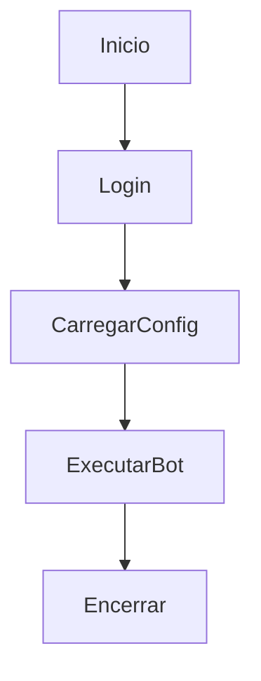

---

## Sequence Diagram

Representa comunicação entre objetos.

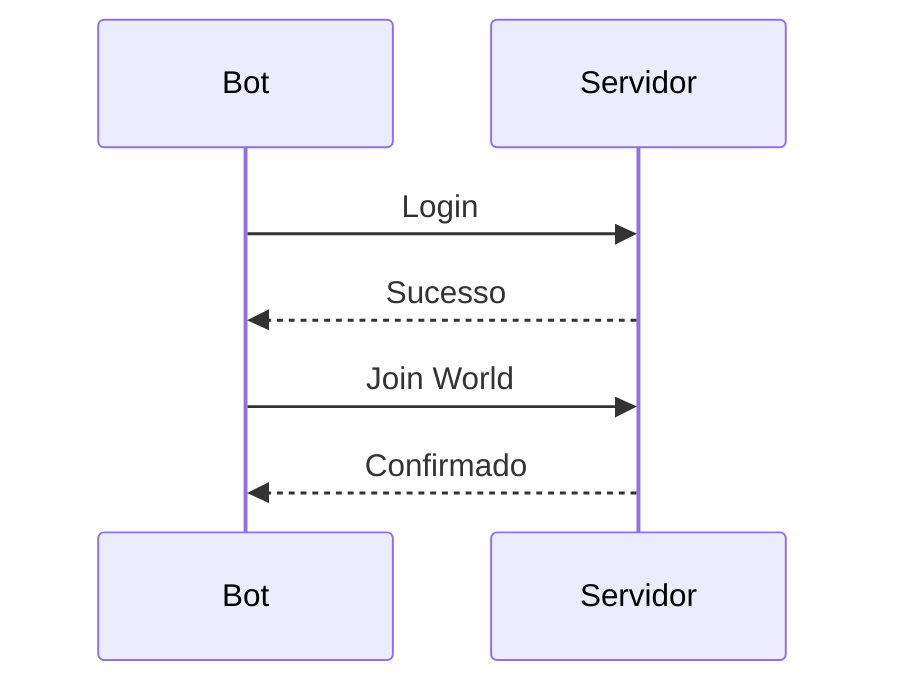

---

## Class Diagram

Representa estrutura de classes.

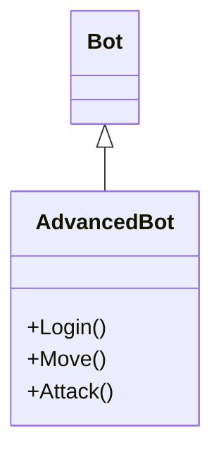

---

## State Diagram

Representa máquinas de estados.

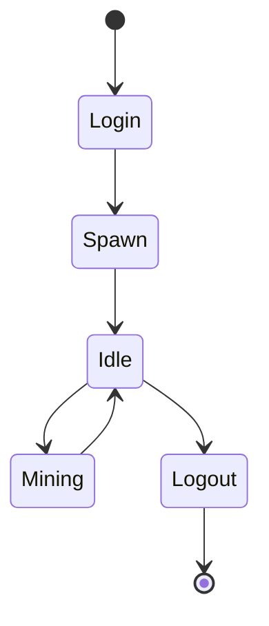

---

## Entity Relationship

Representação de entidades.

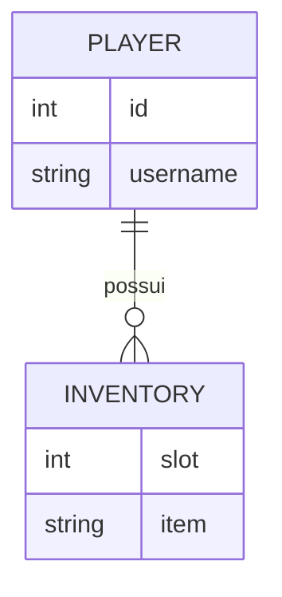

---

## Git Graph

Fluxo de branches.

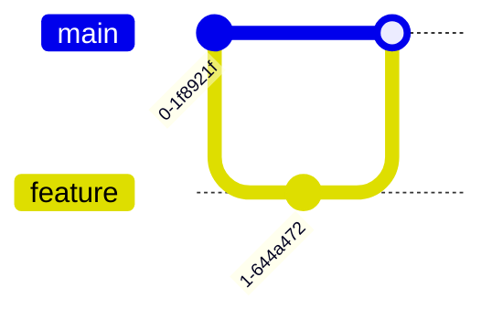

---

## Journey

Fluxo de uso.

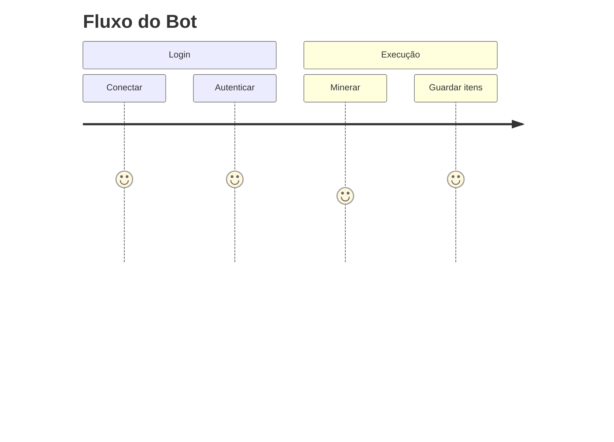

---

## Timeline

Linha temporal.

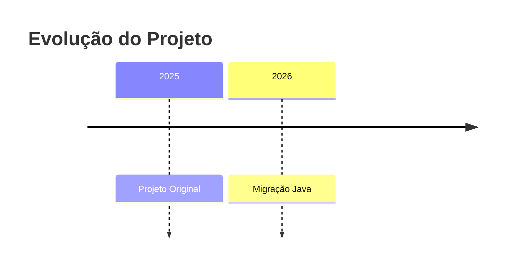

---

## Requirement Diagram

Representação de requisitos.

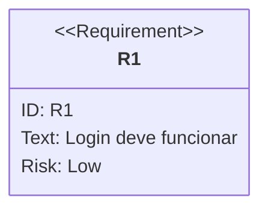

---

# Diagramas obrigatórios do projeto

Durante a migração deverão existir diagramas para:

- Arquitetura geral
- Estrutura dos módulos
- Fluxo do login
- Fluxo da conexão
- Fluxo dos pacotes
- Fluxo das Threads
- Fluxo de IA
- Fluxo de mineração
- Fluxo de pesca
- Fluxo de combate
- Fluxo do inventário
- Fluxo dos comandos
- Máquina de estados de cada Macro
- Máquina de estados do Bot
- Arquitetura Java
- Arquitetura C#
- Comparação entre arquiteturas

---

# Organização dos Diagramas

Cada documento poderá conter vários diagramas.

Exemplo:

```
01-Arquitetura.md

Arquitetura Geral

Mermaid

Arquitetura dos Bots

Mermaid

Arquitetura dos Serviços

Mermaid
```

---

# Granularidade

Preferir vários diagramas pequenos ao invés de um extremamente grande.

Correto:

- Login
- Spawn
- Navegação
- Combate

Errado:

Um único diagrama contendo toda aplicação.

---

# Tamanho máximo recomendado

Cada diagrama deverá possuir aproximadamente:

- até 30 nós
- até 50 conexões

Caso ultrapasse:

dividir em múltiplos diagramas.

---

# Orientação

Fluxogramas:

Preferencialmente:

```
Top Down
```

```mermaid
flowchart TD
```

Quando necessário:

```
Left Right
```

```mermaid
flowchart LR
```

---

# Nomeação dos nós

Utilizar nomes claros.

Correto

```
Carregar Configuração
```

```
Validar Login
```

```
Iniciar Bot
```

Errado

```
A
```

```
Processo1
```

```
Etapa2
```

---

# Nomeação de Estados

Sempre utilizar verbos.

Exemplo

```
Conectando
```

```
Minerando
```

```
Pescando
```

```
Guardando Itens
```

---

# Fluxos de decisão

Sempre explicitar decisões.

Correto

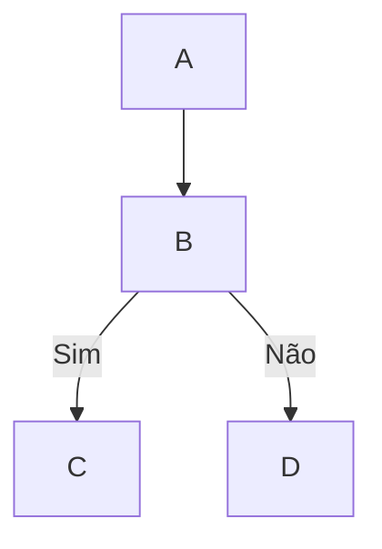

Nunca deixar decisões implícitas.

---

# Fluxos de erro

Todo fluxo importante deverá representar tratamento de erro.

Exemplo

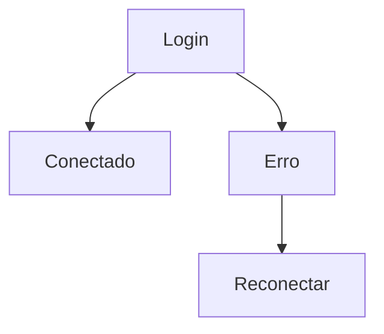

---

# Loops

Loops devem ser representados claramente.

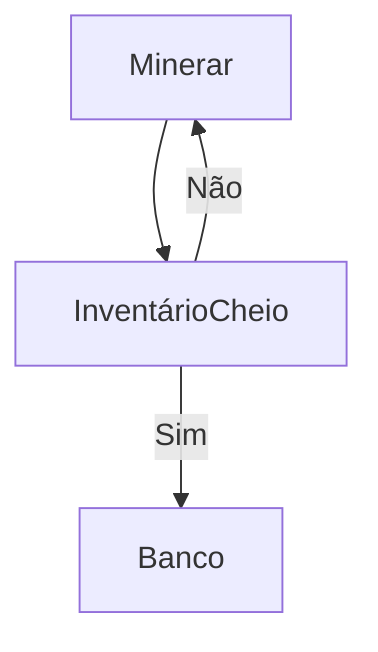

---

# Estados finais

Sempre indicar finalização.

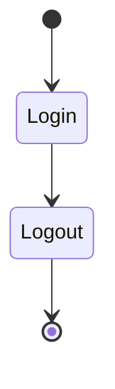

---

# Identificação dos Componentes

Sempre utilizar nomes reais.

Exemplo

```
Session

PacketHandler

InventoryManager

MiningMacro

ConnectionService

NavigationService
```

Evitar nomes genéricos.

---

# Separação por Camadas

Sempre representar:

```
Interface

↓

Serviços

↓

Domínio

↓

Infraestrutura
```

---

# Comparações C# x Java

Sempre utilizar diagramas paralelos.

Exemplo

```
Arquitetura C#

↓

Arquitetura Java

↓

Diferenças
```

---

# Atualização Obrigatória

Sempre atualizar diagramas quando houver:

- alteração arquitetural
- nova classe importante
- mudança de fluxo
- novo módulo
- remoção de módulo
- refatoração significativa

Nenhuma alteração estrutural poderá ficar sem atualização do diagrama correspondente.

---

# Relação com Outros Documentos

Os diagramas devem estar alinhados com:

- 01-Visao-Geral.md
- 02-Arquitetura.md
- 03-Estrutura-do-Repositorio.md
- 04-Checklist-Mestre.md
- 05-Procedimento-Operacional.md
- 06-Definition-of-Done.md
- 07-Controle-de-Decisoes.md
- 08-Registro-de-Sessoes.md
- 09-Metricas-do-Projeto.md
- 10-Protocolo-de-Uso-com-IA.md
- 11-Guia-de-Documentacao.md
- 12-Guia-de-Nomenclatura.md
- 13-Matriz-de-Rastreabilidade.md
- 14-Glossario.md
- 15-Padroes-de-Codigo.md
- 16-Fluxo-de-Trabalho.md

---

# Checklist para criação de Diagramas

Antes de considerar um diagrama concluído verificar:

- Fluxo completo representado.
- Componentes nomeados corretamente.
- Decisões identificadas.
- Estados finais presentes.
- Fluxos de erro documentados.
- Loops identificados.
- Nomenclatura padronizada.
- Compatível com Mermaid atual.
- Fácil leitura.
- Atualizado conforme implementação.
- Correspondente ao código-fonte.
- Referenciado na documentação relacionada.

---

# Boas Práticas

- Um objetivo por diagrama.
- Evitar excesso de cruzamentos.
- Preferir simplicidade.
- Manter consistência visual.
- Utilizar nomes completos.
- Evitar abreviações desnecessárias.
- Atualizar diagramas junto com o código.
- Versionar alterações relevantes.
- Garantir sincronização entre código, documentação e diagramas.

---

# Definition of Done

Um conjunto de diagramas Mermaid será considerado concluído quando:

- Todos os fluxos críticos estiverem documentados.
- A arquitetura estiver representada.
- Os módulos principais possuírem diagramas próprios.
- As máquinas de estados estiverem completas.
- Os diagramas refletirem fielmente a implementação atual.
- A documentação relacionada estiver atualizada.
- Os diagramas forem legíveis, consistentes e revisados tecnicamente.