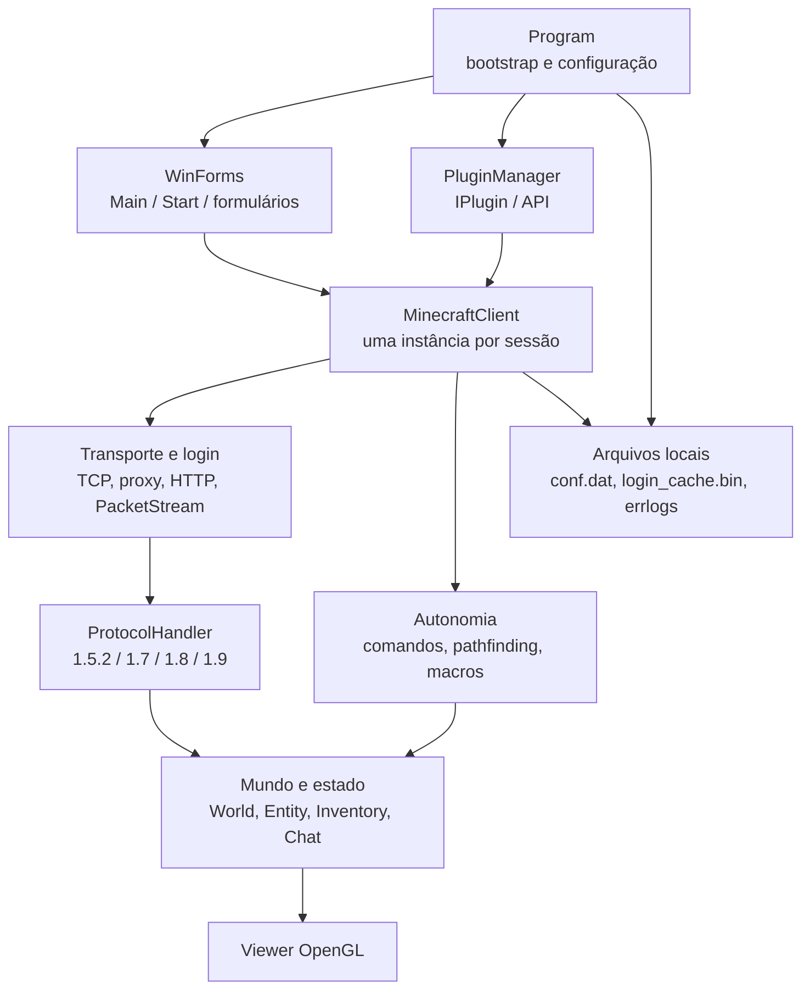

# Arquitetura técnica — AdvancedBot 2.4.5

Este é o documento-mestre da engenharia reversa. Ele organiza toda a documentação disponível no diretório `docs`, mostra como os subsistemas se conectam e aponta a fonte detalhada de cada parte. É uma descrição do comportamento legado C#; não propõe alteração de código.

## Escopo da aplicação

O AdvancedBot é um cliente desktop WinForms, x86, .NET Framework 4.6.2, que mantém uma ou mais sessões Minecraft. Cada sessão possui cliente, mundo local, jogador, inventário, comandos e automações próprios. O processo, contudo, mantém configuração, UI principal, plugins e algumas opções como estado estático compartilhado.

As versões de protocolo implementadas são Minecraft 1.5.2, 1.7, 1.7.10, 1.8 e 1.9. A solução contém um único projeto executável, `AdvancedBot_Crack.csproj`; diretórios como `AdvancedBot.Client.*` são namespaces/pastas de código, não projetos compilados separadamente.

## Mapa de componentes

## Fluxo de execução completo

1. `Program.Main` configura pool de threads, handlers globais de exceção, afinidade de CPU e WinForms.
2. Instancia `Main`, cria/inicializa `PluginManager`, carrega `conf.dat` e chama `Main.CheckKey()`.
3. O usuário inicia sessões; para cada uma é criado/configurado um `MinecraftClient`.
4. A sessão autentica com Mojang quando recebe e-mail, opcionalmente usa proxy e abre TCP para o servidor Minecraft.
5. A sessão envia handshake e login; o fluxo de login pode ativar compressão e criptografia AES.
6. O handler selecionado pela versão interpreta os pacotes de jogo e atualiza mundo, entidades, chat, inventário e estado de jogador.
7. No tick, a sessão descarrega saída, processa automações, pathfinding, física/movimento, keep-alive e reconexão.
8. O viewer e a interface leem o estado local; plugins recebem callbacks de conexão, tick, chat e saída de pacote.

## Fronteiras arquiteturais

| Camada observada | Responsabilidade | Acoplamentos relevantes |
|---|---|---|
| Processo/bootstrap | ciclo de vida WinForms, configuração global, logs e plugins. | `Program` é estático e alcançado por UI, filas e plugins. |
| Interface | entrada do operador, lista de clientes, formulários e visualização. | chama diretamente cliente/comandos; não existe camada de aplicação independente. |
| Sessão | estado e ciclo de vida de uma conexão Minecraft. | `MinecraftClient` contém rede, modelo, automação e parte da política de reconexão. |
| Transporte | socket, proxy, HTTP, framing, compressão e cifra. | entrega `ReadBuffer` diretamente ao cliente/handler. |
| Protocolo | conversão versão-específica de bytes para mutações de modelo e de `IPacket` para bytes. | handlers conhecem mundo, jogador, inventário e fila. |
| Modelo local | representação parcial do mundo Minecraft: chunks, blocos, entidades, inventário, chat. | é mutado por callbacks de rede, ticks, IA e viewer. |
| IA/automações | decisões reativas e macros por tick. | escreve diretamente caminho, movimento, rotação, hotbar e ações. |
| Extensibilidade | plugins e scripts. | recebe objetos concretos e pode observar/alterar fluxo de sessão. |
| Persistência | NBT de configuração, cache de login e arquivos de erro. | caminhos relativos ao diretório de execução; falhas são frequentemente silenciosas. |

## Máquinas de estado principais

| Máquina | Estados essenciais | Documento de referência |
|---|---|---|
| Processo | não inicializado → UI/plugins → configuração → loop WinForms → encerrado. | [Bootstrap](02-Bootstrap.md) |
| Sessão/login | preparar → autenticar/ping → conectar → login → criptografia opcional → play → encerrado/reconectar. | [Rede](04-Rede/README.md) |
| Transporte moderno | acumulando bytes → frame completo → descomprimindo opcionalmente → entrega ao handler → próxima leitura; erro → desconectado. | [Rede](04-Rede/README.md) |
| Pathfinding | rota inexistente → A* → rota parcial/completa → seguir waypoint → concluir/reindexar. | [IA](17-IA-do-Bot.md) |
| Mineração | `Finished` ↔ `Breaking`, com timeout de 15 s. | [IA](17-IA-do-Bot.md) |
| Macros | estados explícitos de pesca e mob, mais recuperação por chat/desconexão. | [IA](17-IA-do-Bot.md) |

## Documentação detalhada disponível

| Área | Documento | Status | Conteúdo |
|---|---|---|---|
| Vocabulário | [00-Glossario.md](00-Glossario.md) | ✅ completo | termos do domínio. |
| Arquitetura inicial | [01-Arquitetura-Geral.md](01-Arquitetura-Geral.md) | ✅ completo | visão panorâmica do legado. |
| Bootstrap | [02-Bootstrap.md](02-Bootstrap.md) | ✅ completo | especificação completa de `Program`: ordem de inicialização, configuração NBT, eventos, logs e viewer de teste. |
| Core / MinecraftClient | [03-Core/Bot.md](03-Core/Bot.md) | ✅ completo | orquestrador de sessão: estado, máquina de estados, Tick, reconexão, authme, acoplamentos. |
| Rede e protocolo | [04-Rede/README.md](04-Rede/README.md) | ✅ completo | classes, sockets, proxy, login, serialização, framing, handlers 1.5.2/1.7/1.8/1.9, chat, movimento e inventário. |
| Mundo e chunks | [05-Protocolo-Minecraft/Mundo.md](05-Protocolo-Minecraft/Mundo.md) | ✅ completo | World, Chunk, ChunkSection, BlockUtils, RayCast, GetCollisionBoxes, sincronização. |
| Entidades e física | [06-Entidades/README.md](06-Entidades/README.md) | ✅ completo | Entity (física completa), AABB, MPPlayer, EntityMob, EntityManager, Vec3d/i. |
| Inventário | [07-Inventario/README.md](07-Inventario/README.md) | ✅ completo | Inventory, ItemStack, Click, DropItem, mapeamento de slots, pacotes, relação com IA. |
| Eventos e callbacks | [08-Eventos/README.md](08-Eventos/README.md) | ✅ completo | PacketStream events, World.OnBlockChange, PluginManager callbacks, eventos globais. |
| Comandos | [09-Comandos/README.md](09-Comandos/README.md) | ✅ completo | ICommand, CommandManagerNew, catálogo de 30 comandos, fluxo de dispatch, relação com IA. |
| Scripts e macros | [10-Macros/README.md](10-Macros/README.md) | ✅ completo | engine própria, Jint JS, funções nativas, CommandScript, threading. |
| Macros Solk (pesca/mob) | [17-IA-do-Bot.md](17-IA-do-Bot.md) | ✅ completo | máquinas de estados completas de CommandPesca, CommandPescaV2, CommandMob. |
| Plugins | [11-Plugins/README.md](11-Plugins/README.md) | ✅ completo | IPlugin, PluginManager, ciclo de vida, hot-reload, .abp, sincronização. |
| Interface | [12-Interface/README.md](12-Interface/README.md) | ⚠️ esboço | WinForms/viewer — requer expansão. |
| Configuração | [13-Configuracao/README.md](13-Configuracao/README.md) | ⚠️ esboço | conf.dat NBT — requer expansão. |
| Bypass de anti-cheat | [14-Infraestrutura/Bypass.md](14-Infraestrutura/Bypass.md) | ✅ completo | Sunshine\|AC (RaizlandiaSpoofer), SkySurvival captcha, WorldCraftBP. |
| Testes | [15-Testes/README.md](15-Testes/README.md) | ⚠️ esboço | ausência de testes — requer expansão. |
| IA do bot | [17-IA-do-Bot.md](17-IA-do-Bot.md) | ✅ completo | decisões, prioridades, A*, AutoMiner, macros Solk. |
| Destino Java | [16-Arquitetura-Java.md](16-Arquitetura-Java.md) | ⚠️ esboço | proposta de destino — requer consolidação. |
| Inventário de código | [anexos/Inventario-de-Codigo.md](anexos/Inventario-de-Codigo.md) | ⚠️ esboço | catálogo de código próprio. |

## Regras de migração que preservam o comportamento

- A unidade funcional é a sessão: estado de mundo, jogador, inventário, caminho e macro deve ser isolado por cliente.
- A unidade de compatibilidade é o protocolo por versão: campos, IDs, serialização, ordem e efeitos dos handlers não devem ser generalizados antes de estarem cobertos por testes de contrato.
- A ordem de inicialização é observável: plugins são inicializados antes da leitura de configuração e da verificação de chave.
- A ordem de efeitos no tick também é observável: automações não têm arbitrador global e podem concorrer por movimento, rotação, caminho e hotbar.
- Falhas silenciosas de leitura/gravação de configuração, cache e automação fazem parte do comportamento atual. Uma reescrita pode melhorar observabilidade, mas a mudança de resultado deve ser explicitamente testada.
- O código legado mistura threads de UI, callbacks assíncronos, threads de rede e tasks. A reescrita Java deve definir uma estratégia de serialização por sessão sem alterar a ordem de aplicação de pacotes e decisões.

## Cobertura atual e continuidade

### Módulos completamente documentados ✅

- **Bootstrap** (`Program`): inicialização, configuração NBT, eventos globais, viewer de teste.
- **Rede e protocolo** (`MinecraftClient`, `PacketStream`, `PacketQueue`, `ReadBuffer`/`WriteBuffer`, `Proxy`, `SessionUtils`, handlers 1.5.2/1.7/1.8/1.9, todos os `IPacket`).
- **MinecraftClient / Core** (`Bot.md`): estado completo, máquina de estados, Tick, reconexão, authme.
- **Mundo e mapa** (`World`, `Chunk`, `ChunkSection`, `BlockUtils`, `HitResult`).
- **Entidades e física** (`Entity`, `AABB`, `MPPlayer`, `EntityMob`, `EntityManager`, `Vec3d/i`).
- **Inventário** (`Inventory`, `ItemStack`, `InventoryType`, pacotes de inventário).
- **Eventos e callbacks** (todos os delegados, ordem de dispatch, concorrência).
- **Comandos** (ICommand, CommandManagerNew, todos os 30 comandos).
- **Scripts e macros** (engine própria, Jint JS, CommandScript).
- **Macros Solk** (CommandPesca, CommandPescaV2, CommandMob, CommandMobPlus, CommandMobTeleport).
- **Plugins** (IPlugin, PluginManager, hot-reload, .abp).
- **IA do bot** (A*, PathGuide, AutoMiner, agentes reativos).
- **Bypass** (RaizlandiaSpoofer / Sunshine|AC, SkySurvival captcha).

### Módulos que requerem expansão ⚠️

- **Interface WinForms** (`12-Interface/`): `Main.cs`, `Start.cs`, `MacroEditor.cs`, `MinerOptions.cs`, `ProxyForm.cs`, `Spammer.cs` — formulários com lógica de negócio embutida.
- **Viewer OpenGL** (`AdvancedBot.Viewer`, `AdvancedBot.Viewer.Gui`): renderer de chunks, `ViewForm`, `ChunkRenderer`, `WorldRenderer`.
- **Configuração** (`13-Configuracao/`): detalhar todas as chaves NBT, defaults e comportamento de getters/setters.
- **Destino Java** (`16-Arquitetura-Java.md`): consolidar proposta final com base em todos os módulos documentados.
- **NBT** (`AdvancedBot.Client.NBT`): `CompoundTag`, `NbtIO`, tags — usado em configuração, ItemStack e World.
- **Crypto** (`AdvancedBot.Client.Crypto`): `CryptoUtils`, `AesStream` — já descrito em Rede mas sem documento próprio.
- **ProxyChecker** (`AdvancedBot.ProxyChecker`): verificação de proxies — módulo independente.
- **AccountChecker** (`AdvancedBot.AccountChecker`): verificação de contas — módulo independente.
- **Testes** (`15-Testes/`): estratégia de testes de contrato para migração Java.
