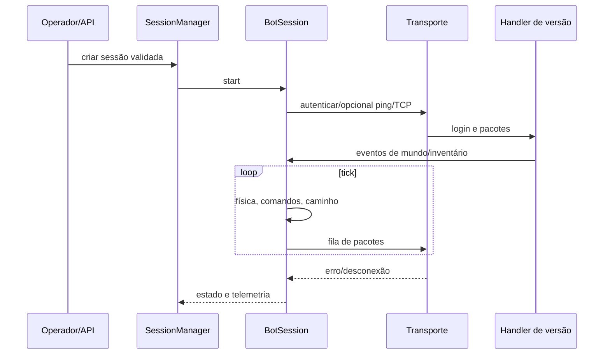

# Sequência de uma sessão

```mermaid
sequenceDiagram
 participant U as Operador/API
 participant M as SessionManager
 participant B as BotSession
 participant T as Transporte
 participant H as Handler de versão
 U->>M: criar sessão validada
 M->>B: start
 B->>T: autenticar/opcional ping/TCP
 T->>H: login e pacotes
 H->>B: eventos de mundo/inventário
 loop tick
 B->>B: física, comandos, caminho
 B->>T: fila de pacotes
 end
 T-->>B: erro/desconexão
 B-->>M: estado e telemetria
```
